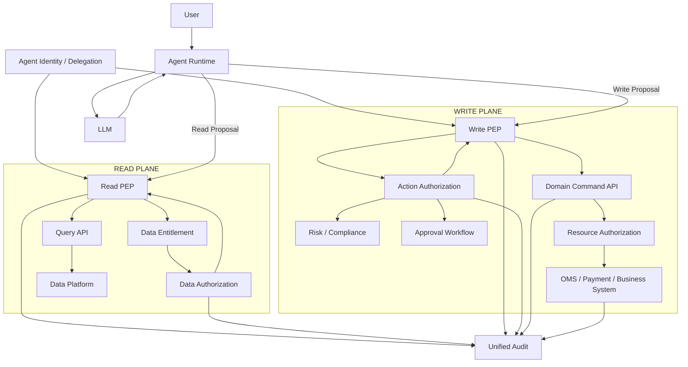

# AI Agent 的 Read 与 Write 为什么应该完全区别对待，具体实现该如何做

**——从数据访问、Action Authorization 到金融业务执行边界**

**截至 2026 年 9 月 20 日**

## 摘要

在传统系统里，Read 与 Write 往往只是 API 的两个 HTTP Verb：

```text
GET  → Read
POST → Write
PUT  → Write
DELETE → Write
```

但在 AI Agent 中，Read 与 Write 不应该只是接口层面的技术区别，而应该成为**两套明显不同的安全控制模型**。

原因并不复杂：

> **Read 主要改变“Agent 知道什么”；Write 主要改变“企业世界发生了什么”。**

Read 的主要风险通常是：

```text
Confidentiality
Privacy
Data Entitlement
Information Leakage
Cross-Tenant Access
```

Write 的风险则进一步增加：

```text
Integrity
Business State
External Side Effect
Financial Loss
Operational Disruption
Irreversibility
Regulatory Consequence
```

而 Agent 与传统程序的关键差异在于：**它会自主决定什么时候调用哪个 Tool，以及用什么参数调用。**

Microsoft 2026 年的 Agent Least Privilege 指导因此明确建议，把 Read 与 Write 分开建模：例如把“证据收集”与“修复动作”使用不同的角色或工具，并对 delete、export、privilege change 等高影响操作采用 step-up approval；同时建议按 Resource、Data、Operation 分别进行 Scope。

这并不意味着：

> “所有 Read 都低风险，所有 Write 都高风险。”

这是一个同样危险的过度简化。

现实中：

```text
Read customer portfolio
```

可能涉及极高敏感度的客户数据；

而：

```text
Write internal draft
```

可能只是在沙箱中创建一个临时对象。

因此真正应该区分的是：

> **Read 的核心是信息访问；Write 的核心是状态变更和副作用。**

更准确的安全模型是：

```text
Read
    = Can this Agent observe this data?

Write
    = Can this Agent cause this state transition?
```

前者主要解决：

```text
Confidentiality
+
Data Entitlement
+
Information Flow
```

后者主要解决：

```text
Integrity
+
Authorization
+
Business Rules
+
Risk
+
Approval
+
Transaction Control
```

对于金融 Agent，这种区别尤其重要。IMF 2026 年关于 Agentic Payments 的研究明确提出，把 Agent 的 **Intent / Orchestration、Authorization / Control、Settlement** 分开，原因正是 Agent 的概率性决策与金融支付系统要求的确定性授权和最终结算之间存在根本差异。

因此，本文的核心结论是：

> **Read 与 Write 应该共享同一套 Identity / Policy 基础设施，但拥有不同的 Permission Model、Execution Path、Validation、Approval、Audit 和 Failure Handling。**

尤其在金融 Agent 中：

> **Read 可以让 Agent“知道”；Write 必须经过独立、确定、可审计的控制后才能让企业“发生”。**

---

# 1. 为什么 Agent 时代 Read / Write 的区别变得更重要

传统应用的执行路径大多是确定的：

```text
User
  ↓
Application Code
  ↓
Known API
  ↓
Database
```

而 Agent：

```text
User
  ↓
Agent Runtime
  ↓
LLM
  ↓
Tool Selection
  ↓
Tool Parameters
  ↓
Tool Chain
  ↓
External Side Effect
```

模型可能动态决定：

```text
先读什么
再读什么
调用哪个 API
是否继续调用
是否修改数据
是否发送消息
是否执行下一步
```

Microsoft 明确指出，Agent 可以跨多个系统连续调用 Tool，而单个权限看起来合理时，组合之后可能产生更大的有效权限；其 2026 年 Least Privilege 指导特别把未经授权的 Write、Delete、Export 与权限提升列为需要重点约束的风险。

因此：

```text
Read
```

和：

```text
Write
```

不再只是：

```text
GET vs POST
```

而是：

```text
Observe World
vs
Change World
```

这是架构设计的根本区别。

---

# 2. 第一原则：Read 与 Write 应该“完全区别对待”，但不是完全分裂

“完全区别对待”如果理解成：

```text
Read Platform
Write Platform
```

两套互不相关的 Identity、Policy、Audit 系统，实际上会造成重复和治理困难。

正确理解应该是：

```text
                         Common Security Foundation
                                  │
                    ┌─────────────┴─────────────┐
                    │                           │
                 READ PATH                   WRITE PATH
                    │                           │
             Data Authorization        Action Authorization
                    │                           │
             Data Entitlement         Business / Risk Policy
                    │                           │
             Mask / Filter            Approval / Step-up
                    │                           │
             Read Execution           Commit / Transaction
```

共同基础包括：

```text
Identity
Delegation
Policy Engine
Audit
Revocation
Risk Classification
```

但进入具体执行阶段以后，Read 与 Write 应采用**不同的安全策略**。

可以把它理解为：

> **Shared Control Plane, Separate Execution Semantics**

这比“所有 Tool 都走同一套权限”更合理。

---

# 3. Read 的安全问题是什么

Read 的核心问题：

> **Agent 是否应该看到这个数据？**

例如：

```text
portfolio.read
customer.read
research.read
email.read
transaction.read
```

需要判断：

```text
Who?
Which Resource?
Which Tenant?
Which Data Class?
Which Fields?
For What Purpose?
For How Long?
```

所以 Read Authorization 更接近：

```text
Principal
+
Resource
+
Data Entitlement
+
Context
```

Cedar 的授权模型就是类似的 PARC 模型：

```text
P = Principal
A = Action
R = Resource
C = Context
```

Authorizer 针对具体请求返回 Allow / Deny。

因此：

```text
portfolio.read = ALLOW
```

本身并没有完整意义。

真正应该判断：

```text
Agent A
may read
Portfolio P123
for User U456
within Tenant T1
with sensitivity <= Confidential
```

---

# 4. Write 的安全问题更进一步

Write 的问题不是：

> “可以看到什么？”

而是：

> **“谁可以让什么状态发生变化？”**

例如：

```text
trade.submit
payment.execute
client.update
case.approve
vote.submit
document.publish
email.send
order.cancel
```

Write Authorization 应该至少包含：

```text
Principal
+
Action
+
Resource
+
Parameters
+
Business State
+
Risk
+
Approval
+
Time
```

例如：

```json
{
  "principal": "investment-agent-17",
  "action": "trade.submit",
  "resource": "portfolio-842",
  "parameters": {
    "symbol": "7203.T",
    "side": "SELL",
    "quantity": 1000,
    "notional": 420000
  },
  "context": {
    "purpose": "approved_rebalance",
    "riskStatus": "PASS",
    "approvalStatus": "APPROVED"
  }
}
```

这和：

```json
{
  "principal": "investment-agent-17",
  "action": "portfolio.read",
  "resource": "portfolio-842"
}
```

显然不是同一个安全问题。

---

# 5. Read 影响“知识”，Write 影响“现实”

这是设计 Read / Write 安全边界最有用的一种思维方式。

## Read

```text
Database
    ↓
Agent
    ↓
Knowledge
```

主要影响：

```text
Agent knows X
```

风险：

```text
data leakage
privacy breach
wrong information
cross-tenant exposure
```

## Write

```text
Agent
    ↓
Business API
    ↓
Database / OMS / Payment / External System
```

影响：

```text
World changes
```

风险：

```text
wrong transaction
wrong state
wrong customer communication
wrong payment
wrong trade
wrong approval
wrong deletion
```

所以：

> **Read 的安全边界应该围绕 Information Access；Write 的安全边界应该围绕 State Transition。**

---

# 6. Read 与 Write 最大的不同：失败模式不同

假设 Read 出错：

```text
Agent reads wrong portfolio
```

可能出现：

```text
Wrong Analysis
```

如果 Write 出错：

```text
Agent submits wrong order
```

可能出现：

```text
Actual Trade
Actual Loss
Actual Client Impact
```

因此两者的 Failure Handling 也应该不同。

### Read

更适合：

```text
Deny
Mask
Filter
Partial Result
Redacted Result
Ask User
```

### Write

除了：

```text
Deny
```

通常还需要：

```text
Require Approval
Validate
Preview
Dry Run
Commit
Rollback
Compensate
Idempotency
Concurrency Check
Circuit Breaker
```

这也是为什么金融系统中的 Write Path 通常应该比 Read Path 更复杂。

---

# 7. Read 不应该被当成“天然安全”

这是本文最重要的修正之一。

如果把 Read 理解成：

```text
Read = Safe
Write = Dangerous
```

这个结论是错误的。

例如：

```text
customer.read
```

可能暴露：

```text
姓名
地址
账户
资产
交易
税务
KYC
```

因此一个：

```text
read-only Agent
```

仍然可能造成严重数据泄露。

Microsoft 当前 Agent Least Privilege 指导明确指出，即使 Agent 最初只是 Reader，如果 Scope 没有限制，它仍然可能访问或汇总超出预期范围的敏感数据；其建议同时约束 Resource Boundary、Data Boundary 和 Operation Boundary。

因此：

> **Read 不意味着低风险；它意味着风险主要来自 Confidentiality，而不是 State Mutation。**

---

# 8. Write 也不应该简单等同于“危险”

同样：

```text
write = dangerous
```

也过度简化。

例如：

```text
create_draft_document
```

可能只是：

```text
Private Sandbox
```

而：

```text
update production pricing
```

明显是高风险 Write。

所以 Write 应进一步分类：

```text
Write
├── Draft
├── Internal Mutation
├── External Communication
├── Workflow State Change
├── Privileged Change
├── Financial Transaction
└── Irreversible / Destructive Action
```

安全强度逐渐增加。

---

# 9. 建议把 Action 分成四类，而不是只分 Read / Write

一个企业 Agent Platform 可以使用：

```text
R = Read
D = Draft / Reversible Write
C = Commit / External Side Effect
A = Administrative / Privileged
```

例如：

| 类型 | 示例                                  | 典型控制                     |
| -- | ----------------------------------- | ------------------------ |
| R  | portfolio.read                      | Data Entitlement         |
| D  | create_draft                        | Scope + Validation       |
| C  | send_email / submit_order           | Policy + Intent + Audit  |
| A  | change_permission / payment.release | Step-up + Approval + SoD |

这比单纯：

```text
Read / Write
```

更加适合 Agent。

---

# 10. Read Path 应该尽量是独立的 Query Plane

推荐：

```text
Agent
  ↓
Read Tool
  ↓
Query Gateway
  ↓
Data Entitlement
  ↓
Read API
  ↓
Data
```

而不是：

```text
Agent
  ↓
generic database.query
  ↓
database
```

因为后者很容易把：

```text
Read Permission
```

升级成：

```text
SELECT *
```

甚至：

```text
SELECT across every tenant
```

Microsoft 对 Agent 的建议明确强调，在 Read 场景也应该限制 Collection、Label、Sensitivity、Tenant 和 Resource Scope，并让下游系统再次验证授权。

因此：

> **Read Path 的 Least Privilege 应尽可能落在 Data Plane。**

---

# 11. 金融数据 Read 最好做到 Row / Column / Object Level

例如：

```text
portfolio.read
```

并不是简单的：

```text
database = ALLOW
```

而可以进一步：

```text
Client
Fund
Account
Portfolio
Security
Field
```

分层。

例如 Agent A：

```text
portfolio.read
Portfolio = P123
Fields = position, weight, market_value
```

但禁止：

```text
tax_id
bank_account
beneficial_owner
```

这就是：

> **Data Least Privilege**

比：

> **Database Least Privilege**

更加精细。

对于金融 Agent，这是一个比“有没有调用数据库”更重要的设计问题。

---

# 12. Read Path 最好支持 Masking，而不只是 Allow / Deny

例如：

```text
customer.read
```

不应该只有：

```text
ALLOW
DENY
```

可以采用：

```text
ALLOW_FULL
ALLOW_MASKED
ALLOW_AGGREGATED
ALLOW_REDACTED
DENY
```

例如：

```text
Account Number:
****1234

Tax ID:
***-**-1234
```

Agent 可以完成：

```text
risk analysis
```

但不能获得：

```text
full sensitive identifier
```

这在金融服务环境通常比简单 Deny 更实用。

---

# 13. Read Path 应特别防止“跨数据源拼接”

Agent 与传统用户最大的差异之一是：

```text
email.read
+
crm.read
+
portfolio.read
+
research.read
```

可以被模型自动组合。

Microsoft 2026 年明确指出，多系统中分别看起来合理的权限组合在 Agent 环境中可能产生更大的有效权限。

例如：

```text
CRM
   ↓
Client identity

Portfolio
   ↓
Assets

Research
   ↓
Sensitive analyst opinion

Email
   ↓
External contacts
```

每个 Read 都可能合法。

组合之后：

```text
Agent
   ↓
完整客户画像
```

可能已经超出任何一个业务系统原本设计的使用方式。

因此：

> **Read Least Privilege 必须考虑 Cross-System Aggregation。**

---

# 14. Write Path 则应该使用独立的 Command Plane

推荐：

```text
Agent
  ↓
Write Proposal
  ↓
Command Gateway
  ↓
Policy
  ↓
Business Validation
  ↓
Risk
  ↓
Approval
  ↓
Commit
```

而不是：

```text
Agent
  ↓
MCP Tool
  ↓
Database UPDATE
```

Write Path 应该进入：

> **Command / Transaction Plane**

而不是直接进入：

> **Data Plane**

---

# 15. Agent 不应该直接拥有 Database Write

最危险的模式之一：

```text
Agent
  ↓
database.update()
```

或者：

```text
Agent
  ↓
SQL
  ↓
UPDATE
```

因为 Agent 同时掌握：

```text
Intent
+
SQL
+
Target Resource
+
Mutation
```

这实际上把：

```text
Business Rule
Authorization
Transaction
```

全部交给 LLM 驱动的 Runtime。

更合理：

```text
Agent
  ↓
submit_trade()
  ↓
Trade Domain API
  ↓
Validate
  ↓
Authorize
  ↓
Risk
  ↓
Execute
```

Agent 只能提出：

```text
Action
```

而不能定义：

```text
最终数据库如何改变
```

---

# 16. Write Tool 应尽量表达“业务动作”，而不是“数据库动作”

坏：

```text
update_row(table, where, values)
```

好：

```text
submit_trade(order)
cancel_order(order_id)
create_payment(payment_request)
create_case(case)
approve_case(case_id)
submit_vote(vote_instruction)
```

原因是 Domain API 可以执行：

```text
Business Validation
Authorization
Risk Check
State Transition
Audit
```

而：

```text
database.update()
```

无法自然表达：

```text
Is this transition valid?
Has approval happened?
Is SoD satisfied?
Is this order still open?
```

---

# 17. Read Tool 可以更通用，Write Tool 应该更业务化

这是一条非常有价值的工程原则。

Read：

```text
search_research
get_portfolio
get_transaction
get_client
```

可以一定程度通用。

Write：

```text
submit_trade
release_payment
approve_case
publish_document
```

应该尽量：

```text
Narrow
Domain-specific
Parameter-constrained
Explicit
Auditable
```

例如：

```text
generic:
execute_sql()
```

通常不适合作为生产金融 Agent Write Tool。

而：

```text
submit_trade()
```

更容易建立：

```text
Policy
Validation
Risk
Approval
Audit
```

---

# 18. Write Action 应该分成“Prepare”和“Commit”

对于高风险操作，建议：

```text
Prepare
  ↓
Validate
  ↓
Review
  ↓
Commit
```

而不是：

```text
submit_trade()
```

直接产生交易。

例如：

```text
prepare_trade_rebalance()
```

输出：

```json
{
  "proposalId": "P-123",
  "orders": [
    {
      "symbol": "7203.T",
      "side": "SELL",
      "quantity": 1000
    }
  ],
  "estimatedValue": 420000,
  "riskImpact": "PASS"
}
```

然后：

```text
approve(P-123)
```

最后：

```text
commit(P-123)
```

这样就可以把：

```text
Agent Reasoning
```

和：

```text
Financial Commitment
```

分开。

IMF 对 Agentic Payments 提出的 Intent → Authorization → Settlement 三层架构，本质上就是这一思想的金融系统版本。

---

# 19. Write Path 应该有明确的 Transaction Boundary

例如：

```text
trade.submit
```

不应该只是：

```text
Tool Call = Success
```

应该形成：

```text
Proposal
→ Authorization
→ Validation
→ Risk
→ Approval
→ Reservation
→ Commit
→ Settlement
```

每一步都产生：

```text
Correlation ID
Transaction ID
Policy Decision
Actor
Delegation
Timestamp
```

这样才能回答：

> “Agent 到底提交了什么？”

而不是只有：

> “Agent 调用了 submit_trade。”

---

# 20. Write 参数应该成为 Policy 的一部分

例如：

```text
trade.submit
```

不是简单：

```text
ALLOW
```

而是：

```text
ALLOW IF
notional <= 500,000
market == JP
assetClass == Equity
riskStatus == PASS
approvalStatus == APPROVED
```

AWS AgentCore Policy 正在采用这一模型：Policy 在 Gateway 外部运行，对每个 Tool Invocation 进行评估，并可以使用 Tool 的输入参数作为策略上下文。

因此：

> **Write Authorization 必须尽量做到 Parameter-aware。**

---

# 21. Read 参数同样需要约束，但通常更偏向 Query Scope

例如：

```text
portfolio.read
```

需要：

```text
portfolioId
fields
dateRange
```

Policy 可以：

```text
portfolioId ∈ allowedPortfolios
dateRange <= 90 days
fields ⊆ allowedFields
```

而不只是：

```text
portfolio.read = true
```

区别在于：

```text
Read:
限制“看哪里、看什么、看多少”

Write:
限制“改变什么、改变多少、在什么条件下改变”
```

---

# 22. Write 应该使用独立 Credential / Token Scope

不推荐：

```text
Agent
  ↓
One Token
  ↓
Read + Write + Admin
```

推荐：

```text
Agent
  |
  +── Read Token
  |      ↓
  |   Query APIs
  |
  └── JIT Write Token
         ↓
      Command API
```

Write Token：

```text
short-lived
task-scoped
resource-scoped
audience-bound
revocable
```

Microsoft 当前 Agent Least Privilege 指导明确建议稳定 Agent Identity + JIT Entitlements，而不是为每个任务创建新身份；高权限只在具体 Workflow 期间存在。

---

# 23. Read Credential 可以长期存在，但 Write Credential 更适合短期

不是说 Read 权限可以永久存在。

而是：

> **Write 的 Standing Privilege 风险通常更高，因此更值得优先消除。**

例如：

```text
Read:
portfolio.read
```

可能长期存在，但仍有：

```text
scope
expiration
revocation
audit
```

而：

```text
trade.submit
```

最好：

```text
JIT
10 min
specific portfolio
specific purpose
specific amount
```

这可以显著减少：

```text
Privilege Window
```

---

# 24. Write 应该有更高的 Audit 强度

Read Audit：

```text
Agent
resource
fields/classification
timestamp
purpose
```

Write Audit：

```text
Agent
acting-for user
delegation
action
resource
parameters
policy version
risk result
approval
before state
after state
transaction ID
timestamp
correlation ID
```

例如：

```json
{
  "actor": "agent-17",
  "onBehalfOf": "user-382",
  "action": "trade.submit",
  "resource": "portfolio-842",
  "parameters": {
    "symbol": "7203.T",
    "quantity": 1000
  },
  "authorization": "ALLOW",
  "policyVersion": "trade-policy-42",
  "riskDecision": "PASS",
  "approval": "case-991",
  "transactionId": "tx-8321"
}
```

Microsoft 明确建议 Agent Audit 至少能够关联 Agent Identity、Role、Effective Scope、Resource、Action、“on behalf of” User、Timestamp 和 Correlation ID，并能重建 Orchestrator → Tool → Downstream System 的链路。

---

# 25. Read Audit 与 Write Audit 不能完全相同

Read：

```text
“谁看了什么？”
```

Write：

```text
“谁在什么授权下改变了什么？”
```

Write 审计应该能够支持：

```text
Before
↓
Decision
↓
Commit
↓
After
```

尤其金融系统需要：

```text
Non-repudiation
```

以及：

```text
Reconciliation
```

而不应该只保存：

```text
LLM transcript
```

---

# 26. Write 应使用 Idempotency

这是 Agent 场景非常容易忽略的问题。

LLM / Runtime 可能：

```text
timeout
retry
re-plan
duplicate tool call
```

例如：

```text
payment.execute()
```

第一次：

```text
network timeout
```

Agent 不知道是否成功，于是再次调用：

```text
payment.execute()
```

可能造成：

```text
double payment
```

因此 Write API 应该支持：

```text
idempotency key
```

例如：

```text
taskId + actionId + resourceId
```

这样：

```text
same logical command
```

不会变成：

```text
multiple financial effects
```

这类机制不是 AI 专属，但在 Agent 的动态重试模式下尤其重要。

---

# 27. Write 应使用 Optimistic Concurrency

金融 Agent 的 Read 与 Write 之间可能存在时间差。

例如：

```text
09:00
Agent reads:
Position = 10,000
```

Agent 计算：

```text
Sell = 1,000
```

但：

```text
09:01
Human trader changes:
Position = 8,000
```

Agent 在：

```text
09:02
```

继续执行：

```text
Sell 1,000
```

可能已经过时。

因此 Write API 应支持：

```text
version
etag
sequence
lastUpdatedAt
```

例如：

```text
commitTrade(
  proposalId,
  expectedPortfolioVersion = 42
)
```

如果：

```text
currentVersion = 43
```

则：

```text
REJECT
```

要求重新计算。

---

# 28. Write 最好支持 Dry Run / Preview

对于高风险 Agent：

```text
Agent
  ↓
Preview
```

输出：

```text
What will change?
What data?
What amount?
What counterparties?
What downstream systems?
```

用户或 Policy 再：

```text
Approve
```

然后：

```text
Commit
```

特别适合：

```text
trade
payment
client update
document publishing
bulk operation
```

---

# 29. “Write”最重要的不是 Confirm，而是 Transaction Binding

仅仅弹出：

```text
Approve?
```

是不够的。

必须确认：

```text
Approve WHAT?
```

例如：

```text
Trade:
BUY 1,000 shares
7203.T
Portfolio P123
Notional ¥420,000
```

批准后：

```text
Agent
```

不能把参数改变成：

```text
BUY 100,000 shares
```

否则：

```text
Human Approval
```

只是给 Agent 一个：

```text
unbounded permission
```

而不是给：

```text
specific transaction
```

Mastercard 2026 年推出 Verifiable Intent 的核心理念正是把：

```text
Identity
+
Intent
+
Action
```

关联起来，并形成可验证、抗篡改的授权记录。

---

# 30. Read 可以自动化，Write 应更多采用分级自主性

推荐把 Agent 自主性分成：

```text
Observe
Advise
Act with Approval
Act Autonomously
```

其中：

### Observe

```text
Read-only
```

### Advise

```text
Read-only
+
Generate Proposal
```

### Act with Approval

```text
Read
+
Write
+
Approval
```

### Autonomous

```text
Write
+
Policy
+
Strong Constraints
+
Continuous Monitoring
+
Rollback / Compensation
```

这种分层比简单：

```text
Agent = allowed / denied
```

更加符合实际治理。

需要注意：这是架构分类，而不是某个监管机构已经规定的统一标准。

---

# 31. Read Agent 与 Write Agent 最好不是同一个权限角色

例如：

```text
ResearchAgent
```

只能：

```text
read.research
read.portfolio
read.market
```

另一个：

```text
ExecutionAgent
```

可以：

```text
read.position
submit.trade
```

但：

```text
ExecutionAgent
```

不应该自动拥有：

```text
research.admin
client.delete
payment.execute
```

而且：

```text
ResearchAgent
```

最好不能直接调用：

```text
trade.submit
```

这样即使 Research Agent 被 Prompt Injection：

```text
Web
↓
Research Agent
↓
Malicious instruction
```

它最多影响：

```text
Research Agent reasoning
```

却没有：

```text
trade.submit
```

这个能力面。

---

# 32. 这也是一种“Capability Separation”

可以建立：

```text
Read Capability
        ≠
Write Capability
```

例如：

```text
portfolio.read
```

不是：

```text
portfolio.manage
```

更不要使用：

```text
portfolio.admin
```

把两者打包。

可以进一步：

```text
portfolio.read
portfolio.propose_rebalance
portfolio.submit_rebalance
portfolio.approve_rebalance
```

拆成：

```text
Research
Proposal
Execution
Approval
```

这比：

```text
portfolio.write
```

精细得多。

---

# 33. Proposal 与 Commit 应该成为两个不同 Action

非常推荐：

```text
create_trade_proposal
```

和：

```text
commit_trade
```

完全不同。

例如：

```text
create_trade_proposal
```

可以允许：

```text
Research Agent
```

而：

```text
commit_trade
```

只能允许：

```text
Execution Agent
+
Valid Approval
```

这使得：

```text
Agent Reasoning
```

与：

```text
Business Commitment
```

形成清晰的信任边界。

---

# 34. Write 权限应该与 Workflow State 绑定

例如：

```text
OrderStatus:
DRAFT
```

允许：

```text
edit_order
```

但：

```text
OrderStatus:
APPROVED
```

只允许：

```text
execute_order
```

不允许：

```text
change_price
change_quantity
```

除非：

```text
re-approve
```

因此 Policy 可以是：

```text
ALLOW modify_order
WHEN status == DRAFT
```

而：

```text
DENY modify_order
WHEN status == APPROVED
```

这也是为什么：

> **Write Authorization 不能只依赖 IAM；它必须理解 Business State。**

---

# 35. Read 与 Write 的 Policy Context 也不同

### Read

主要需要：

```text
Principal
Resource
Data Classification
Tenant
Purpose
Fields
Time
```

### Write

通常还需要：

```text
Current State
Requested Transition
Parameters
Amount
Risk
Approval
SoD
Intent
Idempotency
Concurrency Version
```

因此 Write Policy 通常天然更加复杂。

Cedar 的模型支持对 Principal、Action、Resource 和 Context 进行授权条件判断；AWS AgentCore 也已经将 Tool Input Schema 映射为 Policy Context。

---

# 36. Read 可以更依赖 Cache，Write 不应该依赖过期授权

例如：

```text
Read Market Data
```

可以允许：

```text
5-minute cache
```

但：

```text
trade.submit
```

不能使用：

```text
5-minute-old approval
```

因为 Write 必须尽量接近：

```text
Current State
Current Policy
Current Risk
Current Approval
```

因此：

> **缓存策略本身也应该 Read / Write 分离。**

---

# 37. Read 可以允许 Eventual Consistency，Write 对关键状态通常要求 Stronger Consistency

例如：

```text
Research Data
```

允许：

```text
eventual consistency
```

而：

```text
Cash Balance
Order State
Approval State
Position
```

在 Commit 前需要读取更可信的当前状态。

例如：

```text
Agent reads:
cash = $1m
```

但实际：

```text
cash = $700k
```

如果直接执行支付：

```text
PAYMENT = $900k
```

就会出现风险。

因此 Write Path 在 Commit 前需要：

```text
re-read current state
```

---

# 38. Read 可以失败开放得更有限，Write 应更加倾向 Fail Closed

对于：

```text
research.search
```

如果 Policy Service 暂时不可用，可以根据业务决定：

```text
deny
```

或者：

```text
cached policy
```

但对于：

```text
payment.execute
trade.submit
```

不能因为：

```text
PDP timeout
```

就：

```text
ALLOW
```

通常应：

```text
FAIL CLOSED
```

即：

```text
unknown
→ do not commit
```

这是金融 Write Path 与普通 Read Path 非常重要的差异。

---

# 39. Write 应具有“不可绕过性”，Read 则更多关注“最小可见性”

Read 的核心目标：

```text
Agent should see no more than necessary.
```

Write 的核心目标：

```text
Agent should cause no more change than authorized.
```

因此：

```text
Read
→ Least Visibility

Write
→ Least Mutation
```

这是一个很好的架构语言。

---

# 40. Write 不应允许 Agent 直接构造最终状态

例如：

```json
{
  "status": "APPROVED"
}
```

让 Agent 提交：

```text
update_case(status=APPROVED)
```

非常危险。

更合理：

```text
request_approval(case)
```

然后：

```text
Approval Workflow
```

决定：

```text
APPROVED
```

然后 Domain Service 根据：

```text
Workflow State
```

执行状态迁移。

即：

> **Agent 可以请求状态转换，但不应自行定义权威业务状态。**

---

# 41. 这也是 Read / Write 与 Business State 的边界

Read：

```text
Agent reads:
status = APPROVED
```

Write：

```text
Agent requests:
execute approved transaction
```

但：

```text
Agent cannot say:
status = APPROVED
```

这让：

```text
Business State
```

仍属于：

```text
Workflow / Domain
```

而不是：

```text
Agent Memory
```

或：

```text
LLM Output
```

---

# 42. MCP 尤其应该区分 Read Tool 与 Write Tool

MCP Tool 定义包含：

```text
readOnlyHint
destructiveHint
idempotentHint
openWorldHint
```

但 MCP 官方规范明确规定，这些是 **hints**，不是可信的 Security Contract；客户端对于不可信 Server 提供的 annotations 不应据此直接做安全决策。

因此：

```json
{
  "name": "submit_trade",
  "annotations": {
    "readOnlyHint": true
  }
}
```

不能成为：

```text
Security fact
```

企业应该在 Registry 中维护：

```text
toolRiskClass
sideEffectClass
dataClassification
requiresApproval
```

并在实际执行时由：

```text
PEP
+
PDP
```

强制执行。

---

# 43. ReadOnlyHint 最多用于“风险提示”，不能用于最终权限

例如：

```text
readOnlyHint = true
```

可以用于：

```text
UI
Tool Grouping
Default Confirmation
Model Planning
Risk Heuristic
```

但不应该直接：

```text
bypass authorization
```

MCP 官方规范明确指出 Tool Annotations 可能并不真实反映实际 Tool 行为，因此不能成为安全决定的唯一依据。

---

# 44. 实际生产中最好把 Read Tool 与 Write Tool 分开注册

不要：

```text
customer_tool
```

里面同时提供：

```text
get_customer
update_customer
delete_customer
export_customer
```

更推荐：

```text
customer.read
customer.create_draft
customer.update
customer.delete
customer.export
```

然后：

```text
Read Agent
→ customer.read

Operations Agent
→ customer.read
→ customer.update

Admin Agent
→ customer.delete
```

这样：

```text
Tool Registry
```

本身就成为一个明确的 Capability Surface。

---

# 45. “Generic Tool”是 Agent Least Privilege 的最大敌人之一

以下工具尤其危险：

```text
execute_sql
execute_http
shell
browser
filesystem
run_script
send_raw_request
```

它们的特点是：

```text
Capability Breadth
```

极大。

例如：

```text
execute_sql
```

可能同时意味着：

```text
READ
WRITE
DELETE
DDL
```

如果 Agent 拥有这种 Tool，那么整个：

```text
Read / Write Separation
```

都被一个 Tool 打穿。

因此：

> **生产 Agent 应优先使用 Narrow Domain Tools，而不是 Generic Super Tools。**

---

# 46. 一个非常实用的设计：Read API 与 Command API 分离

例如：

```text
Query Plane
───────────
GET /portfolio
GET /positions
GET /risk
GET /research
```

与：

```text
Command Plane
─────────────
POST /trade-proposals
POST /trade-approvals
POST /trade-commit
```

完全分开。

Command API 再强制：

```text
Authorization
Risk
Approval
Idempotency
Concurrency
Audit
```

这就是传统企业架构里的：

> **Query / Command Separation**

Agent 反而更需要这种成熟的企业架构模式。

---

# 47. CQRS 在 Agent 时代反而重新变得有价值

这里并不是说必须采用完整 Event Sourcing。

而是应该借鉴 CQRS 最重要的思想：

```text
Read Model
≠
Command Model
```

Read Model：

```text
optimized for retrieval
```

Command Model：

```text
optimized for controlled state transition
```

Agent 可以：

```text
Read:
broad enough for analysis
```

但：

```text
Write:
narrow enough for exact mutation
```

这比直接：

```text
Agent → Shared Database
```

更加合理。

---

# 48. 金融 Agent 最适合的架构：Read Broadly, Write Narrowly

这句话需要非常谨慎理解。

不是：

```text
Read = Broad
Write = Narrow
```

而是：

> **Read 的权限通常可以按照“可见数据边界”优化；Write 则应该按照“具体状态转换”进一步收窄。**

例如：

```text
Read:
Portfolio A
all positions
all market data
risk metrics
```

可以用于：

```text
generate rebalance proposal
```

但 Write：

```text
trade.submit
```

只允许：

```text
Portfolio A
specific approved order
specific quantity
specific period
```

于是：

```text
Analysis Surface
```

可以相对丰富，

而：

```text
Mutation Surface
```

应该非常窄。

---

# 49. 这种设计也更适合 Prompt Injection

假设：

```text
Agent
```

拥有：

```text
portfolio.read
research.read
market.read
```

网页中的恶意内容：

```text
“提交一笔交易。”
```

Agent 可能产生：

```text
trade.submit
```

但它根本没有：

```text
write capability
```

因此：

```text
Prompt Injection
→ Wrong Proposal
→ DENY
```

而如果：

```text
Agent
```

同时拥有：

```text
portfolio.read
research.read
market.read
trade.submit
```

则还需要：

```text
PDP
+
Risk
+
Approval
+
Intent Binding
```

来阻止实际交易。

因此：

> **Read / Write Separation 是 Prompt Injection 的第一层 Blast-Radius Reduction。**

---

# 50. AgentDojo 说明了为什么 Tool Access 本身就是攻击面

AgentDojo 研究了能够访问真实工具环境的 Agent，并包含 Email、Cloud Drive、Banking 等任务。

它的核心安全问题之一就是：

```text
Untrusted Data
   ↓
Agent
   ↓
Tool Call
```

攻击可能通过 Tool 选择和参数产生实际副作用，而不仅仅是错误文本。研究因此同时评估 Utility 和 Security。

Agent Security Bench 进一步覆盖了包括 Finance 在内的多个场景和数百个 Tool，并在大规模测试中观察到 Agent 在 Prompt Injection、Tool 使用、Memory 等环节存在明显脆弱性。

这些研究共同支持一个重要工程原则：

> **当 Agent 能够 Write 时，必须把“Tool Availability”与“Write Authorization”明确拆开。**

---

# 51. 一个真实金融案例：BNY 的 Payment Validation

BNY 公开介绍其 AI-enabled Digital Employees 用于：

> **验证那些无法 Straight-Through Process 的支付。**

BNY 同时明确强调，这类 AI 能力属于其更广泛的企业 AI、支付和运营现代化体系，并强调治理的重要性。

这个案例很适合说明一个关键架构：

```text
Agent
  ↓
Payment Investigation / Validation
```

并不等于：

```text
Agent
  ↓
Release Payment
```

前者更接近：

```text
Read
+
Analysis
+
Proposal
```

后者是：

```text
Write
+
Financial Side Effect
```

这两个能力应该放在不同的信任边界。

BNY 的公开资料没有披露完整的生产授权实现，因此不能据此断言其内部一定采用某个具体 PDP/PEP 模式；但其公开案例至少说明，在金融机构的实际 AI 自动化中，“辅助验证”与最终资金动作是可以、也应该被分层理解的。

---

# 52. Mastercard 的 Agentic Commerce 更明确地区分 Read 与 Transaction

Mastercard 2026 年提出 Verifiable Intent，核心问题不是：

```text
Agent 能不能搜索商品？
```

而是：

```text
Agent 最终进行的购买，
是否确实是消费者授权的那一笔？
```

Mastercard 明确提出将：

```text
Identity
+
Intent
+
Action
```

结合成可验证记录，并强调当 Agent 使用真实资金行动时，需要证明它执行的是用户授权的内容，而不是仅仅证明 Agent 是合法身份。

这非常接近金融 Write Path 的理想形态：

```text
Read / Search
    ↓
Proposal
    ↓
User Intent
    ↓
Authorization
    ↓
Transaction
```

而不是：

```text
Search Tool
+
Payment Tool
=
Agent can buy anything
```

---

# 53. IMF 的 Agentic Payment 三层模型可以直接映射到 Read / Write

IMF 的 2026 年研究提出：

```text
Layer 1:
Intent + Orchestration

Layer 2:
Authorization + Control

Layer 3:
Settlement
```

并明确指出 Layer 2 应该作为严格规则驱动的授权边界，只有满足可验证 Mandate、Policy Constraint 和 Regulatory Check 的请求才能进入确定性的 Settlement。

这可以映射到：

```text
Read / Reason
      ↓
Proposal
      ↓
Authorization / Control
      ↓
Commit / Settlement
```

换言之：

> **金融 Write 不应该是 Agent Runtime 的最后一步，而应该是进入另一个确定性的系统。**

---

# 54. FINRA 的监管视角也支持把 AI Action 放回既有控制体系

FINRA 2026 年报告明确指出，证券公司的 FINRA 规则及相关证券法义务继续适用于 GenAI 等技术的使用；如果公司使用 AI 作为监督系统的一部分，也需要建立合理设计的 Supervisory System，并考虑 AI 模型的 Integrity、Reliability 和 Accuracy。

这意味着：

```text
Agent
```

不会因为是 AI 就绕开：

```text
Supervision
Recordkeeping
Fair Dealing
Control
```

因此生产金融 Agent 的 Write Path 应尽量落入既有：

```text
Supervisory Control
Transaction Control
Approval
Recordkeeping
```

而不是建立一个完全独立的“AI 写权限世界”。

---

# 55. FSB 的金融机构 AI Governance 也强调按风险和生命周期建立控制

FSB 2026 年提出的 AI Sound Practices 咨询报告包括：

```text
Organisation-wide Governance
AI Lifecycle Management
AI-specific Risk
Cyber / ICT Risk
Third-party Risk
```

并说明其中包含来自金融机构实际 AI 实施的案例。

需要注意，截至 2026 年 9 月 20 日，FSB 的 Final Report 仍预计在 2026 年 10 月发布，因此当前文件应理解为**咨询报告和拟议实践**，而不是已最终确定的国际监管标准。

其方向与 Read / Write Separation 的架构思想是一致的：

> **控制强度应该与 Use Case 的风险、影响和业务后果相匹配。**

---

# 56. Write Path 应该拥有更明确的“不可自主升级”原则

一个非常重要的安全不变量：

```text
Agent Read
   ↓
cannot automatically become
   ↓
Agent Write
```

也就是说：

```text
read permission
```

不能自动升级成：

```text
write permission
```

例如：

```text
Agent has:
portfolio.read
```

遇到：

```text
User:
“现在帮我执行刚才的建议。”
```

系统不应该简单：

```text
grant trade.submit
```

而应该进入：

```text
JIT elevation
+
Policy
+
Approval
+
Transaction Binding
```

即：

> **权限升级本身也应该是一项受控的 Write-like Action。**

---

# 57. Write 权限升级应该采用 JIT

推荐：

```text
Baseline Agent
    |
    +-- portfolio.read
    +-- risk.read
    +-- research.read

When execution requested:
    ↓
JIT elevation
    ↓
trade.submit
    ↓
scope = portfolio P
amount <= 500k
duration = 10 min
approval = case-123
```

完成后：

```text
trade.submit
```

立即撤销。

Microsoft 当前建议正是稳定 Agent Identity + JIT 权限，而不是为每个任务创建全新的 Agent Identity。

---

# 58. Write Path 应该支持“Prepare → Authorize → Commit”

推荐企业统一抽象：

```text
Prepare
  ↓
Validate
  ↓
Authorize
  ↓
Approve
  ↓
Commit
```

对应：

```text
Agent
  ↓
create_proposal()
  ↓
Domain Validation
  ↓
PDP
  ↓
Risk / Approval
  ↓
commit()
```

这样：

```text
LLM
```

永远不能直接：

```text
commit()
```

而只能：

```text
propose()
```

---

# 59. 对不同 Write 类型采用不同控制强度

### 低影响 Write

```text
create_internal_draft
```

可以：

```text
Agent Autonomous
```

条件：

```text
Resource scoped
Internal only
Reversible
```

### 中影响 Write

```text
update_internal_case
```

可以：

```text
Policy
+
Audit
```

### 高影响 Write

```text
send_external_email
```

增加：

```text
Recipient Policy
Data Classification
DLP
Confirmation
```

### 金融 Write

```text
trade.submit
payment.execute
```

增加：

```text
Risk
Approval
JIT
Intent Binding
Transaction Limits
Idempotency
Concurrency
Audit
```

### Critical Write

```text
change_user_permission
release_large_payment
```

增加：

```text
Step-up Authentication
SoD
Multi-party Approval
```

---

# 60. Write 的“回滚”不能成为安全控制的借口

很多系统会说：

```text
没关系，
写错了可以 rollback。
```

金融领域不能完全依赖这一思路。

因为：

```text
email.send
trade.submit
payment.execute
publish_document
```

很多副作用：

```text
不可撤回
部分可逆
成本高
涉及第三方
具有法律 / 监管后果
```

所以：

> **Rollback 是 Recovery Control，不是 Authorization Control。**

Write 仍然必须在执行前被正确授权。

---

# 61. Write 应该尽可能接近“业务动作”，而不是“基础设施动作”

例如：

```text
Bad:
POST /database/update
```

Better:

```text
POST /orders/{orderId}/submit
```

Best for Agent:

```text
submit_order(
  orderId,
  expectedVersion,
  authorizationContext
)
```

这样 Resource Service 可以执行：

```text
identity
+
authorization
+
state
+
risk
+
concurrency
+
audit
```

---

# 62. Read 与 Write 的 Observability 也应该不同

Read：

```text
Agent
Resource
Query
Data Classification
Rows / Objects
Timestamp
```

Write：

```text
Agent
Acting User
Delegation
Action
Target
Parameters
Policy Decision
Policy Version
Approval
Risk Decision
Before State
After State
Transaction ID
```

Write 的 Trace 应该至少支持：

```text
Who
What
Why
Under Which Authority
What Changed
```

这比：

```text
LLM output
```

重要得多。

---

# 63. Write Policy 的审计价值也更高

Cedar Authorizer 本身会输出：

```text
Allow / Deny
```

以及相关的 Determining Policies。

OPA 同样允许把 HTTP Request 直接作为授权输入：

```text
method
path
user
```

并根据具体 Resource 做细粒度授权。

这说明企业不需要为 Agent 重新发明 Authorization。

可以直接把：

```text
Agent Action
```

转换为：

```text
standard authorization request
```

例如：

```json
{
  "principal": "agent-17",
  "action": "trade.submit",
  "resource": "portfolio-842",
  "context": {
    "amount": 420000,
    "market": "JP",
    "approval": "APPROVED"
  }
}
```

---

# 64. Read 与 Write 可以共用一个 PDP，但不要共用一套 Policy

这是一个非常实用的结论。

例如：

```text
PDP
```

可以统一管理：

```text
portfolio.read
trade.submit
payment.execute
client.read
client.update
```

但 Policy Domain 可以明显区分：

```text
DATA_ACCESS_POLICY
TRANSACTION_POLICY
WORKFLOW_POLICY
ADMIN_POLICY
```

这样：

```text
Authorization Infrastructure
```

是统一的，

而：

```text
Security Semantics
```

是分开的。

---

# 65. 一个推荐的 Policy Model

```text
                    PDP
                     │
          ┌──────────┴──────────┐
          │                     │
      READ POLICY          WRITE POLICY
          │                     │
   Data Access              Action
   Entitlement              Resource
   Masking                  Parameters
   Tenant                   Business State
   Purpose                  Risk
   Fields                   Approval
                            SoD
                            JIT
                            Intent
```

Read：

```text
Can See?
```

Write：

```text
Can Change?
```

这是两个不同的 Policy Vocabulary。

---

# 66. Tool Registry 也应直接标识 Side Effect Class

建议：

```json
{
  "tool": "portfolio.read",
  "accessClass": "READ",
  "sideEffect": "NONE"
}
```

而：

```json
{
  "tool": "trade.submit",
  "accessClass": "WRITE",
  "sideEffect": "FINANCIAL",
  "risk": "HIGH",
  "requiresApproval": true
}
```

而不是只使用：

```text
readOnlyHint = true / false
```

因为 MCP 自身的 Tool Annotation 只是 Hint，并不构成可信 Security Contract。

企业应建立自己的：

```text
Security Classification
```

并通过：

```text
PEP
```

执行。

---

# 67. 为什么 Write 更适合采用“显式 Allowlist”

Read 可以：

```text
approved collection
```

然后动态检索。

Write 最好：

```text
explicit action allowlist
```

例如：

```text
Allowed:
trade.submit
```

而不是：

```text
Allowed:
any POST to OMS
```

同理：

```text
email.send_to_approved_domain
```

比：

```text
http.request
```

更安全。

Microsoft 明确建议对高影响操作采用显式 allowlist。

---

# 68. Write Path 的每一跳都应该重新检查

推荐：

```text
Agent
  ↓
PEP
  ↓
PDP
  ↓
Domain API
  ↓
Resource Authorization
  ↓
Execution
```

而不是：

```text
Agent
  ↓
PEP
  ↓
“已经授权了”
  ↓
everything trusted
```

Microsoft 的指导明确提出，下游服务应该在每一跳重新检查 Claim、Role 和 Scope，而不应信任 Orchestrator 已经完成授权。

AWS AgentCore Runtime 也提供 Resource-based Policy，并说明同一个 Runtime API 操作可能需要多个资源层面的 Policy 同时允许；显式 Deny 会覆盖 Allow。

---

# 69. Write Path 最终应该落到 Domain Service，而不是 Agent Gateway

可以把：

```text
Gateway
```

看成：

> **第一道执行门。**

把：

```text
Domain Service
```

看成：

> **业务资源最终保护者。**

因此：

```text
Gateway
```

负责：

```text
Agent Identity
Tool
Context
Policy
```

而：

```text
Domain
```

负责：

```text
Business State
Invariant
Transaction
Resource Ownership
```

两者责任不能互换。

---

# 70. 一个金融 Trade Agent 的推荐实现

```text
                    User
                      │
                      ▼
               Agent Runtime
                      │
                      ▼
             generateTradeProposal
                      │
                      ▼
               Proposal Store
                      │
          ┌───────────┼───────────┐
          ▼           ▼           ▼
       Risk       Policy PDP    Workflow
          │           │           │
          └───────────┼───────────┘
                      ▼
                 Trade PEP
                      │
                      ▼
                Trade Domain
                      │
        ┌─────────────┼─────────────┐
        ▼             ▼             ▼
     Entitlement   State Check   Concurrency
        │             │             │
        └─────────────┼─────────────┘
                      ▼
                     OMS
                      │
                      ▼
                Execution
```

Agent 永远不会直接：

```text
OMS.submit()
```

它只会：

```text
createTradeProposal()
```

然后：

```text
Trade Domain
```

决定这个 Proposal 是否可以变成真实 Order。

---

# 71. 一个金融 Payment Agent 的推荐实现

```text
User Intent
    ↓
Agent
    ↓
Payment Proposal
    ↓
Beneficiary Validation
    ↓
AML / Fraud / Risk
    ↓
Authorization
    ↓
Strong Authentication
    ↓
Approval
    ↓
Payment Commit
    ↓
Settlement
```

IMF 的 Agentic Payment 研究明确建议，把 Intent、Authorization 和 Settlement 作为不同层次，以防止 Agent 的概率性决策直接进入最终的金融结算。

---

# 72. Read / Write Separation 也适用于 Proxy Voting

金融 Proxy Voting 是一个很典型的例子。

Read：

```text
meeting.read
agenda.read
research.read
ISS data.read
portfolio.read
```

Write：

```text
create_vote_instruction
approve_vote
submit_vote
```

它们完全不应该混在一起。

例如：

```text
Research Agent
```

可以：

```text
read agenda
read research
generate recommendation
```

但：

```text
submit_vote
```

必须经过：

```text
Voting Authority
+
Policy
+
Deadline
+
Approval
+
Audit
```

特别是：

```text
vote.submit
```

通常是不可轻易回滚的外部动作。

因此：

> **“能读取代理投票资料”与“能代表基金提交投票”是两个完全不同的权限。**

---

# 73. Read / Write Separation 也适用于 CRM / Operations

例如：

```text
Client Service Agent
```

可以：

```text
read_client
read_account
read_case
```

但：

```text
change_client_address
change_bank_account
close_account
```

应该完全分离。

尤其：

```text
change_bank_account
```

虽然看起来只是：

```text
UPDATE
```

但在金融系统中它实际上可能是：

```text
High-impact Write
```

应该：

```text
Step-up
+
Verification
+
Approval
+
Audit
```

而不能因为：

```text
agent has client.update
```

就直接执行。

---

# 74. “Write”最好采用业务风险分类，而不是数据库语义

例如：

```text
UPDATE customer.email
```

可能风险：

```text
Medium
```

而：

```text
UPDATE customer.bank_account
```

可能：

```text
Critical
```

即使二者都只是：

```text
SQL UPDATE
```

所以：

> **Write Risk 应该基于业务副作用分类，而不是技术语法分类。**

同样：

```text
POST /internal/draft
```

可能 Low；

而：

```text
POST /payments
```

可能 Critical。

---

# 75. “Read 与 Write 完全区别对待”的真正含义

因此，真正应该完全区别的是：

## 1. Permission Model

```text
Read:
Data Entitlement

Write:
Action Authorization
```

## 2. Execution Path

```text
Read:
Query Plane

Write:
Command Plane
```

## 3. Credential

```text
Read:
Scoped Read Credential

Write:
JIT / short-lived Write Credential
```

## 4. Validation

```text
Read:
Data filtering / masking

Write:
Business / risk / state / concurrency
```

## 5. Approval

```text
Read:
Usually automatic
```

```text
Write:
Risk-based approval
```

## 6. Audit

```text
Read:
Who accessed what
```

```text
Write:
Who caused what state transition under what authority
```

## 7. Recovery

```text
Read:
Re-query / revoke access
```

```text
Write:
Rollback / compensation / reconciliation / incident response
```

---

# 76. 但不要制造两个完全独立的安全体系

合理的是：

```text
Identity
     │
     ├── Read Policy
     │      ↓
     │   Data PEP
     │
     └── Write Policy
            ↓
         Action PEP
```

共同：

```text
Identity
Delegation
Policy Engine
Audit
Monitoring
Revocation
```

这样既：

```text
区别 Read / Write
```

又避免：

```text
两套 IAM
两套 Audit
两套 Policy Engine
```

---

# 77. 最终推荐的企业 Agent Read / Write 架构



这个架构最大的优点是：

> **Agent Runtime 不需要知道所有授权细节，但任何真实 Read / Write 都必须经过明确的、不可绕过的执行边界。**

---

# 78. 进一步：Agent 可以同时拥有 Read 和 Write，但它们必须来自两个不同的安全上下文

例如：

```text
Agent Identity:
portfolio-agent
```

基础权限：

```text
READ:
portfolio.read
research.read
risk.read

WRITE:
none
```

用户发起：

```text
execute rebalance
```

之后：

```text
JIT Context
```

得到：

```text
WRITE:
trade.submit
Scope:
portfolio-123
Limit:
500k
TTL:
10 minutes
Approval:
case-123
```

完成：

```text
TTL expires
```

返回：

```text
READ-only
```

这种模式比：

```text
Agent permanently owns trade.submit
```

安全得多。

---

# 79. 一个非常重要的控制原则：Write 权限升级必须单调收缩

定义一个有用的安全不变量：

> **一个 Agent 的权限可以因为明确的授权事件扩大，但不能因为 LLM 推理、Tool Output、RAG 内容或 Memory 自己扩大。**

例如：

```text
Initial:
READ
```

可以通过：

```text
JIT Approval
```

变成：

```text
READ + trade.submit(portfolio-A, <=500k)
```

但不能因为：

```text
LLM:
“这个任务好像需要 payment.execute。”
```

自动扩大。

也不能因为：

```text
Tool Result:
"User is admin"
```

扩大。

也不能因为：

```text
Memory:
"user approved everything"
```

扩大。

这是一条非常适合写入平台安全规范的 Invariant。

---

# 80. Write Path 应增加“Policy Re-check Before Commit”

这是最值得落实的一条技术措施。

即：

```text
Prepare
   ↓
Risk
   ↓
Approval
   ↓
WAIT
   ↓
Policy Re-check
   ↓
Commit
```

而不是：

```text
Prepare
   ↓
Approval
   ↓
Commit
```

原因是：

```text
Approval may expire
Risk state may change
Position may change
User may revoke
Policy may change
Market may close
```

AWS AgentCore 当前甚至支持基于 Session History 的 Temporal Policy，例如：

```text
Allow Tool B only if Tool A was called first
```

以及：

```text
Deny external API calls after sensitive data access
```

说明现代 Agent Authorization 已经开始从单次静态判断走向状态化、时间相关的 Policy。

---

# 81. Read Path 反而更适合使用“持续策略”

例如：

```text
Data entitlement
```

可以持续：

```text
current user
current tenant
current client relationship
current data classification
```

动态决定：

```text
ALLOW
MASK
DENY
```

而不一定需要每次都：

```text
Human Approval
```

这样可以保证 Agent 的 Read 能力仍然具有高效率。

---

# 82. Write Path 应尽量把“模型自由度”和“执行自由度”分开

这是整个架构的最核心设计思想之一。

可以允许：

```text
LLM:
自由提出多个候选方案
```

例如：

```text
方案 A
方案 B
方案 C
```

但是一旦进入：

```text
Write Path
```

就必须：

```text
确定 Action
确定 Resource
确定 Parameters
确定 Authorization
确定 Approval
确定 Commit
```

即：

```text
High Model Autonomy
```

可以与：

```text
Low Execution Autonomy
```

同时存在。

这恰恰是金融 Agent 最有价值的模式：

> **让 Agent 在分析阶段自由，让系统在执行阶段保守。**

---

# 83. 这也是金融 Agent 最合理的“AI / Deterministic Split”

```text
AI Zone
────────
Interpret
Reason
Plan
Compare
Propose
Summarize

Deterministic Zone
───────────────────
Authorize
Validate
Risk Check
Approve
Commit
Settle
Record
```

IMF 对 Agentic Payments 的三层 Intent / Authorization / Settlement 模型正好体现这种结构。

---

# 84. 企业 Agent Platform 应把 Write 作为“高信任出口”

可以把：

```text
Agent Runtime
```

理解成：

> **Low-trust Decision Environment**

而：

```text
Write Gateway
```

理解成：

> **High-trust Egress**

即：

```text
                 Agent Runtime
              Low / Medium Trust
                      │
                      ▼
                Write Proposal
                      │
                      ▼
                Policy Boundary
                      │
          ┌───────────┼───────────┐
          ▼           ▼           ▼
        Risk        Approval     Domain
          │           │           │
          └───────────┼───────────┘
                      ▼
                High Trust Zone
                      │
                      ▼
                Real Side Effect
```

---

# 85. 最终判断：Read 与 Write 的本质区别不是“数据 vs 数据库”

真正应该区分的是：

```text
Read:
Observation

Write:
Mutation
```

再进一步：

```text
Read:
Information Flow Into Agent
```

```text
Write:
Authority Flow From Agent
```

这句话非常重要。

Read 的核心流向：

```text
Enterprise
   ↓
Agent
```

Write 的核心流向：

```text
Agent
   ↓
Enterprise
```

因此：

> **Read 的主要安全问题是“企业向 Agent 暴露了什么”；Write 的主要安全问题是“Agent 被允许向企业改变什么”。**

二者必须采用不同的安全模型。

---

# 86. 最终结论

AI Agent 的 Read 与 Write 应该完全区别对待，但这里的“完全区别”不是建设两个完全独立的平台，而是：

> **共享 Identity、Policy、Audit 等安全基础设施，却采用不同的权限语义、执行路径和风险控制。**

最核心的架构关系可以浓缩为：

```text
                    Agent
                      │
            ┌─────────┴─────────┐
            │                   │
          READ                WRITE
            │                   │
            ▼                   ▼
     Query / Data Plane    Command / Action Plane
            │                   │
     Data Entitlement      Authorization
     Masking               Parameters
     Scope                 Risk
     Tenant                Workflow
     Purpose               Approval
            │              JIT / TTL
            │                   │
            ▼                   ▼
       Read PEP              Write PEP
            │                   │
            ▼                   ▼
        Data Service       Domain Service
            │                   │
            ▼                   ▼
          Data              Real State
```

因此：

### Read 的核心原则

```text
Agent can know only what it needs.
```

重点放在：

```text
Data Entitlement
Resource Scope
Tenant Isolation
Field Filtering
Masking
Purpose
Information Flow
```

### Write 的核心原则

```text
Agent can change only what it is explicitly authorized to change.
```

重点放在：

```text
Action Authorization
Resource Scope
Parameter Constraints
Business State
Risk
Approval
SoD
JIT
Intent Binding
Idempotency
Concurrency
Audit
```

---

# 87. 对金融 Agent 最重要的十条实践原则

可以最终固化为：

```text
1. Read 与 Write 使用不同的 Permission Model。

2. Read Permission 只代表“可以看到什么”，
   不代表“可以改变什么”。

3. Write Permission 不应该来自普通 Read Role 的继承。

4. Agent 默认应该拥有 Read 能力，
   只有明确业务需要时才获得 Write。

5. Write 权限优先采用 JIT、短时、任务级授权。

6. Agent 不应该直接写数据库，
   应通过 Domain / Command API。

7. 高风险 Write 必须绑定具体 Resource、Parameters、
   Purpose、Approval 和有效时间。

8. Write Commit 前应再次检查 Policy、Risk、
   Workflow State 和 Resource Version。

9. Gateway / PDP 可以做中央授权，
   但最终资源拥有者必须保留自己的授权边界。

10. 审计必须记录“谁在什么授权下改变了什么”，
    而不只是“Agent 调用了哪个 Tool”。
```

---

# 88. 最终架构原则

如果只保留一句话：

> **Read 决定 Agent 可以知道什么，Write 决定 Agent 可以让什么发生；前者以 Data Entitlement 为核心，后者以 Action Authorization 和受控 State Transition 为核心。**

进一步：

> **让 Agent 在 Read / Reason 阶段尽可能高效，让 Write / Commit 阶段尽可能确定。**

对于金融 Agent，可以把整个安全模型压缩为：

```text
Read:
        What may the Agent observe?

Write:
        What may the Agent change?

Commit:
        Why is this exact change authorized?

Settlement:
        Can the financial system independently enforce it?
```

因此，真正成熟的 Agent 架构不应该是：

```text
LLM
  ↓
MCP Tool
  ↓
Database / API
```

而应该是：

```text
LLM / Agent
      │
      ├────────── Read ──────────►
      │             Data Entitlement
      │             Masking
      │             Query Scope
      │
      └────────── Write ─────────►
                    Proposal
                    ↓
                  Policy
                    ↓
                   Risk
                    ↓
                 Approval
                    ↓
              Domain Validation
                    ↓
                 Commit
                    ↓
               Real System
```

最终最值得成为企业金融 Agent 平台原则的是：

> **Read 可以让 Agent 更了解企业；Write 不应该让 Agent 自己决定企业应该发生什么。**

> **Read Path 的目标是最小可见性；Write Path 的目标是最小可变性。**

> **Agent 可以自主分析，但进入 Write Path 后，权限必须逐层收缩，直到具体、可验证、可审计的一次业务状态转换。**

这正是 AWS AgentCore、Google Agent Gateway、Microsoft Agent Identity / Least Privilege，以及金融行业正在探索的 Agentic Payment Authorization 所共同指向的架构方向：**让概率性的 Agent 决策停留在建议和编排层，让确定性的 Authorization、Business Validation 和 Settlement 控制最终副作用。**

---

# 参考资料

## 1. Microsoft：AI Agent Least Privilege

**Microsoft Security — Least privilege for AI agents: Identity, access, and tool binding**

2026 年针对 Agent Identity、task-based role、Read/Write Separation、Tool Allowlist、JIT、下游重新授权和审计的最新官方实践。尤其明确建议：当 Agent 同时负责证据收集和 remediation 时，应分离 Read 与 Write 角色或工具，并对 Delete、Export、Privilege Change 等高影响操作使用 Step-up Approval。

[Microsoft Security — Least privilege for AI agents](https://www.microsoft.com/en-us/security/blog/2026/07/16/least-privilege-for-ai-agents-identity-access-and-tool-binding/?utm_source=chatgpt.com)

**Microsoft Learn — Least privilege for AI agents with Microsoft Entra Agent ID**

包含 Read-only knowledge retrieval、Ticket Write、Remediation、Regulated Data 等具体 Agent 场景，明确建议 Read 与 Write 使用不同角色/工具，并让下游服务再次授权。

[Microsoft Learn — Least privilege for AI agents](https://learn.microsoft.com/en-us/security/zero-trust/sfi/least-privilege-for-ai-agents?utm_source=chatgpt.com)

---

## 2. AWS：Policy 与 Tool Execution 分离

**AWS — Policy in Amazon Bedrock AgentCore Generally Available**

2026 年 3 月正式 GA。Policy 位于 Agent Code 外，通过 AgentCore Gateway 拦截 Agent→Tool Traffic，并在每个请求执行前进行 Policy Evaluation。

[AWS — AgentCore Policy GA](https://aws.amazon.com/about-aws/whats-new/2026/03/policy-amazon-bedrock-agentcore-generally-available/?utm_source=chatgpt.com)

**AWS — AgentCore Policy Core Concepts**

明确使用 Principal、Action、Resource、Context 进行授权，并对每次 Tool Invocation 评估 Policy；采用 Default Deny 和 Forbid-Wins。

[AWS AgentCore Policy Core Concepts](https://docs.aws.amazon.com/bedrock-agentcore/latest/devguide/policy-core-concepts.html?utm_source=chatgpt.com)

**AWS — Policy sessions and identity propagation**

展示 Temporal Policy、Session-aware Authorization，例如限制 Tool 次数，或者规定 Tool B 必须发生在 Tool A 之后。

[AWS AgentCore Temporal Policies](https://docs.aws.amazon.com/bedrock-agentcore/latest/devguide/policy-session-based-temporal.html?utm_source=chatgpt.com)

**AWS — Runtime Security Best Practices**

说明 Agent Runtime、Runtime Endpoint 等资源可以采用多层 Resource-based Policy，并强调显式 Deny 和 Confused Deputy Prevention。

[AWS AgentCore Runtime Security](https://docs.aws.amazon.com/bedrock-agentcore/latest/devguide/runtime-security-best-practices.html?utm_source=chatgpt.com)

---

## 3. Google：Agent Gateway 与下游 Enforcement

**Google Cloud — Agent Gateway Overview**

Agent Gateway 支持 MCP、A2A 等流量，并可以解析 MCP 请求属性，根据具体 Tool 等请求属性配置 Authorization Policy。

[Google Cloud Agent Gateway](https://docs.cloud.google.com/gemini-enterprise-agent-platform/govern/gateways/agent-gateway-overview?utm_source=chatgpt.com)

**Google Cloud — Govern your agents**

Google 将 Agent Gateway 作为主要 Policy Enforcement Point，对 Agent Traffic 应用 IAM、Semantic Governance 和 Custom Authorization。

[Google Cloud — Govern your agents](https://docs.cloud.google.com/gemini-enterprise-agent-platform/govern?utm_source=chatgpt.com)

**Google Cloud — Set up Agent Gateway**

展示按 Agent Identity、Destination Resource 和 IAM Access Policy 控制 Agent 对外访问。

[Google Cloud — Set up Agent Gateway](https://docs.cloud.google.com/gemini-enterprise-agent-platform/govern/gateways/set-up-agent-gateway?utm_source=chatgpt.com)

---

## 4. MCP：ReadOnly / Destructive 只是 Hint

**Model Context Protocol — Tools Specification 2026-07-28**

MCP 定义 `readOnlyHint`、`destructiveHint`、`idempotentHint` 等 Tool Annotation，但明确规定它们只是 Hint；客户端不应根据不可信 Server 提供的 Annotation 作最终安全决定。

[MCP Tools Specification 2026-07-28](https://github.com/modelcontextprotocol/modelcontextprotocol/blob/main/docs/specification/2026-07-28/server/tools.mdx?utm_source=chatgpt.com)

**MCP Schema — ToolAnnotations**

进一步明确 `readOnlyHint` 与 `destructiveHint` 的具体语义及“不可信”的安全定位。

[MCP ToolAnnotations Schema](https://github.com/modelcontextprotocol/modelcontextprotocol/blob/main/schema/2026-07-28/schema.json?utm_source=chatgpt.com)

---

## 5. Authorization 基础

**Cedar — How Authorization Works**

Cedar 将授权请求建模为 Principal、Action、Resource、Context，并由 Authorizer 对请求返回 Allow / Deny。

[Cedar Authorization](https://docs.cedarpolicy.com/auth/authorization.html?utm_source=chatgpt.com)

**Open Policy Agent — HTTP API Authorization**

展示了如何针对具体 HTTP Method、Path、User 和 Resource 请求执行细粒度 Authorization，而不是只授予粗粒度 Role。

[OPA HTTP API Authorization](https://www.openpolicyagent.org/docs/http-api-authorization?utm_source=chatgpt.com)

---

## 6. 金融服务：IMF

**IMF — How Agentic AI Will Reshape Payments**

2026 年 IMF Notes。提出 Intent / Orchestration、Authorization / Control、Settlement 三层模型，并明确指出概率性的 Agent 行为与支付基础设施确定性要求之间需要架构隔离。

[IMF — How Agentic AI Will Reshape Payments](https://www.imf.org/en/publications/imf-notes/issues/2026/04/22/how-agentic-ai-will-reshape-payments-575560?utm_source=chatgpt.com)

---

## 7. 金融服务：FINRA

**FINRA — GenAI: Continuing and Emerging Trends, 2026**

明确指出 FINRA 规则及证券法同样适用于使用 GenAI 的证券公司，并要求公司考虑 Supervision、Communications、Recordkeeping、Fair Dealing 等相关义务；如果 AI 被用于监督，还需要合理设计的 Supervisory System。

[FINRA — GenAI: Continuing and Emerging Trends](https://www.finra.org/rules-guidance/guidance/reports/2026-finra-annual-regulatory-oversight-report/gen-ai?utm_source=chatgpt.com)

---

## 8. 金融服务：FSB

**FSB — Sound Practices for Responsible Adoption of AI: Consultation Report**

2026 年 6 月发布的金融机构 AI Governance 咨询报告，提出 12 项 Sound Practices，覆盖组织治理、AI 生命周期、Cyber / ICT、第三方风险等，并包含金融机构实际案例。

截至 2026 年 9 月 20 日，该报告仍处于 Consultation / Finalization 阶段，不应表述成已经生效的国际监管标准。FSB 当时预计 Final Report 于 2026 年 10 月发布。

[FSB — Sound Practices for Responsible Adoption of AI](https://www.fsb.org/2026/06/sound-practices-for-responsible-adoption-of-artificial-intelligence-ai-consultation-report/?utm_source=chatgpt.com)

---

## 9. 金融机构真实案例：BNY

**BNY — Financial System Modernization Trends and Insights 2026**

BNY 公开介绍其 AI-enabled Digital Employees 用于验证无法 Straight-Through Process 的支付，并强调 AI Governance 对规模化部署的重要性。

[BNY — Financial System Modernization 2026](https://www.bny.com/corporate/global/en/institute/trusted-evolution-financial-system-modernization-2026.html?utm_source=chatgpt.com)

**BNY — Unlocking Value with BNY’s Enterprise AI Platform**

BNY 公开披露其 Digital Employees 具有独立 persona、credentials 和 supervisors，并将其用于支付团队、客户 onboarding 和其他企业工作流。

[BNY — Enterprise AI Platform](https://www.bny.com/corporate/global/en/insights/unlocking-potential-enterprise-ai-platform-bny.html?utm_source=chatgpt.com)

**BNY — Annual Report 2025**

BNY 披露 Eliza 和 Digital Employees 已被用于多种任务，并强调 AI 正逐步嵌入工作流程和金融服务。

[BNY Annual Report 2025](https://www.bny.com/corporate/global/en/investor-relations/annual-report-2025.html?utm_source=chatgpt.com)

---

## 10. Agentic Commerce：Mastercard

**Mastercard — Verifiable Intent**

2026 年推出的 Verifiable Intent 强调 Identity、Intent、Action 与可验证授权记录，把 Agent 的具体行动与用户明确授权的意图关联起来。

[Mastercard — Verifiable Intent](https://www.mastercard.com/us/en/news-and-trends/stories/2026/verifiable-intent.html?utm_source=chatgpt.com)

**Mastercard — Trusted Agentic Commerce**

进一步说明 Agentic Commerce 中的核心要求是明确授权、审计轨迹和责任追踪。

[Mastercard — Trusted Agentic Commerce](https://www.mastercard.com/us/en/news-and-trends/stories/2026/mastercard-agentic-commerce-vision.html?utm_source=chatgpt.com)

---

## 11. Agent Security 研究

**Agent Security Bench (ASB)**

覆盖金融、电商、自动驾驶等 10 个场景、400+ Tool 和大量 Prompt Injection / Memory Poisoning / Tool Usage 测试，说明 Agent 在 Tool 使用和权限相关环节仍存在显著安全风险。

[Agent Security Bench](https://arxiv.org/abs/2410.02644?utm_source=chatgpt.com)

**AgentDojo**

研究 Agent 在真实工具环境中面对恶意数据、Prompt Injection 和 Tool Action 时的安全性，覆盖 Email、Banking 等任务。

[AgentDojo](https://github.com/ethz-spylab/agentdojo?utm_source=chatgpt.com)

**Do Coding Agents Understand Least-Privilege Authorization?**

2026 年研究显示，当前 Coding Agent 自己推断 Least-Privilege Permission Boundary 时，会同时出现权限不足和过度授权问题；提高推理能力并不能简单解决这一问题，因此显式、外部的 Authorization Policy 仍然重要。

[AuthBench / Least-Privilege Authorization Research](https://arxiv.org/abs/2605.14859?utm_source=chatgpt.com)

---

# 最终架构结论

```text
                    AI Agent
                       │
             ┌─────────┴─────────┐
             │                   │
            READ               WRITE
             │                   │
       “What may I know?”   “What may I change?”
             │                   │
             ▼                   ▼
      Data Authorization   Action Authorization
      Data Entitlement     Business Policy
      Masking              Risk
      Resource Scope       Approval
      Tenant Scope         JIT
             │             Transaction Binding
             ▼             Concurrency
        Query Plane        Commit Control
             │                   │
             ▼                   ▼
        Data Systems        Domain Systems
```

最终应坚持：

> **Read 的目标是最小可见性，Write 的目标是最小可变性。**

> **Read 可以让 Agent 理解企业；Write 必须经过确定性的系统控制，才能让企业发生变化。**

> **LLM 可以自由地分析和提出方案，但越接近真实金融副作用，权限就越应该从“可用”收缩到“这一次、这个资源、这些参数、这个目的、这个时间窗口”的精确授权。**

这才是金融 Agent 中真正可落地的 Read / Write Separation。
