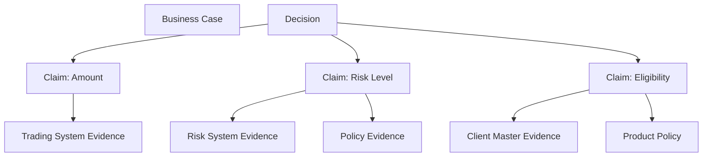
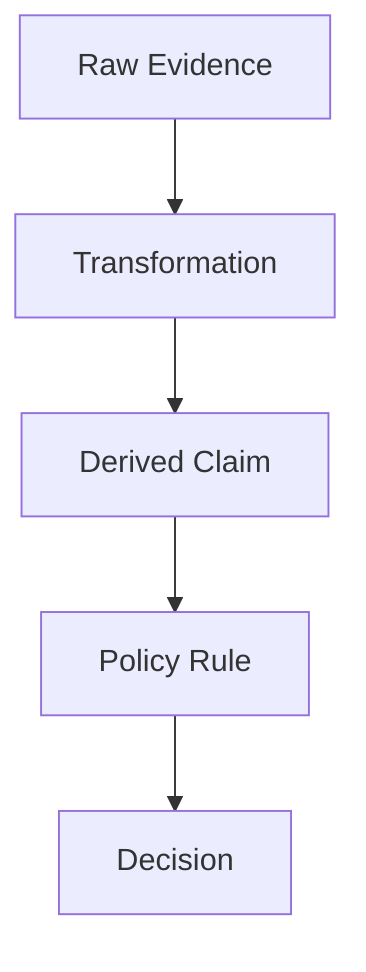
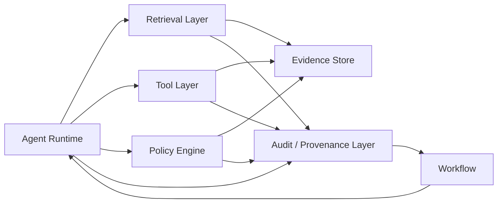
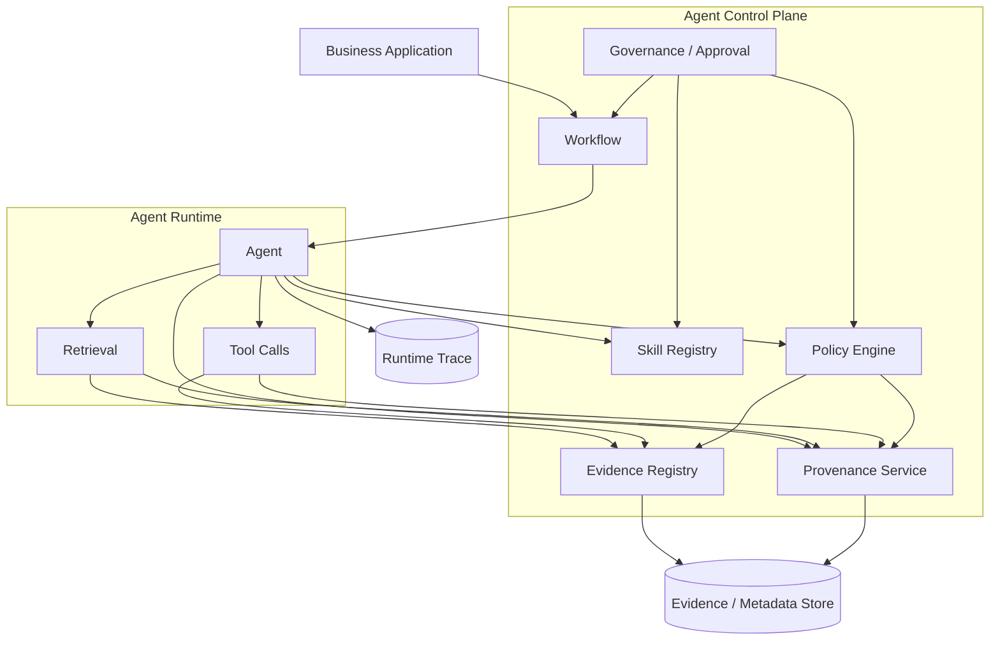

# Agent Decision Provenance：AI 结论如何追溯到 Evidence

## 一、问题已经从“AI 为什么这么想”转变成“这个结论到底依据了什么”

传统企业系统中的审计通常围绕几个问题展开：

* 谁操作的？
* 什么时间操作的？
* 调用了哪个系统？
* 执行了什么动作？
* 使用了什么规则？

在一个确定性系统里，这套方法通常已经足够。

例如：

```text
Trade
  ↓
Rule Engine
  ↓
Rule #A102
  ↓
Decision = Reject
```

因为 `Rule #A102` 是确定性的，所以审计人员可以直接检查规则和输入。

Agent 系统则不同：

```text
User Request
     ↓
Workflow
     ↓
Agent
     ├── retrieve document A
     ├── retrieve document B
     ├── call pricing API
     ├── inspect policy
     └── synthesize
           ↓
      AI Conclusion
           ↓
     Human Approval
```

这里的核心问题已经变成：

> **这个结论究竟是由哪些 Evidence 支撑出来的？**

而且不能只回答：

> “Agent 引用了 Document A。”

还需要回答：

> **“结论中的哪一个 Claim，由 Document A 的哪一段内容支持？这份文档在当时是什么版本？Agent 是否正确理解了这段内容？有没有其他 Evidence 与它冲突？最终又是通过什么规则把这些 Evidence 转换成了这个 Decision？”**

这就是 **Agent Decision Provenance** 要解决的问题。

它与普通的 tracing、logging、citation、RAG、model explainability 都有关，但又不等价。

一个可以先记住的定义是：

> **Agent Decision Provenance，是对一次 AI 结论所依赖的 Evidence、Evidence 来源、Evidence 版本、处理过程、规则、权限上下文和最终 Decision 建立可验证的因果/来源链。**

W3C 对 provenance 的经典定义本身就强调：provenance 描述产生、影响或交付某个对象时涉及的 entity、activity 和 agent，并可以用于判断可信度、验证过程是否符合要求以及复现生成过程。这个抽象非常适合扩展到 Agent Decision。

---

# 二、先区分四个经常被混淆的东西

在 Agent 系统中，经常把下面四个概念混为一谈：

```text
Trace
Citation
Explanation
Provenance
```

它们解决的不是同一个问题。

| 概念          | 主要回答的问题                     |
| ----------- | --------------------------- |
| Trace       | 系统运行时发生了什么？                 |
| Citation    | 这个回答引用了哪个来源？                |
| Explanation | 系统怎样向人解释这个结果？               |
| Provenance  | 这个结果实际上是怎样从 Evidence 演化出来的？ |

例如：

```text
Answer:
“该客户当前不满足产品准入条件。”
```

Citation 可能只有：

```text
[Policy Document]
```

Explanation 可能是：

```text
“因为客户风险等级较高。”
```

Trace 可能记录：

```text
retrieve()
tool_call()
llm_call()
response()
```

但 Provenance 应该能够进一步回答：

```text
Claim C1:
客户风险等级 = High
        │
        ├── source: CRM
        ├── record_version: 2026-09-20T10:31
        └── authorization: allowed

Claim C2:
High-risk customers require enhanced review
        │
        ├── source: Policy P23
        ├── policy_version: 23
        └── effective_at: 2026-07-01

Decision:
Enhanced review required
        │
        └── derived_from(C1, C2)
```

这才是真正的 Decision Provenance。

---

# 三、最重要的原则：Citation 不是 Proof

这是整个问题中最容易产生误解的地方。

一个 Agent 输出：

> “客户风险等级为 High。[1]”

然后 `[1]` 指向一份内部客户资料。

这并不自动意味着：

```text
Citation = Evidence
```

至少还存在几个问题：

1. 引用的来源是否真的包含这个事实？
2. 引用是否对应到正确的客户？
3. Agent 是否把一个局部条件扩大成了普遍结论？
4. 来源是不是旧版本？
5. 该来源在当前业务场景中是否具有足够权威性？
6. 是否存在另一份更高优先级的资料与它冲突？
7. 这条 Evidence 是否是当时实际提供给 Agent 的？

学术研究已经证明，“带引用”与“得到完整支持”之间存在明显差距。ALCE 对 LLM citation 的研究把 citation quality 拆成 correctness、completeness 等维度，并发现即使是当时表现最好的系统，在 ELI5 数据集上仍有相当一部分回答没有得到完整 citation support。

FActScore 进一步说明，一个长文本往往同时包含 supported 和 unsupported 的 atomic facts，因此仅判断整段回答“好不好”是不够的，应该把回答拆成更小的事实单元，然后逐项检查是否有可靠知识来源支持。

因此：

> **真正值得审计的不是“有没有 Citation”，而是“Claim → Evidence 的支持关系是否成立”。**

---

# 四、RAG 也不是 Provenance

很多企业会自然地认为：

```text
RAG
  ↓
Retrieved Documents
  ↓
LLM
  ↓
Answer with citations
```

已经解决了 provenance。

实际上只解决了一部分。

RAG 的确可以让模型接触外部 Evidence，但研究表明，即使加入检索，LLM 仍然可能生成与 retrieved context 不一致或没有被其支持的内容。RAGTruth 对近 18,000 个 RAG responses 进行了人工标注，专门研究 retrieval context 与生成内容之间的 hallucination。

2025 年发表于 COLING Industry Track 的工作也明确指出，在金融、医疗等数据质量要求高的场景，仅仅看输出或者输入—输出 entailment，并不能完整评价模型产生答案的过程。

更值得注意的是，Bloomberg 2025 年公开的研究发现，RAG 并不天然意味着更安全；其研究专门分析了 RAG 场景中的安全风险，并提醒金融服务中的 GenAI 不能把“加入外部上下文”直接等价成“可信”。

所以：

```text
Retrieved
≠
Relevant

Relevant
≠
Correct

Correct
≠
Sufficient

Sufficient
≠
Authorized Evidence

Authorized Evidence
≠
Decision
```

这几个层次必须分开。

---

# 五、Agent Decision Provenance 的真正核心单位应该是 Claim

如果以最终的 Answer 作为审计单位，粒度仍然太粗。

更合理的模型是：

```text
Decision
   ↓
Claims
   ↓
Evidence
```

例如：

```text
Decision:
“建议批准该交易”
```

拆成：

```text
Claim C1:
交易金额 = 8,000,000

Claim C2:
客户 risk score = 27

Claim C3:
客户属于 permitted segment

Claim C4:
8m < applicable limit

Claim C5:
该产品当前允许该类客户交易
```

然后分别寻找 Evidence：

```text
C1 ← Trading System
C2 ← Risk System
C3 ← Client Master
C4 ← Policy P23
C5 ← Product Policy P17
```

最终：

```text
Decision
   │
   ├── C1 ── Evidence E1
   ├── C2 ── Evidence E2
   ├── C3 ── Evidence E3
   ├── C4 ── Evidence E4
   └── C5 ── Evidence E5
```

这样审计人员才可以进行局部验证：

> “这个结论究竟哪一部分有问题？”

而不是只能重新检查整个 Agent session。

FActScore 所采用的 atomic fact 思路对这里很有启发：输出越复杂，越应该把它拆成可独立验证的 fact，而不是用一个整体准确率替代逐项 Evidence 检查。

---

# 六、因此，Evidence 不是一份 Document，而是一个带 Provenance 的对象

在企业系统中，不建议把 Evidence 简化成：

```json
{
  "document": "policy.pdf"
}
```

更合理的是：

```json
{
  "evidence_id": "E-91821",
  "source_type": "policy",
  "source_id": "POLICY-23",
  "source_version": "23",
  "artifact_hash": "sha256:...",
  "location": {
    "page": 17,
    "paragraph": 3
  },
  "content_hash": "sha256:...",
  "effective_from": "2026-07-01",
  "retrieved_at": "2026-09-20T10:32:11Z",
  "access_context": {
    "principal": "advisor-123",
    "entitlement": "research-internal"
  }
}
```

这里有几个重要区别。

### Source ID

回答：

> 来自哪里？

### Source Version

回答：

> 来自哪个版本？

### Location / Span

回答：

> 具体哪里？

### Content Hash

回答：

> 当时实际引用的内容是不是后来被修改过？

### Effective Time

回答：

> 这条内容在当时是否已经生效？

### Access Context

回答：

> Agent 当时是否有权看到这条信息？

因此：

> **Evidence Provenance 不只是“出处”，而是“出处 + 版本 + 内容 + 时间 + 权限 + 位置”。**

---

# 七、Evidence 还必须区分“事实来源”和“推导来源”

例如：

```text
CRM:
risk_score = 72
```

这是一类 Evidence。

然后 Agent 根据：

```text
risk_score > 70
```

得到：

```text
risk_class = HIGH
```

这是第二层。

再通过 Policy：

```text
HIGH → Manual Review Required
```

得到：

```text
Decision = Escalate
```

因此真正的 lineage 是：

```text
Raw Fact
   ↓
Derived Fact
   ↓
Policy Evaluation
   ↓
Decision
```

而不是：

```text
CRM
   ↓
LLM
   ↓
Decision
```

这种区分非常重要，因为它决定了出了问题以后应该查什么。

如果：

```text
risk_score
```

错了，是 source data 问题。

如果：

```text
risk_class
```

推错了，是 transformation / model 问题。

如果：

```text
manual review required
```

规则应用错了，是 policy evaluation 问题。

如果规则正确、输入正确，但是最终文本把 `Escalate` 写成 `Approve`，则是 generation / rendering 问题。

没有 Provenance，这几个问题很容易全部变成一句：

> “AI 算错了。”

---

# 八、Decision Provenance 最适合使用 Evidence Graph，而不是简单日志

可以把整个系统理解为一个图：



如果进一步把 transformation 纳入：



这与 W3C PROV 的思路非常接近：provenance 本来就不是一个单独的 log line，而是描述 entity、activity、agent 之间关系的数据模型。

所以 Agent 平台如果只存：

```text
trace_id
```

还远远不够。

它真正需要建立的是：

```text
Decision Graph
```

---

# 九、为什么“模型自己写出来的 Explanation”不能直接作为 Provenance

这是另一个非常重要的问题。

Agent 可能输出：

> “我判断该交易应该被拒绝，因为客户风险较高，而且当前市场条件不利。”

这看起来很像 explanation。

但它可能只是一个生成出来的叙述。

NIST 的 GenAI Profile 特别指出，生成式模型可能产生 confabulation，并且模型甚至可能生成看似合理、用于解释其答案的逻辑或 citations，而这些解释本身也可能是错误的。

因此：

```text
LLM-generated explanation
```

不应该自动被当成：

```text
Provenance record
```

两者完全不同。

更可靠的架构是：

```text
Evidence
   ↓
Deterministic / Recorded Transformation
   ↓
Structured Claims
   ↓
Policy / Decision
   ↓
Human-readable Explanation
```

而不是：

```text
Decision
   ↓
Ask LLM:
"Explain why"
```

后者生成的是 explanation。

前者生成的是 provenance。

---

# 十、这意味着“不应该把 Chain-of-Thought 当作审计证据”

Agent 系统很容易走向另一个极端：

> “既然不能只记录最终答案，那把整个 reasoning trace 全部存下来。”

这同样不是一个好的默认架构。

原因是：

```text
Chain-of-Thought
```

与：

```text
Decision Evidence
```

是两个不同概念。

审计通常真正需要的是：

```text
What did the system rely on?
Which evidence supported which claim?
Which rule was applied?
Which tool returned what?
Who authorized it?
What decision resulted?
```

而不是：

```text
模型内部生成了多少 token
```

因此，更适合金融场景的是：

> **Evidence-based decision record，而不是 unrestricted chain-of-thought archive。**

这同时也更符合可验证性原则：审计人员可以直接检查 Evidence 和规则，而不必相信模型自己对内部思考过程的事后叙述。

---

# 十一、Evidence 必须是“当时实际可见的 Evidence”

这是 Agent Provenance 中很容易被忽略的一点。

假设：

```text
Document v5
```

现在已经更新。

Agent 当时实际上读取的是：

```text
Document v4
```

而审计人员今天打开：

```text
Document v5
```

可能发现：

> “这里明明没有这个结论。”

这并不一定意味着 Agent 当时错了。

可能只是 Evidence 已经发生变化。

因此必须记录：

```text
source_id
source_version
retrieval_timestamp
content_hash
location
```

也就是说：

> **审计需要的是 Evidence Snapshot，而不是 live reference。**

这和前一篇关于 Workflow / Skill / Policy Version 的讨论是同一个基本原则：

```text
Current State
≠
Historical State
```

Amazon Bedrock 的 Knowledge Base API 已经提供了比较接近这个方向的基础能力：生成结果可以关联到 retrieved references，并提供 source location、content 和 metadata；其 response 中的 citation 还可以映射到回答的具体 span。

Google Vertex AI 的 grounding metadata 同样会返回 grounding chunks 和 grounding supports，并把回答中的片段与其支持来源建立映射。

这些产品能力可以作为工程参考，但它们本身仍主要解决 **grounding / citation**，企业若要满足审计要求，还需要在其上继续建立版本、权限、业务 Case、Policy 和 Decision 关系。

---

# 十二、Citation 最好做到 Claim-Level，而不是 Answer-Level

假设最终回答是：

> 该产品适用于 A 类客户，但当前客户风险级别较高，因此建议进入人工审核。根据最新政策，金额超过 500 万需要二级审批。

理想的 provenance 应该类似：

```text
Claim C1
“该产品适用于 A 类客户”
        ↓
Evidence E1
Product Eligibility Policy v14
Section 3.2

Claim C2
“当前客户风险级别较高”
        ↓
Evidence E2
Risk System snapshot
2026-09-20 10:31

Claim C3
“进入人工审核”
        ↓
Policy P23
Rule R17

Claim C4
“金额超过 500 万需要二级审批”
        ↓
Policy P23
Rule R21
```

而不是：

```text
Answer
 └── Citation: Policy.pdf
```

Google Grounding Metadata 已经提供了“response span → grounding chunk”的结构；Amazon Bedrock 也提供 generated response part 与 retrieved references 的对应关系。

这是一个非常值得企业 Agent 平台借鉴的设计：

> **Citation 是 Provenance Graph 的一个边，而不是 Provenance 本身。**

---

# 十三、金融场景尤其需要记录 Evidence 的“权威等级”

金融系统里的 Evidence 并不是平等的。

例如：

```text
Market price
```

可能来自：

```text
Exchange
↓
Market data vendor
↓
Internal cache
↓
Search result
↓
LLM-generated statement
```

它们的审计意义完全不同。

可以在企业内部定义 Evidence Class，例如：

| Evidence Class            | 例子                    | 特征            |
| ------------------------- | --------------------- | ------------- |
| System-of-Record          | 核心交易、客户主数据            | 业务权威数据        |
| Approved Policy           | 内部制度、正式规则             | 控制权威来源        |
| Controlled Research       | 审批后的研究报告              | 专业内容          |
| External Regulated Source | 监管机构、交易所              | 外部权威来源        |
| Third-party Data          | Bloomberg、Refinitiv 等 | 有供应商责任边界      |
| Search / Web              | 搜索结果                  | 来源及稳定性更复杂     |
| Model-derived             | Agent 自己推导            | 必须标记为 derived |

这不是要简单地说：

> “某一类一定可信。”

而是要让 Policy 根据业务风险定义：

```text
哪些 Decision 可以接受哪些 Evidence class
```

例如：

```text
Low-risk internal research summary
    → Approved Research + Search

Trade authorization
    → System-of-record + Policy

Regulatory filing decision
    → Official source / approved legal document
```

这种设计也符合金融监管机构一直强调的模型治理、数据质量和责任边界。

Federal Reserve 的 SR 11-7 要求银行建立足够的模型文档、模型 inventory、validation evidence，并强调理解模型的 assumptions、data、limitations 和 results。

英国 PRA 2026 年更新后的 SS1/23 同样明确把模型风险治理适用于用于支持业务决策的模型，并要求考虑模型的开发、实施、使用、验证和治理。

---

# 十四、Evidence Provenance 还必须考虑“数据授权”

金融场景不能只问：

> “Evidence 存不存在？”

还要问：

> **“Agent 当时是否有资格使用这条 Evidence？”**

例如：

```text
Research Report R17
```

虽然存在，但：

```text
Advisor A
```

可能没有权限访问某个 restricted dataset。

因此：

```text
Evidence
```

至少需要：

```text
source
version
content
authorization context
```

否则会出现一种非常危险的情况：

```text
Decision 是正确的
Evidence 是真实的
但是
Evidence 本不应该暴露给这个用户
```

Amazon Bedrock 的 RetrieveAndGenerate API 已经把 `userContext` 与 retrieval filtering 联系起来，用于确保返回的数据符合调用者授权范围。

因此在企业 Agent 平台里：

> **Evidence Provenance 必须和 Data Entitlement / Authorization Provenance 连接起来。**

这与“retrieval 可以返回数据，但不能绕过 Data Entitlement”的控制原则完全一致。

---

# 十五、金融监管关注的其实不是“解释得像不像”，而是能不能追溯责任和过程

这一点可以从多个监管机构的工作中看得很清楚。

FCA 长期强调 AI 的 explainability、accountability 和 governance；其 AI Update 明确强调金融机构应在现有 accountability framework 下安全、负责任地使用 AI，并采取 evidence-based approach。

FCA 2025 年的研究进一步指出，AI 在信用决策中的 explainability 可能涉及解释使用了什么数据、哪些因素影响了特定决定，以及模型整体如何工作；但研究也明确承认，不同 explainability 技术在金融消费者理解方面的效果仍存在研究空间。

Bank of England 2026 年 AI Consortium 的讨论更加直接：现有 model risk management expectations 被认为适用于 AI 系统及其组成部分，包括 generative AI models、prompts 和 retrieval layers；同时，参与者讨论了 explainability / transparency 应该如何在金融服务中落地。

这意味着：

> **“解释”正在从模型内部问题，逐渐转向整个 AI System 的可追溯问题。**

也就是说：

```text
Model
   ↓
Prompt
   ↓
Retrieval
   ↓
Evidence
   ↓
Policy
   ↓
Decision
```

都可能成为需要被治理的环节。

---

# 十六、EU AI Act 也体现了同一个方向：需要可追踪的系统运行记录

EU AI Act 对 high-risk AI systems 的记录与日志提出明确要求。

Article 12 要求 high-risk AI systems 具备自动记录事件的能力，并保证在其生命周期中对系统运行具有与用途相适应的 traceability。

Article 19 进一步要求相关自动生成日志保存一定期限；对于受欧盟金融服务监管的金融机构，还明确提出这些日志应作为相关金融服务法律下文档的一部分予以维护。

这并不等于法规直接规定：

```text
Claim → Evidence → Decision
```

必须采用某一种数据库结构。

但从架构角度，可以清楚看出监管方向：

> **对于高影响 AI 系统，仅保存最终输出是不够的，需要保存能够支持事后重建系统行为的记录。**

---

# 十七、一个真正可审计的 Agent Decision 应该长什么样

例如：

```json
{
  "decision_id": "DEC-2026-8821",
  "case_id": "CASE-1042",

  "decision": {
    "type": "trade_approval",
    "outcome": "manual_review"
  },

  "claims": [
    {
      "claim_id": "C1",
      "statement": "trade_amount=8000000",
      "derived_from": ["E1"]
    },
    {
      "claim_id": "C2",
      "statement": "client_risk=HIGH",
      "derived_from": ["E2"]
    },
    {
      "claim_id": "C3",
      "statement": "manual_review_required=true",
      "derived_from": ["C2", "P23"]
    }
  ],

  "evidence": [
    {
      "evidence_id": "E1",
      "source": "trading_system",
      "record_id": "TX-8821",
      "snapshot_at": "2026-09-20T10:31:00Z"
    },
    {
      "evidence_id": "E2",
      "source": "risk_system",
      "record_id": "CLIENT-8821",
      "snapshot_at": "2026-09-20T10:31:05Z"
    }
  ],

  "policies": [
    {
      "policy_id": "trade-approval",
      "version": "23",
      "rule_id": "R17"
    }
  ],

  "agent_context": {
    "workflow_version": "18",
    "skill_version": "7.2.1",
    "model": "model-x",
    "retrieval_config_hash": "sha256:..."
  },

  "authorization": {
    "principal": "advisor-123",
    "decision": "allow"
  }
}
```

这个结构最重要的不是 JSON，而是它明确区分：

```text
Evidence
Claim
Policy
Decision
```

并且通过关系把它们串起来。

---

# 十八、Agent Runtime 不应该自己“发明” Provenance

这是架构上非常值得强调的一点。

Agent Runtime 的职责应该是：

```text
reason
retrieve
call tool
produce proposal
```

而不是：

```text
decide what counts as audit evidence
```

因为：

> **如果 Agent 自己决定“哪几个来源最值得作为审计证据”，它实际上就在定义自己的审计边界。**

更合理的架构是：



这里：

* Agent 产生 proposal
* Retrieval 提供 Evidence
* Tool 提供 system facts
* Policy Engine 提供 rule decision
* Provenance Layer 负责记录这些关系

这样才不会把：

```text
Agent reasoning
```

和：

```text
Enterprise audit definition
```

混为一谈。

---

# 十九、Provenance 应该在 Agent 执行过程中逐步形成

不要等 Agent 完成之后再问：

> “现在请帮我生成一份审计说明。”

这种 post-hoc reconstruction 非常脆弱。

更合理的是：

```text
Step 1
retrieve(E1)

Step 2
retrieve(E2)

Step 3
derive(C1)

Step 4
policy(P23)

Step 5
decision(D1)
```

每一步同步形成 provenance event：

```text
E1 → C1
E2 → C2
C1 + C2 + P23 → D1
```

因此最终的 Decision Provenance 是 execution-time state，而不是事后由模型补写的一段总结。

这一点也与 OPA 等 Policy-as-Code 系统的设计一致：policy decision log 记录 decision ID、policy revision、input 与 result，而不是等事后再从日志里猜测当时用了哪个规则。

---

# 二十、Agent 还应该记录“Evidence 没有找到”

这是一个很重要、但经常没有实现的能力。

很多系统只记录：

```text
Evidence used
```

但不记录：

```text
Evidence searched but not found
Evidence conflicted
Evidence inaccessible
Evidence stale
```

例如：

```text
Policy says:
All trades above 10m need approval.

Agent searches:
Policy database
Internal knowledge base
Legal repository

Result:
Policy source found
Legal interpretation found
Historical exception found
```

如果只保存最终 Evidence：

```text
Policy P23
```

审计时可能误以为：

> “整个检索空间只有 P23。”

实际上 Agent 曾经遇到一个冲突来源：

```text
Policy Exception E91
```

但可能因为：

```text
older version
insufficient authority
outside effective date
```

而被排除。

这类“negative provenance”同样重要：

```text
found
not found
rejected
superseded
unauthorized
conflicting
```

因为它解释了：

> **为什么某条 Evidence 没有进入最终 Decision。**

---

# 二十一、Evidence 还应该有“有效期”和“新鲜度”

对于静态制度文件：

```text
Policy v23
```

版本通常足够。

但对于：

```text
Market Price
Credit Score
Liquidity
Position
Client Exposure
```

Evidence 的时间非常重要。

应该记录：

```text
observed_at
effective_at
valid_until
retrieved_at
```

例如：

```text
Market Price
$101.25
observed_at = 10:31:02
```

并不能在第二天自动作为：

```text
$101.25 current price
```

因此：

> **Temporal Provenance 是金融 Decision Provenance 的一等公民。**

这也是为什么传统金融系统长期非常重视 as-of date、effective date、trade date、value date 等时间语义。

Agent 系统不能因为数据被封装成 vector embedding 或 natural-language context，就失去这些时间语义。

---

# 二十二、Evidence Snapshot 与 Vector Index 不能混为一谈

很多 RAG 系统真正保存的是：

```text
Embedding
```

而审计真正需要的是：

```text
Source Artifact
Source Version
Exact Text
Location
Metadata
Hash
Effective Time
```

Vector index 是：

> Retrieval optimization layer

不是：

> Evidence system of record

因此：

```text
PostgreSQL / Vector DB
```

可以告诉 Agent：

> “这两个 chunk 与问题很相关。”

但 Audit Evidence Store 必须能够回答：

> “你当时实际上看到了哪个原始 artifact 的哪一段内容？”

这是两个不同的责任边界。

---

# 二十三、Evidence Provenance 与 Model Provenance 也必须分开

一次 Agent Decision 可能涉及：

```text
Model A
Skill B
Workflow C
Policy D
Evidence E1-E8
Tool T1-T5
```

但这些东西解决不同问题。

```text
Model Provenance
→ 哪个模型产生了输出？

Skill Provenance
→ Agent 按什么行为指南工作？

Workflow Provenance
→ 流程当时是什么？

Policy Provenance
→ 什么规则决定允许/拒绝？

Evidence Provenance
→ 哪些事实支持结论？

Tool Provenance
→ 哪个外部系统提供了什么结果？
```

最终形成：

```text
              Decision
                  │
      ┌───────────┼───────────┐
      │           │           │
   Evidence     Policy      Agent
      │           │           │
   Facts        Rules       Model
                              │
                            Skill
```

因此只保存 model version 是不够的。

---

# 二十四、真实金融实践已经开始向这一方向靠近

Morgan Stanley 是一个很有代表性的公开案例。

Morgan Stanley 自 2023 年开始与 OpenAI 合作，将内部知识库提供给 Financial Advisors 使用；其官方材料明确指出，回答基于 Morgan Stanley 自有内容，并提供 source-document links。

2024 年推出的 AskResearchGPT 面向 Investment Banking、Sales & Trading 和 Research 员工，可以从超过 70,000 份年度研究报告中检索和总结内容，其输出可以链接到相关研究材料的 citations。

这说明金融机构在真实生产环境中已经认识到：

```text
AI Answer
+
Source Link
```

对于知识型金融工作流非常重要。

但必须注意边界：

> **Morgan Stanley 公开资料证明了 source-linked AI assistant 的真实生产实践，并不能直接证明其公开披露了一套完整的 regulatory-grade Decision Provenance 架构。**

这也是分析企业案例时必须坚持的 Evidence discipline：

```text
公开案例证明：
“这个能力被实际采用”

不等于证明：
“企业内部已经实现了完整的审计级 provenance”
```

Morgan Stanley 同时公开强调其 AI use cases 采用持续评估、回归测试和 advisor review。OpenAI 的公开案例资料显示，Morgan Stanley 对 Assistant 建立 evaluation framework，并通过 daily regression suite 监控问题。

这说明另外一个趋势：

```text
Production AI
=
Retrieval
+
Evaluation
+
Human Review
+
Governance
```

而不只是：

```text
Prompt + Model
```

---

# 二十五、为什么金融服务尤其需要 Decision Provenance

金融业务通常不是纯粹的：

```text
Answering
```

而是：

```text
Answer
→ Recommendation
→ Approval
→ Execution
```

所以错误的代价不同。

例如：

```text
Research Agent
“该公司收入增长 12%”
```

如果数字错误，可以人工纠正。

但：

```text
Trade Agent
“该交易符合内部限额”
```

如果错误，可能进一步触发：

```text
Approval
→ Order
→ Settlement
```

所以应当把 Agent Output 分成至少三种等级：

```text
Informational
Advisory
Actionable
```

越接近 Actionable，Provenance 要求越高。

一个合理的原则是：

```text
Informational
    → source citation

Advisory
    → claim-level evidence

Actionable
    → claim-level evidence
    + policy decision
    + authorization
    + execution provenance
```

这里没有必要要求所有 Chatbot 回答都做到同样程度。

真正关键的是：

> **Provenance 强度应该与 Decision Impact 成正比。**

---

# 二十六、因此，Agent 不应该只有“Answer Quality”，还应该有“Evidence Quality”

传统 LLM evaluation 经常关注：

```text
relevance
fluency
helpfulness
correctness
```

但对金融 Agent，还应该增加：

```text
Evidence Coverage
Evidence Correctness
Evidence Authority
Evidence Freshness
Evidence Conflict
Decision Traceability
```

Microsoft Foundry 当前已经把 RAG evaluation 拆成 retrieval、groundedness、response completeness 等不同维度，并明确区分 groundedness 和 completeness：前者主要关注回答有没有超出 context，后者则关注是否遗漏了 ground truth 中的重要内容。

这对于 Decision Provenance 很重要，因为：

```text
Grounded
```

只说明：

> “回答没有明显脱离提供给它的 context。”

并不说明：

```text
Evidence
是完整的
```

也不说明：

```text
Evidence
是最权威的
```

更不说明：

```text
Decision
一定符合 Policy
```

所以企业评估应该继续向下拆。

---

# 二十七、一个更完整的 Evidence Evaluation Model

可以采用：

```text
Evidence Quality
│
├── Relevance
│     是否真的与 Claim 有关？
│
├── Correctness
│     Evidence 是否真的支持 Claim？
│
├── Completeness
│     是否遗漏关键 Evidence？
│
├── Authority
│     来源是否具有业务权威性？
│
├── Freshness
│     是否在有效时间内？
│
├── Entitlement
│     Agent 是否有权使用？
│
├── Consistency
│     是否与其他 Evidence 冲突？
│
└── Traceability
      是否可以精确回到原始 source？
```

其中任何一个失败，都可能使最终 Decision 的可信度下降。

---

# 二十八、把 Decision Provenance 做成独立 Control Plane 能力

企业 Agent 平台如果把 provenance 完全埋在 Agent code 里面，后期很容易失控。

更适合的平台架构是：



这里：

```text
Agent Runtime
```

负责执行。

而：

```text
Evidence Registry
Provenance Service
Policy Engine
Governance
```

负责控制。

这与金融企业中常见的 Control Plane / Runtime 分离思路是一致的。

---

# 二十九、Provenance Record 最终应该形成一条不可变证据链

可以把最终结构理解成：

```text
Business Case
      │
      ▼
Execution
      │
      ├── Workflow Version
      ├── Skill Version
      ├── Model Version
      └── Tool Version
              │
              ▼
        Retrieval / Tool Results
              │
              ▼
            Evidence
              │
              ▼
            Claims
              │
              ▼
         Policy Evaluation
              │
              ▼
           Decision
              │
              ▼
         Human Approval
              │
              ▼
            Action
```

这个链条有一个非常重要的属性：

> **每一层都可以独立验证。**

例如审计人员可以逐级问：

```text
Decision
↓
Which claims?

Claims
↓
Which evidence?

Evidence
↓
Which source/version?

Source
↓
Was it valid then?

Policy
↓
Which rule?

Authorization
↓
Who allowed it?

Workflow
↓
Which version?

Skill
↓
Which artifact?

Action
↓
What actually happened?
```

这才是一个真正可审计的 Agent System。

---

# 三十、不要把 Provenance 简化成“AI 给出的理由”

传统产品很容易设计成：

```text
Decision:
Rejected

Reason:
“客户风险较高。”
```

看起来已经有 explanation。

但审计真正关心的是：

```text
Why?
```

在高风险金融系统中，应该展开为：

```text
Client Risk Score
= 82
Source:
Risk System / Snapshot #8721

Policy:
P23 / Rule R17

Rule:
Risk Score > 80
→ Enhanced Review

Decision:
Enhanced Review Required
```

也就是说：

```text
Natural Language Reason
```

只是 presentation layer。

真正的：

```text
Decision Provenance
```

是 structured evidence lineage。

---

# 三十一、最终可以把 Agent Decision 看成一个 Evidence Function

一个非常有用的抽象是：

```text
Decision
=
f(
    Evidence,
    Policy,
    Workflow,
    Authorization,
    Agent Configuration,
    Model
)
```

而 Provenance 的职责就是记录这个 `f` 的实际输入和中间关系。

因此：

```text
D = f(E1, E2, E3, P7, A9, W18, S4)
```

如果未来有人问：

> “为什么当时得到 D？”

系统应该能够恢复：

```text
E1
E2
E3
P7
A9
W18
S4
```

而不能只能告诉他：

```text
Model said D.
```

这就是 Agent 系统与普通 Chatbot 最大的架构差异之一。

---

# 三十二、最终设计原则

### 原则 1：Audit the Claim, not only the Answer

最终答案不是最小审计单位。

应该：

```text
Answer
→ Claim
→ Evidence
```

---

### 原则 2：Citation is a Link, not Proof

Citation 只能告诉你：

```text
可能来自哪里
```

必须进一步验证：

```text
该来源是否真的支持该 Claim
```

---

### 原则 3：Retrieved Context is not automatically Evidence

Retrieval 结果还需要经过：

```text
relevance
authority
freshness
authorization
conflict
```

检查。

---

### 原则 4：LLM Explanation is not Provenance

模型生成的“理由”可以作为用户界面解释，但不能自动成为监管级证据。

NIST 已明确指出，GenAI 可能连用于解释自身输出的逻辑或 citations 一并生成错误内容。

---

### 原则 5：Evidence must be time-aware

至少保存：

```text
observed_at
effective_at
retrieved_at
version
content_hash
```

否则历史 Decision 无法可靠重建。

---

### 原则 6：Provenance must include authorization context

金融系统必须证明：

```text
Evidence existed
+
Evidence was authorized
+
Agent was permitted to use it
```

---

### 原则 7：Decision Provenance should be generated during execution

不要完全依赖 post-hoc reconstruction。

应该：

```text
Evidence Event
→ Claim Event
→ Policy Event
→ Decision Event
```

实时形成。

---

### 原则 8：Provenance should be independent from Agent Runtime

Agent 可以产生 proposal。

但企业系统应该定义：

```text
What counts as Evidence
What gets recorded
How long it is retained
Who can inspect it
```

---

### 原则 9：高影响 Decision 才需要更强的 Provenance

可以采用 risk-tier：

```text
Low impact
    → source citation

Medium impact
    → claim-level evidence

High impact
    → claim evidence
    + policy provenance
    + authorization
    + version lineage
    + human approval
    + action trace
```

这比要求所有 Agent 使用同一种审计模型更现实。

---

### 原则 10：最终目标不是“解释 AI”，而是“重建 Decision”

真正成熟的目标不是：

> “让 AI 解释自己为什么这么想。”

而是：

> **让第三方能够在不相信 AI 自己叙述的前提下，依据保存下来的 Evidence、Policy、Version 和 Execution records，重新判断这次 Decision 是否有依据。**

这才是 Audit-grade Decision Provenance。

---

# 三十三、结论

Agent Decision Provenance 的核心不是给 AI 输出增加几个 citation。

它实际上是在建立：

```text
Evidence
   ↓
Claim
   ↓
Policy / Transformation
   ↓
Decision
   ↓
Action
```

之间可验证的关系。

而一个金融 Agent 真正应该留下的，不只是：

```text
“Agent 建议批准。”
```

而应该能够完整回答：

```text
这个 Decision 是什么？
↓
它包含哪些 Claim？
↓
每一个 Claim 的 Evidence 是什么？
↓
Evidence 来自哪个系统？
↓
当时是什么版本？
↓
具体是哪一段？
↓
什么时候有效？
↓
Agent 当时是否被允许访问？
↓
有没有冲突 Evidence？
↓
经过了什么 Transformation？
↓
用了哪个 Policy？
↓
Policy 是什么版本？
↓
Workflow / Skill 是哪个版本？
↓
谁批准了这个行为？
↓
最终采取了什么 Action？
```

因此，Agent 平台真正应该建设的不是一个：

```text
Citation Service
```

而是一套：

> **Decision Provenance Layer**

其本质可以概括成一句话：

> **不要让 AI 自己证明它为什么是对的；让系统保存足够完整的 Evidence Lineage，使别人能够独立验证它为什么得到这个 Decision。**

这也是 Agent 从“能回答问题”走向“能够参与企业业务决策”时，必须补上的一层基础设施。

在传统软件里，数据库 transaction log 证明系统发生了什么。

在 Agent 系统里，还需要进一步证明：

```text
Decision
← Claim
← Evidence
← Source
← Version
← Policy
← Authorization
```

这样，Agent 的输出才真正能够进入金融机构已有的：

```text
Model Risk Management
Internal Control
Operational Risk
Compliance
Audit
Incident Response
Regulatory Evidence
```

体系，而不是停留在一个只能查看聊天记录的 AI 应用层。
