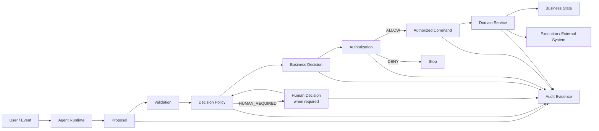

# Agent Proposal vs Business Decision：两个经常被混淆的概念

> **核心原则：Agent 可以提出 Proposal，但 Proposal 不会因为“看起来像一个决定”就自动成为 Business Decision。**
>
> 更准确地说：
>
> ```text
> Proposal = Agent 希望系统考虑的候选结果
> Business Decision = 组织在既定 Authority、Policy、Evidence 和业务规则下正式形成的业务结论
> ```
>
> 二者之间必须存在一个明确的 **Decision Boundary**。

这是企业 Agent 架构中一个非常容易被忽视、但在金融服务领域尤其重要的问题。

很多 Agent 系统表面上已经把：

```text
Recommendation
Proposal
Decision
Approval
Authorization
Command
Business State
```

拆成了不同字段，实际上运行时仍然把它们当成一个东西。

例如：

```json
{
  "decision": "APPROVE",
  "amount": 50000,
  "reason": "Customer has sufficient income"
}
```

系统随后：

```text
LLM Output
    ↓
decision = APPROVE
    ↓
execute()
```

从架构角度看，这不是“AI 做了一个业务决策”这么简单，而是系统把：

```text
Agent Proposal
```

直接升级成了：

```text
Business Decision
```

甚至进一步升级成：

```text
Authorized Command
```

这三个 Trust Boundary 被压缩成了一个字段。

对于一般 Chatbot，这可能只是一个设计缺陷。

对于金融系统，则可能意味着：

```text
Recommendation
    ↓
Authorization Bypass
    ↓
Business State Mutation
    ↓
Regulatory / Financial Consequence
```

所以，真正需要解决的不是：

> “Agent 能不能做决定？”

而是：

> **什么东西才算 Business Decision？谁有权产生它？什么证据支撑它？什么系统承认它已经发生？**

---

# 1. 最先要解决的误区：Decision 不是“一个字符串”

很多 Agent 系统把 Decision 建模成：

```json
{
  "decision": "approve"
}
```

这其实严重低估了 Business Decision。

一个真正的业务决策至少包含：

```text
What      决定了什么
Who       谁作出的
Authority 基于什么权限作出的
Why       为什么这么决定
Evidence  基于什么事实/证据
Policy    依据什么规则
Scope     对什么资源、什么范围有效
When      在什么时候作出的
Version   基于哪个业务/政策版本
Effect    会导致什么业务后果
```

例如：

> “批准 Payment P123 金额 50,000 USD。”

和：

> “Agent 建议批准 Payment P123 金额 50,000 USD。”

从文字上几乎没有区别。

从企业系统角度，它们却是完全不同的两个对象。

第一个可能是：

```text
Business Decision
```

第二个只是：

```text
Agent Proposal
```

---

# 2. Proposal 和 Decision 的本质差异

可以先用一个最简单的模型理解：

```text
Agent Proposal

"我建议做 X。"

        ↓

Decision Boundary

"基于当前 Policy / Authority / Evidence，
系统是否承认 X 是正式业务决定？"

        ↓

Business Decision

"组织正式决定做 X。"
```

所以：

```text
Proposal = Candidate
Decision = Authoritative Outcome
```

这和“AI 能不能自己决定”并不是同一个问题。

---

# 3. 非常重要：Proposal 和 Decision 都不一定由人产生

很多人第一次理解这个概念时，会产生另一个误区：

```text
Agent → Proposal
Human → Decision
```

这个模型太简单。

现实中完全可以：

```text
Agent → Proposal
       ↓
Deterministic Policy / Decision Service
       ↓
Business Decision
```

也可以：

```text
Agent → Proposal
       ↓
Human Review
       ↓
Business Decision
```

甚至在低风险业务中：

```text
Agent → Proposal
       ↓
Pre-approved Policy
       ↓
Business Decision
```

因此：

> **Proposal 与 Decision 的区别，不是“AI vs Human”。**

真正的区别是：

> **Candidate Outcome vs Authoritative Business Outcome。**

一个 Decision 可以由人作出，也可以由一个经过授权的自动化 Decision Service 作出。

同样，一个 Proposal 可以来自：

* LLM Agent
* 传统规则引擎
* ML 模型
* 人工
* 另一个系统
* 外部数据服务

因此这是一个**业务架构概念**，而不只是 AI 概念。

---

# 4. 为什么传统企业系统早就把 Decision 单独建模

这一点其实并不是 Agent 时代才出现。

OMG 的 Decision Model and Notation（DMN）就是为了对 Business Decisions 和 Business Rules 进行精确建模，使业务人员、分析人员和技术人员能够共同定义和管理 Decision Logic。DMN 与 BPMN/CMMN 配合使用，一个负责流程、一个负责 Case、一个负责 Decision。([OMG][1])

这背后有一个很重要的企业架构思想：

```text
Process
    ≠
Decision
```

同样：

```text
Agent Reasoning
    ≠
Business Decision
```

Agent 时代真正发生的变化，只是：

> **Proposal 的生成成本大幅下降了。**

以前：

```text
Employee
    ↓
Analysis
    ↓
Proposal
```

现在可以：

```text
Agent
    ↓
Analysis
    ↓
Proposal
```

但 Proposal → Decision 之间的业务边界并没有因此消失。

---

# 5. Agent 最大的诱惑，就是把 Proposal 伪装成 Decision

LLM 非常擅长生成：

```text
"我建议批准。"
"建议拒绝。"
"应该卖出。"
"建议提高额度。"
"建议关闭 Case。"
"建议付款。"
```

这些表达在人类语言中都非常像 Decision。

问题在于：

```text
Natural Language
```

和：

```text
Business Authority
```

完全是两个维度。

LLM 可以非常自然地说：

> “该客户符合审批条件，因此建议批准。”

但是系统必须继续问：

```text
谁批准？
依据什么授权？
当前规则是什么？
证据是什么？
是否满足 Maker-Checker？
是否需要第二审批人？
Customer 状态是否仍然有效？
Approval 是否过期？
这个结果是否已经成为正式 Business State？
```

如果这些问题没有经过独立控制，LLM 的：

```text
"approve"
```

仍然只是一个字符串。

---

# 6. 金融服务中的典型例子：Fraud Detection Rule

FSB 2026 年关于金融机构 AI Responsible Adoption 的咨询报告给出了一个非常适合说明 Proposal / Decision 区别的真实案例。

报告描述了一家大型国际银行部署 Agentic AI，用于持续识别新的欺诈和诈骗模式。Agent 会：

```text
分析可疑模式
    ↓
评估风险
    ↓
生成 proposed detection rules
```

但这些规则并不会因为 Agent 生成出来就直接生效。

银行采用的是：

```text
Agent
 ↓
Proposed Detection Rule
 ↓
Fraud Analytics Team Review
 ↓
Approve
 ↓
Implementation
```

报告明确描述该过程采用 Human-in-the-loop，由银行 Fraud Analytics Team 审核和批准新的规则之后才实施。([Financial Stability Board][2])

这其实就是一个非常标准的：

```text
Proposal ≠ Decision
```

例子。

Agent 产生：

```text
Proposal:
"如果出现 A + B + C 模式，
新增 Fraud Detection Rule R17。"
```

这不是 Business Decision。

正式 Decision 是：

```text
Decision:
"银行批准 Rule R17 生效。"
```

真正的业务变化则是：

```text
Business State:
Rule R17 = ACTIVE
```

于是可以形成：

```text
Agent Proposal
      ↓
Human / Policy Decision
      ↓
Authorized Command
      ↓
Business State
```

这比简单地：

```text
Agent → Rule
```

安全得多，也更容易审计。

---

# 7. 金融机构已经在区分“AI 建议”和“业务决定”

FINRA 2026 年对 GenAI 和 Agent 的监管观察也非常接近这个思路。

FINRA 明确指出，GenAI 输出可能包含错误或误导性信息，而对法规、政策、客户数据或市场数据的错误解释可能影响 Decision Making；对于 Agent，FINRA 特别关注：

* Autonomy
* Scope and Authority
* Auditability and Transparency
* Data Sensitivity

并建议金融机构考虑 Human-in-the-loop、跟踪 Agent Actions and Decisions，以及对 Agent 行为建立限制和 Guardrails。([FINRA][3])

这里其实已经隐含了一个重要区分：

```text
Agent Output
```

可以影响：

```text
Decision Making
```

但是：

```text
Agent Output
```

并不因此就等于：

```text
Business Decision
```

这和传统 Model Risk Management 的思路也是一致的。

2026 年美国联邦银行监管机构更新的 Model Risk Management Guidance 将 Model Risk 定义为模型输出被用于 Business Decisions 后可能产生的不利后果，并强调模型用途、输出对业务决策的重要程度、验证、监控和治理。([Federal Reserve][4])

需要特别注明：2026 年新版银行 Model Risk Guidance 明确说明 GenAI 和 Agentic AI 这类新技术本身不属于该指导文件的直接 scope，因此这里更多是借鉴其“model output → business decision → business consequence”的治理逻辑，而不是把该指导直接套用到 Agent。([OCC.gov][5])

---

# 8. Proposal、Decision、Approval、Authorization、Command 必须拆开

这是整个模型最重要的一层。

很多系统实际上只有：

```text
decision
```

一个字段。

成熟的金融 Agent Architecture 应至少区分：

```text
Proposal
Decision
Approval
Authorization
Command
Business State
```

它们不是同义词。

| 对象                | 回答的问题                             | 典型产生者                                            |
| ----------------- | --------------------------------- | ------------------------------------------------ |
| Proposal          | “建议做什么？”                          | Agent / User / Model                             |
| Business Decision | “业务正式决定什么？”                       | Human / Decision Service / Authorized Automation |
| Approval          | “某个角色是否同意这个 Proposal/Decision？”   | Human / Approval Policy                          |
| Authorization     | “现在这个 Principal 是否被允许做这个 Action？” | Authorization Service                            |
| Command           | “系统现在实际要执行什么？”                    | Command Service                                  |
| Business State    | “业务系统现在认定事实是什么？”                  | Domain System                                    |

尤其要注意：

```text
Approval ≠ Business Decision
```

以及：

```text
Business Decision ≠ Authorization
```

---

# 9. 为什么 Approval 也不能简单等于 Business Decision

例如：

```text
Agent Proposal:
"Refund customer $5,000."
```

Compliance 审核：

```text
APPROVED
```

这说明：

```text
Compliance 同意这个 Proposal。
```

但系统还可能需要检查：

```text
Payment still exists?
Refund already processed?
Customer account still active?
Refund amount unchanged?
Approver has required authority?
Maker ≠ Checker?
Approval still valid?
No Policy change?
```

因此：

```text
Proposal
    ↓
Approval
    ↓
Authorization
    ↓
Command
    ↓
Execution
```

Approval 是一个 Control Decision。

Business Decision 则取决于具体业务语义。

有些业务：

```text
Approval = Business Decision
```

例如：

> “审批此贷款申请。”

有些业务则不是：

```text
Risk Review Approval
      ↓
Business Decision
      ↓
Trade Execution
```

所以：

> **Approval 是否等于 Business Decision，必须由业务域定义，不能由 Agent Runtime 决定。**

---

# 10. Authorization 更不是 Business Decision

这个区别在金融系统尤其重要。

假设：

```text
Business Decision:
"Sell 10,000 shares of ABC."
```

这不代表：

```text
当前用户可以提交这个交易。
```

系统还需要判断：

```text
Authorization:
Does this Principal have authority to execute this command?
```

因此：

```text
Business Decision
      +
Authorization
      ↓
Executable Command
```

而不是：

```text
Business Decision
      =
Authorization
```

这对应金融 Agent 中两个不同的问题：

```text
Business Authority
```

与：

```text
Execution Authority
```

前者回答：

> “业务上决定做什么？”

后者回答：

> “谁可以把这个决定变成系统动作？”

---

# 11. Proposal 也不一定意味着“建议执行”

Proposal 的范围其实很大。

它可以是：

### Information Proposal

```text
"这些交易看起来具有欺诈风险。"
```

### Analytical Proposal

```text
"建议进一步调查 Customer C123。"
```

### Business Proposal

```text
"建议拒绝该贷款申请。"
```

### Action Proposal

```text
"建议退款 $5,000。"
```

### Workflow Proposal

```text
"建议把 Case 转给 Compliance。"
```

### Policy Proposal

```text
"建议增加 Fraud Rule R17。"
```

最后一种尤其重要。

Agent 可以发现：

```text
"现有 Rule 不够用了。"
```

并提出：

```text
"建议增加 Rule R17。"
```

但 Agent 不应该自己把：

```text
"建议增加 Rule R17"
```

升级成：

```text
"Rule R17 已生效"
```

---

# 12. Business Decision 的核心特征是“权威性”

一个 Business Decision 至少应该具备：

```text
Authoritative
Bounded
Traceable
Policy-grounded
Evidence-grounded
Effective
Auditable
```

也就是说：

### Authoritative

系统承认这是正式决定。

### Bounded

决定的范围明确。

```text
Customer C123
Loan L456
Amount <= 100,000
Valid until 2026-10-01
```

### Traceable

知道：

```text
谁
什么时候
针对什么
作出了什么决定
```

### Policy-grounded

知道：

```text
根据哪个 Policy / Rule / Delegation
```

### Evidence-grounded

知道：

```text
基于什么数据和证据
```

### Effective

知道：

```text
从什么时候开始生效
```

### Auditable

能够重建：

```text
Proposal
→ Review
→ Decision
→ Authorization
→ Command
→ Execution
```

这也是为什么 Business Decision 不应该只是 Agent Message。

---

# 13. “Decision Object” 应该成为独立 Domain Object

建议不要这样：

```text
AgentMessage {
    text: "...",
    decision: "APPROVE"
}
```

而应该显式建模：

```typescript
interface DecisionProposal {
  proposalId: string;
  caseId: string;

  decisionType: string;
  proposedOutcome: unknown;

  rationale: string;
  evidenceRefs: EvidenceRef[];

  proposedBy: Principal;
  generatedByAgent?: AgentRef;

  inputSnapshot: InputSnapshot;
  createdAt: string;
  expiresAt?: string;
}
```

然后：

```typescript
interface BusinessDecision {
  decisionId: string;
  caseId: string;

  decisionType: string;
  outcome: unknown;

  decidedBy: Principal;
  authorityBasis: AuthorityBasis;

  policyVersion: string;
  evidenceSnapshot: EvidenceSnapshot;

  proposalId?: string;

  scope: DecisionScope;

  decidedAt: string;
  effectiveAt?: string;
  expiresAt?: string;
}
```

然后再形成：

```typescript
interface AuthorizedCommand {
  commandId: string;

  decisionId: string;
  authorizationDecisionId: string;

  actor: Principal;
  action: string;

  scopeHash: string;

  parameters: CanonicalParameters;

  createdAt: string;
  expiresAt?: string;
}
```

这样：

```text
Proposal
```

不会因为 JSON 结构类似，就直接变成：

```text
Decision
```

---

# 14. Proposal 到 Decision 应该是一条显式转换

可以把整个过程写成：

```text
Proposal
    ↓
Validate
    ↓
Evidence Check
    ↓
Policy Evaluation
    ↓
Authority Check
    ↓
Human Decision if required
    ↓
Decision Record
```

也就是说：

```text
Decision = Accept(Proposal, Context, Authority, Policy, Evidence)
```

而不是：

```text
Decision = LLM Output
```

这是一个非常重要的架构转变。

---

# 15. 最危险的代码其实非常简单

很多 Agent 项目最终会出现这样的代码：

```typescript
const result = await agent.run(caseData);

if (result.decision === "APPROVE") {
  await loanService.approve(caseData.loanId);
}
```

表面上非常简洁。

实际上它隐藏了：

```text
LLM
 ↓
Business Decision
 ↓
Command
```

三个步骤。

应该至少变成：

```typescript
const proposal = await agent.run(caseData);

const decision = await decisionService.evaluate({
  proposal,
  caseData,
});

if (decision.outcome === "APPROVED") {
  const authorization =
    await authorizationService.check({
      principal,
      action: "APPROVE_LOAN",
      resource: caseData.loanId,
      decision,
    });

  if (authorization.allowed) {
    await commandService.execute({
      action: "APPROVE_LOAN",
      decisionId: decision.id,
    });
  }
}
```

这样 Agent 才只是：

```text
Proposal Generator
```

而不是：

```text
Business Authority
```

---

# 16. Agent 不应该拥有“Decision Completion”权

这里还有一个经常被遗漏的问题。

Agent 可能生成：

```text
"Loan approved successfully."
```

但实际上：

```text
Domain Service
```

调用失败。

如果 UI 根据 Agent Response 显示：

```text
Loan Approved
```

系统就出现了：

```text
Agent Narrative
      ↓
Business Truth
```

所以：

> **Business Decision 的最终状态必须来自 Business System，而不是 Agent 自己的总结。**

例如：

```text
Agent:
"建议批准贷款。"

↓

Decision Service:
APPROVED

↓

Domain:
Loan.status = APPROVED

↓

Agent:
"贷款已经批准。"
```

最后一句应该来自 Domain State，而不是 Agent 自己判断。

---

# 17. Recommendation、Decision、Outcome 也必须分开

例如 Investment Agent：

```text
Recommendation:
BUY

Target:
ABC

Quantity:
10,000
```

然后 Portfolio Manager 作出：

```text
Business Decision:
BUY 5,000
```

最后 Execution System：

```text
Execution Outcome:
PARTIALLY_FILLED
```

于是：

```text
Recommendation
    ≠
Business Decision
    ≠
Execution Outcome
```

如果系统把三者都叫：

```text
decision
```

后续审计几乎一定会混乱。

---

# 18. 同样的问题也出现在 Credit

例如：

```text
Agent:
Customer likely qualifies.
Recommended limit = $100,000.
```

这是：

```text
Credit Recommendation
```

正式业务流程可能是：

```text
Agent Recommendation
       ↓
Credit Policy
       ↓
Risk Validation
       ↓
Human Credit Officer
       ↓
Credit Decision
       ↓
Loan State
```

最终系统记录：

```text
CreditDecision {
    outcome: APPROVED
    limit: 80_000
    decidedBy: officer-123
    policyVersion: credit-policy-v17
}
```

而不是：

```text
LLMOutput {
    outcome: APPROVED,
    limit: 100_000
}
```

对于金融机构，这种区分尤其重要，因为模型输出可以成为 Decision Input，却不能因此自动成为 Business Authority。FINRA 对模型输出影响决策、监督、准确性以及 Agent Scope and Authority 的要求，正是这个架构问题的金融监管背景。([FINRA][3])

---

# 19. Investment Agent 的例子更容易理解

假设 Agent 读取：

```text
Market Data
Research
Company Filings
Portfolio
Risk Limits
```

Agent 输出：

```text
Proposal:

Reduce ABC position by 30%.

Reason:
Valuation deteriorated and earnings risk increased.
```

接下来可能有：

```text
Portfolio Policy
Risk Limits
Client Mandate
PM Authority
Compliance Rules
Current Position
Market Conditions
```

最终：

```text
Business Decision:

Reduce ABC by 10%.
```

为什么不是 30%？

因为：

```text
Agent Proposal
```

可以提供分析和建议，但：

```text
Portfolio Decision
```

必须符合：

```text
Mandate
Authority
Policy
Risk Constraints
Position Constraints
```

FSB 2026 年咨询报告也观察到金融机构已经在使用 AI Agent 做市场研究、分析和交易工作流支持；报告同时强调 Agentic AI 带来的自主性和风险，需要与治理、问责及人类监督结合。([Financial Stability Board][2])

---

# 20. Proxy Voting 是另一个非常典型的例子

对于 Proxy Voting，可以非常清楚地拆开：

```text
Agent Research
    ↓
Voting Recommendation
    ↓
Proposal

"FOR Resolution 3"
```

之后：

```text
Investment Policy
Client Mandate
Voting Guidelines
Conflict Rules
Compliance
Authorized Person
```

形成：

```text
Business Decision

Vote = FOR
```

再进入：

```text
Voting Command
    ↓
ISS / Voting Platform
    ↓
Execution
```

于是：

```text
Agent Recommendation
    ≠
Investment Decision
    ≠
Voting Authorization
    ≠
Vote Execution
```

如果 Agent 的文本输出直接成为：

```text
vote = FOR
```

并调用 Vendor API，就把四个不同的业务语义压缩成了一个模型输出。

---

# 21. “Human Approval”仍然不能让架构自动正确

这里还存在一个比较隐蔽的问题：

```text
Agent Proposal
 ↓
User clicks Approve
 ↓
Execute
```

看起来已经安全。

实际上仍然需要回答：

```text
用户批准的到底是什么？
```

例如 Agent 最初提出：

```text
Pay $10,000
```

用户点击：

```text
Approve
```

之后 Agent 又改变成：

```text
Pay $100,000
```

如果系统只是：

```json
{
  "approved": true
}
```

就会产生：

```text
Human approved A
Agent executed B
```

所以 Approval 必须绑定：

```text
Proposal ID
Proposal Version
Action
Resource
Parameters
Scope Hash
```

最终：

```text
Approval Scope
    ==
Execution Scope
```

才能执行。

---

# 22. AWS 的 Agent 架构正好说明了这一点

AWS 当前 Agentic AI Lens 明确要求 Agent：

* 有明确 Scope、Limits 和 Authority；
* 使用 Contracts、Schemas、Registries 和 Structured Success Criteria；
* 根据 Action Consequence 设置不同等级的人类监督。([AWS Documentation][6])

AWS 针对 Critical Decisions 的具体设计又进一步要求：

```text
Agent Action
    ↓
Risk Classification
    ↓
Human Review when required
    ↓
Execution
```

而不是所有 Action 都统一审批，也不是所有 Action 都自动执行。AWS 特别指出，审批应该绑定具体 Action，并记录 Reviewer Identity、Timestamp 等信息。([AWS Documentation][7])

这里真正值得借鉴的不是某一个 AWS API，而是：

> **Agent Action 是一个需要经过 Control Boundary 的对象，而不是天然具有执行意义的 Decision。**

---

# 23. Microsoft Agent Framework 也体现了同样的分离

Microsoft Agent Framework 的 HITL Workflow 使用：

```text
Request
    ↓
Workflow Pause
    ↓
External Response
    ↓
Resume
```

并且 Tool Approval 会把具体：

```text
Tool Name
+
Arguments
```

交给外部用户审批，而不是让 Agent 自己把 Tool Call 当成已经批准的执行动作。([Microsoft Learn][8])

这实际上也是：

```text
Agent Proposed Action
```

和：

```text
Approved Action
```

分离。

而且这个分离不依赖 Prompt：

```text
"请在执行前询问用户。"
```

而是由 Workflow Runtime 本身暂停：

```text
RequestPort
```

等待外部 Response。

这正是企业 Agent 应该采用的架构方向。

---

# 24. FSB 对金融 Agent 的建议尤其值得注意

FSB 2026 年咨询报告的 Human Oversight 部分明确提出：

* Human oversight 应与 Materiality、Risk、Autonomy、Complexity、Explainability 相匹配；
* Human 必须具备足够的 Ability、Authority 和 Incentive；
* 对 Agent 应定义禁止动作以及要求 Human Approval 的 Checkpoint；
* 可以限制 Agent 对 API、Data、ICT Systems、Other Agents 的访问；
* 对一定金额以上的金融交易，可以采用 Human Approval 或 Dual Authorization；
* 可以限制 Agent 直接访问 Payment System；
* 应保留 Agent Transaction Audit Trail。([Financial Stability Board][2])

这和 Proposal/Decision 分离完全一致：

```text
Agent Proposal
      ↓
Oversight / Decision
      ↓
Authorization
      ↓
Transaction
```

截至 2026 年 9 月，这份 FSB 文件仍是 Consultation Report，而非最终正式报告，因此这里应把它理解为当前国际金融监管讨论中的重要实践方向，而不是具有法律约束力的统一规则。([Financial Stability Board][9])

---

# 25. Business Decision 应该属于哪个 Layer？

这是前面整个 Agent Architecture 讨论中非常关键的问题。

比较合理的划分是：

```text
Agent Runtime
    ↓
Proposal

Control Plane
    ↓
Policy
Authorization
Approval
Human Oversight

Domain / Business System
    ↓
Business Decision
Business State

Execution Layer
    ↓
Command
Transaction

Audit
    ↓
Evidence
```

但这里需要加一个重要的 nuance：

**Business Decision 不一定全部由 Domain Service 计算。**

可以是：

```text
Decision Service
```

计算：

```text
Credit Decision
Eligibility Decision
Fraud Decision
Pricing Decision
Routing Decision
```

然后由 Domain 系统保存和执行。

所以更准确的架构是：

```text
Agent Runtime
        ↓
Proposal
        ↓
Decision Boundary
        ↓
Decision Service / Human Decision
        ↓
Business Decision Record
        ↓
Authorization
        ↓
Command
        ↓
Domain
        ↓
Business State
```

---

# 26. 因此 Control Plane 和 Domain 都有自己的“Decision”

这里容易再次混淆。

至少有三种不同 Decision：

## 26.1 Business Decision

```text
"批准贷款"
"卖出股票"
"接受客户"
"拒绝退款"
"投票 FOR"
```

这是业务语义。

---

## 26.2 Control Decision

```text
ALLOW
DENY
HUMAN_REQUIRED
```

这是治理语义。

---

## 26.3 Execution Outcome

```text
EXECUTED
FAILED
PARTIALLY_FILLED
REJECTED_BY_GATEWAY
```

这是执行语义。

三者不能混为：

```text
decision = true
```

---

# 27. 一个完整的金融 Agent Decision Pipeline

推荐把整个链路固定成：



这个图里最重要的是：

```text
Proposal
```

和：

```text
Business Decision
```

中间有一个明确的 Boundary。

---

# 28. 不要把 Proposal 存到 Business State

这是非常常见的数据库设计错误。

例如：

```sql
investment_idea.status = 'APPROVED'
```

如果这个值来自 Agent：

```text
Agent output
    ↓
status = APPROVED
```

那么数据库中的：

```text
APPROVED
```

实际上已经失去了意义。

应该有：

```text
investment_idea.proposal
investment_idea.decision
investment_idea.decision_status
investment_idea.execution_status
```

或者更严格地：

```text
decision_proposals
business_decisions
authorized_commands
execution_records
```

这样才能知道：

```text
AI 建议了什么
业务决定了什么
系统允许做什么
实际上执行了什么
最终业务状态是什么
```

---

# 29. Agent Memory 更不能保存“最终决定”作为唯一事实来源

例如：

```text
Agent Memory:
"Investment Idea 123 was approved."
```

这句话不能成为：

```text
InvestmentIdea.status = APPROVED
```

的 Source of Truth。

正确做法是：

```text
Agent Memory
    ↓
Reference

Business Decision Registry
    ↓
Authoritative Record
```

Agent 可以记得：

```text
"Case 123 曾经有一个 Approval。"
```

但是执行前仍然应该查询：

```text
Decision Registry
Approval Registry
Authorization
Current Business State
```

这和前面“Business State 不应该存在 Agent Memory 中”的原则完全一致。

---

# 30. Decision 必须能够解释“为什么不是 Agent 的 Proposal”

这是金融领域特别重要的一点。

例如：

```text
Agent Proposal:
Approve $100,000
```

最终：

```text
Business Decision:
Approve $80,000
```

Audit 必须能够解释：

```text
Proposal:
$100,000

Policy:
Maximum exposure = $80,000

Decision:
$80,000

Decision Maker:
Credit Officer

Reason:
Policy limit

Execution:
$80,000
```

如果系统最终只记录：

```text
decision = 80000
```

就无法回答：

> Agent 原来建议了什么？

也无法回答：

> 为什么最终不同？

FSB 也特别强调对 Agent 中间步骤、工具访问、最终结果和 Agent 对“成功”的解释进行记录，以支持监督和事后调查。([Financial Stability Board][2])

---

# 31. Proposal 应该有自己的生命周期

可以定义：

```text
PROPOSED
   ↓
VALIDATING
   ↓
UNDER_REVIEW
   ↓
ACCEPTED
   ↓
DECISION_CREATED

或：

PROPOSED
   ↓
REJECTED

或：

PROPOSED
   ↓
EXPIRED
```

而 Business Decision 自己应该有另一套生命周期：

```text
DRAFT
   ↓
APPROVED
   ↓
EFFECTIVE
   ↓
SUPERSEDED
   ↓
REVOKED
```

不要：

```text
proposal.status
```

和：

```text
business.status
```

共用一个状态机。

---

# 32. “接受 Proposal”本身也是一种重要的业务动作

因此：

```text
Accept Proposal
```

其实不能理解成简单的：

```text
proposal.approved = true
```

它应该是一个明确的 Transition：

```text
Proposal
   ↓
Decision Evaluation
   ↓
Business Decision Created
```

例如：

```typescript
createBusinessDecision({
    proposalId,
    decisionType,
    outcome,
    authority,
    policyVersion,
    evidenceSnapshot
});
```

这个操作本身应该经过：

```text
Authorization
```

甚至可能需要：

```text
Human Task
```

或者：

```text
Maker-Checker
```

---

# 33. Agent 可以自动形成 Business Decision 吗？

答案不能简单回答：

```text
YES
```

或者：

```text
NO
```

正确问题应该是：

> **在什么 Business Decision Policy 下，Agent 是否被授权自动将 Proposal 转化成 Business Decision？**

可以形成这样的 Policy：

```text
Decision Policy

Decision Type:
Customer Email Classification

Risk:
Low

Reversibility:
High

Authority:
Delegated to Agent

Human:
Not Required
```

那么：

```text
Agent Proposal
    ↓
Automatic Decision
```

可以成立。

但对于：

```text
Decision Type:
Transfer Customer Funds

Risk:
High

Authority:
Not Delegated

Human:
Required
```

则：

```text
Agent Proposal
    ↓
HUMAN_REQUIRED
```

因此：

> **真正控制 Agent Autonomous Decision 的不是 Prompt，而是 Decision Policy。**

---

# 34. 这也是 AWS 为什么强调“earned autonomy”

AWS 当前 Agentic AI 安全原则把 Agent Autonomy 与 Evaluation、Risk Classification 和 External Deterministic Controls 结合起来，并明确指出高后果动作可以由 Agent 推荐、人来最终决定；同时避免所有动作都进入人工审批造成 Reviewer Fatigue。([Amazon Web Services, Inc.][10])

因此：

```text
Autonomous Agent
```

并不意味着：

```text
Unbounded Business Authority
```

而应该意味着：

```text
Autonomous Proposal / Action
within an explicitly granted Decision Boundary
```

---

# 35. 最重要的几个“不等式”

建议把这些直接作为架构规范写进去：

```text
Agent Proposal
    ≠
Business Decision
```

```text
Recommendation
    ≠
Approval
```

```text
Approval
    ≠
Authorization
```

```text
Business Decision
    ≠
Execution
```

```text
Command
    ≠
Business State
```

```text
Agent Output
    ≠
Business Truth
```

以及最重要的一条：

```text
Agent Autonomy
    ≠
Business Authority
```

---

# 36. 更完整的关系可以表达成

```text
Agent
  ↓
Reason
  ↓
Recommendation
  ↓
Proposal
  ↓
Decision Boundary
  ├── Policy
  ├── Evidence
  ├── Authority
  ├── Human Oversight
  └── Current Business State
  ↓
Business Decision
  ↓
Authorization
  ↓
Authorized Command
  ↓
Domain Execution
  ↓
Business State
```

这里：

```text
Recommendation
```

是 Agent 对“应该怎么样”的看法。

```text
Proposal
```

是 Agent 正式提出“建议系统做什么”。

```text
Business Decision
```

是组织正式认定“业务上决定做什么”。

```text
Authorization
```

是控制系统认定“现在谁可以做这个动作”。

```text
Command
```

是系统真正准备执行的动作。

```text
Business State
```

是系统最终认定“事实上发生了什么”。

---

# 37. AI Agent 最适合放在哪里？

这个模型下，Agent 的最佳位置并不是：

```text
Decision Database
```

也不是：

```text
Authorization Service
```

而是：

```text
Decision Intelligence Layer
```

Agent 可以负责：

```text
Search
Synthesis
Reasoning
Scenario Analysis
Recommendation
Proposal Generation
Exception Detection
Question Asking
Evidence Collection
Plan Generation
```

而：

```text
Business Decision
```

可以由：

```text
Decision Service
Human
Policy Engine
Authorized Workflow
```

形成。

这其实更符合当前企业 Agent 的成熟方向：AWS 强调让 Agent 在明确 Scope、Contract 和外部控制下运行；Microsoft 用 Workflow Request/Response 和 Tool Approval 把 Agent Action 与外部决策分开；金融监管机构则强调 Scope、Authority、Oversight、Auditability 和最终 Accountability。([AWS Documentation][6])

---

# 38. 一个成熟的 Financial Agent Object Model

如果从你现在设计的 Financial Agent Platform 出发，可以考虑形成如下对象：

```text
AgentCase
│
├── Proposal[]
│     ├── proposalId
│     ├── agentId
│     ├── proposedAction
│     ├── rationale
│     ├── evidenceRefs
│     ├── scope
│     └── provenance
│
├── Decision[]
│     ├── decisionId
│     ├── decisionType
│     ├── outcome
│     ├── authorityBasis
│     ├── policyVersion
│     ├── evidenceSnapshot
│     ├── decidedBy
│     └── effectivePeriod
│
├── Approval[]
│     ├── approvalId
│     ├── proposalVersion
│     ├── scopeHash
│     ├── approver
│     ├── outcome
│     └── timestamp
│
├── AuthorizationDecision[]
│     ├── authorizationId
│     ├── principal
│     ├── action
│     ├── resource
│     └── outcome
│
├── Command[]
│     ├── commandId
│     ├── decisionId
│     ├── authorizationId
│     ├── scopeHash
│     └── executionStatus
│
└── AuditEvidence[]
      ├── actor
      ├── action
      ├── decision
      ├── policy
      ├── evidence
      └── timestamp
```

这样以后审计一个 Case 时，可以回答：

```text
Agent 建议了什么？
↓
为什么建议？
↓
业务决定了什么？
↓
谁有权做这个决定？
↓
谁批准？
↓
系统为什么允许执行？
↓
到底执行了什么？
↓
最终 Business State 是什么？
```

---

# 39. Audit 应该记录 Proposal 和 Decision 的“差异”

这是一个非常值得增加到平台能力里的设计。

例如：

```text
Proposal:

Risk Level = LOW
Limit = 100,000
Decision = APPROVE
```

最终：

```text
Business Decision:

Risk Level = MEDIUM
Limit = 80,000
Decision = APPROVE
```

Audit 不应该只有：

```text
FINAL = APPROVE
```

而应该能够看到：

```text
Agent Proposal
       ↓
Business Decision
```

的 Diff：

```diff
- riskLevel: LOW
+ riskLevel: MEDIUM

- limit: 100000
+ limit: 80000
```

然后记录：

```text
Changed By:
Credit Officer

Authority:
Credit Policy v17

Reason:
Exposure threshold
```

这样才能真正解释：

> **AI 提议了什么，组织最终决定了什么。**

---

# 40. 人工 Review 页面也应该围绕“Proposal → Decision”设计

不应该只是：

```text
[ Approve ] [ Reject ]
```

这会让 Human Review 变成机械点击。

AWS 明确指出，Review 如果缺少足够 Context，容易变成形式化审批；FSB 也特别强调避免 Automation Bias 和 Rubber-stamping。([AWS Documentation][7])

一个真正有意义的 Review 页面应该至少显示：

```text
Business Case
↓
Agent Proposal
↓
Evidence
↓
Policy Constraints
↓
Risk Assessment
↓
Authority
↓
Potential Consequences
↓
Current Business State
```

然后 Human 才作出：

```text
ACCEPT
MODIFY
REJECT
REQUEST_MORE_INFO
ESCALATE
```

注意：

```text
MODIFY
```

非常重要。

因为真正的人机协作不应该只有：

```text
AI says X
Human says yes/no
```

而应该允许：

```text
Agent proposes X
Human decides Y
```

这也是为什么 Proposal 和 Decision 必须是不同对象。

---

# 41. Human Decision 可以覆盖 Proposal，但不应该覆盖 Audit

例如：

```text
Agent:
Approve $100k
```

Human：

```text
Approve $50k instead.
```

系统应该记录：

```text
Proposal:
100k

Human Decision:
50k

Decision Maker:
Alice

Reason:
Exposure limit
```

而不能直接把 Agent Proposal 覆盖掉。

否则 Audit 会失去：

```text
AI originally suggested what?
```

的信息。

FSB 也建议记录 Human Override AI Recommendations 的情况，并分析这些 Override 模式，以识别系统与人工判断之间的持续偏差。([Financial Stability Board][2])

---

# 42. 这也解释了为什么“Reasoning Trace”不能成为 Business Decision

即使 Agent 给出了非常详细的：

```text
Reasoning
```

也不能因为：

```text
Reasoning looks convincing
```

就直接生成：

```text
Decision
```

因为 Business Decision 的 Authority 来自：

```text
Role
Delegation
Policy
Workflow
Control
```

而不是：

```text
Reasoning Quality
```

一个非常好的分析：

```text
Good Proposal
```

仍然可能：

```text
Not Authorized
```

反过来：

```text
Weak Proposal
```

也可能需要：

```text
Human Review
```

所以：

```text
Reasoning Quality
```

和：

```text
Decision Authority
```

是两个维度。

---

# 43. 一个值得固定的形式化定义

可以把 Proposal 定义成：

```text
Proposal =
Candidate Outcome
+
Proposed Action
+
Evidence
+
Rationale
+
Scope
+
Provenance
```

而 Business Decision：

```text
Business Decision =
Accepted Outcome
+
Authorized Decision Maker
+
Authority Basis
+
Applicable Policy
+
Evidence Context
+
Decision Scope
+
Effective Time
```

二者的转换：

```text
BusinessDecision =
Accept(
    Proposal,
    Authority,
    Policy,
    Evidence,
    CurrentBusinessState
)
```

而：

```text
AuthorizedCommand =
Authorize(
    BusinessDecision,
    Principal,
    Capability,
    Resource,
    CurrentBusinessState
)
```

于是：

```text
Proposal
    ≠
Decision
    ≠
Authorization
    ≠
Command
```

这比在代码中使用一个：

```typescript
decision: boolean
```

要严格得多。

---

# 44. 对现有 Agent Platform 的实际建议

如果把这个原则落到企业内部 Agent Platform，最值得做的不是增加一个：

```text
proposal = true
```

字段，而是形成三个明确边界。

### Agent Runtime

负责：

```text
Reason
Plan
Retrieve
Analyze
Recommend
Propose
```

输出：

```text
Proposal
```

---

### Control Plane

负责：

```text
Capability
Policy
Risk Tier
Human Oversight
Approval
Authorization
Scope
SoD
```

输出：

```text
ALLOW
DENY
HUMAN_REQUIRED
```

以及形成：

```text
Approval / Authorization Decision
```

---

### Domain / Business System

负责：

```text
Business Decision
Command
Business State
```

输出：

```text
Authoritative Business Truth
```

---

# 45. 最终可以形成这样一条企业 Agent Design Rule

```text
Agent can propose.
Policy can constrain.
Human can decide where human authority is required.
Decision Service can formalize a business decision.
Authorization can permit execution.
Command can execute.
Domain can establish business truth.
Audit can preserve evidence.
```

最重要的不是把 Agent “限制得很死”，而是：

> **不要让一个不确定性的 Reasoning Component 同时拥有 Recommendation、Decision、Authorization 和 Execution 四种权力。**

这样做的直接结果是：

```text
LLM 不需要永远正确
```

因为即使 Agent 提错了：

```text
Proposal
```

也不会自动成为：

```text
Business Decision
```

更不会直接成为：

```text
Financial Transaction
```

---

# 46. 最终结论

“Agent Proposal vs Business Decision”表面上只是两个名词的区别，实际上是企业 Agent Architecture 中非常核心的一条 Trust Boundary。

最危险的模型是：

```text
LLM
 ↓
"decision": "APPROVE"
 ↓
execute()
```

成熟模型应该是：

```text
Agent
 ↓
Proposal
 ↓
Evidence / Validation
 ↓
Policy / Authority
 ↓
Human or Decision Service
 ↓
Business Decision
 ↓
Authorization
 ↓
Authorized Command
 ↓
Domain
 ↓
Business State
```

因此：

> **Proposal 是 Agent 对业务“应该发生什么”的建议；Business Decision 是组织在 Authority、Policy、Evidence 和当前业务状态约束下正式承认“决定发生什么”的结果。**

两者之间必须存在显式的 Decision Boundary。

对于金融服务，这个 Boundary 尤其重要。FSB 2026 年咨询报告已经给出了一个非常直观的实践例子：Agent 可以持续识别欺诈模式并**提出新的检测规则**，但新的规则仍由 Fraud Analytics Team 审核和批准后才能实施；同一报告还强调，对高风险 Agent Action 应设置明确的 Human Approval Checkpoint、限制 Agent 与外部系统交互，并对金融交易采用适当的人审或双重授权。([Financial Stability Board][2])

FINRA 2026 年对证券业 GenAI/Agent 的观察同样把 Scope、Authority、Auditability、Human Oversight 和 Agent Actions/Decisions 的跟踪放在重点位置。([FINRA][3])

AWS 和 Microsoft 的当前 Agent Framework 设计也在工程层面体现这一方向：AWS 把 Agent Action 放在外部确定性 Policy 和分级 Human Oversight 之下；Microsoft 则通过 Typed Request/Response、Tool Approval 和 Workflow Pause/Resume，把 Agent 提议的 Tool Action 与真正执行分离。([Amazon Web Services, Inc.][10])

所以一个金融 Agent 平台真正应该坚持的不是：

```text
"Agent 能不能做 Decision？"
```

而是：

```text
"什么条件下，一个 Agent Proposal
才有资格被转换成 Business Decision？"
```

一旦这个问题被定义清楚，后面的：

```text
Human Task
Approval
Authorization
Maker-Checker
Workflow
Command
Business State
Audit
```

都会自然地落到正确的位置。

最终可以浓缩成一句架构原则：

> **Agent 可以提出业务答案，但只有具有相应业务 Authority 的 Decision Boundary，才能把这个答案变成 Business Decision。**

以及更适合写进 Agent Platform Architecture Standards 的版本：

```text
AGENT-DECISION-01
Agent Proposal MUST NOT be treated as Business Decision by default.

AGENT-DECISION-02
Business Decision MUST have an explicit decision authority.

AGENT-DECISION-03
Approval MUST NOT be implicitly equated with Authorization.

AGENT-DECISION-04
Authorization MUST NOT be inferred from Agent Output.

AGENT-DECISION-05
Business Decision MUST be recorded outside Agent Memory.

AGENT-DECISION-06
Business State MUST be derived from authoritative Domain execution,
not from Agent narrative.

AGENT-DECISION-07
Proposal, Decision, Approval, Authorization, Command and Execution
MUST be independently traceable.

AGENT-DECISION-08
Human modification of an Agent Proposal MUST preserve both the
original Proposal and the final Business Decision.

AGENT-DECISION-09
Where autonomous Decision is permitted, the autonomy boundary MUST
be explicitly defined by Policy and Authority rather than by the Agent itself.

AGENT-DECISION-10
For high-consequence decisions, the system MUST provide an explicit
oversight / approval path proportionate to risk and reversibility.
```

这套模型最终形成一个非常清晰的分工：

```text
Agent      → What should we consider doing?
Policy     → Under what conditions is it allowed?
Authority  → Who is allowed to decide?
Human      → Where is human judgment required?
Decision   → What has the business formally decided?
Command    → What are we actually executing?
Domain     → What is now true?
Audit      → What evidence proves the above?
```

**Agent 可以拥有 Autonomy，但不能因为拥有 Autonomy，就自动获得 Business Decision Authority。**

### 参考

* AWS Well-Architected Agentic AI Lens：Agent Scope、Authority、Contracts、Human Oversight，以及风险分级的人审机制。([AWS Documentation][6])
* Microsoft Agent Framework：Request/Response、Workflow Pause/Resume、Tool Approval、Human-in-the-loop。([Microsoft Learn][8])
* FSB，*Sound Practices for Responsible Adoption of Artificial Intelligence (AI): Consultation Report*，2026：金融机构 AI 治理、Agentic AI、Human Oversight、Financial Transaction Controls，以及 Agent 提出欺诈检测规则后由人工审核批准的案例。该文件截至 2026 年 9 月仍为 Consultation Report。([Financial Stability Board][9])
* FINRA，*2026 Annual Regulatory Oversight Report — GenAI: Continuing and Emerging Trends*：证券业 GenAI/Agent 的 Scope、Authority、Auditability、Human Oversight 与 Agent Actions/Decisions。([FINRA][3])
* Federal Reserve / OCC / FDIC，*Revised Guidance on Model Risk Management*, SR 26-2，2026：模型输出与 Business Decisions、Model Risk、Validation 和 Governance 的关系；该指导明确说明 GenAI/Agentic AI 本身尚未纳入其直接 scope。([Federal Reserve][4])
* OMG，*Decision Model and Notation (DMN)*：Business Decision、Business Rules 与 Process/Case 的显式建模。([OMG][1])
* EU AI Act Article 14：对于适用的 High-Risk AI，要求有效的人类监督，并强调监督措施应与风险、自主程度和使用场景相称；具体适用范围取决于系统是否落入该法规定义的 High-Risk AI。([eur-lex.europa.eu][11])

[1]: https://www.omg.org/dmn/?utm_source=chatgpt.com "Decision Model and Notation™ (DMN™) | Object Management Group"
[2]: https://www.fsb.org/uploads/P100626.pdf "Sound Practices for Financial Institutions' Responsible AI Adoption: Consultation Report"
[3]: https://www.finra.org/rules-guidance/guidance/reports/2026-finra-annual-regulatory-oversight-report/gen-ai "www.finra.org"
[4]: https://www.federalreserve.gov/supervisionreg/srletters/SR2602.htm?utm_source=chatgpt.com "The Fed - FRB: Supervisory Letter SR 26-2 on Revised Guidance on Model Risk Management -- April 17, 2026"
[5]: https://occ.gov/news-issuances/news-releases/2026/nr-occ-2026-29.html?utm_source=chatgpt.com "OCC Issues Updated Model Risk Management Guidance | OCC"
[6]: https://docs.aws.amazon.com/wellarchitected/latest/agentic-ai-lens/design-principles.html "Design principles - Agentic AI Lens"
[7]: https://docs.aws.amazon.com/wellarchitected/latest/agentic-ai-lens/agentsec04-bp02.html?utm_source=chatgpt.com "AGENTSEC04-BP02 Human-in-the-loop for critical decisions - Agentic AI Lens"
[8]: https://learn.microsoft.com/en-us/agent-framework/workflows/human-in-the-loop?utm_source=chatgpt.com "Microsoft Agent Framework Workflows - Human-in-the-loop (HITL) | Microsoft Learn"
[9]: https://www.fsb.org/2026/06/sound-practices-for-responsible-adoption-of-artificial-intelligence-ai-consultation-report/ "Sound Practices for Responsible Adoption of Artificial Intelligence (AI): Consultation report - Financial Stability Board"
[10]: https://aws.amazon.com/blogs/security/four-security-principles-for-agentic-ai-systems/?utm_source=chatgpt.com "Four security principles for agentic AI systems | AWS Security Blog"
[11]: https://eur-lex.europa.eu/legal-content/EN/TXT/?qid=1767216809632&uri=CELEX%3A32024R1689&utm_source=chatgpt.com "Regulation - EU - 2024/1689 - FR - EUR-Lex"
