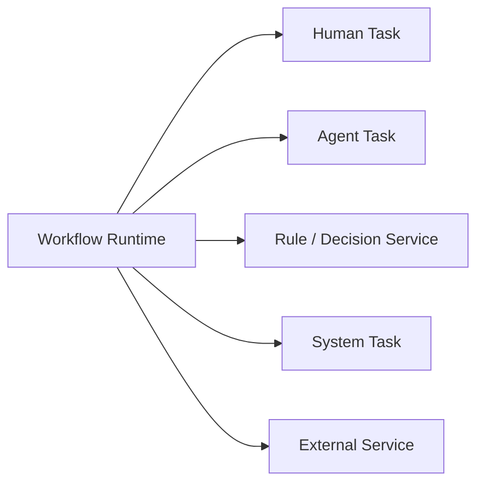
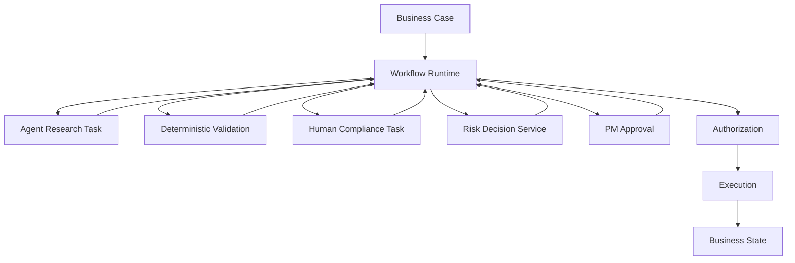
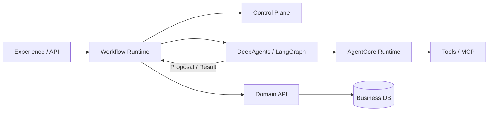
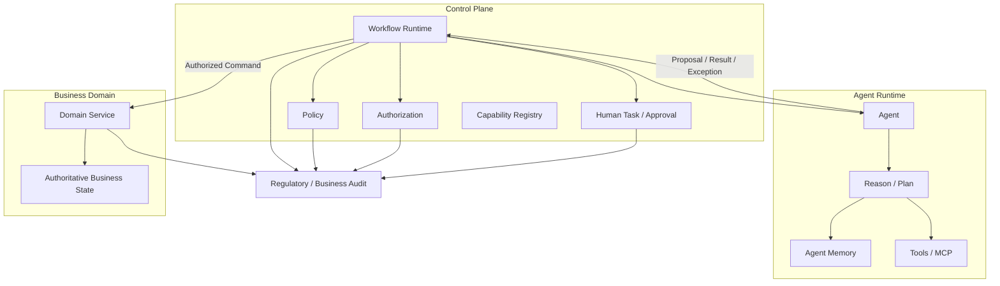

# Agent Runtime 为什么不应该拥有 Workflow 状态机

> **核心原则：Agent Runtime 可以拥有自己的 Execution State，但不应该成为 Business Workflow State 的 Source of Truth。**

很多 Agent 平台都会自然地走向下面这种架构：

```text
Agent
 ↓
LLM
 ↓
Tool
 ↓
Next Step
 ↓
Tool
 ↓
Human Approval
 ↓
Next Step
 ↓
Complete
```

然后有人进一步把这些步骤做成：

```text
Agent Runtime
    +
State Machine
    +
Workflow Engine
    +
Human Task
    +
Approval
    +
Business State
```

表面上看非常方便：一个 Agent 就能把整个业务流程跑完。

但对于企业，尤其是金融服务，这会很快遇到一个根本问题：

> **到底是 Agent 在执行一个 Workflow，还是 Agent 自己已经成为 Workflow Engine？**

两者看起来只差一层，架构含义却完全不同。

成熟的设计应该是：

```text
Business Workflow
        ↓
Workflow Runtime
        ↓
Agent Task
        ↓
Agent Runtime
        ↓
Proposal / Result
        ↓
Workflow Runtime
        ↓
Next Business Step
```

而不是：

```text
Agent Runtime
      ↓
"我觉得下一步应该这样"
      ↓
修改 Workflow State
      ↓
推进 Business Process
```

原因并不是“LLM 不可靠”这么简单。

真正的问题是：

> **Workflow State 是组织和业务系统共同认可的控制状态；Agent State 是一次认知与执行过程中的运行状态。**

这两个 State 的生命周期、权威性、持久化要求、变更权限、审计要求和失败语义完全不同。

---

# 1. 先把三个 State 分清楚

很多 Agent Architecture 的问题，第一步就是把下面三个东西都叫 `state`。

实际上至少要分成：

```text
Agent Runtime State
Workflow State
Business State
```

---

## 1.1 Agent Runtime State

它描述：

> Agent 现在正在想什么、已经做了什么、下一步准备做什么。

例如：

```text
conversation history
tool calls
tool results
current plan
sub-agent context
retrieved documents
working files
scratch state
model outputs
interrupt
checkpoint
```

它服务于：

```text
Reasoning
Planning
Execution
Context Continuity
Recovery
```

这是 Agent Runtime 应该拥有的 State。

LangGraph / DeepAgents 正是这一层的典型实现。当前 DeepAgents 架构文档明确说明，**LangGraph owns runtime state, checkpoints, streaming, and interrupts**；DeepAgents 在其上增加 memory、filesystem、skills、subagents 等能力。

---

## 1.2 Workflow State

它描述：

> 这个业务流程现在处于哪个节点，下一步允许发生什么。

例如一个投资 Idea 流程：

```text
DRAFT
  ↓
SUBMITTED
  ↓
RESEARCH_REVIEW
  ↓
COMPLIANCE_REVIEW
  ↓
PM_APPROVAL
  ↓
EXECUTION
  ↓
COMPLETED
```

Workflow State 需要回答：

```text
当前在哪个节点？
允许哪些 Transition？
有哪些 Pending Tasks？
谁可以操作下一步？
是否已经超时？
是否需要 Escalation？
当前 Workflow Definition 是哪个版本？
```

这已经不是 Agent Context 问题，而是：

```text
Process Control
Authorization
Human Task
Durability
Audit
```

问题。

---

## 1.3 Business State

它描述：

> 业务系统现在认定什么是真的。

例如：

```text
InvestmentIdea.status = APPROVED
Order.status = SETTLED
Position.quantity = 10000
Payment.status = COMPLETED
ClientRiskProfile.level = MEDIUM
```

Business State 是 Domain 的权威事实。

因此：

```text
Agent State
    ≠
Workflow State
    ≠
Business State
```

这三个状态应该有不同的 Owner。

---

# 2. 最重要的架构关系

推荐直接记住：

```text
Agent Runtime owns:
    Reasoning State

Workflow Runtime owns:
    Process State

Domain System owns:
    Business Truth
```

或者：

```text
Agent Runtime
    → "我现在怎么完成任务？"

Workflow Runtime
    → "业务流程现在走到哪一步？"

Domain
    → "业务上现在到底是什么状态？"
```

这是整个问题的核心。

---

# 3. 为什么 Agent Runtime 天然不适合成为 Business Workflow Engine

因为两者的设计目标正好相反。

Agent Runtime 追求：

```text
Adaptability
Exploration
Re-planning
Dynamic Tool Selection
Dynamic Delegation
Context Awareness
Probabilistic Reasoning
```

Workflow Runtime 追求：

```text
Determinism
Durability
Explicit Transitions
Versioning
Retry
Timeout
Escalation
Auditability
Authorization
Replay / Recovery
```

换句话说：

```text
Agent:
"What should I do next?"

Workflow:
"What transitions are legally and operationally allowed next?"
```

前者允许探索。

后者必须约束探索。

所以：

> **把 Workflow State Machine 放进 Agent Runtime，相当于让一个负责“寻找下一步”的组件同时决定“哪些下一步在业务上合法”。**

这正是企业 Agent 架构里应该避免的职责混淆。

---

# 4. LLM 的“下一步”与 Workflow 的“下一状态”不是一回事

例如 Agent 正在处理：

```text
Investment Idea #123
```

它分析以后可能得到：

```text
"I should ask Compliance to review this."
```

这是一个 Agent Proposal。

但是 Workflow Engine 真正需要决定：

```text
CURRENT:
RESEARCH_REVIEW

REQUESTED:
MOVE_TO_COMPLIANCE_REVIEW
```

然后重新验证：

```text
Transition exists?
Required evidence complete?
Current actor authorized?
All mandatory tasks completed?
Policy satisfied?
No open blocking exception?
```

只有验证通过：

```text
Workflow State:
COMPLIANCE_REVIEW
```

才成立。

因此：

```text
Agent:
"Next step should be Compliance Review."

Workflow:
"The transition to Compliance Review is valid."
```

两者不是同一个动作。

---

# 5. 最危险的设计就是让 LLM 直接写 Workflow State

例如：

```typescript
const result = await agent.run(caseData);

if (result.nextStep === "COMPLIANCE_REVIEW") {
  workflow.currentNode = result.nextStep;
}
```

看起来很简单。

但这里实际上发生了：

```text
LLM Output
    ↓
Workflow State Mutation
```

这意味着：

> LLM 已经成为 Workflow Controller。

更危险的是：

```typescript
workflow.status = result.status;
workflow.currentNode = result.nextNode;
workflow.pendingApprovals = result.approvals;
```

这实际上让 Agent 获得了：

```text
Process Authority
```

而不仅仅是：

```text
Execution Capability
```

---

# 6. 为什么金融领域尤其不能这样做

金融 Workflow 通常不是：

```text
A → B → C
```

而是：

```text
A
 ↓
B
 ├── Compliance
 ├── Risk
 └── Operations
       ↓
    Quorum
       ↓
    Execution
```

并且存在：

```text
Authority
Approval
Segregation of Duties
Delegation
Escalation
Deadlines
Exceptions
Audit
```

FINRA 2026 年对 Agent 的监管观察，特别把 **Autonomy、Scope and Authority、Auditability and Transparency** 列为关键风险。FINRA 指出，多步骤 Agent Reasoning 可能使结果难以追踪和解释，而 Agent 也可能超出用户实际或意图授予的 Scope 和 Authority。

如果 Agent Runtime 自己维护：

```text
workflow.current_state
```

并且自己决定：

```text
next_state
```

那么：

```text
Agent Authority
```

和：

```text
Workflow Authority
```

就开始混合。

对于金融系统，这通常不是一个好的边界。

---

# 7. Workflow State 本质上是 Control State

Workflow State 表面上只是：

```text
currentNode = "COMPLIANCE_REVIEW"
```

实际上它包含很多隐含语义：

```text
谁现在可以操作？
哪些操作被允许？
哪些角色还没有完成？
是否可以进入下一阶段？
哪些 Approval 已经满足？
是否需要 Human Task？
是否超时？
是否可以 Cancel？
是否可以 Rollback？
```

所以：

```text
Workflow State
```

本质上属于：

```text
Control Plane
```

而不是：

```text
Agent Memory
```

也不是：

```text
LLM Context
```

---

# 8. Workflow State 一旦成为权威状态，就必须具备 Durable Execution

金融流程经常持续：

```text
几分钟
几小时
几天
甚至几个月
```

例如：

```text
Investment Approval
Loan Approval
KYC Exception
Client Onboarding
Proxy Voting
Trade Settlement
Regulatory Review
```

Agent Runtime 的一次 Session：

```text
Started
 ↓
Reason
 ↓
Tool
 ↓
LLM
 ↓
Done
```

与 Business Workflow 的生命周期没有天然关系。

AWS 当前 AgentCore Runtime 的 Session 就非常典型：Runtime Session 维护 agent 的 execution context，可以支持多步骤工作，但其 Session 本身仍然是运行环境；microVM Session 默认是有生命周期限制的，而长期持久的结构化数据应放到专门的持久化服务中。AWS 明确区分了 Session State、Memory 和其他持久化需求。

所以：

```text
Agent Session survives?
```

和：

```text
Business Case survives?
```

是两个完全不同的问题。

---

# 9. Workflow State 需要“业务级 Durable Execution”

例如：

```text
Case #123

State:
WAITING_FOR_COMPLIANCE_APPROVAL
```

Compliance 一周以后才处理。

这时候：

```text
Agent Runtime
```

可能早就结束了。

但是：

```text
Workflow
```

不能结束。

正确模型：

```text
Workflow Runtime
    ↓
WAITING_FOR_APPROVAL
    ↓
Human Task
    ↓
days later
    ↓
Response Event
    ↓
Workflow Resume
    ↓
Agent Runtime invoked again
```

而不是：

```text
Agent Runtime
    ↓
"please wait 7 days"
    ↓
keep process alive
```

---

# 10. Microsoft Agent Framework 已经体现了这种分工

Microsoft Agent Framework 当前把 Workflow 定义为：

> 显式、可检查的执行路径，用于协调代码、Agent、状态、事件和 Human Input。

它提供：

```text
Graph
Edges
Conditions
Events
State
Checkpoint
Request/Response
```

而 Agent 是 Workflow 中可以被调用的执行单元。

尤其值得注意的是 Human-in-the-loop：

```text
Executor
   ↓
RequestPort
   ↓
Workflow Paused
   ↓
External Human/System
   ↓
Response
   ↓
Workflow Resume
```

并且请求本身可以进入 Checkpoint，恢复后重新发出。

这里已经非常清楚地体现：

```text
Workflow State
```

不是：

```text
LLM Context
```

而是 Runtime/Workflow 层的 Durable State。

---

# 11. LangGraph 也没有证明“Agent Runtime 就应该拥有 Business Workflow”

这是一个特别值得澄清的点。

很多人会看到：

```text
LangGraph
```

然后说：

> “LangGraph 就是 Workflow Engine，所以 Agent Runtime 拥有 Workflow 没问题。”

这个结论太快了。

LangGraph 确实支持：

```text
Graph
Nodes
Edges
State
Checkpoint
Interrupt
Resume
Durable Execution
```

但它的 State 是：

```text
Graph Execution State
```

不是自动等价于：

```text
Business Process State
```

当前 DeepAgents 架构甚至明确把：

```text
LangGraph
```

定义为：

```text
runtime state
checkpoint
interrupt
```

的 owner，而把 Host/Operator Workflow、Channel Routing、Session Policy 等放到 Runtime 之外。

所以完全可以这样理解：

```text
LangGraph Graph
    =
Agent Execution Graph
```

但：

```text
Business Workflow
    =
Business Process State Machine
```

两者可以相互调用，但不是同一个东西。

---

# 12. 一个非常重要的区别：Agent Graph vs Business Workflow

可以直接做成下面这个表：

|                     | Agent Graph             | Business Workflow                         |
| ------------------- | ----------------------- | ----------------------------------------- |
| 目的                  | 完成 Agent Task           | 完成 Business Process                       |
| Owner               | Agent Runtime           | Workflow/Control Plane                    |
| 驱动者                 | Agent Reasoning         | Explicit Rules + Events + Human Decisions |
| 下一步                 | 可动态变化                   | 受 Transition Rules 约束                     |
| State               | Context / Execution     | Process State                             |
| 失败                  | Retry / Re-plan         | Deterministic Retry / Escalation          |
| Pause               | Interrupt               | Durable Wait                              |
| Human               | Tool Approval / Request | Human Task / Approval                     |
| Version             | Prompt / Agent Version  | Workflow Definition Version               |
| Audit               | Agent Trace             | Business Execution Record                 |
| Authority           | Agent Capability        | Organizational / Policy Authority         |
| 生命周期                | Session / Task          | Business Case                             |
| 业务事实                | 非 Source of Truth       | 也不是，最终归 Domain                            |
| 数据来源                | Context                 | Domain + Workflow                         |
| 允许改变 Business State | 不直接                     | 通过授权 Command                              |

所以：

> **Agent Graph 可以是 Workflow 的一个节点；Workflow 不应该默认成为 Agent Graph 的一个隐含副作用。**

---

# 13. AWS 的当前架构已经明确区分 Dynamic Workflow 和 Deterministic Workflow

这是现在非常重要的业界信号。

AWS 2026 Agentic AI Lens 明确建议先区分：

```text
Dynamic
Deterministic
Hybrid
```

对于动态、由模型推理决定下一步的 Agent Workflow，可以使用 Agent Framework 自身的 orchestration，例如 Strands、LangGraph 等；而对于设计时已经知道完整执行图的确定性流程，例如：

```text
Approval Workflow
Batch Processing
Data Transformation
```

则建议使用 Step Functions 等确定性 Workflow Engine。

这其实正好解释了：

> Agent Runtime 不应该“拥有所有 Workflow”。

而应该：

```text
Dynamic Reasoning Flow
    → Agent Runtime

Deterministic Business Flow
    → Workflow Runtime
```

---

# 14. Workflow Engine 的真正优势不是“画流程图”

很多团队认为：

```text
Step Functions / Temporal / BPMN
```

只是：

> “把流程画出来。”

其实完全不是。

Workflow Engine 真正解决的是：

```text
Durability
Retries
Timers
Signals
Concurrency
Compensation
Versioning
Timeout
Escalation
Recovery
Idempotency
Audit
```

例如 AWS Step Functions Standard Workflows 面向长期、Durable、Auditable 的执行，并提供完整的 Execution History；State Machine 还提供 Retry/Catch 等确定性的错误处理。

这和 Agent Runtime 的核心问题明显不同。

---

# 15. 一个 Agent Runtime 自己做 Workflow，会重复造很多基础设施

假设你把：

```text
DeepAgent
```

直接变成 Business Workflow Engine。

很快就会需要：

```text
workflow_id
workflow_version
current_node
previous_node
transition_history
pending_tasks
pending_approval
assignee
deadline
timer
retry_count
escalation
cancel
suspend
resume
compensation
idempotency_key
correlation_id
workflow_variables
execution_history
```

然后你会发现：

> 你其实正在重新实现一个 Workflow Runtime。

而且这个 Runtime 是和：

```text
LLM loop
Tool loop
Memory
Prompt
Checkpoint
```

耦合在一起的。

这会直接造成架构复杂度爆炸。

---

# 16. 更严重的问题：Recovery 会变得非常困难

考虑：

```text
Agent
 ↓
Create Payment
 ↓
LLM thinks next step
 ↓
Approve Payment
```

在：

```text
Approve Payment
```

之前机器 Crash。

现在有两种 State：

```text
Agent Runtime State
Workflow State
```

如果两者混在一起，你必须回答：

```text
Agent 有没有已经批准？
Workflow 有没有已经进入 Approved？
Payment API 有没有已经执行？
```

这会迅速变成：

```text
distributed state consistency problem
```

而如果职责分离：

```text
Workflow State:
PENDING_EXECUTION

Agent State:
checkpoint at step 17

Command:
NOT_EXECUTED

Business State:
PAYMENT_PENDING
```

Recovery 就清晰很多。

---

# 17. Workflow State 应该通过 Command Transition 改变

推荐模型：

```text
Agent
  ↓
Request Transition
  ↓
Workflow Gateway
  ↓
Validate Transition
  ↓
Authorization
  ↓
Policy
  ↓
State Transition
```

而不是：

```text
Agent
  ↓
workflow.currentState = NEXT
```

例如：

```typescript
await workflow.requestTransition({
  workflowId,
  transition: "SUBMIT_FOR_COMPLIANCE",
  requestedBy: agentPrincipal,
  reason,
});
```

Workflow Runtime 自己判断：

```text
currentState === RESEARCH_REVIEW
    ?
transition allowed
    ?
required evidence complete
    ?
task complete
    ?
authorization valid
    ?
```

最后：

```text
currentState =
    COMPLIANCE_REVIEW
```

---

# 18. 为什么 Workflow Transition 本身也是一种 Capability

这个点和前面“Agent 不能决定自己的 Authority”完全一致。

很多系统只保护：

```text
create_payment
approve_trade
send_email
```

但忽略：

```text
advance_workflow
skip_review
reopen_case
cancel_approval
override_compliance
```

实际上 Workflow Transition 本身就是一个高价值 Capability。

例如：

```text
MOVE_TO_EXECUTION
```

可能比：

```text
read_market_data
```

更敏感。

因为它意味着：

```text
业务流程控制权发生变化。
```

因此：

```text
Workflow Transition
```

也必须经过：

```text
Authorization
Policy
SoD
Approval
```

而不能成为 Agent Runtime 的内部状态更新。

---

# 19. 一个特别危险的模式：Agent 可以“跳节点”

例如：

```text
Workflow:

Research
 ↓
Compliance
 ↓
Risk
 ↓
PM Approval
 ↓
Execution
```

Agent 发现：

```text
"Compliance is unnecessary."
```

于是：

```text
nextNode = PM_APPROVAL
```

如果 Agent Runtime 拥有 Workflow State：

```text
Research
 ↓
LLM says skip
 ↓
PM_APPROVAL
```

那么：

> Agent 已经修改了组织内部的 Control Flow。

这不是普通的 Agent Error。

这是：

```text
Control Bypass
```

因此 Workflow State Machine 必须由一个不受 Agent 自主推理控制的边界来维护。

AWS 当前 Agentic AI Lens 对 Workflow Orchestration Security 的要求也非常直接：State Machine 应有严格的访问控制，Transition 应进行输入验证，并记录足以重建执行路径的执行信息；状态机定义应受到受控管理，而不能让任意 Principal 修改。

---

# 20. 金融领域还要考虑“流程版本”

这是 Agent Runtime 非常容易做错的地方。

例如：

```text
Workflow v17
```

规定：

```text
Research
 → Compliance
 → PM
 → Execution
```

后来：

```text
Workflow v18
```

变成：

```text
Research
 → Risk
 → Compliance
 → PM
 → Execution
```

如果一个 Case：

```text
created under v17
```

处理中途 Agent Runtime 更新到 v18：

```text
Agent sees new prompt
Agent sees new tool list
Agent sees new instructions
```

会发生什么？

如果 Workflow State 在 Agent Runtime：

```text
Agent Runtime Version
       +
Workflow Version
       +
Business Case Version
```

容易发生隐式混合。

正确做法：

```text
Workflow Instance
    ↓
definitionVersion = v17
```

整个业务 Case 在这个版本上运行，除非发生明确的 Migration。

这是 Workflow Runtime 应该解决的问题，而不是 LLM Context。

---

# 21. Agent Prompt Version ≠ Workflow Version

两者经常被混淆。

例如：

```text
Agent Prompt v42
```

修改的是：

```text
如何分析投资 Idea
```

而：

```text
Workflow v17
```

修改的是：

```text
什么时候必须经过 Compliance
```

这是两种完全不同的变化。

因此：

```text
Agent Version
Model Version
Prompt Version
Skill Version
Tool Version
Workflow Definition Version
Policy Version
```

都应该独立记录。

金融系统尤其需要这种版本分离，因为一项业务决定必须能够回答：

```text
当时使用的是哪个 Workflow？
当时是什么 Policy？
Agent 当时是什么版本？
模型是什么版本？
使用了哪些工具？
```

---

# 22. Workflow State 的 Audit 也和 Agent Trace 不一样

LangSmith / Agent Trace 可以告诉你：

```text
LLM called tool X
Tool returned Y
Agent reasoned Z
```

但金融 Audit 通常要回答：

```text
Case entered Compliance Review at 10:31
Compliance Task assigned to Alice
Alice approved at 11:02
Workflow transitioned to Risk Review
Risk Review was completed at 12:10
Workflow transitioned to PM Approval
```

这是：

```text
Business Execution Evidence
```

不是：

```text
Agent Observability Trace
```

因此：

```text
Agent Trace
    ≠
Workflow Audit
```

这和你之前讨论的 LangSmith 与 Regulatory Audit Evidence 分离，是同一个架构原则。Agent Observability 可以辅助解释过程，但不能自动成为监管意义上的 Business Audit Record。

---

# 23. Workflow State 应该能脱离 Agent 存在

这是一个非常实用的判断标准：

> **如果 Agent 被完全删除，Workflow State 是否仍然有意义？**

例如：

```text
Case #123
State = WAITING_FOR_COMPLIANCE_APPROVAL
```

即使没有 Agent：

```text
Human Compliance Officer
```

仍然可以打开 Case 并继续流程。

这说明：

```text
Workflow State
```

不是 Agent State。

反过来：

```text
Agent Thread
State:
retrieval_results = [...]
current_plan = [...]
```

如果 Agent 被删除：

```text
Business Process
```

通常不应该因此改变。

这就是一个非常好的 Architecture Boundary Test。

---

# 24. 第二个判断标准：Workflow 是否必须支持“没有 Agent 的路径”

金融系统经常有：

```text
Manual Path
Agent-Assisted Path
Fully Automated Path
Exception Path
Fallback Path
```

例如：

```text
Case
 ├── Agent Research
 └── Human Research
```

两条路径最终都进入：

```text
COMPLIANCE_REVIEW
```

那么：

```text
COMPLIANCE_REVIEW
```

必须属于 Workflow。

否则你的流程只存在于 Agent Runtime 里面。

一旦 Agent 下线：

```text
Business Process = lost
```

这是企业架构无法接受的。

---

# 25. Agent 应该是 Workflow 的一个可替换 Executor

成熟模型更像：



例如：

```text
Workflow:
Research
 ↓
Agent Research Task
 ↓
Compliance Task
 ↓
Risk Decision
 ↓
PM Approval
 ↓
Execution
```

这里：

```text
Agent Research Task
```

只是：

```text
Executor
```

而不是：

```text
Workflow Owner
```

---

# 26. 这对 Agent Platform 有一个很重要的架构意义

Agent Platform 不应该说：

> “我们的 Agent 可以运行 Workflow。”

更精确的说法应该是：

> **我们的 Workflow 可以调用 Agent，而 Agent Runtime 可以在 Workflow Task 中执行动态推理。**

这两句话看起来只是主语变了。

实际架构却完全不同。

前者容易变成：

```text
Agent
  └── Workflow
```

后者是：

```text
Workflow
  ├── Human
  ├── Agent
  ├── Rule
  ├── API
  └── System Task
```

第二种更适合企业。

---

# 27. 不是所有 Workflow 都需要外部 Workflow Engine

这里必须特别避免过度设计。

并不是：

```text
Agent Runtime
```

只要出现：

```text
A → B → C
```

就必须上：

```text
Temporal
Step Functions
BPMN
```

这也不是 AWS 当前建议的方向。

AWS 2026 Agentic AI Lens 明确区分动态和确定性工作流：

```text
Dynamic Agent Workflow
→ Agent Framework Orchestration

Deterministic Workflow
→ Dedicated Workflow Engine

Hybrid
→ Workflow Skeleton + Agentic Decision Points
```

因此真正的规则应该是：

> **不是“Agent Runtime 不能有状态机”，而是“Agent Runtime 不应该自动成为业务流程的权威状态机”。**

---

# 28. 三种 Workflow 模式应该明确区分

## 模式 A：Agent-internal Execution Graph

例如：

```text
Research
 ↓
Search
 ↓
Search
 ↓
Analyze
 ↓
Summarize
```

这里 Agent 可以自己决定：

```text
next tool
next sub-agent
whether to retry
whether to search again
```

这是：

```text
Agent Runtime State
```

完全合理。

---

## 模式 B：Hybrid Workflow

例如：

```text
Workflow:
Case Submitted
 ↓
Agent Research
 ↓
Policy Check
 ↓
Agent Recommendation
 ↓
Human Review
 ↓
Execution
```

这里：

```text
Workflow skeleton
```

是确定性的。

但是：

```text
Agent Research
Agent Recommendation
```

内部仍然是动态的。

这通常是金融 Agent 最实用的模式。

---

## 模式 C：Fully Deterministic Business Workflow

例如：

```text
Payment
 ↓
Validate
 ↓
Compliance
 ↓
Approval
 ↓
Dual Authorization
 ↓
Settlement
```

这里流程本身应该由：

```text
Workflow Runtime
```

拥有。

Agent 可以作为：

```text
Risk Analysis Task
Exception Investigation Task
Document Review Task
```

但不应该拥有整个 State Machine。

---

# 29. 金融服务通常应该偏向 Hybrid

因为金融业务通常存在：

```text
确定的 Control Flow
+
不确定的 Cognitive Work
```

例如：

```text
确定：
必须经过 Compliance
必须经过 PM
超过金额阈值必须双签
Maker ≠ Checker
必须记录 Audit

不确定：
文档怎么研究
风险点是什么
异常原因是什么
需要搜索哪些资料
应该提出什么 Recommendation
```

恰好形成：

```text
Deterministic Workflow
        +
Agentic Tasks
```

而不是：

```text
Fully Agentic Workflow
```

FSB 2026 年的金融 AI 咨询报告也特别强调，机构应为 Agent 设置边界、禁止动作和 Human Approval Checkpoints，并对金融交易设置 Human Approval / Dual Authorization、限制 Agent 直接访问支付系统，以及保留交易审计轨迹。

这实际上就是 Hybrid Workflow 的治理基础。

---

# 30. 一个金融 Agent Workflow 的推荐结构

例如：



注意这里：

```text
Workflow Runtime
```

才知道：

```text
当前 Case 在哪一步
```

而：

```text
Agent Runtime
```

只知道：

```text
当前 Agent Task 应该怎么完成
```

---

# 31. Agent 应该能够“建议 Transition”，但不能直接完成 Transition

例如：

```text
Agent:
"I recommend moving this case to Compliance Review."
```

然后：

```text
Workflow Gateway:
transition requested
```

再做：

```text
Current State?
Allowed Transition?
Evidence?
Authorization?
Policy?
Pending Tasks?
```

最终：

```text
ALLOW
```

才执行：

```text
RESEARCH_REVIEW
    ↓
COMPLIANCE_REVIEW
```

于是：

```text
Agent decides:
WHAT TO PROPOSE

Workflow decides:
WHETHER THE TRANSITION IS VALID
```

这和你前面那篇：

> Agent Proposal vs Business Decision

其实是同一个架构模式在 Workflow 上的应用。

---

# 32. Workflow Transition 本身可以被看成一种 Business Decision

例如：

```text
MOVE_TO_EXECUTION
```

不是一个普通技术状态变化。

它可能意味着：

```text
所有审批完成
权限满足
风险限制满足
客户授权有效
```

因此：

```text
Workflow Transition
```

实际上也是：

```text
Control Decision
```

甚至：

```text
Business Decision
```

的一种表现。

因此更不能把：

```text
currentNode = nextNode
```

看成普通内存写入。

---

# 33. 为什么 Workflow State 不应该存进 Agent Memory

例如：

```text
Agent Memory:
"Case 123 is waiting for PM approval."
```

这看起来很方便。

但问题是：

```text
这个状态是谁写的？
什么时候写的？
依据哪个 Workflow Version？
是否已经发生 State Transition？
PM Task 是否真正存在？
Approval 是否已经撤销？
```

如果只存在 Agent Memory：

```text
Memory says:
WAITING_FOR_PM
```

但 Workflow Registry：

```text
actually:
COMPLIANCE_REVIEW
```

那么：

> 哪一个是真的？

答案必须非常明确：

```text
Workflow Registry = authoritative
Agent Memory = contextual reference
```

这也是为什么之前的：

> Business State 不应该存在 Agent Memory 中

应该进一步扩展成：

> **Workflow State 也不应该以 Agent Memory 作为 Source of Truth。**

---

# 34. Workflow State 不应该依赖 LLM Context 才能恢复

另一个很实用的测试：

> 如果把整个 Conversation History 删除，Workflow 是否仍然可以继续？

正确答案应该是：

```text
YES
```

因为：

```text
Workflow State
```

应该存在于：

```text
Workflow Store
```

而不是：

```text
LLM Context
```

例如：

```text
workflow_instance
-----------------
workflow_id
definition_version
current_state
pending_tasks
variables
deadline
created_at
updated_at
```

Agent Context 则完全可以：

```text
thread
messages
tool_results
retrieved_context
working_memory
```

两者独立。

---

# 35. Workflow State 还需要强一致语义

例如：

```text
Current State:
WAITING_FOR_PM_APPROVAL
```

同时收到：

```text
Approve
```

和：

```text
Reject
```

两个事件。

Workflow Runtime 必须有确定答案：

```text
哪一个先发生？
哪个被接受？
哪个被拒绝？
State 最终是什么？
```

Agent Runtime 不适合负责这个问题，因为 Agent 的核心工作不是：

```text
distributed concurrency control
```

Workflow Runtime 则应该明确提供：

```text
Optimistic Lock
Event Ordering
Idempotency
Deduplication
State Transition Guard
```

这些都是确定性基础设施问题。

---

# 36. 再看一个金融例子：Maker-Checker

流程：

```text
Maker
 ↓
Agent Proposal
 ↓
Checker Approval
 ↓
Execution
```

如果 Agent Runtime 自己拥有 Workflow State：

```text
Agent:
"Checker approved."
```

然后：

```text
state = READY_FOR_EXECUTION
```

问题立即出现：

```text
谁写的？
是否真的 Approval？
Checker 是不是 Maker？
Approval Scope 是否一致？
Approval 是否过期？
```

如果 Workflow Runtime 独立存在：

```text
Checker Task
    ↓
Approval Service
    ↓
Decision Record
    ↓
Workflow Transition
```

那么 Agent 只会得到：

```text
Workflow Event:
CHECKER_APPROVED
```

而不能自己创造：

```text
CHECKER_APPROVED
```

这就是安全边界。

---

# 37. Workflow Engine 甚至应该拒绝 Agent 自带的状态

例如 Agent 发：

```json
{
  "nextState": "EXECUTION",
  "approvalCount": 2,
  "compliancePassed": true
}
```

Workflow Runtime 不应该相信：

```text
approvalCount
compliancePassed
```

而应该重新查询：

```text
Approval Ledger
Compliance Decision
Authorization
Current Business State
```

即：

```text
Agent Proposal
      ↓
Workflow Input
      ↓
Re-derive Control State
```

而不是：

```text
Agent Output
      ↓
Overwrite Workflow State
```

这和“LLM Output 必须被视为 Untrusted Input”的原则完全一致。

---

# 38. Workflow Engine 是 Agent 的“外部现实”

可以把 Agent Runtime 理解成：

```text
Agent:
"我认为现在应该去做 X。"
```

Workflow Runtime：

```text
"X 在当前流程里是否允许？"
```

Domain：

```text
"X 执行以后，业务事实到底是什么？"
```

因此：

```text
Agent = Cognitive Layer

Workflow = Process Control Layer

Domain = Business Truth Layer
```

这是比：

```text
Agent = Workflow = Application
```

更健康的企业架构。

---

# 39. 这也解释了为什么 Control Plane 不应该等于 Agent Runtime

前面你讨论过：

> Agent Control Plane 与 Agent Runtime 分离。

这里可以进一步明确：

```text
Control Plane
├── Workflow Definition
├── Workflow Instance
├── Policy
├── Authorization
├── Human Task
├── Approval
├── Capability
└── Agent Registration

Agent Runtime
├── Model
├── Context
├── Memory
├── Tool Loop
├── Reasoning
├── Planning
└── Agent-local State
```

两者之间：

```text
Agent Runtime
       ↓
Task / Proposal / Event
       ↓
Control Plane
       ↓
Policy / Workflow / Authorization
       ↓
Command
```

这就是非常适合企业 Agent Platform 的结构。

---

# 40. 对你当前的 FastAPI + DeepAgents + AgentCore 架构意味着什么

如果当前平台是：

```text
FastAPI
 ↓
DeepAgents / LangGraph
 ↓
AgentCore Runtime
 ↓
Tools / MCP
```

不建议继续把：

```text
Workflow State Machine
Human Task State
Approval State
Business Case State
```

全部塞进：

```text
DeepAgents / LangGraph State
```

更合理的是：



其中：

### DeepAgents / LangGraph

负责：

```text
Agent execution
Reasoning
Dynamic planning
Tool orchestration
Interrupt
Agent checkpoint
```

### Workflow Runtime

负责：

```text
Case lifecycle
State machine
Transition
Task
Timer
Retry
Escalation
Resume
Version
```

### Control Plane

负责：

```text
Policy
Authorization
Approval
Human Task
Capability
Agent Registration
Risk Control
```

### Domain API

负责：

```text
Business Command
Business State
Business Rules
```

---

# 41. 不一定要把 Workflow Runtime 做成一个巨大产品

这里也应该防止过度工程化。

Workflow Runtime 可以非常轻：

```text
PostgreSQL
+
State Transition Service
+
Outbox
+
Job / Event Worker
+
Human Task
```

并不一定需要马上引入：

```text
BPMN Suite
Temporal
大型 Workflow Platform
```

尤其如果流程数量少、流程结构明确，可以先实现：

```text
workflow_definition
workflow_instance
workflow_task
workflow_transition
workflow_event
```

然后把：

```text
current_state
```

由：

```text
Transition Service
```

确定性维护。

真正重要的是：

> **职责分离比技术产品选择更重要。**

---

# 42. 一个最小 Workflow State Model

例如：

```typescript
interface WorkflowInstance {
  id: string;

  workflowDefinitionId: string;
  workflowVersion: string;

  businessCaseId: string;

  currentState: string;

  version: number;

  startedAt: string;
  updatedAt: string;
}
```

Transition：

```typescript
interface WorkflowTransition {
  id: string;

  workflowInstanceId: string;

  fromState: string;
  toState: string;

  requestedBy: Principal;
  reason?: string;

  policyDecisionId: string;

  createdAt: string;
}
```

然后：

```text
UPDATE workflow_instance
SET current_state = :toState,
    version = version + 1
WHERE id = :id
  AND current_state = :fromState
  AND version = :version
```

这样至少具备：

```text
Optimistic Concurrency
Explicit Transition
Versioning
Audit
```

Agent 无法直接：

```text
UPDATE workflow_instance
```

---

# 43. Agent 与 Workflow 的接口应该是 Event / Command，而不是 State Mutation

推荐：

```text
Agent → Workflow:
REQUEST_TRANSITION
PROPOSE_ACTION
REPORT_RESULT
REQUEST_HUMAN_INPUT
REPORT_EXCEPTION
```

Workflow → Agent：

```text
EXECUTE_TASK
PROVIDE_CONTEXT
RESUME_TASK
REQUEST_REWORK
REQUEST_ANALYSIS
```

而不是：

```text
Agent → Workflow:
setState(...)
```

这样可以形成非常清晰的边界：

```text
Agent sends Intent / Result
Workflow decides Transition
```

---

# 44. Human Task 也因此自然归 Workflow，而不是 Agent

例如 Agent：

```text
I need Compliance approval.
```

应该：

```text
Agent
 ↓
Request Human Task
 ↓
Workflow Runtime
 ↓
Create Compliance Task
 ↓
Assign
 ↓
Notify
 ↓
Wait
 ↓
Decision
 ↓
Resume
```

而不是：

```text
Agent Memory:
pendingApproval = true
```

后者无法很好解决：

```text
Assignment
Delegation
Timeout
Escalation
Substitution
Quorum
SoD
Audit
```

而这些恰恰是金融业务必需的。

---

# 45. 这也解释了 Human-in-the-loop 为什么是 Workflow Primitive

Microsoft 当前 Workflow 实现的：

```text
RequestPort
Checkpoint
Resume
```

本质上就是：

```text
Durable Human Interaction
```

而不是：

```text
Agent asks user a question
```

两者区别很大。

前者：

```text
Business Process is WAITING
```

后者：

```text
Agent is THINKING
```

所以：

```text
Agent Question
    ≠
Human Task
```

同样：

```text
Agent Interrupt
    ≠
Workflow Wait State
```

---

# 46. 一个非常实用的边界测试

以后审查任何 Agent Architecture，可以问：

### 问题一

> 如果 LLM 换掉，Workflow State 是否还能正常运行？

必须：

```text
YES
```

---

### 问题二

> 如果 Agent Session 结束，Business Case 是否仍然存在？

必须：

```text
YES
```

---

### 问题三

> 如果 Agent 被禁止运行一周，Workflow 是否还能被 Human 继续操作？

在多数企业流程中应该：

```text
YES
```

---

### 问题四

> 如果完全删除 Agent，Workflow 是否仍然可以解释当前 Business Process 在哪里？

应该：

```text
YES
```

---

### 问题五

> Agent 是否可以通过自然语言生成改变 Workflow State？

答案应该：

```text
NO
```

它只能：

```text
REQUEST
PROPOSE
REPORT
```

---

# 47. 进一步可以定义一个硬性 Invariant

建议直接写进 Architecture Standard：

```text
WORKFLOW-01
Agent Runtime MUST NOT be the authoritative source of Business Workflow State.
```

```text
WORKFLOW-02
Agent-generated output MUST NOT directly mutate Workflow State.
```

```text
WORKFLOW-03
Workflow transitions MUST be validated by a deterministic Workflow/Control component.
```

```text
WORKFLOW-04
Workflow State MUST survive Agent Runtime restart and Agent Session termination.
```

```text
WORKFLOW-05
Workflow State MUST have an explicit definition version.
```

```text
WORKFLOW-06
Workflow transitions MUST be auditable independently of Agent Trace.
```

```text
WORKFLOW-07
Human Tasks, Approval Tasks, Timers, Escalations and Workflow Wait States
MUST belong to Workflow/Control infrastructure rather than Agent Memory.
```

```text
WORKFLOW-08
Agent may propose a workflow transition, but MUST NOT grant itself
the authority to perform the transition.
```

```text
WORKFLOW-09
Business State MUST NOT be inferred solely from Workflow State.
```

```text
WORKFLOW-10
Workflow State MUST NOT be inferred solely from Agent Memory or LLM Context.
```

最后两条尤其重要：

```text
Workflow State
    ≠
Business State
```

因为：

```text
Workflow = process truth
Domain = business truth
```

---

# 48. Workflow State 与 Business State 仍然必须分开

例如：

```text
Workflow:
WAITING_FOR_SETTLEMENT
```

不一定意味着：

```text
Trade:
SETTLED
```

反过来也一样：

```text
Trade:
SETTLED
```

不一定意味着：

```text
Workflow:
COMPLETED
```

Workflow 可能还要：

```text
Notify Client
Generate Report
Reconcile
Archive
```

所以：

```text
Workflow State
```

回答：

> 流程到哪里了？

而：

```text
Business State
```

回答：

> 业务事实是什么？

这两个 State 都不应该由 Agent Runtime 统一管理。

---

# 49. Workflow Engine 和 Agent Runtime 的正确关系

最终可以抽象成：

```text
                Control Plane
                     |
              Workflow Runtime
                     |
      +--------------+--------------+
      |              |              |
   Human Task    Agent Task      System Task
                     |
               Agent Runtime
                     |
          +----------+----------+
          |          |          |
         LLM       Tools      Memory
```

Workflow Runtime 是：

```text
Orchestrator of Business Process
```

Agent Runtime 是：

```text
Executor of Cognitive Work
```

这两个词其实已经把职责说清楚了。

---

# 50. 一个更深层的原因：Workflow 是组织制度的代码化

金融 Workflow 不只是技术流程。

例如：

```text
Maker
Checker
Compliance
Risk
PM
Operations
```

这些不是：

```text
Agent Roles
```

而是：

```text
Organizational Authority
```

Workflow 把这些组织制度编码成：

```text
Allowed Transitions
Required Tasks
Approval Quorum
Segregation of Duties
Escalation Rules
```

所以：

> **Workflow State Machine 实际上是组织控制结构的一种程序化表达。**

把它交给 Agent Runtime，就等于让一个动态、概率性的 Cognitive Component 在一定程度上拥有修改组织控制结构的能力。

这也是为什么在金融领域尤其应该把 Workflow State 与 Agent State 分开。

---

# 51. FSB 的金融治理建议其实正好支持这个边界

FSB 2026 年咨询报告建议金融机构对 Agent：

```text
定义禁止动作
定义需要人工批准的 Checkpoint
限制 Agent 对 API / Data / ICT / Other Agents 的访问
对金融交易设置 Human Approval / Dual Authorization
限制 Agent 直接访问 Payment Systems
保留 Agent Transaction Audit Trails
```

如果 Workflow State Machine 在 Agent Runtime 内部，这些控制很容易变成：

```text
Prompt
+
Agent Logic
+
"Please ask human"
```

而正确做法应该是：

```text
Workflow State
+
Policy
+
Human Task
+
Authorization
```

即使 Agent 不合作：

```text
Workflow
```

也不会允许它跳过：

```text
Approval
```

---

# 52. AWS 目前的一个非常重要的实践信号

AWS 2026 年 Agentic AI Lens 一方面承认：

```text
Agent Workflows
```

可以是动态的，而且 LangGraph、Strands 等 Agent Framework 很适合动态 Graph。

另一方面，它明确建议：

```text
Deterministic workflow
→ Step Functions
```

并且在 Security 部分强调：

```text
State Machine Access Control
Transition Validation
Circuit Breakers
Execution Logging
```

这实际上说明一个越来越清晰的业界模式：

```text
Agentic Intelligence
+
Deterministic Process Control
```

而不是：

```text
Everything is an Agent
```

---

# 53. 对金融 Agent 最合理的架构不是“Workflow vs Agent”

真正应该是：

```text
Workflow
    +
Agent
```

而不是：

```text
Workflow
    OR
Agent
```

其中：

```text
Workflow
```

负责：

```text
Who
When
Which Stage
Which Transition
Which Approval
Which Policy
Which Escalation
```

而：

```text
Agent
```

负责：

```text
How
What Evidence to Search
What to Analyze
What to Recommend
What Tool to Use
How to Re-plan
```

可以把它非常简洁地记成：

> **Workflow 决定“什么时候、能不能往前走”；Agent 决定“这一阶段具体怎么完成”。**

---

# 54. 最后形成一个完整的 Financial Agent Architecture



这里最重要的方向是：

```text
Workflow
   ↓
Agent Task
   ↓
Agent Runtime
   ↓
Result
   ↓
Workflow
```

而不是：

```text
Agent
   ↓
Workflow State Mutation
```

---

# 55. 一个最终可以用于 Architecture Review 的判断框架

看到任何 Agent Workflow 设计，可以依次问：

```text
1. 这个 State 是 Agent State 还是 Workflow State？

2. 如果 Agent Session 消失，这个 State 是否必须保留？

3. 如果模型更换，这个 State 是否仍然应该相同？

4. 这个 State 是否代表组织控制流程？

5. 这个 State 是否决定谁可以做下一步？

6. 这个 State 是否影响 Approval / Authorization / SoD？

7. 这个 State 是否需要长期 Durable Execution？

8. 这个 State 是否需要独立 Audit？

9. Agent 是否可以直接修改它？

10. 如果 Agent 被完全移除，这个 State 是否仍然有业务意义？
```

如果多数答案是：

```text
YES
```

那么这个 State 大概率不应该属于 Agent Runtime。

---

# 56. 最终结论

“Agent Runtime 为什么不应该拥有 Workflow 状态机”真正的问题不是：

> LangGraph 能不能做 Workflow？

当然可以。

也不是：

> DeepAgents 有没有 State？

当然有。

更不是：

> Agent Framework 能不能暂停、Checkpoint、Resume？

现在都可以。Microsoft Agent Framework、LangGraph、DeepAgents 都提供了这些运行时能力。

真正的问题是：

> **Agent Runtime 中的 State，是否应该成为企业业务流程的权威状态？**

对于核心金融业务，答案通常应该是否定的。

更合理的是：

```text
Agent Runtime
    owns
    Agent Execution State

Workflow Runtime
    owns
    Workflow Process State

Domain
    owns
    Business State
```

于是形成：

```text
Agent:
    Reason
    Plan
    Search
    Analyze
    Propose
    Act within granted capability

Workflow:
    Start
    Pause
    Resume
    Route
    Assign
    Approve
    Escalate
    Transition
    Retry
    Timeout

Domain:
    Validate
    Execute
    Mutate
    Establish Business Truth

Audit:
    Record
    Explain
    Reconstruct
```

最关键的一句话是：

> **Agent Runtime 可以决定“如何完成当前 Task”，但不应该决定“整个 Business Process 现在处于什么状态”。**

再进一步：

> **Agent 可以请求 Workflow Transition，但不能仅凭自己的 Reasoning 直接产生 Workflow Transition。**

对于金融服务，这个边界非常重要，因为 Workflow State 不只是技术状态，它承载了：

```text
Authority
Approval
Segregation of Duties
Human Oversight
Control Requirements
Audit Obligations
```

因此最终可以把整个架构原则压缩成：

```text
Agent Runtime
    = Cognitive Execution

Workflow Runtime
    = Process Control

Domain
    = Business Truth

Control Plane
    = Authority & Governance
```

或者更直接：

> **Workflow 是业务控制，Agent 是认知执行。**

二者可以紧密协作，但不应该合并成一个 Runtime。

这也正是当前 AWS Agentic AI Lens、Microsoft Agent Framework，以及 LangGraph / DeepAgents 的设计趋势所反映出来的方向：**动态 Agent Graph 可以属于 Agent Runtime；确定性的、长期运行、需要 Durable State、Human Task、Approval、Audit 和 Transition Control 的 Business Workflow，则应有独立的 Workflow/Control 边界。**

## Architecture Invariants

```text
WORKFLOW-01
Agent Runtime MUST NOT be the authoritative source of Business Workflow State.

WORKFLOW-02
Agent-generated output MUST NOT directly mutate authoritative Workflow State.

WORKFLOW-03
Workflow transitions MUST be validated by Workflow / Control infrastructure.

WORKFLOW-04
Workflow State MUST survive Agent Runtime restart and Agent Session termination.

WORKFLOW-05
Workflow State MUST be versioned independently from Agent / Model / Prompt versions.

WORKFLOW-06
Workflow execution MUST be auditable independently from Agent Observability traces.

WORKFLOW-07
Human Task / Approval / Escalation / Timer state MUST NOT depend on Agent Memory.

WORKFLOW-08
Agent MAY propose a Workflow Transition but MUST NOT grant itself authority
to perform that transition.

WORKFLOW-09
Workflow State MUST NOT be inferred solely from LLM Context or Agent Memory.

WORKFLOW-10
Business State MUST remain authoritative in the Domain system.

WORKFLOW-11
Dynamic Agent Graphs MAY be owned by Agent Runtime when they represent
cognitive/task execution rather than authoritative business process control.

WORKFLOW-12
For high-consequence financial processes, mandatory control transitions
MUST remain deterministic and externally enforceable.
```

### 主要参考

* AWS Well-Architected Agentic AI Lens：动态 Graph、确定性 Workflow、Hybrid Orchestration，以及 Workflow Security Controls。
* AWS Step Functions：Standard Workflow 的 Durable / Auditable 特性、Execution History、Retry/Catch、Redrive。
* Amazon Bedrock AgentCore Runtime：Session 生命周期、Stateful Reasoning、Session State 与长期 Memory 的区别。
* Microsoft Agent Framework：Workflow Graph、State、Checkpoint、Request/Response、Human-in-the-loop 和 Resume。
* LangGraph / DeepAgents：LangGraph 作为 Agent Runtime 的 state/checkpoint/interrupt 层，以及 DeepAgents 对 Agent State 的扩展。
* FINRA 2026 Annual Regulatory Oversight Report：Agent 的 Autonomy、Scope and Authority、Auditability and Transparency 风险。
* FSB 2026 *Sound Practices for Responsible Adoption of AI: Consultation Report*：Agent 边界、Human Approval Checkpoints、Dual Authorization、限制直接访问支付系统和 Agent Transaction Audit Trail；截至 2026 年 9 月仍为 Consultation Report。
