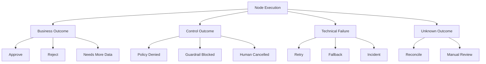
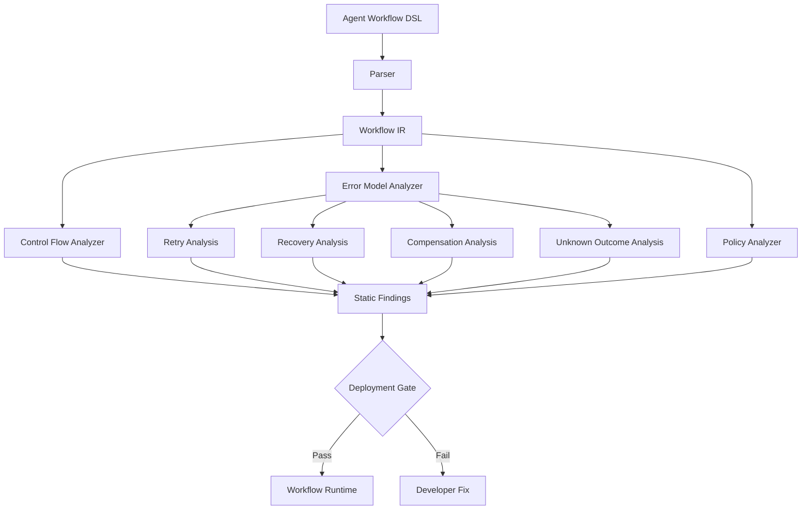
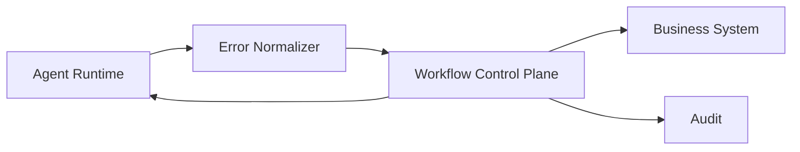
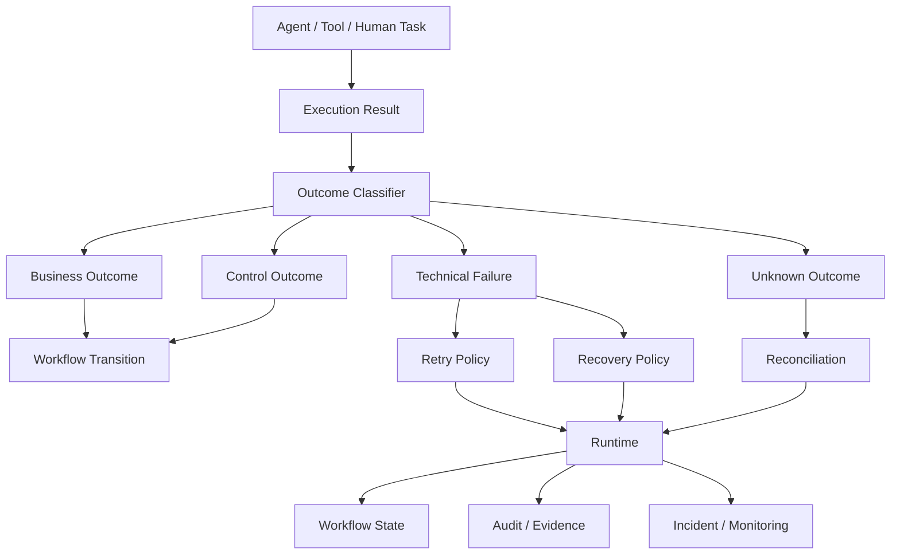
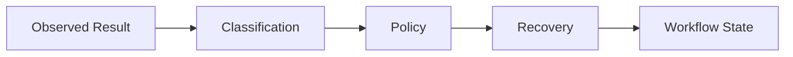

# Agent Workflow DSL 的错误模型设计

传统 Workflow 的错误模型通常并不复杂：

```text
Task
 ├── success → Next
 └── failure → Retry / Catch / Fail
```

但进入 Agent Workflow 后，这个模型很快就不够用了。

一次 Agent 执行可能同时包含：

```text
LLM 推理
Tool Call
MCP Call
数据检索
Schema Validation
Guardrail
Policy Decision
Human Approval
External API
Compensation
```

于是“失败”不再只有一种含义。

例如：

```text
客户没有资格 → 不是系统故障
风险策略拒绝 → 不是系统故障
用户拒绝审批 → 不是系统故障
LLM 输出 JSON 不合法 → 是执行错误
银行 API 503 → 可能是瞬时故障
付款已经提交，但客户端超时 → 结果未知
工具执行成功，但 Workflow Worker 崩溃 → Runtime Failure
```

如果 DSL 把这些情况全部建模成：

```text
ERROR
```

Runtime 就会被迫猜：

```text
要不要重试？
要不要补偿？
要不要通知人工？
要不要继续？
要不要终止？
```

这正是 Agent Workflow DSL 最容易出现的设计错误。

AWS Step Functions、Temporal、Camunda 等成熟 Workflow Runtime 并没有把“错误”简单等同于一个异常字符串：Step Functions 对 Retry、Catch 和不同 Error 类型进行显式建模；Temporal 明确区分 Application Failure、Activity Failure、Timeout、Cancellation 等 Failure 类型，并把 Retryability 纳入失败语义；Camunda 则区分业务流程要响应的 Error 与 Runtime 层面的 retry / incident 处理。([AWS Documentation][1])

因此，一个 Agent Workflow DSL 真正应该设计的不是：

> **“Exception 怎么传递？”**

而是：

> **“一次异常、拒绝、等待、取消或不确定结果，到底意味着 Workflow 应该如何继续？”**

---

# 1. Agent Workflow 最大的问题：Error 不是一个维度

一个普通的程序错误通常可以表示为：

```text
Exception
    ↓
catch
    ↓
handle
```

Workflow 则至少需要回答四个问题：

```text
发生了什么？
为什么发生？
还能不能继续？
如果继续，应该走哪条业务路径？
```

例如：

| 情况                    | 是 Error 吗？        |    能 Retry 吗？ |          是否需要业务分支 |
| --------------------- | ----------------- | ------------: | ----------------: |
| HTTP 503              | 是                 |          通常可以 |             通常不需要 |
| Network timeout       | 是                 |          通常可以 |             通常不需要 |
| Invalid JSON from LLM | 是                 |            可能 |             通常不需要 |
| Tool 不存在              | 是                 |         通常不应该 |              可能需要 |
| 用户拒绝审批                | 否，通常是业务 Outcome   |      不应 Retry |                 是 |
| 风险政策拒绝                | 否，业务/控制 Outcome   |      不应 Retry |                 是 |
| 用户取消                  | 否，Control Outcome |     通常不 Retry |                 是 |
| 审批超时                  | 不一定               | 通常不 Retry 原任务 |                 是 |
| 权限不足                  | 是或 Policy Outcome |     通常不 Retry |       通常需要人工/策略分支 |
| 付款状态未知                | 是，但不是简单 Failure   |    不能盲目 Retry | 需要 reconciliation |
| 已完成副作用后的 Worker 崩溃    | Runtime Failure   |         可重新调度 |            必须依赖幂等 |

这里已经暴露出第一个设计原则：

> **Workflow DSL 不应该只有 Success / Error 两种结果。**

---

# 2. 第一个典型错误：把“业务拒绝”建模成 Exception

假设一个贷款 Workflow：

```text
Evaluate
   ↓
Credit Check
   ↓
Approve
```

信用评分不满足要求：

```text
score < threshold
```

如果 DSL 设计成：

```text
throw CreditRejectedException
```

然后：

```text
catch CreditRejectedException
    → RejectApplication
```

技术上当然可以运行。

但架构上这是一个不必要的混淆。

因为：

```text
CreditRejected
```

并不是：

```text
Credit Service failed
```

它意味着：

```text
Credit Service successfully completed
+
Business decision = rejected
```

Camunda 官方文档对此的处理非常明确：流程中需要分支响应的异常可以建模为 BPMN Error，而底层技术问题则更适合由 retry 或 incident 机制处理；Camunda 还特别指出，“business error”和“technical error”这两个名称本身容易造成混乱，更重要的是看**对该问题采取的是 business reaction 还是 technical reaction**。([Camunda 8 Docs][2])

因此，更好的模型是：

```text
CreditCheck
   ↓
Outcome
 ├── Approved
 └── Rejected
```

而不是：

```text
CreditCheck
   ↓
Exception
```

---

# 3. 第二个典型错误：把所有“不成功”都叫 Failure

Agent Workflow 中至少应该区分：

```text
Success
Business Outcome
Control Outcome
Execution Failure
Uncertain Outcome
```

可以把一次 Node Execution 抽象成：

```typescript
type NodeOutcome<T> =
  | {
      kind: "success";
      value: T;
    }
  | {
      kind: "business";
      code: string;
      data?: unknown;
    }
  | {
      kind: "control";
      code: string;
      data?: unknown;
    }
  | {
      kind: "failure";
      error: WorkflowError;
    }
  | {
      kind: "unknown";
      error: WorkflowError;
    };
```

例如：

```text
success
    → Continue

business/rejected
    → Business Branch

control/denied
    → Policy/Human Branch

failure
    → Retry/Catch/Incident

unknown
    → Reconciliation / Manual Review
```

这比单纯：

```typescript
Result<T> | Error
```

更接近 Workflow 的真实语义。

---

# 4. Agent Workflow 中尤其应该加入“Unknown”

这是传统 Error Model 最容易遗漏的一类。

假设 Agent 调用：

```text
POST /payments
```

结果：

```text
HTTP timeout
```

现在有两种完全不同的情况。

### 情况 A：请求根本没到达服务端

```text
Client
  X
Payment API
```

可以安全 Retry。

### 情况 B：付款已经提交，但响应在网络中丢失

```text
Client
   |
   v
Payment API
   |
   v
Payment completed
   X
response lost
```

此时如果直接：

```text
Retry payment
```

可能产生重复付款。

所以：

```text
Timeout != Retry
```

真正的状态是：

```text
Outcome = Unknown
```

然后执行：

```text
Query Payment Status
        ↓
Known Success
Known Failure
Still Unknown
```

这也是为什么金融 Workflow 的错误模型不能只有：

```text
retryable = true/false
```

还需要：

```text
sideEffectStatus
```

例如：

```typescript
type SideEffectStatus =
  | "NOT_STARTED"
  | "NOT_CONFIRMED"
  | "COMMITTED"
  | "ROLLED_BACK"
  | "UNKNOWN";
```

对于支付、交易、头寸、账户等具有不可逆或者高成本副作用的操作，这一点尤其重要。

---

# 5. 一个更完整的 Workflow Error Model

一个实用的错误对象可以设计成：

```typescript
interface WorkflowError {
  code: string;
  category:
    | "VALIDATION"
    | "MODEL"
    | "TOOL"
    | "DEPENDENCY"
    | "AUTHORIZATION"
    | "POLICY"
    | "TIMEOUT"
    | "CANCELLATION"
    | "RUNTIME"
    | "UNKNOWN";

  retryability:
    | "NEVER"
    | "IMMEDIATE"
    | "BACKOFF"
    | "MANUAL";

  recovery:
    | "RETRY"
    | "FALLBACK"
    | "WAIT"
    | "COMPENSATE"
    | "RECONCILE"
    | "ESCALATE"
    | "TERMINATE";

  scope:
    | "ATTEMPT"
    | "NODE"
    | "BRANCH"
    | "WORKFLOW";

  sideEffect:
    | "NONE"
    | "NOT_STARTED"
    | "COMMITTED"
    | "UNKNOWN";

  codeVersion?: string;
  policyVersion?: string;
  retryAfter?: string;
  details?: unknown;
  cause?: unknown;
}
```

不一定要把所有字段暴露给 Workflow DSL 使用者，但 Runtime 内部最好至少存在类似的信息。

核心不是字段多，而是要把几个经常被混淆的概念分开：

```text
Error Type
Retryability
Recovery Strategy
Execution Scope
Side-effect State
Business Meaning
```

---

# 6. 为什么 Retryability 不应该由 Error Message 推断

不应该出现：

```text
if error.message.includes("timeout"):
    retry()
```

也不应该：

```text
if status >= 500:
    retry()
```

因为：

```text
HTTP 500
```

本身不能证明操作没有发生。

同时：

```text
HTTP 400
```

也不能证明不应该进入人工处理。

成熟 Workflow Runtime 通常将 Retry Policy 做成显式声明。AWS Step Functions 使用 `Retry`、`ErrorEquals`、`MaxAttempts`、`BackoffRate` 等字段；Temporal 的 Retry Policy 也显式指定哪些错误不应该重试，并将永久性错误与瞬时/间歇性错误区分开。([AWS Documentation][1])

Temporal 官方文档尤其值得注意：`ApplicationFailure` 有明确的 `type` 和 `nonRetryable` 属性，而且 retry policy 会基于失败类型进行判断。官方同时指出，永久性错误通常应当直接暴露，而不是不停 retry。([GitHub][3])

因此应该是：

```text
Error
   ↓
Stable Error Code
   ↓
Retry Policy
```

而不是：

```text
Error Message
   ↓
Guess
   ↓
Retry
```

---

# 7. Error Type 和 Error Policy 必须分离

这是 DSL 设计里另一个非常重要的边界。

例如：

```yaml
errors:
  CREDIT_LIMIT_EXCEEDED:
    category: BUSINESS
```

而：

```yaml
retryPolicies:
  defaultExternalCall:
    maxAttempts: 3
    backoff: exponential

  paymentSubmission:
    maxAttempts: 0
```

Workflow：

```yaml
- call: checkCredit
  on:
    CREDIT_LIMIT_EXCEEDED: reject

- call: payment
  retryPolicy: paymentSubmission
```

这里：

```text
Error Type
```

描述：

> 发生了什么。

而：

```text
Retry Policy
```

描述：

> 对这个 Workflow/Activity，系统准备如何处理。

这样可以避免工具本身决定整个企业系统的恢复策略。

Temporal 对这一点的设计非常明确：Application Failure 可以携带 error type 和 `nonRetryable`，同时调用方仍可以通过 Retry Policy 控制如何处理。([GitHub][3])

---

# 8. 第三个典型错误：把 Retry 当成 Error Handler

很多 Agent Workflow 会写成：

```yaml
onError:
  retry: 3
```

然后所有错误都重试。

这实际上把：

```text
Error Detection
```

和：

```text
Recovery Strategy
```

混在了一起。

真正应该问的是：

```text
这个错误为什么发生？
Retry 是否有机会改变结果？
Retry 是否会重复副作用？
Retry 是否会扩大风险？
Retry 是否会消耗业务 SLA？
```

例如：

```text
429 Too Many Requests
```

Retry 可能合理。

```text
503 Service Unavailable
```

Retry 可能合理。

```text
Invalid Customer ID
```

通常没有意义。

```text
Insufficient Funds
```

通常没有意义。

```text
Policy Denied
```

Retry 通常不应该改变结论。

```text
Human Approval Rejected
```

Retry 更没有意义。

因此 DSL 最好允许：

```yaml
retry:
  on:
    - TRANSIENT_PROVIDER_FAILURE
    - RATE_LIMITED
    - TEMPORARY_NETWORK_FAILURE
```

而不是：

```yaml
retry:
  on: "*"
```

---

# 9. “Catch All” 是 Agent Workflow 里很危险的 DSL 特性

AWS Step Functions 支持 `States.ALL`，但也明确限制其使用方式，并特别指出 `States.Runtime` 不能被 Catch；Step Functions 对不同错误类型有不同的重试和捕获语义。([AWS Documentation][1])

这背后的架构原因很重要。

假设：

```yaml
catch:
  - "*": ManualReview
```

看起来很安全。

实际上可能把：

```text
Bug
Schema Corruption
Programming Error
Authorization Failure
Policy Denial
Business Rejection
Provider Outage
```

全部送入：

```text
ManualReview
```

结果就是：

> **真正的问题被“人工处理”掩盖。**

人工 Review 不应该成为：

```text
catch all
```

的垃圾桶。

更合理的是：

```text
known business outcomes → business route
known recoverable failures → retry/fallback
known control failures → policy route
unknown technical failures → incident
irrecoverable failures → terminate
```

---

# 10. Agent 又增加了一组传统 Workflow 没有这么突出的 Failure

OpenAI Agents SDK 当前文档已经明确区分多种 Agent Runtime Failure，例如：

* `ModelBehaviorError`
* `ModelRefusalError`
* `ModelTimeoutError`
* `ToolTimeoutError`
* `UserError`
* `InputGuardrailTripwireTriggered`
* `OutputGuardrailTripwireTriggered`

此外，Function Tool 还可以选择将错误作为模型可见结果，或者重新抛给 Runtime。([OpenAI GitHub][4])

这意味着 Agent Workflow DSL 至少应该能够区分：

```text
MODEL_FAILURE
TOOL_FAILURE
GUARDRAIL_REJECTION
TOOL_NOT_FOUND
INVALID_TOOL_INPUT
INVALID_MODEL_OUTPUT
MODEL_REFUSAL
MODEL_TIMEOUT
TOOL_TIMEOUT
MAX_TURNS_EXCEEDED
```

否则 Runtime 无法进行精细控制。

例如：

```text
invalid JSON
```

可能应该：

```text
retry model call
```

而：

```text
guardrail denied
```

可能应该：

```text
stop
```

再例如：

```text
tool timeout
```

可能：

```text
retry tool
```

而：

```text
tool authorization denied
```

可能：

```text
escalate
```

如果 DSL 只提供：

```text
AgentFailed
```

这些信息就全部丢失了。

---

# 11. LLM 输出错误不应该直接等同于 Tool Error

Agent 特有的另一个问题是：

```text
LLM
 ↓
Tool Call
```

失败可能发生在两个完全不同的位置。

### 情况 A：模型生成了非法工具调用

```json
{
  "amount": "hello"
}
```

Schema 要求：

```text
amount: number
```

这是：

```text
MODEL_OUTPUT_INVALID
```

### 情况 B：工具执行失败

```text
Payment API
   ↓
503
```

这是：

```text
TOOL_EXECUTION_FAILURE
```

两者的恢复策略可能完全不同：

```text
MODEL_OUTPUT_INVALID
    → retry / repair prompt

TOOL_EXECUTION_FAILURE
    → provider retry / fallback

PAYMENT_UNKNOWN
    → reconciliation
```

所以 Agent Workflow DSL 不应该把：

```text
Agent Node
```

视为一个黑盒。

至少在 Runtime 语义上，需要知道：

```text
model phase
tool phase
validation phase
policy phase
```

---

# 12. Guardrail Rejection 也不应该叫 Error

OpenAI Agents SDK 的 Guardrail 可以通过 tripwire 直接停止执行；Tool Guardrail 也可以在 Tool 执行前后阻断调用。([OpenAI GitHub][5])

但：

```text
guardrail = rejected
```

和：

```text
guardrail = crashed
```

显然不是一回事。

例如：

```text
Prompt Injection Detected
```

不是：

```text
Guardrail Runtime Failure
```

它应该是：

```text
Control Outcome
```

可以进一步表示：

```text
SECURITY_REJECTED
```

然后进入：

```text
Stop
Notify
Human Review
Security Workflow
```

而不是：

```text
Retry 3 times
```

否则一个明确的安全拒绝就会变成：

```text
retry
retry
retry
```

从控制系统的角度，这是完全不同的语义。

---

# 13. Policy Denied 最好显式成为 Outcome，而不是 Exception

金融 Workflow 中尤其明显。

例如：

```text
Trade Request
     ↓
Risk Policy
     ↓
DENIED
```

这里的系统工作其实是成功的：

```text
Policy Evaluation = successfully completed
Decision = Denied
```

所以更合理的是：

```text
PolicyResult =
  ALLOW
  DENY
  MANUAL_REVIEW
  UNKNOWN
```

而不是：

```text
PolicyResult =
  ALLOW
  throw DeniedException
```

尤其要避免：

```text
DENIED
   ↓
retry policy check
```

因为 Policy Denial 通常不是瞬时故障。

这是把“业务决定”和“执行错误”放在不同层次上的一个直接体现。

---

# 14. Business Outcome、Control Outcome、Technical Failure 应该成为三条不同通道

一个比较清楚的模型是：



这样 DSL 的 Transition 语义就会非常清楚：

```yaml
on:
  success: next
  business.rejected: reject
  control.denied: stop
  failure.transient: retry
  failure.permanent: incident
  outcome.unknown: reconcile
```

---

# 15. Compensation 也不应该简单建模成 Catch

考虑：

```text
Create Order
    ↓
Reserve Inventory
    ↓
Charge Payment
    ↓
Send Confirmation
```

如果：

```text
Charge Payment
```

失败：

```text
Reserve Inventory
```

可能需要释放。

这不是普通：

```text
catch
```

而是：

```text
compensation
```

AWS 的 Saga Orchestration 指南明确用 Step Functions 展示了：

```text
Place Order
Update Inventory
Make Payment
```

失败时反向执行：

```text
Revert Payment
Revert Inventory
Remove Order
```

以恢复跨服务的一致状态。AWS 同时也明确提醒 Saga 会因为补偿事务而增加调试和设计复杂度。([AWS Documentation][6])

所以 DSL 中最好不要写：

```yaml
catch: compensate
```

而应该显式表示：

```yaml
step:
  execute: reserveInventory
  compensation: releaseInventory
```

因为：

```text
Error Handling
```

和：

```text
Business Compensation
```

是两种不同的语义。

---

# 16. Compensation 本身也可能失败

这是最容易被忽略的一层。

例如：

```text
Payment success
Inventory success
Order success
```

然后：

```text
Shipping service fails
```

于是需要：

```text
Cancel Order
Release Inventory
Refund Payment
```

但：

```text
Refund Payment
```

又失败了。

此时错误模型不能简单地：

```text
catch refundFailure
    → failed
```

因为：

```text
failed
```

已经没有表达力。

真正状态可能是：

```text
BUSINESS_PROCESS_FAILED
+
COMPENSATION_PARTIAL
+
REFUND_PENDING
```

于是 Workflow 需要进入：

```text
Recovery Workflow
```

而不是原 Workflow 简单：

```text
FAILED
```

---

# 17. “Failed” 最好不是一个状态，而是一个生命周期

一个更完整的 Workflow Execution State 可以是：

```text
RUNNING
WAITING
SUCCEEDED
REJECTED
CANCELLED
TIMED_OUT
FAILED
RECOVERING
COMPENSATING
RECONCILING
BLOCKED
```

但也不要把所有东西都塞进一个 enum。

例如：

```text
status = FAILED
recovery = COMPENSATING
```

往往比：

```text
status = COMPENSATING_FAILED_WAITING_FOR_MANUAL
```

更容易维护。

也就是说：

> **状态模型应该避免把多个正交维度压缩成一个巨型枚举。**

可以拆成：

```text
executionStatus
businessOutcome
recoveryStatus
approvalStatus
```

例如：

```json
{
  "executionStatus": "STOPPED",
  "businessOutcome": "REJECTED",
  "recoveryStatus": "NONE",
  "approvalStatus": "NOT_REQUIRED"
}
```

或者：

```json
{
  "executionStatus": "BLOCKED",
  "businessOutcome": "UNKNOWN",
  "recoveryStatus": "RECONCILING"
}
```

---

# 18. Error Scope 也应该进入 DSL

同一个错误，在不同层级可能意味着不同的恢复范围。

例如：

```text
Tool Retry
```

可能只需要重试：

```text
当前 Tool
```

而：

```text
Agent Output Invalid
```

可能需要：

```text
重新执行当前 Agent Turn
```

而：

```text
Policy Context Invalid
```

可能需要：

```text
重新运行整个业务分支
```

因此推荐显式：

```text
Attempt Scope
Node Scope
Branch Scope
Workflow Scope
```

例如：

```yaml
errors:
  TOOL_TIMEOUT:
    recovery:
      scope: ATTEMPT
      strategy: RETRY

  INVALID_RISK_CONTEXT:
    recovery:
      scope: BRANCH
      strategy: RESTART

  POLICY_CONFIGURATION_CORRUPT:
    recovery:
      scope: WORKFLOW
      strategy: INCIDENT
```

---

# 19. Error Propagation 不能简单沿调用栈向上冒泡

传统代码：

```text
function A() {
  B()
}

function B() {
  C()
}

function C() {
  throw Error
}
```

自然可以：

```text
C → B → A
```

逐层传播。

Workflow 却不一定。

例如：

```text
Subworkflow
    ↓
Agent
    ↓
Tool
```

Tool 出错后可能应该：

```text
Tool
 ↓
Agent Replan
```

而不是：

```text
Tool
 ↓
Workflow Failed
```

相反：

```text
Policy Violation
```

可能必须：

```text
Tool
 ↓
Agent
 ↓
Workflow
 ↓
Policy Handler
```

因此 DSL 应该允许定义：

```text
error boundary
```

而不是完全依赖异常冒泡。

Camunda Error Event 的语义就是把某一类 Error 绑定到 Workflow scope 中的 catch event / boundary event；未捕获的 Error 则形成 incident。([Camunda 8 Docs][2])

---

# 20. Error Boundary 是 Agent Workflow DSL 很值得借鉴的概念

例如：

```yaml
node: assessTrade

onError:
  TOOL_TIMEOUT:
    scope: node
    action: retry

  POLICY_DENIED:
    scope: workflow
    action: terminate

  INVALID_MODEL_OUTPUT:
    scope: node
    action: reask

  UNKNOWN_PAYMENT_RESULT:
    scope: workflow
    action: reconcile
```

这比：

```yaml
onError: retry
```

更接近真实执行语义。

---

# 21. Retry Policy 应该靠近执行层，而不是业务流程图到处重复

Camunda 明确建议，技术问题的 retry 不应该被全部画进业务流程，否则流程会被大量技术细节污染；技术 retry 可以由 Runtime 层统一处理，而业务层只建模真正需要业务反应的 Error Path。([Camunda 8 Docs][2])

这个原则对于 Agent Workflow 尤其重要。

不要：

```text
Tool A
  ↓
Retry 1
  ↓
Retry 2
  ↓
Retry 3
  ↓
Tool A
```

把每一次 retry 都画成一个业务节点。

更合理的是：

```text
Call Payment
    │
    └── retryPolicy: provider-default
```

Runtime 内部处理：

```text
attempt = 1
attempt = 2
attempt = 3
```

这样：

```text
Business Workflow
```

保持清晰，而：

```text
Execution Policy
```

保持可配置。

---

# 22. 但是业务 Retry 必须进入 DSL

并不是所有 retry 都属于技术层。

例如：

```text
KYC incomplete
```

可能业务规定：

```text
Request Additional Documents
   ↓
Wait 3 days
   ↓
Re-evaluate
```

这不是：

```text
technical retry
```

而是：

```text
business rework
```

应该显式进入 Workflow Graph：

```text
Review
 ↓
MissingDocuments
 ↓
WaitForCustomer
 ↓
Review
```

因此：

```text
Technical Retry
```

和：

```text
Business Retry / Rework
```

必须严格区分。

---

# 23. Agent 的“重新思考”也不能默认算 Retry

这是 Agent Workflow 最容易出问题的地方。

例如：

```text
LLM → Tool A failed
```

Agent 可能决定：

```text
换 Tool B
```

这不是：

```text
Retry Tool A
```

而是：

```text
Replan
```

于是至少存在：

```text
Retry
Replan
Fallback
Escalate
```

四种不同的恢复动作。

例如：

```text
Tool timeout
    → Retry

Tool unavailable
    → Fallback

Tool result contradicts policy
    → Replan

Tool authorization denied
    → Escalate
```

如果 DSL 只有：

```text
retry
```

Agent 的恢复能力就会被错误地表达。

---

# 24. Replan 必须有限制

否则：

```text
Tool failed
 ↓
Agent thinks
 ↓
Try another
 ↓
Tool failed
 ↓
Agent thinks
 ↓
Try another
 ↓
...
```

最终成为：

```text
Livelock
```

因此 Agent Workflow DSL 应该显式支持：

```text
max_replans
max_turns
max_tool_calls
max_branch_depth
deadline
budget
```

OpenAI Agents SDK 当前也有 `MaxTurnsExceeded` 等执行限制，并在模型、工具和 Guardrail 上提供不同的错误处理语义。([OpenAI GitHub][7])

这些限制不应该只是：

```text
Agent Runtime implementation detail
```

对于生产 Workflow，它们属于执行安全边界。

---

# 25. 一个完整的 Agent Error Algebra

如果把前面的内容进一步抽象，可以得到：

```text
Outcome
├── Success
├── Business
│   ├── Approved
│   ├── Rejected
│   └── NeedsInformation
│
├── Control
│   ├── Denied
│   ├── GuardrailBlocked
│   ├── Cancelled
│   └── AwaitHuman
│
├── Failure
│   ├── Validation
│   ├── Model
│   ├── Tool
│   ├── Dependency
│   ├── Authorization
│   ├── Timeout
│   └── Runtime
│
└── Unknown
    ├── SideEffectUnknown
    └── ExternalStateUnknown
```

而 Recovery 则独立：

```text
Recovery
├── Continue
├── Retry
├── Replan
├── Fallback
├── Wait
├── Escalate
├── Compensate
├── Reconcile
├── Incident
└── Terminate
```

最终形成：

```text
Outcome
    +
Recovery Policy
    +
Execution State
```

而不是：

```text
Error
```

一个巨型对象包打天下。

---

# 26. DSL 可以采用“Outcome + Policy”模型

例如：

```yaml
workflow: trade-review

nodes:

  - id: risk_analysis
    agent: risk-agent

    outcomes:
      success:
        next: policy_check

      invalid_output:
        on: MODEL_OUTPUT_INVALID
        action: retry
        maxAttempts: 2

      unsafe:
        on: GUARDRAIL_BLOCKED
        action: terminate

  - id: policy_check
    policy: trading-policy

    outcomes:
      allowed:
        next: human_approval

      denied:
        next: rejected

      review_required:
        next: human_approval

  - id: human_approval
    humanTask: trade-approval

    outcomes:
      approved:
        next: execute_trade

      rejected:
        next: rejected

      expired:
        next: escalation

  - id: execute_trade
    action: submit_trade

    retry:
      on:
        - PROVIDER_UNAVAILABLE
        - RATE_LIMITED
      maxAttempts: 3

    outcomes:
      success:
        next: completed

      unknown:
        on: RESULT_UNKNOWN
        next: reconcile_trade
```

这个 DSL 有几个明显特点：

```text
业务结果 → outcomes
技术错误 → errors
恢复策略 → retry/recovery
业务流程 → next
```

职责非常清楚。

---

# 27. DSL 不应该允许 Node 自己决定 Workflow 是否“Failed”

不应该：

```python
raise WorkflowFailed(...)
```

让任意 Agent/Tool 自己决定：

```text
整个 Workflow = FAILED
```

因为：

```text
Agent
Tool
MCP Server
Model
```

都只是局部执行参与者。

真正应该决定：

```text
Workflow Execution State
```

的是 Workflow Runtime。

所以更合理的是：

```text
Tool
  ↓
ToolResult / ToolFailure
  ↓
Runtime Error Mapping
  ↓
Workflow Transition
```

而不是：

```text
Tool
  ↓
kill Workflow
```

这个边界对于企业 Agent Platform 尤其重要：

> **Agent 可以报告失败，但不能自行定义企业 Workflow 的失败语义。**

---

# 28. Error Mapping 应该成为 Runtime 的一等能力

工具可能返回：

```json
{
  "httpStatus": 503,
  "message": "temporarily unavailable"
}
```

Runtime 应将其标准化成：

```json
{
  "code": "PROVIDER_UNAVAILABLE",
  "category": "DEPENDENCY",
  "retryability": "BACKOFF",
  "sideEffect": "UNKNOWN"
}
```

另一个 Provider：

```json
{
  "error": "rate_limit"
}
```

也可以映射成：

```text
RATE_LIMITED
```

于是 Workflow DSL 不依赖：

```text
AWS error names
Azure error names
Stripe error names
MCP server error strings
```

---

# 29. Error Code 应该稳定，Message 不应该参与控制流

错误对象建议区分：

```text
code
message
details
```

例如：

```json
{
  "code": "PAYMENT_PROVIDER_UNAVAILABLE",
  "message": "Payment provider returned HTTP 503",
  "details": {
    "provider": "..."
  }
}
```

Workflow 使用：

```text
code
```

而不是：

```text
message
```

这样可以保证：

```text
message 可以本地化
message 可以变化
message 可以脱敏
message 可以变得更详细
```

而：

```text
code
```

保持稳定。

Temporal 的 `ApplicationFailure` 就包含显式 `type`、message 和 details，并使用 `type` 参与 retry policy 判断。([GitHub][8])

---

# 30. Error Details 也不能无条件保存

Agent Workflow 中 error payload 很可能包含：

```text
LLM output
customer data
account information
retrieved document
authorization token
provider response
```

所以：

```text
error.details
```

不是普通日志字段。

应该遵循：

```text
structured
versioned
redacted
access controlled
```

Temporal 官方文档也特别指出 Failure Converter 可以用于保护 failure message 和 stack trace 中的敏感信息。([GitHub][8])

金融 Workflow 更应该避免：

```text
error message = entire prompt + customer record + tool response
```

然后把它永久写进：

```text
workflow history
```

---

# 31. Error Model 和 Audit Model 也需要分开

例如：

```text
Tool failed with HTTP 503
```

是 Runtime Error。

而：

```text
Policy denied trade
```

是一个业务控制结果。

两者不能都只进入：

```text
application.log
```

尤其对于关键金融操作，需要能够区分：

```text
execution failure
business decision
control decision
operator action
recovery action
```

NIST AI RMF 明确要求 AI 系统建立人工监督、生产监控、故障响应、恢复、事故跟踪等机制，并特别强调对 AI incidents and errors 建立记录、响应和恢复流程。([NIST AI Resource Center][9])

这支持一个架构上的结论：

> **Error Model 不只是开发者异常处理机制，也是生产运营与治理模型的一部分。**

---

# 32. 金融服务尤其不能把“失败”理解成单纯的技术问题

BIS 关于金融领域 GenAI 的研究与讲话反复强调：

* AI 可能增加模型风险；
* 第三方基础模型可能增加集中度与第三方依赖风险；
* AI 的输出可能存在 hallucination；
* 人类监督仍然重要；
* AI 带来的风险需要与既有 governance、risk management 和 control framework 结合。([Bank for International Settlements][10])

因此，在金融 Agent Workflow 中：

```text
LLM returned low confidence
```

不一定应该：

```text
throw exception
```

可能应该：

```text
HumanReviewRequired
```

而：

```text
Policy says transaction not allowed
```

应该：

```text
Denied
```

不是：

```text
Failed
```

这是一个非常重要的架构边界：

> **风险控制触发和系统故障不是同一类事件。**

---

# 33. Human Review 本身是 Recovery Strategy，不是 Error

例如：

```text
Agent generates client suitability summary
```

出现：

```text
Confidence below threshold
```

Workflow 可以：

```text
WAIT_FOR_HUMAN
```

而不是：

```text
FAILED
```

也不是：

```text
RETRY
```

因为：

```text
没有任何软件故障
```

只是：

```text
自动化边界被触发
```

可以抽象为：

```text
AUTO_EXECUTABLE
        ↓
    deterministic
        │
        ├── yes → continue
        │
        └── no
             ↓
        HUMAN REVIEW
```

这和 NIST AI RMF 对 human oversight、appeal/override、incident response、recovery 的要求是相符的治理方向。([NIST AI Resource Center][9])

---

# 34. Error Model 最终需要回答的是“下一步是什么”

因此一个好的 Workflow DSL Error Definition 应该满足：

```text
What happened?
        ↓
What category?
        ↓
Can it retry?
        ↓
What scope?
        ↓
What side effect status?
        ↓
What recovery?
        ↓
What audit event?
```

可以用下面这个结构：

```typescript
interface FailureClassification {
  code: string;

  category:
    | "BUSINESS"
    | "CONTROL"
    | "TECHNICAL"
    | "UNKNOWN";

  retry: {
    allowed: boolean;
    policy?: string;
  };

  recovery:
    | "RETRY"
    | "REPLAN"
    | "FALLBACK"
    | "WAIT"
    | "ESCALATE"
    | "COMPENSATE"
    | "RECONCILE"
    | "TERMINATE";

  sideEffect:
    | "NONE"
    | "UNKNOWN"
    | "COMMITTED";

  scope:
    | "NODE"
    | "BRANCH"
    | "WORKFLOW";
}
```

这已经足以支撑大多数企业 Workflow 的核心错误语义。

---

# 35. Error Model 还应该支持 Static Analysis

错误模型设计得不好，Static Analysis 也无法做好。

例如：

```yaml
retry:
  on: "*"
```

Static Analyzer 应该能够提示：

```text
WARN WF-ERR-001
Catch-all retry may retry non-retryable business outcomes.
```

例如：

```yaml
on:
  PAYMENT_UNKNOWN: retry
```

应该：

```text
ERROR WF-ERR-002
PAYMENT_UNKNOWN cannot be retried without reconciliation.
```

又例如：

```yaml
on:
  POLICY_DENIED: retry
```

应该：

```text
ERROR WF-ERR-003
Policy denial is modeled as retryable.
```

这和前面讨论的 Workflow Static Analysis 是直接相连的：Error Model 本身也是 Workflow 的可执行语义，所以应该接受静态验证，而不仅仅是运行时处理。AWS 已经把 Step Functions State Machine Validation 集成到 CI / Code Review 的实践中；BPMN 生态也长期采用 lint + model verification 的分层方式。([AWS Documentation][1])

---

# 36. 可以静态检查哪些 Error Model 问题

至少可以做：

| 检查                        | 示例                                             |
| ------------------------- | ---------------------------------------------- |
| Unhandled Error           | Node 可能产生 Error，但无 handler                     |
| Impossible Handler        | Handler 永远不会收到该 Error                          |
| Retry Business Outcome    | `POLICY_DENIED → retry`                        |
| Retry Unknown Side Effect | `PAYMENT_UNKNOWN → retry`                      |
| Missing Compensation      | Commit 后没有定义恢复策略                               |
| Infinite Retry            | retry 没有上限                                     |
| Infinite Replan           | Agent 可以无限 replanning                          |
| Catch All                 | `* → manual_review`                            |
| Error Shadowing           | 子节点吞掉关键 Policy Error                           |
| Invalid Scope             | Node-level Error 却要求 Workflow-level transition |
| Missing Reconciliation    | External commit uncertain                      |
| Missing Human Escalation  | critical failure 无人工出口                         |
| Invalid Recovery Loop     | recovery 自己回到原错误且无退出                           |
| Sensitive Error Payload   | Error details 可能进入不应存储的区域                      |

这使得：

```text
Error Model
```

本身成为可以编译和验证的 DSL。

---

# 37. Agent Workflow 应该像“编译器”一样处理 Error Model

一个比较成熟的架构可以是：



这样：

```text
Workflow DSL
```

不只是“配置文件”。

它更像：

```text
Business Process Program
```

因此：

```text
parse
type-check
static analysis
compile
execute
```

应该是同一条技术链路。

---

# 38. 一个值得采用的 DSL 三层结构

实际设计时，可以明确分成三层。

## Layer 1：Outcome

描述业务和控制结果：

```yaml
outcomes:
  approved:
  rejected:
  review_required:
  cancelled:
```

---

## Layer 2：Failure

描述技术失败：

```yaml
errors:
  TOOL_TIMEOUT:
  PROVIDER_UNAVAILABLE:
  INVALID_MODEL_OUTPUT:
  AUTHORIZATION_FAILED:
```

---

## Layer 3：Recovery Policy

描述如何恢复：

```yaml
recoveryPolicies:
  transientProvider:
    retry:
      maxAttempts: 3
      backoff: exponential

  unknownPayment:
    action: reconcile

  policyDenied:
    action: terminate

  lowConfidence:
    action: humanReview
```

这样：

```text
Outcome
Failure
Recovery
```

相互独立，但可以组合。

---

# 39. 不建议把 Error 分类做成“技术 vs 业务”两个桶

这是 BPMN 领域值得借鉴的一点。

Camunda 自己也明确指出，“business error”和“technical error”这个二分法容易导致争论，因为某些技术问题也可能需要业务反应。官方更建议按：

```text
business reaction
technical reaction
```

来思考。([Camunda 8 Docs][2])

例如：

```text
Scoring service unavailable
```

可能：

```text
Retry
```

也可能：

```text
Fallback to manual review
```

甚至某个具体业务可能规定：

```text
Continue with conservative default
```

所以真正应该存的是：

```text
Observed Failure
+
Chosen Reaction
```

而不是：

```text
Business / Technical
```

这比二元分类更稳定。

---

# 40. Runtime 应该建立“Normalized Error Envelope”

不同模型、工具和基础设施的失败应该被转换成统一 envelope：

```json
{
  "errorId": "err_123",
  "code": "PROVIDER_UNAVAILABLE",
  "category": "DEPENDENCY",
  "origin": {
    "component": "payment-provider",
    "operation": "submitPayment"
  },
  "retryable": true,
  "recovery": "RETRY",
  "sideEffect": "UNKNOWN",
  "attempt": 2,
  "occurredAt": "2026-09-21T02:10:11Z",
  "traceId": "..."
}
```

上层 Workflow 不应该关心：

```text
AxiosError
FetchError
GrpcError
McpError
OpenAIError
AnthropicError
```

这些都属于：

```text
Adapter / Runtime Layer
```

最终统一成：

```text
Workflow Error Model
```

---

# 41. 这也是为什么 Agent Runtime 与 Workflow Control Plane 应该分离

Agent Runtime 擅长：

```text
LLM
Tool
Context
Memory
Reasoning
Replan
```

Workflow Control Plane 擅长：

```text
State
Policy
Retry
Approval
Timeout
Recovery
Compensation
Audit
```

错误模型应该位于两者之间：



这样：

```text
Agent Runtime reports
```

而：

```text
Workflow Control Plane decides
```

这与当前成熟 Agent SDK 的发展方向也一致：例如 OpenAI Agents SDK 对 Tool Error、Guardrail Tripwire、Model Error 等提供独立机制，而不是让一个通用 exception 统一承载全部语义。([OpenAI GitHub][4])

---

# 42. 金融 Workflow 还需要一个额外维度：Control Criticality

不同错误的风险不同。

例如：

```text
Report formatting failed
```

和：

```text
Trade submission result unknown
```

不能拥有同样的：

```text
recovery policy
```

可以定义：

```yaml
criticality:
  LOW
  MEDIUM
  HIGH
  CRITICAL
```

例如：

```yaml
payment_submission:
  criticality: CRITICAL

email_notification:
  criticality: LOW
```

然后 Runtime 可以约束：

```text
CRITICAL + UNKNOWN
    → mandatory reconciliation

CRITICAL + FAILURE
    → incident or human escalation

LOW + FAILURE
    → retry / ignore
```

这里不是给 Workflow “打分”，而是将不同操作的控制要求显式编码。

---

# 43. 真实金融架构已经体现出这种思路

Amazon Finance Technologies 的支付传输团队公开介绍过其 remittance 服务架构：系统使用 AWS Step Functions，并针对 Workflow 因下游依赖服务故障而失败的情况设计了内部 **sweeper pattern**。系统通过 DynamoDB 的 GSI 标记 Retry、Failed、Running 等状态，再由定时 Lambda 找出达到重试条件的失败项并重新启动 Workflow。该服务在当时支持超过 4200 万笔、覆盖 150 个国家和 60 多种货币的 remittance。([Amazon Web Services, Inc.][11])

这个案例的重要之处不是具体用了 DynamoDB GSI，而是它说明：

```text
Workflow Failed
```

并没有被当成：

```text
流程彻底结束
```

而是：

```text
Failure State
+
Retry Eligibility
+
Recovery Mechanism
```

被单独管理。

同样，Microsoft 为某大型银行客户公开的云转型架构中，原有 Saga Orchestrator 是有限状态机，并明确遇到：

* 状态管理复杂；
* timeout / restart 复杂；
* 每个 transaction 的 workflow state observability 困难。

其方案使用 Azure Durable Functions 负责 Workflow programming model 和 state management，并结合 Event Hubs 和 Cosmos DB。Microsoft 将 Saga 描述为适用于分布式金融交易一致性问题的模式。([Microsoft Learn][12])

这些案例不能证明某一种 Error DSL 必然正确，但足以说明：

> 在金融场景中，失败后的恢复本身就是业务系统的一部分，而不是异常处理代码里的附属逻辑。

---

# 44. 金融服务为什么特别需要“Unknown”

对于：

```text
Email notification
```

执行结果 unknown：

```text
retry
```

通常问题不大。

但：

```text
Payment
Trade
Transfer
Collateral movement
Corporate action
```

执行结果 unknown：

```text
retry
```

可能造成真实资金或资产风险。

因此应该形成非常清晰的规则：

```text
Non-side-effect failure
    → Retry may be safe

Potential side-effect failure
    → Check idempotency / reconciliation

Confirmed side effect
    → Recovery / compensation

Unknown side effect
    → Reconciliation before repeat
```

这其实是金融 Workflow Error Model 最重要的设计之一。

---

# 45. Error Handler 不应该直接执行副作用

例如：

```yaml
on:
  PAYMENT_TIMEOUT:
    action: retry_payment
```

这在 DSL 上看起来很方便。

但更安全的是：

```yaml
on:
  PAYMENT_TIMEOUT:
    action: reconcile_payment
```

然后：

```text
Reconciliation
   ├── PaymentConfirmed → continue
   ├── PaymentFailed → retry
   └── StillUnknown → human review
```

即：

```text
Error Handler
```

先判断状态，再执行副作用。

而不是：

```text
Error Handler
    ↓
Blind Retry
```

---

# 46. 一个好的 Error Model 应该支持“证明不能 Retry”

Static Analyzer 不仅需要检测：

```text
missing handler
```

还可以检测：

```text
unsafe retry
```

例如：

```yaml
- action: submitTrade
  retry:
    maxAttempts: 3
```

但该 Tool contract 声明：

```yaml
idempotency: unknown
```

Analyzer 应该给出：

```text
ERROR WF-ERR-021
Retry configured for side-effecting action,
but idempotency or reconciliation contract is not declared.
```

如果：

```yaml
idempotency:
  mode: IDEMPOTENCY_KEY
  key: tradeRequestId
```

则允许：

```text
retry
```

这会把一个重要的安全约束前移到 DSL 层。

---

# 47. Tool Contract 应该成为 Error Model 的一部分

例如：

```yaml
tool:
  name: submit_trade

  result:
    success: TradeSubmitted

  failure:
    - PROVIDER_UNAVAILABLE
    - AUTHORIZATION_FAILED
    - RESULT_UNKNOWN

  execution:
    sideEffect: true

  recovery:
    retry:
      allowed: true
      requires: idempotency_key

    unknown:
      strategy: reconcile
```

这样 Workflow Compiler 就能知道：

```text
submit_trade
```

不是普通 Function。

它是一个：

```text
side-effecting operation
```

因此错误模型自然更严格。

---

# 48. Agent Workflow 的错误 Contract 也应该版本化

例如：

```text
Tool v1
    PROVIDER_UNAVAILABLE

Tool v2
    DEPENDENCY_UNAVAILABLE
```

如果 Workflow DSL 直接依赖：

```text
raw error string
```

升级以后很容易失效。

所以应该版本化：

```yaml
errorContract:
  version: 2
```

同时：

```text
Error Code
```

应该遵循 backward compatibility。

尤其是长期运行 Workflow：

```text
Workflow v17
```

可能几天以后才恢复。

它不能依赖：

```text
2026-09-21 当前工具的异常字符串
```

这与 Durable Workflow 对 Definition Versioning 的要求是同一个问题。

---

# 49. Error Model 不应该把 Stack Trace 暴露给 Agent

这是 Agent 系统中特别容易发生的错误。

如果工具返回：

```text
DatabaseConnectionException
stack trace...
```

然后直接作为：

```text
tool output
```

提供给 LLM：

```text
Agent sees internal infrastructure details
```

可能产生：

```text
信息泄漏
错误归因
提示注入
异常推理
```

更合理的是：

```text
Runtime
   ↓
Internal Failure
   ↓
Sanitized Agent-visible Error
```

例如：

```json
{
  "code": "TEMPORARY_SERVICE_UNAVAILABLE",
  "retryable": true
}
```

而内部日志才保存：

```text
stack trace
request id
provider response
host information
```

---

# 50. Error Model 需要两个 View：Runtime View 和 Agent View

可以设计：

```text
Internal Error
```

与：

```text
Agent-visible Error
```

不同。

例如：

```json
{
  "internal": {
    "code": "PG-08006",
    "stack": "...",
    "host": "...",
    "traceId": "..."
  },

  "agent": {
    "code": "DATA_SOURCE_UNAVAILABLE",
    "retryable": true,
    "message": "The data source is temporarily unavailable."
  }
}
```

这样：

```text
Runtime
```

获得足够的诊断信息；

而：

```text
LLM
```

只获得完成推理所需要的信息。

---

# 51. Error Handling 的最终目标不是“让 Agent 继续跑”

这是 Agent 系统里一个很重要的误区。

传统 Agent demo 常常追求：

```text
Agent never stops
```

生产 Workflow 真正需要的是：

```text
Agent stops correctly
Agent waits correctly
Agent escalates correctly
Agent fails correctly
Agent recovers correctly
```

因此：

```text
Failure → continue
```

不应该是默认哲学。

应该是：

```text
Failure
  ↓
Classify
  ↓
Determine consequence
  ↓
Apply recovery policy
```

有些错误最正确的处理方式就是：

```text
STOP
```

---

# 52. “Fail Closed” 和 “Fail Open” 应该成为显式 Workflow Policy

例如：

```text
Risk Policy Service unavailable
```

业务可能要求：

```text
STOP
```

因为不能在无法判断风险时继续交易。

另一个低风险场景：

```text
Recommendation Service unavailable
```

可能允许：

```text
Continue without recommendation
```

因此：

```yaml
failurePolicy:
  on: RISK_ENGINE_UNAVAILABLE
  behavior: FAIL_CLOSED
```

而：

```yaml
failurePolicy:
  on: OPTIONAL_RECOMMENDER_UNAVAILABLE
  behavior: FAIL_OPEN
```

这里不是说哪一种普遍正确，而是应该**显式建模**。

金融机构在 Operational Resilience 与关键业务服务方面本来就需要定义中断情况下的容忍边界，因此关键 Workflow 的 failure mode 应该由业务和风险要求确定，而不是由 Runtime 的默认 exception handler 决定。英国 PRA 的 operational resilience 框架强调 important business services、impact tolerance 以及在严重但合理的中断下维持或恢复服务的能力。([Bank of England][13])

---

# 53. Error Model 与 Operational Resilience 是直接相关的

NIST AI RMF 要求组织建立：

* 人工监督；
* 生产监控；
* 安全与韧性评估；
* incident response；
* recovery；
* error tracking；
* change management。([NIST AI Resource Center][9])

因此一个 Agent Workflow Error Model 最终应该能映射到：

```text
Runtime Error
    ↓
Operational Incident
    ↓
Business Impact
    ↓
Recovery
    ↓
Evidence
```

而不是：

```text
Exception
    ↓
log.error()
```

---

# 54. 一个推荐的整体架构



这个架构把：

```text
what happened
```

和：

```text
what to do
```

分开了。

这是整个设计的核心。

---

# 55. 一个完整的 DSL 示例

下面的模型足以覆盖大多数生产 Agent Workflow：

```yaml
workflow:
  id: trade-review
  version: 3

errors:

  TOOL_TIMEOUT:
    category: TECHNICAL
    retryable: true

  PROVIDER_UNAVAILABLE:
    category: TECHNICAL
    retryable: true

  INVALID_MODEL_OUTPUT:
    category: TECHNICAL
    retryable: true

  POLICY_DENIED:
    category: CONTROL
    retryable: false

  GUARDRAIL_BLOCKED:
    category: CONTROL
    retryable: false

  PAYMENT_RESULT_UNKNOWN:
    category: UNKNOWN
    retryable: false

nodes:

  - id: analyze
    type: agent

    on:
      success: evaluate
      INVALID_MODEL_OUTPUT:
        action: retry
        maxAttempts: 2

      GUARDRAIL_BLOCKED:
        action: terminate

  - id: evaluate
    type: policy

    on:
      allowed: approval
      denied: rejected
      review_required: approval

  - id: approval
    type: humanTask

    on:
      approved: execute
      rejected: rejected
      timeout: escalation

  - id: execute
    type: action

    retry:
      on:
        - PROVIDER_UNAVAILABLE
        - TOOL_TIMEOUT
      maxAttempts: 3

    on:
      success: completed
      PAYMENT_RESULT_UNKNOWN: reconcile

  - id: reconcile
    type: workflow

    on:
      confirmed: completed
      failed: retry_execute
      unknown: manual_review
```

这个 DSL 最重要的不是 YAML 长什么样。

而是它明确区分：

```text
Business Outcome
Control Outcome
Technical Failure
Unknown Outcome
```

并且让：

```text
Retry
Reconciliation
Human Review
Termination
```

成为不同恢复动作。

---

# 56. 一个更值得长期维护的 Error Contract

对于企业平台，可以定义统一错误 Contract：

```typescript
interface WorkflowFailureContract {
  code: string;

  category: FailureCategory;

  origin: {
    component: string;
    operation: string;
  };

  retry: {
    allowed: boolean;
    policy?: string;
  };

  recovery: RecoveryAction;

  sideEffect: SideEffectStatus;

  severity: "LOW" | "MEDIUM" | "HIGH" | "CRITICAL";

  agentVisibility:
    | "FULL"
    | "SANITIZED"
    | "HIDDEN";

  auditRequired: boolean;

  version: string;
}
```

这样不同 Tool：

```text
MCP
REST
GraphQL
Database
LLM
Python function
Java service
```

都可以映射进统一 Workflow Runtime。

---

# 57. 最后可以把整个 Error Model 压缩成一张表

| 维度           | 需要表达什么                                             |
| ------------ | -------------------------------------------------- |
| Outcome      | 成功、拒绝、取消、需要人工                                      |
| Error Code   | 到底发生了什么                                            |
| Category     | 技术、控制、业务、未知                                        |
| Retryability | 能否重新尝试                                             |
| Recovery     | Retry / Replan / Fallback / Reconcile / Compensate |
| Scope        | Attempt / Node / Branch / Workflow                 |
| Side Effect  | 无副作用 / 已提交 / 未知                                    |
| Criticality  | 失败影响多大                                             |
| Visibility   | Agent 能看到多少                                        |
| Audit        | 是否形成业务/控制证据                                        |
| Version      | Contract 是否兼容                                      |
| Deadline     | 最多恢复多久                                             |
| Idempotency  | 是否允许重复执行                                           |

这比：

```text
error.message
```

强很多。

---

# 58. 最值得避免的七个错误模型

## 错误一：只有 Success / Failure

因为：

```text
Rejected
Denied
Cancelled
Waiting
Unknown
```

都不是 Failure。

---

## 错误二：Retry 所有 Exception

因为：

```text
Permanent Error
Business Rejection
Policy Denial
Unknown Side Effect
```

都可能不能 Retry。

---

## 错误三：让 Agent 决定 Workflow Error Recovery

Agent 可以：

```text
suggest retry
suggest fallback
suggest replan
```

但最终应该由：

```text
Workflow Policy
```

决定。

---

## 错误四：把 Compensation 当作 Catch

Compensation 是：

```text
business recovery
```

不是：

```text
exception handling
```

---

## 错误五：把 Unknown 当成 Failed

尤其对于：

```text
Payment
Trade
Transfer
Order Submission
```

极其危险。

---

## 错误六：把 Error Message 当协议

应该使用：

```text
stable Error Code
```

而不是：

```text
message matching
```

---

## 错误七：用一个巨大 Error Enum 解决所有问题

例如：

```text
PAYMENT_TIMEOUT_RETRYABLE_UNKNOWN_SIDE_EFFECT_CRITICAL
```

这种设计很快就会失控。

应该拆成：

```text
Error
+
Policy
+
Recovery
+
State
```

---

# 59. 最终架构原则

Agent Workflow DSL 的错误模型，核心不是“如何定义 Exception”。

真正需要设计的是：

> **Workflow 在面对异常、拒绝、取消、等待、不确定结果和部分成功时，究竟允许发生哪些状态转换。**

因此，较稳健的设计可以归纳成八条原则。

### 第一，Outcome 与 Failure 分离

```text
Business Outcome ≠ Technical Failure
```

---

### 第二，Retryability 不等于 Error Type

```text
Error
+
Retry Policy
```

而不是：

```text
Error = Retry Instruction
```

---

### 第三，Unknown 是一等状态

尤其是涉及副作用的操作。

```text
UNKNOWN
    → RECONCILE
```

而不是：

```text
UNKNOWN
    → RETRY
```

---

### 第四，Replan 与 Retry 分离

```text
Retry = repeat same execution
Replan = choose a new execution path
```

Agent Workflow 必须明确这两个概念。

---

### 第五，Compensation 与 Error Handling 分离

```text
Failure
    ↓
Maybe Compensation
```

而不是：

```text
Catch
    ↓
Compensate
```

自动执行 Compensation 必须建立在明确的业务语义和副作用契约之上。

---

### 第六，Runtime 决定 Recovery，Agent 只提供信息或建议

```text
Agent
    → reports failure / proposes recovery

Workflow Control Plane
    → decides transition
```

这样才能保持 Workflow 的确定性与治理边界。

---

### 第七，Error Model 必须可以静态分析

至少检查：

```text
Unhandled Error
Unsafe Retry
Infinite Retry
Infinite Replan
Missing Compensation
Missing Reconciliation
Catch-All
Recovery Loop
Policy Denial Retry
```

---

### 第八，金融 Workflow 必须把“失败”和“风险控制触发”分开

```text
Provider failed
```

和：

```text
Policy denied
```

对 Runtime 的含义完全不同。

前者可能：

```text
retry
```

后者可能：

```text
stop
```

而：

```text
LLM confidence insufficient
```

甚至可能只是：

```text
human review
```

---

# 60. 结论

传统 Workflow 常常把错误理解为：

```text
Task did not finish successfully
```

Agent Workflow 则必须进一步回答：

```text
为什么没有成功？
这是一种业务结果，还是系统故障？
能不能重复？
有没有副作用？
副作用状态已知吗？
应该继续、重规划、等待、补偿、对账还是终止？
这个决定属于 Agent，还是 Workflow Control Plane？
```

因此，一个成熟的 Agent Workflow DSL 不应该把 Error 设计成：

```typescript
type Error = {
  message: string
}
```

甚至也不应该只设计成：

```typescript
type Error = {
  code: string
  retryable: boolean
}
```

更合理的抽象是：

```text
Outcome
+
Failure
+
Policy
+
Recovery
+
Execution State
```

即：



最终，Agent Workflow Runtime 需要做到的并不是：

> “尽量让 Agent 把任务做完。”

而是：

> **在结果明确、结果拒绝、执行失败、策略阻断、人工接管和外部状态不确定等情况下，都能够按照预先定义的语义安全地进入下一个状态。**

这也是 Agent Workflow 与普通 Agent Loop 最重要的架构区别之一。

普通 Agent 可以：

```text
think → act → error → think again
```

而企业 Workflow 必须能够表达：

```text
act
 ↓
result classification
 ├── success
 ├── business outcome
 ├── control outcome
 ├── retryable failure
 ├── non-retryable failure
 └── unknown side effect
        ↓
    deterministic recovery policy
        ↓
    next Workflow state
```

对金融服务尤其如此。BIS 对金融领域 AI 的讨论强调，AI 带来的 hallucination、模型风险、第三方依赖和网络风险需要纳入现有风险治理与控制框架；NIST AI RMF 则明确要求生产监控、人工监督、错误和事故处理、恢复及变更管理。([Bank for International Settlements][10])

因此，**Error Model 本身应该被视为 Workflow DSL 的核心语言，而不是 Runtime 里最后补上的 exception handler。**

---

# 参考资料

1. **AWS Step Functions — Handling errors in Step Functions workflows**
   对 Retry、Catch、Error Type、Timeout 以及不可重试错误进行了正式定义。([AWS Documentation][1])
   [AWS Step Functions — Error Handling](https://docs.aws.amazon.com/step-functions/latest/dg/concepts-error-handling.html?utm_source=chatgpt.com)

2. **AWS Step Functions — Workflow Studio error handling**
   展示 Catch、Retry、Timeout、Heartbeat 等 Workflow Error Handling 配置。([AWS Documentation][14])
   [AWS Step Functions — Workflow Studio Process Error](https://docs.aws.amazon.com/step-functions/latest/dg/workflow-studio-process-error.html?utm_source=chatgpt.com)

3. **Temporal — Retry Policies**
   Temporal 对 Retry Policy、Transient / Permanent Failure、Non-Retryable Error 的正式定义。([GitHub][3])
   [Temporal — Retry Policies](https://github.com/temporalio/documentation/blob/main/docs/encyclopedia/retry-policies.mdx?utm_source=chatgpt.com)

4. **Temporal — Application Failures**
   Temporal 的 Failure 类型包括 Application Failure、Activity Failure、Timeout、Cancellation、Termination 等，并定义 `type`、`nonRetryable`、`details` 等属性。([GitHub][8])
   [Temporal — Application Failures](https://github.com/temporalio/documentation/blob/main/docs/encyclopedia/application-failures.mdx?utm_source=chatgpt.com)

5. **Temporal Java SDK — ApplicationFailure**
   展示 ApplicationFailure 的类型、Non-Retryable 标记、Details、Retry Delay 等实现语义。([GitHub][15])
   [Temporal Java SDK — ApplicationFailure.java](https://github.com/temporalio/sdk-java/blob/main/temporal-sdk/src/main/java/io/temporal/failure/ApplicationFailure.java?utm_source=chatgpt.com)

6. **Camunda 8 — Error Events**
   详细讨论 BPMN Error Event、Error Code、Boundary Event、Incident，以及 business reaction 与 technical reaction 的区别。([Camunda 8 Docs][2])
   [Camunda 8 — Error Events](https://docs.camunda.io/docs/next/components/modeler/bpmn/error-events/?utm_source=chatgpt.com)

7. **Camunda 8 — Dealing with problems and exceptions**
   讨论 Retry / Incident 与业务错误路径如何分离，特别强调不要把所有技术问题都建模成业务 Error Event。([Camunda 8 Docs][16])
   [Camunda 8 — Dealing with problems and exceptions](https://docs.camunda.io/docs/components/best-practices/development/dealing-with-problems-and-exceptions/?utm_source=chatgpt.com)

8. **Camunda 8 — Job Workers**
   描述 Worker fail、Retry、Retry Backoff、Incident、Partial Work 等运行语义。([Camunda 8 Docs][17])
   [Camunda 8 — Job Workers](https://docs.camunda.io/docs/components/concepts/job-workers/?utm_source=chatgpt.com)

9. **AWS Prescriptive Guidance — Saga Orchestration Pattern**
   展示 Step Functions 如何在失败后执行 Compensation，并说明 Saga 对分布式事务一致性的作用。([AWS Documentation][6])
   [AWS — Saga Orchestration Pattern](https://docs.aws.amazon.com/prescriptive-guidance/latest/cloud-design-patterns/saga-orchestration.html?utm_source=chatgpt.com)

10. **AWS Prescriptive Guidance — Saga Pattern**
    讨论长事务、分布式服务和补偿事务，并指出 Saga 的复杂性。([AWS Documentation][18])
    [AWS — Saga Pattern](https://docs.aws.amazon.com/prescriptive-guidance/latest/modernization-data-persistence/saga-pattern.html?utm_source=chatgpt.com)

11. **OpenAI Agents SDK — Tools**
    当前 SDK 的 Tool Error Handling，包括 `failure_error_function`、Model-visible errors 与 exception propagation。([OpenAI GitHub][4])
    [OpenAI Agents SDK — Tools](https://openai.github.io/openai-agents-python/tools/?utm_source=chatgpt.com)

12. **OpenAI Agents SDK — Exceptions**
    当前 SDK 的 Model、Tool、Timeout、Guardrail 等错误类型。([OpenAI GitHub][7])
    [OpenAI Agents SDK — Exceptions](https://openai.github.io/openai-agents-python/ref/exceptions/?utm_source=chatgpt.com)

13. **OpenAI Agents SDK — Guardrails**
    Input / Output / Tool Guardrail、Tripwire 和阻断执行的语义。([OpenAI GitHub][5])
    [OpenAI Agents SDK — Guardrails](https://openai.github.io/openai-agents-python/guardrails/?utm_source=chatgpt.com)

14. **NIST — AI Risk Management Framework Core**
    人工监督、生产监控、AI 系统安全与韧性、Incident Response、Recovery、Errors 等要求。([NIST AI Resource Center][9])
    [NIST AI RMF Core](https://airc.nist.gov/airmf-resources/airmf/5-sec-core/?utm_source=chatgpt.com)

15. **NIST — Generative AI Profile**
    GenAI 风险管理框架，涵盖 hallucination、风险管理、生产监控和响应恢复等问题。([NIST][19])
    [NIST AI RMF — Generative AI Profile](https://www.nist.gov/publications/artificial-intelligence-risk-management-framework-generative-artificial-intelligence?utm_source=chatgpt.com)

16. **BIS — Banking in the era of generative AI**
    讨论金融机构 GenAI 的模型风险、第三方依赖、数据风险，以及人类监督的重要性。([Bank for International Settlements][10])
    [BIS — Banking in the era of generative AI](https://www.bis.org/speeches/20240716-banking-era-generative-ai?utm_source=chatgpt.com)

17. **BIS FSI — Regulating AI in the financial sector**
    讨论金融领域 AI 的治理、模型风险、数据治理、第三方 AI 服务商等风险。([Bank for International Settlements][20])
    [BIS FSI Insight 63](https://www.bis.org/publications/fsi-insight-63-regulating-ai-financial-sector-recent-developments-and-main-challenges?utm_source=chatgpt.com)

18. **BIS — Opportunities and challenges of AI in finance**
    讨论 AI 输出不透明、hallucination、人类监督、网络风险和金融系统治理。([Bank for International Settlements][21])
    [BIS — Opportunities and challenges of AI in the economy, finance and supervision](https://www.bis.org/speeches/20241120-opportunities-and-challenges-ai-economy-finance-and-supervision?utm_source=chatgpt.com)

19. **Microsoft for Financial Services — Banking system cloud transformation on Azure**
    公开介绍某大型国际金融机构云转型中的 Saga、FSM、Durable Functions、状态管理、timeout、restart 和 observability 问题。([Microsoft Learn][12])
    [Microsoft — Banking system cloud transformation on Azure](https://learn.microsoft.com/en-us/industry/financial-services/architecture/banking-system-cloud-transformation-content?utm_source=chatgpt.com)

20. **AWS — Amazon Finance Technologies remittance service**
    真实金融服务案例，介绍 Step Functions Failure、Retry、DynamoDB 状态索引和 Sweeper Pattern。([Amazon Web Services, Inc.][11])
    [AWS — Amazon Finance Technologies remittance service](https://aws.amazon.com/jp/blogs/database/how-amazon-finance-technologies-built-an-event-driven-and-scalable-remittance-service-using-amazon-dynamodb/?utm_source=chatgpt.com)

21. **Bank of England — Financial Stability in Focus: Artificial intelligence in the financial system**
    讨论 AI 在金融系统中的 operational 和 cyber 风险，以及行业级 AI 风险响应机制。([bankofengland.co.uk][22])
    [Bank of England — Artificial intelligence in the financial system](https://www.bankofengland.co.uk/financial-stability-in-focus/2025/april-2025?utm_source=chatgpt.com)

[1]: https://docs.aws.amazon.com/step-functions/latest/dg/concepts-error-handling.html?utm_source=chatgpt.com "Handling errors in Step Functions workflows - AWS Step Functions"
[2]: https://docs.camunda.io/docs/next/components/modeler/bpmn/error-events/?utm_source=chatgpt.com "Error events | Camunda 8 Docs"
[3]: https://github.com/temporalio/documentation/blob/main/docs/encyclopedia/retry-policies.mdx?utm_source=chatgpt.com "documentation/docs/encyclopedia/retry-policies.mdx at main · temporalio/documentation · GitHub"
[4]: https://openai.github.io/openai-agents-python/tools/?utm_source=chatgpt.com "Tools - OpenAI Agents SDK"
[5]: https://openai.github.io/openai-agents-python/guardrails/?utm_source=chatgpt.com "Guardrails - OpenAI Agents SDK"
[6]: https://docs.aws.amazon.com/prescriptive-guidance/latest/cloud-design-patterns/saga-orchestration.html?utm_source=chatgpt.com "Saga orchestration pattern - AWS Prescriptive Guidance"
[7]: https://openai.github.io/openai-agents-python/zh/ref/exceptions/?utm_source=chatgpt.com "Exceptions - OpenAI Agents SDK"
[8]: https://github.com/temporalio/documentation/blob/main/docs/encyclopedia/application-failures.mdx?utm_source=chatgpt.com "documentation/docs/encyclopedia/application-failures.mdx at main · temporalio/documentation · GitHub"
[9]: https://airc.nist.gov/airmf-resources/airmf/5-sec-core/?utm_source=chatgpt.com "AI RMF Core - AIRC"
[10]: https://www.bis.org/speeches/20240716-banking-era-generative-ai?utm_source=chatgpt.com "Banking in the era of generative AI | Bank for International Settlements"
[11]: https://aws.amazon.com/jp/blogs/database/how-amazon-finance-technologies-built-an-event-driven-and-scalable-remittance-service-using-amazon-dynamodb/?utm_source=chatgpt.com "How Amazon Finance Technologies built an event-driven and scalable remittance service using Amazon DynamoDB | AWS Database Blog"
[12]: https://learn.microsoft.com/et-ee/industry/financial-services/architecture/patterns-and-implementations-content?view=azurermps-6.1.0&utm_source=chatgpt.com "Patterns and implementations for a banking cloud transformation - Microsoft for Financial Services | Microsoft Learn"
[13]: https://beta.bankofengland.co.uk/-/media/boe/files/annual-report/2025/boe-2025.pdf?utm_source=chatgpt.com "Bank of England"
[14]: https://docs.aws.amazon.com/step-functions/latest/dg/workflow-studio-process-error.html?utm_source=chatgpt.com "Configure error handling with Workflow Studio in Step Functions - AWS Step Functions"
[15]: https://github.com/temporalio/sdk-java/blob/main/temporal-sdk/src/main/java/io/temporal/failure/ApplicationFailure.java?utm_source=chatgpt.com "sdk-java/temporal-sdk/src/main/java/io/temporal/failure/ApplicationFailure.java at main · temporalio/sdk-java · GitHub"
[16]: https://docs.camunda.io/docs/components/best-practices/development/dealing-with-problems-and-exceptions/?utm_source=chatgpt.com "Dealing with problems and exceptions | Camunda 8 Docs"
[17]: https://docs.camunda.io/docs/components/concepts/job-workers/?utm_source=chatgpt.com "Job workers | Camunda 8 Docs"
[18]: https://docs.aws.amazon.com/prescriptive-guidance/latest/modernization-data-persistence/saga-pattern.html?utm_source=chatgpt.com "Saga pattern - AWS Prescriptive Guidance"
[19]: https://www.nist.gov/publications/artificial-intelligence-risk-management-framework-generative-artificial-intelligence?trk=article-ssr-frontend-pulse_little-text-block&utm_source=chatgpt.com "Artificial Intelligence Risk Management Framework: Generative Artificial Intelligence Profile | NIST"
[20]: https://www.bis.org/publications/fsi-insight-63-regulating-ai-financial-sector-recent-developments-and-main-challenges?utm_source=chatgpt.com "Regulating AI in the financial sector: recent developments and main challenges"
[21]: https://www.bis.org/speeches/20241120-opportunities-and-challenges-ai-economy-finance-and-supervision?utm_source=chatgpt.com "Opportunities and challenges of AI in the economy, finance and supervision | Bank for International Settlements"
[22]: https://www.bankofengland.co.uk/financial-stability-in-focus/2025/april-2025?utm_source=chatgpt.com "Financial Stability in Focus: Artificial intelligence in the financial system | Bank of England – the UK's central bank"
