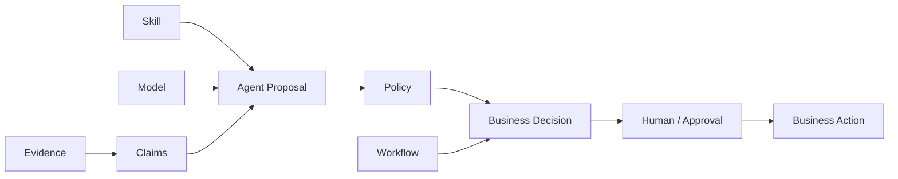
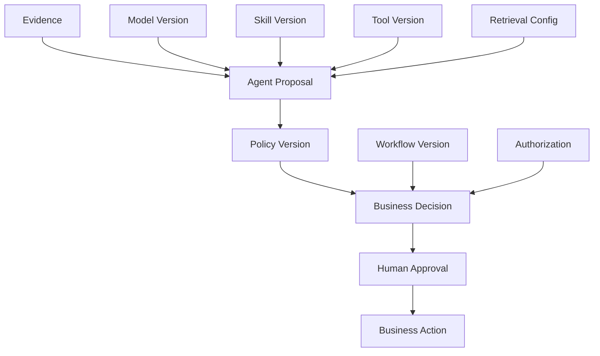

# Model Version、Skill Version 与 Business Decision 的关联

## 一、真正需要审计的不是 Model，而是 Business Decision

在传统软件里，一个业务决定通常可以追溯到：

```text
Input
  ↓
Business Logic
  ↓
Rule
  ↓
Decision
```

因此很多系统的审计思路是：

```text
谁
什么时候
调用了什么系统
产生了什么结果
```

Agent 系统则把这条链拉长了：

```text
Business Request
       ↓
Workflow
       ↓
Agent
   ├── Model
   ├── Skill
   ├── Retrieval
   ├── Tools
   └── Policy
       ↓
Claims / Proposal
       ↓
Human / Policy Decision
       ↓
Business Decision
       ↓
Business Action
```

于是一个新的问题出现：

> **当 Business Decision 发生时，究竟应该把它关联到哪个 Model Version、哪个 Skill Version？**

更重要的是：

> **Model Version 和 Skill Version 到底是 Decision 的“原因”、Decision 的“输入”，还是只是审计上的上下文？**

这是金融 Agent 架构中非常值得单独讨论的问题。

一个比较稳妥的答案是：

> **Model Version 和 Skill Version 不是 Business Decision 本身，也不能单独证明 Decision 为什么成立；它们是 Decision Provenance 中的重要执行上下文。**

真正完整的关系应该更接近：

```text
Evidence
   ↓
Claims
   ↓
Agent Proposal
   ↓
Policy / Authorization
   ↓
Business Decision
   ↓
Business Action
```

而：

```text
Model Version
Skill Version
Workflow Version
Tool Version
Runtime Configuration
```

描述的是：

> **这次 Proposal / Decision 是在什么具体的 Agent Execution Context 中产生的。**

这一区别非常重要。

如果把 Model Version 直接等价成 Business Decision Version，最终会把：

```text
模型输出
```

与：

```text
企业正式业务决定
```

混为一谈。

---

# 二、为什么金融 Agent 特别需要建立这种关联

金融机构长期已经有 Model Risk Management、Change Management、Access Control、Audit Trail 等体系。

问题是 Agent 把多个以前相对独立的变化源组合到了一起：

```text
Model
Prompt
Skill
Retrieval
Data
Policy
Workflow
Tool
Human Review
```

任何一个发生变化，都可能影响最终行为。

例如：

```text
Model M7
Skill S4
Policy P9
```

今天：

```text
M7 + S4 + P9
→ Proposal A
→ Approved
```

明天 Model 不变，只把：

```text
S4 → S5
```

也可能得到：

```text
M7 + S5 + P9
→ Proposal B
→ Escalate
```

同样，Skill 不变：

```text
S4
```

只改变：

```text
M7 → M8
```

也可能得到不同 Proposal。

但即使：

```text
M7 + S4
```

完全不变，只改变：

```text
P9 → P10
```

也可以产生完全不同的 Business Decision。

所以：

```text
Model Version
Skill Version
Policy Version
```

实际上分别处于不同的控制层。

PRA 的 SS1/23 要求模型风险管理考虑模型更新、validation、monitoring 和 model change approval，并要求银行维护模型 inventory；对重大模型变化，需要有明确的审批、验证、独立审查和监控机制。([bankofengland.co.uk](https://www.bankofengland.co.uk/-/media/boe/files/prudential-regulation/supervisory-statement/2026/liaf0126app5.pdf?utm_source=chatgpt.com))

FINRA 2026 年监管报告则更直接地建议金融机构在 GenAI 使用中跟踪：

* 使用了哪个 model version
* 什么时间使用
* prompt / output
* 持续 testing 与 monitoring
* human-in-the-loop review

并要求建立完整的 GenAI governance / model risk framework。([finra.org](https://www.finra.org/sites/default/files/2025-12/2026-annual-regulatory-oversight-report.pdf?utm_source=chatgpt.com))

DORA 也要求金融机构对 ICT 变化进行记录、测试、评估、批准、实施和验证。([eur-lex.europa.eu](https://eur-lex.europa.eu/legal-content/EN/TXT/?qid=1689500446201&uri=CELEX%3A32022R2554&utm_source=chatgpt.com))

这些要求并没有规定一种具体的 Agent Version Schema，但共同说明了一件事：

> **当一个系统的行为受到可变软件、模型和配置影响时，历史 Decision 必须能够回到当时实际运行的版本与控制环境。**

---

# 三、Model Version 到底是什么

最简单的写法可能是：

```json
{
  "model": "xxx"
}
```

对于生产 Agent 来说通常不够。

至少应该区分：

```text
Provider
Model ID
Model Snapshot / Version
Endpoint
Serving Configuration
Model-specific Parameters
```

例如：

```json
{
  "provider": "anthropic",
  "model_id": "claude-sonnet-4-5-20250929",
  "endpoint": "enterprise-api",
  "temperature": 0.1,
  "max_tokens": 8192
}
```

为什么要这么做？

因为“模型名字”不一定等于“具体模型”。

Anthropic 当前文档明确把 model ID 设计成版本身份：旧版 Claude 使用带日期的 snapshot IDs，而新一代使用 dateless model IDs；对于 Claude 4.6 及以后，canonical model ID 仍然指向固定 model snapshot，而不是不断移动到所谓“最新模型”。Anthropic 同时特别指出，即使 model weights 不变，serving infrastructure，包括 router、safety classifiers 和 sampling logic，也可能发生变化并导致行为差异。([platform.claude.com](https://platform.claude.com/docs/en/about-claude/models/model-ids-and-versions?utm_source=chatgpt.com))

这说明：

> **Model ID 是重要的 version identity，但不能简单把 Model ID 等价成整个运行环境。**

对于金融 Agent，更完整的记录应该类似：

```text
Model Identity
    ├── Provider
    ├── Model ID
    ├── Snapshot / Version
    └── Endpoint

Runtime Context
    ├── System Prompt
    ├── Sampling Configuration
    ├── Tool Configuration
    ├── Safety Configuration
    └── Routing / Serving Metadata
```

---

# 四、Model Version 不等于“模型能力版本”

这是另一个非常容易混淆的问题。

假设：

```text
Model A
```

经过一次升级：

```text
Model A → Model B
```

我们可以说：

> Model Version 发生变化。

但不能直接说：

> Business Decision 一定发生变化。

可能：

```text
Input X
A → Approve
B → Approve
```

也可能：

```text
Input Y
A → Approve
B → Escalate
```

因此：

```text
Model Version Change
```

是：

> **潜在行为变化的控制事件**

而不是：

> **每一个 Business Decision 都已经发生变化的事实。**

这点在模型治理里非常重要。

SR 11-7 要求银行维护模型 inventory，把需要独立 validation 的模型 variation 单独记录，同时维护模型的 purpose、inputs、outputs、更新情况、validation 状态以及使用限制。([federalreserve.gov](https://www.federalreserve.gov/supervisionreg/srletters/sr1107a1.pdf?utm_source=chatgpt.com))

换句话说：

```text
Model Version
   ↓
Potentially different behavior
```

但只有结合：

```text
Input
Evidence
Prompt
Skill
Policy
```

才能知道某一次 Decision 实际发生了什么。

---

# 五、Skill Version 是另一种完全不同的变化

Model 是模型。

Skill 则是：

> **Agent 应该如何完成任务的行为包。**

当前 Agent Skills 开放规范把 Skill 定义成一个目录，至少包含：

```text
SKILL.md
```

还可以包含：

```text
scripts/
references/
assets/
```

并且 Skill 中的 instructions 在激活后被加载，scripts 甚至可以由 Agent 执行。([github.com](https://github.com/agentskills/agentskills/blob/main/docs/specification.mdx))

因此 Skill 并不是简单的 prompt：

```text
Skill
=
Instructions
+
Executable Scripts
+
References
+
Assets
```

这意味着：

```text
Skill Version Change
```

完全可能改变：

```text
Tool Selection
Reasoning Procedure
Evidence Selection
Data Transformation
Output Format
Escalation Behavior
```

即使：

```text
Model
```

完全没有变化。

---

# 六、一个值得特别注意的现实：Agent Skills 标准本身目前并没有强制 Version 字段

这是讨论 Skill Version 时必须避免说过头的地方。

当前 Agent Skills 官方 specification 的 frontmatter 允许：

```yaml
metadata:
  version: "1.0"
```

但 `version` 并不是标准 frontmatter 的必填字段；`metadata` 本身也是可选扩展。([github.com](https://github.com/agentskills/agentskills/blob/main/docs/specification.mdx))

所以不能说：

> “Agent Skills 标准已经正式规定每个 Skill 必须有 version。”

当前更准确的说法是：

> **企业 Agent 平台应该自行建立 Skill Version / Artifact Identity，而目前开放 Skill 生态本身仍在形成更成熟的 packaging、versioning 和 provenance 规范。**

这一生态正在快速发展。例如当前 Agent Skills 社区已经出现专门的 packaging/versioning proposal，讨论 SemVer、source、content hash 和 dependency reference；GitHub 的 Copilot `gh skill` 工具也已经把 source repository、ref 和 tree SHA 写入 Skill provenance metadata，并支持 `--pin` 固定一个具体版本。([github.com](https://github.com/agentskills/agentskills/discussions/302?utm_source=chatgpt.com) ([docs.github.com](https://docs.github.com/en/copilot/how-tos/copilot-on-github/customize-copilot/customize-cloud-agent/add-skills?utm_source=chatgpt.com))

这其实比单纯的：

```text
skill_version = 1.2
```

更重要。

---

# 七、Skill Version 最好理解成“Behavior Artifact Version”

一个推荐的 Skill identity：

```text
Skill
 ├── logical_id
 ├── version
 ├── source
 ├── commit / tree SHA
 ├── artifact digest
 └── dependencies
```

例如：

```json
{
  "skill_id": "compliance-review",
  "version": "2026.09.3",
  "source": "github.com/company/agent-skills",
  "commit": "8e71...",
  "artifact_sha256": "sha256:...",
  "dependencies": [
    "policy-checker@3.4"
  ]
}
```

这里：

```text
version
```

方便业务和治理人员理解：

> “这是 compliance-review 的 2026.09.3 版本。”

而：

```text
commit / digest
```

回答：

> “具体执行的内容到底是什么？”

这对于 Skill 特别重要，因为 Skill 不是只有一段文本。

如果：

```text
SKILL.md
```

没变，但：

```text
scripts/check_policy.py
```

发生变化，

行为也可能已经改变。

因此：

> **Skill Version 应该绑定整个 Skill Artifact，而不是只绑定 SKILL.md 的版本号。**

---

# 八、Model Version 与 Skill Version 是两个正交维度

这是整个架构中最重要的概念之一。

不要建立：

```text
Agent Version = 2026.09
```

然后认为问题解决了。

因为：

```text
Model
×
Skill
×
Policy
×
Workflow
×
Tool
```

实际上形成了一个组合空间。

例如：

| Execution | Model | Skill | Policy | 结果       |
| --------- | ----- | ----- | ------ | -------- |
| E1        | M7    | S4    | P9     | Approve  |
| E2        | M7    | S5    | P9     | Escalate |
| E3        | M8    | S4    | P9     | Approve  |
| E4        | M7    | S4    | P10    | Reject   |

这里：

```text
E1 → E2
```

主要是 Skill change。

```text
E1 → E3
```

主要是 Model change。

```text
E1 → E4
```

主要是 Policy change。

但最终：

```text
Business Decision
```

不能只依赖其中一个 version。

因此真正应该记录的是：

> **Decision Context / Execution Manifest**

而不是单独的 Model Version。

---

# 九、Business Decision 本身也必须成为独立的业务对象

这一步是很多 Agent 平台容易遗漏的。

如果系统只有：

```text
Agent Run
```

那么最后会出现：

```text
Agent Run
→ output
```

但金融业务真正关心的可能是：

```text
Trade Approval
Credit Decision
Client Eligibility
Proxy Vote
Investment Recommendation
Compliance Escalation
```

这些都应该是独立的 Business Decision / Business Case。

例如：

```text
Decision
{
  id: DEC-2026-8821,
  case_id: CASE-1042,
  type: trade_approval,
  outcome: approved,
  decided_at: ...
}
```

然后：

```text
Decision
   │
   ├── workflow_version
   ├── model_version
   ├── skill_version
   ├── policy_version
   ├── evidence_set
   ├── authorization_context
   └── human_approval
```

这样：

> **Agent Execution 是技术对象；Business Decision 是业务对象。**

两者不能混成一个。

---

# 十、Agent Proposal 与 Business Decision 必须分开

这是金融 Agent 架构里尤其值得强调的一条。

Agent 可能输出：

```text
Proposal
──────────────
Recommended Action:
Approve

Confidence:
0.87

Reasons:
...
```

但这不等于：

```text
Business Decision
──────────────
Approved
```

正确的关系应该是：

```text
Agent
  ↓
Proposal
  ↓
Policy
  ↓
Human / Workflow
  ↓
Business Decision
```

这一区分意味着：

```text
Model Version
```

最直接影响的是：

> **Proposal 的生成。**

而：

```text
Policy Version
Workflow Version
Human Approval
Authorization
```

共同影响：

> **Business Decision 是否正式成立。**

所以如果有人问：

> “这个 Business Decision 是 GPT-4 还是 GPT-5 做出的？”

严格来说，这个问题本身就需要进一步拆分。

更准确的问题应该是：

> “产生该 Decision 所采用的 Agent Proposal，是由哪个 Model Version、哪个 Skill Version、在什么 Evidence / Policy / Workflow Context 下生成的？”

---

# 十一、推荐采用“双层 Decision Model”

可以把它设计成：

```text
Layer 1
Agent Proposal

Layer 2
Business Decision
```

例如：

```json
{
  "proposal": {
    "proposal_id": "PROP-8291",
    "model": "model-x",
    "skill": "risk-review@7.2.1",
    "claims": [
      "risk_score=72",
      "amount=8m"
    ],
    "recommendation": "approve"
  },

  "decision": {
    "decision_id": "DEC-8291",
    "outcome": "approved",
    "policy": "trade-policy@23",
    "workflow": "trade-approval@18",
    "approved_by": "user-123"
  }
}
```

这样审计人员可以明确看到：

```text
Model
   ↓
Proposal

Policy / Workflow / Human
   ↓
Decision
```

这比：

```text
Agent
→ Approved
```

的语义清晰很多。

---

# 十二、Model Version 不是 Business Decision 的“Owner”

这点需要特别强调。

金融机构不应该因为：

```text
Decision generated with Model M8
```

就把责任归因给：

```text
M8
```

监管和企业治理真正关心的是：

```text
Who owns the process?
Who approved the use?
Who controls the system?
Who owns the business decision?
```

FCA 一再强调 AI 使用中的 accountability 仍然属于金融机构和负责的人员，而不是把责任转移给 AI。FCA 明确指出，AI 应放在现有 accountability framework 内，责任仍然需要落到 firm 和其管理责任链上。([fca.org.uk](https://www.fca.org.uk/firms/innovation/ai-approach?utm_source=chatgpt.com))

FCA 也曾明确提出：

> “Machines don’t have agency, humans do.”

其治理观点是，不应该把 AI 系统赋予所谓的“agency”，从而把金融机构对决策的责任转嫁给机器。([fca.org.uk](https://www.fca.org.uk/news/speeches/ai-moving-fear-trust?utm_source=chatgpt.com))

因此：

```text
Model Version
```

是 provenance。

不是：

```text
Accountability Owner
```

---

# 十三、一个 Business Decision 应该如何关联 Model Version

推荐不是简单：

```text
decision.model = "gpt-x"
```

而是：

```text
Decision
   ↓
Proposal
   ↓
Execution
   ↓
Model Identity
```

形成：

```text
DEC-8821
  │
  └── Proposal PROP-8821
          │
          └── Execution EX-8821
                  │
                  ├── Model M8
                  ├── Skill S7
                  ├── Workflow W18
                  ├── Policy P23
                  └── Evidence Set E91
```

这样可以回答：

> “哪个 Model 被这个 Decision 间接使用？”

而不会误导成：

> “Model 决定了 Business Decision。”

这两个表述在治理意义上差别非常大。

---

# 十四、Model Version 的变化需要重新回答三个问题

当 Model 从：

```text
M7 → M8
```

不能只是改配置。

至少要回答：

### 1. Capability Change

M8 相比 M7 改变了什么？

```text
Reasoning
Tool use
Context handling
Safety behavior
Structured output
Latency
```

### 2. Decision Impact

哪些 Business Decision 可能受到影响？

```text
Research
Recommendation
Credit
Compliance
Trading
```

### 3. Validation

哪些已有 evaluation 需要重新运行？

```text
Accuracy
Groundedness
Policy adherence
Tool calling
Abstention
Safety
```

PRA SS1/23 的 model change governance 正是这样的基本思路：重大模型变化应有 materiality criteria，并触发相应 validation、independent review、approval 和 monitoring。([bankofengland.co.uk](https://www.bankofengland.co.uk/-/media/boe/files/prudential-regulation/supervisory-statement/2026/liaf0126app5.pdf?utm_source=chatgpt.com))

---

# 十五、Skill Version 的变化也必须回答同样的问题

例如：

```text
S7 → S8
```

Skill 修改：

```text
"如果客户风险等级为 High，需要人工审核"
```

变成：

```text
"如果客户风险等级为 High，先执行第二次数据核查，再决定是否需要人工审核"
```

Model 没变。

Policy 也没变。

Workflow 也可能没变。

但是 Agent 的行为发生了变化。

因此 Skill Version 应触发：

```text
Behavioral Evaluation
   ↓
Tool Selection Tests
   ↓
Evidence Retrieval Tests
   ↓
Regression Tests
   ↓
Approval
```

这也是为什么 Agent Skills 不能被当作普通 Markdown。

官方规范明确允许 Skill 携带 executable scripts、reference documents 和 assets。([github.com](https://github.com/agentskills/agentskills/blob/main/docs/specification.mdx))

---

# 十六、Model + Skill 的组合才更接近 Agent Behavior

如果：

```text
Model M8
```

单独测试结果非常好。

并不代表：

```text
M8 + Skill S7
```

就一定表现良好。

原因是 Skill 可能改变：

```text
Prompt
Tool selection
Context structure
Output schema
Instruction priority
Reference usage
```

因此真正需要测试的对象通常是：

```text
Agent Configuration
=
Model
+
Skill
+
System Prompt
+
Tools
+
Retrieval
+
Policy Context
```

这比单独 benchmark 一个模型更接近真实生产行为。

Morgan Stanley 的公开实践就是一个很好的例子。Morgan Stanley 对每个 AI use case 都建立 evaluation framework，使用真实业务场景和专家反馈测试模型行为，并持续运行 regression suite；其 AI @ Morgan Stanley Assistant 和 Debrief 还分别采用不同的 evaluation datasets。([openai.com](https://openai.com/index/morgan-stanley/?utm_source=chatgpt.com))

这个案例不能证明 Morgan Stanley 采用了本文所定义的完整 Version Manifest，但它能够证明：

> **金融机构实际生产 AI 的质量控制单位已经不是“裸模型 benchmark”，而是具体 use case 下的完整 AI workflow。**

---

# 十七、真正应该版本化的是“Agent Behavior Contract”

因此可以定义：

```text
Agent Behavior Contract
```

包含：

```text
Model
Skill
Prompt
Tools
Retrieval
Output Schema
Policy Context
Evaluation Suite
```

例如：

```yaml
agent_behavior:
  id: compliance-review

  model:
    provider: anthropic
    id: claude-sonnet-4-5-20250929

  skill:
    id: compliance-review
    version: 7.2.1
    digest: sha256:...

  tools:
    - sanctions-search@4
    - client-profile@7

  prompt:
    system_prompt_hash: sha256:...

  retrieval:
    config_version: 12

  evaluation:
    suite: compliance-review-prod
    release: 2026.09.4
```

这比：

```text
agent_version = 4
```

更有实际意义。

---

# 十八、Business Decision 应该记录“Resolved Context”，而不是“Current Configuration”

这是版本关联中最重要的审计原则之一。

错误：

```json
{
  "agent": "compliance-agent"
}
```

或者：

```json
{
  "model": "latest",
  "skill": "latest",
  "policy": "current"
}
```

六个月以后这些名字仍然存在，但是它们可能已经指向完全不同的内容。

AWS Step Functions 已经对 Workflow 做出了非常明确的区分：Version 是 immutable snapshot，Alias 是可移动指针；execution 可以关联具体 version 或 alias，而使用 unqualified ARN 的 execution 并不会自动关联某个 version。([docs.aws.amazon.com](https://docs.aws.amazon.com/step-functions/latest/dg/concepts-cd-aliasing-versioning.html?utm_source=chatgpt.com) ([docs.aws.amazon.com](https://docs.aws.amazon.com/step-functions/latest/dg/execution-alias-version-associate.html?utm_source=chatgpt.com))

同样的原则应该应用到 Agent：

```text
Business Decision
        ↓
Resolved Execution Manifest
        ├── Model M8
        ├── Skill S7
        ├── Policy P23
        ├── Workflow W18
        └── Tool T4
```

而不是：

```text
Business Decision
        ↓
Current Agent Configuration
```

---

# 十九、建议建立 Decision Context Manifest

一个比较完整的结构可以是：

```json
{
  "decision_id": "DEC-2026-8821",
  "case_id": "CASE-1042",

  "execution": {
    "execution_id": "EX-8291",
    "started_at": "2026-09-20T10:31:00Z"
  },

  "workflow": {
    "id": "trade-approval",
    "version": "18",
    "digest": "sha256:..."
  },

  "agent": {
    "skill": {
      "id": "compliance-review",
      "version": "7.2.1",
      "digest": "sha256:..."
    },

    "model": {
      "provider": "anthropic",
      "id": "claude-sonnet-4-5-20250929"
    }
  },

  "policy": {
    "id": "trade-policy",
    "version": "23",
    "revision": "..."
  },

  "tools": [
    {
      "id": "client-risk",
      "version": "7"
    }
  ],

  "evidence_set": {
    "id": "EVID-8821",
    "snapshot": "..."
  },

  "decision": {
    "proposal": "approve",
    "outcome": "approved"
  },

  "human_approval": {
    "required": true,
    "approved_by": "..."
  }
}
```

这就是：

> **Decision Context Manifest**

它不是一个单纯的日志。

它代表：

> **为了理解这个 Business Decision，必须恢复的技术和控制上下文。**

---

# 二十、Model Version 与 Skill Version 最终应该关联到 Evaluation，而不只是 Decision

版本关联的另一层重要意义是：

```text
Production Decision
```

可以回到：

```text
Evaluation Evidence
```

例如：

```text
Model M8
+
Skill S7
↓
Evaluation Suite EVAL-2026-09
↓
Approved for Production
```

因此 production execution 可以反向找到：

```text
Decision
 → Agent Configuration
 → Evaluation Release
 → Approval
```

这样当 Model M8 被发现有问题时，不只是知道：

```text
“哪些 Decision 用了 M8”
```

还可以知道：

```text
“这些 Decision 所使用的 Agent Behavior Contract，
当时经过哪些 evaluation？”
```

这与金融 Model Risk Management 强调 validation evidence、model approval、monitoring 和 change governance 的理念一致。([bankofengland.co.uk](https://www.bankofengland.co.uk/-/media/boe/files/prudential-regulation/supervisory-statement/2026/liaf0126app5.pdf?utm_source=chatgpt.com))

---

# 二十一、因此应该区分三个时间

一次 Business Decision 至少存在三个不同的时间：

```text
Model Release Time
Skill Release Time
Decision Execution Time
```

例如：

```text
Model M8 released
09:00

Skill S7 released
09:30

Decision executed
14:00
```

这和：

```text
Decision
```

本身不是同一个时间。

还需要：

```text
Evidence Effective Time
Policy Effective Time
Deployment Time
Approval Time
```

于是：

```text
Model Version
     │ release time
     ↓
Skill Version
     │ release time
     ↓
Deployment
     │
     ↓
Decision
     │
     ├── Evidence as-of
     ├── Policy effective-at
     └── Human approval
```

金融系统尤其依赖这种时间语义，因为“当时适用什么规则”与“现在有什么规则”可能完全不同。

---

# 二十二、Model Version 不能孤立审计

假设：

```text
Decision D1
Model M8
```

审计人员可能进一步问：

> 当时的 Skill 是什么？

如果没有：

```text
Skill S7
```

无法完整重建。

然后：

> 当时 Policy 是什么？

没有：

```text
Policy P23
```

同样不能重建。

然后：

> 当时 Evidence 是什么？

仍然无法重建。

所以：

```text
Model Version
```

真正有意义的前提是：

```text
Model
+
Skill
+
Policy
+
Workflow
+
Evidence
+
Authorization
```

共同形成：

> **Execution Provenance**

这与此前“Workflow Version / Skill Version / Policy Version 的审计意义”是同一个架构逻辑的延伸。

---

# 二十三、Agent Decision 的完整因果链

可以把它表示成：



这里有一个关键细节：

```text
Model + Skill
        ↓
Agent Proposal
```

而：

```text
Policy + Workflow + Approval
        ↓
Business Decision
```

因此：

> **Model Version 和 Skill Version 最直接关联的是 Proposal provenance，而不是单独决定 Business Decision。**

这一架构可以有效避免一个非常危险的概念：

```text
“AI model made the business decision.”
```

在金融治理上，更准确的表达是：

```text
AI generated a proposal
under a specified execution context,
and the business decision was made
through the controlled decision process.
```

---

# 二十四、为什么不能只保存“最终 Model Output”

例如：

```json
{
  "output": "Approve trade",
  "model": "M8"
}
```

以后只能知道：

```text
M8 输出了什么。
```

却不知道：

```text
用了哪个 Skill？
看到了哪些 Evidence？
用了什么 Policy？
Tool 返回了什么？
用户当时有什么权限？
Workflow 到哪一步？
是否经过人工审核？
```

所以 Model Version 记录应该只是一张更大图中的一条边。

完整结构：

```text
Decision
│
├── Proposal
│   ├── Model
│   └── Skill
│
├── Evidence
│
├── Policy
│
├── Workflow
│
├── Authorization
│
└── Approval
```

---

# 二十五、金融场景中的 Model Version Change 应当是一个“业务影响分析”事件

例如：

```text
M7 → M8
```

不应该直接：

```text
deploy
```

而应该产生一个：

```text
Model Change Record
```

包括：

```text
Model Change
├── What changed?
├── Why?
├── Affected Agent
├── Affected Skills
├── Affected Decision Types
├── Risk Assessment
├── Evaluation Results
├── Approval
├── Deployment
└── Rollback
```

然后才能回答：

```text
M8
↓
Approved for
├── Research Summary
├── Compliance Review
└── Advisor Assistant

Not approved for
└── Trade Execution
```

这比：

```text
M8 = latest
```

的治理能力高很多。

---

# 二十六、Skill Change 也应该有自己的 Change Record

类似地：

```text
Skill S7 → S8
```

应该记录：

```text
Skill Change
├── Instructions changed?
├── Script changed?
├── Reference changed?
├── Tool behavior changed?
├── Evaluation changed?
├── Risk classification
├── Approval
└── Deployment
```

尤其要注意：

> **Skill 中的 reference material 变化，也可能构成 behavior change。**

例如：

```text
S7
references/policy.md
```

换成更新后的：

```text
references/policy.md
```

即使：

```text
SKILL.md
```

完全没有变化，Agent 行为也可能改变。

所以真正的 Skill Version 必须覆盖 artifact，而不是文件名。

---

# 二十七、Skill Version 的一个特殊问题：它可能隐式改变 Evidence Selection

这在金融 Agent 中尤其重要。

假设：

```text
Skill S4
```

指导 Agent：

> 优先使用内部正式 Policy。

而：

```text
Skill S5
```

改成：

> 如果内部 Policy 找不到，允许使用外部 regulator website。

这看起来只是 retrieval behavior。

实际上它改变了：

```text
Evidence Authority
```

因此间接改变：

```text
Decision
```

形成：

```text
Skill Version
    ↓
Evidence Selection
    ↓
Claims
    ↓
Decision
```

这就是为什么：

> **Skill Version 不能被当成“只是 prompt 版本”。**

在某些金融 Agent 中，它实际上可能是：

> **Evidence Selection Policy 的执行载体。**

---

# 二十八、这也是为什么 Skill、Policy 需要明确分工

如果把：

```text
Skill
```

设计得太强：

```text
Skill:
“认为某类客户可以直接批准”
```

Skill 就开始承担：

```text
Business Policy
```

这是危险的。

更合理的是：

```text
Skill:
“检查客户是否满足适用 Policy 所需条件”
```

而：

```text
Policy:
“哪些条件满足时允许批准”
```

于是：

```text
Skill
=
How to reason / operate

Policy
=
What is allowed
```

这个边界非常重要。

它也解释了为什么 Business Decision 的 Provenance 中：

```text
Skill Version
```

和：

```text
Policy Version
```

必须同时存在。

二者无法互相替代。

---

# 二十九、一个非常实用的 Decision Dependency Matrix

| Decision 内容             | Model | Skill | Evidence | Policy | Workflow | Human |
| ----------------------- | ----: | ----: | -------: | -----: | -------: | ----: |
| 信息摘要                    |     高 |     中 |        高 |      低 |        低 |     低 |
| Research Recommendation |     高 |     高 |        高 |      中 |        中 |     高 |
| Client Eligibility      |     中 |     高 |        高 |      高 |        高 |     高 |
| Compliance Escalation   |     中 |     高 |        高 |     很高 |        高 |     高 |
| Trade Approval          |     中 |     中 |       很高 |     很高 |       很高 |     高 |
| 自动执行交易                  |     中 |     中 |       很高 |     很高 |       很高 | 视控制设计 |

这里的“高/中/低”不是监管评级，而是架构中的**依赖强度**。

例如：

```text
Trade Approval
```

不能因为：

```text
Model influence = medium
```

就认为 Model Version 不重要。

相反：

> **模型即使不是最终 Decision Owner，也仍然必须进入 provenance，因为 Proposal 是 Decision chain 的一部分。**

---

# 三十、真实案例：Morgan Stanley 更适合说明“版本关联必须进入 Use Case Evaluation”

Morgan Stanley 的公开 AI 实践提供了一个很好的现实参照。

其 AI @ Morgan Stanley Assistant 基于 GPT-4 帮助金融顾问访问企业知识；Morgan Stanley 对 AI use case 建立专门 evaluation framework，并持续使用真实问题、专家反馈和 regression tests 检查系统行为。Debrief 则使用不同的 evaluation datasets，并要求 advisors 在最终发送之前审阅和修改 AI 输出。([openai.com](https://openai.com/index/morgan-stanley/?utm_source=chatgpt.com))

这说明在生产金融场景中：

```text
Model
+
Use Case
+
Retrieval
+
Evaluation
+
Human Review
```

是一个整体。

因此真正合理的 release unit 不是单独：

```text
GPT-4
```

而是：

```text
AI Use Case Release
=
Model
+
Prompt / Skill
+
Retrieval
+
Evaluation
+
Controls
```

需要注意，公开资料并没有披露 Morgan Stanley 内部完整的 Model Version / Skill Version / Decision Manifest 数据模型。因此这个案例可以证明生产级 eval-driven governance 的实践，但不能据此断言其内部已经采用本文的具体 Version Lineage 架构。

---

# 三十一、真实案例：SEC 的 AI misrepresentation enforcement 说明“AI 到底是什么”本身也必须可证明

2024 年，SEC 对 Delphia 和 Global Predictions 提起执法行动，原因之一是其对自身 AI 能力的公开描述存在虚假或误导性陈述，两家公司共支付 40 万美元民事罚款。SEC 的结论直接涉及企业声称自己使用了哪些 AI 能力，以及这些能力事实上是否存在。([sec.gov](https://www.sec.gov/newsroom/press-releases/2024-36?utm_source=chatgpt.com))

这个案例不是 Model Version / Skill Version 的直接案例。

但它说明一个重要治理问题：

```text
What the firm says its AI does
          ↓
must correspond to
          ↓
What the system actually does
```

如果一个企业无法准确回答：

```text
Which model?
Which behavior layer?
Which workflow?
Which version?
```

那么随着 AI 系统复杂化，解释自己的产品和控制边界也会越来越困难。

---

# 三十二、当前行业已经开始把“Model Version Tracking”本身作为金融 AI 控制要求

FINRA 2026 年监管报告的措辞非常值得注意：它不仅要求企业做 testing / monitoring，还把：

```text
tracking which model version was used and when
```

直接列入 monitoring 可以考虑的控制措施，同时提到保存 prompt/output logs 和 human-in-the-loop review。([finra.org](https://www.finra.org/sites/default/files/2025-12/2026-annual-regulatory-oversight-report.pdf?utm_source=chatgpt.com))

这意味着 Model Version 不再只是：

```text
MLOps convenience
```

而逐渐成为：

```text
Audit / Accountability Metadata
```

但仍然不能因此把：

```text
Model Version
```

理解成：

```text
Decision Evidence
```

它只是：

> **Decision Execution Context 的一部分。**

---

# 三十三、FCA 对金融 AI 的方向同样强调“系统行为”和“责任”

FCA 当前对金融 AI 的整体框架强调 accountability、governance 和 evidence-based approach，并且明确指出金融企业需要对 AI 的使用承担责任。([fca.org.uk](https://www.fca.org.uk/firms/innovation/ai-approach?utm_source=chatgpt.com))

FCA 2026 年关于 AI 长期影响的研究又进一步指出：

> 过去的系统更新较少、模型行为更可预测、责任更容易定位；AI 系统则可能快速更新，而且责任可能分布在 model developers、data providers、model hosts 和 regulated firms 之间。([fca.org.uk](https://www.fca.org.uk/news/speeches/fca-long-term-review-ai-retail-financial-services-designing-unknown?utm_source=chatgpt.com))

这正是 Version Lineage 在 Agent 系统中的价值：

```text
Provider
   ↓
Model Version
   ↓
Agent Skill
   ↓
Financial Firm
   ↓
Business Process
   ↓
Decision
```

责任可能跨越多个供应链环节。

因此企业不能只说：

> “这是供应商的模型。”

仍然需要知道：

> **本企业在某个 Business Decision 中到底使用了什么。**

---

# 三十四、为什么“Model Version + Skill Version”还不够

如果只保存：

```json
{
  "model": "M8",
  "skill": "S7"
}
```

仍然不足。

至少还需要：

```text
Policy
Workflow
Evidence
Tool
Authorization
Prompt / Configuration
```

因为：

```text
M8 + S7
```

不是一个完整的 Agent behavior。

更完整的是：

```text
Execution Context
├── Model
├── Skill
├── System Prompt
├── Tools
├── Retrieval Configuration
├── Evidence Set
├── Policy
├── Workflow
└── Authorization
```

最终：

```text
Business Decision
        ↓
Execution Context Manifest
```

这才真正满足 historical reconstruction。

---

# 三十五、Model Version、Skill Version 与 Business Decision 之间不是一条线，而是一张图

最准确的抽象不是：

```text
Model → Skill → Decision
```

而是：



这个图表达出一个非常关键的事实：

> **Model Version 和 Skill Version 都是 Decision 的 upstream context，但不是它唯一的决定因素。**

因此：

```text
Decision Provenance
```

应该是一个 graph，而不是三个字段。

---

# 三十六、建议建立一个“Decision Context Fingerprint”

为了让审计与 incident response 更容易，可以进一步生成：

```text
Decision Context Fingerprint
```

例如：

```text
sha256(
    workflow_artifact
    + skill_artifacts
    + model_identity
    + policy_revisions
    + tool_versions
    + retrieval_config
    + system_prompt_hash
)
```

产生：

```text
context_fingerprint = "sha256:abc..."
```

然后每次 Decision 记录：

```json
{
  "decision_id": "DEC-8821",
  "context_fingerprint": "sha256:abc..."
}
```

这样可以快速判断：

```text
Decision A
Decision B
```

是否在完全相同的 Agent Execution Context 中产生。

注意：

> **Fingerprint 是完整上下文的便捷标识，不应替代各个版本字段。**

否则发生差异时仍然不知道究竟是：

```text
Model
Skill
Policy
```

还是其他 component 发生变化。

---

# 三十七、Incident Response 中，这种关联尤其有价值

假设发现：

```text
Skill S7
```

存在错误。

第一步就可以查询：

```text
Which executions used S7?
```

然后：

```text
Which proposals?
```

然后：

```text
Which business decisions?
```

最后：

```text
Which business actions?
```

形成：

```text
Skill S7
   ↓
Executions
   ↓
Proposals
   ↓
Business Decisions
   ↓
Actions
```

同样，如果 Model M8 被发现有问题：

```text
Model M8
   ↓
Agent executions
   ↓
Affected decisions
   ↓
Affected clients / trades
```

这实际上把 Version Lineage 直接变成：

> **Incident Blast-Radius Analysis**

---

# 三十八、因此 Release Governance 也应该从“Model Deployment”变成“Decision Capability Deployment”

一个成熟金融 Agent 平台不应该只有：

```text
Model Registry
```

还需要：

```text
Skill Registry
Policy Registry
Workflow Registry
Agent Capability Registry
```

最终发布：

```text
Agent Capability Release
```

例如：

```yaml
capability:
  id: trade-review

  workflow:
    version: 18

  skill:
    version: 7.2.1

  model:
    id: claude-sonnet-4-5-20250929

  policy:
    version: 23

  evidence_requirements:
    version: 4

  evaluations:
    suite: trade-review
    release: 2026.09.7

  approved_for:
    - recommendation
    - human_review

  prohibited_for:
    - autonomous_execution
```

这样，真正进入生产的是：

> **一种经过批准的 Business Capability**

而不只是：

> “一个新模型”。

---

# 三十九、不同 Version 应该有不同的 Change Governance

这也是实际落地时非常重要的地方。

| Version                      | 代表什么       | 典型风险                              | Governance                    |
| ---------------------------- | ---------- | --------------------------------- | ----------------------------- |
| Model Version                | 模型能力变化     | 输出行为变化                            | Model validation              |
| Skill Version                | Agent 行为变化 | instructions / tools / scripts 改变 | Behavior review               |
| Policy Version               | 控制边界变化     | allowed / denied 改变               | Risk / Compliance approval    |
| Workflow Version             | 流程变化       | 状态、审批、路径改变                        | Business change approval      |
| Tool Version                 | 执行能力变化     | 外部动作改变                            | Security / integration review |
| Evidence Requirement Version | 证据标准变化     | Decision 所需依据改变                   | Control owner approval        |

这说明：

> **“Version”不是一个统一的生命周期概念。**

不同 version 属于不同治理主体。

---

# 四十、最终推荐的最小审计对象

对于金融 Agent，可以把最小 Business Decision Evidence 设计成：

```json
{
  "decision_id": "DEC-8821",

  "business_case_id": "CASE-1042",

  "proposal": {
    "execution_id": "EX-8291",

    "model": {
      "provider": "anthropic",
      "model_id": "claude-sonnet-4-5-20250929"
    },

    "skill": {
      "id": "compliance-review",
      "version": "7.2.1",
      "artifact_digest": "sha256:..."
    }
  },

  "control_context": {
    "workflow": "trade-approval@18",
    "policy": "trade-policy@23",
    "authorization": "AUTH-9182"
  },

  "evidence": {
    "set_id": "EVID-8821",
    "snapshot_hash": "sha256:..."
  },

  "business_decision": {
    "outcome": "approved"
  },

  "approval": {
    "required": true,
    "approved_by": "..."
  }
}
```

这里有一个故意的设计：

```text
model / skill
```

位于：

```text
proposal
```

下面。

而：

```text
workflow / policy / authorization
```

位于：

```text
business decision
```

上下文。

这能非常清楚地表达它们不同的治理角色。

---

# 四十一、最终可以把整个体系理解成四层

```text
Layer 1 — Evidence
What was known?

Layer 2 — Agent Behavior
How did the Agent analyze it?

Layer 3 — Control
What was allowed?

Layer 4 — Business Decision
What did the organization decide?
```

对应版本：

```text
Evidence
  └── Evidence Snapshot / Data Version

Agent Behavior
  ├── Model Version
  └── Skill Version

Control
  ├── Policy Version
  ├── Workflow Version
  └── Authorization Context

Business Decision
  └── Decision ID / Outcome / Approval
```

这样，整个 Agent System 就不会变成：

```text
LLM
  ↓
Decision
```

而变成：

```text
Evidence
  ↓
Agent Behavior
  ↓
Control
  ↓
Business Decision
```

---

# 四十二、结论

Model Version、Skill Version 与 Business Decision 的关系，不能简单理解为：

```text
Model Version
+
Skill Version
=
Business Decision Version
```

这是一个错误的抽象。

更准确的关系是：

```text
Evidence
     ↓
   Claims
     ↓
┌───────────────┐
│ Agent Behavior│
│ Model Version │
│ Skill Version │
└───────┬───────┘
        ↓
    Proposal
        ↓
┌───────────────┐
│ Control Layer │
│ Policy        │
│ Workflow      │
│ Authorization │
└───────┬───────┘
        ↓
 Business Decision
        ↓
 Business Action
```

其中：

**Model Version** 说明：

> 当时哪个模型负责产生 Agent 的推理/输出。

**Skill Version** 说明：

> 当时 Agent 按哪个行为包、指令、脚本和参考资料执行。

**Policy Version** 说明：

> 当时什么规则决定哪些行为被允许。

**Workflow Version** 说明：

> 当时 Business Process 是怎样组织和推进的。

而：

**Business Decision** 才是企业真正需要负责和审计的业务对象。

因此，一个金融 Agent 平台真正应该保存的不是：

```text
decision.model = M8
decision.skill = S7
```

而是：

> **Decision → Proposal → Execution Context → Model / Skill / Evidence / Policy / Workflow / Authorization**

这条完整的 provenance graph。

FINRA 已经明确把“记录使用了哪个 model version 以及何时使用”列为 GenAI monitoring 可以采用的控制措施；PRA 的 Model Risk Management 要求模型变更具备相应的验证、审批和监控；DORA 要求 ICT 变化被记录、测试、评估、批准、实施和验证。([finra.org](https://www.finra.org/sites/default/files/2025-12/2026-annual-regulatory-oversight-report.pdf?utm_source=chatgpt.com) ([bankofengland.co.uk](https://www.bankofengland.co.uk/-/media/boe/files/prudential-regulation/supervisory-statement/2026/liaf0126app5.pdf?utm_source=chatgpt.com) ([eur-lex.europa.eu](https://eur-lex.europa.eu/legal-content/EN/TXT/?qid=1689500446201&uri=CELEX%3A32022R2554&utm_source=chatgpt.com))

对于 Agent，下一步自然就是把这些控制要求从传统 Model Registry 扩展到：

```text
Model Registry
+
Skill Registry
+
Policy Registry
+
Workflow Registry
+
Evidence Registry
+
Decision Registry
```

并用：

```text
Execution Manifest
```

把它们连接起来。

真正成熟的审计问题不应该是：

> “这是哪个模型做出来的？”

而应该是：

> **“这次 Business Decision 是在哪个确定的 Agent Execution Context 中形成的？当时使用了什么 Model、什么 Skill、什么 Evidence、什么 Policy、什么 Workflow，由谁批准，最后执行了什么 Action？”**

这样，Model Version 和 Skill Version 才真正从 MLOps / Agent Runtime 的 metadata，升级成 Business Decision Governance 的基础设施。

更进一步，可以把这一原则压缩成一句话：

> **Model Version 记录“谁在推理”，Skill Version 记录“按什么方法推理”，Policy / Workflow 记录“什么可以被决定”，而 Business Decision 记录“组织最终决定了什么”；四者必须通过不可变的 Execution Context 关联，而不能让模型版本号本身承担业务决策责任。**
