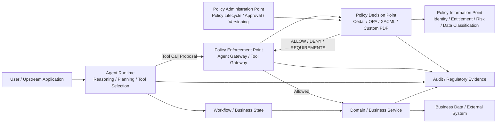

# Policy Decision Point 与 Agent Runtime 的边界

**截至 2026 年 9 月 20 日**

## 摘要

随着 Agent 从“生成答案”进入“调用工具、访问数据、执行操作”，企业架构中一个容易被忽略的问题开始变得关键：

> **Agent Runtime 到底应该拥有多大的权限决定权？**

一个 Agent 可以自主决定下一步做什么，但这并不意味着它应该自主决定“自己是否有权做这件事”。

传统授权架构早已对此给出了比较成熟的答案：**Policy Decision Point（PDP）负责根据授权策略作出授权判断，Policy Enforcement Point（PEP）负责在资源访问边界执行这个判断**。XACML 体系明确区分 PDP、PEP、PAP（Policy Administration Point）和 PIP（Policy Information Point）；PDP 评估适用策略并产生授权结果，而 PEP 负责执行授权结果。

Agent 带来的新问题不是重新发明这套模型，而是：

> **如何把 Agent 的动态推理、工具选择和自主执行能力放在授权体系之外，同时让每一次高风险动作都经过确定性的策略判断。**

这形成一个非常重要的架构边界：

> **Agent Runtime 负责“怎么做”；PDP 负责“是否允许这样做”。**

更完整地说：

* Agent Runtime 可以决定下一步调用哪个 Tool；
* Agent Runtime 可以生成参数、规划步骤、重试、调整执行策略；
* PDP 决定该 Principal 是否被允许执行该 Action；
* PEP 强制执行 PDP 的决定；
* PAP 管理和发布 Policy；
* PIP / Entitlement / Identity 系统提供 PDP 所需的可信属性；
* Business Workflow / Domain Service 负责业务状态和业务规则；
* Audit 系统记录 Agent 执行轨迹与授权决定。

这个边界并不意味着 PDP 必须是一个独立的微服务。**它首先是责任边界，其次才是部署边界。** Cedar 可以直接嵌入应用，Amazon Verified Permissions 可以作为外部授权服务，而 Amazon Bedrock AgentCore 则将 Policy Engine 放在 Gateway 后面，拦截 Agent Tool Call。

对于金融服务，这种边界尤其重要。金融机构面对的不只是“Agent 会不会犯错”，而是：

* 谁授权了 Agent；
* Agent 代表谁行动；
* 访问了哪些数据；
* 执行了什么操作；
* 当时适用什么 Policy；
* 为什么允许；
* 是否需要审批；
* 是否违反职责分离；
* 授权是否已经撤销；
* 能否重建整个决策链。

金融稳定委员会（FSB）已经将 AI 带来的网络风险、模型风险、数据与治理风险以及第三方依赖列为金融体系需要持续关注的问题；BIS 也强调，风险责任仍然属于持牌金融机构，而不是 AI 工具本身。

因此，**Agent Runtime 与 PDP 的边界，本质上不是一个代码组织问题，而是企业安全控制权到底归谁的问题。**

---

# 1. 为什么 Agent 时代这个边界变得重要

传统应用通常是这样的：

```text
User
  |
  v
Application
  |
  v
Business API
  |
  v
Database
```

程序员决定了大多数执行路径，因此可以在代码中写：

```text
if user.hasPermission("trade.submit"):
    submitTrade()
```

但是 Agent 的执行路径不是固定的。

一个 Agent 可能：

```text
User Request
   |
   v
LLM
   |
   +--> Search Portfolio
   |
   +--> Read Research
   |
   +--> Calculate Exposure
   |
   +--> Call Risk Tool
   |
   +--> Create Trade Proposal
   |
   +--> Submit Order
```

而且具体走哪条路径，是模型根据当前上下文动态决定的。

这带来一个根本变化：

> **程序不再完全决定执行路径，模型参与了执行路径选择。**

这使得“把权限判断写在 Agent Prompt 里”或者“让 Agent 自己判断自己能不能调用 Tool”变得危险。

例如：

```text
System Prompt:

You are only allowed to submit trades
under $1m.
```

这不是企业级 Authorization。

它只能影响模型行为，却没有形成真正的 Security Boundary。

模型可能：

* 忘记规则；
* 错误理解规则；
* 被 Prompt Injection 改变行为；
* 产生错误参数；
* 调用未预期 Tool；
* 在新的 Agent 版本中改变行为。

Microsoft 当前针对 Agent 身份与访问控制的官方指导也明确提出：**不要让 Agent 自己决定授权，应在应用、Identity 和 Policy 层建立确定性的授权检查。**

AWS 在 2026 年 GA 的 AgentCore Policy 中则采用了非常直接的架构：Policy 位于 Agent Code 之外，由 Gateway 拦截 Tool Call，再由 Policy Engine 判断允许或拒绝。

这实际上把 Agent 的自主性与安全边界分开了。

---

# 2. 先重新定义 PDP、PEP、Agent Runtime

## 2.1 PDP：Policy Decision Point

PDP 的核心问题是：

> **“这个主体，在当前上下文中，是否被允许对这个资源执行这个动作？”**

传统模型可以抽象成：

```text
P = Principal
A = Action
R = Resource
C = Context

Authorize(P, A, R, C)
        |
        v
     Allow / Deny
```

现代 Cedar 使用的也是类似的 PARC 模型：

* Principal
* Action
* Resource
* Context

Cedar Authorizer 根据这些输入和 Policy 返回 Allow 或 Deny，并可以提供决定该结果的 Policy 信息。

因此，一个典型 Agent Authorization Request 可以是：

```json
{
  "principal": {
    "user": "user-123",
    "agent": "research-agent",
    "delegation": "delegation-456"
  },
  "action": "trade.submit",
  "resource": "portfolio-789",
  "context": {
    "amount": 500000,
    "market": "JP",
    "riskTier": "HIGH",
    "approvalStatus": "APPROVED",
    "dataEntitlement": "LEVEL_3"
  }
}
```

PDP 不需要知道 Agent 是怎么推理出来这个动作的。

它关心的是：

> “你现在请求执行 `trade.submit`，条件是否满足？”

---

# 3. PEP：真正的安全边界

PDP 只负责做决定。

它并不能阻止一个系统忽略这个决定。

因此还需要 PEP。

XACML 明确规定：

> PDP 负责产生 authorization decision，而 PEP 负责执行 authorization decision。

这点对于 Agent 特别重要。

错误架构：

```text
Agent Runtime
   |
   +--> ask PDP
   |
   +--> "ALLOW"
   |
   +--> directly call privileged API
```

如果 Runtime 可以在任何时候绕过 PDP，那么 PDP 根本不是安全边界。

正确架构：

```text
Agent Runtime
      |
      v
   Tool Call
      |
      v
     PEP
      |
      v
     PDP
      |
   Allow / Deny
      |
      v
PEP enforces
      |
      v
Business API
```

对于 Agent，PEP 可以有很多实现形式：

* Agent Gateway；
* Tool Gateway；
* API Gateway；
* Service Middleware；
* Resource API；
* Database access layer；
* Function-call middleware。

因此：

> **PEP 是一个角色，不一定是一台服务器。**

同样地：

> **PDP 是一个职责，也不一定必须独立部署。**

---

# 4. Agent Runtime 到底负责什么

Agent Runtime 的职责与 PDP 完全不同。

Runtime 的核心问题是：

> **“为了完成当前任务，下一步应该做什么？”**

例如：

```text
User:
分析这个基金组合并给出再平衡建议
```

Runtime 可以：

```text
1. 获取 Portfolio
2. 查询市场数据
3. 查询风险暴露
4. 分析集中度
5. 发现日本股票超配
6. 生成再平衡方案
7. 请求交易预览
```

这些属于：

* Planning；
* Reasoning；
* Tool Selection；
* Memory；
* Context Management；
* Retry；
* Error Handling；
* Loop Control；
* Cost / Token / Step Limits；
* Result Aggregation。

这些属于 Runtime。

而：

```text
是否允许访问 Portfolio？
是否允许读取客户资产？
是否允许提交交易？
是否允许修改订单？
是否允许发送客户邮件？
是否允许转账？
```

属于 Authorization。

两者不能混为一谈。

---

# 5. 最容易混淆的三个 Decision

企业 Agent 架构中，最重要的区分之一是：

```text
Agent Proposal
        |
        v
Policy Decision
        |
        v
Business Decision
```

它们不是同一种 Decision。

## 5.1 Agent Proposal

Agent 可能提出：

```text
建议卖出 10% 的 Toyota 持仓
```

这是：

> Agent Proposal

它来自模型推理。

它可以是错的。

---

## 5.2 Policy Decision

Policy Engine 判断：

```text
Agent X
是否允许
execute_trade
for Portfolio Y
amount <= limit
且
user has trading permission
且
data entitlement valid
且
SoD satisfied
```

这是：

> Authorization Decision

它不是模型观点。

---

## 5.3 Business Decision

Business Domain 可能进一步判断：

```text
Portfolio is currently open
Trading window is open
Security is tradable
Compliance checks passed
Order size is within strategy limits
```

这是：

> Business Decision

它也不等于 Authorization。

---

因此，一个完整的企业 Agent 架构不应该把所有逻辑都叫做“Policy”。

更合理的分层是：

```text
Agent Reasoning
      |
      | proposes action
      v
Business Rules / Domain Decision
      |
      | business-valid?
      v
Authorization PDP
      |
      | authorized?
      v
PEP
      |
      v
Execution
```

三者解决的是不同问题：

| 问题              | 负责组件                      |
| --------------- | ------------------------- |
| “我下一步应该做什么？”    | Agent Runtime             |
| “这件业务操作是否合法？”   | Domain / Business Service |
| “这个主体有没有权限执行？”  | PDP                       |
| “允许之后真正阻止/放行吗？” | PEP                       |
| “流程已经批准到哪一步？”   | Workflow / Business State |
| “为什么这次允许？”      | Authorization Audit       |

---

# 6. PDP 不应该变成 Agent Runtime 的第二个 Workflow Engine

这是一个非常重要的边界。

例如：

```text
Policy:

如果交易金额 > $1m
    要求 Manager Approval

如果金额 > $5m
    要求 Compliance Approval

如果金额 > $10m
    要求 Risk Committee Approval
```

有些系统会继续往 PDP 里面塞：

```text
createApproval()
waitForApproval()
sendEmail()
wait()
resumeWorkflow()
callComplianceAgent()
```

这就开始错误地把 Authorization 与 Workflow 混在一起。

更合理的方式是：

```text
PDP
 |
 +--> DENY
 |
 +--> ALLOW
 |
 +--> ALLOW + requirement:
          HUMAN_APPROVAL
```

然后由 Workflow / Business Service：

```text
HUMAN_APPROVAL
      |
      v
Create Approval Case
      |
      v
Manager approves
      |
      v
Business State = APPROVED
      |
      v
Retry authorization
      |
      v
PDP = ALLOW
      |
      v
Execute
```

XACML 本身就允许 PDP 返回 **obligation**，并由 PEP 负责履行，而不是让 PDP 自己完成后续业务动作。

这给出一个非常有价值的原则：

> **Policy 可以规定“还必须满足什么条件”，但不应该自己成为那个条件所对应的业务流程执行器。**

---

# 7. “Policy 有状态”不等于“Policy 拥有业务状态”

这是 Agent 架构中另一个很容易产生误解的地方。

现代 Policy Engine 可以使用上下文。

例如 AWS AgentCore Policy 已支持基于 Session History 的 Temporal Policy，例如：

```text
同一 Session 中：

先执行 verification
之后才允许 transfer
```

AgentCore Gateway 会把 Session Context 传给 Policy Engine，由 Policy Engine 根据历史 Action 进行判断。

这意味着：

> PDP 可以读取与决策相关的历史状态。

但这并不意味着：

> PDP 应该拥有 Workflow State。

两者不同。

例如：

```text
Workflow State:

ApprovalCase = WAITING_FOR_MANAGER
```

是业务状态。

而：

```text
policy context:
previousAction = "verification.completed"
```

是授权判断所需要的上下文。

一个很好的判断标准是：

> **删除这个 Policy 后，这个状态是否仍然属于业务领域？**

如果答案是“是”，那么它通常应该属于 Domain / Workflow，而不是 PDP。

例如：

```text
OrderStatus = APPROVED
PaymentStatus = SETTLED
CaseStatus = ESCALATED
VoteStatus = SUBMITTED
```

这些都不是 Authorization State。

---

# 8. Policy Engine 不应该让 LLM 成为最终授权人

这是 Agent 架构与传统 Application Security 最大的不同之一。

错误模式：

```text
Agent
  |
  v
LLM

"Can I call this tool?"
  |
  v
LLM says:
"Yes, because user seems authorized."
```

即使把系统提示词写得很好，这仍然不是可靠的授权机制。

更合理：

```text
Agent
  |
  v
PEP
  |
  v
PDP
  |
  v
Deterministic Policy
  |
  v
ALLOW / DENY
```

Cedar 的设计尤其值得注意：它被明确设计为 Authorization Language，而不是通用程序执行环境；Cedar Policy 没有 I/O 能力，不能读取文件或访问网络，而且 Policy Evaluation 与业务应用逻辑分离。

这类设计有一个重要价值：

> **授权规则可以独立于 Agent Prompt、Model、Skill 和 Runtime 进行审计、测试和变更。**

---

# 9. 为什么 Policy 必须位于 Agent Code 之外

如果 Policy 写在：

```text
Agent Prompt
Skill.md
Tool description
Python code
TypeScript service
```

那么 Policy 的生命周期就会被 Runtime 生命周期绑架。

例如：

```text
Agent v1
  -> Policy embedded in prompt

Agent v2
  -> prompt changed

Agent v3
  -> tool renamed

Agent v4
  -> model changed
```

最终出现一个问题：

> “同一个企业 Policy 到底在哪？”

而真正的企业安全控制需要做到：

```text
Policy
   |
   +--> Agent A
   |
   +--> Agent B
   |
   +--> Agent C
   |
   +--> Human Application
   |
   +--> API
```

同一条授权规则可以被多个入口复用。

Cedar 官方文档明确把“Authorization Logic 与 Business Logic 解耦”作为设计目标；Amazon Verified Permissions 则进一步把 Policy 托管到独立 Policy Store，并让多个应用调用授权 API。

---

# 10. 推荐的企业 Agent Authorization 架构

一个成熟的企业 Agent 平台可以设计成：



这里有四条非常重要的边界。

---

# 11. 第一条边界：Agent Runtime 不等于 Authorization Boundary

Agent Runtime 可以是：

```text
LangGraph
DeepAgents
Microsoft Agent Framework
OpenAI Agents SDK
Custom Agent Runtime
AWS AgentCore Runtime
```

这些都可以负责：

```text
reasoning
planning
memory
tool selection
loop control
```

但是不能仅仅因为：

```text
Agent Runtime
```

拥有一个 IAM Role，就意味着它拥有所有业务权限。

否则就会形成典型的：

> **Confused Deputy**

例如：

```text
User A
  |
  v
Investment Agent
  |
  +--> has broad portfolio access
  |
  +--> accidentally reads Portfolio B
```

更合理的是：

```text
User A
 +
Agent Identity
 +
Delegation
 +
Action
 +
Resource
 +
Context
  |
  v
PDP
```

Microsoft 当前关于 AI Agent Identity 的架构指导也特别强调，需要区分：

* User；
* Application；
* Workload；
* Agent；
* Tool；
* Resource；

并且每一个跨越信任边界的动作都需要明确授权。

---

# 12. 第二条边界：Tool Access 不等于 Resource Authorization

这是企业 Agent 特别容易犯的错误。

例如 Agent 拥有：

```text
read_customer()
```

并不代表：

```text
可以读取所有 customer
```

更合理：

```text
Action:
customer.read

Resource:
Customer(123)

Context:
tenant = A
relationship = advisor
dataClassification = confidential
purpose = investment_advice
```

Policy：

```text
permit(principal, action, resource)
when {
    principal.tenant == resource.tenant &&
    principal.role in ["advisor", "portfolio_manager"]
};
```

因此：

> **Tool 权限应该是粗粒度能力，PDP 决定具体资源访问范围。**

Microsoft 当前 Agent 安全指导也建议按 Tool 最小化权限，例如：

* Search Knowledge Base → 只读；
* Update CRM → 只能更新允许字段；
* Billing Query → 只能访问当前 Tenant；
* Provision Resource → 只授予最小 Azure RBAC Scope。

---

# 13. 第三条边界：Data Entitlement 不应该藏在 Agent Memory

金融服务尤其容易出现这种问题：

```text
User asks:
"分析所有客户的投资组合"

Agent Memory:
"I am allowed to see all portfolio data."
```

这不是 Data Entitlement。

真正的授权应来自可信系统：

```text
Identity
   +
Data Entitlement
   +
Current Resource
   +
Purpose
   |
   v
PDP
```

NIST Zero Trust 的基本思想就是不因为网络位置、组织归属或既有信任而默认授权，而应该围绕资源和访问请求实施身份与授权控制。

因此对于企业 Agent：

> **Retrieval 可以找到数据，但不能自行决定“这个 Agent 应该看到哪些数据”。**

这两个问题应当分离：

```text
Retriever:
"我找到 Customer A 的文件。"

PDP:
"Agent 是否有权读取 Customer A？"

PEP:
"如果没有权限，数据不能返回给 Agent。"
```

---

# 14. 第四条边界：Business State 不应该存在 Agent Memory

Agent Memory 可以存：

```text
User prefers Japanese
User usually asks for concise explanations
Last conversation context
Previous reasoning context
```

但以下状态不应该仅存在于 Memory：

```text
Trade Approved
Vote Submitted
Compliance Checked
Manager Approved
Payment Released
Case Escalated
```

这些属于：

> **Business State**

应该由：

```text
Workflow
Domain Service
Database
Business Transaction System
```

控制。

原因很简单：

> Memory 是 Agent 可以读取和使用的上下文；Business State 是企业事实。

二者可信等级不同。

对于金融业务尤其如此。

---

# 15. 金融服务为什么特别需要这个边界

金融服务的关键问题不是：

> Agent 会不会产生错误答案？

而是：

> **错误是否能够越过企业控制边界变成真实业务动作？**

FSB 对 AI 在金融系统中的研究指出，AI 可能扩大网络风险、模型风险、数据与治理风险，并增加第三方依赖与集中度风险。

FINRA 当前关于 AI 的监管讨论也要求证券公司建立合理的监督政策和程序，包括针对 AI 工具与系统的监督控制。

BIS 在 2026 年进一步强调一个非常重要的原则：

> AI 工具不会替金融机构承担风险责任，最终责任仍由持牌金融机构及其人类管理责任主体承担。

这意味着金融 Agent 不能形成：

```text
Agent
  |
  v
"我决定这么做"
```

而应该形成：

```text
Agent Proposal
     |
     v
Business Validation
     |
     v
Authorization Policy
     |
     v
Human Approval (where required)
     |
     v
Execution
     |
     v
Audit Evidence
```

---

# 16. 职责分离（Segregation of Duties）是典型的 PDP 问题

例如：

```text
Trader
可以创建 Trade Proposal
```

但：

```text
Trader
不能同时 Approve 自己的 Trade
```

Policy 可以：

```text
deny
when:
    requester == approver
```

但 Workflow 负责：

```text
create approval case
find eligible approver
wait
record approval
resume
```

这正体现了：

> **PDP 决定“是否允许”；Workflow 决定“下一步怎么办”。**

如果把 Workflow 放进 PDP，那么：

```text
PDP
  |
  +--> create case
  +--> send email
  +--> find approver
  +--> wait
  +--> resume
```

最终就会变成一个难以审计的 Policy Workflow Engine。

---

# 17. 高风险操作应该如何处理

一个成熟的 PDP 不应该只有：

```text
ALLOW
DENY
```

在复杂企业环境中，还可能需要：

```text
ALLOW
DENY
ALLOW_WITH_REQUIREMENT
INDETERMINATE
```

XACML 就定义了 Permit、Deny、Indeterminate、NotApplicable，以及可由 PEP 履行的 obligations。

在现代 Agent 系统里，可以进一步抽象为：

```json
{
  "decision": "ALLOW_WITH_REQUIREMENT",
  "requirements": [
    {
      "type": "HUMAN_APPROVAL",
      "role": "PORTFOLIO_MANAGER"
    }
  ],
  "policyVersion": "2026-09-12",
  "determiningPolicies": [
    "trade-limit-001",
    "sod-004"
  ]
}
```

然后：

```text
Runtime / Workflow
       |
       v
Create Approval Task
       |
       v
Manager Approves
       |
       v
Business State = APPROVED
       |
       v
PDP Called Again
       |
       v
ALLOW
       |
       v
PEP Executes
```

这里最关键的是：

> **PDP 可以产生“必须满足什么”的授权结果，但不应该自己成为审批流程的执行引擎。**

---

# 18. 一个非常重要的设计：Authorization Request 必须描述“实际动作”

错误：

```json
{
  "agent": "investment-agent",
  "allowed": true
}
```

这没有意义。

因为 Authorization 不是：

> Agent 能不能用？

而应该是：

> Agent 能不能对某个 Resource 执行某个 Action？

更合理：

```json
{
  "principal": {
    "user": "u123",
    "agent": "investment-agent-v7"
  },
  "action": "trade.submit",
  "resource": {
    "type": "portfolio",
    "id": "p789"
  },
  "context": {
    "security": "7203.T",
    "quantity": 1000,
    "notional": 520000,
    "market": "JP",
    "executionChannel": "OMS",
    "purpose": "rebalancing",
    "approvalStatus": "APPROVED"
  }
}
```

这样才能建立真正的：

```text
Principal
Action
Resource
Context
```

授权模型。

---

# 19. Policy 的 Context 必须可信

PDP 的一个常见攻击面是：

```text
Agent 自己告诉 PDP：

{
    "role": "admin",
    "risk": "low",
    "approval": "approved"
}
```

如果 PDP 直接信任这些字段，整个 Policy 就失去意义。

因此：

```text
Agent-generated context
```

和：

```text
Trusted context
```

应该严格区分。

例如：

| Context          | 来源                  |
| ---------------- | ------------------- |
| agent_id         | Identity Service    |
| user_id          | Authentication      |
| roles            | IAM / Directory     |
| data_entitlement | Entitlement Service |
| approvalStatus   | Workflow            |
| transactionState | Domain Service      |
| riskScore        | Risk System         |
| tool arguments   | Agent / Application |
| intent summary   | Agent               |
| policy version   | PDP                 |
| timestamp        | Trusted Platform    |

Agent 可以提供：

```text
requestedAmount = 500000
```

但不能自己声明：

```text
approvalStatus = APPROVED
```

PDP 必须知道每个属性是谁提供的。

XACML 的 PIP 模型本身就体现了这一思想：PDP 可以从专门的 Attribute Provider 获取与决策相关的属性，而不是要求调用方把所有属性直接塞进去。

---

# 20. Policy Decision Log 与 Agent Trace 必须分开

这是金融服务中经常被低估的问题。

Agent Runtime 通常会记录：

```text
prompt
LLM call
tool call
latency
reasoning trace
token usage
```

这些属于：

> Runtime Observability

而 Authorization Audit 应记录：

```text
principal
action
resource
context
policy version
decision
determining policy
decision timestamp
request id
delegation chain
```

这属于：

> Authorization Evidence

两者不是一个东西。

Open Policy Agent 的 Decision Logs 就明确记录 Policy Query、Input、Bundle Metadata 和 Decision ID，用于审计和离线调试。

AWS AgentCore Policy 也会记录 Authorization Decision、Reason 和 Determining Policies。

因此金融平台不应该简单地认为：

```text
LangSmith Trace = Regulatory Audit Evidence
```

更合理的是：

```text
Agent Runtime Trace
        +
Policy Decision Record
        +
Business Audit Event
        +
Approval Evidence
        =
Regulatory Evidence Chain
```

---

# 21. 一个真实的 2026 年案例：Amazon Bedrock AgentCore

AWS 在 2026 年 3 月宣布 AgentCore Policy GA。

其架构非常接近这里讨论的边界：

```text
Agent
  |
  v
AgentCore Gateway
  |
  v
Policy Engine
  |
  v
Cedar
  |
  v
ALLOW / DENY
  |
  v
Tool
```

AWS 明确描述：

* Policy 位于 Agent Code 之外；
* Gateway 拦截 Agent Tool Traffic；
* Policy Engine 针对 Tool Call 执行授权；
* Policy 使用 Cedar；
* 支持 default deny；
* 支持 forbid-wins；
* 支持根据 Tool 参数执行细粒度判断。

例如 AWS 文档中的 Policy 可以表达：

```text
Refund amount < $1000
    -> ALLOW
```

这意味着：

```text
Tool exists
```

和：

```text
This exact invocation is authorized
```

是两个不同的问题。

AgentCore 甚至支持 `LOG_ONLY` 模式，在真正 enforcement 前先观察实际 Policy Decision。

这对于企业 Policy rollout 很有价值：

```text
Phase 1:
LOG_ONLY

Phase 2:
Compare expected vs actual

Phase 3:
ENFORCE
```

这种模式也更加符合金融机构逐步上线控制规则的实践。

---

# 22. 一个真实的金融案例：American Express Agentic Commerce

American Express 正在把同样的思想应用到 Agentic Commerce。

其 ACE（Agentic Commerce Experiences）体系包括：

* Agent Registration；
* Account Enablement；
* Intent Intelligence；
* Payment Credentials；
* Cart Context。

其中明确提出：

> 需要确保 AI Agent 被验证、授权，并能够代表 Card Member 执行交易。

ACE 还将：

```text
agent identity
+
customer intent
+
authentication
+
authorization
+
tokenized credentials
+
transaction context
```

结合起来进行支付。

Amex 在 2026 年进一步强调，随着 Agent 参与支付，**identity、authorization、fraud risk 和 liability** 成为核心问题。

这说明 Agent Authorization 并不是单纯的“AI Safety”问题。

一旦 Agent 可以产生真实金融交易，它实际上已经进入传统金融 Authorization 的问题域。

---

# 23. 另一个值得注意的案例：Wells Fargo 的 AI Agent 授权条款

Wells Fargo 当前公开的 Online Access Agreement 已专门增加 Third-Party AI Agents / Agentic AI 相关条款。

其中明确讨论：

* AI Agent 可以代表客户访问账户；
* AI Agent 发起的交易在满足条件时可以被视为客户授权的行为；
* 客户负责监督 Agent；
* 客户需要确保 Agent 在授权范围内运行；
* 银行保留限制、暂停或终止 Agent 访问的权利。

这个案例非常有意思，因为它揭示了一个现实问题：

> **Agent Authorization 最终需要进入真实的法律、责任和交易边界，而不仅仅是模型安全边界。**

一旦 Agent 可以“代表某个人行动”，授权链就不再只是：

```text
User -> Application
```

而变成：

```text
Customer
   |
   v
Delegation
   |
   v
AI Agent
   |
   v
Bank / Financial System
```

因此 Agent Identity、Delegation、Authorization、Revocation 和 Audit 必须成为一体化设计。

---

# 24. 哪些东西绝对不应该由 PDP 决定

可以用下面这个判断表快速划分：

| 问题                 |     PDP | Runtime | Workflow | Domain |
| ------------------ | ------: | ------: | -------: | -----: |
| 是否允许 Tool Call     |       ✓ |         |          |        |
| 是否允许读取客户资料         |       ✓ |         |          |        |
| 是否允许提交交易           |       ✓ |         |          |        |
| 是否违反 SoD           |       ✓ |         |          |        |
| 下一步调用哪个 Tool       |         |       ✓ |          |        |
| 要不要重试              |         |       ✓ |          |        |
| LLM 如何推理           |         |       ✓ |          |        |
| Approval Case 如何创建 |         |         |        ✓ |        |
| Approval 当前状态      |         |         |        ✓ |      ✓ |
| Trade 是否进入 Open 状态 |         |         |          |      ✓ |
| Order 是否满足业务规则     |         |         |          |      ✓ |
| Agent Memory       |         |       ✓ |          |        |
| Transaction State  |         |         |        ✓ |      ✓ |
| Policy Version     |       ✓ |         |          |        |
| Policy Lifecycle   | ✓ / PAP |         |          |        |

---

# 25. 常见错误架构

## 25.1 Policy 写在 System Prompt

```text
"You are not allowed to transfer > $10,000."
```

问题：

* 模型可能忽略；
* Prompt Injection 可以改变；
* 不能形成强制边界；
* 无独立 Policy Version；
* 无真正 Enforcement Point。

System Prompt 可以是行为指导，但不能作为金融级 Authorization Boundary。

---

## 25.2 每个 Skill 自己判断权限

```text
tradeSkill.ts
   -> checkPermission()

refundSkill.ts
   -> checkPermission()

emailSkill.ts
   -> checkPermission()
```

结果很容易变成：

```text
N 个 Skill
N 套 Authorization Logic
```

最终企业无法回答：

> “企业真正的 Trade Submission Policy 到底是什么？”

更合理：

```text
Skills
   |
   v
Common PEP
   |
   v
Centralized PDP
```

---

## 25.3 Runtime 自己维护“权限缓存”

例如：

```text
agentContext.permissions = [
    "trade.submit",
    "customer.read"
]
```

然后 Agent Runtime：

```text
if permissions.includes(...)
```

这可以作为性能优化，但不应该成为最终 Security Authority。

尤其需要考虑：

```text
Role revoked
Entitlement revoked
Account suspended
Approval expired
```

如果 Runtime 保存长期缓存，就可能继续执行已经失效的权限。

---

# 26. PDP 与 Runtime 可以共享 Context，但不能共享“安全责任”

例如 Runtime 可以告诉 PDP：

```text
amount = 500000
market = JP
purpose = rebalance
```

这些是请求参数。

但：

```text
userRole
approvalStatus
entitlement
riskStatus
```

最好由可信系统提供或由 PEP 验证。

因此：

```text
Runtime
  |
  | untrusted request context
  v
PEP
  |
  +--> trusted identity
  +--> trusted entitlement
  +--> trusted workflow state
  |
  v
PDP
```

这是一条非常重要的边界。

---

# 27. PDP 也不是“万能安全系统”

将 Policy Decision Point 拆出来，并不意味着所有 AI 风险都可以用 Policy 解决。

例如：

### Prompt Injection

属于：

```text
Input / Model Security
```

### Hallucination

属于：

```text
Model Reliability
```

### Wrong Business Interpretation

属于：

```text
Agent / Domain Validation
```

### Unauthorized Action

属于：

```text
Authorization
```

### Fraud

可能需要：

```text
Risk Engine
+
Fraud Detection
+
Authorization
```

### Workflow Violation

属于：

```text
Workflow / State Machine
```

### Data Leakage

需要：

```text
Data Entitlement
+
PEP
+
DLP / Information Flow Controls
```

因此不要把：

> “Policy Engine”

做成一个新的“AI Security God Object”。

---

# 28. 更成熟的控制模型：多个 Decision Point

对于金融 Agent，一个现实的架构通常是：

```text
                         +------------------+
                         | Agent Runtime    |
                         | Reasoning        |
                         +--------+---------+
                                  |
                                  v
                         Agent Proposal
                                  |
                                  v
                      +-----------+-----------+
                      | Domain Decision Point |
                      | Business Rules        |
                      +-----------+-----------+
                                  |
                                  v
                      +-----------+-----------+
                      | Authorization PDP     |
                      | Policy / Entitlement  |
                      +-----------+-----------+
                                  |
                                  v
                      +-----------+-----------+
                      | Risk / Compliance     |
                      | Decision              |
                      +-----------+-----------+
                                  |
                                  v
                             PEP / Gateway
                                  |
                                  v
                             Execution
```

这里不要试图把所有东西都放进 PDP。

事实上更合理的模型是：

> **不同 Decision Point 解决不同类型的“是否”。**

例如：

```text
Agent:
"我建议卖出 5%"

Domain:
"这个组合允许提出这个交易吗？"

Risk:
"这笔交易是否超出风险阈值？"

PDP:
"这个主体是否有权执行？"

PEP:
"真正执行之前，这些条件全部满足了吗？"
```

这比建立一个：

```text
Universal Enterprise AI Policy Engine
```

更加容易维护。

---

# 29. Agent Runtime 与 PDP 的推荐职责边界

可以将边界浓缩成下面六条规则。

## Rule 1：Runtime 可以提出 Action，但不能授权自己

```text
Runtime
   |
   v
Action Proposal
   |
   v
PDP
```

---

## Rule 2：PDP 决定 Authorization，但不执行业务动作

```text
PDP
   |
   v
ALLOW / DENY / REQUIREMENT
```

不要：

```text
PDP
   |
   +--> executePayment()
   +--> sendEmail()
   +--> createApproval()
```

---

## Rule 3：PEP 必须位于实际资源访问路径上

如果：

```text
Agent -> PDP -> "ALLOW"
```

但是 Agent 可以绕过 PEP：

```text
Agent -> privileged API
```

那么 PDP 只是一个建议系统。

---

## Rule 4：Policy 可以引用 Business State，但不能拥有 Business State

例如：

```text
approvalStatus == APPROVED
```

可以作为 Policy 条件。

但：

```text
PDP.updateApprovalStatus()
```

不应该成为正常架构。

---

## Rule 5：Agent 可以生成 Context，但不能成为可信属性的最终来源

例如：

```text
amount
targetResource
requestedAction
```

可以由 Agent 提出。

但：

```text
identity
entitlement
approval
accountStatus
regulatoryStatus
```

应由可信系统提供。

---

## Rule 6：Authorization Audit 与 Agent Trace 必须分别设计

必须能够独立回答：

```text
Agent 为什么执行？
```

和：

```text
为什么系统允许它执行？
```

这两个问题。

前者属于 Agent Runtime Trace。

后者属于 Authorization Evidence。

---

# 30. 一个适合企业平台的最终架构

如果建设的是企业内部 AI Agent Platform，推荐将架构明确拆成：

```text
                    ┌─────────────────────────┐
                    │       Control Plane     │
                    │                         │
                    │ Agent Registry          │
                    │ Tool Registry           │
                    │ Policy Administration   │
                    │ Identity / Delegation   │
                    │ Risk Classification     │
                    └────────────┬────────────┘
                                 |
                                 v
                    ┌─────────────────────────┐
                    │       Agent Runtime     │
                    │                         │
                    │ Reasoning               │
                    │ Planning                │
                    │ Memory                  │
                    │ Tool Selection          │
                    │ Loop / Retry             │
                    └────────────┬────────────┘
                                 |
                                 v
                    ┌─────────────────────────┐
                    │       PEP / Gateway     │
                    │                         │
                    │ Identity propagation    │
                    │ Tool interception       │
                    │ Input validation        │
                    │ Policy enforcement      │
                    └────────────┬────────────┘
                                 |
                                 v
                    ┌─────────────────────────┐
                    │          PDP            │
                    │                         │
                    │ Authorization Policies   │
                    │ Entitlement Rules       │
                    │ Delegation Rules        │
                    │ SoD                     │
                    │ Limits                  │
                    │ Context Conditions      │
                    └────────────┬────────────┘
                                 |
                  ┌──────────────┼──────────────┐
                  v              v              v
             Identity       Entitlement     Workflow State
             Service        Service         / Approval
                  |              |              |
                  └──────────────┼──────────────┘
                                 v
                    ┌─────────────────────────┐
                    │     Domain Services     │
                    │                         │
                    │ Business Rules          │
                    │ Transaction Processing  │
                    │ Risk / Compliance       │
                    └────────────┬────────────┘
                                 |
                                 v
                    ┌─────────────────────────┐
                    │      Real Systems       │
                    │                         │
                    │ OMS / CRM / DB / API    │
                    │ External Vendors        │
                    └─────────────────────────┘
```

---

# 31. 对当前企业 Agent 平台最值得落实的设计

如果平台采用：

```text
FastAPI
+
DeepAgents / LangChain
+
AgentCore
+
LangSmith
+
Hybrid Search
+
PostgreSQL / pgvector
+
MCP / Tool
```

那么不应该把下面这些东西都塞进 Agent Runtime：

```text
Authorization
Data Entitlement
Approval
Workflow State
Business State
Regulatory Audit
```

比较合理的划分是：

```text
Agent Runtime
    |
    +-- Reasoning
    +-- Planning
    +-- Memory
    +-- Tool Selection
    +-- Context Assembly
    +-- Runtime Trace
    |
    v
PEP / Tool Gateway
    |
    v
PDP
    |
    +-- Agent identity
    +-- User identity
    +-- Delegation
    +-- Action
    +-- Resource
    +-- Entitlement
    +-- Limits
    +-- SoD
    +-- Risk / Context
    |
    v
Domain / Workflow
    |
    v
Business Execution
```

这与当前 AWS AgentCore、Microsoft Agent Framework 等平台正在形成的实践方向也是一致的：Agent Framework 可以在 Tool/Function 调用层设置 middleware 和 approval；AgentCore 则把 Policy 放到 Gateway 与 Agent Code 之外。

---

# 32. 最终架构判断

“Policy Decision Point 与 Agent Runtime 的边界”最终可以浓缩成一句话：

> **Agent 可以自主决定“想做什么”，但不能自主决定“是否有权做”。**

进一步展开，就是：

```text
Agent Runtime
    = 行为自主性

PDP
    = 授权决定权

PEP
    = 安全执行权

Workflow
    = 业务流程状态

Domain
    = 业务规则与业务事实

Risk / Compliance
    = 风险判断

Audit
    = 可证明性
```

这几个职责可以协同工作，但不应该互相替代。

尤其在金融服务领域，最值得坚持的架构原则不是：

> “让 Agent 更聪明。”

而是：

> **让 Agent 可以自主推理，但任何安全边界之外的动作都必须经过独立、可验证、可审计的授权控制。**

因此，最核心的架构原则可以进一步总结为：

```text
Agent can reason autonomously
        but
cannot independently define authorization.

LLM can propose an action
        but
cannot grant itself permission.

Retriever can return data
        but
cannot bypass Data Entitlement.

Workflow can manage approval
        but
does not replace authorization.

PDP can decide authorization
        but
does not own business workflow.

PEP can enforce the decision
        but
does not define policy.

Runtime can execute the plan
        but
cannot become the security boundary.
```

这也是企业 Agent 从“一个会调用 Tool 的 LLM”进入“可以承担真实金融业务操作的系统”时，最重要的架构升级之一。

---

# 参考资料

1. **OASIS — XACML 3.0 Core Specification**：定义 PAP、PDP、PEP、PIP，以及 PDP 与 PEP 的职责边界。
   [XACML 3.0 Core Specification](https://docs.oasis-open.org/xacml/3.0/xacml-3.0-core-spec-os-en.pdf?utm_source=chatgpt.com)

2. **OASIS — XACML JSON Profile**：定义 PEP 与 PDP 之间的标准化请求/响应接口。
   [XACML JSON Profile 3.0 v1.1](https://www.oasis-open.org/standard/xacml-json-v1-1-os/?utm_source=chatgpt.com)

3. **NIST SP 800-207 — Zero Trust Architecture**：强调以资源为中心的访问控制、身份认证与授权的分离，以及不基于网络位置建立隐式信任。
   [NIST SP 800-207](https://csrc.nist.gov/pubs/sp/800/207/final?utm_source=chatgpt.com)

4. **NIST SP 800-207A — Zero Trust Architecture for Cloud-Native Applications**：进一步强调云原生环境中的身份、应用和服务授权。
   [NIST SP 800-207A](https://csrc.nist.gov/pubs/sp/800/207/a/final?utm_source=chatgpt.com)

5. **AWS — Cedar Policy Language**：说明 Cedar 将 Authorization Logic 与 Business Logic 解耦，并提供独立的授权决策模型。
   [Cedar Authorization Documentation](https://docs.cedarpolicy.com/auth/authorization.html?utm_source=chatgpt.com)

6. **AWS — Cedar Security Model**：说明 Cedar 无 I/O 能力、策略独立执行，并将 Authorization 与 Authentication 分离。
   [Cedar Security](https://docs.cedarpolicy.com/other/security.html?utm_source=chatgpt.com)

7. **Amazon Verified Permissions**：AWS 托管 PDP，使用 Cedar，对应用提供独立的 Authorization Decision；AWS 文档明确说明 Policy Enforcement 由应用在外部执行。
   [Amazon Verified Permissions](https://docs.aws.amazon.com/verifiedpermissions/latest/userguide/what-is-avp.html?utm_source=chatgpt.com)

8. **Amazon Bedrock AgentCore — Policy in AgentCore**：2026 年 GA 的 Agent Authorization 架构，Policy Engine 位于 Agent Code 外部，由 Gateway 拦截并决定 Tool Call 是否允许执行。
   [Policy in Amazon Bedrock AgentCore](https://docs.aws.amazon.com/bedrock-agentcore/latest/devguide/policy.html?utm_source=chatgpt.com)

9. **Amazon Bedrock AgentCore — Authorization Flow**：详细说明 JWT、Session Context、Temporal Policy 以及 Tool Call 的 Policy Evaluation。
   [AgentCore Authorization Flow](https://docs.aws.amazon.com/bedrock-agentcore/latest/devguide/policy-authorization-flow.html?utm_source=chatgpt.com)

10. **Amazon Bedrock AgentCore — Policy Enforcement Modes**：说明 `LOG_ONLY` 和 `ENFORCE` 两种模式。
    [AgentCore Policy Enforcement Modes](https://docs.aws.amazon.com/bedrock-agentcore/latest/devguide/policy-enforcement-modes.html?utm_source=chatgpt.com)

11. **Amazon Bedrock AgentCore — Policy Observability**：Policy Decision、Reason 和 Determining Policies 均可被记录，用于运行监控与审计。
    [AgentCore Policy Observability](https://docs.aws.amazon.com/bedrock-agentcore/latest/devguide/observability-policy-metrics.html?utm_source=chatgpt.com)

12. **Open Policy Agent — Decision Logs**：记录 Policy Query、Input、Bundle Metadata 与 Decision ID，支持审计和离线分析。
    [OPA Decision Logs](https://www.openpolicyagent.org/docs/management-decision-logs?utm_source=chatgpt.com)

13. **Microsoft — Identity, Access, and Least Privilege for AI Agents**：强调 Agent、Plugin、Tool 的显式身份、最小权限及逐 Action 的授权。
    [Microsoft AI Defense — Identity, Access, and Least Privilege](https://learn.microsoft.com/en-us/security/zero-trust/catalog-ai-defense-capabilities/identity-access-least-privilege?utm_source=chatgpt.com)

14. **Microsoft — Identity for AI Agents**：明确建议不要让 Agent 自己决定 Authorization，而应由 Application、Identity、Policy 和 Audit 层承担授权控制。
    [Microsoft — Identity for AI Agents](https://learn.microsoft.com/en-us/startups/build/identity-management/identity-fundamentals-ai-agents?utm_source=chatgpt.com)

15. **Microsoft Agent Framework — Middleware / Tool Approval**：展示 Agent Runtime 可以通过 Function Middleware、Tool Approval Middleware 控制 Tool Execution，但这一层仍属于 Runtime/Execution Control，而不是 Policy Authority。
    [Microsoft Agent Framework Middleware](https://learn.microsoft.com/en-us/agent-framework/agents/middleware/?utm_source=chatgpt.com)

16. **Financial Stability Board — The Financial Stability Implications of Artificial Intelligence**：总结 AI 在金融体系中的模型风险、数据治理、网络风险和第三方依赖风险。
    [FSB — The Financial Stability Implications of Artificial Intelligence](https://www.fsb.org/2024/11/the-financial-stability-implications-of-artificial-intelligence/?utm_source=chatgpt.com)

17. **BIS — Regulation and supervision of the financial sector in the age of artificial intelligence**：强调金融机构仍然必须对 AI 风险承担责任，并需要治理、监督和控制。
    [BIS 2026 Speech on AI in Finance](https://www.bis.org/speeches/20260520-regulation-and-supervision-financial-sector-age-artificial-intelligence?utm_source=chatgpt.com)

18. **FINRA — Key Challenges and Regulatory Considerations: AI in the Securities Industry**：强调证券公司需要建立并维护针对 AI 工具与系统的合理监督程序和控制体系。
    [FINRA — AI in the Securities Industry](https://www.finra.org/rules-guidance/key-topics/fintech/report/artificial-intelligence-in-the-securities-industry/key-challenges?utm_source=chatgpt.com)

19. **American Express — ACE / Agentic Commerce Experiences**：真实金融场景中的 Agent Registration、Intent、Authorization、Tokenized Payment Credentials 与交易控制实践。
    [American Express Agentic Commerce Experiences](https://www.americanexpress.com/en-us/company/agentic-commerce/?utm_source=chatgpt.com)

20. **American Express — 2026 Chairman’s Letter**：指出随着 Agent 参与支付，Identity、Authorization、Fraud Risk 与 Liability 成为核心问题。
    [American Express 2026 Chairman's Letter](https://www.americanexpress.com/en-us/newsroom/articles/financial-news/2026-chairman-s-letter-to-shareholders.html?utm_source=chatgpt.com)

21. **Wells Fargo — Online Access Agreement / Third-Party AI Agents**：公开讨论 AI Agent 代表客户进行账户访问和交易时的授权、责任、撤销和访问限制。
    [Wells Fargo Online Access Agreement](https://www.wellsfargo.com/online-banking/online-access-agreement/upcoming/?utm_source=chatgpt.com)

22. **Google — Zanzibar: A Consistent, Global Authorization System**：Google 大规模统一授权系统的经典案例，说明 Authorization 可以作为跨业务系统的独立基础能力。
    [Google Zanzibar Research Paper](https://storage.googleapis.com/gweb-research2023-media/pubtools/5068.pdf?utm_source=chatgpt.com)


-----------


