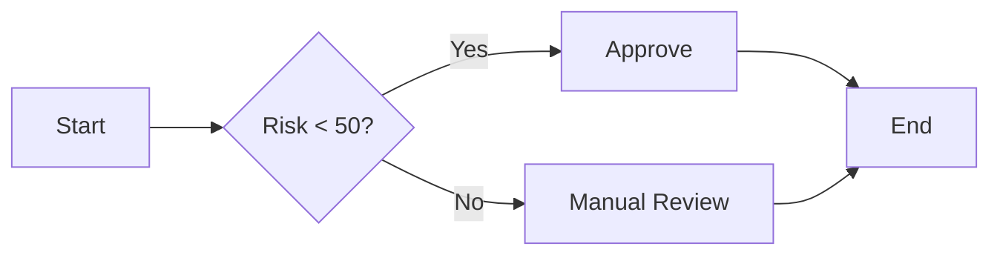
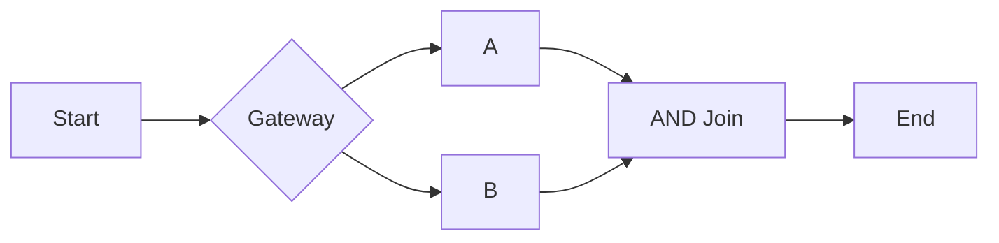
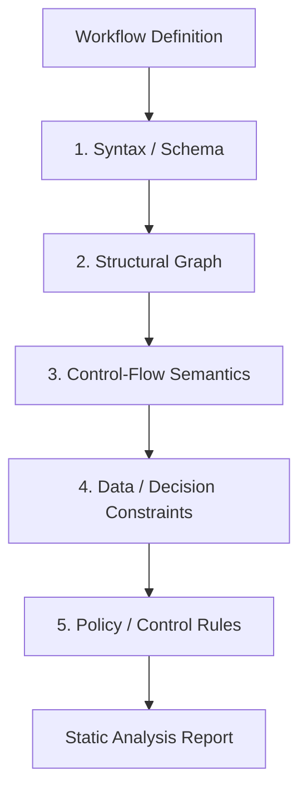
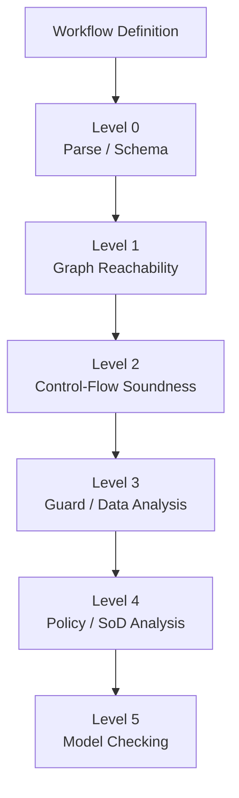
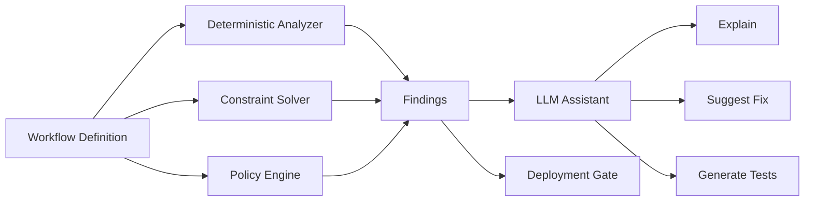
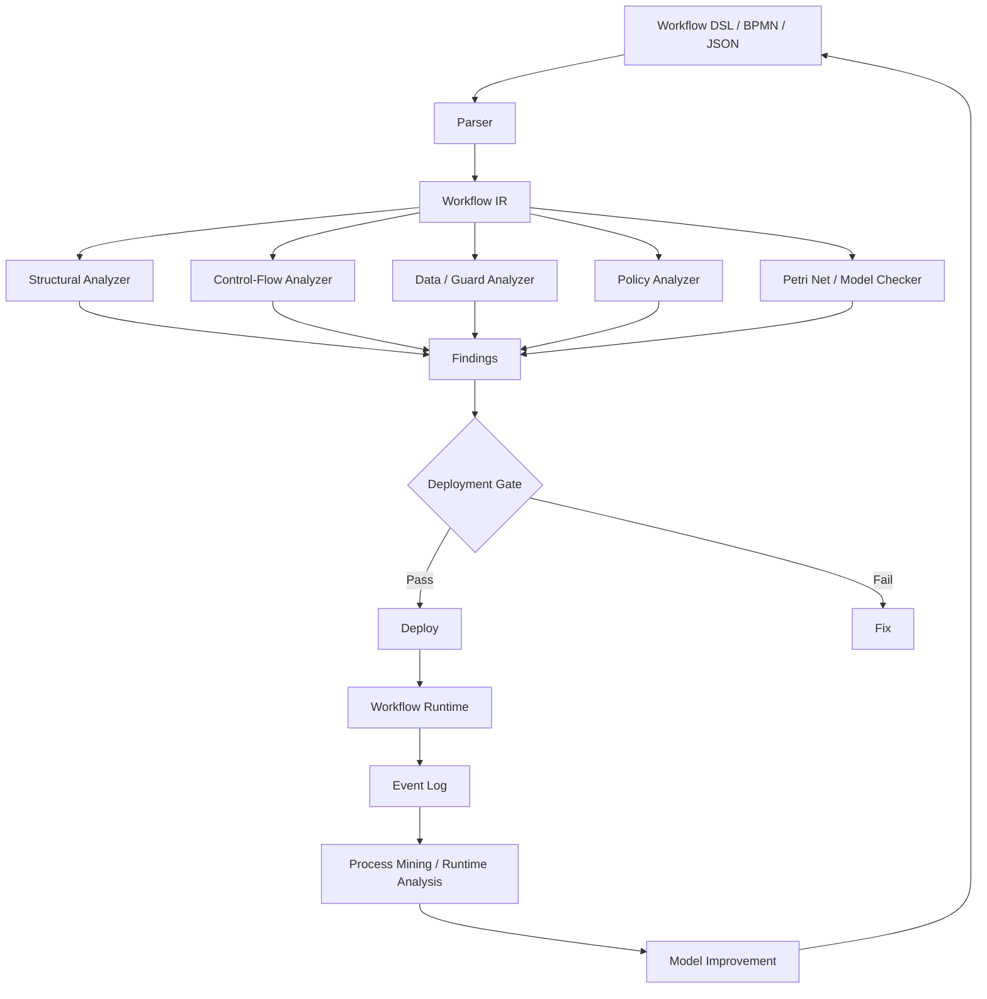

# Workflow Static Analysis：如何在运行前发现不可达节点和死流程

Workflow 系统最容易被忽略的一类问题，不是“某个节点执行失败”，而是：

> **这个节点从来不会执行。**

更麻烦的是，流程图看起来完全合理。

例如：

```text
Start
  ↓
Check Risk
  ↓
┌───────────────┐
│ Risk < 50 ?   │
└───────┬───────┘
        │
   ┌────┴────┐
   ↓         ↓
Low Risk   High Risk
             ↓
        Manager Approval
             ↓
           Trade
```

如果上游业务规则实际上只可能产生：

```text
Risk ∈ [0, 40]
```

那么：

```text
High Risk
Manager Approval
```

虽然都存在于 Workflow Definition 中，却永远不会运行。

这不是运行时异常。

它甚至不一定会被普通的 BPMN lint 报出来。

它属于更深一层的问题：

> **Workflow Definition 在语义上是否真的存在这条执行路径？**

这就是 Workflow Static Analysis 要解决的问题。

成熟的 Workflow 分析理论已经把它抽象为 **soundness（健全性）**：一个 Workflow 不应该产生无法完成的执行、错误终止，或者永远无法被执行的活动。经典 Workflow Net 理论将 soundness 分解为三个核心性质：**Option to Complete、Proper Completion、No Dead Activities**。后续 BPMN 研究将这一思想扩展到 BPMN、协作流程以及包含数据和决策逻辑的流程。

这并不是纯学术问题。一个工业案例研究分析了 **735 个来自金融服务、电信等行业的实际业务流程模型**，使用 Woflan、LoLA 和 SESE decomposition 检查死锁与同步问题，并发现工业流程的控制流分析可以做到毫秒级，从而支持将分析直接集成进建模过程。

因此，对企业尤其是金融服务领域而言，Workflow 不应该只是：

```text
设计 → 部署 → 运行 → 出问题
```

而应该变成：

```text
设计
  ↓
Static Analysis
  ↓
Simulation / Test
  ↓
Approval
  ↓
Deploy
  ↓
Runtime Monitoring
```

其中 Static Analysis 的职责不是证明“业务一定正确”，而是尽可能在运行前证明：

> **至少没有一批本来可以确定发现的结构、控制流、数据条件和策略错误。**

---

# 1. “不可达节点”其实有四个不同层次

这是整个问题最重要的概念。

很多系统把：

```text
reachable / unreachable
```

理解成：

```text
从 Start 有没有一条图上的路径能走到 Node
```

这远远不够。

真正应该至少区分四层。

## 1.1 Graph Reachability

最简单：

```text
Start → A → B → End
```

节点 `B` 有路径从 Start 到达，所以它是 graph-reachable。

如果：

```text
Start → A → End

X → Y
```

那么 `X`、`Y` 连不上 Start，就是明显的结构性不可达。

这类问题普通 DFS/BFS 就能发现：

```text
reachable = DFS(start)
unreachable = allNodes - reachable
```

复杂度基本是：

```text
O(V + E)
```

这类检查几乎没有理由放到运行时。

---

# 2. 但“图上可达”不等于“执行上可达”

考虑：



图结构上：

```text
B = reachable
```

但如果 Workflow 的数据约束是：

```text
0 <= Risk <= 40
```

那么：

```text
Risk < 50
```

永远成立。

因此：

```text
Risk >= 50
```

这条路径实际上不可执行。

换句话说：

> **Graph Reachability 只能回答“有没有边”；Semantic Reachability 才回答“有没有可能走到”。**

2021 年关于 BPMN + DMN 的研究正好给出了这种情况的严格例子：流程控制流本身看起来是合理的，但将 DMN 决策表和数据条件结合后，可以发现某些 sequence flow 永远无法被执行，进一步导致其后面的 task 永远是 dead task。论文明确指出，仅分析控制流无法发现这类错误，必须同时分析数据对象、decision logic 和 control flow。

这也是 Workflow Static Analysis 从：

```text
Lint
```

走向：

```text
Program Analysis / Model Checking
```

的关键分界线。

---

# 3. 什么叫 Dead Activity

Workflow 领域通常不会把所有“没人运行”的节点都叫 Dead。

更严格的定义是：

> **一个 Activity 如果不存在任何合法的完整执行路径能够执行它，那么它就是 dead activity。**

这和“目前没执行过”完全不同。

例如：

```text
Start
  ↓
A
  ↓
Gateway
  ├── condition = x > 10 → B
  └── condition = x <= 10 → C
```

如果：

```text
x = 1
```

只是一次具体实例的输入，那么这次 `B` 不执行不代表 `B` 是 dead。

但如果 Workflow 的约束已经证明：

```text
x ∈ [0, 5]
```

那么：

```text
x > 10
```

不可满足。

此时：

```text
B = Dead Activity
```

经典 Workflow Net soundness 正是把“No Dead Activities”作为核心性质之一。

---

# 4. “死流程”也至少有三种

“Workflow 死了”是一个非常模糊的说法。

静态分析最好把它拆成：

## 4.1 Deadlock

Workflow 到达某个状态：

```text
当前没有任何合法 Transition
```

但：

```text
Workflow != Completed
```

例如：



如果上游实际上是 XOR：

```text
A
或
B
```

而后面使用 AND Join：

```text
J
```

那么 `J` 永远等不到第二个 token。

结果：

```text
A → J
```

Workflow 被永久卡住。

这属于典型 deadlock。

---

## 4.2 Livelock

Workflow 不是完全停止，而是：

```text
一直运行
但永远到不了 End
```

例如：

```text
A
↓
Decision
├── Done → End
└── Retry → A
```

如果：

```text
Done
```

永远无法成立，那么：

```text
A → Retry → A → Retry → ...
```

就是 livelock。

从系统角度看：

```text
Workflow status = RUNNING
```

可能永远正常。

从业务角度看：

```text
Workflow = Dead
```

---

## 4.3 Improper Completion

Workflow 最终进入：

```text
End
```

但实际上还有未完成 token：

```text
A ──→ End
      ↑
      │
B ────┘
```

或者并行分支：

```text
Start
 ↓
AND
├── A → End
└── B
```

A 已经结束，但 B 仍然存在。

因此：

```text
Completed = true
```

不等于：

```text
Process correctly terminated
```

这就是 soundness 中的 **Proper Completion** 问题。

---

# 5. Soundness 是 Workflow Static Analysis 最值得借鉴的统一模型

经典 Workflow Net 的 soundness 可以概括成：

```text
1. Option to Complete
2. Proper Completion
3. No Dead Activities
```

对应到工程语言：

| Formal Property    | 工程问题                    |
| ------------------ | ----------------------- |
| Option to Complete | 有没有某些状态把 Workflow 永久卡死？ |
| Proper Completion  | 结束时是不是还残留未完成工作？         |
| No Dead Activities | 有没有节点永远不可能执行？           |

因此：

```text
Workflow Static Analysis
        =
Structural Analysis
+
Reachability Analysis
+
Soundness Analysis
```

这比简单的：

```text
检查有没有 Start
检查有没有 End
检查节点有没有名字
```

要深得多。

Camunda/bpmn.io 的 `bpmnlint` 就是典型的第一层工具：它可以检查 start/end event、conditional flow、fake join 等 BPMN 正确性规则，并支持在 CI、CLI 和建模器中运行。

但值得注意的是，bpmnlint 自己的 issue tracker 仍然有“Detect deadlocking parallel gateway”这样的规则需求，说明**普通 lint 与完整的行为分析并不是同一个层次的问题**。

---

# 6. 第一层：Structural Static Analysis

这是最应该先做的一层。

它不尝试理解所有业务语义，只分析 Workflow Definition 自身结构。

建议至少检查：

```text
Start Event
End Event
Disconnected Node
Missing Target
Missing Source
Duplicate ID
Duplicate Name
Invalid Transition
Orphan Event
Unreferenced Subworkflow
```

例如：

```text
Start → A → B → End

X → Y
```

直接报警：

```text
ERROR UNREACHABLE_NODE
Node Y is unreachable from workflow start.
```

---

# 7. 第二层：Control-Flow Analysis

接下来不再只看“有没有路径”，而是看：

> 这条流程结构有没有可能进入一个无法完成的状态？

应该分析：

```text
XOR
AND Split
AND Join
Event-based Gateway
Loops
Subprocess
Boundary Event
Interrupting Event
Message Event
Timeout
Retry
Compensation
```

例如：

```text
AND Split
 ├── A
 └── B
      ↓
    Join
```

需要知道：

```text
Join 是否一定能收到所需要的所有 token？
```

再比如：

```text
Retry
  ↓
Task
  ↓
Retry
```

需要判断：

```text
是否存在有限上限？
是否存在退出路径？
```

这已经不是简单图搜索，而是 Workflow execution semantics。

---

# 8. 第三层：Data-Aware Static Analysis

这是很多企业自研 Workflow 最容易缺失的一层。

例如：

```text
if amount > 1M
    → Committee Approval

if amount <= 1M
    → Auto Approve
```

如果上游已经确定：

```text
amount <= 500K
```

那么：

```text
Committee Approval
```

就是死节点。

更复杂的是：

```text
Eligibility
    ↓
Risk Score
    ↓
Credit Grade
    ↓
Approval Rule
```

可能每一层都单独正确：

```text
Eligibility → valid
Risk Score → valid
Credit Grade → valid
Approval Rule → valid
```

但是组合以后：

```text
Credit Grade = D
```

永远无法到达某个审批分支。

这正是 data-aware soundness 要解决的问题。

学术研究已经提出把 BPMN 和 DMN 编码成 Data Petri Nets，并使用约束与可达性分析检查：

* dead branch
* dead task
* decision row 不可达
* decision output 不可产生
* 流程无法完成

相关研究甚至进一步定义了 **No Dead Table Row** 这一属性，因为“决策表某一行永远不会命中”和“Workflow 某个 Task 永远不会执行”本质上是同一种静态分析问题在不同抽象层级上的表现。

---

# 9. 一个特别危险的问题：互相正确，组合错误

这是企业 Workflow 很典型的问题。

假设：

```text
Decision A：

Risk <= 5      → LOW
Risk > 5       → HIGH
```

Decision B：

```text
LOW  → Amount <= 1M
HIGH → Amount > 1M
```

Decision C：

```text
HIGH + Amount <= 500K → Manual Review
```

单独看：

```text
A 正确
B 正确
C 正确
```

但组合后：

```text
HIGH + Amount <= 500K
```

永远不成立。

因此：

```text
Manual Review = dead
```

这说明：

> **Workflow Static Analysis 不能只验证单个节点；必须验证节点之间形成的约束闭包。**

2021 年 DBPMN 研究中的示例正是如此：不同决策表各自看似合理，但由于上下游数据约束组合以后，某些输出值永远无法产生，从而使后续 sequence flow 和 task 变成 dead。

---

# 10. 第四层：Policy-Aware Static Analysis

金融 Workflow 又多了一层：

> **流程虽然可以运行，但控制要求可能已经失效。**

例如：

```text
Maker
  ↓
Approval
  ↓
Payment
```

看起来完全 sound。

但是：

```text
Maker == Approver
```

那么：

```text
Segregation of Duties
```

已经失效。

Basel Committee 对银行内部控制明确强调：

* 清晰的 authority / responsibility；
* separation of duties；
* 合适的 approval / authorization；
* 对 policy exceptions、threshold overrides 等进行跟踪。

因此金融 Workflow Static Analysis 应该检查的不仅是：

```text
Can this node execute?
```

还包括：

```text
Can this control actually be enforced?
```

例如：

```text
[Trade Created]
      ↓
[Risk Review]
      ↓
[Trader Approval]
      ↓
[Execute]
```

静态分析可以发现：

```text
WARN SOD-001
Trader and Risk Reviewer may resolve to the same role.
```

或者：

```text
ERROR AUTH-001
Execution path has no mandatory approval node
for transactions above policy threshold.
```

这类检查不属于 BPMN soundness 本身，而属于**企业控制语义层**。

这是必须明确区分的：

> **Sound Workflow 不等于 Compliant Workflow。**

---

# 11. 因此，一个企业 Workflow Analyzer 应该至少有五层

推荐架构：



分别回答：

```text
1. Definition 合法吗？
2. 节点结构合理吗？
3. 流程能不能走通？
4. 条件真的能发生吗？
5. 企业控制真的被强制执行了吗？
```

---

# 12. 为什么普通 DFS 不够

如果 Workflow 没有条件：

```text
Start → A → B → End
```

DFS 足够。

但：

```text
if x > 10
```

就需要知道：

```text
x 的可能取值范围
```

如果：

```text
x ∈ [0, 5]
```

那么：

```text
x > 10 = UNSAT
```

应该把分支标记：

```text
UNREACHABLE_BY_CONSTRAINT
```

更复杂的条件：

```text
(a > 10 && b < 5)
||
(c == "HIGH" && d != null)
```

已经可以转成：

```text
Boolean Constraint
```

然后交给 SAT/SMT/Constraint Solver。

于是：

```text
branchCondition ∧ pathConstraints
```

如果：

```text
UNSAT
```

那么：

```text
branch = dead
```

如果：

```text
SAT
```

则至少存在一条数据状态可以使它发生。

如果：

```text
UNKNOWN
```

则不能说它 dead。

这是企业工具里一个非常重要的原则：

> **Unknown ≠ Unreachable。**

---

# 13. Static Analysis 必须允许 Unknown

现实中的 Workflow 条件经常是：

```text
customer.creditScore > externalApi.score
```

或者：

```text
RiskService.evaluate(customer)
```

甚至：

```text
LLM decides whether additional review is required
```

这类条件很难在编译时证明。

因此分析结果最好分成：

```text
PROVEN
POSSIBLE
UNKNOWN
```

例如：

```text
Node A
  → PROVEN_REACHABLE

Node B
  → PROVEN_UNREACHABLE

Node C
  → POSSIBLY_REACHABLE

Node D
  → UNKNOWN
```

而不是：

```text
true / false
```

否则很容易出现错误的“安全感”。

---

# 14. 一个比较合理的 Guard Analysis

可以为每个节点维护：

```text
Path Condition
```

例如：

```text
Start
  PC = true

A
  PC = true

Risk Gateway
  ├── Low
  │    PC = risk < 50
  │
  └── High
       PC = risk >= 50
```

之后：

```text
High → Manager Approval
```

如果系统已经知道：

```text
0 <= risk <= 40
```

则：

```text
0 <= risk <= 40
AND
risk >= 50

= UNSAT
```

所以：

```text
Manager Approval = DEAD
```

---

# 15. Path Condition 不能无限展开

真实 Workflow 有循环：

```text
A
↓
B
↓
Retry
↓
A
```

如果每次展开 Path Condition：

```text
A1
A2
A3
...
```

最终会无限增长。

因此实际实现需要：

```text
Fixed Point
+
Abstract Interpretation
+
State Merging
```

或者：

```text
Petri Net / State Machine
+
Symbolic Reachability
```

这也是为什么 Workflow Static Analysis 最终会自然进入 Formal Methods 的领域。

---

# 16. Petri Net 为什么一直出现在 Workflow Analysis 里

Petri Net 并不是因为“画起来好看”。

它的价值在于：

```text
Token
Place
Transition
```

非常适合表达：

```text
并发
同步
分叉
汇聚
循环
资源竞争
等待
```

例如：

```text
AND Split
```

可以产生两个 token：

```text
      ●
      |
    Split
    /   \
   ●     ●
   |     |
   A     B
    \   /
     Join
      |
      ●
```

而：

```text
AND Join
```

必须同时收到 token。

因此：

```text
XOR + AND
```

使用错误，就可以从 Petri Net 的 token semantics 中直接发现。

这也是为什么 Workflow Net 长期成为 Workflow Soundness 的经典形式化基础。

---

# 17. 为什么不直接对整个 Workflow 做 Model Checking

因为会遇到最现实的问题：

> **State Explosion。**

如果一个 Workflow 有：

```text
5 个 Boolean
```

理论状态空间最多约：

```text
2^5 = 32
```

如果：

```text
30 个 Boolean
```

就是：

```text
2^30
```

如果再增加：

```text
并发分支
队列
Message Event
Human Approval
Timer
Retry Counter
业务变量
```

状态空间会迅速膨胀。

相关 BPMN 验证研究也明确把 **state-space explosion** 作为大规模模型验证的主要挑战之一。BProVe 甚至同时引入传统 LTL model checking 与 statistical model checking，以处理异步消息导致的状态空间增长。

所以企业平台不应该把：

```text
“完整形式化验证所有 Workflow”
```

作为唯一方案。

更合理的是：

```text
Cheap Checks
      ↓
Structural Checks
      ↓
Targeted Semantic Analysis
      ↓
Formal Verification for Critical Flows
```

---

# 18. 推荐采用“分层分析”，而不是“一种算法打天下”

可以设计成：



### Level 0

毫秒级：

```text
JSON/XML parse
Reference validation
Type validation
```

### Level 1

毫秒级：

```text
unreachable nodes
orphan nodes
dead-end nodes
invalid references
```

### Level 2

通常仍然很快：

```text
deadlock
improper completion
unsafe joins
unbounded loops
```

### Level 3

复杂度明显提高：

```text
guard satisfiability
decision table coverage
data dependency
infeasible branches
```

### Level 4

依赖企业规则：

```text
segregation of duties
mandatory approval
authority limits
policy bypass
restricted roles
```

### Level 5

只针对重要 Workflow：

```text
formal reachability
LTL / CTL
Petri net model checking
timed verification
counterexample generation
```

---

# 19. 真正好用的 Analyzer 不应该只给“失败”

这是 Workflow Static Analysis 和一般 lint 最大的产品差异之一。

如果只返回：

```text
ERROR: Workflow is unsound
```

对业务分析师几乎没有帮助。

更好的结果应该是：

```text
ERROR DEAD_NODE

Node:
    Manager Approval

Reason:
    No valid execution can reach this node.

Proof:
    Path condition:
        amount > 1,000,000

    Upstream invariant:
        amount <= 500,000

    Constraint:
        amount > 1,000,000
        AND
        amount <= 500,000

    Result:
        UNSAT

Suggested Review:
    Check upstream amount constraint or remove this branch.
```

这才是工程上真正可用的 Static Analysis。

---

# 20. 更重要的是生成 Counterexample

如果发现：

```text
deadlock
```

最好给出：

```text
Start
 ↓
A
 ↓
Parallel Split
 ├── B
 │
 └── C
      ↓
      Error
      ↓
   Parallel Join
```

然后说明：

```text
Counterexample:

1. Start
2. Parallel Split
3. B
4. C
5. Error terminates C branch
6. Join waits for C token
7. Workflow cannot complete
```

研究型 BPMN Verification 工具已经采用这种方式。BProVe 可以通过 model checker 生成导致 Option to Complete 失败的 execution trace，并用于定位 Workflow 为什么卡住。

因此 Static Analyzer 最好的输出不是：

```text
FAILED
```

而是：

```text
FAILED
+
WHY
+
COUNTEREXAMPLE
```

---

# 21. AWS Step Functions 已经提供了一个很有价值的工程实践

AWS Step Functions 提供 `ValidateStateMachineDefinition`，可以在不创建 State Machine 的情况下验证 ASL Definition，而且 AWS 明确建议把它集成到：

```text
CI
Code Review
Git pre-commit hook
```

中。

该 API 目前可以报告：

```text
missing end state
duplicate state name
missing transition target
invalid resource
schema errors
```

并区分：

```text
ERROR
WARNING
```

这说明一个非常重要的工程原则：

> **Workflow Definition 本身应该像 source code 一样，在部署之前经过机器检查。**

但也要注意：

AWS 的官方 Validator 属于**定义校验与静态诊断**，不能因此推导出它等价于完整 Workflow Soundness Verification。它主要检查 ASL 结构、引用以及特定静态问题；真正复杂的业务条件可达性仍然需要更高层的分析。

---

# 22. BPMN 生态也已经形成“Lint → Formal Verification”的分层

BPMN 生态中，`bpmnlint` 负责：

```text
syntax
conventions
correctness rules
```

例如：

```text
missing start event
missing end event
missing conditional flow
fake join
event-based gateway issues
```

并支持插件化规则以及 CI / CLI 使用。

而更严格的工具链则会把 BPMN：

```text
BPMN
 ↓
Petri Net / DPN
 ↓
Model Checker
 ↓
Soundness
```

例如研究工具 BProVe 基于 BPMN interpreter 和 state-space exploration 验证：

```text
Option to Complete
Proper Completion
No Dead Activities
```

并组合标准与统计模型检查。

这其实是一个非常好的企业架构模式：

> **不要让一个 Analyzer 负责所有事情，而是把不同证明强度的分析组织成流水线。**

---

# 23. 企业 Workflow Definition 最好像 Compiler 一样处理

对于自研 Workflow Platform，我更推荐：

```text
Workflow DSL / JSON / BPMN
          ↓
       Parser
          ↓
        AST
          ↓
   Normalized IR
          ↓
 ┌────────┼──────────┐
 ↓        ↓          ↓
Graph   Guards     Policies
Analysis Analysis   Analysis
 └────────┼──────────┘
          ↓
      Verification
          ↓
      Diagnostics
          ↓
   Deployment Gate
```

这里最关键的是：

> **不要直接对原始 BPMN JSON 或 Workflow JSON 做所有分析。**

应该先建立自己的：

```text
Workflow IR
```

---

# 24. Workflow IR 应该表达什么

例如：

```typescript
interface WorkflowIR {
  id: string;
  version: number;

  start: NodeId[];

  nodes: NodeIR[];
  edges: EdgeIR[];

  variables: VariableIR[];
  policies: PolicyRef[];
  subflows: SubflowRef[];
}
```

Node：

```typescript
interface NodeIR {
  id: string;
  type:
    | "task"
    | "humanTask"
    | "gateway"
    | "timer"
    | "event"
    | "subflow"
    | "end";

  guard?: Expression;
}
```

Edge：

```typescript
interface EdgeIR {
  from: NodeId;
  to: NodeId;
  condition?: Expression;
}
```

这样 Static Analyzer 不需要知道：

```text
BPMN XML
AWS ASL JSON
自研 JSON
TypeScript DSL
```

分别是什么。

它只需要理解：

```text
Workflow IR
```

这对企业平台长期演进非常重要。

---

# 25. Subworkflow 是静态分析最容易漏掉的地方

例如：

```text
Main Workflow
    ↓
Risk Review
    ↓
Execute Trade
```

实际上：

```text
Risk Review = SubWorkflow
```

内部是：

```text
Start
 ↓
Check A
 ↓
Check B
 ↓
Approval
 ↓
End
```

那么主 Workflow 的：

```text
Reachability
Soundness
```

不能在 SubWorkflow 边界上简单停止。

否则可能出现：

```text
Main Workflow = sound
Risk Review = deadlock
```

平台却说：

```text
Everything OK
```

因此需要：

```text
Interprocedural Analysis
```

或者至少：

```text
Subworkflow Contract
```

例如：

```text
Subworkflow:
    RiskReview

Guarantees:
    input = RiskCase
    output = Approved | Rejected
    never leaves pending state

Requires:
    riskScore != null
    policyVersion != null
```

这样主 Workflow 可以对 Subworkflow 做静态分析，而不用永远展开全部内部图。

---

# 26. Dynamic Dispatch 是静态分析的边界

现代企业 Workflow 经常出现：

```text
next = config.nextStep
```

或者：

```text
tool = registry.resolve(name)
```

甚至：

```text
LLM decides next tool
```

这类结构会让：

```text
complete static reachability
```

非常困难。

例如：

```python
next_node = llm.choose(...)
```

那么：

```text
Node B
```

到底能不能到？

静态分析无法仅靠 Workflow Definition 证明。

因此应该区分：

### Closed Workflow

所有节点和 Transition 在部署前确定。

适合：

```text
strong static analysis
formal verification
```

### Open / Dynamic Workflow

运行时可以：

```text
load plugin
resolve tool
generate branch
invoke arbitrary subworkflow
```

只能保证：

```text
known-safe boundaries
```

而不是整个流程的完整静态证明。

这并不是静态分析工具“不够聪明”，而是 Workflow 的执行语义本身已经超出了它静态知道的信息。

---

# 27. Agent Workflow 尤其要限制动态自由度

AI Agent 很容易把 Workflow 设计成：

```text
Agent
 ↓
think
 ↓
choose next tool
 ↓
execute
 ↓
think
 ↓
choose next tool
```

这对 Agent Runtime 很自然。

但对企业 Workflow Static Analysis 极其困难。

因为：

```text
reachable nodes
```

本身成为：

```text
LLM output dependent
```

所以更合理的设计是：

```text
Deterministic Workflow
        ↓
    bounded Agent
        ↓
    bounded actions
        ↓
Deterministic transition
```

即：

```text
Agent proposes
Workflow decides
```

而不是：

```text
Agent defines Workflow
```

这样 Static Analyzer 至少可以证明：

```text
Agent output
   ↓
allowed transition set
```

例如：

```text
AllowedActions = {
    REQUEST_REVIEW,
    ADD_DOCUMENT,
    ASK_USER
}
```

Agent 不能直接：

```text
jump_to("ExecuteTrade")
```

否则 Workflow Control Plane 基本无法进行可靠的静态控制分析。

---

# 28. 一个很实用的“Workflow Lint Rule Matrix”

企业内部可以逐步建立类似下面的规则库：

| Rule  | 检查内容                                 | 严重度             |
| ----- | ------------------------------------ | --------------- |
| WF001 | 无 Start                              | Error           |
| WF002 | 无 End                                | Error           |
| WF003 | Node 不可达                             | Error           |
| WF004 | Dead Activity                        | Error           |
| WF005 | Dead Branch                          | Error           |
| WF006 | Deadlock                             | Error           |
| WF007 | Livelock risk                        | Error / Warning |
| WF008 | Improper Completion                  | Error           |
| WF009 | Gateway mismatch                     | Error           |
| WF010 | Missing default branch               | Warning         |
| WF011 | Unsatisfiable guard                  | Error           |
| WF012 | Overlapping guards                   | Warning         |
| WF013 | Incomplete decision table            | Error           |
| WF014 | Dead decision row                    | Warning / Error |
| WF015 | Missing timeout                      | Warning         |
| WF016 | Unbounded retry                      | Error           |
| WF017 | Missing approval                     | Error           |
| WF018 | SoD violation                        | Error           |
| WF019 | Dynamic transition                   | Warning         |
| WF020 | External dependency without contract | Warning         |

这里尤其值得强调：

> **“Warning” 不等于没关系。**

在金融 Workflow 中应该允许：

```text
ERROR
WARNING
INFO
UNKNOWN
```

四级结果。

---

# 29. Guard Analysis 还应该检查“互斥”和“覆盖”

例如：

```text
amount < 1M
amount > 1M
```

这里：

```text
amount == 1M
```

没有任何分支。

所以：

```text
Coverage Gap
```

而：

```text
amount <= 1M
amount >= 500K
```

存在：

```text
500K <= amount <= 1M
```

两个分支同时成立。

那么：

```text
Overlap
```

如果业务语义要求 XOR，则这是错误。

因此一个 Gateway 的完整分析应该至少检查：

```text
Satisfiability
+
Mutual Exclusivity
+
Coverage
```

即：

```text
每个 branch 能发生吗？
两个 branch 会不会同时发生？
所有合法输入都有 branch 吗？
```

这已经非常接近编译器里的：

```text
Pattern Matching Exhaustiveness
```

问题。

---

# 30. Decision Table 也应该进行静态分析

如果 Workflow 使用 DMN 或类似规则引擎，可以直接分析：

```text
Input domain
↓
Rules
↓
Output domain
```

至少检查：

```text
Dead Rule
Overlapping Rule
Gap
Contradictory Rule
Unreachable Output
```

例如：

```text
Rule 1:
amount < 100K

Rule 2:
amount < 50K
```

如果 hit policy 是 unique：

```text
Overlap
```

而：

```text
Rule 1:
amount < 100K

Rule 2:
amount >= 200K
```

那么：

```text
100K <= amount < 200K
```

就是 gap。

这些问题和 Workflow 的 branch coverage 本质相同。

---

# 31. Static Analysis 和 Simulation 不应该二选一

两者解决的问题不同。

### Static Analysis

回答：

```text
理论上是否可能？
```

优点：

```text
不需要真实数据
```

### Simulation

回答：

```text
给定某些输入，实际会怎么走？
```

优点：

```text
能更直观地看到执行轨迹
```

因此更合理的 Pipeline 是：

```text
Static Analysis
        ↓
Generate Test Cases
        ↓
Simulation
        ↓
Runtime Test
```

如果 Static Analyzer 发现：

```text
Risk >= 90
```

和：

```text
Risk < 90
```

两个分支，那么可以自动生成边界测试：

```text
Risk = 89
Risk = 90
Risk = 91
```

这与现代 model-based testing 很自然地结合起来。

---

# 32. Process Mining 不是 Static Analysis 的替代品

这一点对于金融服务非常重要。

Process Mining 擅长：

```text
已有真实执行记录
        ↓
发现实际流程
        ↓
Conformance Checking
```

Static Analysis 擅长：

```text
还没上线
        ↓
Workflow Definition
        ↓
验证设计是否自相矛盾
```

2025/2026 年关于银行业 Business Process Compliance 的研究明确指出，对于一个“new-to-bank”的新流程，如果尚无实际 execution logs，Process Mining 本身无法直接在设计阶段验证模型是否满足一组要求；因此设计时仍需要模型检查、仿真等手段。

所以：

```text
Static Analysis ≠ Process Mining
```

而是：

```text
Static Analysis
    ↓
Design-time Assurance

Process Mining
    ↓
Runtime / Historical Assurance
```

两者应该形成闭环：

```text
Model
 ↓
Static Analysis
 ↓
Deploy
 ↓
Runtime
 ↓
Event Log
 ↓
Process Mining
 ↓
发现偏差
 ↓
Model Improvement
```

---

# 33. 一个真实工业研究非常支持这种做法

经典工业研究分析了 **735 个实际业务流程模型**，覆盖金融服务、电信等领域。

研究使用：

```text
Woflan
LoLA
SESE decomposition
```

检查：

```text
deadlock
lack of synchronization
soundness
```

研究结论之一是：工业 Workflow 的控制流分析可以达到毫秒级，从而适合紧密集成到建模过程，而不是等上线以后再检查。

这个案例对企业 Workflow Platform 有很强的现实意义：

> **Static Analysis 不一定是昂贵的“形式化验证项目”，大量高价值检查实际上可以足够便宜，直接放进开发和发布流水线。**

---

# 34. 在金融服务场景中，真正应该阻断发布的是什么

不应该因为“模型不够漂亮”就阻止发布。

建议把规则分为三个层次。

## 必须阻断

```text
Unreachable critical node
Dead approval branch
Deadlock on critical path
No valid completion
Missing mandatory approval
Broken authorization path
SoD violation
Unsatisfiable mandatory condition
Unbounded retry on critical operation
```

---

## 默认 Warning

```text
Possible livelock
Overlapping conditions
Missing explicit default branch
Dynamic dispatch
Unknown external condition
Optional timeout
Large state space
```

---

## Information

```text
Node has only one incoming edge
Redundant gateway
Unusually deep nesting
Long path
Duplicated conditions
Unused variable
```

这样 Static Analysis 才不会逐渐变成：

```text
ERROR EVERYTHING
```

最终开发团队反而关闭它。

---

# 35. Static Analysis 也应该知道“关键路径”

金融 Workflow 不应该对所有节点采用相同严格度。

例如：

```text
Trade Execution
Payment Release
Client Asset Transfer
Corporate Action Instruction
```

应该属于：

```text
Critical
```

而：

```text
Send Reminder Email
Update Dashboard
Write Analytics Event
```

可能属于：

```text
Non-Critical
```

于是可以配置：

```yaml
criticality:
  executeTrade: critical
  releasePayment: critical
  sendNotification: normal
```

然后：

```text
Dead node on critical path
    → ERROR

Dead node on non-critical path
    → WARNING
```

这比单纯：

```text
所有错误都是 ERROR
```

更符合实际企业治理。

---

# 36. Static Analysis 还应该检查 Workflow Control Boundary

现代金融 Workflow 很多时候并不是：

```text
Workflow
    ↓
Task
```

而是：

```text
Agent
 ↓
Workflow
 ↓
Policy
 ↓
Tool
 ↓
Business System
```

这时需要分析：

```text
Agent → allowed node
Policy → required approval
Tool → authorization
Business Action → audit
```

例如：

```text
LLM proposes ExecuteTrade
```

但 Workflow Definition 中：

```text
ExecuteTrade
requires:
    RiskApproval
```

Static Analyzer 应该能够发现：

```text
Agent
   ↓
ExecuteTrade
```

是否存在绕过：

```text
RiskApproval
```

的路径。

因此：

> **Workflow Static Analysis 不只是“流程图分析”，最终会逐渐成为 Control Plane 的一部分。**

---

# 37. 不要让 LLM 直接负责“证明 Workflow 没问题”

这是 AI Workflow 特别容易产生的误区。

LLM 很适合：

```text
解释流程
生成规则
生成测试场景
帮助修复
```

但不适合承担：

```text
proof of reachability
proof of soundness
proof of authorization coverage
proof of no deadlock
```

因为这些问题应该有：

```text
确定性算法
Constraint Solver
Model Checker
Rule Engine
```

作为最终判断。

一个合理架构是：



LLM 在这里是：

```text
Analysis Assistant
```

不是：

```text
Proof Engine
```

---

# 38. 一个成熟 Analyzer 的输出应该是什么

推荐把结果结构化，而不是仅仅打印文本：

```json
{
  "workflow": "trade-execution",
  "version": 17,
  "status": "FAILED",
  "findings": [
    {
      "rule": "WF004",
      "severity": "ERROR",
      "node": "ManagerApproval",
      "kind": "DEAD_NODE",
      "confidence": "PROVEN",
      "reason": {
        "pathCondition": "amount > 1000000",
        "invariants": [
          "amount <= 500000"
        ]
      },
      "counterexample": null
    }
  ]
}
```

对于 deadlock：

```json
{
  "rule": "WF006",
  "severity": "ERROR",
  "kind": "DEADLOCK",
  "state": [
    "RiskReviewCompleted",
    "TraderApprovalCompleted"
  ],
  "waitingFor": [
    "ComplianceApproval"
  ]
}
```

这让分析结果可以同时用于：

```text
IDE
Web UI
CI
Change Request
Governance
Audit
```

---

# 39. Static Analysis 应该进入 Git / CI，而不是只放在 Modeler 里

AWS 已经明确建议把 State Machine Definition Validation 放入：

```text
CI
Code Review
pre-commit
```

。

BPMN lint 同样支持 CLI，并可通过配置和插件扩展规则。

企业 Workflow Platform 因此可以采用：

```text
Pull Request
      ↓
Workflow Compiler
      ↓
Static Analyzer
      ↓
Policy Analyzer
      ↓
Simulation
      ↓
Approval
      ↓
Deploy
```

例如：

```bash
workflow validate trade-flow.yaml
```

输出：

```text
✓ Schema
✓ Structural Reachability
✓ Soundness
✓ Guard Analysis
✓ Policy Checks

ERROR WF017:
Mandatory compliance approval is unreachable.

ERROR WF018:
Trader may approve own trade.

WARN WF019:
Dynamic Agent transition detected.
```

CI：

```text
exit 1
```

阻止部署。

---

# 40. Versioning 也是 Static Analysis 的一部分

Workflow Definition：

```text
v17
```

已经运行中的实例可能仍然基于：

```text
v17
```

而 repository 当前已经是：

```text
v18
```

因此：

```text
Static Analysis(v18)
```

并不能自动证明：

```text
Running Instance(v17)
```

仍然安全。

这意味着发布流程应该验证：

```text
New Definition
        ↓
Static Analysis
        ↓
Migration Compatibility
        ↓
Existing Instance Compatibility
        ↓
Deploy
```

Temporal 对 Workflow Code 的 Safe Deployment 也体现了相同的原则：历史 Workflow 的代码变化可能造成 non-determinism，因此需要 Worker Versioning 或 patching 等机制保护已有执行。

虽然 Temporal 的实现方式不同于 BPMN Workflow，但它说明了一个更一般的原则：

> **Workflow Definition 不是普通配置文件；它是长期存在的可执行业务程序。**

---

# 41. 对自研 Workflow Platform，建议不要一开始就做“完整形式化证明”

更现实的路线是：

## Phase 1：确定性 Graph Analysis

先实现：

```text
unreachable node
orphan node
dead end
missing start/end
invalid reference
cycle without exit
```

这部分成本低，收益很高。

---

## Phase 2：Control-Flow Soundness

增加：

```text
AND/XOR correctness
deadlock
improper completion
livelock heuristic
retry analysis
timer analysis
subworkflow analysis
```

此时可以引入：

```text
Petri Net
```

作为内部验证模型。

---

## Phase 3：Constraint Analysis

加入：

```text
Path Conditions
Data Dependency
Decision Table
Guard SAT/UNSAT
```

可以接：

```text
SMT Solver
```

或者专门的 constraint engine。

---

## Phase 4：Policy Analysis

加入：

```text
Approval
SoD
Role
Authority Limits
Mandatory Control
Exception
Override
Audit
```

把：

```text
Workflow Definition
+
Policy Definition
```

一起编译。

---

## Phase 5：Critical Workflow Formal Verification

只针对：

```text
Payment
Trade
Asset Transfer
Regulatory Reporting
High-Risk Operations
```

做更强的：

```text
Model Checking
Temporal Properties
Counterexample
Timed Verification
```

这种分级方式可以避免一开始就把整个 Workflow Platform 做成一个学术级形式化验证系统。

---

# 42. 一个值得建立的 Workflow Static Analysis Contract

可以给每个生产 Workflow 定义：

```yaml
analysis:
  structural:
    unreachableNodes: error
    deadEnds: error

  soundness:
    deadlock: error
    improperCompletion: error
    deadActivity: error

  data:
    unsatisfiableGuard: error
    uncoveredBranch: error
    deadDecisionRow: warning

  governance:
    mandatoryApproval: error
    segregationOfDuties: error
    authorityLimit: error

  runtime:
    unboundedRetry: error
    missingTimeout: warning
    dynamicDispatch: warning

  formal:
    enabled: false
```

然后：

```text
Workflow Definition
+
Analysis Contract
```

一起进入发布流程。

这样“什么叫允许上线”不再依赖某个架构师临时判断，而是变成机器可执行的工程规则。

---

# 43. 最后一个非常重要的边界：Static Analysis 不能证明业务需求正确

假设 Analyzer 证明：

```text
No unreachable nodes
No deadlock
No dead activity
Proper completion
No unsatisfiable guard
SoD satisfied
Approval exists
```

依然不能推出：

```text
Workflow is business-correct.
```

因为它可能仍然存在：

```text
审批金额写错
Risk threshold 写错
错误的 Policy Version
遗漏一个业务场景
错误的顺序要求
错误的外部数据映射
```

因此最终应该明确分层：

```text
Static Analysis
    ↓
证明 Workflow Definition 没有某些已知的结构 / 行为缺陷

Business Review
    ↓
确认 Workflow 实现的业务目标是正确的

Runtime Monitoring
    ↓
确认真实执行没有偏离设计

Audit
    ↓
证明关键控制实际发生
```

这是一个非常重要的事实边界。

---

# 44. 最终推荐的整体架构

对于一个现代、尤其是金融服务领域的 Workflow Platform，可以形成这样的完整链路：



这实际上形成了一个闭环：

```text
设计
 ↓
静态证明
 ↓
发布
 ↓
运行
 ↓
观察
 ↓
发现偏差
 ↓
重新设计
```

---

# 45. 对企业 Workflow 最值得采用的几个原则

### 原则一：先区分“图可达”和“语义可达”

```text
DFS reachable
```

只是第一层。

真正重要的是：

```text
execution reachable
```

---

### 原则二：把 Soundness 作为通用 Workflow Correctness 基础

至少检查：

```text
Option to Complete
Proper Completion
No Dead Activities
```

这是 Workflow Verification 中已经长期使用的形式化基础。

---

### 原则三：不要只分析 Control Flow

必须逐步加入：

```text
Data
Decision
External Event
Timer
Policy
Role
```

否则最危险的一类：

```text
“结构看起来对，但永远走不到”
```

仍然会漏掉。

---

### 原则四：不要把 Unknown 当成 Safe

静态分析结果应该允许：

```text
PROVEN
POSSIBLE
UNKNOWN
```

不能为了让 CI “全绿”而把无法证明的问题默认为：

```text
OK
```

---

### 原则五：Critical Workflow 才使用强证明

普通流程：

```text
Lint + Reachability + Soundness
```

已经可以解决大量问题。

高风险流程：

```text
Policy + Constraint + Model Checking
```

才值得增加。

---

### 原则六：Analyzer 必须给 Counterexample

不要只告诉用户：

```text
Deadlock detected
```

应该告诉：

```text
哪一个节点
在哪一种状态
为什么卡住
哪一条路径导致
需要什么条件才能修复
```

---

### 原则七：LLM 可以解释和修复，但不应该充当 Proof Engine

应该是：

```text
Deterministic Analyzer → 判断
LLM → 解释
LLM → 建议修复
LLM → 生成测试
```

而不是：

```text
LLM → 判断 Workflow 是否安全
```

---

### 原则八：Static Analysis 应成为 Workflow Compiler 的一部分

最终可以把整个过程理解成：

```text
Workflow Source
      ↓
Parse
      ↓
Normalize
      ↓
Analyze
      ↓
Verify
      ↓
Compile
      ↓
Deploy
```

这比把 Workflow 当成：

```text
数据库里的一段 JSON
```

要成熟得多。

---

# 46. 结论

Workflow Static Analysis 真正要解决的问题，不是：

> “这张流程图有没有画错？”

而是：

> **“在任何合法输入、合法事件和合法并发行为下，这个 Workflow 是否存在永远无法到达的节点、永远无法完成的路径、错误的同步、不可满足的条件，以及被业务控制要求隐式禁止的执行路径？”**

因此，成熟的 Workflow 静态分析应该从：

```text
Lint
```

逐步发展成：

```text
Structural Analysis
        +
Control-Flow Analysis
        +
Data / Constraint Analysis
        +
Policy Analysis
        +
Formal Verification
```

其中：

```text
unreachable node
```

是最基础的问题；

```text
dead activity
```

是执行语义层的问题；

```text
deadlock / livelock / improper completion
```

是 Workflow soundness 的问题；

```text
unsatisfiable guard / dead decision row
```

是数据与决策语义的问题；

而：

```text
missing approval
SoD violation
policy bypass
```

则已经进入企业控制层。

金融服务 Workflow 尤其不能把这些问题全部归结为“运行时再观察”。Basel Committee 对银行内部控制明确要求有效的控制环境、明确授权、审批机制以及职责分离；因此，对于重要业务流程，把一部分控制要求前移到 Workflow Definition 的静态验证阶段，是与金融机构既有控制理念一致的工程方向。

真正值得建设的并不是一个“BPMN Linter”，而是：

> **Workflow Compiler + Static Analyzer + Policy Verifier。**

这样 Workflow 在真正获得生产权限以前，就已经可以回答三个关键问题：

```text
1. 这条流程能不能走？
2. 所有声明存在的节点，真的有可能被走到吗？
3. 即使能走，关键业务控制是不是仍然存在？
```

而一旦某条流程无法回答这些问题，就不应该把问题留给生产运行来发现。

---

## 参考资料

1. **W. M. P. van der Aalst et al. — Soundness of workflow nets: classification, decidability, and analysis**
   经典 Workflow Net soundness 理论，讨论 Option to Complete、Proper Completion、No Dead Transitions 等性质。
   [Springer 论文](https://link.springer.com/article/10.1007/s00165-010-0161-4?utm_source=chatgpt.com)

2. **Well-structuredness, safeness and soundness: A formal classification of BPMN collaborations**
   将 soundness、safeness 等形式化性质扩展到 BPMN collaboration，并讨论 deadlock、lack of synchronization 和 dead activities。
   [论文页面](https://doi.org/10.1016/j.jlamp.2020.100630?utm_source=chatgpt.com)

3. **de Leoni, Felli, Montali — Integrating BPMN and DMN: Modeling and Analysis**
   研究 BPMN + DMN + 数据条件组合后的 data-aware soundness，给出 dead branch、dead task、dead decision row 等真实分析问题。
   [Springer Open Access 论文](https://link.springer.com/article/10.1007/s13740-021-00132-z?utm_source=chatgpt.com)

4. **Corradini et al. — A formal approach for the analysis of BPMN collaboration models / BProVe**
   基于状态空间探索、LTL model checking 和 statistical model checking 分析 BPMN soundness，并生成 counterexample。
   [ScienceDirect 论文](https://www.sciencedirect.com/science/article/pii/S0164121221001047?utm_source=chatgpt.com)

5. **van der Aalst et al. — Analysis on demand: Instantaneous soundness checking of industrial business process models**
   对 735 个工业业务流程模型进行分析，覆盖金融服务、电信等行业，并比较 Woflan、LoLA、SESE decomposition；研究显示这类控制流分析可以做到毫秒级。
   [论文页面](https://doi.org/10.1016/j.datak.2011.01.004?utm_source=chatgpt.com)

6. **OMG — Business Process Model and Notation (BPMN) 2.0.2**
   BPMN 官方规范与机器可读模型定义。
   [OMG BPMN Specification](https://www.omg.org/spec/BPMN/2.0.2/PDF/?utm_source=chatgpt.com)

7. **bpmn-io — bpmnlint**
   BPMN linting、CLI、CI、可配置规则和插件机制的实际工程实现。
   [GitHub — bpmn-io/bpmnlint](https://github.com/bpmn-io/bpmnlint?utm_source=chatgpt.com)

8. **AWS — ValidateStateMachineDefinition**
   AWS Step Functions 官方静态验证接口，支持 CI、Code Review 和 pre-commit，并提供 ERROR/WARNING diagnostics。
   [AWS API Reference](https://docs.aws.amazon.com/step-functions/latest/apireference/API_ValidateStateMachineDefinition.html?utm_source=chatgpt.com)

9. **AWS Step Functions — Human Approval / Use Cases**
   官方的人工作业、callback、人工审批以及 Standard Workflow 使用场景。
   [AWS Human Approval Tutorial](https://docs.aws.amazon.com/step-functions/latest/dg/tutorial-human-approval.html?utm_source=chatgpt.com)

10. **Temporal — Understanding Temporal / Safe Deployments**
    Durable Workflow、History Replay、determinism 与长期运行 Workflow 的版本化约束。
    [Temporal — Understanding Temporal](https://docs.temporal.io/evaluate/understanding-temporal?utm_source=chatgpt.com)

11. **TAPAAL — Workflow Analysis / Timed-Arc Petri Net Verification**
    提供 Petri Net、Timed Workflow Net 的建模、模拟与 soundness verification，包含 counterexample 和 debugging 能力。
    [TAPAAL](https://www.tapaal.net/?utm_source=chatgpt.com)

12. **WoPeD — Workflow Petri Net Designer**
    开源 Workflow Petri Net 工具，提供 soundness、boundedness、liveness 等分析能力。
    [WoPeD](https://woped.dhbw-karlsruhe.de/?utm_source=chatgpt.com)

13. **Basel Committee on Banking Supervision — Operational Risk / Internal Control**
    关于银行内部控制、授权、审批、职责分离、policy exception 和 operational resilience 的监管框架。
    [BIS Basel Framework — Operational Risk](https://www.bis.org/committees/bcbs/basel-consolidated-guidelines/module/orr/10?utm_source=chatgpt.com)

14. **Adams et al. — Addressing the Contemporary Challenges of Business Process Compliance: The Case for Process Mining in the Banking Industry**
    讨论银行业务流程合规、设计时验证和 Process Mining 的能力边界，尤其指出新流程没有历史 event log 时，不能仅靠 Process Mining 完成设计时验证。
    [Springer Open Access 论文](https://link.springer.com/article/10.1007/s12599-025-00929-3?utm_source=chatgpt.com)

15. **Dechsupa et al. — Hierarchical Verification of the BPMN Design Model Using the State Space Analysis**
    讨论 BPMN model checking 的状态空间规模和验证复杂度，以及层次化分析对 scalability 的意义。
    [IEEE Access 论文](https://doi.org/10.1109/ACCESS.2019.2892958?utm_source=chatgpt.com)
