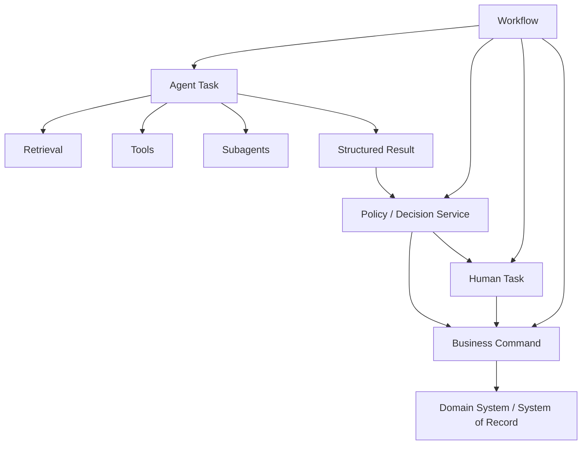
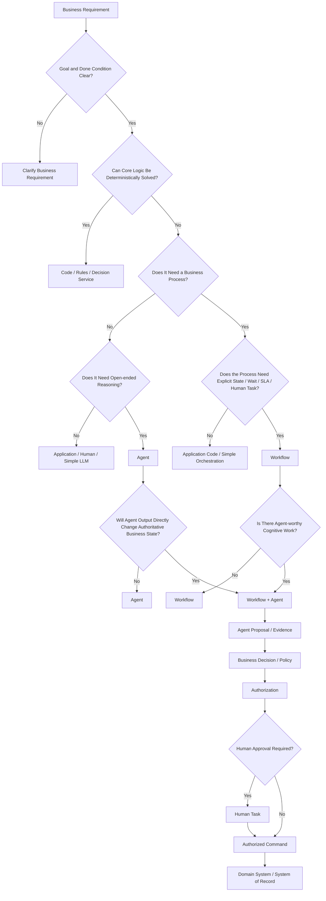
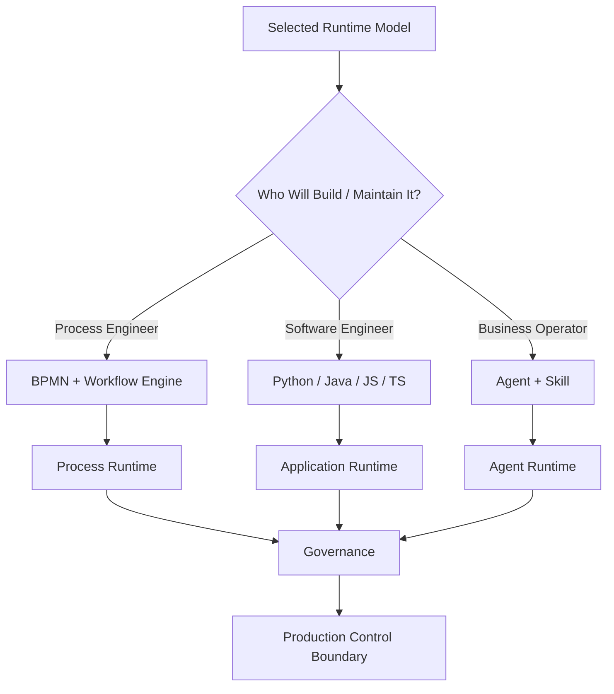

# Workflow 与 AI Agent 如何分工：金融服务场景下的架构选型、实现方式与决策树

在企业 AI 项目中，一个经常出现的问题是：

> 这个业务到底应该做成 Workflow，还是做成 AI Agent？

这个问题本身就有一点偏差。

真实企业系统里，Workflow 和 AI Agent 并不是两个互相竞争的替代品。它们解决的是不同层次的问题：

* Workflow 解决业务过程、业务状态和过程控制。
* Decision Service / Rules 解决确定性的业务判断。
* AI Agent 解决开放式、运行时的认知任务。
* Human 处理必须由组织成员承担的判断和授权。
* Domain System / Business Command 负责最终业务事实和业务副作用。

更进一步，**“选择什么架构”与“如何实现这个架构”也是两件不同的事情**。

同一个业务流程，可以由：

```text
流程工程师
    → BPMN + Workflow Engine

软件工程师
    → Python / Java / JavaScript / TypeScript 等普通业务代码

业务操作者
    → AI Agent + Skill
```

实现。

因此，企业真正需要回答的不是：

> Workflow 还是 Agent？

而是：

> **这个业务需要什么样的运行模型？由谁实现？采用什么实现方式？哪些控制必须由系统强制保证？**

这也是金融服务领域尤其重要的问题，因为金融系统除了任务完成，还必须考虑状态正确性、授权、审计、恢复、对账、职责分离和运营韧性。

---

# 1. Workflow 和 AI Agent 不是对立关系

最容易产生误解的方式是：

```text
Workflow
    vs
Agent
```

好像一个业务只能选择其中一个。

实际上真实系统更常见的是：

```text
Workflow
   ↓
Agent Task
   ↓
Evidence / Proposal
   ↓
Policy / Decision
   ↓
Human Approval
   ↓
Business Command
   ↓
Domain System
```

或者：

```text
Application
   ↓
Agent
   ↓
Structured Result
   ↓
Workflow
```

甚至：

```text
User
   ↓
Agent
   ↓
Skill
   ↓
Workflow
```

所以更准确的关系是：

```text
Workflow = Process Control

Agent = Runtime Reasoning

Policy = Business Rule / Decision

Human = Judgment / Approval

Command = Authorized Business Action
```

Google Cloud 当前的 Agent Architecture 指南也没有把这些能力设计成简单的二选一，而是同时讨论 deterministic workflows、custom logic、dynamic orchestration、human-in-the-loop 等不同模式。对于结构化、可预定义的任务，Google 明确建议优先考虑非 agentic 或确定性的实现；只有需要开放式问题处理、运行时规划和动态工具选择时，Agent 才具有明显价值。

---

# 2. 先把五种能力分开

## 2.1 Code / Rules / Decision Service

负责：

```text
已知规则
+
确定性输入
+
确定性计算
=
确定性结果
```

例如：

```text
amount > 1M
    → Director Approval

amount <= 1M
    → Straight Through
```

或者：

```text
customer.country == "US"
AND
customer.riskLevel == "LOW"
    → Eligible
```

适合：

```text
Code
Rules Engine
DMN
Decision Service
SQL
Optimization Solver
```

不应该因为“AI-native”而引入 Agent。

需要注意的是：

> **规则与 Workflow 并不互斥。**

Workflow 可以调用 Rules / Decision Service：

```text
Workflow
   ↓
Decision Service
   ↓
Transition
```

Capital One 的支票处理就是典型例子：处理逻辑高度确定，但仍然需要大规模并发 Workflow、异常处理以及人工 review。AWS 的公开案例显示，该方案使用 Step Functions Distributed Map，将并发 workflow 大幅提升，并使整体处理时间降低约 75%–80%。

---

# 3. Workflow 到底解决什么问题

Workflow 解决的不是：

> “能不能调用 API？”

普通业务代码同样能够调用 API。

Workflow 更重要的是把业务过程显式建模为一个可持续运行的执行对象：

```text
业务过程是什么？
当前处于什么状态？
下一步允许发生什么？
什么时候等待？
等待谁？
什么时候超时？
谁来处理？
谁可以审批？
失败以后走哪里？
是否需要补偿？
如何重新执行？
如何观察当前 Case？
```

可以抽象成：

```text
Business State
      ↓
Allowed Transition
      ↓
Next Business State
```

典型金融流程：

```text
Trade Request
      ↓
Risk Review
      ↓
Approval
      ↓
Execution
      ↓
Settlement
      ↓
Reconciliation
```

这里真正重要的是：

```text
State
Wait
Timer
Human Task
SLA
Escalation
Retry
Compensation
Correlation
Audit
Recovery
```

因此：

> **Workflow 是一种业务过程控制模型。**

它不要求每一个节点都确定性。

Workflow 中完全可以存在：

```text
Human Decision
External Event
Dynamic Branch
Agent Task
Decision Service
```

所以：

```text
Workflow ≠ BPMN only
Workflow ≠ deterministic code only
```

BPMN 只是表达 Workflow 的一种方式。

---

# 4. AI Agent 到底解决什么问题

Agent 解决的是另外一种问题：

```text
目标已知
+
信息不完整
+
解决路径不能完全预先写死
```

典型循环：

```text
Goal
 ↓
Observe
 ↓
Reason
 ↓
Choose Action
 ↓
Tool
 ↓
Observe Result
 ↓
Replan
```

例如：

> 调查这个客户最近为什么出现风险变化。

系统事先很难完全决定：

```text
先查什么？
第二步查什么？
需要读取哪些报告？
发现异常以后还应该查什么？
哪些信息已经足够？
是否需要查询其他系统？
是否需要进一步调查？
```

这类问题更适合 Agent。

典型任务：

```text
Research
Investigation
Document Analysis
Root Cause Analysis
Cross-document Comparison
Knowledge Search
Exception Investigation
```

Deutsche Bank 的 DB Lumina 就属于这一类。其公开案例描述了分析师需要综合财务报表、监管文件、行业报告、历史研究和其他信息，DB Lumina 被用于文档处理、检索、问答、分析和研究辅助。

---

# 5. “不知道下一步”不等于“应该用 Agent”

这是架构决策中非常重要的一点。

如果系统不知道下一步，首先应该问：

> 为什么不知道？

可能有至少五种情况。

### 情况 A：业务规则还没有定义清楚

应该：

```text
Business Analysis
```

不是 Agent。

### 情况 B：规则明确，只是规则数量很多

应该：

```text
Rules Engine
DMN
Decision Service
```

不是 Agent。

### 情况 C：需要数学计算或优化

例如：

```text
Portfolio Allocation
Resource Allocation
Pricing Optimization
```

应该考虑：

```text
Optimization Solver
```

而不是让 LLM 自己“猜”。

### 情况 D：组织要求由人判断

应该：

```text
Human Task
```

而不是 Agent。

### 情况 E：需要理解非结构化资料、探索信息、动态规划调查路径

这才真正接近：

```text
Agent
```

因此：

```text
Path Unknown
      ↓
Why?
 ┌────┼────────┬────────────┬──────────┐
 ↓    ↓        ↓            ↓
Rule Human   Solver    Open-ended Cognition
 ↓    ↓        ↓            ↓
Rule Human   Solver        Agent
```

否则很容易变成：

> 凡是规则写不完的地方都塞给 Agent。

这会把本来应该进入业务分析、Decision Service、优化算法或人工流程的问题错误地 Agent 化。

---

# 6. Workflow 和 Agent 的真正分界

“业务复杂度”不是一个好的判断标准。

例如：

```text
A：
一个有 80 个节点、12 个审批节点、10 个系统的 KYC Workflow

B：
一个需要阅读 300 份报告并调查某公司风险变化的研究任务
```

两者都可能非常复杂。

但：

```text
A
复杂
+
路径相对明确
```

而：

```text
B
复杂
+
路径取决于运行时发现的信息
```

所以：

```text
Complex ≠ Agent
```

真正重要的是：

> **业务过程的控制空间是否需要显式定义，以及其中有多少工作必须留到运行时推理。**

可以把它理解成：

```text
Workflow
= Allowed Process Space

Agent
= Runtime Exploration Inside That Space
```

例如：

```text
Workflow
 ├── Allowed States
 ├── Allowed Transitions
 ├── Human Tasks
 ├── Policy Gates
 └── Commands

Agent
 ├── Search
 ├── Retrieval
 ├── Tool Selection
 ├── Investigation
 ├── Planning
 └── Replanning
```

这样就不会把两者理解成竞争关系。

---

# 7. Agent 不应该天然拥有 Business State

对于金融服务，这是一个重要边界。

不推荐：

```text
Agent
 ↓
decide()
 ↓
nextNode = "executeTrade"
 ↓
Workflow
 ↓
executeTrade
```

这种结构的问题是：

```text
Business State
```

实际上已经由：

```text
LLM
```

决定。

更合理：

```text
Agent
 ↓
Proposal / Evidence
 ↓
Allowed Transition Validation
 ↓
Workflow
 ↓
Policy / Authorization
 ↓
Command
```

也就是说：

> **Agent 可以提出下一步，但不能因为提出了下一步，就自动获得执行该步骤的业务权力。**

---

# 8. Agent 的输出也必须区分 Proposal 和 Business Decision

例如：

```text
“这个客户看起来存在较高风险。”
```

属于：

```text
Recommendation
```

或者：

```text
“建议调查该账户。”
```

属于：

```text
Proposal
```

但：

```text
冻结账户
执行交易
改变客户状态
转移资金
批准贷款
提交监管报告
```

已经是：

```text
Authoritative Business Side Effect
```

所以金融系统中更合理的路径是：

```text
Agent
 ↓
Evidence
 ↓
Proposal
 ↓
Business Decision / Policy
 ↓
Authorization
 ↓
Human Approval（必要时）
 ↓
Command
 ↓
Domain System
```

这里要注意：

```text
Business Decision
≠
Authorization
```

例如：

```text
Eligibility:
客户是否满足贷款政策？

Authorization:
当前用户/服务/Agent 是否被允许执行 approve-loan？
```

这是两个不同的问题。

---

# 9. Workflow 也不等于“完全确定性”

Workflow 可以包含：

```text
Deterministic Task
Human Task
Event
Timer
Decision Service
Agent
Dynamic Branch
```

因此：

```text
Workflow
=
Process Control
```

而不是：

```text
Workflow
=
Every Step Predetermined
```

Google Cloud 的官方设计指南同样同时讨论 predefined workflow、custom logic、human-in-the-loop、dynamic orchestration 和 ReAct 等模式。换句话说，Workflow 与 Agentic behavior 可以出现在同一个应用中。

---

# 10. Durable Execution 也不是 Workflow 与 Agent 的分界线

不能简单写成：

```text
Long-running
→ Workflow

Short-running
→ Agent
```

今天的 Agent Runtime 自己也可以做 durable pause/resume。

OpenAI Agents SDK 当前已经提供可序列化的 `RunState`，用于暂停、恢复以及 Human-in-the-loop；同时也提供与 Dapr、Temporal、Restate 等 durable execution 系统的集成。

因此：

```text
Durability
≠
Business Process Ownership
```

一个 Agent Run 完全可以持续几天：

```text
Agent Investigation
```

但业务 Case 仍然可以由 Workflow 控制：

```text
Case Created
 ↓
Agent Investigation
 ↓
Human Review
 ↓
Policy Decision
 ↓
Execute
```

所以真正的问题不是：

> Agent 能不能持久化？

而是：

> **谁拥有企业业务过程的正式状态和合法状态迁移？**

---

# 11. 真正需要增加的一层：架构选择和实现方式是两件事

这是企业落地时经常被忽略的部分。

前面的讨论解决：

```text
What should the system do?
```

接下来还有：

```text
How should the system be built?
Who should build it?
```

对于同一个业务需求，至少存在三种现实的实现方式：

```text
A. 流程工程师
   BPMN + Workflow Engine

B. 软件工程师
   Python / Java / JS / TS + Application Code

C. 业务操作者
   AI Agent + Skill
```

它们不是“同一技术的三种写法”。

它们实际上代表三种不同的工程组织模式。

---

# 12. 实现方式一：流程工程师 + BPMN + Workflow Engine

典型：

```text
Process Engineer
       ↓
BPMN / DMN
       ↓
Workflow Engine
       ↓
Runtime
```

例如：

```text
Camunda
Fluxnova
```

这类方式最大的价值是：

> **把业务过程本身变成一个显式、可观察、可治理的工程资产。**

例如：

```text
Process Definition
Human Task
Timer
Message
Event
SLA
Escalation
Retry
Compensation
```

对于：

```text
KYC
Account Opening
Payment
Settlement
Claims
Approval
Regulatory Process
```

尤其有价值。

Jyske Bank 的 KYC 就非常典型：流程包含长期运行、客户响应等待、deadline、用户任务、升级和周期性重新 KYC。该银行使用 Camunda 做过程编排，并把这些业务过程显式建模。

---

# 13. BPMN + Workflow Engine 的优势并不是“比代码简单”

这是一个非常容易产生误解的地方。

采用 BPMN / Workflow Engine 实际上会引入新的工程能力：

```text
BPMN
DMN
Process State
Event
Message
Timer
Correlation
Retry
Incident
Versioning
Migration
Runtime Operations
```

因此它带来的不仅是软件组件，还包括：

```text
新的技术栈
新的开发方式
新的角色
新的运行方式
新的培训成本
新的治理方式
```

也就是说：

> **Workflow Engine 不是“零代码捷径”，而是一套新的工程方法。**

流程工程师需要理解：

```text
BPMN semantics
Workflow state
Task lifecycle
Event correlation
Error handling
Human task
Versioning
```

开发人员仍然需要理解：

```text
API
Identity
Authorization
Data Mapping
Integration
Observability
Deployment
Testing
```

所以采用 BPMN Workflow 的真实成本应该写成：

```text
Platform Cost
+
Training Cost
+
Process Modeling Cost
+
Integration Cost
+
Runtime Operation Cost
+
Governance Cost
```

而不能只比较：

```text
写 BPMN 需要多久？
```

---

# 14. 实现方式二：软件工程师 + Python / Java / JavaScript / TypeScript

另一种方式是：

```text
Business Process
      ↓
Application Code
```

例如：

```python
if status == "PENDING":
    ...
```

或者：

```typescript
switch (case.status) {
  case "REVIEW":
    ...
}
```

也可以自己实现：

```text
State Transition
Retry
Timeout
Wait
Event Handling
Persistence
```

这种方式的优势非常现实：

```text
不用额外引入 BPMN
不用培养 Process Engineer
可以直接使用 Git / CI / IDE / Test Framework
可以直接复用现有业务代码
可以进入现有 Application Architecture
```

Microsoft Durable Task 就是一种非常典型的 code-first 路线：Workflow 可以完全由 procedural code 定义，同时提供 checkpoint、recovery 和 long-running orchestration。

因此：

> **Workflow 并不要求 BPMN。**

可以有：

```text
BPMN-first Workflow
```

也可以有：

```text
Code-first Workflow
```

---

# 15. 但 Code-first Workflow 不等于没有 Workflow 成本

如果自己在普通业务代码中实现：

```text
wait
retry
timeout
human approval
state persistence
correlation
recovery
migration
```

那么这些复杂度不会消失。

它们只是从：

```text
Workflow Engine
```

转移到了：

```text
Application Code
+
Database
+
Infrastructure
+
Operations
```

因此：

```text
BPMN
```

和：

```text
Python / JS
```

不是：

```text
复杂
vs
简单
```

而更接近：

```text
显式 Process Engineering
vs
传统 Software Engineering
```

选择哪个，取决于组织现有能力和业务需要。

---

# 16. 实现方式三：业务操作者 + AI Agent + Skill

AI 带来了第三种完全不同的开发方式：

```text
Business Operator
       ↓
Agent
       ↓
Skill
       ↓
Tools / Retrieval / Data
```

例如：

```text
“调查这个客户的异常交易。”

Agent
 ├── 查交易
 ├── 查客户资料
 ├── 查内部政策
 ├── 找相关账户
 ├── 阅读历史案例
 └── 形成调查结论
```

这里的特点不是：

> “业务人员不需要开发。”

而是：

> **业务人员可以直接参与定义和使用部分认知能力。**

最适合：

```text
Research
Investigation
Document Analysis
Knowledge Search
Exception Investigation
Drafting
Case Preparation
Ad Hoc Analysis
```

Deutsche Bank 的 DB Lumina 就属于这类知识工作：研究人员面对大量金融文件与资料，系统帮助进行文档处理、检索、问答和分析。

Mr. Cooper 的 CIERA 则是另一个例子：其 Agent workforce 被设计为支持人工客服，把重复和复杂的信息处理交给 Agent，让人工更多关注 judgment、empathy 和 customer interaction。

---

# 17. Agent + Skill 也不是“免费开发”

这种模式减少的是某些传统开发成本，但会增加另一类成本：

```text
Skill Design
Tool Design
Prompt / Instruction
Evaluation
Permission
Data Access
Observability
Behavior Drift
Versioning
Governance
```

传统开发：

```text
Business Requirement
 ↓
Business Analysis
 ↓
Developer
 ↓
Code
 ↓
Test
 ↓
Deploy
```

Agent + Skill：

```text
Business Problem
 ↓
Skill
 ↓
Tools
 ↓
Data / Permission
 ↓
Agent
 ↓
Evaluation
 ↓
Governance
 ↓
Runtime
```

因此：

> **Agent 降低的是某些“把知识工作写成程序”的成本，而不是消除工程成本。**

尤其是在金融领域，业务操作者可以创建 Skill，并不意味着可以直接拥有：

```text
Production Authorization
Data Entitlement
High-risk Tool Access
Regulatory Override
```

这些能力仍然应该由平台和企业控制。

---

# 18. 三种实现方式的完整比较

| 实现方式                    | 主要角色                | 核心产物                             | 优势                            | 主要新增成本                                    | 更适合                                     |
| ----------------------- | ------------------- | -------------------------------- | ----------------------------- | ----------------------------------------- | --------------------------------------- |
| BPMN + Workflow Engine  | 流程工程师 + 开发人员        | BPMN / DMN + Process Application | 过程显式、Human Task、SLA、状态、治理、可视化 | 学习 Workflow 建模、引入新 Runtime、流程治理           | KYC、审批、Settlement、跨团队 Case              |
| Python / Java / JS / TS | 软件工程师               | Application Code / State         | 使用已有开发能力、易融入现有系统              | 状态、wait、retry、recovery、migration 可能进入应用代码 | 单应用内部流程、中短流程、开发团队能力强                    |
| Agent + Skill           | 业务操作者 + Agent 平台    | Skill + Tools + Instructions     | 快速、灵活、适合开放式知识任务               | Evaluation、权限、行为漂移、Skill 生命周期、运行成本        | Research、Investigation、Document Work    |
| Workflow + Agent        | 流程工程师/开发 + Agent 平台 | Workflow + Agent Skill           | 把业务过程控制与认知工作结合起来              | 两套能力边界、集成和治理                              | 金融复杂 Case、Exception、Fraud、Credit Review |

---

# 19. 因此，真正的架构决策应该分成两层

## 第一层：选择运行模型

```text
确定性计算
    → Code / Rules / Decision Service

确定性业务过程
    → Workflow

开放式认知任务
    → Agent

两者同时存在
    → Hybrid
```

## 第二层：选择实现方式

```text
Process Engineer
    → BPMN + Workflow Engine

Software Engineer
    → Python / Java / JS / TS

Business Operator
    → Agent + Skill
```

不要把：

```text
Camunda
```

直接和：

```text
DeepAgents
```

放在同一层比较。

它们解决的是不同问题。

更合理的比较方式是：

```text
业务运行模型
      ↓
Workflow / Agent / Hybrid
      ↓
如何实现
      ↓
BPMN Engine / Code / Agent Skill
```

---

# 20. 金融场景中，什么时候更适合 BPMN Workflow

典型特征：

```text
过程稳定
状态重要
等待重要
多人协作
角色明确
SLA 明确
审批重要
失败恢复重要
业务 Case 需要长期存在
```

例如：

```text
KYC
Account Opening
Payment
Settlement
Claims
Trade Approval
Regulatory Process
```

### KYC

```text
Application
 ↓
Identity
 ↓
Sanctions
 ↓
Risk
 ↓
Document
 ↓
Review
 ↓
Approval
 ↓
Open Account
```

这里：

```text
Role
Deadline
Escalation
Human Task
Audit
```

都非常重要。

Jyske Bank 的公开案例正是这种模型。

---

# 21. Payment / Settlement

例如：

```text
Receive
 ↓
Validate
 ↓
Risk
 ↓
Authorize
 ↓
Submit
 ↓
Wait
 ↓
Confirm
 ↓
Reconcile
```

这里真正重要的是：

```text
Retry
Timeout
Idempotency
Authorization
Reconciliation
```

而不是：

```text
“让 Agent 自己想下一步。”
```

---

# 22. High-volume Processing

例如：

```text
10,000 transactions
```

可能需要：

```text
Parallelism
Fan-out
Fan-in
Retry
Exception
Manual Review
```

完全不需要 Agent。

Capital One 的 check clearing 就证明了这一点：它通过 Step Functions Distributed Map 大规模并行处理，同时识别需要人工 review 的支票。

因此：

> **复杂、高并发、多分支，不等于 Agent。**

---

# 23. 金融场景中，什么时候更适合 Agent

典型特征：

```text
目标明确
但解决路径开放
```

例如：

```text
“调查这个客户最近为什么出现风险变化。”

“比较这家公司最近三年的监管披露。”

“分析这几份研究报告为什么给出不同结论。”

“找出这起 Fraud Case 最值得调查的关联账户。”

“帮分析师准备 earnings review。”
```

这类任务不是：

```text
A → B → C → D
```

而更接近：

```text
Goal
 ↓
Explore
 ↓
Retrieve
 ↓
Reason
 ↓
Investigate
 ↓
Replan
 ↓
Synthesize
```

DB Lumina 就是典型金融研究场景。

---

# 24. Fraud Investigation 是最典型的 Hybrid

Fraud Investigation 同时包含：

```text
确定性业务过程
+
开放式调查
```

所以可以拆成：

```text
Fraud Case Workflow
        │
        ├── Assignment
        ├── SLA
        ├── Escalation
        ├── Human Review
        └── Close
                │
                ↓
        Investigation Agent
                │
        ├── Transaction Search
        ├── Customer Search
        ├── Relationship Search
        ├── External Research
        └── Evidence Synthesis
                │
                ↓
             Proposal
                │
                ↓
             Policy
                │
                ↓
             Human
                │
                ↓
             Command
```

OneMain Financial 的安全取证方案虽然并不是 Agent 案例，但很好地说明了金融企业可以把自动调查、workflow、长期运行和人工授权结合起来：收到告警后，Step Functions 校验账户和实例信息，再请求授权人员批准高风险 snapshot 操作，批准后才执行。

---

# 25. Credit Approval 也不是 Workflow 或 Agent 二选一

可以拆成：

```text
Workflow
 ├── Application
 ├── KYC
 ├── Data Collection
 ├── Approval
 └── Disbursement

Decision Service
 ├── Eligibility
 ├── Limits
 └── Policy

Agent
 ├── Document Interpretation
 ├── Income Explanation
 ├── Missing Information
 └── Underwriter Summary

Human
 └── Exception / Approval
```

因此：

```text
Workflow
+
Decision Service
+
Agent
+
Human
```

完全可以成为一个完整系统。

---

# 26. Workflow + Agent 是非常自然的企业架构

可以抽象成：



职责分别是：

### Workflow

```text
State
Process
Wait
SLA
Human Task
Escalation
Retry
Compensation
Reconciliation
```

### Agent

```text
Understand
Retrieve
Investigate
Classify
Summarize
Plan
Recommend
```

### Policy / Decision Service

```text
Business Rule
Eligibility
Threshold
Limit
SoD
Mandatory Control
```

### Authorization

```text
Who can execute?
Under which identity?
With which permission?
```

### Human

```text
Judgment
Exception
Approval
```

### Command / Domain System

```text
Authoritative Business Action
Authoritative Business State
```

---

# 27. 一个非常重要的趋势：Workflow Engine 本身也在 Agent 化

因此今天不能再认为：

```text
Camunda = old deterministic world

Agent Framework = new AI world
```

现实正在快速变化。

Camunda 当前已经把 Agent 作为 BPMN process 中的一等参与者，把 Agent 建模为 ad-hoc subprocess，并把工具调用、Human-in-the-loop 和 guardrail 作为结构化过程的一部分。

这说明：

> **Workflow Engine 与 Agent Runtime 正在融合，而不是简单互相取代。**

FINOS Fluxnova 也代表了类似方向，其目标本身就是面向 enterprise workflow / business process orchestration，并逐步增加 Agentic 能力。

所以未来很可能不是：

```text
Workflow
    →
Agent
```

而是：

```text
Workflow
    +
Agent
    +
Policy
    +
Human
```

越来越紧密地组合。

---

# 28. 但产品能力融合，不代表架构职责必须融合

这是两个不同的问题。

产品可以融合：

```text
Workflow Engine
   + Agent Runtime
```

但企业架构仍然应该区分：

```text
Process State
Agent State
Business State
Policy
Authorization
Human Approval
```

特别是：

```text
Agent Memory
```

不应该成为：

```text
Business State
```

例如：

```text
Agent Memory:
“我已经调查过 A。”
```

和：

```text
Business State:
“该 Fraud Case 当前处于 Compliance Review。”
```

不是一回事。

前者可以由 Agent Runtime 管理。

后者应该由业务系统 / Workflow 管理。

---

# 29. 另外一个重要指标：变化来自哪里

可以问：

> **这个系统主要是因为业务规则变化，还是因为问题本身变化？**

如果变化来自业务规则：

```text
2027:
Approval Threshold
1M → 2M
```

倾向：

```text
Policy
Decision Service
Workflow Version
```

如果变化来自问题本身：

```text
客户问题不同
研究主题不同
异常模式不同
调查方向不同
```

倾向：

```text
Agent
```

如果两者都存在：

```text
Workflow
+
Policy
+
Agent
```

---

# 30. 另一个非常现实的问题：谁应该维护它

这实际上是企业选择技术时经常比“技术性能”更重要的问题。

## BPMN Workflow

通常由：

```text
Process Engineer
Business Analyst
Developer
```

共同维护。

优势是：

```text
流程本身可视化
```

但组织需要建立：

```text
Process Modeling Capability
```

## Application Code

通常：

```text
Software Engineer
```

负责。

优势：

```text
进入成熟的软件工程体系
```

但业务流程知识可能隐藏在代码里。

## Agent + Skill

可能由：

```text
Business Operator
Domain Expert
Agent Platform Team
```

共同维护。

优势：

```text
知识与能力更接近业务人员
```

但必须新增：

```text
Evaluation
Permission
Governance
Skill Lifecycle
Runtime Observability
```

所以不能只比较：

```text
Developer Productivity
```

而应该比较：

```text
Total Delivery Model
```

---

# 31. 实施成本应该怎么比较

对于企业尤其是金融企业，至少应该考虑：

```text
Initial Development Cost
+
Learning Cost
+
Platform Cost
+
Integration Cost
+
Testing Cost
+
Operational Cost
+
Governance Cost
+
Change Cost
```

不同实现方式只是成本结构不同。

### BPMN

更多成本在：

```text
Process Modeling
Training
Engine
Runtime
Process Governance
```

### 普通代码

更多成本在：

```text
Developer Time
State Management
Recovery
Operational Tooling
```

### Agent + Skill

更多成本在：

```text
Skill Design
Evaluation
Prompt / Model Changes
Runtime Governance
Permission
Behavior Drift
Model Cost
```

因此：

> **没有“天然最便宜”的实现方式。**

应该比较的是整个生命周期。

---

# 32. 最容易犯的几个错误

## 反模式 1：流程复杂，所以使用 Agent

错误：

```text
80 nodes
→ Agent
```

正确：

```text
复杂
≠
开放式认知
```

复杂但稳定的业务流程依然应该 Workflow。

---

## 反模式 2：规则太多，所以使用 Agent

错误：

```text
1000 rules
→ LLM
```

正确：

```text
Rules Engine
Decision Service
DMN
```

优先解决规则管理问题。

---

## 反模式 3：Workflow 很难，所以让 Agent 代替 Workflow

错误：

```text
Agent
 ↓
自己决定 Case State
```

这样实际上是：

```text
LLM
=
Business Process Engine
```

金融场景尤其危险。

---

## 反模式 4：所有知识工作都硬编码成 BPMN

例如：

```text
Search Bloomberg
 ↓
Read SEC
 ↓
Search Reuters
 ↓
Read PDF
 ↓
Compare
 ↓
Search again
 ↓
Search something else
```

最终 BPMN 里面出现：

```text
if missing
if conflict
if new topic
if unexpected
if source contradicts
```

这说明：

```text
开放式认知任务
```

已经被错误地硬编码成 Workflow。

应该考虑：

```text
Workflow
 ↓
Research Agent
```

---

## 反模式 5：认为 Agent + Skill 就不需要工程团队

实际上仍然需要：

```text
Platform
Tools
Permissions
Data Access
Evaluation
Observability
Governance
```

只是：

```text
谁写代码
```

这件事发生了变化。

---

## 反模式 6：把 Authorization 写进 Prompt

例如：

```text
“执行付款之前必须先获得 CFO 批准。”
```

这只是一条 instruction。

真正需要的是：

```text
Workflow / Policy / Authorization
```

形成结构化控制。

Camunda 当前对这一点的产品设计也是如此：其公开架构把审批、合规检查和 escalation 建模为结构化过程，而不是单纯依赖 prompt。这里属于厂商产品观点，但很好地说明了行业正在采用的方向。

---

# 33. 最终 Decision Tree

真正用于 Architecture Review 的 Decision Tree 可以压缩成下面这一版：



---

# 34. 第二棵树：选择怎么实现

完成上面的架构判断之后，再问：



这棵树不能替代第一棵树。

两棵树必须分开。

---

# 35. 一个更加现实的企业架构模型

综合起来：

```text
                         Business Requirement
                                  │
                                  ▼
                    ┌──────────────────────────┐
                    │   Runtime Work Model      │
                    └────────────┬─────────────┘
                                 │
              ┌──────────────────┼──────────────────┐
              ▼                  ▼                  ▼
       Deterministic        Business            Open-ended
           Logic             Process              Cognition
              │                  │                  │
              ▼                  ▼                  ▼
        Code / Rules         Workflow              Agent
              │                  │                  │
              └──────────────────┼──────────────────┘
                                 ▼
                              Hybrid
                                 │
                 ┌───────────────┼───────────────┐
                 ▼               ▼               ▼
           BPMN + Engine   Python / JS/TS   Agent + Skill
                 │               │               │
                 └───────────────┼───────────────┘
                                 ▼
                           Control Boundary
                                 │
        ┌────────────────────────┼────────────────────────┐
        ▼                        ▼                        ▼
      Policy               Authorization               Human
        │                        │                        │
        └────────────────────────┼────────────────────────┘
                                 ▼
                              Command
                                 │
                                 ▼
                          Domain System / SOR
```

---

# 36. 谁控制什么

最终可以把企业 Agent 系统压缩成五个职责：

```text
Workflow
= 业务过程与状态

Policy / Decision
= 确定性业务判断

Agent
= 运行时认知与探索

Human
= 必须由人承担的判断和授权

Command / Domain System
= 最终业务事实与业务副作用
```

进一步拆分：

```text
Workflow
    → What process is allowed?

Agent
    → How should we investigate / reason?

Policy
    → What business rule applies?

Authorization
    → Who is allowed to execute?

Human
    → Which judgment must remain human?

Command
    → What action is actually executed?

Domain System
    → What is the authoritative business fact?
```

---

# 37. 金融 Agent 最值得采用的默认结构

对于金融服务，比较稳健的默认结构是：

```text
                    Workflow
                       │
          ┌────────────┼────────────┐
          ▼            ▼            ▼
       Policy        Agent        Human
          │            │            │
          │       ┌────┼────┐       │
          │       ▼    ▼    ▼       │
          │    Search Tool RAG      │
          │                         │
          └────────────┬────────────┘
                       ▼
                Decision / Proposal
                       │
                       ▼
                 Authorization
                       │
                       ▼
                    Command
                       │
                       ▼
                Domain System / SOR
```

这里 Agent 的自由度并不是没有边界。

它的正确定位应该是：

> **在允许的业务空间中执行开放式认知工作。**

而不是：

> **自己定义什么业务动作是允许的。**

---

# 38. 为什么这个模型特别适合金融服务

普通 Agent 产品经常优化：

```text
Answer Quality
Task Completion
User Experience
Latency
```

金融系统还必须考虑：

```text
Business State Correctness
Authorization
Data Entitlement
Policy Compliance
Evidence
Audit
Recoverability
Reconciliation
Operational Resilience
```

因此金融 Agent 更合理的架构是：

```text
Deterministic Control
+
Probabilistic Intelligence
```

而不是：

```text
LLM
+
Tools
=
Entire Business Application
```

FSB 对金融业 AI 风险的监测也持续关注第三方依赖、数据、网络风险、模型风险和治理等问题；这些要求并不会因为 Agent 更智能而消失。

---

# 39. 一个重要现实：Agent 系统本身也不应该无限增加 Agent

多 Agent 并不是天然更先进。

Google Research 在 2026 年对 180 种 Agent 配置进行受控评估，发现多 Agent 在适合并行的任务上可以明显提升效果，但在强顺序依赖任务上可能反而降低效果。这说明 Agent 数量应该由任务结构决定，而不是越多越好。

因此：

```text
Complex Task
```

不等于：

```text
More Agents
```

同样：

```text
Complex Business Process
```

也不等于：

```text
More Workflow Nodes
```

架构设计首先应该理解任务性质。

---

# 40. 最终的架构判断框架

可以把整篇文章压缩成三个问题。

## 第一问：业务需要什么运行模型？

```text
确定性计算
    → Code / Rules

确定性业务过程
    → Workflow

开放式认知工作
    → Agent

二者同时存在
    → Hybrid
```

## 第二问：谁来实现？

```text
流程工程师
    → BPMN + Workflow Engine

软件工程师
    → Python / Java / JS / TS

业务操作者
    → Agent + Skill
```

## 第三问：谁拥有最终控制权？

```text
Agent
    → Reason / Search / Investigate / Propose

Workflow
    → State / Process / Wait / Human Task

Policy
    → Business Rules

Authorization
    → Execution Permission

Human
    → Required Judgment / Approval

Command / Domain System
    → Authoritative Side Effect
```

---

# 41. 最终原则

### 原则一：确定性计算 → Code / Rules / Decision Service

```text
Known Input
+
Known Rule
+
Known Calculation
=
Known Result
```

不要为了 AI 化而使用 Agent。

### 原则二：确定性业务过程 → Workflow

```text
State
Sequence
Approval
Wait
SLA
Retry
Recovery
Compensation
```

交给 Workflow。

### 原则三：开放式认知工作 → Agent

```text
Search
Retrieve
Investigate
Compare
Understand
Plan
Replan
Synthesize
```

交给 Agent。

### 原则四：开放式认知 + 高影响动作 → Hybrid

```text
Agent
 ↓
Evidence / Proposal
 ↓
Business Decision
 ↓
Authorization
 ↓
Human（必要时）
 ↓
Command
 ↓
Domain System
```

### 原则五：Workflow 和 Agent 不是二选一

```text
Workflow
    can contain Agent

Agent
    can be invoked by Workflow

Workflow
    can invoke Code / Rules / Human

Agent
    can use Tools / Skills / Subagents
```

### 原则六：Workflow Engine 不是唯一的 Workflow 实现

```text
BPMN + Engine
```

只是：

```text
Workflow Implementation Option A
```

也可以：

```text
Python / Java / JS / TS
```

实现 Workflow。

### 原则七：Agent + Skill 不是“没有工程”

它把一部分工程活动从：

```text
Software Developer
```

迁移到了：

```text
Business Operator
+
Agent Platform
+
Governance
+
Evaluation
```

### 原则八：复杂度不是 Agent 的充分条件

```text
Complex
≠
Agent
```

真正值得问的是：

```text
为什么路径无法提前确定？
```

### 原则九：Durability 不是 Workflow 的专属能力

```text
Durable Agent
```

完全可以存在。

关键是：

```text
谁拥有 Business Process State？
```

### 原则十：Agent 可以思考，但不应该因为会思考而自动获得业务权力

最终边界仍然应该是：

```text
                 Workflow
                    │
          ┌─────────┼─────────┐
          ▼         ▼         ▼
       Policy     Agent     Human
          │         │         │
          └─────────┼─────────┘
                    ▼
                Authorization
                    │
                    ▼
                 Command
                    │
                    ▼
              Domain System
```

---

# 42. 最终结论

真正需要解决的问题从来不是：

```text
Workflow OR Agent
```

而是：

```text
业务到底是什么类型的工作？
        ↓
需要什么运行模型？
        ↓
谁来实现？
        ↓
使用 BPMN、普通代码还是 Agent + Skill？
        ↓
谁拥有 Business State？
        ↓
谁拥有 Authorization？
        ↓
哪些事情必须由 Human 决定？
        ↓
谁最终执行 Business Command？
```

在金融服务领域，一个更准确的默认架构是：

```text
确定性的部分
    → Code / Rules / Decision Service

稳定的业务过程
    → Workflow

开放式的认知任务
    → Agent

必须由人承担的判断
    → Human

高风险业务动作
    → Policy + Authorization + Command

最终业务事实
    → Domain System / System of Record
```

而在实施层面：

```text
流程工程师
    → BPMN + Workflow Engine

软件工程师
    → Python / Java / JS / TS

业务操作者
    → Agent + Skill
```

三种方式不是谁取代谁，而是三种不同的生产方式，各自适合不同的业务形态、组织能力和生命周期成本。

因此，金融企业真正应该建设的不是：

```text
Workflow Platform
vs
Agent Platform
```

而是：

```text
                  Business Process
                         │
          ┌──────────────┼──────────────┐
          ▼              ▼              ▼
       Workflow        Policy         Agent
          │              │              │
          │              │       ┌──────┼──────┐
          │              │       ▼      ▼      ▼
          │              │    Search   Tool   Skill
          │              │       │
          └──────────────┼───────┘
                         ▼
                Decision / Proposal
                         │
                         ▼
                    Authorization
                         │
                         ▼
                       Human
                         │
                         ▼
                      Command
                         │
                         ▼
                  Domain System
```

一句话总结：

> **把业务过程和业务控制显式建模，把确定性的事情交给 Code / Rules / Workflow，把开放式认知交给 Agent，把最终授权与业务事实留在 Policy、Authorization、Human 和 Domain System；至于采用 BPMN、普通代码还是 Agent + Skill，则应该根据实施角色、团队能力和完整生命周期成本单独决定。**

---

# 参考资料

1. **Google Cloud — Choose a design pattern for your agentic AI system**
   讨论 deterministic workflow、custom logic、dynamic orchestration、human-in-the-loop 等模式，以及如何根据 workload characteristics 进行选型。
   [Google Cloud — Choose a design pattern for your agentic AI system](https://docs.cloud.google.com/architecture/choose-design-pattern-agentic-ai-system?utm_source=chatgpt.com)

2. **Microsoft Learn — Durable orchestrations**
   说明 workflow 可以完全通过 procedural code 定义，并支持 checkpoint、recovery 和 long-running orchestration，是 code-first workflow 的重要参考。
   [Microsoft Learn — Durable orchestrations](https://learn.microsoft.com/en-us/azure/durable-task/common/durable-task-orchestrations?tabs=python&utm_source=chatgpt.com)

3. **OpenAI Agents SDK — RunState**
   说明 Agent Runtime 本身可以拥有可序列化的 durable pause/resume 状态，并支持 Human-in-the-loop。
   [OpenAI Agents SDK — RunState](https://openai.github.io/openai-agents-python/ref/run_state/?utm_source=chatgpt.com)

4. **OpenAI Agents SDK — Running agents**
   说明 Agent Runtime 可以与 Dapr、Temporal、Restate 等 durable execution 系统结合。
   [OpenAI Agents SDK — Running agents](https://openai.github.io/openai-agents-python/running_agents/?utm_source=chatgpt.com)

5. **Google Research — Towards a science of scaling agent systems**
   对 180 种 Agent 配置进行受控评估，说明多 Agent 的收益取决于任务结构，尤其是并行性与顺序依赖。
   [Google Research — Towards a science of scaling agent systems](https://research.google/blog/towards-a-science-of-scaling-agent-systems-when-and-why-agent-systems-work/?utm_source=chatgpt.com)

6. **Camunda — AI Agent Orchestration**
   展示把 Agent 作为 BPMN process participant，并通过结构化 process、guardrail、human review、tool boundary 等方式进行 Agent orchestration。属于厂商资料，应与其他来源结合使用。
   [Camunda — AI Agent Orchestration](https://camunda.com/orchestrate/agents/?utm_source=chatgpt.com)

7. **Camunda — Jyske Bank**
   KYC、长期运行、客户响应、deadline、user task、escalation 和 recurring KYC 的真实金融案例。
   [Camunda — Jyske Bank Case Study](https://camunda.com/case-studies/jyske-bank/?utm_source=chatgpt.com)

8. **AWS — Capital One Distributed Map**
   展示金融高并发、并行处理、人工 review 可以完全由确定性 Workflow 编排。
   [AWS — Capital One Distributed Map](https://aws.amazon.com/solutions/case-studies/capital-one-distributed-map/?utm_source=chatgpt.com)

9. **AWS — OneMain Financial**
   展示安全取证中 Workflow、自动化调查和高风险操作人工授权如何结合。
   [AWS — OneMain Financial Step Functions Case Study](https://aws.amazon.com/solutions/case-studies/onemain-financial-aws-sfn-case-study/?utm_source=chatgpt.com)

10. **Google Cloud — Deutsche Bank DB Lumina**
    金融研究、文档分析、RAG、研究人员辅助和金融机构治理要求的真实案例。
    [Google Cloud — Deutsche Bank DB Lumina](https://cloud.google.com/blog/topics/financial-services/deutsche-bank-delivers-ai-powered-financial-research-with-db-lumina?utm_source=chatgpt.com)

11. **Google Cloud — Mr. Cooper CIERA**
    多 Agent 协同、Agent workforce、人类客服协作和复杂 Mortgage knowledge work 的案例。
    [Google Cloud — Mr. Cooper CIERA](https://cloud.google.com/blog/topics/financial-services/assembling-a-team-of-ai-agents-to-handle-complex-mortgage-questions-at-mr-cooper?utm_source=chatgpt.com)

12. **AWS — Nequi**
    展示多 Agent 与 deterministic flows 结合的金融服务实践。
    [AWS — Nequi Success Story](https://aws.amazon.com/solutions/case-studies/nequi-bedrock/?utm_source=chatgpt.com)

13. **FINOS — Fluxnova BPM Platform**
    面向企业业务流程编排的开源项目，可用于观察 Workflow / Agentic Orchestration 融合的发展方向。
    [FINOS — Fluxnova BPM Platform](https://github.com/finos/fluxnova-bpm-platform?utm_source=chatgpt.com)

> 注：金融机构案例中的效率、成本和处理时长等数字主要来自 AWS、Google Cloud、Camunda 或合作机构公开案例。它们适合证明“该方案已经被实际采用”和理解实现方式，不应直接视为独立第三方评估或普遍适用的收益预测。
