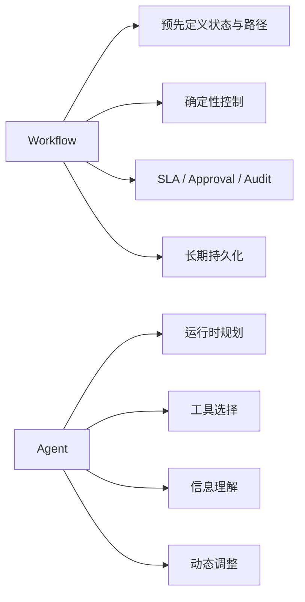
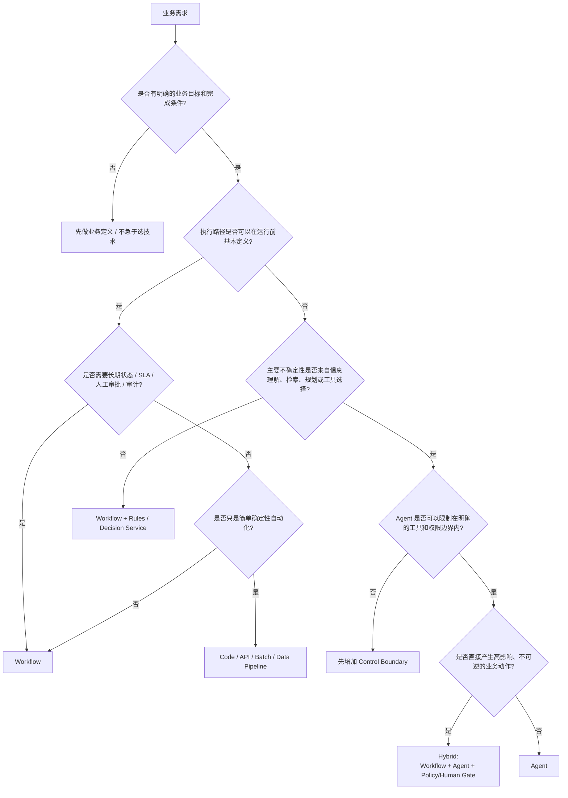
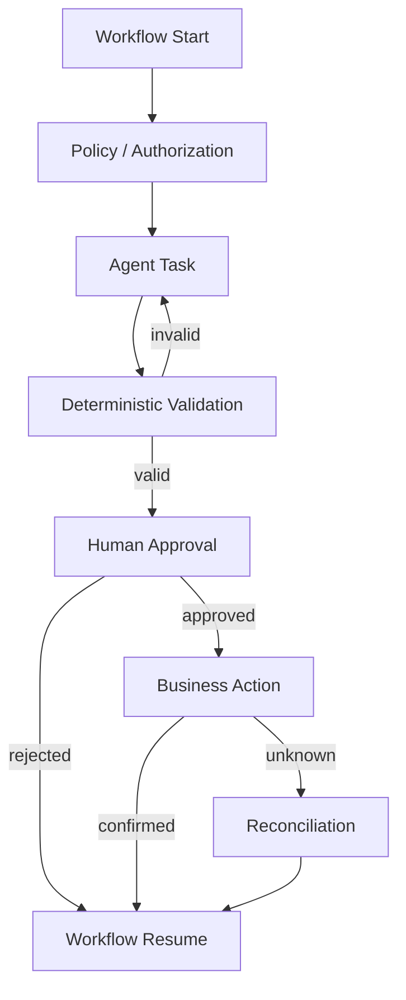
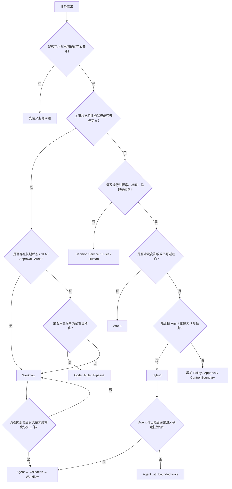
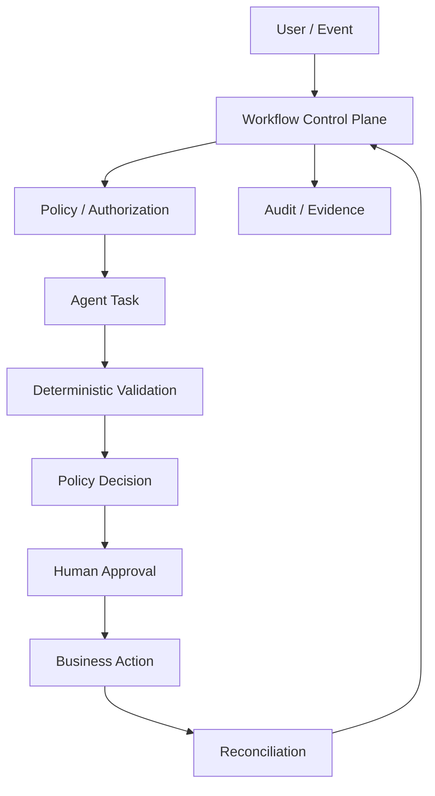
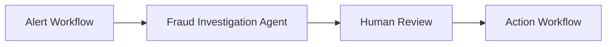
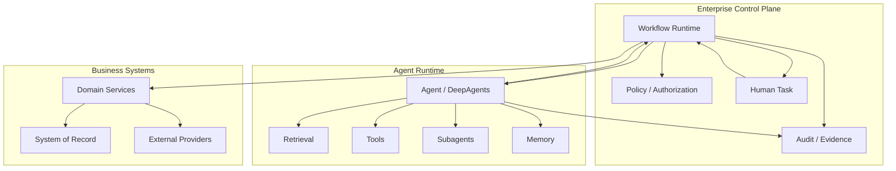

# 什么时候应该用 Workflow，什么时候应该用 AI Agent：金融服务场景下的架构选型与决策树

在企业 AI 项目里，一个越来越常见的问题是：

> 一个业务流程，到底应该做成 Workflow，还是做成 AI Agent？

这里的 Workflow，可以理解为 Camunda、你提到的 FluxNova 这一类 **Process / Workflow Orchestration Runtime**；AI Agent，则以 DeepAgents、OpenAI Agents SDK、类似 Agent Harness 为代表。

很多团队实际上是在比较两个错误的东西：

```text
Camunda vs DeepAgents
```

或者：

```text
Workflow vs Agent
```

真正应该比较的是：

> **业务流程中，究竟哪些部分应该由“预先定义的控制逻辑”决定，哪些部分应该交给“运行时推理”决定？**

这两个技术并不是天然互斥的。

Google Cloud 将 deterministic workflow 描述为：任务和路径在执行前基本已知、从开始到结束具有明确路径；而 Agent 则适用于需要运行时规划、工具选择和根据环境反馈动态调整策略的场景。Google 的架构指南甚至明确指出，对于确定性问题，完全可以不使用 agentic architecture，因为其他方法可能更高效、更经济。

IBM 对 agentic workflow 的描述也采用类似区分：传统自动化偏向预定义规则和设计模式，而 agentic workflow 的价值在于根据实时数据和意外条件动态调整。IBM 同时特别指出，纯概率式 Agent 在复杂流程中可能带来不可预测性，而 deterministic workflow 则提供固定顺序、分支、循环、状态管理和并行处理。

因此，本文最终给出的不是“Workflow 更好”或“Agent 更先进”，而是一套更实用的判断：

> **Workflow 管过程；Agent 管不确定性。**

进一步说：

> **已经知道“应该怎么做”的部分，用 Workflow。**
>
> **只知道“要达到什么目标”，但不知道运行时应该怎么做的部分，用 Agent。**
>
> **金融业务中真正重要的流程，通常采用 Hybrid：Workflow 在外层控制业务状态、权限、审批、SLA 和最终动作；Agent 在内部处理检索、理解、分析、规划等认知任务。**

---

# 1. 先把 Workflow 和 Agent 的边界说清楚

一个 Workflow 的核心是：

```text
State
  ↓
Transition
  ↓
Next State
```

例如：

```text
Receive Trade Request
        ↓
Validate
        ↓
Risk Check
        ↓
Approval
        ↓
Execute
        ↓
Complete
```

每一步是什么、什么时候执行、谁可以执行、失败怎么办、超时怎么办，原则上都可以预先定义。

Agent 的核心则不同：

```text
Goal
 ↓
Observe
 ↓
Reason
 ↓
Plan
 ↓
Act
 ↓
Observe again
 ↓
Replan
```

例如：

```text
“帮我调查这个客户最近的风险变化，并告诉我应该关注什么。”
```

事先无法完全知道：

```text
需要查哪些资料？
先查哪一个系统？
某个异常意味着什么？
还需要补充什么信息？
是否应该追问？
应该让哪个 specialist agent 处理？
```

这正是 Agent 的价值。

AWS 对 Agent 的定义也强调了这一点：Agent 接收目标后，可以自主选择为完成目标所需的动作，并通过工具、数据源和环境反馈持续推进任务。

DeepAgents 的设计同样明确把 planning、task decomposition、subagent spawning、context management 和 human-in-the-loop 作为 Agent Harness 的核心能力；它还明确把这种能力建立在 agent loop 之上，而不是传统业务流程引擎之上。

所以从架构角度，可以先把二者理解成：



---

# 2. 最重要的判断标准不是“流程复杂不复杂”

这是实际项目中最容易犯的错误。

很多人会说：

> “这个流程太复杂，所以应该用 Agent。”

其实恰恰可能相反。

例如一个金融机构的 KYC 流程可能非常复杂：

```text
Customer Onboarding
    ↓
Identity Verification
    ↓
Sanctions Screening
    ↓
Risk Classification
    ↓
Document Collection
    ↓
Manual Review
    ↓
Approval
    ↓
Account Opening
```

几十个节点、很多系统、很多异常、很多人工参与。

它依然非常适合 Workflow。

Jyske Bank 的 KYC 项目就是一个典型案例。该行需要处理客户数据更新、新客户 KYC、定期重新 KYC，并需要处理多种 endpoint、流程步骤以及客户不响应等情况，因此选择 Camunda 做流程编排。

所以：

```text
复杂 ≠ Agent
```

真正的判断标准是：

```text
路径是否预先可定义？
```

也就是说：

```text
Complex + Deterministic
        → Workflow

Simple + Uncertain
        → Agent
```

例如：

```text
“查这个客户是否完成了 KYC？”
```

可能很简单，但需要跨多个系统理解数据、识别自然语言语义，甚至需要追问。

它可能更适合 Agent。

---

# 3. 最核心的架构变量：Uncertainty 在哪里？

这是整篇文章最重要的判断方式。

把业务问题拆成：

```text
Goal
  ↓
Interpretation
  ↓
Plan
  ↓
Execution
  ↓
Control
```

问五个问题：

```text
1. Goal 是否明确？
2. Interpretation 是否确定？
3. Plan 是否可以提前写死？
4. Execution 是否可以提前写死？
5. Control 是否必须绝对确定？
```

通常：

### Workflow

```text
Goal         已知
Interpretation 已知
Plan         已知
Execution    大部分已知
Control      必须确定
```

### Agent

```text
Goal         已知
Interpretation 不确定
Plan         不确定
Execution    动态
Control      由外部系统限制
```

### Hybrid

```text
Goal         已知
Interpretation 部分不确定
Plan         局部动态
Execution    受限
Control      Workflow 固定
```

因此，一个非常实用的架构原则是：

> **不要问“这个业务要不要 Agent”，而应该问“这个业务的哪一个不确定性值得由 Agent 处理”。**

---

# 4. 金融服务为什么特别适合 Hybrid

金融业务有一个很特殊的结构：

```text
业务过程通常高度确定
+
信息理解通常高度不确定
```

例如：

```text
Mortgage Review
```

流程可能是：

```text
Application
    ↓
Eligibility
    ↓
Document Collection
    ↓
Risk Assessment
    ↓
Approval
    ↓
Offer
```

这是确定的。

但：

```text
客户为什么收入突然下降？
这份 PDF 是否包含需要关注的条款？
客户的解释是否与历史资料一致？
有哪些异常模式？
需要补充什么信息？
```

这些是认知任务。

所以自然会出现：

```text
Workflow
    ↓
Agent
    ↓
Structured Result
    ↓
Workflow
```

而不是：

```text
Agent
  ↓
Agent
  ↓
Agent
  ↓
Agent
```

直接掌握整个业务过程。

---

# 5. 现实中的金融机构已经出现了非常清晰的两种模式

## 5.1 Workflow-centric：Goldman Sachs

Goldman Sachs 的公开案例非常典型。

其基于 Camunda 建设集中式 Workflow Automation Platform，公开数据包括：

```text
15+ internal teams
60K unique users / year
6M tasks / week
```

核心场景包括：

```text
Payment Processing
Client Billing
Microservices Automation
Decision Services
```

其中 Decision Services 使用 DMN，让技术和业务团队能够对业务规则进行建模和一致执行。

这是非常典型的：

```text
Business Process
+
Business Rules
+
High Volume
+
Strong Governance
        ↓
Workflow
```

而不是让 Agent 决定：

```text
Payment → Billing → Accounting → Complete
```

这些控制路径。

---

# 6. 另一个更大规模的案例：BNY Mellon

BNY Mellon 的公开案例更加说明问题。

该行使用 Camunda 做企业级 Business Process Automation，公开信息显示其拥有：

```text
70+ Camunda projects
100M+ individual process instances / task operations
```

应用涉及：

```text
Investment Operations
Compliance Workflows
Client Reporting
```

并将流程编排作为企业级基础能力。

这类业务具有非常明显的特征：

```text
流程长期存在
+
业务状态重要
+
大量人工任务
+
需要可追踪
+
需要跨系统协调
+
需要稳定运行
```

这些都天然属于 Workflow Runtime 的优势范围。

---

# 7. Capital One 的支票处理更能说明 Workflow 的价值

Capital One 的 check-clearing application 使用 AWS Step Functions 进行 Workflow orchestration。

流程并不意味着所有事情都自动化：

```text
大部分支票
   ↓
自动处理

少量支票
   ↓
人工 Review
```

Capital One 后来使用 Distributed Map 扩大并行能力，公开案例称总体处理时间降低约 75–80%，并能够并行关闭数千个 Workflow；人工审核仍作为流程中的一个明确分支存在。

这说明：

> **“有人工判断”不等于“应该用 Agent”。**

如果：

```text
99% 情况
    → A

特定条件
    → Human Review

Review 完成
    → B
```

仍然是标准 Workflow 问题。

只有“Review 本身是什么”无法预定义时，才开始需要 Agent。

---

# 8. OneMain Financial 也是类似模式

OneMain Financial 的 OneFor(ensics) 使用 AWS Step Functions 编排安全取证流程。

SOC analyst 发起调查后，系统：

```text
Validate
  ↓
Notify authorized person
  ↓
Wait for approval
  ↓
Snapshot
  ↓
Continue investigation
```

也就是说，即便业务过程中包含：

```text
安全分析
人工判断
高风险操作
```

核心过程仍然是 Workflow。

AWS 公开案例称，该方案将从安全告警到调查的时间缩短了 97.5%。

这个例子特别重要，因为它非常接近金融企业普遍面对的模式：

> **自动化可以做很多事情，但高风险动作仍然需要明确的状态、授权和人工控制点。**

---

# 9. Agent-centric 的金融案例则呈现另一种模式

## 9.1 Wells Fargo：信息理解型 Agent

Wells Fargo 与 Google Cloud 公开合作案例显示，其在不同业务中使用 Agent：

```text
FX post-trade inquiries
Policy / Procedure navigation
Contract management
Customer service
Research
```

例如企业合同领域，需要从约 25 万份 vendor agreement 中查找特定 clause、payment terms、contract types 等信息。

这类问题具有共同特征：

```text
资料很多
+
问题开放
+
自然语言输入
+
需要检索
+
需要综合
+
具体执行步骤难以预先枚举
```

这明显更接近 Agent。

---

# 10. Mr. Cooper 的 CIERA 更直接地展示了 Agent 的适用边界

Mr. Cooper 针对 mortgage servicing 开发 CIERA，多 Agent 协同处理复杂客户问题。

公开架构中包括：

```text
Sage
Ava
Lex
Sky
Remy
Iris
```

其中：

```text
Ava → Orchestrator
Lex → Task Specialist
Sky → Data Specialist
Remy → Memory
Iris → Evaluation
```

一个客户问：

> “为什么我的 escrow payment 增加？新的 total payment 是多少？”

系统可以把任务拆成：

```text
为什么增加？
        ↓
查 escrow analysis document

新的 payment 是多少？
        ↓
读取系统数据
        ↓
计算
```

两个子任务可以并行处理，然后由人类客服确认最终回答。

这个案例非常有代表性：

```text
Workflow:
客户问题 → 客服 → 最终回复

Agent:
        ↑
     CIERA
        ↓
拆问题
→ 检索
→ 分析
→ 计算
→ 汇总
```

这里 Agent 并不是替代整个 mortgage servicing workflow。

它是在 Workflow 的某一个“认知密集型步骤”内部工作。

---

# 11. Deutsche Bank 的 DB Lumina 更接近 Knowledge Work Agent

Deutsche Bank Research 与 Google Cloud 公布的 DB Lumina，则是另一类典型案例。

研究员过去需要：

```text
Financial Statements
Regulatory Filings
Industry Reports
Past Research
External Documents
```

然后：

```text
检索
→ 阅读
→ 交叉比较
→ 建模
→ 发现关系
→ 形成研究观点
```

DB Lumina 被设计为 AI-powered research agent，采用 RAG，连接内部研究、SEC filings 等知识源，并提供 inline citations、source viewer、受控访问和 audit logging。

这里的核心不是：

```text
流程节点很多
```

而是：

```text
研究目标明确
但实现路径不固定
```

因此 Agent 很合适。

---

# 12. Nequi 的案例尤其值得注意：它同时用了 Agent 和 Deterministic Flow

Nequi 的 AWS 案例是本文最有价值的现实例子之一。

Nequi 建立了多 Agent 架构，由 supervisor agent 协调多个 specialist agents，同时又明确提到其系统结合了：

```text
multiagent system
+
deterministic flows
+
complementary collection strategies
```

公开案例称，其 AI-driven operating model 被用于客户自助服务、alternative credit scoring 和 collections；AWS 描述其多 Agent 架构与 deterministic flows 并存。

这比“Workflow vs Agent”二选一的讨论更接近真实企业架构：

```text
Agent
+
Deterministic Process
+
ML Models
+
Human
```

而不是：

```text
All Agent
```

---

# 13. PitCrew 的案例进一步说明金融机构需要“两套世界结合”

AWS 公布的 PitCrew 案例针对 wealth management 和 broker-dealer operations。

其流程涉及：

```text
CRM
Custodian
Billing
Documents
Policies
Regulations
```

并把：

```text
AI agents
+
integrations
+
customer-specific controls
```

组合进 Workflow。

尤其值得关注的是：

```text
Domain experts approve every workflow before deployment
```

同时，PitCrew 使用 Automated Reasoning 对 Agent 的输出进行逻辑验证。

这里已经非常接近现代金融 Agent Platform 的目标架构：

```text
Agent = intelligence
Workflow = process
Policy = control
Reasoning engine = verification
Human = accountability
```

---

# 14. 这其实解释了金融服务为什么很少适合“纯 Agent 驱动整个业务流程”

FSB 对金融行业 AI 的研究持续指出几个重要风险：

```text
Third-party dependency
Model risk
Data quality
Governance
Cyber risk
Complexity / opacity
```

并特别指出金融机构目前对 GenAI 的采用仍然主要集中在相对低风险、运营效率类场景，而关键功能和关键运营中的使用仍然相对谨慎。

FCA 对金融 AI 的实践观察同样强调：

```text
goal / outcome
risk
mitigation
human oversight
testing
governance
```

应该从一开始就被考虑，而不是 AI 上线后再补。

BIS 在 2026 年关于 AI 与银行监管的讨论中也强调，生成式和 agentic AI 对传统模型治理提出新的挑战，需要通过其他风险管理和治理机制建立控制。

因此，对于：

```text
Payment
Trade
Asset Transfer
Credit Decision
Client Account Change
Regulatory Submission
```

不应该因为 Agent 能够“自己完成任务”，就自然让 Agent 成为最终 Workflow Controller。

这是一条架构建议，而不是某一项监管规则直接规定的产品选择。

---

# 15. 一个非常重要的反直觉结论

很多人认为：

> Workflow 适合简单流程，Agent 适合复杂流程。

更准确的说法应该是：

> **Workflow 适合“复杂但可预定义”的问题；Agent 适合“路径本身需要运行时决定”的问题。**

例如：

| 场景                               | 复杂度 | 路径确定性 | 更合适的核心               |
| -------------------------------- | --: | ----: | -------------------- |
| KYC                              |   高 |     高 | Workflow             |
| Payment                          |   高 |     高 | Workflow             |
| Trade Settlement                 |   高 |     高 | Workflow             |
| Regulatory Reporting             |   高 |     高 | Workflow             |
| Mortgage document explanation    |   高 |     低 | Agent                |
| Investment research              |   高 |     低 | Agent                |
| Customer complaint investigation |   高 |   中/低 | Hybrid               |
| Fraud investigation              |   高 |   中/低 | Hybrid               |
| Credit approval                  |   高 |     中 | Hybrid               |
| Internal policy Q&A              |   中 |     低 | Agent                |
| Simple ETL                       |   低 |     高 | Code / Data Pipeline |
| Simple document summarization    |   低 |     高 | LLM call，不一定需要 Agent |

最后一类特别重要：

> **并不是每一个 AI 问题都需要 Agent。**

Google 官方架构指南直接给出了类似建议：文档摘要、翻译、客户反馈分类等确定性较高、路径简单的任务，不需要额外引入 agentic workflow。

---

# 16. Decision Tree 应该长什么样

下面这棵树可以作为企业架构评审时的第一版：



这棵树还有一个重要的原则：

> **先判断“决策自由度”，再判断“是否需要 Agent”。**

---

# 17. 再把 Decision Tree 压缩成 8 个问题

架构评审实际可以只问八个问题。

## Q1：业务流程是否已知？

```text
是 → Workflow 倾向
否 → Agent 倾向
```

---

## Q2：下一步是否由业务规则决定？

例如：

```text
amount > 1M
    → approval

amount <= 1M
    → straight-through
```

如果是：

```text
Workflow / Decision Service
```

而不是让 LLM 决定。

---

## Q3：下一步是否需要理解非结构化信息？

例如：

```text
“分析这 300 份 SEC filings，找出哪些公司风险发生变化。”
```

这是：

```text
Agent
```

---

## Q4：需要“探索”还是“执行”？

```text
探索
→ Agent

执行
→ Workflow
```

例如：

```text
Find why customer is upset
→ Agent

Process refund
→ Workflow
```

---

# 18. Q5：是否需要长期状态？

如果需要：

```text
等待审批
等待客户
等待外部系统
SLA
Escalation
Retry
Compensation
Reconciliation
```

Workflow 的优势非常明显。

Camunda User Task 就是典型例子：流程到达 User Task 后，生成 Human Task instance，Process Instance 停止等待，任务完成以后再继续。

Agent Loop 本身不应该成为企业长期业务状态机。

---

# 19. Q6：失败后应该怎么办？

如果可以预先定义：

```text
Retry
Timeout
Escalate
Compensate
Reconcile
```

Workflow 非常适合。

如果需要：

```text
“根据当前情况想办法”
```

Agent 才有明显价值。

这是一个很好的边界：

```text
Known Recovery
    → Workflow

Unknown Recovery Strategy
    → Agent can assist planning
```

但即便如此，最终 Recovery Policy 对金融高风险动作仍然应该由 Workflow / Policy 层控制。

---

# 20. Q7：结果是否必须可重现？

如果需要：

```text
same input
+
same rule
+
same version
≈
same decision
```

Workflow / Rules / Decision Engine 更合适。

例如：

```text
Fee calculation
Tax calculation
Credit policy threshold
Approval routing
Authority limit
```

通常不应该由 LLM 自由决定。

---

# 21. Q8：失败的成本是否高？

如果：

```text
wrong answer
```

只需要：

```text
重新回答
```

Agent 可以有较大自由度。

如果：

```text
wrong action
```

意味着：

```text
资金转错
交易执行
客户账户修改
监管申报错误
```

则应显著增加：

```text
Workflow
Policy
Authorization
Human Approval
Idempotency
Audit
```

这不是说 Agent 永远不能参与，而是：

> **Agent 的自主范围应该缩小到“认知任务”，而不是无限扩大到“业务控制权”。**

---

# 22. 一个非常实用的二维矩阵

如果要快速选型，可以把业务放到：

```text
Y = 不确定性
X = 业务控制要求
```

```text
                      控制要求高
                          ↑
                          │
       Workflow + Agent   │   Workflow
                          │
                          │
 不确定性低 ──────────────┼──────────────→ 不确定性高
                          │
                          │
          Simple LLM      │   Agent
                          │
                          ↓
                      控制要求低
```

不过这个图还不够准确。

更准确的是：

```text
                           高控制
                             ↑
                             │
                 Hybrid     │     Workflow
                             │
                             │
     Agent ──────────────────┼──────────────── Rules/Code
                             │
                             │
                             ↓
                           低控制

                         ← 不确定性高
                           不确定性低 →
```

因此：

```text
低不确定性 + 高控制
    → Workflow

高不确定性 + 低控制
    → Agent

高不确定性 + 高控制
    → Hybrid
```

这基本就是金融服务最重要的区域。

---

# 23. Hybrid 到底应该怎么架构

推荐的结构不是：

```text
Workflow
  ↓
Agent
  ↓
Agent
  ↓
Agent
```

而是：



这套结构实际上非常符合近期真实金融案例。

---

# 24. Agent 最适合成为 Workflow 的“认知节点”

例如一个 Trade Review：

```text
Workflow
    ↓
Load Trade
    ↓
Check deterministic rules
    ↓
Agent: Analyze market commentary
    ↓
Agent: Review research documents
    ↓
Structured result
    ↓
Policy Decision
    ↓
Human Approval
    ↓
Execute
```

Agent 并没有：

```text
直接跳到 Execute
```

而是：

```text
Generate Evidence
Generate Recommendation
Generate Classification
```

然后由：

```text
Workflow / Policy
```

决定是否进入下一步。

---

# 25. 这里需要区分 Agent “Decision Support”和“Business Decision”

这两个概念经常混淆。

例如：

```text
Agent:
“从公开资料来看，我认为这个 trade 有 3 个值得关注的风险。”
```

这是：

```text
Decision Support
```

而：

```text
Workflow:
“Amount > limit → Director Approval required”
```

这是：

```text
Business Decision
```

再例如：

```text
Agent:
“建议人工进一步 review。”
```

这可以是：

```text
Agent Recommendation
```

但：

```text
Workflow:
“Risk Policy = REVIEW_REQUIRED → create Human Task”
```

才是：

```text
Process Transition
```

这正是 Agent 和 Workflow 最容易混淆的地方。

---

# 26. 不要让 Agent 成为 Workflow State Machine

一个非常危险的设计是：

```text
Agent
  ↓
decides:
  next = "compliance_review"
  ↓
Workflow
  ↓
execute(next)
```

看起来灵活。

但生产环境很快会遇到：

```text
为什么去了这个节点？
为什么绕过另一个节点？
这个 transition 是否允许？
能否静态分析？
能否做 SoD？
能否证明一定会审批？
```

更好的结构是：

```text
Agent
   ↓
Proposal
   ↓
Workflow validates proposal
   ↓
Allowed Transition
   ↓
Continue
```

OpenAI Agents SDK 的设计可以很好地说明 Agent 层本身的角色：它支持 Agents、Tools、Handoffs、Guardrails，以及 Agent 内部的动态协作；但这些都是一次 Agent Run 内部的 orchestration primitives。SDK 同时明确提供 Human-in-the-loop 和 Tool Guardrails，用来约束 Agent 的工具行为。

也就是说：

> **Agent 可以拥有局部自主性，但不应该因此成为企业业务流程的唯一状态机。**

---

# 27. DeepAgents 为什么适合“问题解决”，而不是天然适合“业务流程”

DeepAgents 的设计目标非常明确：

```text
planning
subagents
filesystem
memory
context management
HITL
```

它解决的是：

> 给 Agent 一个复杂目标，让它自己拆任务、管理上下文、调用工具、生成中间结果，并不断调整计划。

例如：

```text
“研究某家公司的信用风险。”
```

Agent 可以：

```text
查公司资料
查 filings
查新闻
查市场数据
比较历史
让 specialist 做分析
汇总
自我检查
```

这非常适合 DeepAgents 类框架。

但如果问题是：

```text
客户提交贷款申请
→ KYC
→ Sanctions
→ Credit
→ Approval
→ Disbursement
```

那么 Agent Harness 并不是这个问题的第一抽象。

这是：

```text
Business Process
```

不是：

```text
Open-ended Problem Solving
```

---

# 28. Agent 自己规划和 Workflow 预先规划是两个完全不同的“Planning”

两者经常都叫 Planning，所以容易混淆。

## Workflow Planning

```text
业务专家在系统上线以前定义：

A → B → C → D
```

这是：

```text
Design-time planning
```

---

## Agent Planning

```text
运行时：

Goal
→ 当前情况
→ Agent 认为先做 A
→ A 结果
→ 决定 B
→ B 结果
→ 改成 C
```

这是：

```text
Run-time planning
```

这两个 planning 并不冲突。

实际上成熟系统经常是：

```text
Design-time:
Workflow defines boundary

Run-time:
Agent plans inside boundary
```

---

# 29. Google 对 Agentic Architecture 的研究也支持这个划分

Google Cloud 的 Agent Architecture 文档明确把 deterministic workflows 与 agentic patterns 区分开：

> deterministic workflow：步骤和路径预先知道；

而 Agent patterns 更适合：

```text
dynamic planning
tool selection
runtime adaptation
```

。

Google Research 对 Agent 系统的大规模实验也强调，真正 agentic 的任务具有：

```text
持续多步骤交互
+
部分可观测环境
+
根据反馈调整策略
```

而在需要严格 sequential reasoning 的任务中，多 Agent 协作反而可能显著降低性能。

这说明：

> **“更多 Agent”不等于“更智能”。**

对于本来就可以定义好的顺序，再增加 Agent 层可能只是增加通信、状态和失败面。

---

# 30. 这也是为什么“把整个 Workflow Agent 化”往往不是好架构

假设原本：

```text
A → B → C → D
```

全部确定。

为了“AI-native”，改成：

```text
Agent
 ↓
“Decide what to do”
 ↓
A
 ↓
Agent
 ↓
“Decide what next”
 ↓
B
 ↓
Agent
 ↓
...
```

得到的主要不是更多智能，而是：

```text
更多 token
更多 latency
更多 variance
更多 evaluation
更多 observability
更多 failure modes
更多 governance difficulty
```

已有研究也指出，agentic system 会面临 non-determinism、长链路错误传播、工具协调开销和可重复性问题。

因此：

> **已经能写成明确流程的部分，不应该为了使用 Agent 而 Agent 化。**

---

# 31. 反过来，“把开放问题硬编码成 Workflow”也一样错误

例如：

```text
Research
A → Search Website 1
B → Search Website 2
C → Search Website 3
D → Read PDF
E → Compare
F → Produce Report
```

表面上很确定。

但现实中：

```text
某网站没有信息
PDF 结构不同
数据不足
需要寻找另一来源
发现矛盾
需要补充搜索
问题出现新的方向
```

于是 Workflow 很快变成：

```text
if A
  if B
    if C
       if D
          ...
```

最终产生大量：

```text
exception branch
special cases
manual override
ad-hoc routing
```

这说明：

> **当业务问题本身具有探索性时，过度 Workflow 化也会导致系统失去灵活性。**

---

# 32. 一个非常实用的判断：看“例外”在哪里

这可能是实际架构设计中最好用的指标之一。

假设：

```text
1000 个 Case
```

绝大多数：

```text
A → B → C → D
```

但：

```text
50 个
```

需要：

```text
额外判断
额外检索
重新规划
```

那么：

```text
Workflow
  ↓
Agent Exception Handler
```

通常合理。

如果：

```text
1000 个 Case
```

每一个都可能：

```text
路径完全不同
```

那么 Workflow 就可能变成：

```text
一个非常大的 if / else tree
```

此时 Agent 更有意义。

所以可以问：

> **流程图的“控制流熵”高不高？**

低：

```text
多数实例遵循同一条路径
```

→ Workflow。

高：

```text
每个实例经常产生完全不同的行动序列
```

→ Agent 或 Hybrid。

这里的“控制流熵”是一个架构分析概念，不是一个需要计算精确 Shannon entropy 的硬指标。

---

# 33. 可以进一步定义一个“Agent 值得存在”的条件

Agent 最有价值的地方通常是：

```text
输入不完整
+
信息来源多
+
语义复杂
+
执行路径未知
+
需要迭代探索
+
人的目标可以用自然语言表达
```

例如：

```text
Investigate suspicious customer activity
```

这个目标非常真实。

但它没有天然对应：

```text
A → B → C → D
```

Agent 可以负责：

```text
先看客户画像
→
发现异常交易
→
查相关新闻
→
查历史投诉
→
检查 KYC
→
形成 investigation summary
```

然后把结果交给：

```text
Workflow
```

决定是否：

```text
Freeze
Escalate
Review
Close
```

---

# 34. 金融领域可以把业务大致分成四类

## 第一类：交易执行型

例如：

```text
Payment
Settlement
Transfer
Trade Booking
Corporate Action
```

特点：

```text
状态明确
副作用强
权限严格
SLA 明确
审计要求高
```

核心：

```text
Workflow
+
Policy
+
Deterministic Rules
```

Agent 通常作为辅助分析节点。

---

## 第二类：规则审批型

例如：

```text
Credit Approval
Account Opening
KYC
AML Case
Limit Approval
Exception Approval
```

特点：

```text
业务规则明确
但资料理解可能复杂
人工审批常见
```

核心：

```text
Workflow
+
Decision Service
+
Agent
+
Human
```

---

## 第三类：调查分析型

例如：

```text
Fraud Investigation
Research
Compliance Investigation
Client Due Diligence
Document Review
Root Cause Analysis
```

特点：

```text
信息异构
步骤动态
需要探索
```

核心：

```text
Agent
+
Workflow Boundary
```

---

## 第四类：知识工作型

例如：

```text
Policy Q&A
Research Assistant
Customer Support
Employee Copilot
Document Summarization
```

特点：

```text
低副作用
信息密集
交互性高
```

核心：

```text
Agent
```

但如果 Agent 开始执行：

```text
change account
submit payment
approve trade
```

就应该重新回到 Workflow / Policy 控制域。

---

# 35. 决策树再进一步：什么时候甚至不需要 Agent

这是一个经常被忽略的第三选项。

例如：

```text
Calculate fee
Transform file
Validate schema
Map fields
Route based on fixed rule
Move data
Call three APIs sequentially
```

不要因为系统里“有 AI”就加入：

```text
Agent
```

可以直接：

```text
Code
Rule Engine
Decision Table
Workflow
ETL
```

Google Cloud 也明确建议，对确定性问题优先考虑传统方法，而不是为了 agentic architecture 引入不必要的复杂度。

因此真正的选择其实是：

```text
                ┌── Code / Rules
                │
Business Need ──┼── Workflow
                │
                ├── Agent
                │
                └── Hybrid
```

而不是：

```text
Workflow vs Agent
```

---

# 36. 一个更完整的 Enterprise Decision Tree

可以作为 Architecture Review 的标准模板：



---

# 37. 这棵树可以进一步压缩成一句话

> **如果你能在架构设计阶段画出稳定的状态机，就先用 Workflow；如果你能定义目标但不能稳定定义达到目标的步骤，再考虑 Agent；如果两者同时存在，就做 Hybrid。**

这比：

```text
“Agent 更先进”
```

或者：

```text
“Workflow 更可靠”
```

更有实际意义。

---

# 38. 金融领域最推荐的默认架构

如果没有特别理由，金融企业可以把默认架构设计成：



这里：

### Workflow

负责：

```text
Business State
Transition
SLA
Retry
Timeout
Human Task
Approval
Escalation
Compensation
Reconciliation
```

### Agent

负责：

```text
Understand
Search
Summarize
Classify
Investigate
Plan bounded work
Generate recommendation
Extract facts
```

### Policy

负责：

```text
Authorization
Limit
SoD
Mandatory approval
Allowed actions
Data entitlement
```

### Business System

负责：

```text
System of Record
```

### Audit

负责：

```text
Evidence
```

---

# 39. Agent 不应该成为 Data / Authorization Boundary

例如：

```text
Agent:
“我要查这个客户所有资料。”
```

Agent 不应该自己决定：

```text
这个用户有权限吗？
能看到哪些数据？
是否允许跨客户查询？
```

它应该得到：

```text
Allowed Tools
Allowed Data
Allowed Scope
```

然后：

```text
Agent
   ↓
Tool
   ↓
Authorization
   ↓
Data
```

而不是：

```text
Agent
   ↓
Direct Database
```

这与金融 AI 的治理关注是一致的。FSB 将第三方依赖、数据治理、模型风险和 cyber risk 列为 AI 在金融领域的重要脆弱性；FCA 也持续强调 AI 系统应从整体视角考虑 people、processes、technology、testing 和 governance。

---

# 40. Agent 可以选择工具，但 Workflow 决定“能不能用”

例如：

```text
Agent sees:
- get_customer
- search_documents
- calculate_risk
- submit_trade
```

Agent 可以判断：

```text
“我需要 get_customer”
“我需要 search_documents”
```

但不应该因此获得：

```text
submit_trade
```

的最终权限。

应该是：

```text
Agent proposes:
    submit_trade

Workflow / Policy:
    Is this transition allowed?
```

所以：

```text
Agent chooses within capability set
Workflow controls business transition
```

---

# 41. Agent 的工具集合也应该有层级

推荐：

```text
Tier 1 — Read
    Search
    Retrieve
    Query

Tier 2 — Compute
    Analyze
    Calculate
    Transform

Tier 3 — Propose
    Create Draft
    Recommend
    Prepare Transaction

Tier 4 — Commit
    Submit Trade
    Transfer Money
    Change Customer State
```

通常：

```text
Tier 1/2
    → Agent 可以高度自主

Tier 3
    → Agent + validation

Tier 4
    → Workflow + Policy + Approval
```

这不是法律上的统一强制规则，而是一种适合金融企业风险分层的架构模式。

---

# 42. 为什么 Agent 最适合“读”和“想”，Workflow 最适合“决定和做”

可以进一步把 Agent 的优势概括为：

```text
Read
Understand
Search
Compare
Reason
Suggest
Plan
```

Workflow 的优势则是：

```text
Decide
Authorize
Wait
Commit
Retry
Compensate
Audit
```

这里的：

```text
Decide
```

指的是企业流程状态和控制规则，而不是所有业务判断都必须硬编码。

例如：

```text
Policy Engine:
ALLOW / DENY / REVIEW
```

Agent：

```text
Recommend / Explain
```

Workflow：

```text
根据 Policy Result 转移状态
```

三者职责清楚。

---

# 43. 一个非常重要的金融场景：Credit Approval

考虑一个完整的 Credit Approval：

```text
Customer Application
       ↓
KYC
       ↓
Credit Bureau
       ↓
Income Documents
       ↓
Risk Assessment
       ↓
Decision
       ↓
Approval
       ↓
Offer
       ↓
Disbursement
```

不要问：

> Workflow 还是 Agent？

应该拆：

```text
Workflow:
Customer Application
KYC
Credit Bureau
Approval
Offer
Disbursement

Rules / Model:
Credit Score
Debt Ratio
Policy Rules

Agent:
读取复杂收入文件
解释异常收入
寻找缺失资料
总结客户情况
协助 Underwriter

Human:
处理例外
最终审批
```

这实际上是一种：

```text
Workflow + Decision Engine + Agent + Human
```

而不是单一产品可以全部替代。

---

# 44. 一个典型的 Fraud Investigation 反过来

Fraud Investigation：

```text
Alert
 ↓
Investigate
 ↓
Collect evidence
 ↓
Correlate transactions
 ↓
Search customer history
 ↓
Check external signals
 ↓
Form hypothesis
 ↓
Review
 ↓
Action
```

其中：

```text
Alert
Review
Action
```

很适合 Workflow。

但：

```text
Collect evidence
Correlate
Search
Form hypothesis
```

非常适合 Agent。

所以：



---

# 45. 客户投诉又是一个非常典型的 Hybrid

例如：

```text
Customer Complaint
        ↓
Classify
        ↓
Identify Issue
        ↓
Investigate
        ↓
Determine Compensation
        ↓
Approve
        ↓
Respond
```

可以：

```text
Workflow:
Intake
SLA
Assignment
Approval
Response
Closure
```

Agent：

```text
阅读客户历史
理解投诉内容
分析上下文
寻找相关 policy
生成 response draft
```

Policy：

```text
Compensation limits
Approval authority
Regulatory deadline
```

这个模式比：

```text
“一个 Agent 负责投诉直到结束”
```

更容易治理。

---

# 46. 实际案例越来越指向这个 Hybrid 模型

Wells Fargo 的案例把 Agent 用在：

```text
信息发现
复杂问答
contract analysis
post-trade inquiry
customer service
```

并明确强调其 AI 部署建立在 governance、accuracy、fairness、transparency、accountability 和 security 上。

Mr. Cooper 的 CIERA 则明确采取：

```text
AI agents
+
human experts
```

由 Agent 进行任务分解、数据查询、复杂分析，而人类保留最终响应和判断。

Nequi 更直接地将：

```text
multi-agent system
+
deterministic flows
```

并行组合。

这些实际案例共同指向一个比“Workflow vs Agent”更有价值的架构：

> **Agent 应该嵌入业务过程，而不是天然取代业务过程。**

---

# 47. 什么时候应该直接使用 Workflow

可以很明确地给出条件。

满足以下多数条件时：

```text
业务状态明确
路径明确
规则明确
审批明确
SLA 明确
异常模式明确
需要长期运行
需要恢复
需要审计
需要并发控制
需要严格权限
有明确 System of Record
```

优先：

```text
Workflow
```

典型：

```text
KYC
Account Opening
Payment
Settlement
Trade Processing
Claims Processing
Regulatory Reporting
Exception Approval
```

---

# 48. 什么时候应该直接使用 Agent

满足以下多数条件时：

```text
目标明确
路径不明确
输入多为非结构化信息
需要自然语言理解
需要搜索 / retrieval
需要多步探索
工具选择依赖上下文
需要动态规划
错误恢复依赖环境反馈
```

优先：

```text
Agent
```

典型：

```text
Research
Investigation
Knowledge Assistant
Document Analysis
Customer Support
Root Cause Analysis
Policy Q&A
```

---

# 49. 什么时候必须考虑 Hybrid

尤其出现以下任何一种：

```text
Agent 需要执行业务动作
Agent 需要等待人工
Agent 需要调用高权限工具
Agent 输出会影响资金 / 客户 / 监管
Agent 需要长期运行
Agent 需要跨系统
Agent 需要遵守业务 Policy
Agent 的结果必须形成 Audit Evidence
```

优先考虑：

```text
Workflow outer
Agent inner
```

即：

```text
Workflow
  ├── Policy
  ├── Agent
  ├── Validation
  ├── Human
  └── Business Action
```

---

# 50. 什么时候不应该为了“AI Native”而选择 Agent

如果需求是：

```text
每天 500 万条记录
按固定规则处理
失败重试
月底结算
最终结果必须一致
```

那么：

```text
Agent
```

通常不是首选。

如果需求是：

```text
客户输入一句话
需要理解意图
从十几个系统找答案
判断还缺什么
再决定查什么
```

那么：

```text
Agent
```

非常有价值。

核心不是：

```text
AI vs non-AI
```

而是：

```text
Fixed procedure vs adaptive problem solving
```

---

# 51. 一套可以直接用于 Architecture Review 的评分表

不是为了算分，而是帮助架构师逐项回答问题。

| 问题             | Workflow 倾向 | Agent 倾向        |
| -------------- | ----------- | --------------- |
| 路径是否已知         | 强           | 弱               |
| 状态是否稳定         | 强           | 弱               |
| SLA / Timer    | 强           | 弱               |
| 人工审批           | 强           | 可以参与            |
| 审计             | 强           | 需额外建设           |
| 规则明确           | 强           | 弱               |
| 非结构化信息         | 弱           | 强               |
| 动态规划           | 弱           | 强               |
| Tool selection | 固定          | 动态              |
| 多轮探索           | 弱           | 强               |
| 新问题            | 弱           | 强               |
| 大量例外           | 可管理         | 强               |
| 结果可证明          | 强           | 较难              |
| 输出高度概率化        | 弱           | 强               |
| 副作用强           | 强           | 受限              |
| 高度不可逆          | 强           | 需 Control Plane |
| 长期持久化          | 强           | 需额外 Runtime     |

---

# 52. 一个更好的最终架构决策原则

可以把全部内容压缩为四条。

## 规则一：路径已知 → Workflow

```text
“知道下一步是什么”
```

这是 Workflow。

---

## 规则二：路径未知 → Agent

```text
“知道目标，但不知道下一步是什么”
```

这是 Agent。

---

## 规则三：路径未知，但动作有风险 → Hybrid

```text
Agent:
决定怎么解决

Workflow:
决定哪些事情允许真正发生
```

---

## 规则四：路径和目标都明确 → Code / Rules / Workflow，不需要 Agent

```text
不要因为问题里有 AI，就强行引入 Agent。
```

---

# 53. 最值得落地的企业架构模式

对于金融服务领域，我会把推荐架构画成：



其中：

```text
Workflow Runtime
    = business process authority

Agent Runtime
    = reasoning authority within a bounded task

Policy
    = authorization / control authority

Business Systems
    = source of business truth

Audit
    = evidence
```

---

# 54. 这与当前业界 Agent Runtime 的方向其实是一致的

OpenAI Agents SDK 本身也是把：

```text
Agent
Tools
Handoffs
Guardrails
Sessions
Human-in-the-loop
Tracing
```

作为 Agent Runtime primitives，而不是把它描述成一个企业级业务流程引擎。

Guardrails 还专门提供 Tool-level enforcement，可以在工具执行前后进行检查，并在敏感工具调用前要求 approval。

DeepAgents 则进一步强化：

```text
planning
subagents
context
filesystem
memory
HITL
```

。

这些能力非常适合成为：

```text
Workflow Node
```

而不是自动替代：

```text
Workflow Runtime
```

---

# 55. 一个值得关注的研究趋势：Workflow 与 Agent 正在逐渐融合

近期研究已经出现非常明确的趋势。

2025 年的 Agent Workflow Survey 对 20 多个代表性系统进行了分类，指出 Agent Workflow 正逐渐成为：

```text
Agent
+
Planning
+
Multi-Agent Collaboration
+
External API
+
Specification
+
Orchestration
```

的结合层。

另有研究直接提出 **Blueprint First, Model Second**：先把专家定义的业务程序写成确定性的 execution blueprint，再把 LLM 放进限定的复杂子任务中，而不是让 LLM 自己决定整个执行路径。该研究在 tau-bench 上报告了比其 baseline 更高的结果。这里属于研究论文结果，不应直接外推成所有企业场景都更优，但它很好地验证了一个重要架构思想：**把生成式推理与确定性过程控制解耦。**

2026 年另一项关于个人 Agent 的研究也从软件工程角度提出，临时生成的 agent loop 在高风险场景下可能缺少严格测试、部署和验证，因此提出复用经过工程化、约束和验证的 AI Workflow。

这说明未来架构很可能不是：

```text
Workflow → obsolete
```

也不是：

```text
Agent → everything
```

而是：

```text
Deterministic Control
        +
Probabilistic Intelligence
```

---

# 56. 最终的 Decision Tree，可以简化成一个架构师真正会问的问题

面对一个新需求，不需要先问：

> “应该用 Camunda 还是 DeepAgents？”

应该依次问：

```text
1. 业务目标是什么？
        ↓
2. 成功条件是什么？
        ↓
3. 业务状态是什么？
        ↓
4. 能否预先定义合法路径？
        ↓
5. 如果能 → Workflow
        ↓
6. 如果不能 → 为什么不能？
        ↓
7. 是因为信息理解困难？
        → Agent

8. 是因为规则非常复杂？
        → Decision Engine / Rules

9. 是因为存在大量未知例外？
        → Agent

10. Agent 是否要真正执行业务动作？
        → 如果是，增加 Workflow / Policy Boundary

11. 动作是否高风险、不可逆？
        → Workflow + Policy + Human

12. Agent 是否只是提供建议 / 分析？
        → 可以保留较大自主性
```

最终会得到：

```text
                 ┌── Code / Rules
                 │
                 ├── Workflow
Business Need ───┤
                 ├── Agent
                 │
                 └── Hybrid
```

而不是：

```text
Workflow vs Agent
```

---

# 57. 最终结论

从业界实际案例来看，金融服务领域并没有出现一个“Agent 全面替代 Workflow”的架构趋势。

相反，公开案例呈现出三个非常清楚的事实。

第一，**核心业务流程仍然高度依赖确定性 Process Orchestration。**

Goldman Sachs 使用 Camunda 支撑支付、billing、microservices automation 和 decision services；BNY Mellon 使用 Camunda 规模化支撑投资运营、合规和客户报告；Jyske Bank 用 Workflow 编排 KYC；Capital One 用 Step Functions 编排大规模 check processing。

第二，**Agent 的价值主要集中在 Workflow 难以预先定义的认知任务。**

Wells Fargo 使用 Agents 处理 post-trade inquiry、政策检索、合同分析和研究；Mr. Cooper 使用多 Agent 协作解决复杂 mortgage questions；Deutsche Bank 的 DB Lumina 面向 financial research；这些场景共同特点是输入非结构化、问题需要理解、检索和动态分析，执行路径无法完全预先写死。

第三，**最值得关注的是 Hybrid，而不是二选一。**

Nequi 公开案例同时使用 multi-agent system 和 deterministic flows；PitCrew 则将 AI agents、integrations 和 customer-specific controls 放进 financial-services workflows，并通过 Automated Reasoning 做进一步验证。

因此，对于金融服务领域，一个更可靠的默认架构不是：

```text
Workflow OR Agent
```

而是：

```text
                 Enterprise Workflow
                        │
             ┌──────────┼──────────┐
             ↓          ↓          ↓
          Policy      Human      Agent
             │          │          │
             └──────────┼──────────┘
                        ↓
                 Deterministic
                 Business Action
                        ↓
                     Audit
```

一句话概括：

> **Workflow 决定“业务过程允许怎么走”，Agent 决定“在允许的范围内，为了完成目标应该怎么想、怎么查、怎么组合工具”。**

对于金融业务尤其应该坚持：

> **Agent 可以拥有推理自由，但不应该因此获得无限的业务流程自由。**

或者更工程化地表达：

```text
Agent
    = Runtime Reasoning

Workflow
    = Business State Machine

Policy
    = Authorization Boundary

Human
    = Escalation / Accountability

Business System
    = Source of Truth

Audit
    = Evidence
```

这比简单讨论“Camunda 还是 DeepAgents”更接近真正的架构问题。

最终，最值得采用的 Decision Tree 其实只有三句话：

```text
路径已知
    → Workflow

目标已知、路径未知
    → Agent

目标已知、路径部分未知，但最终动作受强控制
    → Workflow + Agent
```

而在金融服务领域，第三种通常才是最值得重点设计的那一类。

---

# 参考资料

### Workflow / Process Orchestration

1. **Camunda — User Tasks**
   User Task 到达后创建 Human Task，Process Instance 等待任务完成后继续。
   [Camunda 8 — User Tasks](https://docs.camunda.io/docs/components/modeler/bpmn/user-tasks/)

2. **Goldman Sachs + Camunda**
   Camunda 企业级 Workflow Automation、Payment Processing、Decision Services；公开数据包括 15+ teams、60K users/year、6M tasks/week。
   [Goldman Sachs + Camunda](https://camunda.com/about/customers/goldman-sachs/)

3. **BNY Mellon + Camunda**
   企业级业务流程自动化，覆盖投资运营、合规和客户报告，公开案例提到 70+ projects、100M+ process/task operations。
   [BNY Mellon + Camunda](https://camunda.com/about/customers/bank-of-ny-mellon/)

4. **Jyske Bank + Camunda**
   KYC、新客户 onboarding 和定期 KYC 流程的 Workflow Orchestration 案例。
   [Jyske Bank Increased Customer Satisfaction Using Camunda](https://camunda.com/case-studies/jyske-bank/)

5. **Capital One + AWS Step Functions**
   Check clearing、并行 Workflow、人工 Review，使用 Distributed Map 后整体处理时间降低约 75–80%。
   [Capital One — Step Functions Distributed Map](https://aws.amazon.com/solutions/case-studies/capital-one-distributed-map/)

6. **OneMain Financial + AWS Step Functions**
   Security forensics Workflow，包含授权审批后再执行高风险 snapshot 操作。
   [OneMain Financial — AWS Step Functions](https://aws.amazon.com/solutions/case-studies/onemain-financial-aws-step-functions-case-study/)

7. **AWS Step Functions — Use Cases**
   官方 Workflow orchestration、parallel processing、approval、retry/catch 模式。
   [AWS Step Functions — Use Cases](https://aws.amazon.com/step-functions/use-cases/)

### Agent / Agent Runtime

8. **Deep Agents Overview — LangChain**
   Planning、subagents、filesystem、memory、skills 和 human-in-the-loop。
   [LangChain — Deep Agents Overview](https://docs.langchain.com/oss/javascript/deepagents/overview)

9. **OpenAI Agents SDK**
   Agents、Tools、Handoffs、Guardrails、Sessions、Human-in-the-loop、Tracing。
   [OpenAI Agents SDK](https://openai.github.io/openai-agents-python/)

10. **OpenAI Agents SDK — Guardrails**
    Input、Output、Tool Guardrails，以及敏感工具调用的阻断和 approval。
    [OpenAI Agents SDK — Guardrails](https://openai.github.io/openai-agents-python/guardrails/)

11. **OpenAI Agents SDK — Agent Orchestration**
    Agents-as-tools 与 Handoffs 两种多 Agent 组合方式。
    [OpenAI Agents SDK — Multi-Agent Orchestration](https://openai.github.io/openai-agents-python/multi_agent/)

12. **AWS — What are AI Agents?**
    Agent 的 autonomy、goal orientation、planning、tool integration 等定义。
    [AWS — What are AI Agents?](https://aws.amazon.com/what-is/ai-agents/)

13. **Google Cloud — Choose a design pattern for your agentic AI system**
    明确区分 deterministic workflows 与需要动态规划、工具选择和运行时适应的 agentic patterns。
    [Google Cloud — Agentic AI Architecture Patterns](https://docs.cloud.google.com/architecture/choose-design-pattern-agentic-ai-system)

14. **Google Cloud — Choose agentic AI architecture components**
    明确指出确定性任务不一定需要 Agent，可考虑传统程序、规则或更简单的 AI 方式。
    [Google Cloud — Agentic AI Architecture Components](https://docs.cloud.google.com/architecture/choose-agentic-ai-architecture-components)

15. **IBM — Agentic Workflows**
    比较概率式 Agent 与 deterministic workflow，并讨论 loops、branching、state 和 parallelism。
    [IBM — Agentic Workflows](https://www.ibm.com/docs/en/watsonx/watson-orchestrate/base?topic=tools-agentic-workflows)

### 金融 Agent 实际案例

16. **Wells Fargo + Google Cloud — Agentic AI**
    FX post-trade inquiry、policy navigation、contract management、customer service 和 enterprise search 等场景。
    [Wells Fargo — Agentic AI with Google Cloud](https://cloud.google.com/blog/topics/financial-services/wells-fargo-agentic-ai-agentspace-empowering-workers)

17. **Mr. Cooper — CIERA Multi-Agent Mortgage Support**
    多 Agent 协同处理 mortgage servicing 中的复杂问题，并保留 human-in-the-loop。
    [Mr. Cooper — Team of AI Agents for Mortgage Questions](https://cloud.google.com/blog/topics/financial-services/assembling-a-team-of-ai-agents-to-handle-complex-mortgage-questions-at-mr-cooper)

18. **Deutsche Bank — DB Lumina**
    AI-powered financial research agent、RAG、内部研究、SEC filings、citations、controlled access 和 audit logging。
    [Deutsche Bank — DB Lumina](https://cloud.google.com/blog/topics/financial-services/deutsche-bank-delivers-ai-powered-financial-research-with-db-lumina)

19. **Nequi — AI-driven operating model**
    Multi-agent architecture 与 deterministic flows 并存，用于客户服务、lending、collections 等场景。
    [AWS — Nequi Success Story](https://aws.amazon.com/solutions/case-studies/nequi-bedrock/)

20. **PitCrew — AI Agents + Controls for Financial Services**
    AI agents、integrations 和 customer-specific controls 组合在金融业务 Workflow 中，并使用 Automated Reasoning 验证规则。
    [AWS — PitCrew Case Study](https://aws.amazon.com/solutions/case-studies/pitcrew-case-study/)

### 金融行业治理与监管环境

21. **Financial Stability Board — Monitoring Adoption of AI and Related Vulnerabilities in the Financial Sector**
    讨论金融机构 AI adoption、third-party dependencies、concentration、model governance 和 operational vulnerabilities。
    [FSB — Monitoring Adoption of AI](https://www.fsb.org/2025/10/monitoring-adoption-of-artificial-intelligence-and-related-vulnerabilities-in-the-financial-sector/)

22. **FCA — AI Live Testing**
    强调应从 AI system 整体考虑 model、data pipeline、human oversight、testing 和 governance，而不仅是模型本身。
    [FCA — AI Live Testing](https://www.fca.org.uk/news/blogs/ai-live-testing-use-ai-uk-financial-markets-promise-practice)

23. **FCA — AI in Financial Services**
    关注 AI governance、testing、monitoring、customer outcomes 和 explainability。
    [FCA — AI and Financial Services](https://www.fca.org.uk/news/blogs/ai-financial-services-approach)

24. **BIS — Artificial Intelligence in the Financial System**
    讨论 GenAI / Agentic AI 与传统模型风险管理框架之间的差异，以及未来 governance 需求。
    [BIS — Artificial Intelligence in the Financial System](https://www.bis.org/speeches/20260505-artificial-intelligence-financial-system)

25. **BIS — Supervising Banks in an AI-shaped Economy**
    2026 年关于 Agentic AI、银行监管、governance、accountability、human oversight 和 AI 风险的最新讨论。
    [BIS — Supervising Banks in an AI-shaped Economy](https://www.bis.org/speeches/20260918-supervising-banks-ai-shaped-economy)

26. **FSB — Financial Stability Implications of Artificial Intelligence**
    讨论金融行业 AI 的 third-party dependency、model risk、data governance、cyber risk 等系统性问题。
    [FSB — Financial Stability Implications of AI](https://www.fsb.org/2024/11/the-financial-stability-implications-of-artificial-intelligence/)

### 学术研究

27. **Google Research — Towards a Science of Scaling Agent Systems**
    对 180 个 Agent 配置进行大规模评估，研究 Agent 架构、任务类型、错误放大和工具协调成本。
    [Google Research — Science of Scaling Agent Systems](https://research.google/blog/towards-a-science-of-scaling-agent-systems-when-and-why-agent-systems-work/)

28. **AI Agent Systems: Architectures, Applications, and Evaluation**
    综述 Agent 的 planning、memory、tool use、multi-agent orchestration，以及 autonomy / controllability / reliability trade-offs。
    [arXiv — AI Agent Systems](https://arxiv.org/abs/2601.01743)

29. **A Survey on Agent Workflow — Status and Future**
    对 20 多个 Agent Workflow 系统进行分类，涵盖 planning、multi-agent、external API、workflow specification 等。
    [arXiv — A Survey on Agent Workflow](https://arxiv.org/abs/2508.01186)

30. **Blueprint First, Model Second: A Framework for Deterministic LLM Workflow**
    研究将业务流程与 LLM 推理解耦，让确定性执行引擎控制流程，而 LLM 负责受限复杂子任务。
    [arXiv — Blueprint First, Model Second](https://arxiv.org/abs/2508.02721)

31. **Engineering Robustness into Personal Agents with the AI Workflow Store**
    讨论 on-the-fly Agent 与经过工程化、测试和部署约束的 Workflow 在高风险环境中的可靠性差异。
    [arXiv — AI Workflow Store](https://arxiv.org/abs/2605.10907)
