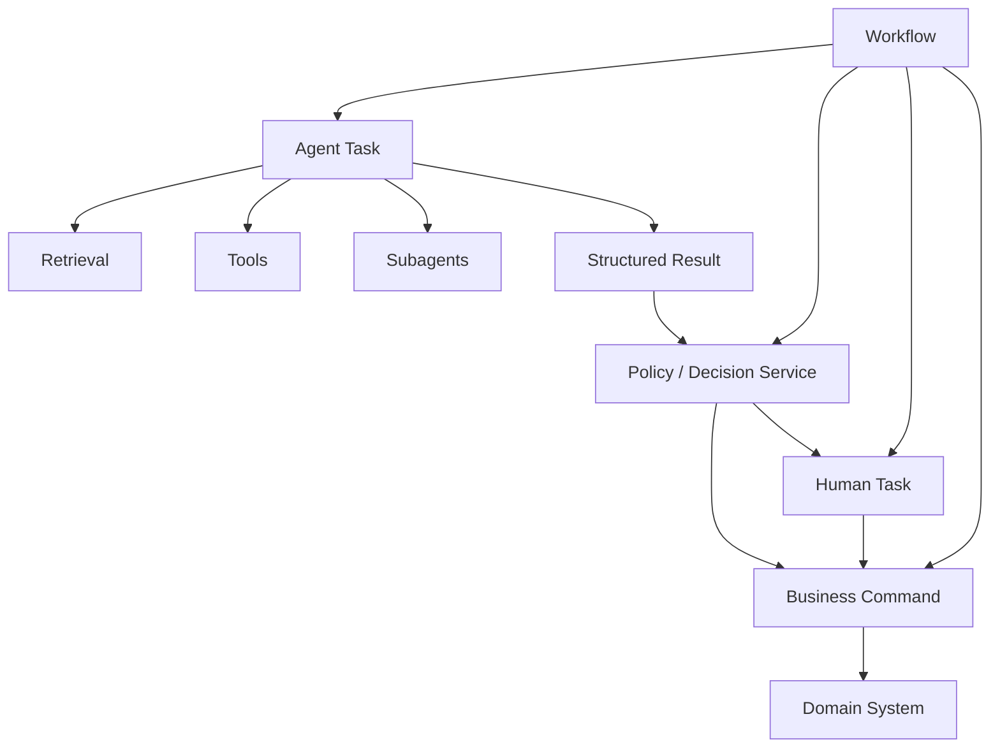
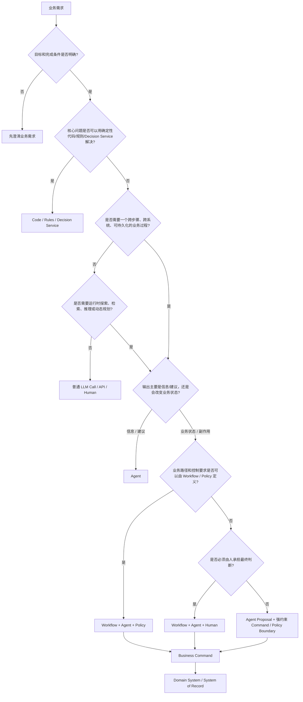
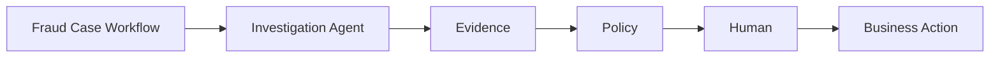
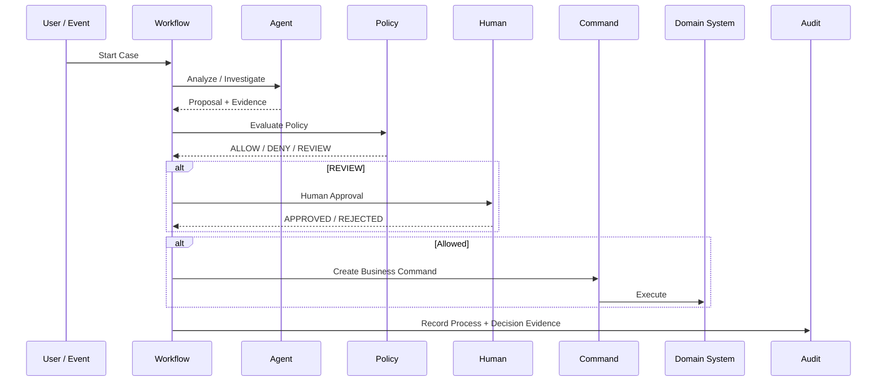
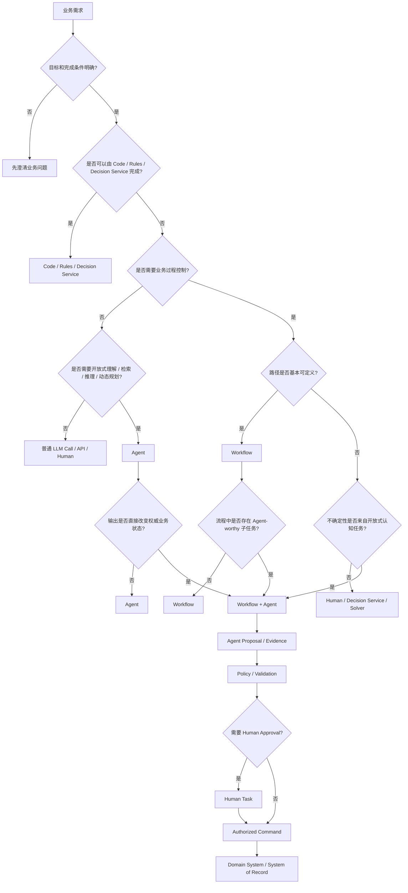

# 什么时候应该用 Workflow，什么时候应该用 AI Agent：金融服务场景下的架构选型与决策树

在企业 AI 项目中，一个越来越常见的问题是：

> 一个业务需求，到底应该做成 Workflow，还是做成 AI Agent？

很多架构讨论一开始就变成：

```text
Camunda vs DeepAgents
Workflow vs Agent
BPMN vs Agent Loop
```

但这其实不是最好的比较方式。

真正应该问的是：

> **这个系统中，哪些决策应该在运行前确定，哪些决策必须留到运行时由模型根据上下文决定？**

进一步还要问：

> **Agent 产生的是建议，还是业务系统的权威决定？**

这两个问题非常重要。

Google Cloud 当前的架构指南已经把 deterministic workflow 与需要动态 orchestration 的 agentic pattern 明确区分：如果任务步骤和路径可以预先定义，就不需要让模型承担 orchestration；只有当任务需要运行时规划、动态工具选择和根据环境反馈调整策略时，Agent 才有明显价值。Google 同时也提醒，不是所有多步骤任务都需要 Agent。

金融领域的实际案例也呈现出类似结构：

* Jyske Bank 用 Camunda 编排 KYC、定时器、用户任务和合规流程；
* Goldman Sachs 用 Camunda 支撑 Payment Processing、Client Billing 和 Decision Services；
* Capital One 用 Step Functions 编排大量支票处理 Workflow，并明确处理需要人工 Review 的分支；
* OneMain Financial 用 Step Functions 编排安全取证，并把人工授权放在高风险 snapshot 操作之前；
* Deutsche Bank 的 DB Lumina 则将 Agent 用于金融研究；
* Mr. Cooper 用多 Agent 处理复杂 mortgage 问题；
* Nequi 明确将 multi-agent system 与 deterministic flows 结合起来；
* PitCrew 则把 Agent、业务控制和 Automated Reasoning 放在金融服务 Workflow 中。

因此，真正值得采用的结论不是：

> Workflow 或 Agent，二选一。

而是：

> **Workflow 管业务过程控制；Agent 管受约束的运行时推理；Rules / Decision Service 管确定性决策；Human 管需要人为判断或授权的节点。**

对于金融服务，再加一条：

> **Agent 可以参与业务决策过程，但不应该因为拥有推理能力，就自动拥有业务状态机、授权边界和最终副作用的控制权。**

---

# 1. 先把四种东西分开

很多“Workflow vs Agent”的争论，其实是把四种不同能力混在了一起。

## 1.1 Code / Rules / Decision Service

负责：

```text
已知规则
+
确定性输入
+
确定性计算
=
确定性结果
```

例如：

```text
amount > 1M
    → Director Approval

amount <= 1M
    → Straight Through
```

这种问题不应该为了“AI-native”而引入 Agent。

它更适合：

```text
Code
Rules Engine
DMN
Decision Service
SQL
Optimization Solver
```

---

## 1.2 Workflow

Workflow 主要解决：

```text
业务过程是什么？
现在处于什么状态？
下一步允许发生什么？
什么时候等待？
什么时候超时？
谁需要处理？
什么条件下可以继续？
失败后走哪条恢复路径？
```

可以抽象成：

```text
Business State
      ↓
Allowed Transition
      ↓
Next Business State
```

例如：

```text
Trade Request
      ↓
Risk Review
      ↓
Approval
      ↓
Execution
      ↓
Settlement
```

Workflow 的价值不是“能不能调用 API”。

普通代码也可以调用 API。

Workflow 的价值是：

> **把跨系统、跨人员、长时间运行的业务过程变成一个可持久化、可观察、可恢复、可治理的执行对象。**

Jyske Bank 的 KYC 就是非常典型的例子：流程涉及客户数据更新、新客户 KYC、周期性重新 KYC、多个团队、客户响应期限、升级和用户任务，最终用 Camunda 做过程编排。

---

## 1.3 AI Agent

Agent 解决的是另一个问题：

```text
目标已知
但达到目标的步骤不完全知道
```

它的典型循环是：

```text
Goal
 ↓
Observe
 ↓
Reason
 ↓
Choose Action
 ↓
Tool
 ↓
Observe Result
 ↓
Replan
```

例如：

```text
“调查这个客户最近为什么出现风险变化。”
```

系统事先很难写死：

```text
先查什么？
第二步查什么？
发现异常后还应该查什么？
需要读取哪些文档？
需要让哪个 specialist 参与？
什么时候信息足够？
```

这种情况下，运行时规划才是 Agent 的价值。

DeepAgents 的定位本身就是这种 agent harness：提供 planning、subagents、filesystem、context management 和长期 memory 等能力。

OpenAI Agents SDK 同样把 Agent 定义为一个由模型、instructions、tools、handoff、guardrails 和运行时行为构成的执行单元，并由 Runner 管理 agent loop。

---

## 1.4 Human

Human 并不是 Workflow 的一种“错误处理机制”。

有些问题：

```text
规则明确
```

可以自动化。

有些问题：

```text
需要开放式推理
```

适合 Agent。

但还有一类：

```text
即使系统拥有足够信息，组织仍然要求由人决定
```

例如：

```text
大型交易审批
特殊客户例外
高风险合规判断
主观性较强的投诉处理
重大风险豁免
```

这时候应该进入 Human Task。

Google Cloud 的 Agent Architecture 指南也明确把 high-stakes、safety-critical、compliance-sensitive 或需要 subjective judgment 的任务列为 Human-in-the-loop 的典型场景。

---

# 2. 真正的架构分界：不是“复杂度”，而是“谁决定下一步”

这是旧版本最需要修改的地方。

“复杂”没有什么架构含义。

下面两个问题都可能很复杂：

```text
A:
一个有 80 个节点、12 个审批节点、10 个系统的 KYC Workflow

B:
一个需要阅读 300 份报告并调查某公司风险变化的研究任务
```

A 很复杂，但路径高度可定义。

B 也很复杂，但路径高度开放。

所以：

```text
Complex ≠ Agent
```

真正应该观察的是：

```text
下一步是否在运行前已经有足够明确的定义？
```

如果：

```text
是
```

倾向 Workflow / Rules。

如果：

```text
不是
```

再问：

> 为什么不知道？

这是整个 Decision Tree 最重要的一步。

---

# 3. “不知道下一步”不等于“应该用 Agent”

这是旧文章最大的逻辑缺口。

例如：

```text
amount > ?
```

不知道下一步，可能因为：

### 情况 A：规则没写清楚

应该：

```text
Business Analysis
```

不是 Agent。

---

### 情况 B：规则非常明确，但实现成决策表

应该：

```text
Decision Service / DMN
```

不是 Agent。

---

### 情况 C：需要数学优化

例如：

```text
Portfolio Allocation
Resource Allocation
Pricing Optimization
```

应该考虑：

```text
Optimization Solver
```

不是 Agent。

---

### 情况 D：需要人判断

应该：

```text
Human Task
```

不是 Agent。

---

### 情况 E：需要阅读非结构化信息、探索多个来源、动态选择工具

才更接近：

```text
Agent
```

所以更准确的判断链是：

```text
Path unknown
      ↓
Why?
 ┌────┼─────┬────────┬─────────┐
 ↓    ↓     ↓        ↓
Rule  Human  Solver   Open-ended reasoning
 ↓    ↓     ↓        ↓
Rules Human Solver   Agent
```

这一点非常重要。

否则很容易形成：

> **“凡是规则写不完的地方都塞 Agent。”**

这会把很多本来应该进入业务分析、规则引擎、优化算法和人工流程的问题，错误地交给 LLM。

---

# 4. 第二个核心维度：结果是不是“业务权威结果”

这可能是金融架构里比“路径是否确定”更重要的维度。

假设 Agent 输出：

```text
“这个客户看起来存在较高风险。”
```

这只是：

```text
Recommendation
```

如果 Agent 输出：

```text
“建议调查。”
```

仍然是：

```text
Proposal
```

但如果系统根据它直接：

```text
冻结账户
执行交易
改变客户状态
转移资金
批准贷款
提交监管报告
```

那么 Agent 已经不只是“思考”。

它正在产生：

```text
Authoritative Business Side Effect
```

这时架构要求完全不同。

---

# 5. 一个非常有用的二维模型

可以把整个选型问题放在两个轴上：

```text
X 轴：运行时决策自由度
     低 -------------------- 高

Y 轴：业务副作用 / 控制要求
     低
     |
     |
     高
```

得到：

```text
                         高业务控制要求
                               ↑
                               │
                Hybrid         │       Workflow
                               │
                               │
                               │
 Agent / Knowledge Work         │       Rules / Code
                               │
                               └────────────────────→
                                  高运行时自由度
```

更准确地说：

| 运行时自由度 | 业务影响 | 主体架构                                 |
| ------ | ---- | ------------------------------------ |
| 低      | 低    | Code / Rules / 普通 LLM Call           |
| 低      | 高    | Workflow + Rules / Policy            |
| 高      | 低    | Agent                                |
| 高      | 高    | Workflow + Agent + Policy/Human Gate |

第四象限才是金融服务最值得讨论的地方。

例如：

```text
Fraud Investigation
```

需要 Agent：

```text
高认知自由度
```

但最终：

```text
Freeze Account
```

属于高影响动作。

所以应该：

```text
Agent
 ↓
Evidence / Proposal
 ↓
Policy
 ↓
Workflow
 ↓
Human / Authorization
 ↓
Business Command
```

而不是：

```text
Agent
 ↓
Freeze Account
```

---

# 6. 这也是为什么“Workflow 外层，Agent 内部”很常见

在金融场景中，可以把架构拆成：



这里：

### Workflow

负责：

```text
状态
过程
SLA
等待
审批
升级
Retry
Compensation
Reconciliation
```

### Agent

负责：

```text
理解
检索
调查
分类
总结
规划
建议
```

### Policy / Decision Service

负责：

```text
规则
权限
阈值
Eligibility
SoD
Limit
Mandatory Controls
```

### Domain System

负责：

```text
真正的业务事实
真正的业务副作用
```

### Human

负责：

```text
必须由组织成员承担的判断和授权
```

这比简单说：

```text
Workflow = deterministic
Agent = non-deterministic
```

更加完整。

---

# 7. 一个重要修正：Durable 并不是 Workflow 与 Agent 的分界线

旧版本有一些地方容易让人理解成：

```text
Long-running
→ Workflow

Short-running
→ Agent
```

这个判断不成立。

现在 Agent Runtime 本身也可以持久化和恢复。

例如 OpenAI Agents SDK 当前已经支持：

```text
RunState
pause / resume
Human-in-the-loop
sessions
durable execution integrations
```

并且官方提供与 Temporal、Dapr、Restate、DBOS 的 durable execution 集成。

因此不能说：

> Agent 不适合长期运行。

更准确的是：

> **Agent 可以拥有自己的 durable execution，但这不等于 Agent Runtime 就应该成为企业业务过程的唯一控制平面。**

这是两个不同的问题。

例如：

```text
Agent Run
```

可以持续三天。

但：

```text
Business Case
```

仍然可以由 Workflow 控制：

```text
Case Created
 ↓
Agent Investigation
 ↓
Human Review
 ↓
Policy Decision
 ↓
Execute
```

所以：

```text
Durability
≠
Business Process Ownership
```

这是非常重要的架构边界。

---

# 8. 另一个修正：Workflow 也不等于完全确定性

Workflow 本身可以包含：

```text
Dynamic Event
Human Decision
External Data
Agent Node
Dynamic Branch
```

Google 当前的 Agent Architecture 指南甚至把：

```text
deterministic sequential pattern
+
dynamic orchestration pattern
```

都放在 agentic workflow 的范围内，并明确区分“流程固定”与“模型负责动态 orchestration”。

所以更准确的定义是：

> **Workflow 是过程控制模型。**

它可以包含：

```text
deterministic
human-driven
event-driven
agentic
```

多个节点类型。

同理：

> **Agent 是运行时推理模型。**

它可以被：

```text
Workflow
Application
Interactive UI
Another Agent
```

调用。

因此：

```text
Workflow ≠ deterministic code only
Agent ≠ entire application
```

---

# 9. 决策树应该重新设计

真正可用的 Decision Tree 应该是：



这棵树和原版本最大的不同是：

> **“路径未知”不是终点，而是重新问一层：未知是因为规则不足、人类判断、数学优化，还是开放式认知任务。**

只有最后一种才自然进入 Agent。

---

# 10. 再压缩成十个架构问题

实际 Architecture Review 不需要讨论几十个问题。

先问下面十个：

### 1. 最终目标是什么？

不是：

```text
“我们想做一个 Agent。”
```

而是：

```text
“业务到底想完成什么？”
```

---

### 2. 成功条件是什么？

能不能定义：

```text
Done
```

如果连完成条件都说不清，先不要选技术。

---

### 3. 下一步能不能在设计时定义？

```text
能
→ Workflow / Rules

不能
→ 继续判断为什么
```

---

### 4. 如果不能，是因为需要理解非结构化信息吗？

例如：

```text
PDF
Email
Contract
Research
Natural Language
Cross-document Evidence
```

是：

```text
Agent
```

的重要候选。

---

### 5. 是因为规则特别复杂吗？

如果是：

```text
DMN
Rules Engine
Decision Service
Optimization
```

应该优先考虑。

---

### 6. 是不是需要探索？

例如：

```text
“找出为什么这个客户风险发生变化。”
```

这种 open-ended investigation 很适合 Agent。

---

### 7. Agent 的输出只是建议，还是会改变业务状态？

这是关键分界：

```text
Recommendation
    → Agent 可以拥有更高自由度

Authoritative Business Decision
    → Policy / Workflow / Human 必须介入
```

---

### 8. 是否存在高影响、不可逆副作用？

例如：

```text
付款
交易
账户变更
资产转移
额度调整
客户状态冻结
监管申报
```

只要存在，就需要显著强化：

```text
Authorization
Policy
Idempotency
Approval
Audit
Reconciliation
```

---

### 9. 是否需要长期业务状态？

如果是：

```text
等待客户
等待审批
等待外部系统
SLA
Escalation
Compensation
Reconciliation
```

Workflow 的价值会明显增加。

但注意：

> 这不能单独证明“不能用 Agent”。

Agent 可以嵌入其中。

---

### 10. 谁拥有最终控制权？

这是最终问题：

```text
Agent
Workflow
Policy
Human
```

谁可以决定：

```text
“现在真的允许发生这个业务动作吗？”
```

金融系统里，这个问题往往比：

```text
“模型有多聪明？”
```

重要得多。

---

# 11. 四种典型架构模式

根据上面的决策树，最终通常会落到四种模式。

## 模式 A：Deterministic Automation

```text
Code
 ↓
Rule
 ↓
API
 ↓
Result
```

适合：

```text
Fee Calculation
Data Transformation
Fixed Validation
Fixed Routing
ETL
Batch
```

不要引入 Workflow，更不要 Agent，除非确实需要它们额外提供的能力。

---

## 模式 B：Business Workflow

```text
Event
 ↓
Workflow
 ↓
Rule
 ↓
Human
 ↓
Command
```

适合：

```text
KYC
Payment
Settlement
Account Opening
Regulatory Process
Approval
Claims
```

核心特点：

```text
过程明确
状态重要
控制重要
```

---

## 模式 C：Knowledge Agent

```text
Goal
 ↓
Agent
 ├── Search
 ├── Retrieve
 ├── Tool
 ├── Reason
 └── Synthesize
 ↓
Answer / Recommendation
```

适合：

```text
Research
Investigation
Document Analysis
Policy Q&A
Knowledge Assistant
Root Cause Analysis
```

输出通常是：

```text
Information
Evidence
Recommendation
Draft
```

而不是直接修改权威业务状态。

---

## 模式 D：Controlled Hybrid

```text
Workflow
   ↓
Agent
   ↓
Evidence / Proposal
   ↓
Policy
   ↓
Human / Authorization
   ↓
Command
   ↓
Business System
```

这是金融服务里最重要的一类。

典型：

```text
Fraud Investigation
Credit Review
Complex Complaint
Exception Handling
Client Due Diligence
Trade Research + Approval
```

---

# 12. 金融服务中，哪些业务明显偏 Workflow

## KYC / Account Opening

典型过程：

```text
Application
 ↓
Identity
 ↓
Sanctions
 ↓
Risk
 ↓
Document
 ↓
Review
 ↓
Approval
 ↓
Open Account
```

路径、角色、期限、监管要求、人工节点都可以被明确建模。

Jyske Bank 的案例就是这种模式：流程包含多个阶段、客户信息收集、截止时间、升级、人工任务和周期性重新 KYC。

---

## Payment / Settlement

例如：

```text
Receive
 ↓
Validate
 ↓
Risk
 ↓
Authorize
 ↓
Submit
 ↓
Confirm
 ↓
Reconcile
```

这里：

```text
Retry
Timeout
Idempotency
Authorization
Reconciliation
```

都比“让 Agent 决定下一步”重要。

---

## High-volume Straight-through Processing

Capital One 的 check processing 很典型。

它使用 Step Functions Distributed Map 将处理并行化，公开案例称整体处理时间降低约 75–80%，并可以同时运行大量 Workflow；遇到需要人工处理的支票，再进入对应的人工路径。

这个案例说明：

> **大量分支、复杂并发、人工例外，并不意味着需要 Agent。**

它仍然可以是纯 Workflow。

---

# 13. 金融服务中，哪些业务明显偏 Agent

## Financial Research

Deutsche Bank 的 DB Lumina 是非常典型的案例。

研究工作需要：

```text
Financial Statements
Regulatory Filings
Industry Reports
Past Research
External Information
```

然后由研究人员进行：

```text
Search
Read
Compare
Synthesize
Model
Identify Patterns
Form Insights
```

DB Lumina 被定位为 AI-powered research agent，用于帮助研究分析师自动化数据分析和研究工作，同时保留适用于金融机构的隐私和治理要求。

这里显然不是：

```text
A → B → C → D
```

的问题。

而是：

```text
Goal → Investigation → Insight
```

因此 Agent 很合适。

---

# 14. Mortgage / Customer Knowledge Work

Mr. Cooper 的 CIERA 是另一个代表性案例。

客户问：

```text
“为什么 escrow payment 增加了？”
```

系统需要理解：

```text
客户问题
+
历史数据
+
文件
+
计算结果
```

再把任务拆成多个 Agent 子任务。

Google Cloud 的案例明确描述了 CIERA 使用多个具有不同职责的 Agent，并强调它的目标是支持人类客服，让人类把更多精力放在 empathy、judgment 和 customer connection 上。

这是：

```text
Agent = cognitive work
Human = judgment / interaction
```

而不是：

```text
Agent = entire mortgage process
```

---

# 15. Fraud Investigation 是最典型的 Hybrid

Fraud Investigation 同时包含：

```text
确定性部分
+
探索性部分
```

确定性：

```text
Alert Created
 ↓
Case Created
 ↓
Assignment
 ↓
SLA
 ↓
Review
 ↓
Close
```

探索性：

```text
到底哪里异常？
还有哪些交易相关？
应该查哪些客户关系？
哪些外部资料值得看？
有没有其它关联账户？
```

因此：



这是典型 Hybrid。

---

# 16. Credit Approval 同样不是“Workflow or Agent”

信用审批可以拆成：

```text
Workflow
    ├── Application
    ├── KYC
    ├── Data Collection
    ├── Approval
    └── Disbursement

Decision Service
    ├── Eligibility
    ├── Limits
    └── Policy

Agent
    ├── Document Interpretation
    ├── Income Explanation
    ├── Missing Information
    └── Underwriter Summary

Human
    └── Exception / Approval
```

这里最容易犯的错误就是：

> “Credit Approval 很复杂，所以用一个 Credit Agent。”

这样做会把：

```text
Document understanding
Risk analysis
Policy decision
Authorization
Business command
```

全部塞进一个运行时黑盒。

更好的架构是把它们拆开。

---

# 17. Goldman Sachs 的案例说明“复杂业务过程”并不自动变成 Agent

Goldman Sachs 的公开案例显示，其集中式 Camunda Workflow 平台已经被用于：

```text
Payment Processing
Client Billing
Microservices Automation
Decision Services
```

公开数据包括 15+ internal teams、约 60K annual unique users，以及约 6M tasks/week。

这里最大的启示不是：

> Camunda 比 Agent 好。

而是：

> **金融企业可能拥有非常复杂、非常大规模、非常跨团队的业务过程，同时仍然需要确定性的 Process Orchestration。**

---

# 18. BNY Mellon 进一步说明规模本身不是 Agent 的理由

BNY Mellon 的公开案例描述了：

```text
70+ Camunda projects
100M+ individual process instances
```

覆盖：

```text
Investment Operations
Compliance Workflows
Client Reporting
```

。

因此：

```text
大规模
+
复杂
+
跨团队
+
多系统
```

依然可以是 Workflow 问题。

真正的问题还是：

```text
Process control
```

而不是：

```text
How many nodes?
```

---

# 19. OneMain Financial 是一个很好的“高风险 + Workflow”案例

OneMain Financial 的 OneFor(ensics) 使用 Step Functions 编排安全取证：

```text
Alert
 ↓
Validate
 ↓
Authorize
 ↓
Snapshot
 ↓
Analyze
 ↓
Report
```

尤其关键的是：

```text
Snapshot
```

之前存在明确的 authorized-person approval。

AWS 公布的数据称，从告警到调查的时间下降了 97.5%。

这个案例说明：

> **即使业务本身包含“分析”和“调查”，只要关键控制点可以预先定义，Workflow 仍然是非常自然的控制层。**

---

# 20. Nequi 是最值得研究的反例

Nequi 的案例特别有价值，因为它没有选择：

```text
All Workflow
```

也没有选择：

```text
All Agent
```

而是明确将：

```text
Multi-agent system
+
Deterministic flows
+
Collection strategies
```

组合使用。

AWS 的公开案例描述其用这种组合方式支持 credit management，并称 80% 的 overdue portfolio 可以在内部数字化处理。

因此：

> **真实系统更可能是“确定性过程 + 动态认知”，而不是单一编程模型。**

---

# 21. PitCrew 进一步说明“Agent 也需要外部控制”

PitCrew 的 AWS 案例非常接近我们今天真正想建设的金融 Agent Platform。

其架构包含：

```text
AI Agents
+
Integrations
+
Customer-specific Controls
+
Automated Reasoning
```

并明确把这些能力放进金融服务 Workflows。

例如 Form ADV Review Agent：

```text
Document
 ↓
LLM Extraction
 ↓
Claims
 ↓
Automated Reasoning
 ↓
Policy Validation
 ↓
Ready to File / Correction
```

AWS 的案例说明其使用 Automated Reasoning 将业务规则转成逻辑约束，对 Agent 产生的判断进行验证。

这是非常值得借鉴的结构：

```text
LLM
    → flexible interpretation

Reasoning / Rules
    → deterministic validation

Workflow
    → process control

Business System
    → authoritative action
```

---

# 22. 当前业界其实越来越接近“Deterministic + Agentic”而不是二选一

Camunda 2026 年的 Agentic Orchestration 材料直接把两者定义为：

```text
deterministic orchestration
+
dynamic AI reasoning
```

并提出让 Agent 作为受控的 process participant，而不是成为脱离业务过程的“free agent”。这属于 Camunda 的产品和架构观点，不应当当成行业共识本身，但它与 Google 的 deterministic/dynamic patterns，以及 Nequi 等实际案例呈现出的架构方向是一致的。

更有意思的是，Camunda 自己已经把 AI Agent 建模成 BPMN process 中的 agentic participant，这实际上说明：

> **Workflow Engine 和 Agent Runtime 并不是必然的替代关系。**

它们完全可以成为上下层。

---

# 23. “Agent Outer / Workflow Inner”并非绝对错误

需要避免另一种过度结论。

不能说：

```text
Agent 永远只能作为 Workflow Node
```

一些问题确实可以：

```text
Agent
    ↓
Tool / Subagent
    ↓
Tool
    ↓
Final
```

直接完成。

例如：

```text
Research Assistant
Coding Agent
Document Investigation
Internal Knowledge Assistant
```

如果：

```text
副作用低
没有长期业务状态
不需要复杂审批
目标是开放式知识任务
```

Agent 完全可以成为整个应用的主要 Runtime。

Google 当前的 Agent Architecture 指南也明确为开放式、多步骤、工具驱动的问题提供 single-agent、coordinator、hierarchical、swarm 等模式。

所以：

> **“Workflow 外、Agent 内”是金融高影响业务的强默认模式，不是所有 Agent 应用的唯一模式。**

---

# 24. 同理，Workflow 也可以动态调用 Agent

现代 Workflow 不应该被理解为：

```text
只能执行固定 Task
```

完全可以：

```text
Workflow
  ↓
Agent
  ↓
Agent dynamically chooses tools
  ↓
Structured Result
  ↓
Workflow
```

Google 的 custom logic pattern 就明确允许把 predefined rules 与 model reasoning 混合在同一个 execution structure 中。

因此成熟的企业 Workflow DSL 应该支持：

```text
Deterministic Node
Agent Node
Human Node
Decision Node
External Event
Timer
Subworkflow
```

而不是：

```text
Workflow = only deterministic APIs
```

---

# 25. Multi-Agent 也不能成为默认选择

这是当前文章另一个应该收紧的地方。

“复杂问题 → 多 Agent”也过于简单。

Google Research 在 2026 年对 180 种 Agent 配置进行受控评估后发现，多 Agent 在可并行的问题上可能明显提升效果，但在强顺序依赖任务上反而可能下降；研究还指出，多 Agent 的通信与协调成本会随着工具和任务结构增加。

因此：

```text
复杂
≠
Multi-Agent
```

而应该问：

```text
任务是否可以自然分解？
子任务是否相互独立？
是否值得为并行性付出协调成本？
```

---

# 26. 对 DeepAgents 一类框架，真正应该问什么

如果考虑 DeepAgents，不应该问：

> “能不能做 Workflow？”

当然可以通过代码、状态、检查点等机制做出 Workflow。

更应该问：

> **“让 Agent 自己规划这部分，是否真的比预定义流程更有价值？”**

例如：

```text
“调查客户风险”
```

适合。

因为 Agent 可以：

```text
search
→ inspect
→ compare
→ discover
→ search again
```

但：

```text
“达到 1M 美元必须 Director Approval”
```

不需要 Agent。

这是：

```text
Rule
```

而：

```text
“发送批准请求、等待批准、超时升级”
```

是：

```text
Workflow
```

最后：

```text
“判断哪些材料值得提交给 Director”
```

可能是：

```text
Agent
```

所以真正有价值的是：

```text
DeepAgents
    解决认知子问题

Workflow
    控制业务过程

Decision Service
    控制业务规则
```

而不是把三者互相替代。

---

# 27. 金融 Agent 最重要的边界：Proposal 和 Decision

这是整个问题最终应该落到的地方。

例如：

```text
Agent
→ “我认为这笔交易应该进入人工 Review。”
```

这是：

```text
Proposal
```

然后：

```text
Policy
→ Review Required
```

这是：

```text
Business Decision
```

然后：

```text
Workflow
→ Create Human Task
```

这是：

```text
Process Transition
```

最后：

```text
Human
→ Approve
```

这是：

```text
Authorization / Accountability
```

最终：

```text
Command
→ Execute Trade
```

这是：

```text
Business Action
```

五件事情不能混在一起。

---

# 28. 一个金融 Agent 的推荐执行链



这里的关键是：

```text
Agent
```

不会直接替代：

```text
Policy
Workflow
Command
Audit
```

---

# 29. “High-risk → Hybrid”也需要再严谨一点

不能简单说：

```text
高风险
→ Workflow + Agent
```

因为：

```text
高风险 + 路径确定
```

可能根本不需要 Agent。

例如：

```text
Payment > 1M
→ Director Approval
```

这是：

```text
Workflow + Policy
```

完全可以没有 Agent。

真正应该是：

```text
高风险
+
需要开放式认知
→ Hybrid
```

例如：

```text
复杂 Fraud Investigation
```

才是：

```text
Agent
+
Workflow
+
Policy
+
Human
```

这比原来的判断更精确。

---

# 30. 金融领域可以形成四种默认模板

| 业务类型           | 推荐架构                              |
| -------------- | --------------------------------- |
| 固定交易处理         | Workflow + Rules                  |
| 固定流程中的文档理解     | Workflow + Agent                  |
| 开放式研究 / 调查     | Agent，必要时外包给 Workflow             |
| 开放式判断 + 高风险副作用 | Workflow + Agent + Policy + Human |

例如：

### Payment

```text
Workflow
+
Rules
+
Command
```

### KYC

```text
Workflow
+
Rules
+
Agent for documents
+
Human exception
```

### Fraud Investigation

```text
Workflow
+
Investigation Agent
+
Policy
+
Human
```

### Financial Research

```text
Agent
+
RAG
+
Tools
+
Citation / Evidence
```

### Trade Execution Research

```text
Workflow
+
Research Agent
+
Policy
+
Human Approval
+
Trade Command
```

---

# 31. 一个非常重要的反模式：Agent 驱动 Business State

不推荐：

```text
Agent
 ↓
decide()
 ↓
nextNode = "executeTrade"
 ↓
Workflow
 ↓
executeTrade
```

因为：

```text
Workflow State
```

实际上已经被：

```text
LLM
```

控制。

更合理：

```text
Agent
 ↓
Proposal
 ↓
Allowed Transition Validation
 ↓
Workflow
```

即：

> **Agent 可以提出下一步，但不能单方面赋予自己下一步的业务权限。**

---

# 32. 另一个反模式：把所有知识工作都变成 Workflow

例如：

```text
Research Workflow
 ↓
Search Bloomberg
 ↓
Search SEC
 ↓
Search Reuters
 ↓
Read PDF
 ↓
Search another source
 ↓
Compare
 ↓
Search again
```

最终 Workflow DSL 里出现：

```text
if missing
if conflict
if new topic
if unexpected
if document unavailable
if source contradicts
```

这种系统会逐渐把开放式问题硬编码成一个巨大 State Machine。

这时应该考虑：

```text
Workflow
 ↓
Research Agent
```

而不是：

```text
Workflow 继续膨胀
```

---

# 33. 一个很实用的判断指标：变化来自哪里？

可以问：

> **流程变化主要来自业务规则，还是来自问题本身？**

### 如果变化来自业务规则

例如：

```text
2027 年金额阈值从 1M 改成 2M
```

用：

```text
Policy / Decision Service / Workflow Version
```

---

### 如果变化来自问题本身

例如：

```text
不同客户的问题完全不同
不同研究主题需要不同搜索路径
调查会产生新的调查方向
```

用：

```text
Agent
```

---

### 如果两个都存在

用：

```text
Workflow + Policy + Agent
```

---

# 34. 这也是金融服务架构和普通 Agent App 最大的区别

普通 Agent App 常常优化：

```text
Task completion
Answer quality
User experience
```

金融业务还必须优化：

```text
State correctness
Authorization
Policy compliance
Evidence
Recoverability
Reconciliation
Operational resilience
```

FSB 在 2025 年关于金融行业 AI 的监测报告继续把第三方依赖、数据、网络风险、模型风险和治理挑战列为重要脆弱性来源。

BIS 在 2026 年 9 月的最新讲话也明确指出，AI 在金融领域的采用已经涉及 fraud detection、creditworthiness、compliance、customer service 和 risk management，同时监管需要同时考虑技术治理与 operational resilience。

因此金融 Agent 架构天然不能只讨论：

```text
“Agent 能不能完成任务？”
```

还要讨论：

```text
“谁控制最终状态？”
```

---

# 35. 最终架构可以归结为五个角色

如果要建设企业级金融 Agent Platform，可以把角色固定成：

```text
                    ┌──────────────┐
                    │   Workflow   │
                    │ Process State │
                    └──────┬───────┘
                           │
             ┌─────────────┼─────────────┐
             ↓             ↓             ↓
        ┌─────────┐   ┌─────────┐   ┌─────────┐
        │ Policy  │   │  Agent  │   │ Human  │
        │ Control │   │Reasoning│   │Judgment│
        └─────────┘   └─────────┘   └─────────┘
             │             │             │
             └─────────────┼─────────────┘
                           ↓
                    ┌─────────────┐
                    │   Command   │
                    │ Business    │
                    │   Action     │
                    └──────┬──────┘
                           ↓
                    ┌─────────────┐
                    │ Domain/SOR  │
                    └─────────────┘
```

分别负责：

```text
Workflow
= 过程

Policy
= 允许不允许

Agent
= 怎么理解、怎么调查、怎么规划

Human
= 什么情况下必须由人判断

Command / Domain
= 真正改变业务事实
```

这比：

```text
Workflow vs Agent
```

这个二元模型更准确。

---

# 36. 最终 Decision Tree

如果只保留一张图，我建议使用这一版：



这张图比原来的版本多了两个关键分叉：

```text
是不是 Rule / Decision Service 问题？
```

以及：

```text
Agent 输出是否直接改变权威业务状态？
```

这两个问题能够挡住大量错误的 Agent 化设计。

---

# 37. 最终可以压缩成一句话

原版本的核心句子：

> Workflow 管过程；Agent 管不确定性。

方向对，但还不够完整。

我建议最终改成：

> **Workflow 管业务过程和状态；Decision Service 管确定性业务规则；Agent 管运行时的开放式认知任务；Human 管必须承担判断或授权的节点。**

再进一步：

> **是否使用 Agent，不取决于流程有多复杂，而取决于下一步是否需要运行时推理，以及这种推理是否会越过业务控制边界。**

对于金融服务：

> **确定性的业务过程留给 Workflow，确定性的业务规则留给 Policy / Decision Service，开放式调查和知识工作交给 Agent；一旦 Agent 的结果准备改变权威业务状态，就通过 Workflow、Policy、Authorization 和 Command 再进入业务系统。**

---

# 38. 对 Camunda / FluxNova 与 DeepAgents 的最终定位

因此，两者不应该被简单理解成竞争关系。

更合理的是：

```text
Camunda / FluxNova 类
    ↓
Business Process Orchestration
    ↓
State
Policy
Human Task
SLA
Retry
Approval
Compensation
Audit

DeepAgents 类
    ↓
Agent Runtime / Agent Harness
    ↓
Reasoning
Planning
Tool Selection
Subagents
Context
Retrieval
Replanning
```

在一个金融 Agent 平台里：

```text
Workflow
    ↓
Agent
    ↓
Structured Result
    ↓
Policy
    ↓
Human / Authorization
    ↓
Command
```

往往比：

```text
Agent
    ↓
everything
```

更符合实际业务需要。

但也不要反过来做成：

```text
Workflow
    ↓
every single decision
```

因为开放式调查、研究、文档分析、知识发现本身并不适合硬编码成一张巨大 BPMN 图。

因此，真正应该建设的是：

```text
Deterministic Control
+
Probabilistic Intelligence
```

而不是：

```text
Workflow
vs
Agent
```

---

# 39. 最终判断原则

可以把整篇文章最后浓缩成四条：

### 规则一：确定性计算 → Code / Rules / Decision Service

```text
已知规则
已知输入
已知结果
```

不要引入 Agent。

### 规则二：确定性业务过程 → Workflow

```text
状态
顺序
审批
等待
SLA
重试
补偿
```

交给 Workflow。

### 规则三：开放式认知任务 → Agent

```text
检索
调查
理解
比较
分析
规划
```

交给 Agent。

### 规则四：开放式认知 + 高影响业务动作 → Hybrid

```text
Agent
 ↓
Proposal / Evidence
 ↓
Policy / Validation
 ↓
Human / Authorization
 ↓
Command
 ↓
Business System
```

这是金融服务中最值得默认采用的模式。

---

# 40. 最终结论

重新审视之后，原文章最需要改变的不是具体案例，而是 **Decision Tree 的抽象层次**。

原模型大致是：

```text
路径已知
    → Workflow

路径未知
    → Agent

高风险
    → Hybrid
```

这个模型太容易误导。

更准确的模型应该是：

```text
                业务需求
                    │
          ┌─────────┼──────────┐
          ↓         ↓          ↓
       Code/Rules Workflow    Agent
          │         │          │
          │         │          │
          └─────────┼──────────┘
                    ↓
                  Human
                    ↓
             Business Command
                    ↓
              System of Record
```

而选择逻辑是：

```text
能否确定性解决？
    → Code / Rules

是否需要长期、跨系统、跨人员的业务过程？
    → Workflow

是否需要运行时开放式理解、检索、规划？
    → Agent

Agent 是否会产生权威业务副作用？
    → Workflow + Policy / Human Boundary
```

这比“Workflow 还是 Agent”更接近真实企业架构。

现实中的金融案例也越来越呈现这个方向：

* Jyske Bank 的 KYC 说明复杂、长期、合规且包含人工任务的流程仍然是典型 Workflow 问题。
* Goldman Sachs 和 BNY Mellon 说明大型金融机构可以在非常大规模的业务过程中持续依赖 Process Orchestration。
* Capital One、OneMain Financial 说明高并发和高风险人工控制点同样可以由确定性 Workflow 编排。
* Deutsche Bank、Mr. Cooper 说明开放式研究、复杂文档和知识密集型问题确实是 Agent 更有价值的地方。
* Nequi 则直接展示了 multi-agent 和 deterministic flow 共存的现实架构。
* PitCrew 展示了在金融服务中，Agent 可以负责认知工作，但其输出仍然需要业务政策和逻辑验证。
* Google 2026 年的 Agent 研究进一步说明，Agent 架构本身也应该由任务性质决定，而不是机械增加 Agent 数量；并行任务和强顺序任务对多 Agent 的收益可能完全不同。

因此，真正值得记住的不是：

> Workflow 比 Agent 好。

也不是：

> Agent 是 Workflow 的下一代。

而是：

> **Workflow 和 Agent 解决的是不同层次的问题。**

Workflow 解决：

```text
业务过程怎么被控制？
```

Agent 解决：

```text
在允许的范围内，面对未知信息，下一步应该怎么想？
```

Decision Service 解决：

```text
已知业务规则下，应该判定什么？
```

Human 解决：

```text
哪些决定必须由组织中的人承担？
```

Business System 解决：

```text
最终业务事实是什么？
```

所以，对于金融服务领域，最值得采用的默认架构不是：

```text
Workflow OR Agent
```

而是：

```text
                 Workflow
                    │
          ┌─────────┼─────────┐
          ↓         ↓         ↓
       Policy     Agent     Human
          │         │         │
          └─────────┼─────────┘
                    ↓
                 Command
                    ↓
             Business System
```

一句话：

> **把“过程控制”确定下来，把“认知自由度”限制在需要它的地方；Agent 可以负责思考，但不能因为会思考，就自动拥有业务过程和业务权力。**

---

# 参考资料

1. **Google Cloud — Choose a design pattern for your agentic AI system**
   当前 Google Cloud 官方架构指南，明确区分 deterministic workflows、dynamic orchestration、human-in-the-loop、custom logic 等模式。
   [Google Cloud — Agentic AI Architecture Patterns](https://docs.cloud.google.com/architecture/choose-design-pattern-agentic-ai-system?utm_source=chatgpt.com)

2. **Google Research — Towards a science of scaling agent systems**
   2026 年对 180 种 Agent 配置的受控研究，说明多 Agent 并非普遍有效，其收益取决于任务是否可并行、工具数量和顺序依赖。
   [Google Research — Towards a science of scaling agent systems](https://research.google/blog/towards-a-science-of-scaling-agent-systems-when-and-why-agent-systems-work/?utm_source=chatgpt.com)

3. **OpenAI Agents SDK — Running agents**
   Agent loop、session、pause/resume，以及 Dapr、Temporal、Restate、DBOS 等 durable execution integrations。
   [OpenAI Agents SDK — Running agents](https://openai.github.io/openai-agents-python/running_agents/?utm_source=chatgpt.com)

4. **OpenAI Agents SDK — RunState**
   定义可序列化、可恢复的 Agent RunState，说明 Agent Runtime 本身也可以拥有 durable pause/resume 能力。
   [OpenAI Agents SDK — RunState](https://openai.github.io/openai-agents-python/ref/run_state/?utm_source=chatgpt.com)

5. **LangChain — Deep Agents Overview**
   DeepAgents 的 planning、subagents、filesystem、context management、long-term memory 以及 agent harness 定位。
   [LangChain — Deep Agents Overview](https://docs.langchain.com/oss/javascript/deepagents/overview?utm_source=chatgpt.com)

6. **Camunda — Goldman Sachs**
   Goldman Sachs 使用 Camunda 支撑 Payment Processing、Client Billing、Microservices Automation 和 Decision Services。
   [Goldman Sachs + Camunda](https://camunda.com/about/customers/goldman-sachs/?utm_source=chatgpt.com)

7. **Camunda — BNY Mellon**
   BNY Mellon 的大规模 Process Orchestration，公开案例包括 70+ projects 和 100M+ process instances。
   [BNY Mellon + Camunda](https://camunda.com/about/customers/bank-of-ny-mellon/?utm_source=chatgpt.com)

8. **Camunda — Jyske Bank KYC**
   KYC、新客户 onboarding、周期性重新 KYC、用户任务、截止时间和升级等真实金融流程案例。
   [Jyske Bank + Camunda](https://camunda.com/case-studies/jyske-bank/?utm_source=chatgpt.com)

9. **AWS — Capital One Distributed Map**
   Capital One 用 Step Functions Distributed Map 处理 check clearing，公开数据称处理时间降低最高约 80%。
   [Capital One — Step Functions Distributed Map](https://aws.amazon.com/solutions/case-studies/capital-one-distributed-map/?utm_source=chatgpt.com)

10. **AWS — OneMain Financial**
    OneFor(ensics) 使用 Step Functions 编排安全取证，并在高风险 snapshot 操作前引入授权审批；公开数据显示调查时间下降 97.5%。
    [OneMain Financial — AWS Step Functions](https://aws.amazon.com/solutions/case-studies/onemain-financial-aws-step-functions-case-study/?utm_source=chatgpt.com)

11. **Google Cloud — Mr. Cooper CIERA**
    多 Agent 处理复杂 mortgage servicing 问题，并强调与人类客服协作。
    [Mr. Cooper — CIERA](https://cloud.google.com/blog/topics/financial-services/assembling-a-team-of-ai-agents-to-handle-complex-mortgage-questions-at-mr-cooper?utm_source=chatgpt.com)

12. **Google Cloud — Deutsche Bank DB Lumina**
    AI-powered financial research agent，用于研究资料检索、分析与综合，并考虑金融行业的数据隐私要求。
    [Deutsche Bank — DB Lumina](https://cloud.google.com/blog/topics/financial-services/deutsche-bank-delivers-ai-powered-financial-research-with-db-lumina?utm_source=chatgpt.com)

13. **AWS — Nequi**
    明确展示 multi-agent system 与 deterministic flows 的组合，用于金融服务场景。
    [Nequi — AWS Success Story](https://aws.amazon.com/solutions/case-studies/nequi-bedrock/?utm_source=chatgpt.com)

14. **AWS — PitCrew**
    Agent、金融业务控制和 Automated Reasoning 组合，展示 Agent 如何嵌入金融业务 Workflow。
    [PitCrew — AWS Case Study](https://aws.amazon.com/solutions/case-studies/pitcrew-case-study/?utm_source=chatgpt.com)

15. **Camunda — Guardrails and Best Practices for Agentic Orchestration**
    Camunda 2026 年关于 deterministic process、dynamic process、agentic orchestration 和 guardrails 的架构观点。这里属于厂商观点，应与其它来源结合理解。
    [Camunda — Guardrails and Best Practices for Agentic Orchestration](https://camunda.com/blog/2026/01/guardrails-and-best-practices-for-agentic-orchestration/?utm_source=chatgpt.com)

16. **Camunda — Choosing AI Orchestration**
    讨论将 Agent 嵌入金融业务流程、治理、状态和人工控制点。
    [Camunda — Choosing AI Orchestration](https://camunda.com/blog/2026/04/choosing-ai-orchestration-a-practical-assessment-guide-for-developers/?utm_source=chatgpt.com)

17. **Financial Stability Board — Monitoring Adoption of AI and Related Vulnerabilities in the Financial Sector**
    2025 年 FSB 报告，讨论金融 AI 的第三方依赖、网络风险、模型风险和治理等脆弱性。
    [FSB — Monitoring Adoption of AI](https://www.fsb.org/2025/10/monitoring-adoption-of-artificial-intelligence-and-related-vulnerabilities-in-the-financial-sector/?utm_source=chatgpt.com)

18. **BIS — Supervising banks in an AI-shaped economy**
    2026 年 9 月的最新金融监管讲话，讨论 AI 在 fraud、creditworthiness、compliance、customer service、risk management 中的应用，以及 governance、accountability 和 resilience。
    [BIS — Supervising banks in an AI-shaped economy](https://www.bis.org/speeches/20260918-supervising-banks-ai-shaped-economy?utm_source=chatgpt.com)

> 注：上述 Goldman Sachs、BNY Mellon、Jyske Bank、OneMain Financial、Capital One、Nequi、PitCrew、Mr. Cooper、Deutsche Bank 案例主要来自厂商或合作方公开 Case Study。它们适合证明“该架构已经被真实机构采用”和理解具体实现方式，但其中的效率数字属于案例方/厂商披露，不应视为独立第三方评估结果。
