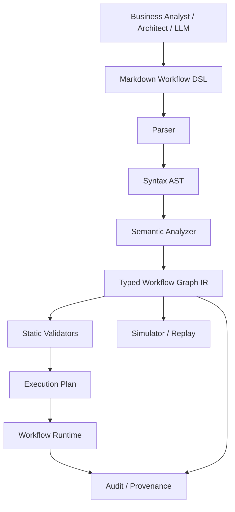
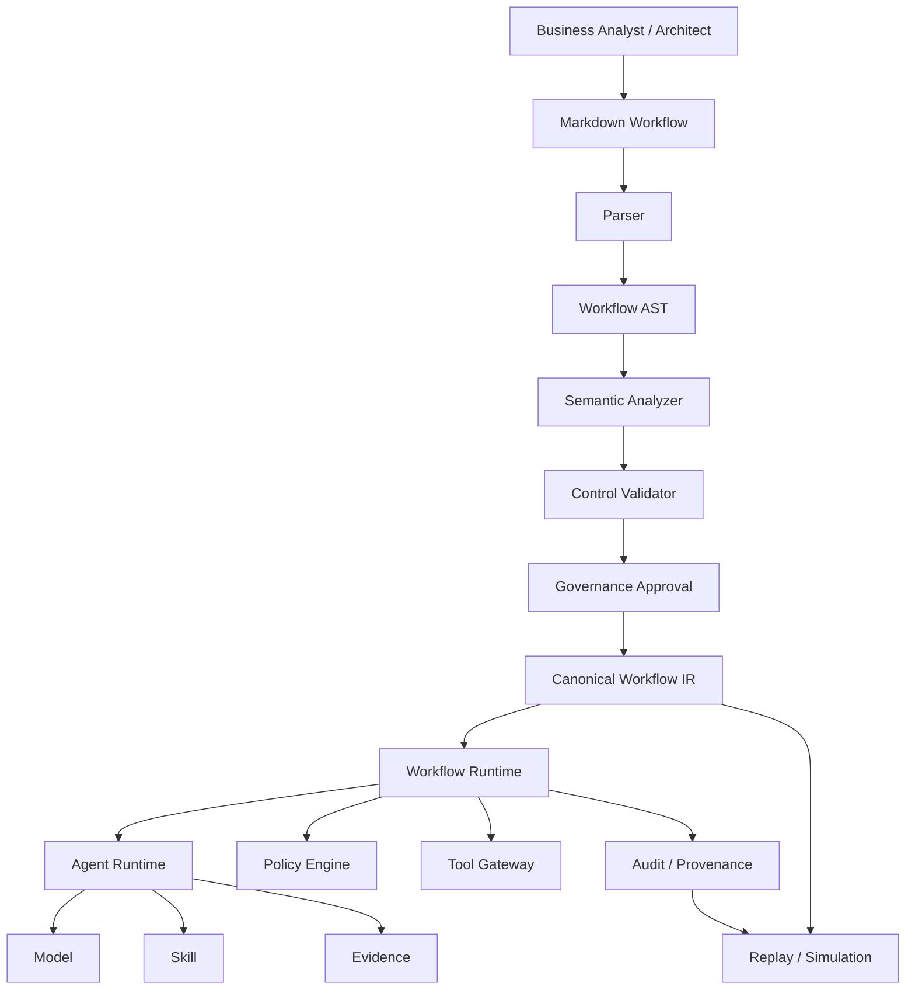

# 从 Markdown 到 Workflow AST：为什么 Agent Workflow 可以用 DSL 表达

## 一、真正的问题不是“Markdown 能不能写 Workflow”，而是“Workflow 到底是什么”

过去几年，Agent 应用大量使用 Markdown：

```text
SKILL.md
AGENTS.md
README.md
prompt.md
instructions.md
```

这很自然。Markdown 对人友好，对 LLM 也友好，而且 Git diff、review、版本管理都非常成熟。

当前 Agent Skills 开放规范就是一个典型例子：Skill 至少包含一个 `SKILL.md`，文件由 YAML frontmatter 和 Markdown instructions 组成，还可以附带 scripts、references、assets。它的定位是给 Agent 提供专业知识和操作方法，而不是定义一个严格的业务状态机。

于是很容易出现下一步：

> 既然 Markdown 可以表达 Skill，为什么不能直接用 Markdown 表达 Workflow？

答案是：

> **可以作为 Workflow 的 authoring format，但不应该让“自然语言 Markdown”直接承担 Workflow 的执行语义。**

因为一个真正的企业 Workflow 不只是：

```text
先做 A
然后做 B
如果风险高就人工审批
最后执行 C
```

它还必须明确：

```text
谁可以执行？
输入是什么？
输出是什么？
状态是什么？
条件是什么？
哪个节点可以并行？
失败如何处理？
哪些步骤允许重试？
哪些步骤产生副作用？
哪些步骤需要人工审批？
哪些数据可以访问？
哪一个 Policy 决定分支？
哪个版本的 Skill / Model / Policy 生效？
```

这些问题已经不是文档问题，而是**语言语义问题**。

因此更准确的架构是：

```text
Markdown
   ↓
Workflow DSL
   ↓
Workflow AST / Graph IR
   ↓
Static Validation
   ↓
Execution Plan
   ↓
Workflow Runtime
```

也就是说：

> **Markdown 可以是人和 LLM 编写 Workflow 的表面语言；AST/IR 才应该成为 Workflow 的机器可理解语义。**

---

# 二、为什么 Agent Workflow 天然适合 DSL

DSL（Domain-Specific Language）的核心并不是“发明一种新编程语言”。

Martin Fowler 对 DSL 的经典定义是：DSL 是针对一个特定领域、范围受限的语言；它可以是 external DSL，也可以是嵌入宿主语言的 internal DSL。DSL 的重要价值之一，是把领域概念直接暴露成可理解、可操作的语言。

Workflow 恰好有一个非常适合 DSL 的特征：

> **它的概念集合通常是有限而明确的。**

例如金融 Trade Review Workflow 可能只需要：

```text
Start
Task
Agent
Policy
Condition
Parallel
Wait
HumanApproval
SubWorkflow
Retry
Compensation
End
```

它并不需要：

```text
class
pointer
thread
inheritance
reflection
memory allocation
```

这些通用编程语言能力。

换句话说：

```text
Workflow DSL
=
一个非常小的语言
+
一个非常明确的业务语义
```

例如：

```text
if risk == HIGH
then human_approval
else continue
```

本质上是一个 DSL construct。

同样：

```text
parallel:
  - client_review
  - sanctions_check
  - exposure_check
```

也是 DSL construct。

---

# 三、Agent 时代反而让 DSL 更有价值

以前 DSL 的一个主要问题是：

> 谁来写？

现在情况发生了变化。

人可以用自然语言描述：

> “检查客户风险、制裁状态和交易限额；如果任何一个不通过就拒绝；如果风险等级高则进入人工审批。”

LLM 可以把这个意图翻译成结构化 DSL。

Martin Fowler 2026 年专门讨论了这一点：LLM 生成通用代码时拥有非常大的表达空间，DSL 可以通过受限词汇和确定性 validator 缩小搜索空间；模型生成 DSL 后，可以使用 parser、schema、type checker 或 compiler 对结果进行验证，并根据领域级错误反馈修正。Fowler 同时强调，DSL 的价值集中在“足够小、足够受限、并且有 validator”这一前提上。

这非常适合 Agent Workflow：

```text
业务人员 / 架构师
        ↓
自然语言
        ↓
LLM
        ↓
Workflow DSL
        ↓
Parser
        ↓
Semantic Validation
        ↓
Workflow AST / IR
        ↓
Human Review
        ↓
Runtime
```

相比：

```text
自然语言
   ↓
LLM
   ↓
Python / TypeScript
   ↓
直接运行
```

前者的可控性明显更强。

原因不是：

> DSL 比代码“高级”。

而是：

> **DSL 把 Agent 可以表达的自由度限制在企业允许的 Workflow Vocabulary 内。**

---

# 四、为什么不能直接让 LLM 生成 Workflow Code

假设你让 Agent 生成：

```typescript
async function runWorkflow(ctx) {
  const client = await loadClient(ctx.clientId);

  if (client.risk > 80) {
    await notifyCompliance(client);
    await humanApproval();
  }

  await submitTrade(ctx.trade);
}
```

它当然可以工作。

问题是：

```text
这个函数的“业务语义”在哪里？
```

Runtime 看见的是：

```text
function
await
if
call
```

而治理系统真正关心的是：

```text
Task
Policy
Approval
SideEffect
Authorization
Evidence
Retry
```

这就产生了一个问题：

> **系统能执行代码，却很难静态理解代码代表什么业务流程。**

例如：

```typescript
await submitTrade(...)
```

到底意味着：

```text
ExternalSideEffect
```

还是：

```text
SimulationOnly
```

如果完全依赖 runtime inspection，很多语义只能在真正执行时才能发现。

而 DSL 可以直接声明：

```yaml
- id: submit_trade
  type: side_effect
  action: trade.submit
  requires:
    - approval.trade
```

这样编译器或 validator 在执行之前就可以发现：

```text
submit_trade
→ no approval gate
→ INVALID
```

这就是 DSL 最重要的价值：

> **它把原来藏在代码里的业务语义显式化。**

---

# 五、Workflow DSL 的本质不是“换一种 YAML”，而是定义语义

很多系统看起来像 DSL：

```yaml
name: trade-review
steps:
  - load-client
  - risk-check
  - approve
```

但如果所有字段都只是 runtime 自己解释的配置项，那么它更接近 configuration。

真正的 DSL 至少应该有：

```text
Syntax
Semantics
Validation
Execution Model
Version
```

例如：

```text
agent
```

这个节点应该有明确语义：

> 使用一个 Agent Capability 产生 Proposal。

而不是：

> 让程序员自己决定这个字段怎么解释。

同样：

```text
policy
```

应该意味着：

> 对输入 Claim 执行指定 Policy，产生确定的 Policy Decision。

而不是：

> 调一个叫 policy 的函数。

这就是：

```text
Configuration
        ↓
DSL
```

之间真正的区别。

---

# 六、因此 Workflow DSL 最终应该产生 AST，但严格来说还不只是 AST

这里有一个容易混淆的技术问题。

传统编程语言里的 AST 通常是树：

```text
Program
 ├── Function
 │    └── Statement
 │         └── Expression
```

Workflow 却经常是图：

```text
A
├── B
│   └── D
└── C
    └── D
```

特别是：

```text
parallel
join
conditional branch
loop
retry
event
subworkflow
```

这些结构天然包含显式 edges。

所以如果非常严格地说：

> **“Workflow AST”通常更接近 Typed Workflow IR / Execution Graph，而不是传统编译器意义上的纯树状 AST。**

本文继续使用 “Workflow AST” 这个说法，是因为它表达了一个重要架构思想：

> **把自然语言 / Markdown 的 Workflow 描述解析成一个规范化、结构化、可验证的中间表示。**

技术实现上可以进一步拆成：

```text
Source AST
      ↓
Semantic Model
      ↓
Workflow Graph IR
      ↓
Execution Plan
```

Tree-sitter 的文档也很好地说明了这个区别：parser 可以产生 concrete syntax tree，而更高层的 abstract syntax tree 会去掉与语义无关的语法细节；其 API 允许对树结构进行查询和增量变化分析。

因此企业 Workflow 最终可以是：

```text
Markdown Syntax Tree
        ↓
Workflow Semantic AST
        ↓
Typed Graph IR
```

这比直接：

```text
Markdown → Python
```

更合理。

---

# 七、一个合理的架构：Markdown 是 Source，AST 是 Semantic Model

建议把整个编译链设计成：


每一层职责不同。

### Markdown

解决：

```text
人怎么写
LLM 怎么生成
Git 怎么 review
```

### DSL Parser

解决：

```text
语法是否正确
```

### Workflow AST

解决：

```text
工作流到底表达了什么
```

### Semantic Validation

解决：

```text
这个 Workflow 在业务上是否合法
```

### Policy Validation

解决：

```text
这个 Workflow 是否满足企业控制要求
```

### Execution Plan

解决：

```text
Runtime 到底执行什么
```

### Runtime

解决：

```text
如何可靠地运行
```

这其实是一个非常传统的 compiler architecture，只是目标不再是 CPU machine code，而是 Workflow Runtime。

---

# 八、为什么“AST”特别适合 Agent Workflow

因为 Workflow 中有大量结构可以被直接建模成 typed nodes。

例如：

```typescript
type WorkflowNode =
  | StartNode
  | TaskNode
  | AgentNode
  | PolicyNode
  | ApprovalNode
  | ConditionNode
  | ParallelNode
  | WaitNode
  | SubWorkflowNode
  | EndNode;
```

其中：

```typescript
type AgentNode = {
  type: "agent";
  id: string;
  skill: SkillRef;
  input: Expression;
  output: SchemaRef;
  evidence: EvidenceRequirement;
};
```

这样：

```text
Agent
```

不是一段自然语言。

而是一个具有明确结构的语义对象：

```text
AgentNode
├── Skill
├── Input
├── Output
└── Evidence Requirement
```

Policy Node：

```typescript
type PolicyNode = {
  type: "policy";
  policy: PolicyRef;
  input: Expression;
  output: PolicyDecision;
};
```

Approval Node：

```typescript
type ApprovalNode = {
  type: "human_approval";
  role: RoleRef;
  evidence: EvidenceRequirement;
  onApprove: NodeId;
  onReject: NodeId;
};
```

这时 Workflow 就可以被各种工具消费：

```text
Workflow Editor
       ↓
Validator
       ↓
Visualizer
       ↓
Simulator
       ↓
Runtime
       ↓
Audit
       ↓
Replay
```

而不需要分别解析 Markdown。

---

# 九、AST 最重要的能力其实是“把隐含关系显式化”

例如 Markdown：

```markdown
# Trade Review

Check client risk.

If high risk, ask compliance to review.

If approved, submit trade.
```

人可以理解。

机器却必须回答：

```text
“high risk”是什么条件？
“compliance review”是哪一个角色？
“approved”由谁产生？
“submit trade”是不是副作用？
提交交易需要什么 authorization？
```

AST 可以强制这些关系明确：

```json
{
  "type": "condition",
  "expression": "risk.level == 'HIGH'",
  "then": "compliance_review",
  "else": "trade_policy"
}
```

进一步：

```json
{
  "type": "side_effect",
  "action": "trade.submit",
  "requires": [
    "trade.approved",
    "user.order_authorization"
  ]
}
```

这时：

> **Workflow 从“人看得懂的说明”变成“机器可以验证的业务模型”。**

---

# 十、Markdown 最适合作为“声明层”，而不是“运行层”

可以把两者区别理解成：

```text
Markdown
=
What the designer wants to express

AST
=
What the system has formally understood
```

例如一个 Workflow 文件可以写：

```markdown
---
kind: workflow
id: trade-review
version: 1.0
---

# Trade Review

## 1. Load Client

Type: task

Action: client.load

## 2. Risk Review

Type: agent

Skill: risk-review

Evidence:
- client-profile
- risk-score
- exposure

## 3. Compliance Approval

Type: human-approval

Role: compliance-reviewer

## 4. Submit Trade

Type: side-effect

Action: trade.submit
```

这对架构师和业务分析师非常友好。

但运行前必须变成：

```text
Workflow
├── start
├── task(load_client)
├── agent(risk_review)
├── human_approval(compliance_reviewer)
└── side_effect(trade.submit)
```

并且关系：

```text
load_client
    ↓
risk_review
    ↓
compliance_approval
    ↓
trade_submit
```

必须成为机器可以验证的 edges。

---

# 十一、因此最好不要发明“自由 Markdown Workflow”

最危险的实现方式是：

```text
“任何 Markdown 都可以成为 Workflow。”
```

这样最终会变成：

```text
Markdown
   ↓
LLM interprets Markdown
   ↓
LLM decides what it means
   ↓
execute
```

这实际上没有 DSL。

它只是：

> **让 LLM 把自然语言解释成 workflow。**

在金融场景，这个自由度过大。

更合理的是：

```text
Markdown
   ↓
Constrained Workflow DSL
   ↓
AST
```

也就是说，Markdown 只是：

> **一种人类友好的 Surface Syntax。**

---

# 十二、可以把 DSL 设计成“Markdown + Typed Directives”

例如：

```markdown
# Trade Review

:::task id="load_client"
action="client.load"

:::agent id="risk_review"
skill="risk-review"
evidence="client,risk,exposure"
:::

:::policy id="trade_limit"
policy="trade-limit-v23"
:::

:::approval id="compliance"
role="senior-compliance"
:::

:::action id="submit_trade"
tool="trade.submit"
requires="compliance.approved"
:::
```

这时候 Markdown 负责：

```text
heading
description
documentation
human readable context
```

Typed directives 负责：

```text
workflow semantics
```

Parser：

```text
Markdown Parser
       ↓
Directive Parser
       ↓
Workflow AST
```

这样比让 Markdown 本身承担所有语义更稳健。

---

# 十三、还可以用 YAML Frontmatter 做 Workflow Metadata

Agent Skills 已经采用了类似思路：`SKILL.md` 用 YAML frontmatter 表达结构化 metadata，再使用 Markdown 表达 instructions。

Workflow 可以采用：

```yaml
---
kind: workflow
dsl: finance-workflow/v1
id: trade-review
version: 3.2
owner: trading-operations
risk-level: high
entry: intake
---
```

然后：

```markdown
# Trade Review

...
```

这样可以把：

```text
metadata
```

与：

```text
workflow body
```

分开。

但对于真正需要严格执行语义的节点，建议继续使用：

```text
typed directives
```

或者：

```text
structured blocks
```

而不要依赖普通 prose。

---

# 十四、Workflow DSL 最应该限制的，是“动作集合”

一个金融 Workflow DSL 不应该让用户写：

```python
for x in arbitrary_python:
    ...
```

否则 DSL 很快变成：

```text
Python
```

并失去静态分析能力。

应该提供有限的 operations：

```text
task
agent
policy
condition
parallel
wait
approval
emit
subworkflow
retry
compensate
end
```

这正是成熟 Workflow DSL 已经在实践的模式。

Amazon States Language 定义了结构化 JSON 状态机，其中包含 Task、Choice、Fail 等状态；Step Functions 的 state machine 还有 Wait、Map、Parallel 等控制结构。AWS 同时提供独立的 definition validation API，可以在部署前检查语法和诊断。

Serverless Workflow specification 也采用类似设计：任务、Switch、For、Try、Wait、Run、Fork 等都是有限的 workflow constructs，并且 Workflow Document 自身包含 DSL version、namespace、name 和 semantic version。

这其实就是 DSL 的核心思想：

> **不是让使用者获得无限表达能力，而是让使用者只表达这个领域真正允许表达的事情。**

---

# 十五、Microsoft Agent Framework 已经直接采用了“Declarative Workflow → Executable Graph”

这是 Agent Workflow 使用 DSL 的一个非常直接的当前实践。

Microsoft Agent Framework 当前提供 Declarative Workflows，使用 YAML 定义 workflow logic，而不是直接写程序代码。官方文档明确说明，这些 YAML 定义最终会被转换成 executable workflow graphs，并支持 Agent、Tool、HTTP、MCP、Human-in-the-loop、状态和表达式等 action。

其工作流模型本身也是有向图：

```text
Executor
   ↓
Edge
   ↓
Executor
```

Workflow Builder 负责构建 executable graph，并管理 executor invocation、message routing 和 event streaming。

这恰好说明：

> **“声明式文本 → 图结构 → Runtime”并不是理论架构，而已经成为现代 Agent Framework 的实际实现方式。**

---

# 十六、OpenAI Agents SDK 也明确区分“LLM 决定流程”和“代码决定流程”

OpenAI Agents SDK 的官方文档把 Agent orchestration 区分为两类：

```text
LLM-driven orchestration
Code-driven orchestration
```

前者由 LLM 自己决定下一步如何做；后者由应用代码决定 Agent 的执行流。两种方式也可以组合。SDK 同时支持对 Agent、Tool、MCP Server、Handoff 关系生成结构化 graph visualization。

这对金融 Agent 很有启发。

并不是说：

> 所有 Workflow 都必须 DSL。

而是：

> **越是明确、受监管、可审计的流程控制，越应该从 LLM 自由规划中拿出来，进入显式 Workflow Model。**

可以形成：

```text
Deterministic Workflow
        +
Bounded Agent Reasoning
```

而不是：

```text
LLM
  ↓
自由决定整个业务流程
```

---

# 十七、这也是为什么金融领域一直有 BPMN

金融服务并不是今天才发现：

> “业务流程需要一种声明性表示。”

BPMN 已经长期解决这个问题。

OMG 的 BPMN 2.0.1 是正式标准，并提供 machine-readable XML schema 等规范材料；BPMN 既服务于流程建模，也可以作为执行引擎使用的模型。

Camunda 对 BPMN 的实践更加直接：BPMN 模型可以部署到 workflow engine，由 engine 执行 process instance；任务可以关联到具体服务。

所以：

```text
Workflow DSL
```

并不是：

> “AI 时代突然出现的新发明。”

真正新的地方是：

> **LLM 可以成为 DSL 的自然语言前端。**

以前：

```text
Business Analyst
     ↓
BPMN Model
     ↓
Workflow Engine
```

现在可以出现：

```text
Business Analyst
     ↓
Natural Language / Markdown
     ↓
LLM
     ↓
Workflow DSL / AST
     ↓
Validator
     ↓
Workflow Engine
```

---

# 十八、所以 Agent Workflow 并没有让 BPMN 的问题消失

真正发生的是：

```text
AI
=
增加动态推理能力

Workflow DSL
=
保留确定性控制
```

2026 年 Camunda 的公开观点也强调，AI agent 与 orchestration 并不是二选一：Agent 适合模糊、动态的工作，而企业仍然需要 process state、controls、audit trails、retries、SLAs 和 ownership。Camunda 把这概括为 deterministic orchestration 与 dynamic reasoning 的结合。这里属于厂商观点，但与成熟 Workflow Engine 的现有能力边界一致。

对于金融领域，更适合的架构不是：

```text
BPMN
     ↓
被 Agent 完全替代
```

而是：

```text
Explicit Workflow
       ↓
Agent Node
       ↓
Dynamic Reasoning
       ↓
Structured Result
       ↓
Explicit Workflow
```

也就是：

> **Agent 是 Workflow 的一个计算节点，而不是 Workflow 本身。**

---

# 十九、这就是 Workflow AST 与 Agent Runtime 的边界

例如：

```text
Workflow AST

Start
 ↓
LoadClient
 ↓
RiskAgent
 ↓
PolicyCheck
 ↓
HumanApproval
 ↓
SubmitTrade
```

运行到：

```text
RiskAgent
```

时：

```text
Agent Runtime
   ↓
Model
   ↓
Skill
   ↓
Evidence
   ↓
Tools
   ↓
Proposal
```

然后返回 Workflow：

```text
Proposal
   ↓
PolicyCheck
```

这意味着：

```text
Workflow AST
=
业务控制结构

Agent Runtime
=
局部智能计算
```

这是一个非常重要的边界。

如果把整个 Workflow 放到 Agent Runtime 内：

```text
Agent
  ↓
自己决定下一步
  ↓
自己决定审批
  ↓
自己决定执行
```

那么：

```text
Auditability
Replay
Authorization
Versioning
Testing
```

都会明显变得困难。

---

# 二十、Workflow AST 可以成为企业真正的“Control Contract”

例如：

```json
{
  "workflow": {
    "id": "trade-review",
    "version": "3.2"
  },

  "nodes": [
    {
      "id": "risk_review",
      "type": "agent",
      "skill": "risk-review@7.1"
    },
    {
      "id": "trade_policy",
      "type": "policy",
      "policy": "trade-limit@23"
    },
    {
      "id": "approval",
      "type": "human_approval",
      "role": "senior-trader"
    },
    {
      "id": "submit_trade",
      "type": "side_effect",
      "tool": "trade.submit"
    }
  ],

  "edges": [
    ["risk_review", "trade_policy"],
    ["trade_policy.allow", "approval"],
    ["approval.approved", "submit_trade"]
  ]
}
```

这个对象本身可以回答：

```text
流程是什么？

哪些节点是 Agent？

哪些节点是 Policy？

哪些节点是 Human？

哪个节点产生 Side Effect？

什么条件才能执行 Side Effect？

```

因此：

> **Workflow AST 不只是 runtime configuration，它可以成为 Governance Contract。**

---

# 二十一、这会直接改善静态安全检查

一旦 Workflow 是 AST，就可以在执行前做很多确定性检查。

例如：

### 检查一：Side Effect 前必须存在 Approval

```text
submit_trade
     ↑
approval.approved ?
```

如果不存在：

```text
ERROR:
Side-effect node has no approval dependency
```

### 检查二：高风险 Agent 必须绑定 Evidence Requirement

```text
agent:
  risk-level: high
```

没有：

```text
evidence:
```

则：

```text
ERROR:
High-impact agent node has no evidence contract
```

### 检查三：Policy 必须 pin version

```text
policy: latest
```

直接拒绝。

### 检查四：所有节点必须可达

```text
Node X
```

没有任何 incoming path：

```text
ERROR:
Unreachable node
```

### 检查五：所有 non-terminal path 必须最终到达 End

```text
risk_review
   ↓
approval
```

没有：

```text
approved
```

分支：

```text
ERROR:
Execution branch has no terminal path
```

### 检查六：循环必须声明上限

```text
retry:
  until success
```

应该要求：

```text
max_attempts
```

否则可能形成无限循环。

---

# 二十二、甚至可以检查“Workflow 是否绕过 Policy”

例如：

```text
agent
 ↓
submit_trade
```

AST 上非常容易检测。

因为：

```text
submit_trade
```

是：

```text
type = side_effect
```

企业规则规定：

```text
side_effect
requires policy decision
```

于是 validator 可以做：

```text
for node in workflow.nodes:
    if node.type == SIDE_EFFECT:
        assert has_policy_gate(node)
```

这一类规则很难对任意 Python 代码稳定做判断。

但对受限 DSL：

```text
非常容易。
```

这正是 DSL 对金融 Workflow 最大的价值之一。

---

# 二十三、AST 还能让 Policy 本身参与 Workflow 验证

例如：

```text
Trade
amount > 10m
```

Policy：

```text
requires senior approval
```

Workflow：

```text
risk_agent
   ↓
junior approval
   ↓
submit
```

如果 Policy DSL 与 Workflow AST 都结构化：

```text
Policy AST
+
Workflow AST
```

就可以检查：

```text
Policy requires Senior
Workflow only provides Junior
```

直接得到：

```text
INVALID WORKFLOW
```

这比等到 runtime 才发现：

```text
403
```

更好。

因此最终可能形成：

```text
Workflow AST
     +
Policy AST
     +
Tool Contract
     +
Evidence Contract
     ↓
Static Control Analysis
```

---

# 二十四、AST 还能直接生成可视化图

这正是“AST 作为 Single Source of Truth”的另一个价值。

从同一个 Workflow AST 可以生成：

```text
AST
 ├── Runtime Execution
 ├── Mermaid
 ├── BPMN-like View
 ├── Documentation
 ├── Audit View
 ├── Test Scenarios
 └── Simulation
```

OpenAI Agents SDK 已经能够根据 Agent / Tool / MCP / Handoff 关系生成结构化 Graphviz graph；Microsoft Agent Framework 也提供 Workflow topology visualization。

这意味着 UI diagram 不一定需要成为：

> workflow definition 本身。

更合理的是：

> **diagram 是 Workflow AST 的一个 projection。**

同理：

```text
Markdown
```

也是：

> AST 的一个 authoring projection。

---

# 二十五、这会解决“画图”和“代码”双重维护的问题

传统企业系统很容易出现：

```text
BPMN Diagram
      ≠
Java Code
```

业务看图：

```text
A → B → C
```

实际代码：

```text
A → B → X → Y → C
```

两份真相最终产生漂移。

AST 架构可以把问题变成：

```text
Workflow Source
       ↓
Canonical AST
      ↙ ↘
Diagram  Runtime
```

即：

```text
               Canonical Workflow AST
                    /         \
                   /           \
            Visualization    Runtime
```

而不是：

```text
Diagram
   +
Code
   +
Docs
```

三套不同的定义。

---

# 二十六、Version Control 也自然变得更好

如果 Workflow 是 Markdown：

```diff
- If risk is high, request review.
+ If risk is high, request senior review.
```

人可以 review。

如果 AST 是 canonical representation：

```diff
approval.role:
- compliance
+ senior-compliance
```

机器也容易 review。

更进一步，可以做：

```text
Workflow Diff
```

并指出：

```text
CONTROL CHANGE

Human Approval Role
compliance
→ senior-compliance
```

或者：

```text
SIDE EFFECT CHANGE

Added:
trade.submit
```

这比：

```diff
+ await submitTrade()
```

更加接近业务和 Risk 能理解的差异。

DORA 对金融机构 ICT change management 要求变化被记录、测试、评估、批准、实施和验证；将 Workflow 的变更表示成结构化 AST diff，可以成为满足这些工程控制目标的一种实现方式，但不能把 AST diff 本身等同于 DORA 合规。

---

# 二十七、这对 Agent 还有一个特别重要的价值：把 LLM 从“Workflow Owner”降为“DSL Author”

这是 Agent 架构可能非常重要的一步。

错误模式：

```text
LLM
 ↓
决定 Workflow
 ↓
生成代码
 ↓
执行
```

更合理：

```text
LLM
 ↓
生成 Workflow DSL
 ↓
Parser
 ↓
Validator
 ↓
Human / Governance Review
 ↓
Workflow AST
 ↓
Runtime
```

于是 LLM 做：

```text
Interpretation
Generation
Refinement
```

但：

```text
Parser
Validator
Runtime
```

负责：

```text
Meaning
Safety
Execution
```

这和 Fowler 2026 年提出的“DSL 作为 LLM harness / source of truth”思路高度一致：模型负责生成受限语言，工具链负责确定性验证和执行。

---

# 二十八、因此 Workflow DSL 应该是“受限语言”，不是“自然语言编程”

一个好的金融 Workflow DSL 应该尽量少：

```text
自由文本
任意表达
任意函数
任意代码
```

尽量多：

```text
typed node
typed edge
typed input
typed output
typed policy
typed capability
typed effect
typed permission
```

例如：

```yaml
node:
  id: risk_check
  type: agent

  capability:
    skill: risk-review@7.2

  input:
    client_id: $case.client_id

  evidence:
    required:
      - client-risk
      - exposure

  output:
    schema: RiskReviewResult

  effects:
    - read:risk
    - read:client
```

模型不能随便写：

```yaml
effects:
  - transfer_money
```

因为：

```text
effect capability
```

由 schema / policy 限制。

---

# 二十九、Workflow DSL 应该像“业务语言”，而不是“平台语言”

不应该让业务分析师写：

```yaml
invoke:
  executor:
    class: AgentExecutor
  runtime:
    context_manager:
      strategy: persistent
```

这些都是实现细节。

应该写：

```yaml
type: agent
skill: risk-review
```

也就是说：

```text
Workflow DSL
描述：
“做什么”

Runtime Code
负责：
“怎么做”
```

例如：

```text
DSL:
agent risk_review

Runtime:
- load Skill
- construct context
- call model
- validate output
- record evidence
- store provenance
```

这样 Runtime 可以从：

```text
LangGraph
```

迁移到：

```text
DeepAgents
```

甚至：

```text
自研 Runtime
```

而 Workflow Source 不需要改变。

---

# 三十、这是 DSL 的另一个价值：Runtime Independence

成熟 DSL 通常具有：

```text
Model
≠
Implementation
```

例如 SQL：

```text
SELECT ...
```

并不等于某一种数据库的实现。

Kubernetes YAML：

```yaml
kind: Deployment
```

也不等于某一个具体程序。

类似地：

```yaml
kind: Workflow
```

可以被不同 Runtime 执行：

```text
Runtime A
Runtime B
Runtime C
```

当然，真正做到 portability 需要非常严格的语义定义。

AWS Amazon States Language、CNCF/Open Workflow Specification、Microsoft Agent Framework 的 declarative workflows 都说明了这种思路：Workflow 定义可以成为相对独立于具体业务代码的声明性模型。

---

# 三十一、但不要为了“DSL”而设计一个巨型语言

这是最容易失败的地方。

一个反面例子可能是：

```text
Workflow DSL
├── Task
├── Agent
├── LLM
├── Prompt
├── Tool
├── MCP
├── HTTP
├── SQL
├── Python
├── JavaScript
├── Loop
├── Thread
├── Async
├── Memory
├── Vector
├── Queue
├── Cache
├── Retry
├── Saga
├── ...
```

最后变成：

> “我们重新发明了一门编程语言。”

这违反 DSL 的核心价值。

Martin Fowler 也特别强调，DSL 的优势来自范围和能力的受限；DSL 越接近通用语言，设计和维护成本就越高，而 Agent 使用 DSL 的优势尤其依赖“小而受限、可验证”的语言。

所以：

> **Workflow DSL 只应该描述 Workflow。**

不要把：

```text
Agent implementation
business calculation
database access
HTTP client logic
```

全部塞进 DSL。

---

# 三十二、一个适合金融 Agent 的最小 Workflow DSL

第一版其实可以非常小：

```text
Start
Task
Agent
Policy
Condition
Parallel
Wait
HumanApproval
SubWorkflow
Retry
End
```

加上每个节点统一的：

```text
id
input
output
timeout
retry
authorization
evidence
version
```

例如：

```yaml
workflow:
  id: trade-review
  version: 1.0

  nodes:

    - id: load_client
      type: task
      action: client.load

    - id: risk_review
      type: agent
      skill: risk-review@7.2
      evidence:
        required:
          - client-profile
          - risk-score
          - exposure

    - id: trade_policy
      type: policy
      policy: trade-limit@23

    - id: approval
      type: human_approval
      role: senior-compliance

    - id: submit_trade
      type: side_effect
      action: trade.submit
```

再定义：

```yaml
edges:
  - from: load_client
    to: risk_review

  - from: risk_review
    to: trade_policy

  - from: trade_policy
    when: allow
    to: approval

  - from: approval
    when: approved
    to: submit_trade
```

到这里已经足以表达大量金融 Workflow。

---

# 三十三、然后再允许 Markdown 成为这个 DSL 的 Authoring Format

例如：

```markdown
---
kind: workflow
id: trade-review
version: 1.0
---

# Trade Review

## Load Client

:::task
id: load_client
action: client.load
:::

## Risk Review

:::agent
id: risk_review
skill: risk-review@7.2
evidence:
  required:
    - client-profile
    - risk-score
    - exposure
:::

## Trade Policy

:::policy
id: trade_policy
policy: trade-limit@23
:::

## Approval

:::human-approval
id: approval
role: senior-compliance
:::

## Submit Trade

:::side-effect
id: submit_trade
action: trade.submit
requires: approval.approved
:::
```

Parser：

```text
Markdown
   ↓
Directive AST
   ↓
Workflow Semantic AST
```

这样：

```text
Markdown
```

负责 readability。

而：

```text
Workflow AST
```

负责 execution semantics。

---

# 三十四、AST 应该成为唯一的 Canonical Source of Truth

这里有一个非常重要的设计选择。

不推荐：

```text
Markdown
↓
Runtime

YAML
↓
Runtime

BPMN
↓
Runtime

Code
↓
Runtime
```

这样会产生多个语言入口和多个语义实现。

更推荐：

```text
Markdown ─┐
           │
YAML ──────┤
           ├──> Canonical Workflow AST
JSON ──────┤
           │
Visual UI ─┘
```

然后：

```text
Canonical Workflow AST
        ├── Runtime
        ├── Validator
        ├── Visualization
        ├── Documentation
        ├── Simulation
        ├── Audit
        └── Replay
```

这就是为什么 AST/IR 比 Markdown 本身更加重要。

---

# 三十五、这也意味着 UI Workflow Builder 不应该拥有另一套模型

可视化编辑器：

```text
Drag
Drop
Connect
```

最后应该修改：

```text
Workflow AST
```

而不是：

```text
UI Internal JSON
```

然后另一个 Markdown Parser 又生成：

```text
另一套 JSON
```

最佳状态是：

```text
               Canonical AST
              /      |      \
             /       |       \
       Markdown      UI       API
          ↓          ↓        ↓
          └────── same semantic model ──────┘
```

这样：

```text
文本编辑
```

和：

```text
可视化编辑
```

只是两种 front-end。

---

# 三十六、Workflow AST 甚至可以成为 AI Agent 的“Action Space”

这是 Agent 架构中特别值得关注的一点。

如果没有 DSL：

```text
Agent
→ 可以调用很多 Tool
→ 可以自行决定流程
```

如果有 Workflow DSL：

```text
Agent
→ 只能生成合法 Workflow AST
```

例如模型只能选择：

```text
AgentNode
TaskNode
PolicyNode
ApprovalNode
ConditionNode
```

而不能生成：

```text
Execute arbitrary shell
Submit payment directly
Modify database
```

除非这些能力被明确暴露为：

```text
Tool Capability
```

并满足：

```text
Policy
Authorization
```

所以 DSL 不只是“配置格式”。

它可以成为：

> **Agent Planning 的 Action Space。**

---

# 三十七、这样可以让 Planner 和 Executor 分离

一个高级 Agent 可以：

```text
User Request
    ↓
Planner Agent
    ↓
Workflow DSL
    ↓
Validator
    ↓
Workflow AST
    ↓
Executor
```

Planner 不负责：

```text
actual execution
```

Executor 不负责：

```text
inventing workflow
```

形成：

```text
Planner
=
proposal

Validator
=
control

Executor
=
execution
```

这和金融系统需要的：

```text
Agent Proposal
≠
Business Decision
```

是同一个思想。

---

# 三十八、Workflow AST 可以直接驱动 Simulation

因为它是结构化的：

```text
AST
```

所以可以在真正执行前：

```text
simulate()
```

例如：

```text
Input:
risk = HIGH
amount = 8m
```

AST：

```text
risk_agent
     ↓
trade_policy
     ↓
approval
     ↓
submit
```

模拟器可以得到：

```text
Agent Proposal
→ approve

Policy
→ allow

Approval
→ required

Side Effect
→ blocked in simulation
```

最终生成：

```text
Expected Path:
load_client
→ risk_review
→ trade_policy
→ approval
→ submit_trade
```

这样业务分析师甚至可以在没有连接真实系统的情况下审查 Workflow。

---

# 三十九、AST 还可以驱动自动测试

例如每个：

```text
Condition
```

可以自动生成 branch test。

每个：

```text
Retry
```

可以自动生成 failure test。

每个：

```text
HumanApproval
```

可以生成：

```text
approve
reject
timeout
```

每个：

```text
SideEffect
```

可以生成：

```text
authorized
unauthorized
duplicate
```

于是：

```text
Workflow AST
       ↓
Test Scenario Generator
       ↓
Workflow Test Suite
```

这就是 DSL 比 Markdown 强得多的地方：

> **DSL 既可以描述系统，也可以生成系统的验证材料。**

---

# 四十、AST 还可以成为 Replay 的基础

前面讨论的 Replay 可以直接复用 Workflow AST。

历史执行：

```text
Execution
  ↓
Workflow Version 3.2
  ↓
Workflow AST snapshot
```

Replay：

```text
Historical AST
+
Historical State
+
Historical Evidence
+
Recorded Tool Result
```

这样：

```text
Replay
```

不需要重新解释：

```text
Markdown
```

而是直接执行：

```text
Historical Workflow AST
```

这正是为什么 Workflow Version 不应该只是：

```text
version = "3.2"
```

而应该关联：

```text
artifact_digest
canonical_ast_hash
```

---

# 四十一、AST 还可以成为 Audit Evidence

一个金融审计人员可能问：

> “当时审批流程到底是什么？”

如果只有：

```text
当前 Workflow = v5
```

不够。

如果保存：

```text
Workflow Version = v3
Canonical AST Hash = abc123
```

并且能够恢复：

```text
Workflow AST v3
```

就可以展示：

```text
Risk Review
  ↓
Policy
  ↓
Human Approval
  ↓
Submit
```

然后关联：

```text
Execution
Skill Version
Model Version
Policy Version
Evidence
```

最终形成：

```text
Business Decision
     ↓
Historical Workflow AST
     ↓
Execution Provenance
```

这与 FINRA 2026 年对 GenAI 的观察方向非常吻合：机构应建立正式治理和风险管理框架、保持 comprehensive documentation，并通过 prompt/output logs、model-version tracking、validation 和 human review 等手段提高可追踪性；FINRA 同时特别指出，多步骤 Agent 的 auditability / transparency 比传统简单工具更困难。

---

# 四十二、这对金融业务尤其重要，因为真实生产系统早就证明 Workflow 是一等对象

Capital One 使用 AWS Step Functions 的 Distributed Map 加速支票清算，AWS 公布的案例称其整体处理时间最高缩短 80%，并行工作流数量达到 25 倍、可以并行关闭数千个 workflow。

Amazon Finance Technologies 的支付传输团队则公开描述了使用 Step Functions 管理 remittance 流程，并通过失败状态、retry queue 和 sweeper pattern 处理失败 Workflow；其业务在 2022 年支持超过 4200 万笔 remittances、覆盖 150 个国家和 60 多种货币。

Liberty Mutual 也公开介绍过使用 Step Functions 编排 Financial Central Services 的数据处理，每月一次运行可以处理约 1 亿笔交易。

这些案例不能证明：

> “金融企业都应该使用 Workflow DSL AST。”

但它们证明了一个更基础的事实：

> **在金融生产环境中，Workflow 已经不是简单的代码 glue，而是需要独立管理、编排、监控和恢复的业务基础设施。**

一旦 Workflow 成为一等对象，它自然就需要：

```text
Definition
Version
Validation
Runtime
Observation
Replay
Audit
```

于是 DSL / AST 并不是额外复杂化，而是让这个已有的业务对象获得明确的机器语义。

---

# 四十三、AWS 的金融贷款示例也非常接近这种模型

AWS Prescriptive Guidance 直接给出了金融贷款审批 Workflow：

```text
Submit application
      ↓
Validate data
      ↓
Check credit score
      ↓
Assess risk
      ↓
High risk?
  ┌───┴───┐
 Yes      No
 ↓
Manual review
      ↓
Approved?
      ↓
Disbursement
      ↓
Notification
```

AWS 建议使用 Step Functions 将这些自动步骤和人工审批组合成一个长流程，并把 flow control 与 application business logic 分离。

这实际上已经是一个 Workflow DSL 的典型语义：

```text
Task
Condition
Human Task
Task
```

Agent 只需要成为其中一个节点：

```text
AssessRisk
   ↓
AgentNode
```

而不是让 Agent 自己决定整个贷款流程。

---

# 四十四、这也是“Workflow AST”比“Agent Prompt”更重要的地方

Prompt 能表达：

> 你应该如何处理贷款申请。

AST 能表达：

```text
LoanApplication
 ├── validate
 ├── credit_check
 ├── risk_assessment
 ├── condition
 │    ├── high_risk → human_review
 │    └── normal → auto_review
 ├── approval
 └── disbursement
```

Prompt 是：

```text
behavioral instruction
```

AST 是：

```text
process contract
```

二者不是竞争关系。

正确架构应该是：

```text
Workflow AST
   ↓
Agent Node
   ↓
Skill / Prompt
   ↓
Model
```

而不是：

```text
Prompt
   ↓
Model
   ↓
infer whole workflow
```

---

# 四十五、Markdown 和 AST 的关系最好理解成 Compiler Pipeline

可以把最终架构画成：



这里最关键的对象是：

```text
Typed Workflow Graph IR
```

因为它可以被：

```text
Runtime
Simulator
Validator
Audit
Visual Editor
```

共同消费。

---

# 四十六、可以把 AST 理解为企业 Workflow 的“中间语言”

编译器不会直接：

```text
source text
→ CPU execution
```

中间通常会有：

```text
Source
→ AST
→ IR
→ Optimized IR
→ Machine Code
```

Workflow 也可以类似：

```text
Markdown
→ Workflow Syntax AST
→ Semantic AST
→ Workflow Graph IR
→ Execution Plan
→ Runtime
```

例如：

```text
Markdown:
“高风险进入人工审批”
```

Semantic AST：

```text
Condition(
  risk.level == HIGH,
  then = HumanApproval,
  else = Continue
)
```

Execution IR：

```text
Branch#12
predicate = risk.level == HIGH

edge true  → Approval#3
edge false → Policy#4
```

Runtime：

```text
evaluate predicate
→ choose edge
```

于是 LLM 不需要掌握：

```text
runtime internals
```

只需要理解：

```text
Workflow DSL
```

---

# 四十七、这也是为什么 Schema 是必要但不充分的

可以使用 JSON Schema：

```text
Workflow JSON
   ↓
JSON Schema
   ↓
structural validation
```

JSON Schema 本身就是用于描述和验证 JSON 的结构、约束和数据类型，并提供一致性和互操作性能力。

但仅有 schema 不够。

它只能很好地回答：

```text
字段有没有？
字段类型对不对？
值是否符合基本约束？
```

不一定能回答：

```text
这个 SideEffect 是否经过 Approval？
这个 Policy 是否覆盖这个 Decision？
这个 Agent 是否拥有必要 Evidence？
是否存在 unreachable branch？
这个 Retry 是否可能形成无限循环？
```

因此需要：

```text
Schema Validation
+
Semantic Validation
+
Control Validation
```

三层。

---

# 四十八、Workflow Validator 最好至少有四层

### 第一层：Syntax

```text
Markdown / YAML / JSON
```

是否合法。

---

### 第二层：Schema

```text
node.type
node.id
node.input
node.output
```

是否符合 DSL Schema。

---

### 第三层：Graph Semantics

检查：

```text
reachability
cycles
dead ends
joins
branch completeness
data dependencies
```

---

### 第四层：Business Controls

检查：

```text
authorization
policy
evidence
human approval
side effects
segregation of duties
```

因此：

```text
Parser
   ↓
Schema
   ↓
Semantic Validator
   ↓
Control Validator
```

最后才可以：

```text
deploy
```

---

# 四十九、Agent Workflow DSL 最应该禁止的事情

一个金融 Workflow DSL 至少可以默认禁止：

```text
Arbitrary Code Execution
Unbounded Loop
Implicit Side Effect
Unpinned Policy
Unpinned Skill
Unversioned Workflow
Unknown Tool
Missing Authorization
Missing Evidence Contract
Implicit Human Approval
Live External Access in Simulation
```

例如：

```yaml
- type: side_effect
  tool: trade.submit
```

没有：

```yaml
authorization:
  required: true

approval:
  required: true
```

应该直接：

```text
INVALID
```

而不是依赖 runtime 的安全检查。

---

# 五十、Workflow DSL 的 Version 本身也必须版本化

DSL 自己也会演进。

例如：

```text
finance-workflow/v1
finance-workflow/v2
```

这和：

```text
workflow version = 3.4
```

是不同概念。

Serverless Workflow 的 Workflow Document 就明确包含 `dsl` 字段，用于指示使用的 DSL 版本，同时还有 workflow 自己的 semantic version。

推荐区分：

```text
DSL Version
   ↓
Workflow Definition Version
   ↓
Workflow Artifact Digest
```

例如：

```yaml
dsl: finance-workflow/v2
workflow:
  id: trade-review
  version: 3.4
  digest: sha256:...
```

这样：

```text
DSL syntax
```

和：

```text
Business workflow
```

的生命周期才不会混在一起。

---

# 五十一、Workflow AST 不应直接等价于 Runtime State

这是另一个重要边界。

```text
Workflow AST
```

表示：

> “这个 Workflow 应该怎么运行。”

而：

```text
Runtime State
```

表示：

> “这一次 Execution 已经运行到哪里。”

例如：

```text
Workflow AST

A → B → C → D
```

运行状态：

```text
Execution #1821
current = C
A = completed
B = completed
C = running
D = pending
```

两者必须分开。

于是：

```text
Workflow Definition
      +
Execution State
      =
Execution
```

这正是 Durable Workflow / checkpoint / replay 所需要的基础模型。Microsoft Agent Framework 当前也把 workflow definition 与 execution、checkpoint / resume 分成不同能力。

---

# 五十二、这也使 Workflow AST 成为 Replay 的核心 Anchor

历史执行：

```text
Execution #1821
```

记录：

```text
workflow:
  id = trade-review
  version = 3.4
  digest = sha256:...
```

Replay：

```text
load AST by digest
      ↓
load historical state
      ↓
load Evidence snapshot
      ↓
load recorded tool outputs
```

这样：

```text
Replay
```

不依赖：

```text
Current Markdown
```

而依赖：

```text
Historical Workflow AST
```

这与金融系统需要的 historical reconstruction 是一致的。

---

# 五十三、Workflow AST 还能成为 Change Review 的基础

例如 v3.4 → v3.5：

```diff
-risk_review
-  ↓
-human_approval
+risk_review
+  ↓
+policy_check
+  ↓
+human_approval
```

AST Diff 可以明确告诉 reviewer：

```text
CONTROL CHANGE

Added node:
policy_check

New dependency:
risk_review → policy_check

Approval path:
unchanged
```

这比审查几百行 Python 更接近：

> **业务流程真正发生了什么变化。**

同时也更容易生成：

```text
Change Request
Risk Assessment
Test Cases
Approval Checklist
```

这些都是金融 change management 真正需要的材料。

DORA 要求 ICT change management 以风险为基础，并确保变化被记录、测试、评估、批准、实施和验证。

---

# 五十四、一个特别重要的原则：不要让 Markdown 成为最终 Audit Evidence

Markdown 很适合：

```text
authoring
documentation
review
LLM interaction
```

但是：

```text
Audit
Runtime
Replay
Policy Validation
```

应该绑定：

```text
Canonical AST
```

原因很简单：

Markdown 可能存在：

```text
自然语言歧义
格式差异
等价表达
评论
说明文字
无执行语义的段落
```

AST 则应该：

```text
normalized
typed
versioned
validated
hashed
immutable
```

所以：

```text
Source Artifact
=
Markdown

Execution Artifact
=
Canonical Workflow AST / IR
```

两者都保留，但责任不同。

---

# 五十五、最终的推荐存储模型

一个 Workflow Definition 可以保存：

```json
{
  "workflow_id": "trade-review",
  "workflow_version": "3.4",
  "dsl_version": "finance-workflow/v2",

  "source": {
    "format": "markdown",
    "content_hash": "sha256:..."
  },

  "syntax_ast": {
    "hash": "sha256:..."
  },

  "semantic_ir": {
    "hash": "sha256:..."
  },

  "runtime_artifact": {
    "hash": "sha256:..."
  },

  "approval": {
    "change_id": "CHG-8821",
    "approved_by": ["..."]
  }
}
```

这样：

```text
Markdown
   ↓
Syntax AST
   ↓
Semantic IR
   ↓
Runtime Artifact
```

每一层都有自己的 identity。

---

# 五十六、一个真正值得建设的 Workflow Platform，应该围绕 AST 而不是围绕 Agent

可以形成：

```text
                Workflow Control Plane

       ┌───────────────────────────────────┐
       │         Workflow Registry         │
       │                                   │
       │   Source → AST → IR → Version     │
       └────────────────┬──────────────────┘
                        │
       ┌────────────────┼────────────────┐
       ↓                ↓                ↓
   Validator        Visualizer       Simulator
       │                │                │
       └────────────────┼────────────────┘
                        ↓
                  Execution Plan
                        │
                        ↓
                Workflow Runtime
                        │
              ┌─────────┴─────────┐
              ↓                   ↓
          Agent Runtime       Tools/APIs
```

Agent Runtime 只是：

```text
一个执行节点能力
```

而不是整个 Workflow Platform。

---

# 五十七、金融 Agent 最终可以形成一个非常清晰的职责分层

```text
Markdown
──────────────
人 / LLM 负责表达意图


Workflow DSL
──────────────
系统定义允许表达什么


Workflow AST / IR
──────────────
系统定义实际理解了什么


Validator
──────────────
系统判断是否允许运行


Workflow Runtime
──────────────
系统决定什么时候执行什么


Agent Runtime
──────────────
模型负责局部推理


Policy Engine
──────────────
系统决定什么被允许


Tool Gateway
──────────────
系统决定什么动作真正可以执行
```

这个架构的最大价值在于：

> **LLM 可以有智能，但不能拥有整个 Workflow 的语义解释权。**

---

# 五十八、最终推荐的完整链路



最关键的边界是：

```text
LLM
  ↓
Agent Node
```

而不是：

```text
LLM
  ↓
整个 Workflow
```

---

# 五十九、最终判断：为什么 Agent Workflow 可以用 DSL 表达

因为 Workflow 本质上并不是：

> “一段自然语言说明。”

它实际上是一个：

> **有限状态、控制流、数据流、权限和副作用组成的领域模型。**

而这正是 DSL 最擅长表达的东西。

过去：

```text
BPMN
→ Workflow Model
```

现在可以增加：

```text
Markdown / Natural Language
→ LLM
→ Workflow DSL
→ AST / Graph IR
```

Workflow 变成：

```text
                    Human / LLM
                         │
                         ▼
                   Markdown / NL
                         │
                         ▼
                    Workflow DSL
                         │
                         ▼
                Canonical Workflow AST
                         │
          ┌──────────────┼──────────────┐
          ▼              ▼              ▼
      Validation      Simulation     Visualization
          │              │
          └──────────────┼──────────────┘
                         ▼
                    Workflow IR
                         │
                         ▼
                  Workflow Runtime
                         │
             ┌───────────┴───────────┐
             ▼                       ▼
        Agent Runtime            Policy / Tools
```

这里最重要的不是：

> “用 Markdown 代替 BPMN。”

也不是：

> “用 AST 代替 Workflow Engine。”

真正的架构变化是：

> **把 Workflow 从“隐藏在代码和 Agent prompt 中的行为”提升为一个可解析、可验证、可版本化、可执行、可 Replay 的显式领域模型。**

---

# 六十、结论

“从 Markdown 到 Workflow AST”真正要表达的，不是：

> Markdown 是一种更好的 Workflow 语言。

也不是：

> 所有 Workflow 都应该用 Markdown。

真正应该建立的认识是：

```text
Markdown
=
Authoring Surface

DSL
=
Constrained Language

AST / IR
=
Semantic Contract

Runtime
=
Execution Mechanism
```

对于金融 Agent，这个分层尤其重要。

因为金融 Workflow 需要同时满足：

```text
Business Readability
Deterministic Control
Authorization
Auditability
Versioning
Replayability
Testing
Governance
```

如果直接让 LLM 从自然语言生成执行代码：

```text
Natural Language
     ↓
LLM
     ↓
Code
     ↓
Execution
```

Workflow 的很多关键语义都会重新隐藏在代码里。

如果采用：

```text
Natural Language
     ↓
Markdown / DSL
     ↓
Workflow AST
     ↓
Static Validation
     ↓
Execution
```

则可以把：

```text
流程结构
Policy Gate
Human Approval
Side Effect
Evidence Requirement
Retry
Timeout
Authorization
```

全部变成机器可理解的结构。

这也解释了为什么现代 Workflow / Agent Framework 已经出现相同方向的实践：

* AWS Step Functions 使用 Amazon States Language 以结构化方式定义 state machine，并在部署前提供 definition validation。
* Microsoft Agent Framework 用 YAML 定义 Declarative Workflows，再构建 executable workflow graph，并把 Agent、Tool、MCP、HTTP、Human-in-the-loop 等纳入统一 Workflow 模型。
* OpenAI Agents SDK 明确区分 LLM-driven orchestration 与 code-driven orchestration，并可以把 Agent、Tool、MCP、Handoff 关系表示为图。
* Serverless Workflow specification 将 Workflow 定义为具有版本、Task、Flow Directive、Switch、Try、Wait、Fork 等明确语义的声明式模型。
* BPMN 则长期证明了业务流程可以拥有独立于业务代码的模型，并由 Workflow Engine 执行。

而 Agent 时代最大的新增能力，是：

> **LLM 可以成为这种 DSL 的自然语言编程前端。**

这使得一个非常值得采用的架构模式成为可能：

```text
Architect / Business Analyst
          ↓
Natural Language / Markdown
          ↓
        LLM
          ↓
     Workflow DSL
          ↓
   Canonical Workflow AST
          ↓
 Static Semantic / Policy Validation
          ↓
  Approved Workflow Version
          ↓
   Workflow Runtime
          ↓
 ┌────────┴───────────┐
 ↓                    ↓
Agent             Deterministic Nodes
 ↓                    ↓
Model / Skill      Policy / Approval / Tool
```

最终：

> **Agent 可以负责“想”，Workflow AST 负责“规定可以怎么走”，Policy 负责“什么可以做”，Runtime 负责“真正执行什么”。**

这比让 Agent 自己成为 Workflow Engine 更适合金融场景。

如果一定要用一句话总结：

> **Markdown 适合让人和 LLM 描述 Workflow，DSL 负责限制 Workflow 的表达空间，AST/IR 负责把意图变成可验证的业务结构；真正进入生产的，不应该是 LLM 对 Markdown 的一次性解释，而应该是经过解析、验证、批准和版本化的 Workflow AST。**

而这恰恰是 Agent Workflow 与普通 Prompt 最大的区别：

```text
Prompt
=
告诉 Agent 怎么想

Workflow AST
=
规定整个业务流程允许怎么运行
```

对于金融 Agent，这个区别不是代码风格问题，而是 **Governance、Audit、Replay 和 Business Control 的架构边界**。

---

# 参考资料

1. **Martin Fowler / Unmesh Joshi — DSLs Enable Reliable Use of LLMs, 2026**
   讨论 DSL 如何约束 LLM 的生成空间、作为 LLM harness，并通过 parser / schema / type checker / compiler 形成确定性验证链。
   [DSLs Enable Reliable Use of LLMs](https://martinfowler.com/articles/llm-and-dsls.html?utm_source=chatgpt.com)

2. **Martin Fowler — Domain Specific Languages**
   DSL 的经典定义、external/internal DSL、DSL 的边界与设计原则。
   [Domain Specific Languages](https://www.martinfowler.com/books/dsl.html?utm_source=chatgpt.com)

3. **AWS — Using Amazon States Language to define Step Functions workflows**
   ASL 是用于定义 state machine 的结构化语言，包含 Task、Choice、Fail 等状态。
   [Amazon States Language](https://docs.aws.amazon.com/step-functions/latest/dg/concepts-amazon-states-language.html?utm_source=chatgpt.com)

4. **AWS — State machine structure in Amazon States Language**
   介绍 ASL 的结构、状态、数据变换以及 JSONPath / JSONata 等表达式能力。
   [State machine structure in ASL](https://docs.aws.amazon.com/step-functions/latest/dg/statemachine-structure.html?utm_source=chatgpt.com)

5. **AWS — ValidateStateMachineDefinition API**
   说明 Step Functions Workflow Definition 可以在部署前进行自动验证，并建议将其集成进 CI / code review。
   [ValidateStateMachineDefinition](https://docs.aws.amazon.com/step-functions/latest/apireference/API_ValidateStateMachineDefinition.html?utm_source=chatgpt.com)

6. **Microsoft Agent Framework — Declarative Workflows**
   当前 Agent Framework 使用 YAML 定义声明式 Workflow，并转换为 executable workflow graphs；支持 Agent、Tool、HTTP、MCP、Human-in-the-loop 等 action。
   [Microsoft Agent Framework — Declarative Workflows](https://learn.microsoft.com/en-us/agent-framework/workflows/declarative?utm_source=chatgpt.com)

7. **Microsoft Agent Framework — Workflow Builder & Execution**
   Workflow 由 executors 和 edges 构成 directed graph，并负责 invocation、routing 和 event streaming。
   [Workflow Builder & Execution](https://learn.microsoft.com/en-us/agent-framework/concepts/workflows/builder-and-execution?utm_source=chatgpt.com)

8. **OpenAI Agents SDK — Agent Orchestration**
   官方区分 LLM-driven orchestration 与 code-driven orchestration，说明两者可以组合。
   [OpenAI Agents SDK — Orchestration](https://openai.github.io/openai-agents-python/multi_agent/?utm_source=chatgpt.com)

9. **OpenAI Agents SDK — Agent Visualization**
   根据 Agent、Tool、MCP 和 Handoff 关系生成结构化图，说明 Agent orchestration 可以表示成 graph。
   [OpenAI Agents SDK — Visualization](https://openai.github.io/openai-agents-python/visualization/?utm_source=chatgpt.com)

10. **Agent Skills Specification**
    定义 `SKILL.md` 的 YAML frontmatter + Markdown body，以及 scripts、references、assets 等资源；这是“Markdown 适合表达 Agent instructions，但不等同于 Workflow DSL”的直接行业实践。
    [Agent Skills Specification](https://github.com/agentskills/agentskills/blob/main/docs/specification.mdx?utm_source=chatgpt.com)

11. **Agent Skills — Client Implementation / Parsing Guide**
    描述 `SKILL.md` 的 frontmatter parsing、progressive disclosure 和客户端实现方式。
    [Agent Skills — Adding Skills Support](https://github.com/agentskills/agentskills/blob/main/docs/client-implementation/adding-skills-support.mdx?utm_source=chatgpt.com)

12. **CNCF / Open Workflow Specification — v1.0**
    声明式 Workflow DSL，包括 workflow document version、task、switch、for、try、wait、run、fork 等结构，并支持 sequential / concurrent execution、retry 和 fault handling。
    [Open Workflow Specification](https://github.com/open-workflow-specification/specification?utm_source=chatgpt.com)

13. **OMG — BPMN 2.0.1 Specification**
    BPMN 的正式标准材料与 machine-readable XML schemas。
    [OMG BPMN 2.0.1](https://www.omg.org/spec/BPMN/2.0.1/?utm_source=chatgpt.com)

14. **Camunda — BPMN Engines / Executable Process Models**
    说明 BPMN 模型可以由 Workflow Engine 执行，并将节点连接到具体服务。
    [Camunda — Introducing BPMN Engines](https://camunda.com/blog/2024/05/how-process-orchestration-tames-microservices/?utm_source=chatgpt.com)

15. **Camunda — Why BPMN Still Matters, Especially in the Age of AI, 2026**
    从厂商视角讨论 Agent 与 deterministic orchestration 的结合，以及 process state、controls、audit、retry、SLA 等企业能力。
    [Camunda — Why BPMN Still Matters](https://camunda.com/blog/2026/04/why-bpmn-still-matters-especially-in-the-age-of-ai/?utm_source=chatgpt.com)

16. **Tree-sitter — Parsing and Syntax Trees**
    解释 concrete syntax tree 与 abstract syntax tree 的关系，以及 AST / syntax tree 的结构化查询和增量更新能力。
    [Tree-sitter — Basic Parsing](https://tree-sitter.github.io/tree-sitter/using-parsers/2-basic-parsing.html?utm_source=chatgpt.com)

17. **JSON Schema**
    JSON Schema 是用于声明和验证 JSON 数据结构、约束和类型的标准化语言，可作为 Workflow DSL schema validation 的工程基础。
    [JSON Schema](https://json-schema.org/?utm_source=chatgpt.com)

18. **AWS Prescriptive Guidance — Orchestration**
    提供金融贷款审批 Workflow 示例，将数据验证、信用检查、风险评估、人工审批、放款和通知组合成一个可运行 Workflow。
    [AWS Prescriptive Guidance — Orchestration](https://docs.aws.amazon.com/prescriptive-guidance/latest/modernization-integrating-microservices/orchestration.html?utm_source=chatgpt.com)

19. **AWS / Capital One — Check Processing with Step Functions Distributed Map**
    真实金融服务案例：Capital One 使用 Step Functions Distributed Map 优化支票清算流程，AWS 公布处理时间最高缩短 80%，并行工作流可达数千个。
    [Capital One Step Functions Case Study](https://aws.amazon.com/solutions/case-studies/capital-one-distributed-map/?utm_source=chatgpt.com)

20. **AWS / Amazon Finance Technologies — Remittance Service**
    真实金融支付流程案例：Amazon Finance Technologies 公开介绍使用 Step Functions 编排 remittance 流程，并通过 retry / failed / running 状态和 sweeper pattern 处理失败。
    [Amazon Finance Technologies — Remittance Architecture](https://aws.amazon.com/jp/blogs/database/how-amazon-finance-technologies-built-an-event-driven-and-scalable-remittance-service-using-amazon-dynamodb/?utm_source=chatgpt.com)

21. **AWS / Liberty Mutual — Financial Central Services**
    真实保险金融流程案例：Liberty Mutual 使用 Step Functions 编排 Financial Central Services，每月运行处理约 1 亿笔交易。
    [Liberty Mutual Case Study](https://aws.amazon.com/jp/solutions/case-studies/liberty-mutual-case-study/?utm_source=chatgpt.com)

22. **FINRA — 2026 Annual Regulatory Oversight Report: GenAI**
    官方讨论金融机构 GenAI governance、comprehensive documentation、testing、prompt/output logs、model-version tracking、human-in-the-loop，以及 Agent 的 autonomy、scope、auditability 风险。
    [FINRA — GenAI: Continuing and Emerging Trends](https://www.finra.org/rules-guidance/guidance/reports/2026-finra-annual-regulatory-oversight-report/gen-ai?utm_source=chatgpt.com)

23. **EU DORA — Regulation (EU) 2022/2554, Article 9**
    要求金融实体建立 ICT change management controls，使变化被 recorded、tested、assessed、approved、implemented 和 verified。
    [EUR-Lex — DORA](https://eur-lex.europa.eu/legal-content/EN/TXT/?uri=CELEX%3A32022R2554&utm_source=chatgpt.com)

24. **Bank of England — AI Consortium, June 2026**
    讨论从 foundation model 转向整个 AI model system 的风险治理，并强调多个组件可能独立更新，需要对系统整体和单个组件分别进行测试与治理；同时讨论 prompts、retrieval augmentation 等组件。
    [Bank of England — AI Consortium June 2026](https://www.bankofengland.co.uk/minutes/2026/june/ai-consortium-minutes-3-june-2026?utm_source=chatgpt.com)

25. **Bank of England — AI Consortium, February 2026**
    讨论金融服务中 AI explainability / transparency，以及传统 model risk management 对 generative AI models、prompts 和 retrieval layers 的适用性。
    [Bank of England — AI Consortium February 2026](https://www.bankofengland.co.uk/minutes/2026/february/ai-consortium-minutes-9-february-2026?utm_source=chatgpt.com)
    :::
