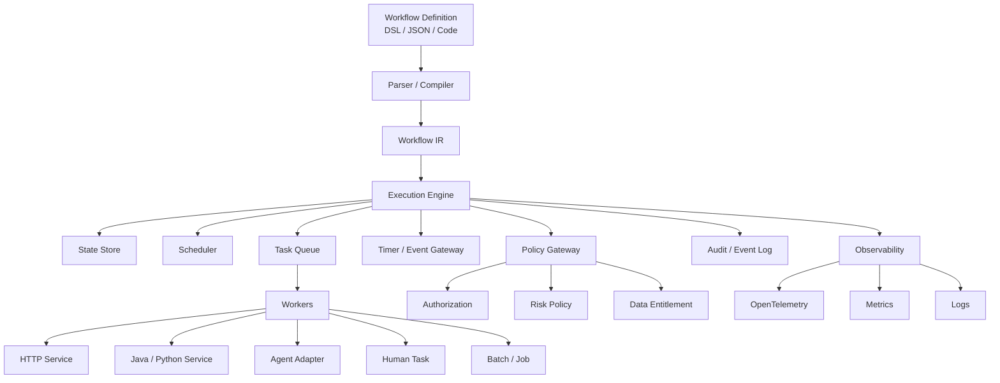
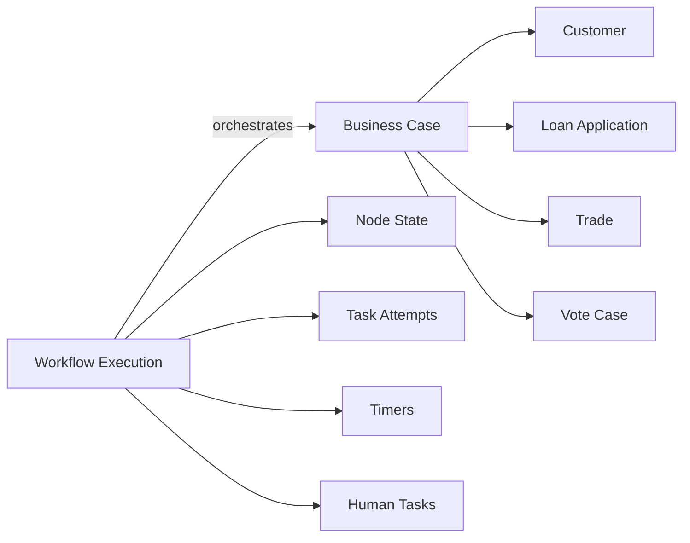
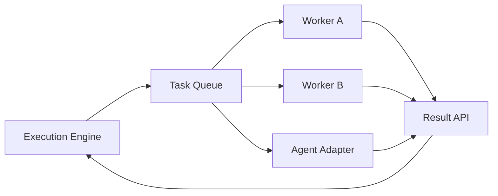
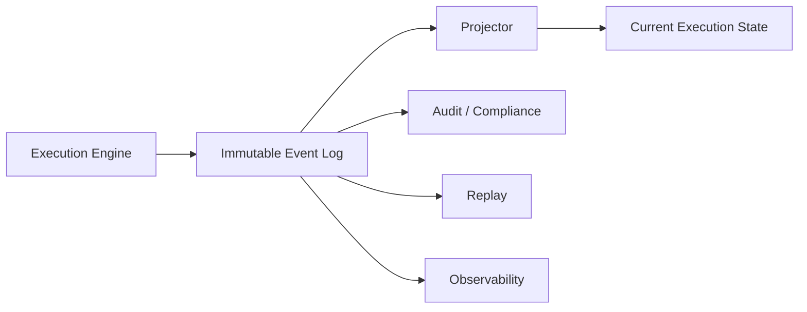
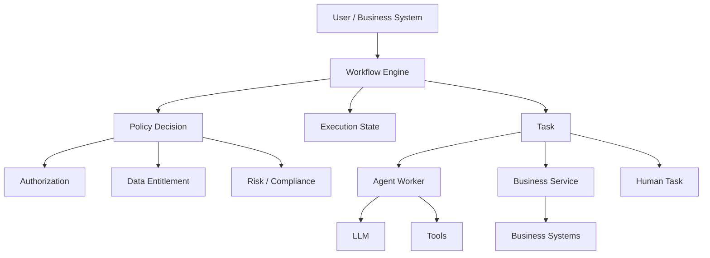
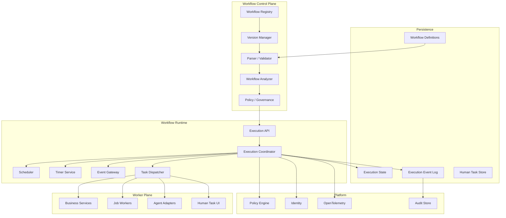
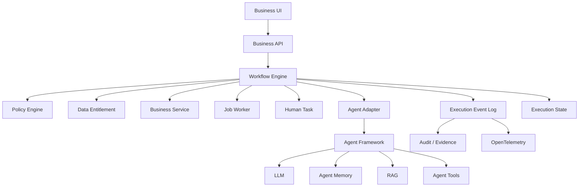

# 如何设计一个与 Agent Framework 无关的 Workflow Engine

## 引言：Workflow Engine 不应该成为 Agent Framework 的另一个名字

过去几年，Workflow 和 Agent 开始快速融合。

一个典型的企业 AI 应用可能长成这样：

```text
User
  ↓
Agent
  ↓
LLM
  ↓
Tool A
  ↓
Tool B
  ↓
Human Approval
  ↓
Tool C
```

于是越来越多的 Agent Framework 开始提供所谓的 Workflow：

* LangGraph 用图组织 Agent、Tool 和节点；
* Microsoft Agent Framework 提供 Workflow、Executor、Edge、HITL、Checkpoint；
* OpenAI Agents SDK 提供 Agent、Runner、Handoff 等编排能力；
* 其他 Agent Framework 也开始增加 sequential、parallel、handoff、orchestration 等能力。

这些方案非常适合解决一个问题：

> **如何让几个 Agent / Tool / LLM 调用按照某种方式协作。**

但这和企业真正意义上的 Workflow Engine 不是一回事。

企业 Workflow Engine 要解决的问题通常是：

> **一个业务流程在未来几小时、几天甚至几年里，如何可靠地推进、暂停、恢复、重试、等待人工、处理外部事件、执行补偿、记录状态、进行版本管理，并且在系统发生故障之后仍然知道下一步应该做什么。**

这也是为什么 Temporal、AWS Step Functions、Camunda、Conductor/Cadence 等系统虽然技术实现差异很大，但核心能力高度相似：持久化执行状态、调度任务、处理失败与重试、支持长时间等待、恢复执行、版本管理以及运行记录。

因此，一个面向企业、尤其是金融服务的 Workflow Engine，比较合理的架构原则应该是：

> **Workflow Engine 应该依赖通用的 Workflow Semantics，而不应该依赖 Agent Semantics。**

换句话说：

```text
Workflow Engine
      │
      ├── HTTP Worker
      ├── Java Service
      ├── Python Job
      ├── SQL Job
      ├── Human Task
      ├── Event Consumer
      ├── AWS Lambda
      ├── MCP Tool Adapter
      └── Agent Adapter
```

Agent 只是 Workflow Engine 可以调度的一种 Worker。

而不是：

```text
Workflow Engine
      ↓
Agent Framework
      ↓
Agent
      ↓
LLM
```

后者会让整个 Workflow Engine 的生命周期、状态模型、错误模型乃至治理模型逐渐被 Agent Framework 绑架。

---

# 一、先定义边界：Workflow Engine 到底负责什么

一个真正通用的 Workflow Engine，可以把职责划分成六层。



其中最重要的一点是：

**Workflow Engine 不应该理解“什么是 LLM”。**

它可以知道一个 Task：

```json
{
  "type": "worker",
  "workerType": "research-agent",
  "input": {}
}
```

但不需要知道：

```json
{
  "model": "gpt-5",
  "temperature": 0.2,
  "systemPrompt": "...",
  "tools": [...]
}
```

后面的信息属于 Agent Runtime 或 Agent Adapter。

Workflow Engine 只需要知道：

```text
Task：
  输入什么？
  调哪个 Worker？
  等多久？
  失败怎么办？
  是否允许重试？
  是否允许并行？
  成功之后走哪里？
  谁可以批准？
  需要满足什么 Policy？
```

这才是稳定边界。

---

# 二、为什么这个边界尤其适合 Agent 时代

Microsoft 自己对 Agent Framework 的描述其实已经非常清楚地区分了 Agent 和 Workflow：Agent Framework 关注 agent runtime、model、instructions、tools、middleware、context、session 等，而 Workflow 则负责将 executors 和 edges 组合成执行图。其最新文档甚至明确支持“Agents in workflows”和“Workflows as agents”两种方向。

这说明一个很有价值的架构关系：

```text
             Workflow
                 │
        ┌────────┼────────┐
        ↓        ↓        ↓
      Agent     Tool    Human
        │
     Agent Runtime
        │
   ┌────┼─────┐
   ↓    ↓     ↓
  LLM  Memory Tools
```

而不是：

```text
Agent
  │
  └── Workflow Engine
          │
          └── Business Process
```

两种设计的区别不是“有没有 Workflow”。

区别是：

> **谁拥有业务流程的生命周期。**

如果 Agent 拥有 Workflow，那么流程状态实际上会被分散在：

* Agent memory；
* agent session；
* model output；
* tool calls；
* framework-specific checkpoints；
* prompt；
* application state。

这样会越来越难回答一个最简单的问题：

> **这个业务 Case 当前到底处于什么状态？**

对于普通聊天应用，这可能并不严重。

对于贷款审批、KYC、交易处理、客户投诉、Corporate Action、Trade Exception、合规调查等金融流程，这是非常危险的设计。

---

# 三、Workflow Engine 的核心对象应该是 Execution，而不是 Agent

一个通用 Workflow Engine 至少应该有以下几个核心对象：

```text
WorkflowDefinition
WorkflowVersion
WorkflowExecution
NodeExecution
TaskAttempt
WorkflowEvent
Timer
HumanTask
PolicyDecision
```

其中最重要的是 `WorkflowExecution`。

例如：

```json
{
  "executionId": "wfexec_123",
  "workflowId": "investment-review",
  "workflowVersion": "42",
  "status": "WAITING_APPROVAL",

  "businessKey": "case-92837",

  "startedAt": "...",
  "updatedAt": "...",

  "currentNodes": [
    "risk-approval"
  ],

  "inputRef": "object://workflow-input/123",
  "stateRef": "object://workflow-state/456",

  "correlationId": "case-92837"
}
```

这里没有：

```text
agentId
modelId
prompt
memoryId
toolChoice
```

不是说这些东西不重要。

而是它们不应该定义 Workflow Engine 的核心语义。

---

# 四、Workflow State 和 Business State 必须分开

这是设计 Workflow Engine 时一个非常重要的边界。

例如：

```text
Workflow State

SUBMITTED
   ↓
KYC_PENDING
   ↓
RISK_REVIEW
   ↓
HUMAN_APPROVAL
   ↓
APPROVED
   ↓
COMPLETED
```

这是 Workflow Engine 的状态。

而：

```text
Loan Application

customerId
loanAmount
creditScore
interestRate
riskLevel
approvalAmount
```

是 Business Domain 的状态。

两者不能混成一个东西。

推荐关系：



Workflow Engine 保存：

> “下一步应该做什么？”

业务系统保存：

> “业务对象现在是什么？”

这个区别非常重要。

否则最终会出现：

```text
Workflow DB
    ↓
Customer
    ↓
Trade
    ↓
Approval
    ↓
Risk Score
    ↓
Payment
```

Workflow Engine 最终变成另一个巨型业务数据库。

---

# 五、Workflow Engine 最核心的能力不是 DAG，而是 Durable Execution

很多“Workflow Engine”实际上只做了一件事情：

```text
A → B → C
```

这其实只是 DAG Executor。

真正的 Workflow Engine 要解决：

```text
A
 ↓
B
 ↓
等待 3 天
 ↓
收到外部事件
 ↓
C
 ↓
C 失败
 ↓
Retry
 ↓
还是失败
 ↓
Compensation
 ↓
人工介入
 ↓
Resume
```

也就是说，Workflow Engine 的本质更接近：

> **一个持久化的、可恢复的分布式状态机。**

Temporal 强调 crash-proof execution；Azure Durable Task/Functions 通过 checkpoint、history 和 durable orchestration 保持长期执行；Conductor 将 scheduling、retry、state persistence 放在 engine 侧，而 Worker 专注业务逻辑。

因此最核心的执行循环应该类似：

```text
Load Execution
      ↓
Read Current State
      ↓
Evaluate Workflow
      ↓
Persist State Transition
      ↓
Schedule Next Work
      ↓
Wait
      ↓
Worker Result / Timer / Event
      ↓
Resume
```

而不是：

```text
while (!done) {
    agent.run();
}
```

---

# 六、Execution Engine 应该是 deterministic 的

这是 Workflow Engine 和 Agent Runtime 最本质的区别之一。

Agent 可以：

```text
同样输入
    ↓
不同模型输出
    ↓
不同下一步
```

Workflow Engine 则应该尽可能：

```text
当前 State
+
Workflow Version
+
Event
+
Policy Result
    ↓
确定下一状态
```

例如：

```text
RISK_SCORE = 82

IF score >= 80
    → HUMAN_APPROVAL

IF score < 80
    → AUTO_APPROVAL
```

应该由 Workflow / Policy 定义。

而不是让 Agent 自己决定：

> “我觉得 82 分应该走人工审批。”

这并不是因为 LLM 没有能力做这个事情，而是因为：

> **业务流程控制和概率性推理应该属于不同的控制边界。**

2026 年 Bank of England AI Consortium 的讨论已经明确关注这一点：在 Agentic AI 系统中，需要考虑将 LLM 的概率性推理和确定性的系统动作分开，并为 Agent 行为设置明确的执行边界。该页面同时明确说明这些讨论属于参与成员观点，并不代表 Bank/FCA 政策。

---

# 七、不要追求“整个 Workflow Exactly Once”

这是 Workflow Engine 设计中很容易犯的错误。

所谓：

```text
Exactly Once
```

必须先问：

> **Exactly once 什么？**

Workflow transition：

```text
A → B
```

可以做到非常强的幂等语义。

Task dispatch：

```text
Engine → Worker
```

可能发生：

```text
送出
Worker 已执行
Engine 没收到结果
重新送出
```

于是 Worker 可能执行两次。

因此真正的架构应该明确区分：

```text
Workflow transition
        ↓
Task dispatch
        ↓
Task execution
        ↓
External side effect
```

每一层的语义不同。

AWS Step Functions Standard Workflow 对自身 workflow execution 提供 exactly-once 模型，而 Express Workflow 则分别使用 at-least-once / at-most-once 模型；AWS 同时明确区分了 retry、idempotency 等问题。AWS Durable Execution 文档也明确指出，retry/replay 可能让具有副作用的操作执行多次，因此副作用步骤必须考虑幂等。

因此一个合理的 Worker Contract 不应该只返回：

```json
{
  "status": "success"
}
```

而应该带有稳定的：

```json
{
  "executionId": "wfexec-123",
  "nodeExecutionId": "nodeexec-456",
  "attempt": 2,
  "idempotencyKey": "wfexec-123:payment:2",

  "status": "SUCCEEDED",

  "output": {}
}
```

对于金融交易尤其如此。

---

# 八、Task Contract 应该比 Agent Contract 更稳定

Workflow Engine 不应该定义：

```typescript
interface Agent {
  run(...)
}
```

而应该定义更通用的：

```typescript
interface Worker {
  execute(task: Task): Promise<TaskResult>
}
```

例如：

```typescript
interface Task {
  executionId: string;
  nodeExecutionId: string;

  workerType: string;
  input: unknown;

  deadline?: string;
  idempotencyKey: string;

  attempt: number;

  metadata: {
    tenantId: string;
    correlationId?: string;
    traceId?: string;
  };
}

interface TaskResult {
  status:
    | "SUCCEEDED"
    | "FAILED"
    | "RETRYABLE_FAILED"
    | "WAITING";

  output?: unknown;

  error?: {
    code: string;
    message: string;
    retryable: boolean;
  };
}
```

Worker 可以是：

```text
HTTP Worker
Java Worker
Python Worker
SQL Worker
Lambda Worker
Human Worker
Agent Worker
MCP Worker
Batch Worker
```

Conductor 的 Worker 模型就是这种典型思路：Worker 可以用不同语言部署在 Workflow Engine 外部，由 Engine 负责任务调度、重试和状态持久化，Worker 负责业务逻辑。

这也是 Workflow Engine 与 Agent Framework 解耦的真正技术基础。

---

# 九、Agent 应该成为一个 Adapter，而不是 Engine Primitive

在 Agent 时代，一个 Workflow Engine 当然应该支持 Agent。

但推荐做成：

```text
                    Workflow Engine
                         │
                   Generic Worker API
                         │
        ┌────────────────┼─────────────────┐
        ↓                ↓                 ↓
   Java Worker       HTTP Worker      Agent Worker
                                           │
                                  ┌────────┼────────┐
                                  ↓        ↓        ↓
                               LangGraph  DeepAgents  Custom
                                  ↓        ↓        ↓
                                 LLM      LLM       LLM
```

这样：

```text
Workflow Engine
```

不知道：

```text
LangChain
LangGraph
DeepAgents
OpenAI Agents SDK
Microsoft Agent Framework
CrewAI
AutoGen
```

Agent Adapter 才负责：

```text
Workflow Task
      ↓
Agent Runtime
      ↓
Agent execution
      ↓
Structured result
      ↓
Workflow TaskResult
```

因此可以很容易替换：

```text
DeepAgents
   ↓
OpenAI Agents
```

或者：

```text
LangGraph
   ↓
Custom Agent Runtime
```

而不需要修改 Workflow Engine。

这是“Agent Framework independent”真正应该追求的结果。

---

# 十、Workflow Engine 不应该拥有 Agent 的内部 Loop

一个 Agent 可以：

```text
Think
 ↓
Tool
 ↓
Observe
 ↓
Think
 ↓
Tool
 ↓
Think
 ↓
Answer
```

这是 Agent Runtime 的内部 execution loop。

Workflow Engine 看见的应该只有：

```text
┌─────────────────────────────┐
│ Execute Agent Task          │
│                             │
│ Input                       │
│ Timeout                     │
│ Retry Policy                │
│ Authorization Context       │
│ Idempotency Key             │
└──────────────┬──────────────┘
               ↓
        Agent Runtime
               ↓
       Structured Output
```

于是：

```text
Workflow Engine
```

关心：

> 这个 Agent Task 成功了吗？

而：

```text
Agent Runtime
```

关心：

> 这个 Task 内部需要调用几个模型和几个 Tool？

这两个问题应该分开。

OpenTelemetry 当前的 GenAI semantic conventions 也正在逐渐形成类似的层次：除了 agent span、tool invocation 等概念，还专门定义了 `invoke_workflow`，用于表示由多个 Agent 或 GenAI operation 组成的协调流程。

这说明 Workflow 与 Agent 已经越来越明显地成为两个不同的观测层次。

---

# 十一、Workflow DSL 不是核心，Workflow IR 才是核心

一个 Workflow Engine 可以支持：

```text
YAML
JSON
BPMN
Markdown DSL
TypeScript
Java
Python
UI Builder
```

真正重要的不是这些输入格式。

应该有一个 Canonical Workflow Model：

```text
DSL / Code / BPMN
       ↓
     Parse
       ↓
     AST
       ↓
   Validate
       ↓
 Canonical IR
       ↓
   Analyze
       ↓
 Execution Plan
```

例如：

```json
{
  "workflow": "trade-review",
  "version": 17,

  "nodes": [
    {
      "id": "risk-check",
      "type": "task",
      "worker": "risk-service"
    },
    {
      "id": "approval",
      "type": "humanTask",
      "role": "portfolio-manager"
    },
    {
      "id": "submit",
      "type": "task",
      "worker": "trade-service"
    }
  ],

  "edges": [
    {
      "from": "risk-check",
      "to": "approval"
    },
    {
      "from": "approval",
      "to": "submit",
      "condition": "approved == true"
    }
  ]
}
```

这个 IR 才应该是：

* Runtime 的输入；
* Validator 的输出；
* Analyzer 的输入；
* Visualization 的输入；
* Simulation 的输入；
* Replay 的基础；
* Audit 的 Workflow Definition Reference。

这样才能避免：

```text
UI 有一套 Workflow Model
Agent Framework 又有一套
Runtime 再有一套
Audit 再存一份 JSON
```

最后出现五套语义。

---

# 十二、Workflow Engine 应该拥有自己的 Node Type System

最小的 Node Type 不应该是：

```text
Agent
LLM
Prompt
Tool
Memory
```

而应该是：

```text
Start
End

Task
Parallel
Condition
Loop

Wait
Timer
Event

HumanTask
Approval

SubWorkflow

Compensation
```

然后：

```text
Agent
```

只是：

```text
Task.workerType = "agent"
```

例如：

```yaml
nodes:

  - id: analyze
    type: task
    worker:
      type: agent
      name: research-agent

  - id: approval
    type: humanTask
    role: portfolio-manager

  - id: execute
    type: task
    worker:
      type: trade-service
```

这样 Workflow Language 可以保持通用。

---

# 十三、Human Task 应该是 Workflow Primitive

金融流程经常需要：

```text
自动分析
   ↓
人工审核
   ↓
批准
   ↓
执行
```

因此 Human Task 不应该由 Agent Framework 自己实现。

应该由 Workflow Engine 原生实现：

```text
Workflow
   ↓
HumanTask
   ↓
WAITING
   ↓
Human completes task
   ↓
RESUME
```

Camunda 的 User Task 就采用了这种模型：流程到达 User Task 后，创建 Human Task instance，流程暂停，待人工完成后继续执行。

这比：

```text
Agent → “请用户批准”
```

强很多。

因为后者只是一条消息。

前者才是一个有状态的业务控制点：

```text
approvalTaskId
assignee
candidateGroup
createdAt
dueAt
decision
decisionBy
decisionAt
comments
```

---

# 十四、Wait 应该是一等公民

Workflow Engine 最容易被低估的能力其实是：

```text
WAIT
```

例如：

```text
发出 Trade Request
        ↓
等待 Counterparty Confirmation
        ↓
收到 Event
        ↓
继续 Workflow
```

或者：

```text
Document Submitted
        ↓
等待 24 小时
        ↓
如果没有 Response
        ↓
Escalate
```

如果没有 Durable Wait，开发团队往往会写成：

```text
while (!condition) {
  sleep(60s)
}
```

这是典型错误。

正确模型应该是：

```text
WAITING
  ↓
Persist
  ↓
释放 Worker
  ↓
Timer / Event
  ↓
Resume
```

Google Workflows、Conductor、Step Functions 等系统都提供 callback / event / wait 等长期等待模型。

---

# 十五、Scheduler 与 Worker 必须分离

不要设计成：

```text
Workflow Engine
    │
    └──直接调用 Worker HTTP
```

更稳妥的是：



这样可以把：

```text
Workflow concurrency
```

和：

```text
Worker concurrency
```

分开。

例如：

```text
RiskCheck
maxConcurrent = 50

TradeSubmit
maxConcurrent = 5

ResearchAgent
maxConcurrent = 20
```

这对于金融系统很重要。

因为：

```text
LLM 可以突然扩容 1000 个并发任务
```

并不意味着：

```text
Trade API
```

也可以承受 1000 个并发请求。

Workflow Engine 应该能够成为一个系统级的 backpressure boundary。

Conductor 对 task queue、concurrency limit、rate limiting、task domain 都提供了类似机制。

---

# 十六、Retry 不应该是一个简单数字

很多 Workflow 定义只有：

```yaml
retry: 3
```

这远远不够。

真正应该定义：

```yaml
retry:
  maxAttempts: 5
  backoff:
    type: exponential
    initial: 2s
    max: 60s
    jitter: 20%

  retryableErrors:
    - TIMEOUT
    - HTTP_429
    - TRANSIENT_NETWORK_ERROR

  nonRetryableErrors:
    - AUTHORIZATION_DENIED
    - INVALID_TRADE
    - POLICY_DENIED
```

Google Workflows、Conductor 等系统都把 retry predicate、maximum attempts、backoff、timeouts 等作为独立配置。

更重要的是：

> Retry 是技术语义，不是业务补偿。

例如：

```text
Payment API timeout
```

可以 retry。

但：

```text
Trade successfully submitted
Engine 没收到 response
```

不能简单 retry。

这时需要：

```text
Query Trade Status
       ↓
确定是否已经提交
       ↓
决定是否继续
```

因此：

```text
Retry
```

与：

```text
Recovery
Compensation
Reconciliation
```

必须分开。

---

# 十七、Workflow Engine 应该支持 Compensation，但不要假装拥有分布式事务

金融业务经常出现：

```text
A 成功
B 成功
C 失败
```

如果：

```text
A、B、C
```

跨多个服务，就不能指望一个数据库 transaction 解决问题。

因此 Workflow Engine 可以表达：

```text
A
↓
B
↓
C

C failed
 ↓
Compensate B
 ↓
Compensate A
```

即 Saga。

但要注意：

> Workflow Engine 只负责编排 Compensation，不应该自己定义每个业务补偿动作的业务含义。

例如：

```text
CancelPayment
ReverseTrade
ReleaseReservation
RollbackPosition
```

都应该由业务服务提供。

Google Cloud Workflows 的官方最佳实践也将 Saga 作为跨服务一致性的处理方式之一。

---

# 十八、Versioning 是企业 Workflow Engine 的核心能力，不是 DevOps 附属功能

Workflow 修改之后，一个很关键的问题是：

> 已经运行中的 Workflow 怎么办？

假设：

```text
Workflow v1
A → B → C
```

现在发布：

```text
Workflow v2
A → B → Approval → C
```

昨天启动的 Execution：

```text
Execution #1001
Workflow Version = v1
```

今天启动：

```text
Execution #1042
Workflow Version = v2
```

这是最简单、最安全的模型。

因此：

```text
Workflow Version
```

必须成为：

```text
WorkflowExecution
```

不可缺少的属性。

AWS Step Functions 支持不可变 State Machine Version，并可以将 Execution 与具体版本或 Alias 关联；Camunda 也明确规定新实例默认使用新版本，而运行中的实例继续按照启动时使用的版本运行。

推荐：

```text
WorkflowDefinition
      │
      ├── Version 1
      ├── Version 2
      ├── Version 3
      └── Version 4
```

Execution：

```json
{
  "workflowId": "trade-review",
  "workflowVersion": 3
}
```

而不是：

```json
{
  "workflowId": "trade-review"
}
```

然后每次 resume 都重新读取 latest。

后者会导致长期运行的 Case 在中途悄悄改变业务规则。

---

# 十九、Long-running Workflow 更应该考虑 Version Pinning

金融 Workflow 很可能运行：

```text
数小时
数天
数周
甚至数月
```

因此：

```text
Execution
```

与：

```text
Workflow Version
```

之间必须明确关系。

Camunda 特别提醒，长期运行流程会增加版本演进与迁移的复杂性，并建议在合适的边界把超长期流程切分成多个 Process；其文档甚至举例说明某些关键阶段可能需要固定使用特定版本，而其他阶段可以跟随最新版本。

这也是为什么金融 Workflow Engine 不应该只考虑：

```text
Deploy latest
```

还应该考虑：

```text
Pin version
Migrate instance
Continue old version
Explicit upgrade
```

---

# 二十、Replay 应该是 Engine Capability，而不是 Agent Feature

Workflow Engine 应该能够回答：

```text
2026-09-20 10:21
Workflow 为什么走到了 Approval？
```

至少需要知道：

```text
Workflow Version
Node
Input
Previous State
Event
Condition Result
Policy Result
Worker Result
Timestamp
Attempt
```

例如：

```text
Execution 92837

v42

risk-check
  ↓
score = 82

Policy:
  score >= 80
  ↓
true

Next:
  human-approval
```

这和：

```text
“让同一个 Agent 再跑一次”
```

完全不是一回事。

因为 Agent Replay 可能由于：

```text
model changed
prompt changed
tool result changed
retrieval data changed
```

得到不同结果。

Workflow Replay 的核心应该是：

> **重建 Workflow Engine 对 Execution State 的解释。**

而不是：

> **重新让 LLM 思考一次。**

---

# 二十一、建议使用 Event Log + Materialized State 的混合模型

Workflow State 最稳妥的存储方式通常不是纯 JSON overwrite。

例如：

```text
workflow_execution
------------------
execution_id
workflow_id
workflow_version
status
current_state
updated_at
```

同时保存：

```text
workflow_event
--------------------
event_id
execution_id
sequence
event_type
node_id
payload_ref
timestamp
```

例如：

```text
1  WORKFLOW_STARTED
2  TASK_SCHEDULED
3  TASK_STARTED
4  TASK_COMPLETED
5  POLICY_EVALUATED
6  HUMAN_TASK_CREATED
7  HUMAN_TASK_COMPLETED
8  TASK_SCHEDULED
```

然后：

```text
Current State
```

是 event stream 的 materialized view。

架构：



这里不一定需要做成完整 Event Sourcing 系统。

更实际的实现是：

> **Snapshot + Append-only Event Log**

即：

```text
Current State
+
Immutable Event History
```

兼顾运行效率和审计/恢复能力。

---

# 二十二、Audit Log 与 Observability 不应该混为一谈

Workflow Engine 通常需要同时拥有：

```text
Observability
Audit
```

但是二者不是一回事。

Observability 关心：

```text
为什么这么慢？
哪里失败？
哪个 Worker latency 高？
```

Audit 关心：

```text
谁启动了 Workflow？
使用哪个版本？
谁批准？
什么数据被访问？
执行了什么动作？
什么时候执行？
哪个 Policy 允许？
```

Camunda 的 Audit Log 明确记录 operation、actor、timestamp、entity 等信息，并用于审计和调查；OpenTelemetry 则主要解决跨系统 trace、metrics、logs 的统一语义。

因此：

```text
LangSmith trace
OpenTelemetry trace
CloudWatch log
```

不能自动等同于：

```text
Regulatory Audit Evidence
```

Workflow Engine 应该拥有自己的：

```text
Execution Evidence
```

并且最好保存：

```text
workflowVersion
nodeVersion
workerVersion
policyVersion
authorizationContext
inputReference
outputReference
actor
timestamp
result
```

---

# 二十三、金融场景中，Policy 应该位于 Workflow 和 Worker 之间

不能设计成：

```text
Agent
 ↓
Tool
 ↓
Execute Trade
```

推荐：

```text
Workflow
   ↓
Task
   ↓
Policy Decision
   ↓
Authorized?
 ┌───────┴────────┐
YES               NO
 ↓                 ↓
Worker          DENY / REVIEW
```

即：

```text
Workflow
   │
   ├── Policy
   │
   └── Worker
```

但 Policy Engine 仍然应该独立。

Workflow Engine 不应该自己变成：

```text
RBAC Engine
ABAC Engine
Data Entitlement Engine
Risk Engine
Trade Compliance Engine
```

更合理的是：

```text
Workflow Engine
      │
      ↓
Policy Decision Point
      │
      ↓
Policy Decision
```

Workflow Engine 只负责：

```text
如果 Policy = DENY
    → stop

如果 Policy = REVIEW
    → HumanTask

如果 Policy = ALLOW
    → schedule worker
```

这样：

```text
Policy
```

和：

```text
Workflow
```

都能够独立演进。

---

# 二十四、为什么金融服务尤其需要这一层

FINRA 2026 年关于 GenAI 的监管报告指出，金融机构使用 GenAI 时仍然受到既有监督、记录保存、治理等要求约束，并建议建立正式的 review/approval、治理或模型风险框架、全面文档、测试和持续监控；针对 Agent，还特别提出 autonomous action、scope and authority、auditability、data sensitivity，以及跟踪 Agent action/decision 和设置 guardrails 等问题。

DORA 则明确要求金融实体建立文档化的 ICT change management controls，确保 ICT 变化被记录、测试、评估、批准、实施和验证；同时要求具备恢复能力并保留相关记录。

因此对于金融 Workflow：

```text
Workflow Version
+
Execution History
+
Approval
+
Policy Decision
+
Worker Result
+
Recovery
```

并不是“为了 AI 做得更漂亮”。

它们实际上和传统金融 IT 的 operational resilience、change management、supervision、auditability 是同一类基础能力。

---

# 二十五、Workflow Engine 的安全边界应该怎么设计

建议形成下面这个层次：



这里最关键的方向是：

```text
LLM
 ↓
Proposal

Policy
 ↓
Permission

Workflow
 ↓
Execution
```

而不是：

```text
LLM
 ↓
Decide
 ↓
Execute
```

这会让 Agent 的自主性被限制在正确的位置：

> Agent 可以自主推理，但不能通过自主推理修改 Workflow 的授权边界。

---

# 二十六、Data Entitlement 也不应该存在 Agent Memory 中

例如：

```text
Agent
  ↓
Search
  ↓
Document
```

不能仅仅依赖 Agent Prompt：

```text
“请不要访问敏感数据。”
```

正确架构是：

```text
Workflow Task
   ↓
Identity
   ↓
Data Entitlement
   ↓
Retrieval
   ↓
Authorized Data
```

Workflow Engine 可以携带：

```text
subject
tenant
businessCase
authorizationContext
classification
```

但真正的 Data Entitlement 应该由专门的 Policy / Data Access 层决定。

这样：

```text
Agent Framework
```

替换了，也不会改变企业数据边界。

---

# 二十七、Workflow Engine 的 Kill Switch 应该是 Execution Control

金融 Agent 特别需要一个明确的：

```text
STOP
PAUSE
CANCEL
SUSPEND
```

边界。

但不要简单理解成：

```text
kill entire server
```

更合理的是：

```text
Workflow
     ↓
Execution
     ↓
STOP
```

例如：

```text
PAUSE execution
CANCEL future tasks
BLOCK new side effects
ALLOW currently running task to finish
REQUIRE manual resume
```

这样才能做到：

```text
Stop Agent
```

而不是：

```text
Stop the entire financial platform
```

Bank of England AI Consortium 对 Agentic AI 的讨论也特别关注执行边界、human-in-the-loop、wargaming 和 kill-switch/circuit-breaker 等控制问题，同时指出控制本身也可能产生系统性副作用。

因此，Kill Switch 也应该成为 Workflow Control Plane 的能力，而不是 Agent Framework 的一个 UI button。

---

# 二十八、Workflow Engine 的推荐内部架构

一个中大型企业可以使用下面的结构：



其中：

### Control Plane

负责：

```text
Workflow Definition
Version
Validation
Analysis
Governance
Deployment
```

### Runtime

负责：

```text
Execution
Scheduling
State Transition
Timer
Event
Task Dispatch
Recovery
```

### Worker Plane

负责：

```text
真正的业务动作
```

### Policy Plane

负责：

```text
谁可以做
什么条件下可以做
访问什么数据
什么操作需要审批
```

### Evidence / Observability Plane

负责：

```text
发生了什么
```

---

# 二十九、Control Plane 与 Runtime 要分开

Workflow Definition：

```text
trade-review v42
```

属于 Control Plane。

而：

```text
execution-92837
```

属于 Runtime。

所以推荐：

```text
                 Control Plane
                       │
                Workflow v42
                       │
                       ▼
              ┌────────────────┐
              │ Runtime        │
              │                │
              │ Execution 92837│
              │ Execution 92838│
              │ Execution 92839│
              └────────────────┘
```

这样可以：

```text
deploy new workflow
```

而不破坏：

```text
running executions
```

也便于：

```text
approval
rollback
version pinning
simulation
testing
```

---

# 三十、Workflow Definition 应该 immutable

推荐：

```text
draft
  ↓
validated
  ↓
approved
  ↓
published
  ↓
immutable version
```

例如：

```text
trade-review
 ├── v40
 ├── v41
 ├── v42
 └── v43
```

而不是：

```text
trade-review
 └── latest.json
```

因为：

```text
Execution 1001
```

必须始终能够回答：

> “当时运行的到底是什么？”

AWS Step Functions 的 Version/Revision/Alias 模型和 Camunda 的 process definition versioning 都体现了类似思想。

---

# 三十一、Analyzer 应该检查 Workflow，而不是运行 Workflow

前面所说的：

```text
Parse
Validate
Analyze
```

在 Workflow Engine 中非常有价值。

例如 Analyzer 可以发现：

```text
Error:
non-idempotent task has retry enabled
```

或者：

```text
Warning:
human approval has no timeout
```

或者：

```text
Error:
high-risk task can bypass policy node
```

或者：

```text
Warning:
workflow version references mutable worker
```

例如：

```text
Agent Analysis
```

并不需要成为 Workflow Engine。

Workflow Engine 自己可以检查：

```text
graph
path
state
retry
timeout
policy
version
compensation
```

而 Agent Framework 只负责：

```text
Agent execution
```

这样 Analyzer 可以在部署前就阻止明显错误。

---

# 三十二、不要让 LLM 成为 Workflow Validator

这是 Agent 时代一个非常重要的反模式。

错误方式：

```text
Workflow DSL
   ↓
LLM
   ↓
“看起来没问题”
   ↓
Deploy
```

正确：

```text
Workflow DSL
   ↓
Parser
   ↓
Schema Validation
   ↓
Graph Validation
   ↓
Static Analysis
   ↓
Policy Analysis
   ↓
Human Governance
   ↓
Deploy
```

LLM 可以用来：

```text
解释错误
生成 Workflow
修改 Workflow
辅助设计
生成 documentation
```

但最终：

```text
是否允许部署
```

应该由：

```text
Deterministic Validation
+
Governance Policy
```

决定。

---

# 三十三、Reference Implementation：最小可行 Workflow Engine

如果自己实现，而不是直接采用 Temporal / Step Functions / Camunda / Conductor，一个合理的第一版不应该太复杂。

可以从：

```text
API
+
PostgreSQL
+
Queue
+
Worker SDK
```

开始。

例如：

```text
PostgreSQL

workflow_definition
workflow_version

workflow_execution
node_execution
task_attempt

workflow_event
human_task
timer
```

Execution API：

```http
POST /workflow-definitions
POST /workflow-definitions/{id}/versions
POST /workflow-executions
GET  /workflow-executions/{id}
POST /workflow-executions/{id}/cancel
POST /workflow-executions/{id}/pause
POST /workflow-executions/{id}/resume
POST /workflow-executions/{id}/redrive
```

Worker API：

```http
POST /tasks/claim
POST /tasks/{id}/heartbeat
POST /tasks/{id}/complete
POST /tasks/{id}/fail
```

Event API：

```http
POST /workflow-executions/{id}/events
```

Human Task：

```http
GET  /human-tasks
POST /human-tasks/{id}/complete
POST /human-tasks/{id}/reject
```

---

# 三十四、第一版 Runtime Loop 可以非常简单

例如：

```typescript
async function advanceExecution(executionId: string) {
  const execution = await stateStore.loadExecution(executionId);

  const workflow = await definitionStore.load(
    execution.workflowId,
    execution.workflowVersion
  );

  const events = await eventStore.getAfter(
    executionId,
    execution.lastSequence
  );

  const state = reducer.reduce(
    execution.snapshot,
    events
  );

  const decisions = evaluator.evaluate(
    workflow,
    state
  );

  await transaction(async tx => {
    await tx.appendEvents(
      executionId,
      decisions.events
    );

    await tx.updateSnapshot(
      executionId,
      decisions.newState
    );

    await tx.scheduleTasks(
      decisions.tasks
    );
  });
}
```

这里有一个非常关键的设计：

```text
Evaluator
```

不直接执行 Worker。

它只产生：

```text
State Transition
+
Commands
```

例如：

```json
{
  "events": [
    {
      "type": "TASK_SCHEDULED",
      "nodeId": "risk-check"
    }
  ],

  "commands": [
    {
      "type": "DISPATCH_TASK",
      "workerType": "risk-service"
    }
  ]
}
```

这样：

```text
Workflow State Machine
```

和：

```text
Task Execution
```

彻底解耦。

---

# 三十五、数据库事务应该围绕 State Transition 设计

典型的事务边界：

```text
BEGIN

lock execution

read current version

append event

update execution state

create task record

COMMIT
```

然后再：

```text
publish queue message
```

这里需要注意经典的：

```text
DB commit succeeded
Queue publish failed
```

问题。

因此通常需要：

```text
Transactional Outbox
```

模型：

```text
DB Transaction
 ├── workflow state
 ├── execution event
 └── outbox message
          ↓
       Outbox Publisher
          ↓
       Queue
```

这样：

```text
Workflow State
```

和：

```text
Task Dispatch Intent
```

可以保持一致。

这比在 Workflow Runtime 中直接：

```typescript
await db.commit();
await queue.send();
```

可靠得多。

---

# 三十六、不要一开始就做成“万能 Workflow Language”

一个成熟 Workflow Engine 的危险不是功能太少，而是 DSL 很快膨胀：

```text
Agent
Prompt
Memory
RAG
VectorStore
MCP
Browser
Python
CodeAct
Reflection
Planning
Supervisor
Handoff
ReAct
...
```

最终 DSL 就变成另一个 Agent Framework。

更合理的是保持核心语言很小：

```text
Task
Condition
Parallel
Loop
Wait
Timer
HumanTask
Event
SubWorkflow
Compensation
Retry
Timeout
```

然后通过 Worker Adapter 扩展能力：

```text
Agent Worker
MCP Worker
HTTP Worker
SQL Worker
Kafka Worker
Python Worker
```

Workflow Engine 核心保持稳定。

---

# 三十七、Workflow Engine 与 Agent Framework 的正确组合

最终比较推荐的整体架构是：



这里的分层关系是：

```text
Business
   ↓
Workflow
   ↓
Task
   ↓
Worker
   ↓
Agent / Service
```

而不是：

```text
Business
   ↓
Agent
   ↓
Workflow
```

---

# 三十八、几个真实案例说明这种架构并非理论

## Capital One：金融业务直接使用 Workflow Orchestration

AWS 的案例显示，Capital One 使用 Step Functions 编排支票清算流程，并利用 Distributed Map 将并行处理能力从原来的最多 40 个并行迭代扩展到可发起最多 10,000 个并行 workflow；AWS 报告称该方案使支票处理总体时间最多降低 80%。其中一部分支票仍然需要人工审核，说明 Workflow 同时承载自动处理和人工介入。

这个案例的重要点不是 AWS，而是：

```text
Workflow
  ├── automated processing
  ├── parallel execution
  └── human review
```

本身就是独立于 Agent 的业务基础设施。

---

## OneMain Financial：Workflow Engine 用于 Security Operations

OneMain Financial 使用 Step Functions 构建 OneFor(ensics) 数字取证系统，将安全调查流程自动化。AWS 报告称，从告警到调查的时间降低了 97.5%。

这个场景甚至与 Agent 没有必要关系：

```text
Security Event
    ↓
Collect Evidence
    ↓
Run Analysis
    ↓
Generate Findings
    ↓
Investigation
```

说明 Workflow Engine 的价值本身并不来自 AI。

---

## Liberty Mutual：Workflow 作为 Financial Central Services 的基础设施

Liberty Mutual 使用 Step Functions 编排来自不同业务线的数据处理和金融交易事件，形成集中式 Financial Central Services；AWS 案例描述其每月底一次运行可处理 100 million transactions。

这类场景说明：

> Workflow Engine 可以成为企业金融系统的一层通用 orchestration infrastructure，而不是 AI infrastructure。

---

## Uber / Cadence：Workflow 与 Activity 的分离

Uber 对 Cadence 的介绍把 Workflow 和 Activity 明确分开：

```text
Workflow
    ↓
Coordination Logic

Activity
    ↓
Business Logic
```

这也是非常值得借鉴的模型。Uber 的公开工程文章还特别讨论了 workflow 与 activity 之间应该如何划分职责。

虽然 Cadence 最初并非为 Agent 设计，但它所体现的正是：

> **Orchestration 与 Work Execution 分离。**

这恰恰适合作为 Agent 时代 Workflow Engine 的基础。

---

# 三十九、那么 Temporal、Step Functions、Camunda、Conductor 到底是什么关系？

它们并不是同一种产品。

| 系统                 | 核心模型                  | Workflow 定义 | 典型特点                            |
| ------------------ | --------------------- | ----------- | ------------------------------- |
| Temporal           | Durable Code Workflow | Code        | Durable execution、replay、worker |
| AWS Step Functions | State Machine         | JSON/ASL    | Managed、AWS 集成、Version/Alias    |
| Camunda            | Process Orchestration | BPMN/DMN    | Human Task、业务流程、治理              |
| Conductor          | Task Orchestration    | JSON DSL    | Worker Queue、任务调度               |
| Cadence            | Durable Workflow      | Code        | Uber 系、Workflow/Activity        |

它们的共同点比表面差异更重要：

```text
Workflow Definition
        ↓
Execution State
        ↓
Task Scheduling
        ↓
Durable Persistence
        ↓
Failure Recovery
        ↓
Worker Execution
```

这才是一个通用 Workflow Engine 的真正抽象。

---

# 四十、为什么不应该直接把 LangGraph / Agent Framework 当企业 Workflow Engine

这不是说这些框架不好。

恰恰相反，它们非常适合：

```text
Agent collaboration
Tool orchestration
LLM-driven routing
Agent handoff
AI-specific state
```

问题在于，它们的核心抽象仍然围绕：

```text
Agent
Model
Tool
Context
Conversation
```

例如 Microsoft Agent Framework 的 Workflow 就允许 Agent、Tool、HTTP、MCP 和 Human-in-the-loop 等动作混合在 Workflow 中；它还支持 workflow-as-agent。这对 Agent application 非常自然。

但企业 Workflow Engine 的核心抽象应该是：

```text
Execution
State
Task
Event
Timer
Human Task
Policy
Version
Recovery
Audit
```

所以更合理的关系是：

```text
Enterprise Workflow Engine
          │
          ├── Agent Framework A
          ├── Agent Framework B
          ├── Agent Framework C
          ├── Java Services
          ├── Python Jobs
          ├── Human Tasks
          └── External Systems
```

而不是：

```text
Enterprise Workflow
        ↓
One Agent Framework
        ↓
Everything else
```

---

# 四十一、一个真正“Agent Framework 无关”的 Workflow Engine 应该通过什么验收

可以用下面这组问题做架构验收。

### 1. 删除所有 Agent

如果把：

```text
Agent Adapter
```

全部删除，Workflow Engine 是否仍然可以运行：

```text
HTTP
Java
Python
Human
SQL
Event
Batch
```

如果不能，它就不是 Agent-independent Workflow Engine。

### 2. 替换 Agent Framework

今天：

```text
DeepAgents
```

明天：

```text
OpenAI Agents SDK
```

后天：

```text
自研 Agent Runtime
```

Workflow Definition 是否完全不用改变？

理想答案应该是：

```text
YES
```

最多修改：

```text
Worker Adapter
```

### 3. Workflow 能否离线静态分析？

例如：

```text
retry + non-idempotent side effect
```

能否直接报错？

### 4. Workflow 能否不启动 LLM 就验证？

例如：

```text
Policy bypass
Missing approval
Invalid graph
Unreachable node
Missing compensation
```

应该全部不需要 LLM。

### 5. Execution 能否暂停数月？

如果：

```text
Human Approval
```

等待 90 天：

```text
Worker
```

不应该一直占资源。

### 6. 能否回答“当时为什么这样执行”？

至少应该能够找到：

```text
Workflow Version
Node
Input
Condition
Policy
Worker Result
Approval
Timestamp
```

### 7. 能否安全重试？

如果一个 Task 已经产生 external side effect：

```text
Workflow Engine
```

是否能够知道：

```text
该 Task 是否可能已经执行？
```

### 8. 能否停止一个 Execution？

而不需要：

```text
kill entire Agent runtime
```

### 9. Workflow Version 是否 immutable？

如果：

```text
Execution started at v42
```

能否证明它始终运行在 v42？

### 10. 不使用 LLM，Workflow Engine 是否仍然有意义？

如果答案是：

```text
没有 Agent 就没意义
```

那么这个系统大概率其实是 Agent Orchestrator，而不是通用 Workflow Engine。

---

# 四十二、推荐的最终架构原则

一个适合企业、尤其是金融服务的 Agent-independent Workflow Engine，可以浓缩成下面这套模型：

```text
                  ┌────────────────────┐
                  │ Workflow Definition│
                  └─────────┬──────────┘
                            │
                       Parse / Validate
                            │
                            ▼
                    Canonical Workflow IR
                            │
                       Analyze / Govern
                            │
                            ▼
                  ┌────────────────────┐
                  │ Workflow Runtime   │
                  └─────────┬──────────┘
                            │
             ┌──────────────┼──────────────┐
             ↓              ↓              ↓
           State          Timer          Event
             │              │              │
             └──────────────┼──────────────┘
                            ↓
                      Task Scheduler
                            │
             ┌──────────────┼───────────────┐
             ↓              ↓               ↓
        Business        Human Task      Agent Adapter
         Worker                             │
                                            ↓
                                     Agent Framework
                                            │
                                      ┌─────┼─────┐
                                      ↓     ↓     ↓
                                     LLM   RAG  Tools
```

核心职责可以最终归纳为：

```text
Workflow Engine
    = State
    + Scheduling
    + Durability
    + Recovery
    + Versioning
    + Human Interaction
    + Event / Timer
    + Task Dispatch
    + Execution Evidence
```

而：

```text
Agent Framework
    = Reasoning
    + Model
    + Context
    + Memory
    + Tool Use
    + Agent Loop
```

两者交集只有：

```text
Task Execution
```

这才是比较稳定的边界。

---

# 结论

“与 Agent Framework 无关”并不意味着 Workflow Engine 不支持 AI。

恰恰相反，一个成熟的 Workflow Engine 应该能够非常自然地支持 Agent。

关键在于：

> **Agent 是 Worker，而不是 Workflow。**

Workflow Engine 应该知道：

```text
什么时候执行
执行哪个 Task
是否允许执行
等待什么
什么时候重试
什么时候暂停
什么时候恢复
什么时候需要人工
使用哪个 Workflow Version
发生过什么
为什么允许执行
如何停止
```

而 Agent Framework 应该知道：

```text
如何推理
如何调用模型
如何管理 context
如何选择 Tool
如何运行 Agent Loop
```

当这两个边界分开以后，技术演进会变得容易很多：

```text
LLM changed
       ↓
Agent Adapter changes

Agent Framework changed
       ↓
Agent Adapter changes

Workflow Engine
       ↓
does not need to change
```

这才是长期架构稳定性真正需要的东西。

对于金融服务，更重要的是进一步坚持：

```text
Agent 可以 Reason
Workflow 决定流程
Policy 决定是否允许
Business Service 执行业务动作
Human 在规定的控制点做决策
Audit 保存可验证的 Execution Evidence
```

这样，Agent 才只是企业 Workflow 中的一种能力，而不会反过来成为企业业务流程的控制中心。

---

# 参考资料

### Workflow Engine / Durable Execution

1. **Temporal Documentation — Durable Execution**
   Temporal 将自身定位为提供 crash-proof execution 的 Workflow 平台，用于在故障、网络问题和基础设施中断后恢复长期运行的 Workflow。
   [Temporal Documentation](https://docs.temporal.io/?utm_source=chatgpt.com)

2. **Microsoft Azure Durable Orchestrations**
   Microsoft Durable Task / Durable Functions 通过 orchestration history、checkpoint 和持久化状态支持长期运行 Workflow，并要求 orchestrator 保持 deterministic。
   [Durable Orchestrations](https://learn.microsoft.com/en-us/azure/durable-task/common/durable-task-orchestrations?utm_source=chatgpt.com)

3. **AWS Step Functions — Choosing Workflow Type**
   AWS 对 Standard / Express Workflow 的 execution guarantees、durability、history 和 idempotency 做了明确区分。
   [Choosing workflow type in Step Functions](https://docs.aws.amazon.com/step-functions/latest/dg/choosing-workflow-type.html?utm_source=chatgpt.com)

4. **AWS Step Functions — Versions and Aliases**
   Step Functions 支持 immutable version、alias 以及将 execution 关联到特定 workflow version。
   [State machine versions](https://docs.aws.amazon.com/step-functions/latest/dg/concepts-state-machine-version.html?utm_source=chatgpt.com)

5. **AWS Step Functions — Redrive Executions**
   AWS 对 failed execution 的 redrive 以及保持原 workflow version 的行为进行了明确说明。
   [Redrive executions](https://docs.aws.amazon.com/step-functions/latest/dg/redrive-executions.html?utm_source=chatgpt.com)

6. **Orkes / Conductor — Architecture and Workers**
   Conductor 将 workflow scheduling、state persistence、retry、queue 与 Worker execution 分离，并支持多语言 Worker。
   [Conductor Architecture](https://api.orkes.io/content/devguide/architecture?utm_source=chatgpt.com)

7. **Uber Engineering — Cadence**
   Uber 对 Cadence 的介绍明确区分 Workflow coordination logic 与 Activity business logic，并讨论了二者边界。
   [Cadence 1.0](https://www.uber.com/gb/en/blog/announcing-cadence/?utm_source=chatgpt.com)

### Workflow / Agent 边界

8. **Microsoft Agent Framework — Workflows**
   Microsoft Agent Framework 将 Agents、Workflows 和 Agent Harness 作为不同概念，并支持 Agent 作为 Workflow participant，以及 Workflow as Agent。
   [Microsoft Agent Framework Workflows](https://learn.microsoft.com/en-us/agent-framework/workflows/?utm_source=chatgpt.com)

9. **Microsoft Agent Framework — Declarative Workflows**
   Declarative Workflow 支持 YAML workflow definition，并包含 Agent、Tool、HTTP、MCP、Human-in-the-loop 等动作类型。
   [Declarative Workflows](https://learn.microsoft.com/en-us/agent-framework/workflows/declarative/?utm_source=chatgpt.com)

10. **OpenAI Agents SDK — Agents**
    OpenAI Agents SDK 将 Agent 定义为结合 instructions、tools、guardrails、handoffs 等能力的 Agent runtime abstraction。
    [OpenAI Agents SDK Agents](https://openai.github.io/openai-agents-python/agents/?utm_source=chatgpt.com)

11. **OpenTelemetry — GenAI Agent / Workflow Semantic Conventions**
    OpenTelemetry 的 GenAI semantic conventions 正在区分 agent、tool、workflow 等不同 operation，并定义 `invoke_workflow` 等概念。
    [OpenTelemetry GenAI Agent Spans](https://github.com/open-telemetry/semantic-conventions-genai/blob/main/docs/gen-ai/gen-ai-agent-spans.md?utm_source=chatgpt.com)

### Human Task / Versioning / Audit

12. **Camunda — User Tasks**
    Camunda 将 Human Task 作为 Workflow 中原生的等待与恢复节点。
    [Camunda User Tasks](https://docs.camunda.io/docs/components/modeler/bpmn/user-tasks/?utm_source=chatgpt.com)

13. **Camunda — Process Definition Versioning**
    Camunda 文档详细讨论 running instance 与新 process version 的关系，以及长期运行流程的版本管理和迁移问题。
    [Camunda Versioning Process Definitions](https://docs.camunda.io/docs/components/best-practices/operations/versioning-process-definitions/?utm_source=chatgpt.com)

14. **Camunda — Audit Log**
    Camunda Audit Log 记录操作主体、时间和操作实体，并用于治理、审计和调查。
    [Camunda Audit Log](https://docs.camunda.io/docs/components/audit-log/overview/?utm_source=chatgpt.com)

### 金融服务 / AI Governance

15. **FINRA 2026 Annual Regulatory Oversight Report — GenAI**
    FINRA 对 GenAI 的 review/approval、governance、testing、monitoring、version tracking、HITL，以及 Agent autonomy、scope、auditability、data sensitivity 等风险进行了具体讨论。
    [FINRA — GenAI: Continuing and Emerging Trends](https://www.finra.org/rules-guidance/guidance/reports/2026-finra-annual-regulatory-oversight-report/gen-ai?utm_source=chatgpt.com)

16. **EU DORA — Regulation (EU) 2022/2554**
    DORA 要求金融实体建立 ICT change management controls，确保变更被记录、测试、评估、批准、实施和验证，并要求相应的恢复和记录能力。
    [EUR-Lex — DORA](https://eur-lex.europa.eu/legal-content/EN/TXT/?uri=CELEX%3A32022R2554&utm_source=chatgpt.com)

17. **Bank of England AI Consortium — June 2026**
    讨论了 AI system-level governance、human-in-the-loop、Agent execution boundaries，以及 deterministic system actions 与 probabilistic reasoning 的区分。需要注意：页面明确声明相关观点来自 Consortium 成员讨论，并不代表 Bank of England 或 FCA 的政策立场。
    [Bank of England AI Consortium — June 2026](https://www.bankofengland.co.uk/minutes/2026/june/ai-consortium-minutes-3-june-2026?utm_source=chatgpt.com)

18. **Bank of England AI Consortium — February 2026**
    讨论 Agentic Workflow、多系统自主执行、operational risk、human-in-the-loop 和 kill-switch 等问题。
    [Bank of England AI Consortium — February 2026](https://www.bankofengland.co.uk/minutes/2026/february/ai-consortium-minutes-9-february-2026?utm_source=chatgpt.com)

### 真实金融服务案例

19. **Capital One — AWS Step Functions Distributed Map**
    Capital One 使用 Step Functions 编排支票清算流程；AWS 案例称处理时间最高降低 80%，同时包含并行处理和人工审核环节。
    [Capital One Step Functions Case Study](https://aws.amazon.com/solutions/case-studies/capital-one-distributed-map/?utm_source=chatgpt.com)

20. **OneMain Financial — AWS Step Functions**
    OneMain Financial 使用 Step Functions 构建 OneFor(ensics) 数字取证平台，AWS 案例称告警到调查的时间降低 97.5%。
    [OneMain Financial Case Study](https://aws.amazon.com/solutions/case-studies/onemain-financial-aws-sfn-case-study/?utm_source=chatgpt.com)

21. **Liberty Mutual — Financial Central Services**
    Liberty Mutual 使用 Step Functions 编排来自多个业务线的金融数据和交易处理。
    [Liberty Mutual AWS Case Study](https://aws.amazon.com/jp/solutions/case-studies/liberty-mutual-case-study/?utm_source=chatgpt.com)

22. **Temporal — Financial Services / ANZ**
    Temporal 公布的金融服务案例包括 ANZ home loan origination 等场景；这是 Temporal 官方客户材料，应作为 vendor-reported case，而不是独立第三方评估。
    [Temporal Financial Services](https://temporal.io/solutions/financial-services?utm_source=chatgpt.com)
