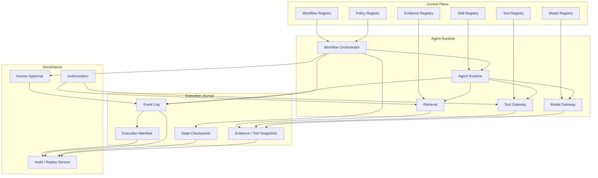
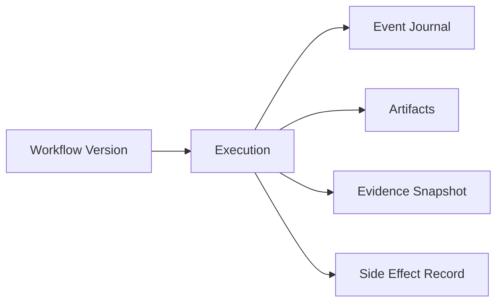
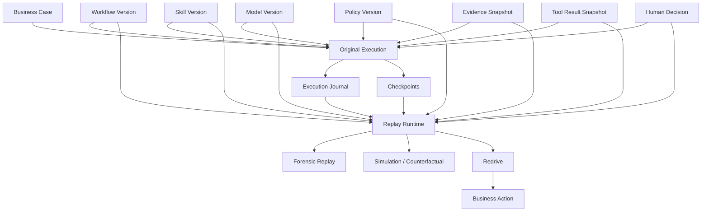

# 如何设计可 Replay 的金融 Agent Workflow

## 一、金融 Agent 的 Replay，不是“重新跑一遍”

在普通业务系统里，“Replay”很容易被理解成：

```text
拿原来的输入
    ↓
再执行一次程序
    ↓
得到结果
```

对于金融 Agent，这个定义远远不够。

因为一次 Agent Workflow 可能同时依赖：

```text
Workflow Version
Skill Version
Model Version
Prompt / Configuration
Evidence
Tool Result
Policy Version
Authorization Context
Human Input
External System State
```

如果今天把同一个请求再次提交给 Agent：

```text
Original Request
      ↓
Current Model
      ↓
Current Skill
      ↓
Current Policy
      ↓
Current Data
```

即使得到完全一样的结果，也不能证明：

> 这就是当时发生的事情。

更可能出现的是：

```text
2026-09-20
Original Execution
    ↓
Model M7
Skill S4
Policy P18
Evidence E91
    ↓
Decision = Approve


2026-10-20
Naive Replay
    ↓
Model M8
Skill S5
Policy P19
Current Data
    ↓
Decision = Reject
```

后者不是 Replay。

它只是：

> **用今天的系统重新执行过去的业务请求。**

因此，金融 Agent 的 Replay 首先应该定义为：

> **在不重新依赖已变化的外部世界的前提下，根据原始 Execution 所记录的输入、版本、Evidence、工具结果、人工输入和状态转换，重建过去某一次 Workflow Execution 的行为与结果。**

这个定义与传统 Event Sourcing 的基本思想相近：不仅保存当前状态，还保存能够重建历史状态的事件序列。([martinfowler.com](https://martinfowler.com/eaaDev/EventSourcing.html?utm_source=chatgpt.com))

对金融 Agent 而言，Replay 的价值主要有四类：

```text
Forensics
    调查“当时到底发生了什么”

Audit
    证明“当时为什么得到这个结果”

Recovery
    从失败点安全恢复

Simulation
    用新的版本 / 新规则探索“如果当时使用 X 会怎样”
```

这四种能力必须分开。

---

# 二、先区分 Replay、Retry、Redrive、Resume 和 Simulation

这是设计金融 Agent Workflow 时最容易混淆的地方。

| 概念                | 含义                 |       是否重新执行 | 是否可以产生副作用 |
| ----------------- | ------------------ | -----------: | --------: |
| Retry             | 同一个步骤失败后再次尝试       |            是 |        可能 |
| Resume            | 从持久化状态继续执行         |         后续步骤 |        可能 |
| Redrive           | 从失败点重新推动原 Workflow |            是 |        可能 |
| Replay            | 重建过去执行的历史行为        | 通常不应该产生真实副作用 |       默认否 |
| Simulation / Fork | 从历史状态创建另一条假设路径     |            是 |       默认否 |

AWS Step Functions 是一个很好的工程参照：Standard Workflow 支持对失败执行进行 `redrive`，它从失败状态继续，保留已经成功步骤的结果，不重新执行这些成功步骤，并继续使用原始 state machine definition。([docs.aws.amazon.com](https://docs.aws.amazon.com/step-functions/latest/dg/redrive-executions.html?utm_source=chatgpt.com))

而 LangGraph 的 `time travel` 则明确区分 replay 与 fork：从历史 checkpoint 继续执行时，checkpoint 之前的节点不会重新执行，之后的节点会重新执行，包括 LLM 调用和 API 请求，而且这些调用可能产生不同结果。([docs.langchain.com](https://docs.langchain.com/oss/python/langgraph/use-time-travel?utm_source=chatgpt.com))

因此：

> **Replay 不是一个单独的 API，而是一种明确的执行语义。**

如果把这几种概念混在一起，金融系统很容易出现一个危险问题：

```text
“Replay”
     ↓
再次调用订单 API
     ↓
再次提交交易
```

这绝对不是金融场景所需要的 Replay。

---

# 三、金融 Replay 最核心的原则：历史执行必须依赖 Historical Context

一个可 Replay 的 Workflow，首先必须保存：

```text
Original Execution
        │
        ├── Original Input
        ├── Workflow Version
        ├── Skill Version
        ├── Model Identity
        ├── Policy Version
        ├── Evidence Snapshot
        ├── Tool Results
        ├── Human Decisions
        ├── State Transitions
        └── Side-effect Records
```

因此：

```text
Replay
=
Original Input
+
Original Execution Context
+
Original Recorded Results
```

而不是：

```text
Replay
=
Original Input
+
Current Environment
```

这实际上与 AWS 面向金融服务的架构建议高度一致。AWS Financial Services Industry Lens 强调 change management、approved reusable artifacts、version control、configuration drift prevention，并指出通过代码化管理可以测试、模拟和保留完整变更记录。([docs.aws.amazon.com](https://docs.aws.amazon.com/wellarchitected/latest/financial-services-industry-lens/fsiops4.html?utm_source=chatgpt.com))

---

# 四、真正的 Replay Object 应该是什么

一个成熟的 Agent 平台不应该把：

```text
execution_id
```

简单理解成“一个日志 ID”。

它实际上应该指向一个：

> **Execution Manifest**

例如：

```json
{
  "execution_id": "EX-2026-0009821",

  "business_case": {
    "case_id": "CASE-10291",
    "decision_type": "trade_review"
  },

  "workflow": {
    "id": "trade-review",
    "version": "18",
    "artifact_digest": "sha256:..."
  },

  "agent": {
    "skill": {
      "id": "compliance-review",
      "version": "7.2.1",
      "artifact_digest": "sha256:..."
    },
    "model": {
      "provider": "provider-x",
      "model_id": "model-y",
      "snapshot": "..."
    }
  },

  "policy": {
    "id": "trade-policy",
    "version": "23",
    "revision": "..."
  },

  "evidence": {
    "snapshot_id": "EVID-8821",
    "manifest_hash": "sha256:..."
  },

  "tools": [
    {
      "id": "risk-system",
      "version": "7"
    }
  ],

  "runtime": {
    "environment": "production",
    "configuration_hash": "sha256:..."
  }
}
```

然后 execution history：

```text
Execution Manifest
       │
       ▼
Event Journal
       │
       ▼
State Reconstruction
```

这比单独依赖 tracing system 更适合做历史 Replay。

---

# 五、Replay 的第一层：Event Journal

Event Sourcing 最核心的思想是：

> 不只保存最终 State，而是保存 State 如何一步一步产生。([martinfowler.com](https://martinfowler.com/eaaDev/EventSourcing.html?utm_source=chatgpt.com))

金融 Agent Workflow 可以把一次执行记录成：

```text
ExecutionStarted
    ↓
EvidenceRequested
    ↓
EvidenceRetrieved
    ↓
EvidenceAccepted
    ↓
AgentStepStarted
    ↓
LLMCallRecorded
    ↓
ClaimProduced
    ↓
PolicyEvaluated
    ↓
HumanApprovalRequested
    ↓
HumanApproved
    ↓
ActionAuthorized
    ↓
ActionExecuted
    ↓
ExecutionCompleted
```

这里真正重要的是：

> **Event Journal 记录业务语义，而不是只记录日志。**

例如：

不推荐：

```text
INFO execute_tool(...)
```

更推荐：

```json
{
  "event_type": "PolicyEvaluated",
  "execution_id": "EX-9821",
  "policy_version": "P23",
  "input_snapshot": "...",
  "result": "ALLOW",
  "decision_id": "DEC-8821"
}
```

AWS Agentic AI Lens 明确建议对 Workflow Execution 使用结构化、可查询、不可变、具备完整性的审计记录，并要求日志足以重建执行路径。([docs.aws.amazon.com](https://docs.aws.amazon.com/wellarchitected/latest/agentic-ai-lens/agentops05-bp03.html?utm_source=chatgpt.com))

---

# 六、Trace 和 Replay Journal 不是一回事

OpenTelemetry 已经为 GenAI 定义了包括 model、provider、token usage、tool invocation 等信息的语义约定，因此非常适合作为 Agent Observability 基础设施。([opentelemetry.io](https://opentelemetry.io/docs/specs/semconv/registry/attributes/gen-ai/?utm_source=chatgpt.com))

例如：

```text
invoke_agent
 ├── chat
 ├── execute_tool
 ├── chat
 └── execute_tool
```

这种 trace 非常适合回答：

> 为什么这个 Agent 花了 45 秒？

或者：

> 哪个 tool 调用失败？

但 Replay 需要回答：

> **如果现在不接触外部系统，我能不能重新构建当时的 Workflow State？**

所以：

```text
OpenTelemetry Trace
=
Observability

Execution Journal
=
Historical Execution State

Replay Manifest
=
Historical Environment
```

三者应该关联，但不应该互相替代。

AWS 当前的 Agentic AI Lens 也把 execution logging、structured audit trail、retention 与 reconstructability 作为独立的运行治理能力。([docs.aws.amazon.com](https://docs.aws.amazon.com/wellarchitected/latest/agentic-ai-lens/agentsec06-bp02.html?utm_source=chatgpt.com))

---

# 七、为什么 LLM 是 Replay 中最棘手的问题

传统 Workflow：

```text
Input
+
Deterministic Code
→
Output
```

只要代码和输入不变，通常容易重现。

LLM：

```text
Prompt
+
Model
→
Output
```

则不能仅仅依赖：

```text
same prompt
same model name
```

来保证历史结果重现。

LangGraph 的官方文档对此给出了非常直接的例子：time-travel replay 会重新执行 checkpoint 之后的节点，而 LLM calls、API requests 等都会再次执行并可能产生不同结果。([docs.langchain.com](https://docs.langchain.com/oss/python/langgraph/use-time-travel?utm_source=chatgpt.com))

因此对于金融审计级 Replay：

> **不能把“再次调用当前 LLM”当作历史 Replay。**

更合理的做法是：

```text
Original LLM Call
       │
       ├── Request Snapshot
       ├── Model Identity
       ├── Parameters
       ├── Tool Schema
       ├── Prompt / Context
       └── Response
              │
              ▼
        Replay Artifact
```

Replay 时：

```text
Recorded LLM Result
        ↓
Inject into Workflow
```

而不是：

```text
Current LLM
        ↓
Ask it again
```

---

# 八、“temperature=0”不是金融级 Replay 策略

工程团队很容易采取：

```text
temperature = 0
```

然后认为：

> 结果应该一致。

即便模型在相同参数下表现高度稳定，这也不等于企业拥有审计级 determinism。

原因包括：

```text
Model serving changes
Provider routing
Safety system changes
Tool schema changes
Prompt changes
Context changes
Retrieval changes
External data changes
```

Anthropic 的模型文档明确区分 model IDs / snapshots，同时指出即使模型权重不变，serving infrastructure，例如 routing、safety classifiers 和 sampling logic，也可能发生变化并造成行为差异。([platform.claude.com](https://platform.claude.com/docs/en/about-claude/models/model-ids-and-versions?utm_source=chatgpt.com))

因此：

> **Replay 应该优先依赖 recorded result，而不是依赖概率模型“刚好再次生成相同结果”。**

这并不意味着生产环境永远不能重新调用模型。

重新调用模型当然非常有价值，但那应该叫：

```text
Re-evaluation
Regression Replay
Counterfactual Simulation
Model Comparison
```

而不是历史 Replay。

---

# 九、建议把 Replay 明确分成四种模式

## 1. Forensic Replay

目标：

> 重建历史。

原则：

```text
No external side effects
No current live data
No new LLM result
No new human decision
```

尽量使用：

```text
recorded input
recorded state
recorded Evidence
recorded tool output
recorded LLM output
recorded human input
```

这是最严格的模式。

---

## 2. Recovery Redrive

目标：

> 从失败点继续业务流程。

例如：

```text
Step A ✓
Step B ✓
Step C ✗
Step D -
```

Redrive：

```text
A / B 不重跑
C 重跑
D 后续执行
```

AWS Step Functions 的 `RedriveExecution` 就采用这一思路，并保留成功步骤的结果。([docs.aws.amazon.com](https://docs.aws.amazon.com/step-functions/latest/dg/redrive-executions.html?utm_source=chatgpt.com))

Recovery 与 Forensic Replay 不是同一回事，因为 Recovery 允许产生业务副作用。

---

## 3. Semantic Replay

目标：

> 用当前 Agent Runtime 重新判断过去的数据。

例如：

```text
Historical Evidence
        ↓
Current Model M9
Current Skill S8
        ↓
New Proposal
```

然后比较：

```text
Historical Proposal
vs
Current Proposal
```

这种模式非常适合：

* 模型升级验证
* Skill 升级验证
* Policy 变化分析
* 回归测试

但它不是历史事实。

---

## 4. Counterfactual / Fork

目标：

> “如果当时换成另一个 Policy / Model 会怎样？”

例如：

```text
Historical State @ 10:31
        │
        ├── Original branch
        │     Model M7
        │     Policy P18
        │
        └── Fork branch
              Model M8
              Policy P19
```

LangGraph 的 `fork` 就允许从历史 checkpoint 创建新的分支，而原始 execution history 保持不变。([docs.langchain.com](https://docs.langchain.com/oss/python/langgraph/use-time-travel?utm_source=chatgpt.com))

这对于金融模型治理非常有价值。

---

# 十、一个成熟金融 Agent 应该明确标记“Replay Type”

例如：

```json
{
  "replay_type": "FORENSIC",
  "source_execution": "EX-2026-0009821",
  "side_effects": "PROHIBITED",
  "live_data": "PROHIBITED",
  "live_model_calls": "PROHIBITED"
}
```

或者：

```json
{
  "replay_type": "SEMANTIC",
  "source_execution": "EX-2026-0009821",
  "model_version": "M9",
  "skill_version": "S8",
  "side_effects": "PROHIBITED"
}
```

或者：

```json
{
  "replay_type": "REDRIVE",
  "source_execution": "EX-2026-0009821",
  "resume_from": "STEP_C",
  "side_effects": "CONTROLLED"
}
```

这样运维人员不会把三个完全不同的操作都叫：

```text
Replay
```

---

# 十一、真正的 Replay Boundary 应该在 Side Effect 之前

这是金融 Workflow 的核心设计。

把 Workflow 分成：

```text
Pure / Reconstructable
----------------------
Evidence lookup
Claim generation
Policy evaluation
Classification
Calculation
Recommendation


Effectful / Non-replayable
----------------------
Place Order
Transfer Money
Submit Proxy Vote
Send Binding Instruction
Change Client Record
Notify External Counterparty
```

架构上最好明确：

```text
                 Replayable Zone
                       │
        ┌──────────────┼──────────────┐
        │              │              │
     Evidence       Agent         Policy
        │              │              │
        └──────────────┼──────────────┘
                       ↓
                 Decision Point
                       │
                Side Effect Firewall
                       │
        ┌──────────────┼──────────────┐
        ↓              ↓              ↓
     Order API      Payment API    Vote API
```

Replay：

```text
只允许进入
Replayable Zone
```

而：

```text
Side Effect Firewall
```

是一个硬边界。

---

# 十二、为什么不能依靠 Agent 自己保证“我在 Replay 模式下不会执行动作”

因为：

> **不能让 Agent 成为自己的安全边界。**

例如 Agent 可能决定：

```text
“为了完成 Workflow，我应该调用 SubmitOrder。”
```

如果 Replay 模式只是通过 prompt 告诉：

> “不要真的执行”。

这是软控制。

真正的设计应该是：

```text
Replay Execution
      ↓
Execution Capability
      ↓
Tool Policy
      ↓
Tool Invocation
```

在 Replay context 中：

```text
submit_order
→ DENY
```

而：

```text
get_order_status
→ replay recorded result
```

所以：

> **Replay Safety 应该由 Control Plane / Tool Authorization 强制执行，而不是由 LLM 遵守提示词。**

AWS Agentic AI Lens 也明确强调 orchestration layer 应保护 execution state 和 state-machine modification，并通过 access controls、validation、circuit breakers 与完整 execution logging 限制 Agent 处于批准的执行路径。([docs.aws.amazon.com](https://docs.aws.amazon.com/wellarchitected/latest/agentic-ai-lens/agentsec06-bp02.html?utm_source=chatgpt.com))

---

# 十三、Tool 应该支持三种 Replay Mode

一个实际的 Tool Registry 可以定义：

```yaml
tool:
  id: trade-order

  replay:
    mode: recorded
    live_execution: prohibited
```

或者：

```yaml
tool:
  id: client-profile

  replay:
    mode: snapshot
```

或者：

```yaml
tool:
  id: pricing-api

  replay:
    mode: deterministic
```

于是可以形成：

| Tool 类型 | Replay 策略              |
| ------- | ---------------------- |
| 纯计算     | 重新执行                   |
| 内部查询    | 使用 snapshot            |
| 外部 API  | 使用 recorded response   |
| LLM     | 使用 recorded output     |
| 时间服务    | 使用 recorded timestamp  |
| 随机数     | 使用 recorded seed/value |
| 下单/付款   | 禁止                     |
| 发邮件     | 禁止或转 sandbox           |

这是非常关键的一个架构抽象：

> **Replay 不是 Workflow 层单独决定的，而是每一个 Activity / Tool 都必须声明自己的 Replay Semantics。**

---

# 十四、外部 API 的 Replay 最好采用“Record / Playback”

例如原始执行：

```text
Agent
  ↓
Risk API
  ↓
Response:
{
  "risk": "HIGH"
}
```

当时应该保存：

```json
{
  "tool_call_id": "TC-991",
  "tool": "risk-api",
  "request_hash": "sha256:...",
  "request_snapshot": "...",
  "response_snapshot": "...",
  "observed_at": "...",
  "status": 200
}
```

Replay：

```text
Agent
  ↓
Replay Tool Adapter
  ↓
Recorded Response
```

而不是：

```text
Agent
  ↓
Live Risk API
```

否则你得到的是：

```text
Current Risk
```

不是：

```text
Historical Risk
```

对于金融业务，这两个值可能完全不同。

---

# 十五、动态数据是 Replay 最大的陷阱之一

例如：

```text
Market Price
Position
Credit Score
Client Balance
FX Rate
Exposure
```

如果 Workflow 在：

```text
10:31
```

执行。

Replay 在：

```text
17:00
```

查询 live data。

得到的可能是：

```text
10:31 → Price = 101.25
17:00 → Price = 105.40
```

如果 Replay 走 105.40：

```text
Decision ≠ Historical Decision
```

因此：

> **凡是参与 Business Decision 的动态数据，都应该在原始 execution 中形成 Evidence Snapshot 或明确可重建的数据版本。**

这也与前面 Evidence-First 的原则一致：

```text
Decision
   ↓
Evidence Snapshot
   ↓
Historical Data State
```

而不是：

```text
Decision
   ↓
Current Database
```

---

# 十六、Human-in-the-loop 也必须 Replay

金融 Workflow 往往存在：

```text
Agent Recommendation
       ↓
Human Review
       ↓
Approve / Reject / Modify
```

如果 Replay 只保存 Agent output：

```text
Agent → Approve
```

却没有保存：

```text
Human:
“Approve”
```

那么历史 Workflow 仍然无法完整重建。

所以 Human Action 也应该变成 Event：

```json
{
  "event_type": "HumanDecision",
  "user_id": "U-182",
  "action": "APPROVE",
  "comment": "...",
  "timestamp": "...",
  "role": "senior_reviewer"
}
```

Replay 时：

```text
Recorded Human Decision
        ↓
Resume Workflow
```

而不是：

```text
Ask the human again
```

除非这是一个专门的 Simulation / Re-review。

---

# 十七、Replay 必须保留“原始版本”，而不是跟着 Current 自动升级

一次历史 execution 至少要绑定：

```text
Workflow Version
Skill Version
Policy Version
Evidence Version
Model Identity
Tool Version
```

例如：

```text
EX-8821

Workflow W18
Skill S7
Policy P23
Model M8
Evidence E91
```

Replay 默认：

```text
EX-8821
→ W18
→ S7
→ P23
→ M8
→ E91
```

而不能：

```text
EX-8821
→ current workflow
→ current skill
→ current policy
→ latest model
```

AWS Step Functions 的版本设计非常值得参考：具体 execution 可绑定 state-machine version / alias；对于 redrive，即便 alias 后来指向了另一个 version，redriven execution 仍继续使用原 execution 所关联的 version。([docs.aws.amazon.com](https://docs.aws.amazon.com/step-functions/latest/dg/redrive-executions.html?utm_source=chatgpt.com))

---

# 十八、Workflow Version 是 Replay 成功的必要条件，但不是充分条件

即使：

```text
Workflow Version = W18
```

也不能保证 Replay 成功。

因为还有：

```text
Skill S7
Model M8
Policy P23
Evidence E91
Tool T4
```

如果其中一个缺失：

```text
Historical Workflow
      ↓
W18
      ↓
Skill S7 not available
      ↓
Replay broken
```

所以真正需要保存的是：

> **Execution Dependency Closure**

即：

```text
Execution
   ↓
所有影响结果的 artifact
```

可以想成一个闭包：

```text
Execution Closure
├── Workflow
├── Skills
├── Models
├── Prompts
├── Policies
├── Tools
├── Retrieval Config
├── Evidence
├── Human Inputs
└── Runtime Config
```

只有闭包完整，Replay 才有意义。

---

# 十九、建议为每次执行生成 Execution Fingerprint

例如：

```text
fingerprint =
SHA256(
  workflow_digest
  + skill_digests
  + model_identity
  + policy_revisions
  + tool_versions
  + prompt_hash
  + retrieval_config
  + evidence_manifest
)
```

结果：

```text
EX-8821
context_fingerprint =
sha256:abc123...
```

用途包括：

```text
相同 Context 的 Execution 聚类
版本影响分析
Incident blast radius
Regression comparison
Replay validation
```

但要注意：

> **Fingerprint 是索引，不是审计证据本身。**

真正的 Evidence 仍然是组成 fingerprint 的各个 artifact。

---

# 二十、Replay 应该具有“快照 + Journal”双层结构

一个比较实用的设计：

```text
                    Execution
                        │
          ┌─────────────┴─────────────┐
          ↓                           ↓
     State Snapshot             Event Journal
          │                           │
     “现在状态是什么”            “怎样走到这里”
```

例如：

```text
Checkpoint #1
    state = ...

Checkpoint #2
    state = ...

Checkpoint #3
    state = ...
```

每个 checkpoint 同时关联：

```text
events[before → checkpoint]
```

这样：

```text
Fast Resume
```

使用：

```text
Checkpoint
```

而：

```text
Forensic Replay
```

使用：

```text
Journal
+
Snapshots
```

LangGraph 的 checkpointer 就体现了类似设计：它把 graph state 保存为 checkpoints，并以此支持 human-in-the-loop、fault tolerance 和 time travel。([docs.langchain.com](https://docs.langchain.com/oss/python/langgraph/persistence?utm_source=chatgpt.com))

---

# 二十一、不要每一步都做完整 Event Sourcing，也不要只保存最终 State

两种极端都存在问题。

### 只保存最终 State

```text
state = APPROVED
```

问题：

> 不知道是怎么走到这里的。

---

### 每个 token 都保存

问题：

```text
成本
敏感数据
存储量
查询复杂度
```

全部可能爆炸。

---

### 推荐

保存业务级事件：

```text
AgentStepStarted
EvidenceSelected
ClaimGenerated
PolicyEvaluated
HumanApproved
ToolExecuted
DecisionRecorded
```

而：

```text
LLM token stream
```

根据用途分级保存：

```text
Hot Trace
Cold Evidence
Restricted Content
```

AWS Agentic AI Lens 明确建议结构化 audit trail、retention policy，以及对 PII / sensitive information 在写入日志时进行适当处理。([docs.aws.amazon.com](https://docs.aws.amazon.com/wellarchitected/latest/agentic-ai-lens/agentops05-bp03.html?utm_source=chatgpt.com))

---

# 二十二、Replay 和 Audit Retention 需要分开设计

一个非常容易踩的坑是：

> “Workflow Engine 保存 history，所以系统已经可 Replay。”

不一定。

例如 AWS Step Functions Standard Workflow 的 execution history API 默认可以查询完成后 90 天的数据，而 redrive 的可用窗口目前是 14 天。([docs.aws.amazon.com](https://docs.aws.amazon.com/step-functions/latest/dg/choosing-workflow-type.html?utm_source=chatgpt.com) ([docs.aws.amazon.com](https://docs.aws.amazon.com/step-functions/latest/apireference/API_RedriveExecution.html?utm_source=chatgpt.com))

这两个期限是 AWS 服务能力，不应被直接当作金融机构的统一监管保留期限。

金融机构可能需要更长的：

```text
Audit Retention
Evidence Retention
Business Record Retention
```

因此架构应该明确：

```text
Workflow Engine History
        ≠
Regulatory Evidence Store
```

更合理：

```text
Workflow Engine
    ↓
Execution Event
    ↓
Audit / Evidence Store
    ↓
Long-term Retention
```

AWS Financial Services Industry Lens 也明确把 change management、version control、configuration history、auditability 作为金融工作负载的独立能力。([docs.aws.amazon.com](https://docs.aws.amazon.com/wellarchitected/latest/financial-services-industry-lens/fsiops4.html?utm_source=chatgpt.com))

---

# 二十三、Replay 本身也应该留下 Audit Event

例如：

```json
{
  "event_type": "ExecutionReplayed",
  "source_execution": "EX-8821",
  "replay_execution": "RPL-8821",
  "replay_type": "FORENSIC",
  "initiated_by": "AUDIT-17",
  "started_at": "...",
  "result": "MATCHED"
}
```

因为：

> Replay 本身也改变了系统状态或触发了新的分析活动。

尤其是：

```text
Semantic Replay
Counterfactual
Recovery Redrive
```

不能与原始执行混为一条。

建议：

```text
Original Execution
       │
       ├── Replay Execution
       ├── Simulation Execution
       └── Redrive Execution
```

形成 parent-child lineage。

---

# 二十四、Replay 应该有“原始世界”和“新世界”两个 Namespace

这是非常实用的设计。

```text
Production History
------------------
EX-8821
```

Replay：

```text
Replay Namespace
----------------
RPL-8821
```

Simulation：

```text
Simulation Namespace
--------------------
SIM-8821
```

Fork：

```text
Fork Namespace
--------------
FORK-8821-A
```

任何非原始执行都不能：

```text
overwrite original execution
```

也不能产生：

```text
real business side effect
```

除非经过明确授权的 Recovery 流程。

这样可以避免一个很大的混乱：

```text
“这个 Decision 是原始结果，
还是后来重跑出来的结果？”
```

---

# 二十五、Replay 的结果应该分成“Match / Divergence”

例如：

```text
Original:
Decision = APPROVE

Replay:
Decision = APPROVE
```

不是简单：

```text
success
```

而应该进一步比较：

```text
State Match
Evidence Match
Claims Match
Policy Match
Proposal Match
Decision Match
```

最终：

```text
ReplayResult
{
  state: MATCH,
  evidence: MATCH,
  proposal: DIFFERENT,
  decision: SAME
}
```

或者：

```text
ReplayResult
{
  evidence: SAME,
  model_output: DIFFERENT,
  policy_result: SAME,
  decision: SAME
}
```

这才真正对 Model Governance 有意义。

---

# 二十六、Model Upgrade 后的 Replay 特别有价值

例如：

```text
Original
M7 + S4
→ Approve
```

现在：

```text
Replay
M8 + S4
→ Reject
```

可以生成：

```text
Decision Diff
```

进一步定位：

```text
Evidence = same
Skill = same
Policy = same
Model = changed
Proposal = changed
Decision = changed
```

于是可以非常清楚地得到：

> **模型变化导致该 Decision 发生变化。**

这比只看 aggregate benchmark 更接近金融生产风险。

Federal Reserve SR 11-7 要求持续验证模型、关注模型性能变化，并要求 material changes 接受相应 validation；这类 Replay / what-if capability 可以作为一种工程实现来支持这种 change analysis，但并不是法规唯一要求的实现方式。([federalreserve.gov](https://www.federalreserve.gov/frrs/guidance/supervisory-guidance-on-model-risk-management.htm?utm_source=chatgpt.com))

---

# 二十七、Skill Upgrade 也应该通过 Replay 验证

例如：

```text
S4 → S5
```

历史 Execution：

```text
100,000 cases
```

可以做：

```text
Historical Evidence
        ↓
Replay with S5
        ↓
Compare with original
```

统计：

```text
Decision Changed
Proposal Changed
Abstention Changed
Evidence Selection Changed
Policy Calls Changed
```

这实际上把：

> **历史 Production Traffic**

转化成：

> **Behavior Regression Dataset**

但要明确：

> 这是 Simulation / Semantic Replay，不是历史 Replay。

---

# 二十八、Policy Change 的 Replay 更加适合做 Counterfactual Analysis

例如：

```text
Historical:
Policy P18
→ APPROVE
```

然后问：

> 如果当时采用 P19，会发生什么？

不能重新执行真实 Action。

而应该：

```text
Historical Evidence Snapshot
        ↓
Policy P19
        ↓
Simulated Decision
```

得到：

```text
Historical Decision = APPROVE
Counterfactual = ESCALATE
```

这种能力非常适合：

```text
Policy Change Impact Analysis
Regulatory Change Simulation
Limit Change Analysis
Control Testing
```

---

# 二十九、Human Approval 不应在 Replay 中重新“请求”

假设历史：

```text
Reviewer A
→ APPROVE
```

Replay 如果再次弹出：

```text
请 Reviewer A 审批
```

那已经不是历史 Replay。

更合理的：

```text
Recorded Human Decision
       ↓
Replay
```

而在 Simulation：

```text
Historical Human Decision
       ↓
Optional Override
       ↓
Simulation Result
```

所以：

```text
Human Decision
```

本身也是不可变历史 Evidence。

---

# 三十、Replay 与 Saga / Compensation 应该区分

金融业务不能假设：

```text
已执行 Action
→ Replay
→ 再执行一次
```

而应该使用：

```text
Forward Recovery
+
Compensation
```

例如：

```text
Reserve Position
     ↓
Create Order
     ↓
Send Settlement Instruction
```

中间失败时，不应该通过“Replay 全部流程”重新执行：

```text
Reserve Position
```

而应该：

```text
detect existing side effect
      ↓
check idempotency
      ↓
resume or compensate
```

Google Cloud Workflows 官方文档将 Saga 作为跨服务事务一致性的模式，并明确指出失败后可以通过 compensating transactions 恢复业务一致性；其 retry 文档也区分 idempotent 与 non-idempotent steps。([cloud.google.com](https://docs.cloud.google.com/workflows/docs/best-practice?utm_source=chatgpt.com) ([cloud.google.com](https://docs.cloud.google.com/workflows/docs/reference/syntax/retrying?utm_source=chatgpt.com))

---

# 三十一、因此每个 Tool 都需要声明 Idempotency 与 Replay Semantics

建议 Tool Contract 增加：

```yaml
tool:
  id: submit-order

  effects:
    category: external_side_effect

  idempotency:
    supported: true
    key: order_id

  replay:
    mode: prohibited

  recovery:
    strategy: inspect_then_resume
```

另一个 Tool：

```yaml
tool:
  id: calculate-exposure

  effects:
    category: pure

  replay:
    mode: recompute
```

再一个：

```yaml
tool:
  id: risk-profile

  effects:
    category: read

  replay:
    mode: recorded_response
```

这样：

> **Workflow Engine 不需要自己理解每一个外部 API 的业务语义，但必须知道它的 Replay Contract。**

---

# 三十二、金融系统尤其需要“Action Idempotency Key”

例如：

```text
Execution EX-8821
Action A-991
Order ID = O-18291
```

如果 recovery 过程中重新进入：

```text
submit_order
```

Tool Adapter 必须能够判断：

```text
O-18291
已经提交过
```

于是：

```text
return existing result
```

而不是：

```text
submit again
```

AWS Step Functions Standard Workflow 本身提供 exactly-once 的 workflow execution 模型，但具体系统仍然需要根据 Retry、外部系统语义和 Integration 行为设计 idempotency；Step Functions 文档同时明确建议根据不同执行模型选择适合的幂等行为。([docs.aws.amazon.com](https://docs.aws.amazon.com/step-functions/latest/dg/choosing-workflow-type.html?utm_source=chatgpt.com))

因此：

> **Workflow exactly-once 不等于 Business Action exactly-once。**

这是金融 Workflow 架构里必须明确的一点。

---

# 三十三、Replay 的安全边界应该做到“Fail Closed”

如果 Replay 系统不知道：

```text
Tool X
```

是不是安全：

```text
DENY
```

如果找不到：

```text
Policy Version
```

应该：

```text
STOP
```

如果找不到：

```text
Evidence Snapshot
```

应该：

```text
STOP
```

如果：

```text
Human Decision
```

缺失：

```text
FORENSIC REPLAY
→ cannot reconstruct
```

而不是：

```text
Ask Agent to infer
```

或者：

```text
Use current data
```

因此：

> **Replay 不完整 ≠ Replay 可以自动降级成 Current Runtime。**

否则所谓 Replay 会悄悄变成：

```text
Historical Execution
+
Current System
```

最终产生一个看似完整、实则无法审计的混合结果。

---

# 三十四、需要特别保存“Replay Gap”

例如：

```json
{
  "replay_status": "PARTIAL",

  "missing_artifacts": [
    "tool_response:pricing-api@2026-09-20T10:31:02Z"
  ],

  "forbidden_substitutions": [
    "current_pricing_api"
  ]
}
```

这比返回：

```text
Replay Failed
```

更有价值。

因为审计人员能够明确知道：

> 哪一个历史 Evidence 已经无法恢复。

这也是一个重要的治理指标：

```text
Replay Completeness
```

---

# 三十五、可以建立 Replay Completeness 指标

例如：

```text
Replay Completeness
=
Reconstructable Historical Inputs
/
Required Historical Inputs
```

更具体：

```text
100%
Workflow
100%
Skill
100%
Policy
100%
Evidence
100%
Tool Outputs
100%
Human Decisions
100%
Model Result
100%
Side-effect records
```

最终：

```text
Replay Completeness = 100%
```

才可以说：

> forensic replay complete。

如果：

```text
Model Output = missing
```

那么：

```text
Forensic Replay = incomplete
```

而不是：

```text
Current Model → recalculate
```

---

# 三十六、Replay Quality 还应该有“Semantic Match”

历史 Replay 即使：

```text
Raw output
```

不同，也可能：

```text
Claim
Decision
Action
```

仍然相同。

例如：

```text
Original Model:
“交易在当前限额内，建议批准。”

Replay:
“该交易未超过适用限额，可以批准。”
```

文本不同。

但：

```text
Claim = same
Decision = same
```

因此建议区分：

```text
Byte Match
Structural Match
Semantic Match
Decision Match
```

尤其是 LLM 系统：

```text
Byte Match
```

通常不应该成为唯一标准。

---

# 三十七、但是“语义相同”不能被用来掩盖控制差异

例如：

```text
Original:
Evidence E1
→ Policy P18
→ APPROVE
```

Replay：

```text
Evidence E1
→ Policy P19
→ APPROVE
```

最终 Decision 一样。

但：

```text
Control Context ≠
```

因此 Replay 报告不能只说：

```text
Decision Match
```

还应该：

```text
Version Match
Evidence Match
Policy Match
Workflow Match
Model Match
```

这是金融审计非常重要的区别：

> **结果相同，不代表执行过程相同。**

---

# 三十八、可 Replay 的 Agent Workflow 应该采用“不可变输入 + 不可变版本 + 可记录外部结果”

可以把设计压缩成一个方程：

```text
Replayable Execution
=
Immutable Input
+
Immutable Workflow Version
+
Immutable Skill Version
+
Immutable Policy Version
+
Model Identity
+
Evidence Snapshot
+
Recorded Tool Results
+
Human Decisions
+
State/Event History
```

如果其中一个缺失：

```text
Exact Historical Replay
```

就可能无法成立。

这也是为什么仅仅部署一个：

```text
Workflow Engine
```

并不会自动得到可 Replay 的 Agent Workflow。

---

# 三十九、推荐的整体架构

一个更适合金融 Agent 的架构：



这里最重要的架构边界是：

```text
Workflow Orchestrator
        ≠
Agent Runtime
```

Workflow 负责：

```text
State
Transition
Checkpoint
Retry
Approval
Recovery
Replay semantics
```

Agent Runtime 负责：

```text
Reason
Retrieve
Analyze
Generate Proposal
Call approved tools
```

这能够防止 Agent Runtime 自己持有 Business Workflow 状态机。

---

# 四十、Replay Service 应该独立出来

不要把 Replay 写成：

```python
agent.run(...)
```

的一个参数：

```python
agent.run(replay=True)
```

这很容易把：

```text
Replay logic
```

扩散到所有 Agent code。

更合理：

```text
Replay Service
      │
      ├── loads Execution Manifest
      ├── loads historical events
      ├── constructs Replay Context
      ├── replaces external tools
      ├── injects recorded LLM results
      ├── blocks side effects
      └── produces Replay Report
```

例如：

```text
Replay Service
    ↓
Replay Runtime
    ↓
Workflow Version W18
    ↓
Recorded Inputs / Tool Results / Model Outputs
    ↓
Replay Result
```

这样 Replay 是平台能力，而不是业务 Agent 自己实现。

---

# 四十一、Replay Runtime 与 Production Runtime 应该是“同一个语义，不同的 I/O”

可以采用：

```text
Production Runtime
    |
    +-- LiveToolAdapter
    +-- LiveModelAdapter
    +-- LiveEvidenceAdapter


Replay Runtime
    |
    +-- RecordedToolAdapter
    +-- RecordedModelAdapter
    +-- SnapshotEvidenceAdapter
```

二者共享：

```text
Workflow Logic
State Machine
Business Rules
```

区别只在 I/O。

这是非常重要的设计。

不要实现两个完全独立的 Workflow：

```text
Production Workflow
Replay Workflow
```

否则很容易：

```text
Production behavior ≠ Replay behavior
```

而是：

```text
Same Workflow Semantics
+
Different IO Adapter
```

---

# 四十二、Replay 适合采用“Dependency Injection”

例如：

```text
Workflow
   ↓
ModelProvider
ToolProvider
EvidenceProvider
Clock
RandomSource
```

Production：

```text
ModelProvider = LiveModel
ToolProvider = LiveTool
EvidenceProvider = LiveEvidence
Clock = SystemClock
```

Replay：

```text
ModelProvider = RecordedModel
ToolProvider = RecordedTool
EvidenceProvider = Snapshot
Clock = RecordedClock
```

这样：

```text
Workflow Code
```

不需要知道：

```text
Replay
```

是什么。

这实际上非常适合企业 Agent 平台的架构：

> **Replay 是 Runtime Context，不是 Workflow Business Logic。**

---

# 四十三、Time 也必须可 Replay

很多 Workflow 会依赖：

```text
now()
today()
deadline
SLA
market close
business day
```

如果 Replay 直接使用：

```text
System.currentTimeMillis()
```

历史执行就可能发生变化。

所以：

```text
Clock
```

也应该成为 dependency：

```text
Production:
SystemClock

Replay:
RecordedClock
```

例如：

```json
{
  "execution_time": "2026-09-20T10:31:02Z",
  "business_date": "2026-09-20"
}
```

Replay 时：

```text
now() = 2026-09-20T10:31:02Z
```

而不是当前时间。

---

# 四十四、Random 也一样

如果业务或模型外围逻辑使用：

```text
UUID
Random
Sampling
Backoff
Routing
```

Replay 需要知道：

```text
当时产生了什么值
```

或者：

```text
当时使用什么 deterministic seed
```

最保守的设计仍然是：

> 对影响业务决定的随机结果直接记录原值。

因为：

```text
same seed
```

也不一定能跨版本保证完全一致。

---

# 四十五、Replay 中的模型调用建议使用“Recorded Result First”

可以设计：

```text
Model Adapter
    ↓
Replay Context?
   /        \
 Yes         No
 ↓           ↓
Recorded    Live Model
Result
```

Forensic Replay：

```text
Recorded Result
```

Semantic Replay：

```text
Live Model
```

这样一个 Model Gateway 就可以支持：

```text
Historical
Current
Candidate
Shadow
```

四种模式。

---

# 四十六、这也是 Model Version 管理真正有意义的地方

历史 execution：

```text
M7
```

Replay：

```text
M7 recorded output
```

Simulation：

```text
M8 live output
```

Comparison：

```text
M7 Result
vs
M8 Result
```

于是：

```text
Model Version
```

不再只是：

```text
“日志里写一下模型名字”
```

而成为：

```text
Replay Selector
```

的一部分。

FINRA 2026 年的公开监管观察也把 model version tracking、prompt/output logging、testing、monitoring 和 human review 列为 GenAI governance 需要考虑的控制措施。([finra.org](https://www.finra.org/rules-guidance/guidance/reports/2026-finra-annual-regulatory-oversight-report/gen-ai?utm_source=chatgpt.com))

---

# 四十七、Replay 也应该进入 CI/CD

一个成熟 Agent 平台可以维护：

```text
Historical Golden Executions
```

例如：

```text
1000 个真实脱敏案例
        ↓
Historical Evidence Snapshot
        ↓
Current Candidate Model / Skill
        ↓
Replay
        ↓
Compare
```

形成：

```text
Regression Test
```

例如：

```text
Decision Consistency
Evidence Selection
Policy Compliance
Tool Calling
Abstention
Output Structure
```

Morgan Stanley 的公开生产实践说明，真实金融 AI use case 可以建立专门 evaluation framework，并持续运行 regression suite 检查模型和 retrieval 的行为变化。([openai.com](https://openai.com/index/morgan-stanley/?utm_source=chatgpt.com))

因此：

> **Replay Infrastructure 不只是 Incident Tool，也应该成为 Agent Release Testing 基础设施。**

---

# 四十八、但 Production Replay Dataset 不应该简单复制所有生产数据

金融数据具有：

```text
PII
MNPI
Client Confidentiality
Trading Data
Research Restrictions
```

因此：

```text
Production Execution
      ↓
Replay Dataset
```

需要经过：

```text
Authorization
Classification
Masking / Tokenization
Retention
Access Control
```

AWS Agentic AI Lens 特别提醒，structured audit trails 不应把 PII、凭据等敏感信息直接写入 agent reasoning traces，并建议按合规和运营需求设计分层保留策略。([docs.aws.amazon.com](https://docs.aws.amazon.com/wellarchitected/latest/agentic-ai-lens/agentops05-bp03.html?utm_source=chatgpt.com))

所以：

> **可 Replay 不等于所有人都可以看到 Replay Data。**

Replay 本身也需要权限。

---

# 四十九、Replay 应该遵循 Separation of Duties

尤其对：

```text
Trade
Payment
Proxy Vote
Client Eligibility
Compliance Decision
```

建议：

```text
Production Operator
≠
Replay Operator
≠
Replay Approver
```

例如：

```text
Developer
→ cannot replay production confidential cases

Operations
→ can redrive failed workflow

Audit
→ can run forensic replay

Risk
→ can run counterfactual simulation

Business Owner
→ can approve recovery
```

AWS Financial Services Industry Lens 对 separation of duties、历史权限配置和 IAM configuration change tracking 都有明确建议。([docs.aws.amazon.com](https://docs.aws.amazon.com/wellarchitected/latest/financial-services-industry-lens/fsisec04.html?utm_source=chatgpt.com))

---

# 五十、Replay 最终需要输出一个 Replay Report，而不是一个字符串

例如：

```json
{
  "source_execution": "EX-8821",

  "replay_execution": "RPL-8821",

  "mode": "FORENSIC",

  "version_match": {
    "workflow": true,
    "skill": true,
    "policy": true,
    "model": true
  },

  "evidence_match": true,

  "tool_results_replayed": 17,

  "human_decisions_replayed": 2,

  "side_effects_blocked": 4,

  "result": {
    "proposal": "approve",
    "decision": "approved"
  },

  "comparison": {
    "state": "MATCH",
    "decision": "MATCH"
  }
}
```

对于 Semantic Replay：

```json
{
  "mode": "SEMANTIC",

  "original": {
    "model": "M7",
    "skill": "S4",
    "decision": "approve"
  },

  "replay": {
    "model": "M8",
    "skill": "S4",
    "decision": "escalate"
  },

  "changed_claims": [
    "risk interpretation"
  ]
}
```

这比：

```text
“Replay completed”
```

有意义得多。

---

# 五十一、一个金融 Trade Review Workflow 的完整例子

假设：

```text
Business Case:
客户要执行 8m USD trade
```

Workflow：

```text
1. Load Client
2. Load Risk
3. Load Exposure
4. Retrieve Applicable Policy
5. Agent Analysis
6. Policy Evaluation
7. Human Approval
8. Submit Order
```

原始 execution：

```text
W18
S7
M8
P23
```

Evidence：

```text
Client = C1
Risk = HIGH
Exposure = 2m
Limit = 10m
```

Agent Proposal：

```text
Trade appears within limit
Recommend APPROVE
```

Human：

```text
APPROVE
```

Order：

```text
O-8821
```

---

# 五十二、如果后来发现 Model M8 有问题，怎么 Replay

首先：

```text
Forensic Replay
```

必须：

```text
W18
S7
M8
P23
Historical Evidence
Recorded Model Output
Recorded Human Approval
```

最终确认：

```text
Original Decision = APPROVE
Historical Replay = APPROVE
```

这回答：

> 当时系统到底做了什么？

---

然后：

```text
Semantic Replay
```

换：

```text
M9
```

但保持：

```text
W18
S7
P23
Historical Evidence
```

得到：

```text
M9 Proposal = ESCALATE
```

于是可以进一步分析：

```text
Model Upgrade
→ Proposal changed
→ Decision would change
```

这回答：

> 如果当时已经使用新模型，会怎样？

两个答案完全不同。

---

# 五十三、如果 Policy P23 后来变成 P24

Forensic Replay：

```text
P23
```

Simulation：

```text
P24
```

于是：

```text
Historical:
P23 → APPROVE

Counterfactual:
P24 → ESCALATE
```

这样业务、Risk、Compliance 才能回答：

> 新政策预计会影响多少历史案例？

这比单独统计：

```text
Policy P24
has been deployed
```

有价值很多。

---

# 五十四、如果 Workflow W18 本身后来发生变化

例如：

```text
W18
Risk Check
→ Agent
→ Human Approval
```

变成：

```text
W19
Risk Check
→ Policy Pre-check
→ Agent
→ Policy Re-check
→ Human Approval
```

Historical Replay：

```text
W18
```

而 Regression Simulation：

```text
same historical case
+
W19
```

得到：

```text
Decision Path Changed
```

于是：

> Workflow Version 不只是 release metadata，而是 Replay 的核心输入。

---

# 五十五、这也是为什么“Agent Runtime 不应该拥有 Workflow 状态机”

如果 Agent Runtime 自己负责：

```text
current state
retry
approval
side effects
memory
```

那么 Replay 会越来越困难。

因为：

```text
Agent Memory
+
Current Runtime State
```

本身就在不断变化。

更合理的是：

```text
Workflow Orchestrator
    ↓
Explicit State
    ↓
Agent Runtime
```

Agent Runtime 只处理：

```text
current step context
```

而不是负责：

```text
business state
```

这样 Replay 可以重新装载：

```text
Historical Workflow State
```

然后把它交给：

```text
Agent Runtime
```

这正是为什么 Durable Workflow Engine 与 Agent Runtime 应该保持清晰边界。

---

# 五十六、建议采用“State Outside Agent Memory”

例如：

```text
Workflow State
    ↓
PostgreSQL / Workflow Store

Agent Memory
    ↓
Conversation / scratch context
```

Replay：

```text
Workflow Store
    ↓
Historical State
```

而不是：

```text
Agent Memory
    ↓
hope we can reconstruct
```

LangGraph 通过 checkpointer 保存 graph state，并明确把 checkpoints 用于 human-in-the-loop、time travel 和 fault tolerance；这说明持久化 execution state 本身是 Agent workflow 可恢复和可时间旅行的基础。([docs.langchain.com](https://docs.langchain.com/oss/python/langgraph/persistence?utm_source=chatgpt.com))

---

# 五十七、Replay 的最终数据模型可以简化成六类对象

一个金融 Agent 平台不必一开始就造几十种对象。

最核心可以是：

```text
1. Workflow Definition
2. Execution
3. Event
4. Artifact Version
5. Evidence Snapshot
6. Side Effect Record
```

关系：



其中：

```text
Artifacts
=
Model
Skill
Policy
Tool
Prompt
Config
```

---

# 五十八、Artifact Registry 不应该只服务 Deployment

传统 Registry：

```text
Model Registry
Skill Registry
Container Registry
```

通常关注：

```text
发布
部署
回滚
```

Replay 需要的是：

```text
发布
部署
回滚
历史查询
依赖闭包
内容校验
重建
```

所以每一个 artifact 都应该能回答：

```text
ID
Version
Digest
Created At
Approved At
Effective At
Retired At
Dependencies
Owner
Approval
```

这样：

```text
Execution
```

才可以反向找到：

```text
Artifact Closure
```

---

# 五十九、Replay 应该做完整性校验

开始 Replay 前：

```text
Verify
├── Workflow artifact exists
├── Skill artifact exists
├── Model identity exists
├── Policy version exists
├── Evidence snapshot exists
├── Tool responses exist
├── Human decisions exist
└── Manifest hash matches
```

任意失败：

```text
Replay Status = INCOMPLETE
```

而不是：

```text
fallback to latest
```

这在金融系统中尤其重要。

否则：

```text
Replay
```

可能悄悄把：

```text
Historical Execution
```

变成：

```text
Historical + Current Hybrid
```

导致审计结论失真。

---

# 六十、Replay 本身也应该接受测试

不能因为：

```text
有 Replay API
```

就认为系统“可 Replay”。

至少需要测试：

```text
1. Same input → same reconstructed state

2. Same evidence → same claim

3. Same policy → same policy decision

4. Recorded tool result → no live call

5. Replay → no side effect

6. Missing artifact → fail closed

7. Model upgrade → divergence detected

8. Skill upgrade → divergence detected

9. Policy upgrade → counterfactual result isolated

10. Human approval → reconstructed, not re-requested
```

尤其第 5 条：

> **Replay 绝不能因为一个测试遗漏而真的发出付款、交易或客户通知。**

---

# 六十一、Replay 的成熟度可以分为五级

这不是监管评级，而是一个架构能力模型。

### Level 0：只能看日志

```text
Logs
```

可以知道：

```text
发生了什么
```

但不能重建。

---

### Level 1：Workflow State Replay

```text
Checkpoint
+
Workflow Version
```

可以重建：

```text
State
```

---

### Level 2：Deterministic Workflow Replay

增加：

```text
Tool Results
Evidence Snapshots
Human Decisions
```

可以重建：

```text
Business Flow
```

---

### Level 3：Agent Decision Replay

再增加：

```text
Model Output
Skill Version
Policy Version
Claim Provenance
```

可以重建：

```text
Decision
```

---

### Level 4：Full Forensic Replay

增加：

```text
Version Closure
Authorization
Side Effect Ledger
Tamper Evidence
Retention
```

能够回答：

```text
who
what
when
why
under which version
with which evidence
with which authorization
```

---

### Level 5：Replay + Simulation Platform

支持：

```text
Forensic Replay
Redrive
Model Upgrade Simulation
Skill Regression
Policy Impact Analysis
Counterfactual
```

这时 Replay 已经不再只是运维工具。

而成为：

> **Agent Governance Infrastructure**

---

# 六十二、金融场景真正应该追求的是“Historical Reconstruction”

在金融系统里：

```text
Replay
```

最有价值的不是：

> “我今天还能不能让它再次输出同样的话。”

而是：

> **“如果监管、内部审计、Risk 或事故调查团队在六个月以后问我，当时这笔业务是如何被处理的，我能不能不依赖当前系统状态，把当时的业务执行完整重建出来？”**

需要重建的至少包括：

```text
Business Input
↓
Workflow
↓
Evidence
↓
Agent Proposal
↓
Policy
↓
Human Review
↓
Business Decision
↓
Action
```

这与 DORA 对 ICT change management 的要求非常接近：金融机构需要使 ICT changes 被记录、测试、评估、批准、实施和验证，并纳入整体变更管理。([eur-lex.europa.eu](https://eur-lex.europa.eu/legal-content/EN/TXT/?qid=1689500446201&uri=CELEX%3A32022R2554&utm_source=chatgpt.com))

---

# 六十三、为什么金融事件案例反复说明“历史状态”很重要

Knight Capital 2012 年的技术事故与交易软件安装有关，导致大量错误订单并造成约 4.4 亿美元税前损失。其公开文件随后还描述了对相关技术和控制的内部 review。([sec.gov](https://www.sec.gov/Archives/edgar/data/1060749/000119312512341182/d392788d424b3.htm?utm_source=chatgpt.com))

Citi 2020 年 Revlon 相关错误支付事件中，Citi 公开披露约 8.94 亿美元被错误支付，并把 human error、第三方 vendor 和贷款处理系统限制列为主要贡献因素，随后增加 controls 并升级相关基础设施。([sec.gov](https://www.sec.gov/Archives/edgar/data/831001/000083100120000110/c-20200930.htm?utm_source=chatgpt.com))

这些案例当然不能证明：

> “如果当时采用某种 Replay 架构，就不会发生事故。”

公开资料不足以支持这种因果结论。

但它们说明了一个更基础的问题：

> **金融事故调查依赖于重建当时的软件、配置、操作与控制状态。**

Agent 只是把这个问题进一步复杂化了，因为历史状态除了代码和配置，还包含：

```text
Model
Skill
Evidence
Prompt
Policy
Human Decisions
Tool Results
```

因此可 Replay 的 Agent Workflow，本质上是在把：

> **传统 Operational Forensics**

扩展为：

> **AI Decision Forensics**

---

# 六十四、最终推荐的设计原则

## 原则一：Replay 不等于 Retry

Retry 是恢复 transient failure。

Replay 是重建 historical execution。

---

## 原则二：Replay 不等于 Redrive

Redrive 可以继续真实业务流程。

Forensic Replay 默认不能产生真实副作用。

---

## 原则三：Replay 不等于重新调用当前模型

历史 Replay 应优先使用：

```text
Recorded Model Result
```

重新使用新模型属于：

```text
Semantic Replay / Simulation
```

---

## 原则四：每个 Workflow Execution 都必须拥有自己的 Execution Manifest

至少关联：

```text
Workflow
Skill
Model
Policy
Evidence
Tool
Human Decision
Runtime Config
```

---

## 原则五：所有外部副作用都必须经过 Side Effect Firewall

Replay：

```text
default = deny
```

---

## 原则六：Tool 必须声明 Replay Semantics

例如：

```text
recompute
recorded
snapshot
prohibited
sandbox
```

---

## 原则七：动态数据必须有 Historical Snapshot 或明确的数据版本

不能直接调用：

```text
current database
```

来重建：

```text
historical decision
```

---

## 原则八：Time、Randomness、External API Response 都属于 Replay Context

不要只保存：

```text
workflow state
```

---

## 原则九：Version 必须是 immutable reference

不能：

```text
latest
current
master
```

必须：

```text
version
digest
snapshot
```

---

## 原则十：Replay 不完整时必须 Fail Closed

禁止：

```text
missing historical evidence
   ↓
use current evidence
```

---

## 原则十一：原始 Execution 和 Replay / Simulation 必须分开

建议：

```text
Original
Replay
Simulation
Redrive
Fork
```

分别拥有独立 execution IDs。

---

## 原则十二：Replay 本身也要审计

至少记录：

```text
who
when
why
source execution
replay type
result
side effects blocked
```

---

# 六十五、一个适用于金融 Agent 平台的最终模型

可以把整个体系压缩成：



这套设计最重要的边界是：

```text
Forensic Replay
     ↓
No Side Effects

Simulation
     ↓
No Side Effects

Redrive
     ↓
Controlled Side Effects
```

而且：

```text
Agent Runtime
```

不应该自己决定：

```text
当前是不是 Replay
哪些 Tool 可以执行
哪些历史 Evidence 可以替换
```

这些都应该由：

```text
Control Plane
Replay Runtime
Tool Authorization
```

决定。

---

# 六十六、结论

金融 Agent Workflow 的 Replay，真正要解决的不是：

> **“能不能再次运行这个 Agent。”**

而是：

> **“能不能重建当时的 Agent Execution，并证明当时为什么得到这个 Business Decision。”**

因此，一个可 Replay 的 Workflow 至少需要：

```text
Immutable Workflow Version
+
Immutable Skill Version
+
Model Identity
+
Policy Version
+
Historical Evidence
+
Recorded Tool Results
+
Human Decisions
+
State / Event Journal
+
Side-effect Ledger
```

然后在此基础上区分：

```text
Forensic Replay
Recovery Redrive
Semantic Replay
Counterfactual Simulation
```

其中最重要的架构原则是：

> **历史 Replay 必须重放“当时的世界”，而不是重新运行“今天的系统”。**

这句话可以进一步展开成：

```text
Historical Input
+
Historical Version
+
Historical Evidence
+
Historical Tool Result
+
Historical Human Decision
+
Historical Clock
        ↓
Historical Workflow Reconstruction
```

而不是：

```text
Historical Input
+
Current Model
+
Current Skill
+
Current Policy
+
Current Database
        ↓
“Replay”
```

后者实际上只是一次新的业务执行。

对于金融 Agent，这个区别非常重要，因为金融机构真正需要的不是一个“看起来能够重跑”的 AI Workflow，而是：

> **一个可以进行 Historical Reconstruction、Controlled Recovery、Model/Skill Regression、Policy Impact Analysis 和 Audit Forensics 的 Workflow System。**

AWS Step Functions 对 Standard Workflow、execution history 和 redrive 的设计，以及 LangGraph 对 checkpoint、replay 和 fork 的实现，都说明“持久化执行状态 + 从历史状态继续/分叉”已经成为现代 Agent / Workflow 基础设施的重要能力；但它们的实现语义并不相同，不能把任何一个产品的“replay”直接等价为金融审计级 historical replay。([docs.aws.amazon.com](https://docs.aws.amazon.com/step-functions/latest/dg/choosing-workflow-type.html?utm_source=chatgpt.com) ([docs.langchain.com](https://docs.langchain.com/oss/python/langgraph/use-time-travel?utm_source=chatgpt.com))

金融领域则进一步提高了要求：DORA 强调 ICT change 的记录、测试、评估、批准、实施和验证；FINRA 2026 年明确把 prompt/output logging、model-version tracking、持续 testing/monitoring 和 agent action tracking 列为 GenAI governance 应考虑的控制；AWS Financial Services Industry Lens 也强调 change management、version control、configuration drift prevention、历史配置和审计能力。([eur-lex.europa.eu](https://eur-lex.europa.eu/legal-content/EN/TXT/?qid=1689500446201&uri=CELEX%3A32022R2554&utm_source=chatgpt.com) ([finra.org](https://www.finra.org/rules-guidance/guidance/reports/2026-finra-annual-regulatory-oversight-report/gen-ai?utm_source=chatgpt.com) ([docs.aws.amazon.com](https://docs.aws.amazon.com/wellarchitected/latest/financial-services-industry-lens/fsiops4.html?utm_source=chatgpt.com))

因此，金融 Agent 最终应该把 Replay 设计成一种平台级能力：

```text
Workflow Control Plane
        +
Execution Journal
        +
Evidence Registry
        +
Artifact Version Registry
        +
Tool Replay Contract
        +
Side Effect Firewall
        +
Replay / Simulation Runtime
        +
Audit / Provenance
```

这样，Agent 才真正具备进入金融业务核心流程所需要的一个重要能力：

> **不仅能够执行，而且能够在未来某一天，不依赖当时已经消失或变化的运行环境，把自己当时如何执行、依据什么执行、在哪个版本环境下执行，以及最终为什么产生那个 Business Decision，重新构建出来。**

这才是金融 Agent Workflow 中真正有价值的 **Replayability**。
