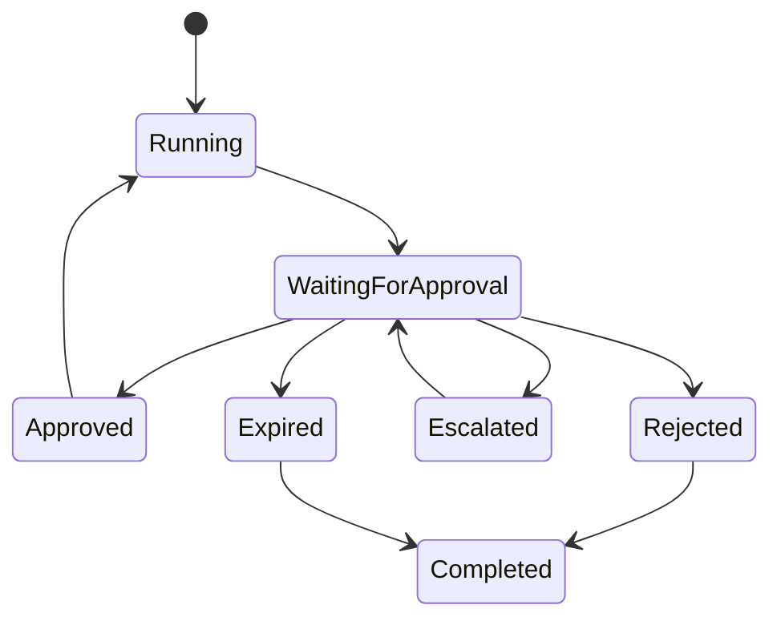
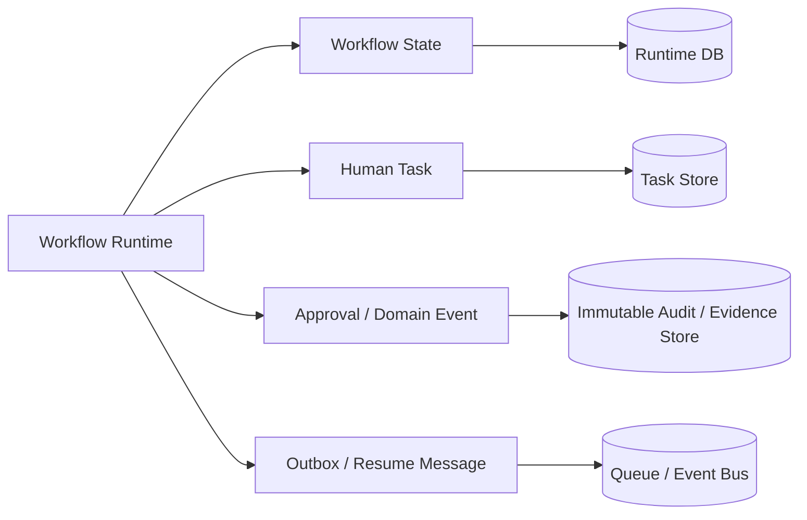
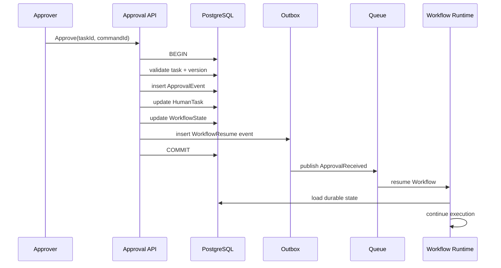
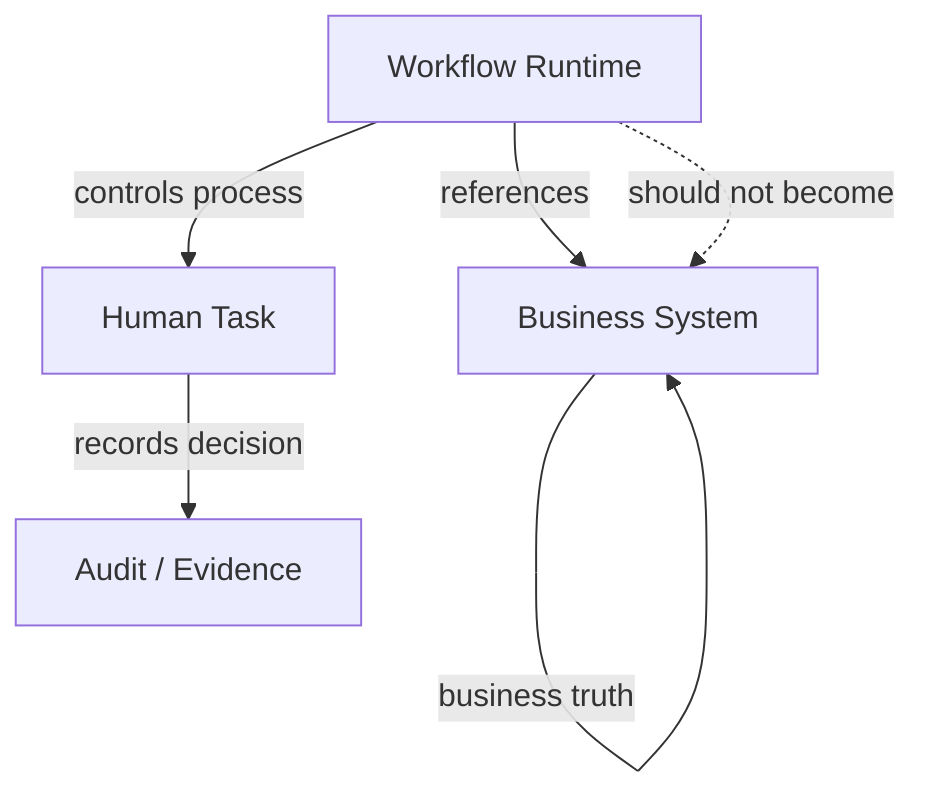
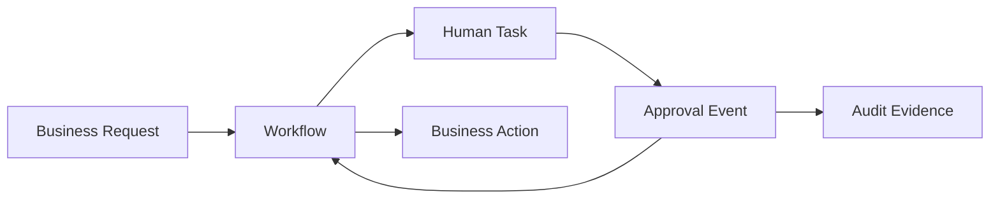
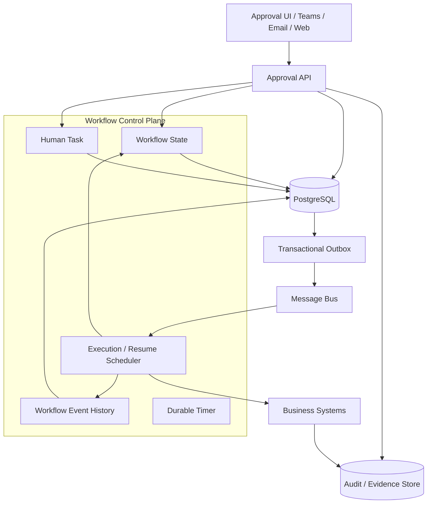

# 等待人工审批时，Workflow Runtime 应该如何持久化

在企业 Workflow 中，“等待人工审批”是一个非常容易被低估的状态。

自动执行的步骤通常只需要考虑几秒、几分钟甚至几十分钟的运行过程；但一旦进入人工审批，Workflow 可能暂停数小时、数天，甚至更久。此时 Worker 可能已经重启，Pod 可能已经被调度到另一台机器，Workflow Runtime 甚至可能已经完成了扩缩容。

因此，一个成熟的 Workflow Runtime 不能把“等待审批”理解为：

> 当前程序执行到这里了，挂着一个 Promise，等人回来以后继续。

真正需要解决的问题是：

> **当没有任何计算资源持续运行时，系统如何仍然准确地记住“这个 Workflow 正在等什么、谁可以处理、处理依据是什么、什么时候超时，以及收到审批后应该从哪里继续”。**

这也是 Durable Execution、BPM Workflow Engine 和金融服务工作流共同面对的问题。

AWS Step Functions 的 callback task 可以让 Workflow 暂停等待人工审批；Azure Durable Functions 将外部事件和定时器作为持久化的 orchestration state；Temporal 则通过 Event History 保存 Workflow Execution 的完整事件历史，并在 Worker 恢复后 replay；Camunda 的 User Task 则直接把人工任务作为 Workflow 中的一等实体。

这几种实现虽然技术路线不同，但背后的架构原则高度一致：

> **等待人工审批时，Runtime 应该持久化“可恢复的 Workflow 状态”，而不是持久化一个正在运行的程序。**

对于金融服务领域而言，还需要再增加一层要求：

> **Workflow Runtime State 和 Regulatory / Business Evidence 不能混为一谈。**

Runtime 要保证 Workflow 能恢复；业务和审计系统则要保证能够回答“谁在什么情况下批准了什么，以及这项批准为什么有效”。

---

## 1. 先回答最核心的问题：到底要持久化什么

一个 Workflow 执行到人工审批节点，可以抽象成：



当状态进入 `WaitingForApproval` 后，系统至少需要能够回答：

```text
这是哪个 Workflow？
        ↓
当前运行到哪个节点？
        ↓
正在等待哪个人工任务？
        ↓
这个任务等待谁？
        ↓
等待的具体条件是什么？
        ↓
审批对应的是哪个业务对象 / 哪个数据版本？
        ↓
什么时候超时？
        ↓
审批回来以后如何继续？
```

因此，最小的 Durable State 通常至少包括：

| 类别                 | 应持久化的信息                                      |
| ------------------ | -------------------------------------------- |
| Workflow Identity  | Workflow ID、Run ID、Tenant / Business Case ID |
| Definition         | Workflow Definition / Version                |
| Execution Position | 当前节点、状态、Transition Version                   |
| Business Reference | Order / Trade / Case / Request 等业务对象 ID      |
| Input Version      | 进入审批时业务数据的版本号或 revision                      |
| Waiting Condition  | 等待的事件类型、Task ID、Correlation ID               |
| Human Task         | Task ID、候选审批人 / Group、状态                     |
| Deadline           | SLA、超时时间、Escalation 时间                       |
| Policy Context     | 适用的审批规则 / Policy Version                     |
| Idempotency        | Approval Event ID、Command ID、版本号             |
| Recovery           | Retry / Compensation / Resume 所需的信息          |

这里最重要的变化是：

**Runtime 不应该保存“程序执行到这里时内存里有什么”，而应该保存“程序停止以后，未来恢复执行所需要知道什么”。**

---

# 2. 不应该持久化整个 Runtime Memory

一个很自然但通常不理想的设计是：

```text
Workflow Worker
    │
    ├── local variables
    ├── call stack
    ├── HTTP client
    ├── database connection
    ├── LLM context
    ├── temporary objects
    └── waiting Promise
            ↓
        serialize()
            ↓
        database
```

这种设计本质上是在试图把一个运行中的程序“冷冻”下来。

传统 Workflow Engine 和 Durable Execution Runtime 通常不会这么做。

Azure Durable Functions 的实现尤其具有代表性：Orchestrator 可以在等待期间从内存中卸载；当外部事件或者 durable timer 到达以后，Runtime 从持久化 history 恢复状态，并重新执行 orchestrator code。

Temporal 也是类似思想：Workflow Execution 的 Event History 是持久化记录，Worker 重新获得执行机会以后，通过 replay history 恢复 Workflow 的本地状态。

因此，更准确的模型是：

```text
                 ┌─────────────────────┐
                 │   Workflow Runtime   │
                 │                     │
                 │ current execution   │
                 │   ↓                 │
                 │ durable state       │
                 └─────────┬───────────┘
                           │
                    persist / append
                           ↓
                 ┌─────────────────────┐
                 │ Durable Persistence │
                 │                     │
                 │ state / history     │
                 │ wait condition      │
                 │ pending work        │
                 └─────────────────────┘
                           ↑
                           │
                    resume / replay
                           │
                 ┌─────────┴───────────┐
                 │   another Worker    │
                 └─────────────────────┘
```

Worker 是 disposable 的。

Workflow State 才是 durable 的。

---

# 3. “等待”本身就是一种持久化状态

很多自建 Workflow 系统容易犯一个错误：

```text
Task worker
    ↓
send approval email
    ↓
await approval
```

这里的 `await` 只是程序语言层面的等待。

它没有自动解决：

* Worker 重启怎么办？
* Pod 被驱逐怎么办？
* Deployment 发布怎么办？
* 节点宕机怎么办？
* 一周以后审批回来怎么办？
* 多个审批结果同时到达怎么办？
* 审批请求已经过期怎么办？

因此真正的 Workflow Runtime 应该把：

```text
WaitingForApproval
```

作为一个 Durable State，而不是一个 Runtime Thread State。

AWS Step Functions 的 callback pattern 就是这种设计：Workflow 可以暂停等待 Task Token，并在外部系统返回 token 后继续；官方文档明确将这种模式用于人工审批以及等待外部系统完成任务。Standard Workflows 也被 AWS 推荐用于可能等待人工或者外部系统的场景。

Azure Durable Functions 的 external event 也是同样的模式：Workflow 等待外部事件，事件到达后 Runtime 恢复；官方同时建议为人工审批设置 durable timer，以处理长期没有回应的情况。

Camunda 则进一步把 User Task 显式建模为 Workflow Engine 中的一等实体：Workflow 到达 User Task 后，创建 User Task instance，Process Instance 停止并等待任务完成。

因此：

> **“等待人工审批”不是没有状态，而是一个非常重要的状态。**

---

# 4. 最值得区分的三个 State

一个成熟的企业 Workflow，至少应该区分三个层次。

## 4.1 Workflow Runtime State

回答：

> Workflow 现在运行到哪里？

例如：

```json
{
  "workflowId": "case-123",
  "version": 12,
  "node": "riskApproval",
  "status": "WAITING",
  "revision": 27
}
```

这是 Runtime 自己必须理解的状态。

---

## 4.2 Human Task State

回答：

> 现在有什么事情需要人做？

例如：

```json
{
  "taskId": "task-789",
  "type": "RISK_APPROVAL",
  "status": "PENDING",
  "candidateGroup": "risk-managers",
  "deadline": "2026-09-22T10:00:00Z"
}
```

这不是简单的 Workflow Variable。

它代表一个真正的人工工作项。

Camunda 的 User Task 生命周期就是一个典型例子：任务有创建、分配、更新、完成、取消等独立生命周期事件。

---

## 4.3 Approval / Business Evidence

回答：

> 到底是谁做了什么业务决定？

例如：

```json
{
  "approvalId": "approval-456",
  "taskId": "task-789",
  "decision": "APPROVED",
  "approver": "user-123",
  "approvedAt": "2026-09-21T09:31:00Z",
  "businessRevision": 27,
  "policyVersion": "credit-policy-2026-09",
  "comment": "Approved within delegated limit"
}
```

这一层尤其重要。

**审批不是一个 Boolean。**

`approved = true` 本身通常并不足以成为金融业务中的可审计证据。

FINRA Rule 2210 的记录保存要求就是一个很直观的例子：对于适用的通信记录，需要保留批准该通信的 registered principal 以及批准日期等信息。

FCA 对 underwriting and placing 的规则同样强调，应保留指令、分配决定及关键步骤的完整 audit trail。

BCBS 在 2026 年汇总的电子银行风险管理指南中也明确强调关键电子银行活动应具有清晰 audit trail，并要求记录能够抵抗篡改、支持取证以及独立审计。

所以：

> **Workflow State 解决“怎么继续”；Approval Evidence 解决“为什么可以继续”。**

二者应该关联，但不应该混成一个 JSON blob。

---

# 5. 推荐采用“四层持久化模型”

对于企业尤其是金融服务领域，一个比较稳妥的设计是：



四者承担不同职责。

### Workflow State

保存：

```text
Workflow ID
Version
Current Node
Status
Revision
Waiting Condition
Deadline
Business Reference
```

它是 Runtime 的恢复依据。

### Human Task

保存：

```text
Task ID
Workflow ID
Candidate
Assignee
Task Status
Created At
Due At
Completed At
```

它支撑审批 UI、待办列表、转派、催办、升级等能力。

### Approval / Domain Event

保存：

```text
Approval ID
Decision
Actor
Timestamp
Business Revision
Policy Version
Evidence Reference
Comment
```

它是长期业务事实和审计证据。

### Outbox / Resume Message

保存：

```text
Event ID
Aggregate / Workflow ID
Event Type
Payload
Published At
```

它负责可靠地把“状态已经改变”传递给 Runtime、消息系统和其他服务。

---

# 6. 为什么不能只保存一个 Workflow JSON

最简单的设计往往是：

```sql
workflow_instance
-----------------
id
status
state_json
updated_at
```

然后：

```json
{
  "status": "waiting",
  "currentNode": "approval",
  "approver": "bob",
  "data": { ... }
}
```

小型内部工具可以这样做。

但当 Workflow 进入企业级、金融级场景后，这种设计很快遇到几个问题。

## 第一，历史会被覆盖

如果：

```text
state = WAITING
```

后来变成：

```text
state = APPROVED
```

那么你可能只能知道“现在已经批准”，却无法知道：

```text
什么时候进入等待？
当时是什么数据？
当时需要什么权限？
谁进行了批准？
审批过程中业务数据有没有变化？
审批是否被转派？
有没有重复提交？
```

---

## 第二，Runtime State 和 Audit Evidence 生命周期不同

Workflow Runtime 可能只需要保存几个月。

某些业务记录则可能需要更长时间保存。

因此不能假设：

> Workflow row 的生命周期 = Regulatory Evidence 的生命周期。

这也是为什么审计记录通常应该有独立的数据生命周期管理。

---

## 第三，并发更新会变得危险

例如：

```text
Approver A → Approve
Approver B → Approve
Timeout Worker → Expire
Escalation Worker → Escalate
```

四个事件可能几乎同时发生。

如果所有逻辑只是：

```sql
UPDATE workflow
SET state_json = ...
```

那么最终状态可能依赖于请求到达顺序，而不是业务规则。

---

# 7. 人工审批尤其需要解决“版本一致性”

这是金融 Workflow 中非常关键的一点。

假设：

```text
09:00
Trade Case #123
Risk = Low
Amount = $1M

        ↓

09:05
Workflow asks Bob for approval

        ↓

09:30
Underlying trade data changes

Amount = $5M

        ↓

09:31
Bob clicks Approve
```

如果 Workflow 只保存：

```text
approval = true
```

那么这个批准到底批准的是：

```text
$1M
```

还是：

```text
$5M
```

是不清楚的。

因此审批请求至少应关联：

```text
Business Object ID
Business Object Version
Approval Task Version
Policy Version
```

审批提交时验证：

```text
Approve(version = 27)
```

而系统当前是：

```text
business.version = 28
```

此时不能简单地继续 Workflow。

可能的业务策略包括：

```text
reject stale approval
重新生成审批任务
要求重新审批
只允许在特定字段发生变化时继续
```

具体选择属于业务规则，而不是 Workflow Runtime 可以自行决定的问题。

因此可以概括为：

> **Approval 不只是“对这个 Case 的批准”，而应该是“对某个 Case 在某个业务版本、某个审批规则版本下的批准”。**

---

# 8. Approval 回来以后，最危险的不是“收不到”，而是“重复收到”

人工审批系统天然存在重复消息问题。

例如用户点击 Approve：

```text
Browser
  ↓
POST /approval
  ↓
Workflow Service
  ↓
DB commit
  ↓
Network timeout
```

浏览器认为请求失败，于是再次提交：

```text
POST /approval
```

最终 Runtime 收到了：

```text
ApprovalEvent #001
ApprovalEvent #001
```

或者相同逻辑操作形成两个不同请求。

因此 Approval Command 至少应该有：

```text
approvalId / commandId
taskId
decision
actor
```

并且 Task 状态需要具有明确的状态转换约束：

```text
PENDING
   │
   ├── APPROVED
   ├── REJECTED
   ├── EXPIRED
   └── CANCELLED
```

而：

```text
APPROVED → APPROVED
APPROVED → REJECTED
EXPIRED  → APPROVED
CANCELLED → APPROVED
```

是否允许，必须由显式状态机决定，而不能靠 SQL 更新语句的“最后一次写入”。

Azure Durable Functions 的文档明确指出 external event 具有 at-least-once delivery 特性，并建议为外部事件提供唯一标识以便去重；AWS 的 transactional outbox 指南同样明确指出消息可能重复，需要消费者保持幂等。

---

# 9. Approval 和 Workflow Resume 之间存在一个经典“双写”问题

考虑下面代码：

```text
BEGIN

UPDATE approval
SET status = 'APPROVED'

COMMIT

publish("ApprovalReceived")
```

问题是：

```text
数据库提交成功
        ↓
Runtime 崩溃
        ↓
ApprovalReceived 没有发送
```

结果：

```text
Business State = APPROVED
Workflow State = WAITING
```

反过来：

```text
publish("ApprovalReceived")
        ↓
DB commit failure
```

也一样会产生不一致。

这正是 Transactional Outbox 要解决的问题。

AWS 对 Transactional Outbox 的解释非常明确：业务状态更新和事件记录应该放在同一个数据库事务中，再由独立的 relay 将 outbox 事件发送到消息系统，从而避免双写导致的不一致；同时消费者仍应保持幂等，因为消息可能重复。

因此，一个自研 Workflow Runtime 可以采用：



这样：

> **“批准已经发生”和“需要继续 Workflow”属于同一个可靠提交单元。**

---

# 10. Timer 也必须是 Durable State

人工审批不只是：

```text
wait for approval
```

更常见的是：

```text
wait for approval
OR
timeout
```

例如：

```text
24h 没有审批
    ↓
Escalate

48h 没有审批
    ↓
Reject
```

不能依赖：

```javascript
setTimeout(...)
```

因为：

```text
Pod restart
Process restart
Deployment
Node failure
Autoscaling
```

都会导致它失效。

正确的模型应该是：

```text
WaitingForApproval
       │
       ├── ApprovalReceived
       │
       └── DeadlineReached
```

Timer 本身也是 Workflow State 的一部分。

AWS Step Functions 的 timeout / heartbeat 机制、Azure Durable Functions 的 durable timer，以及 Temporal 的 durable timer 都采用类似思想。Azure 官方的人机交互模式甚至明确建议把“等待人工响应”和“超时”作为两个可竞争的持久化条件。

---

# 11. 不要把“审批通知”当成 Workflow State

另一个常见错误是：

```text
发了一封邮件
    ↓
所以 Workflow 等待邮件回复
```

邮件只是 Notification Channel。

它不是 Workflow State。

推荐关系应该是：

```text
Workflow
   │
   ├── Human Task
   │       │
   │       ├── Teams notification
   │       ├── Email notification
   │       └── Web UI
   │
   └── Approval API
```

也就是说：

```text
Email ≠ Approval
Teams message ≠ Approval
Button click ≠ Business Decision
```

真正的审批记录必须进入受控的 Approval API / Task API，由系统验证：

```text
Who?
Can this person approve?
Which task?
Which business version?
Which policy?
Is task still pending?
Is approval still within deadline?
```

这样即使用户：

```text
删除邮件
转发邮件
点击旧链接
重新打开旧页面
```

也不会直接绕过 Workflow Control Plane。

AWS 的 Step Functions human approval 示例本身也采用 callback / API endpoint 来将外部人工动作回传 Workflow，而不是把电子邮件本身当成状态来源。

---

# 12. Task Token / Correlation ID 应该是什么性质

对于等待外部事件的 Workflow，通常需要某种：

```text
Correlation ID
Task ID
Task Token
```

其目的不是“认证用户”。

它解决的是：

> 这个 Approval Event 应该送到哪个等待中的 Workflow？

例如：

```text
workflowId = WF-123
taskId     = TASK-456
correlationId = C-789
```

而：

```text
userId = Bob
```

解决的是：

> 谁进行了这个操作？

二者不要混淆。

更安全的模型是：

```text
Correlation
      +
Authentication
      +
Authorization
      +
Task State Validation
```

四者必须同时成立。

AWS Step Functions 使用 Task Token 将 callback 与等待中的 Task 关联；Temporal 则通过 Workflow ID 和 Signal 将外部消息发送给特定 Workflow Execution。

---

# 13. Workflow Runtime 不应该拥有长期的业务事实

这也是大型企业架构里很重要的一条边界。

例如：

```text
Workflow State:
    currentNode = "riskApproval"
```

是 Runtime State。

但：

```text
Trade.status = "Approved"
```

通常属于 Domain / Business State。

不应该把后者简单地当作 Workflow Variable。

更合理的关系是：



原因很简单：

Workflow 是过程。

Business Object 是事实。

Approval Event 是业务决定的证据。

三者生命周期、访问权限、数据所有权都可能不同。

因此 Workflow Runtime 最好保存：

```text
businessObjectId
businessObjectVersion
```

而不是复制整个业务对象作为自己的长期事实来源。

---

# 14. AI Agent 场景下，这一点更加重要

传统 Workflow 的等待可能是：

```text
WaitingForManagerApproval
```

AI Agent Workflow 的等待可能是：

```text
Agent proposes:
    "Execute trade"

Waiting for:
    Human approval
```

这里更容易出现一种错误：

```text
Agent Memory
    ↓
"Human approved this"
```

然后 Workflow 以后直接相信 Memory。

这在金融场景中是不够可靠的。

更合理的是：

```text
Agent
   ↓
Proposal
   ↓
Workflow / Policy
   ↓
Human Task
   ↓
Approval Record
   ↓
Workflow Transition
   ↓
Business Action
```

Approval 是一个受控的外部事实，而不是 Agent Memory。

因此：

> **Agent 可以保存上下文；Workflow 保存控制状态；Business System 保存业务事实；Audit Store 保存决策证据。**

它们不应该合并成一个“Agent State”。

---

# 15. Event Sourcing 和 Snapshot 到底应该怎么选

Workflow Runtime 的持久化通常有三种主要模式。

| 模式             | 核心思路                     | 优点           | 主要问题          |
| -------------- | ------------------------ | ------------ | ------------- |
| Current State  | 只保存当前状态                  | 简单、查询方便      | 历史信息不足        |
| Event Sourcing | 保存完整事件历史                 | 可恢复、可重放、审计友好 | History 会不断增长 |
| Hybrid         | Snapshot + Event History | 兼顾恢复和审计      | 实现复杂度更高       |

Temporal 的 Workflow Event History 是典型的 Event Sourcing / Replay 思路：事件历史是 Workflow 状态恢复的重要依据；Temporal Server 同时维护代表当前 Workflow State 的 Mutable State，以避免每次都从完整 history 重新计算。

Azure Durable Functions 也采用类似模式：History 记录事件，Runtime 可以根据 history replay orchestrator；与此同时保存 instance state 用于状态查询。

这说明一个重要事实：

> **Event History 和 Current State 并不是互斥的两种设计。**

高可靠 Workflow Runtime 往往同时需要：

```text
Current State
+
Durable History
```

只是不同产品的实现方式不同。

---

# 16. 对企业自研 Workflow Runtime，更实际的选择是什么

如果目标是：

```text
金融企业内部 Workflow Platform
PostgreSQL
高确定性 Workflow
Human approval
审计
可恢复
```

没有必要一开始就建立一个完整 Temporal 级别的 Event Sourcing Engine。

一个比较务实的模型是：

```text
PostgreSQL
│
├── workflow_instance
│
├── workflow_task
│
├── approval_event
│
├── workflow_event
│
└── outbox_event
```

例如：

```sql
workflow_instance
-------------------------
workflow_id
workflow_definition
workflow_version
current_node
status
revision
business_object_id
business_object_version
wait_condition
deadline_at
created_at
updated_at
```

```sql
workflow_task
-------------------------
task_id
workflow_id
task_type
status
candidate_group
assignee
task_version
due_at
created_at
completed_at
```

```sql
approval_event
-------------------------
approval_id
task_id
workflow_id
decision
actor_id
actor_role
business_version
policy_version
comment
created_at
```

```sql
outbox_event
-------------------------
event_id
aggregate_id
event_type
payload
created_at
published_at
```

这样已经可以形成一个相当可靠的 Durable Workflow 基础。

---

# 17. Workflow State 更新应该使用 Optimistic Concurrency

尤其需要避免：

```sql
UPDATE workflow_instance
SET status = 'APPROVED';
```

更合理的是：

```sql
UPDATE workflow_instance
SET
    status = 'RUNNING',
    current_node = 'ExecuteTrade',
    revision = revision + 1
WHERE
    workflow_id = ?
    AND revision = ?;
```

如果：

```text
expected revision = 27
actual revision   = 28
```

说明：

```text
另一个事件已经改变了 Workflow
```

这时应该进入：

```text
conflict detection
```

而不是覆盖更新。

对于 Human Approval，这尤其重要，因为以下操作很容易竞争：

```text
Approve
Reject
Expire
Cancel
Escalate
Reassign
```

Workflow Runtime 应该将这些操作视为对同一个 State Machine 的竞争 Transition。

---

# 18. 一个完整的 Approval Resume Transaction

推荐把审批提交过程设计成一个确定性的状态转换：

```text
1. Authenticate user
        ↓
2. Find Human Task
        ↓
3. Check task status = PENDING
        ↓
4. Check authorization
        ↓
5. Check business version
        ↓
6. Check policy / approval requirement
        ↓
7. Write immutable Approval Event
        ↓
8. Change Human Task → COMPLETED
        ↓
9. Change Workflow → READY/RUNNING
        ↓
10. Insert Outbox Event
        ↓
11. Commit
```

注意：

### 第 3 步

必须防止重复审批。

### 第 4 步

必须重新验证授权，不能只相信任务创建时的 UI 状态。

### 第 5 步

必须确认审批对象没有发生需要重新审批的实质变化。

### 第 6 步

到底使用“审批创建时的 Policy Version”还是“审批提交时的最新 Policy”，应该由业务规则明确规定。

### 第 7 步

Approval Event 应该是不可变记录，而不是直接修改一行：

```text
approval_status = approved
```

### 第 10 步

通过 Outbox 保证：

```text
Approval committed
        ↔
Workflow resume event durably recorded
```

AWS 对 Transactional Outbox 和幂等消费的指导正是针对这一类分布式一致性问题。

---

# 19. 超时不是 Runtime 自己“发现”的

不要设计：

```text
每分钟扫描所有 Workflow
    ↓
if deadline < now
    expire()
```

这种 Polling 可以实现，但不是唯一方案。

更成熟的设计是：

```text
Workflow
   │
   ├── wait Approval Event
   │
   └── wait Deadline Timer
```

然后：

```text
Approval arrives
        ↓
cancel / ignore timer
        ↓
resume
```

或者：

```text
Timer fires
        ↓
check task still PENDING
        ↓
Escalate / Expire
```

这里仍然必须做状态检查，因为：

```text
Approval
Timer
```

可能在边界时刻同时发生。

因此不能依赖：

```text
谁先收到
```

而应该由：

```text
durable state + atomic transition
```

决定谁赢。

Azure Durable Functions 的 human interaction pattern 就是“external event 与 durable timer race”的明确实现模式。

---

# 20. 大型金融系统还需要考虑“长期等待”

金融业务的 Workflow 有一个特点：

> **等待本身可能是正常业务状态，而不是异常。**

例如：

```text
Trade Approval
KYC Review
Credit Committee
Investment Committee
Corporate Action
Exception Handling
Compliance Review
```

等待一天甚至一周，并不意味着 Workflow 出现故障。

因此不要使用：

```text
long-running process = long-running server process
```

应该是：

```text
long-running business process
        ≠
long-running compute
```

Azure Durable Functions 的设计明确支持在等待期间释放执行资源；只有状态变化或事件到达时才恢复执行。

AWS Step Functions 也支持 callback Task 长时间等待，官方文档明确指出 callback Task 可以等待外部过程完成，并受 Standard Workflow 的服务时限约束。

这实际上是 Durable Workflow 最核心的经济性之一：

```text
等待 72 小时
≠
运行 Worker 72 小时
```

---

# 21. 金融服务中，“持久化”同时是 Resilience 问题

Workflow Persistence 不应该只从数据库性能角度讨论。

对于金融机构，真正的问题是：

```text
系统中断以后
    ↓
业务流程是否能够继续？
```

英国 PRA 对重要业务服务的 operational resilience 要求强调，企业需要识别重要业务服务、设置 impact tolerance，并确保在严重但合理的中断情况下仍然能够恢复和持续提供服务。

这意味着 Workflow Runtime 的恢复设计至少应该覆盖：

```text
Worker crash
Runtime restart
Database failover
Queue outage
Notification failure
Deployment
Scaling
Region / AZ failure
第三方系统短暂不可用
人工长期不响应
```

也就是说：

> **Workflow Persistence 是 Operational Resilience 的一部分，而不是单纯的数据库实现细节。**

---

# 22. 真正需要长期保存的是“证据链”

金融领域特别容易出现一个误区：

> 既然 Workflow Database 有数据，就等于 Audit Trail 完整。

不一定。

例如：

```text
workflow.status = APPROVED
```

只能说明：

> 当前状态是 APPROVED。

它不能自动证明：

```text
谁批准？
什么时候批准？
批准时看到了什么？
批准对应哪个业务版本？
批准时依据哪个 Policy？
审批人当时具有什么权限？
审批是否被重新分配？
之前是否有 Reject？
为什么最终选择 Approve？
```

因此应该建立：



其中 `Approval Event` 应成为关键的事实节点。

BCBS 对电子银行的指导要求关键电子交易和授权操作具有清晰、可审计且抗篡改的 audit trail；FCA 的相关规则也要求关键操作步骤能够形成完整 audit trail。

因此：

> **不要把 LangSmith / application log / CloudWatch log 当成 Approval Evidence。**

日志可以帮助诊断。

Approval Evidence 才是业务事实。

二者职责不同。

---

# 23. 一个真实金融案例说明这种模式并非理论

AWS 曾公布 OneMain Financial 的案例。

OneMain Financial 构建数字取证平台 OneFor(ensics)，通过 AWS Step Functions 编排调查流程。当 SOC 分析员发起调查后，Workflow 会验证相关资源并通知授权人员，请求批准执行安全的 forensic snapshot；批准后 Workflow 才继续执行快照操作。AWS 的案例说明中明确描述了这一人工审批节点。

另一个案例是 Capital One。

Capital One 使用 AWS Step Functions Distributed Map 优化支票清算应用，将大量并行处理放入 Workflow 编排中。AWS 案例称其通过这一方案将处理时间最高缩短约 80%，并可并行关闭数千个 Workflow。

这些案例并不能证明某一家机构内部的全部 Runtime Persistence 实现细节，但可以说明：

> **在大型金融机构中，把业务流程交给 Durable Workflow Runtime，并让 Workflow 在人为干预点暂停，是实际采用的架构模式。**

传统 BPM 领域同样如此。

意大利银行 Credito Emiliano（Credem）公开案例显示，其通过 IBM Cloud Pak for Business Automation 对信用卡检查和审批流程进行了 Workflow 自动化，并将相关审批流程从大约四天缩短到一天。

---

# 24. Camunda、Temporal、Step Functions 的做法其实可以抽象成同一个模型

三个系统技术实现不同，但可以抽象为：

```text
             Durable Workflow
                   │
          ┌────────┴────────┐
          │                 │
       Current State      History
          │                 │
          │                 │
          ↓                 ↓
      Where am I?       What happened?
          │                 │
          └────────┬────────┘
                   ↓
             Waiting State
                   │
          ┌────────┴────────┐
          │                 │
     External Event       Timer
          │                 │
          └────────┬────────┘
                   ↓
                Resume
```

Temporal 强调 Event History 和 replay。

Azure Durable Functions 强调 Task Hub 中的 instance state、history 和 pending messages。

Camunda 强调 User Task 与 Process Instance 的生命周期分离。

AWS Step Functions 则通过状态机 execution、callback Task Token 和 external integration 实现长时间等待。

所以不应该把某个具体产品的实现方式误认为架构原则。

真正值得抽象的是：

> **Workflow 的执行位置、等待条件、外部输入以及恢复依据必须 durable。**

---

# 25. 对自研 Runtime，一个比较合理的总体架构

如果是企业内部建设 Workflow Platform，可以采用下面的结构：



这里有一个非常重要的边界：

```text
Workflow Control Plane
        ≠
Business System
        ≠
Audit / Evidence System
```

但三者必须通过稳定的 ID 和事件关联起来。

---

# 26. 对 PostgreSQL-based Runtime 的实际建议

如果已经选择 PostgreSQL 作为企业 Workflow Runtime 的基础设施，可以优先采用：

```text
workflow_instance
workflow_task
workflow_event
approval_event
outbox_event
```

然后：

### Workflow Instance

存当前状态。

### Workflow Event

存 Workflow Transition。

### Approval Event

存不可变的审批事实。

### Outbox Event

保证跨系统通知可靠。

### PostgreSQL Transaction

保证：

```text
Task State
+
Approval Event
+
Workflow State
+
Outbox
```

能够在一个事务中完成原子提交。

这比直接：

```text
Workflow JSON
```

更容易控制并发、审计和恢复。

而当 Workflow History 规模开始显著增长以后，再考虑：

```text
snapshot
+
event history
```

或者把 Event History 独立迁移到更加适合的 Event Store。

---

# 27. 什么东西不要放进 Workflow Persistence

尤其对于现代 Agent / AI Workflow，下面这些内容不应默认全部塞进 Workflow State：

### 不要持久化整个 LLM Context

例如：

```text
完整 prompt
全部 conversation
全部 tool result
全部 retrieved documents
```

这些可能非常大，而且生命周期与 Workflow State 不同。

应该保存：

```text
context reference
artifact ID
document version
retrieval evidence ID
```

只有真正需要恢复推理时再读取。

---

### 不要持久化 Secret

不要把：

```text
API key
OAuth refresh token
temporary credential
```

直接放入 Workflow State。

应该保存 secret reference。

---

### 不要持久化 Runtime Connection

例如：

```text
DB connection
HTTP connection
Socket
Thread
Promise
Future
Coroutine object
```

这些都属于 ephemeral execution state。

---

### 不要默认复制完整业务对象

保存：

```text
businessObjectId
version
```

通常比：

```text
整个 Order JSON
```

更合理。

---

# 28. Workflow Definition Version 也必须持久化

长期等待带来另一个问题：

```text
Day 1
Workflow Definition v17
        ↓
Waiting for approval
        ↓
Day 5
System deployment
Workflow Definition v18
        ↓
Approval arrives
```

此时必须明确：

> 应该使用 v17 恢复，还是 v18 恢复？

不能把这个问题交给：

```text
当前部署的代码
```

自动决定。

所以 Workflow Instance 至少应该记录：

```text
workflowDefinitionId
workflowDefinitionVersion
```

然后 Runtime 决定：

```text
resume with original version
```

或者通过：

```text
migration
```

升级到新版本。

这也是长期运行 Workflow 与普通 Job 最大的差异之一：

> **普通 Job 通常关心“现在执行什么代码”；长期 Workflow 必须关心“这个实例当初由什么版本定义”。**

---

# 29. 人工任务本身也需要 Version

假设：

```text
Task v1
    ↓
display amount = $1M
```

用户打开审批页面。

随后：

```text
business state changed
Task becomes v2
display amount = $5M
```

用户仍然提交原页面：

```text
Approve v1
```

因此 Approval Command 最好携带：

```text
taskId
taskVersion
businessVersion
```

服务器检查：

```text
submittedTaskVersion == currentTaskVersion
```

不一致时：

```text
409 Conflict
```

并要求重新加载。

这不是 UI 技巧，而是保证业务决定绑定正确状态的关键机制。

---

# 30. 最后形成一个清晰的职责划分

可以把整个系统压缩成下面这张表：

| 问题               | 应由谁负责                                |
| ---------------- | ------------------------------------ |
| Workflow 现在到哪里   | Workflow Runtime                     |
| Workflow 是否等待    | Workflow Runtime                     |
| 等待什么事件           | Workflow Runtime                     |
| 什么时候超时           | Workflow Runtime                     |
| 谁需要审批            | Human Task                           |
| 谁实际批准            | Approval Service                     |
| 是否有权批准           | Authorization / Policy               |
| 批准了哪个版本          | Approval Record                      |
| 业务对象当前是什么状态      | Domain / Business System             |
| 谁批准、什么时候批准       | Audit / Evidence                     |
| 如何可靠唤醒 Workflow  | Runtime + Queue / Outbox             |
| 重复审批如何处理         | Approval State Machine + Idempotency |
| Workflow 重启后如何恢复 | Durable State / History              |
| Workflow 升级后如何继续 | Definition Version / Migration       |

这比把一切都叫作：

```text
workflow state
```

清楚得多。

---

# 31. 推荐的最终原则

围绕“等待人工审批时如何持久化”，可以归纳为以下几条架构原则。

**第一，等待是 Workflow 的正式状态，不是线程阻塞。**

```text
WaitingForApproval
```

应该可以脱离任何 Worker 独立存在。

---

**第二，持久化的是可恢复状态，不是运行中的程序。**

不要试图保存：

```text
call stack
Promise
connection
thread
```

而应该保存：

```text
workflow position
wait condition
correlation
deadline
business reference
version
```

---

**第三，Human Task 与 Workflow Instance 分离。**

Workflow 决定：

```text
接下来做什么
```

Human Task 表示：

```text
谁现在需要做什么
```

---

**第四，Approval 与 Workflow State 分离。**

```text
Workflow = control state
Approval = business decision evidence
```

Approval 不应该只是一个 Boolean。

---

**第五，Approval 必须绑定业务版本。**

至少应该能够回答：

```text
批准的是哪个业务对象？
哪个版本？
哪个审批任务？
哪个 Policy Version？
```

---

**第六，Approval → Resume 必须考虑双写和幂等。**

推荐：

```text
DB Transaction
    +
Approval Event
    +
Workflow State
    +
Transactional Outbox
```

而不是：

```text
UPDATE DB
    ↓
send message
```

---

**第七，Timer 也是 Durable State。**

不要用：

```text
setTimeout()
```

承担业务 SLA。

---

**第八，Workflow Definition Version 必须持久化。**

一个可能暂停数天的 Workflow，不能默认依赖当前部署代码。

---

**第九，Runtime Persistence 与 Audit Evidence 不应该混在一起。**

Runtime 的目标是：

```text
recover execution
```

Audit 的目标是：

```text
prove what happened
```

金融领域尤其应该明确区分二者。BCBS、FCA、FINRA 等监管材料从不同角度都体现了关键业务记录、授权和审计轨迹需要能够被追溯、保存和检查。

---

# 32. 最值得记住的一句话

等待人工审批时，Workflow Runtime 不应该保存：

> “一个程序正在等人。”

而应该保存：

> **“一个确定版本的业务流程，已经走到某个确定的等待状态，正在等待一个确定的人类任务，在确定的业务版本和策略上下文下产生一个外部决定，并且这个决定到来后能够安全、幂等、可审计地继续执行。”**

这也是为什么现代 Durable Execution、企业 BPM 和金融 Workflow 在这个问题上的最终架构会逐渐趋同：

```text
             Workflow Runtime
                    │
          ┌─────────┼─────────┐
          ↓         ↓         ↓
     Durable      Human     Durable
      State        Task      Timer
          │         │         │
          └─────────┼─────────┘
                    ↓
             External Decision
                    │
                    ↓
            Immutable Evidence
                    │
                    ↓
             Atomic Transition
                    │
                    ↓
                 Resume
```

**Workflow 可以停止运行，但 Workflow 不能停止存在。**

人工审批只是让 Workflow 暂停了计算；它并没有暂停业务状态、控制状态、超时状态和审计责任。

因此，真正成熟的 Workflow Runtime，首先应该是一个 **Durable State Machine**，其次才是一个执行代码的 Runtime。

## 参考资料

1. AWS Step Functions — Callback with Task Token：[AWS Step Functions — Wait for a Callback with Task Token](https://docs.aws.amazon.com/step-functions/latest/dg/connect-to-resource.html?utm_source=chatgpt.com)
2. AWS Step Functions — Human Approval Workflow：[AWS Step Functions — Deploying a workflow that waits for human approval](https://docs.aws.amazon.com/step-functions/latest/dg/tutorial-human-approval.html?utm_source=chatgpt.com)
3. AWS Step Functions — Human Approval / Standard Workflow：[AWS Step Functions — Use Cases](https://docs.aws.amazon.com/step-functions/latest/dg/use-cases.html?utm_source=chatgpt.com)
4. AWS Prescriptive Guidance — Transactional Outbox：[AWS Prescriptive Guidance — Transactional Outbox Pattern](https://docs.aws.amazon.com/prescriptive-guidance/latest/cloud-design-patterns/transactional-outbox.html?utm_source=chatgpt.com)
5. Microsoft Azure — Durable Functions External Events：[Microsoft Learn — Handle external events in Durable orchestrations](https://learn.microsoft.com/azure/azure-functions/durable/durable-functions-external-events?utm_source=chatgpt.com)
6. Microsoft Azure — Durable Task Hubs：[Microsoft Learn — What Are Task Hubs in Durable Task](https://learn.microsoft.com/azure/durable-task/common/durable-task-hubs?utm_source=chatgpt.com)
7. Microsoft Azure — Durable Functions Persistence：[Microsoft Learn — Data Persistence and Serialization in Durable Functions](https://learn.microsoft.com/azure/azure-functions/durable-functions/durable-functions-serialization-and-persistence?utm_source=chatgpt.com)
8. Temporal — Durable Execution / Event History：[Temporal Documentation — Understanding Temporal](https://docs.temporal.io/evaluate/understanding-temporal?utm_source=chatgpt.com)
9. Temporal — Approval Pattern：[Temporal Documentation — Approval Pattern](https://github.com/temporalio/documentation/blob/main/docs/design-patterns/approval.mdx?utm_source=chatgpt.com)
10. Camunda 8 — User Tasks：[Camunda 8 Documentation — User Tasks](https://docs.camunda.io/docs/components/modeler/bpmn/user-tasks/?utm_source=chatgpt.com)
11. Basel Committee on Banking Supervision — Digitalisation and financial technology risks：[BIS — Digitalisation and financial technology risks](https://www.bis.org/committees/bcbs/basel-consolidated-guidelines/module/rma/50.htm?utm_source=chatgpt.com)
12. Bank of England / PRA — Operational resilience：[PRA SS1/21 — Operational resilience: Impact tolerances for important business services](https://www.bankofengland.co.uk/prudential-regulation/publication/2021/march/operational-resilience-impact-tolerances-for-important-business-services-ss?utm_source=chatgpt.com)
13. FINRA Rule 2210 — Communications with the Public / Recordkeeping：[FINRA Rule 2210](https://www.finra.org/rules-guidance/rulebooks/finra-rules/2210?utm_source=chatgpt.com)
14. FCA Handbook — COBS 11A.1.9 Record keeping：[FCA Handbook — Underwriting and placing](https://handbook.fca.org.uk/handbook/cobs11a/cobs11as1?utm_source=chatgpt.com)
15. AWS Case Study — OneMain Financial：[AWS — Speeding Up Security Forensics by 97.5% Using AWS Step Functions with OneMain Financial](https://aws.amazon.com/solutions/case-studies/onemain-financial-aws-sfn-case-study/?utm_source=chatgpt.com)
16. AWS Case Study — Capital One：[AWS — Processing Checks Up to 80% Faster Using AWS Step Functions Distributed Map with Capital One](https://aws.amazon.com/solutions/case-studies/capital-one-distributed-map/?utm_source=chatgpt.com)
17. IBM Case Study — Credito Emiliano：[IBM — Credito Emiliano (Credem)](https://www.ibm.com/case-studies/credito-emiliano-credem?utm_source=chatgpt.com)
