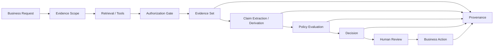
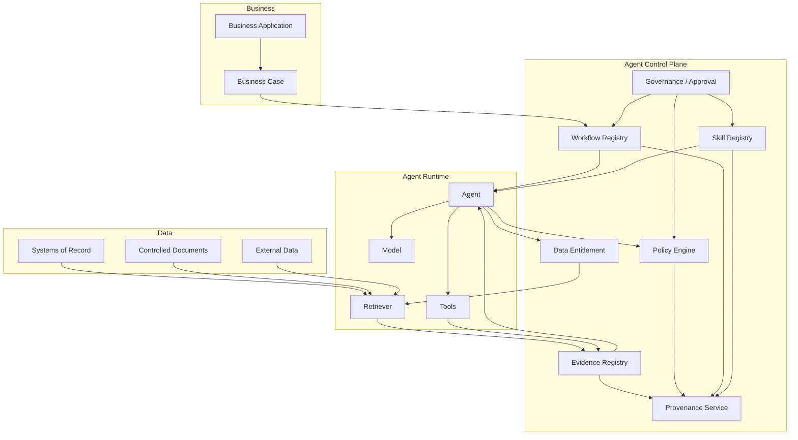
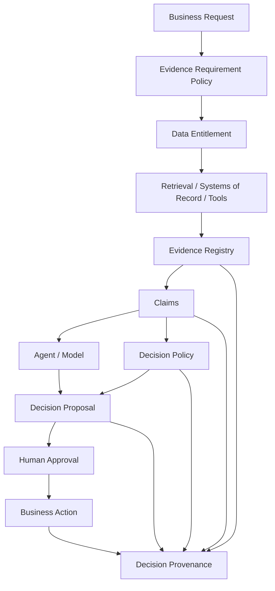

# 金融 Agent 中的 Evidence-First 设计

## 一、金融 Agent 的核心问题不是“能不能回答”，而是“凭什么回答”

传统企业应用通常是确定性系统：

```text
Input
  ↓
Business Logic
  ↓
Rule
  ↓
Output
```

审计一个这样的系统，通常可以沿着：

```text
Input
→ Rule
→ Code
→ Output
```

进行追踪。

Agent 系统则不同：

```text
User Request
      ↓
    Agent
      ├── Retrieval
      ├── Tool Call
      ├── Search
      ├── Skill
      ├── Model
      └── Policy
           ↓
       Conclusion
           ↓
       Business Action
```

Agent 的输出不再只是某个固定规则计算的结果，而可能是多个来源的信息经过检索、转换、归纳、推理后形成的结论。

于是金融机构真正需要回答的问题变成：

> **这个 Agent 结论，究竟是基于哪些 Evidence 得出来的？**

更进一步：

> **这些 Evidence 当时是什么版本、来自哪里、是否具有业务权威性、Agent 是否被授权使用、它们具体支持了结论中的哪一个 Claim，以及为什么这些 Evidence 足以支持后面的 Decision？**

这就是本文所说的 **Evidence-First**。

这里需要先说明：

> **Evidence-First 不是一个现成的监管术语，而是本文对金融 Agent 架构原则的概括。**

它的核心不是“给答案加引用”，而是改变 Agent 的数据流和控制流：

```text
传统 Agent

Question
   ↓
Agent / LLM
   ↓
Answer
   ↓
事后找引用


Evidence-First Agent

Question
   ↓
Evidence Scope
   ↓
Authorized Evidence
   ↓
Claims
   ↓
Policy / Decision
   ↓
Answer / Action
```

也就是说：

> **Evidence 不再是回答生成之后附加的解释材料，而是 Decision 的一等输入。**

这与当前金融监管对 AI 的关注方向是相符的。ESMA 已明确提醒投资服务机构，AI 使用涉及数据质量、透明度、可解释性、过度依赖以及治理责任等风险；FINRA 2026 年监管报告则直接提出，对 GenAI 应建立治理和模型风险管理框架、持续测试和监控，并考虑保存 prompt/output logs、跟踪模型版本及进行 human-in-the-loop review。

---

# 二、Evidence-First 并不等于 RAG

这是首先需要澄清的问题。

很多 Agent 架构已经是：

```text
Question
   ↓
Vector Search
   ↓
Top-K Documents
   ↓
LLM
   ↓
Answer + Citations
```

这确实比完全依赖模型参数要好，但还不能称为 Evidence-First。

因为：

```text
Retrieved
    ≠ Relevant

Relevant
    ≠ Authoritative

Authoritative
    ≠ Current

Current
    ≠ Authorized

Authorized
    ≠ Sufficient

Sufficient
    ≠ Correctly Used

Correctly Used
    ≠ Correct Decision
```

RAGTruth 对接近 18,000 个 RAG responses 进行人工标注，发现即使提供 retrieval context，模型仍可能生成与 context 不一致或者没有被 context 支持的 claims。

Microsoft 当前对 RAG 的评估也已经明确把这些问题拆开：retrieval、groundedness、relevance、response completeness 分别衡量检索质量、是否超出 grounding context、是否回答相关以及是否遗漏关键内容。对 Agent，又进一步评估 tool selection、tool input accuracy、tool output utilization 等过程问题。

因此：

> **RAG 是 Evidence-First 的基础设施之一，但不是 Evidence-First 本身。**

---

# 三、Evidence-First 真正改变的是“Decision 的输入模型”

传统 Agent 通常把模型看成核心：

```text
Decision = LLM(Prompt, Context)
```

Evidence-First 更适合采用：

```text
Decision =
    Policy(
        Claims(
            Authorized Evidence,
            Tools,
            Workflow Context
        )
    )
```

这里故意把 `Evidence` 放到了模型之前。

一个更完整的架构可以表示为：



其中有一个非常重要的设计：

```text
Evidence
   ↓
Claim
   ↓
Policy
   ↓
Decision
```

而不是：

```text
Evidence
   ↓
LLM
   ↓
Decision
```

LLM 仍然可以参与：

* 信息抽取
* 摘要
* 分类
* 推理
* 假设生成
* 候选方案生成

但它不应该自动定义：

> 哪些信息是 Evidence、什么 Evidence 足以改变业务控制边界、什么情况下可以执行高风险 Action。

---

# 四、金融 Agent 最应该建立的是“Evidence Object”

如果 Evidence 只是：

```json
{
  "document": "policy.pdf"
}
```

信息远远不够。

一个真正进入金融 Decision 的 Evidence，至少应该具备：

```json
{
  "evidence_id": "E-91821",
  "source_type": "policy",
  "source_id": "POLICY-23",
  "source_version": "23",
  "artifact_hash": "sha256:...",
  "location": {
    "page": 17,
    "section": "3.2",
    "span": "..."
  },
  "effective_from": "2026-07-01",
  "effective_to": null,
  "observed_at": "2026-09-20T10:31:00Z",
  "retrieved_at": "2026-09-20T10:31:02Z",
  "authorization_context": "...",
  "authority_class": "approved_policy"
}
```

每个字段解决的问题都不同。

| 属性                      | 回答的问题          |
| ----------------------- | -------------- |
| `source_id`             | 来自哪个系统？        |
| `source_version`        | 是哪个版本？         |
| `artifact_hash`         | 具体内容是什么？       |
| `location`              | 原始来源中的哪一部分？    |
| `effective_from/to`     | 当时是否已经生效？      |
| `observed_at`           | 数据是什么时候的状态？    |
| `retrieved_at`          | Agent 什么时候看到它？ |
| `authorization_context` | Agent 是否有权使用？  |
| `authority_class`       | 在业务上属于什么权威等级？  |

Amazon Bedrock 当前的 `RetrieveAndGenerate` API 已经把生成回答中的 citation segment 与 retrieved references 联系起来，而 `RetrievedReference` 可以携带 cited content、source location 和 metadata。它是“回答 → 来源”关系的工程化实现，但企业审计通常还需要继续增加版本、授权、有效时间和业务语义。

Google Vertex AI 的 grounding metadata 也提供 generated content 与 grounding chunks / supports 的映射。

这些产品实践说明一个方向已经越来越明确：

> **来源与生成内容之间的结构化关系，正在成为企业 GenAI 基础能力，而不仅是 UI 上的一条引用链接。**

---

# 五、最小审计单位不是 Answer，而是 Claim

例如 Agent 最终输出：

> “建议批准该交易，因为客户风险较低，而且交易金额低于内部限额。”

表面看是一个结论。

实际上至少可以拆成：

```text
C1: 客户风险等级 = Low

C2: 交易金额 = 8m

C3: 该客户属于允许交易的客户类型

C4: 该客户对应的适用限额 = 10m

C5: 8m < 10m

D1: 建议批准
```

其中：

```text
C1 ← Risk System
C2 ← Trading System
C3 ← Client Master
C4 ← Policy
C5 ← Derived Calculation

D1 ← C1 + C2 + C3 + C4 + C5 + Decision Policy
```

于是一个 Decision 就不再是：

```text
Answer → Citation
```

而是：

```text
Decision
   ↓
Claims
   ↓
Evidence
   ↓
Source
```

这一思想与 FActScore 的研究思路高度一致：复杂生成文本应该拆成 atomic facts，再逐个检查是否具有可靠知识来源支持，而不是把整段回答作为一个不可分解的正确/错误对象。

所以对于金融 Agent：

> **Claim 应该成为 Evidence System 和 Decision System 之间的基本接口。**

---

# 六、Citation 不是 Proof

这是 Evidence-First 最重要的思想之一。

Agent 写：

> “该客户风险评级为 High。[1]”

并不代表 `[1]` 就证明了这个 Claim。

至少还需要验证：

```text
Citation
   ↓
Source
   ↓
Relevant Span
   ↓
Does Span actually support Claim?
```

可能存在：

### 错引用

文档是真的，但与这个客户无关。

### 弱支持

文档说：

> “高风险客户通常需要额外审核。”

但 Agent 输出：

> “所有高风险客户必须由董事级人员审批。”

后者已经超出了 Evidence。

### 时间错误

当前文档支持这个结论，但 Decision 发生时使用的是旧政策。

### 权限错误

文档确实正确，但该用户/Agent 没有权限访问。

### 冲突

另一份更高权威的 Policy 与该文档相冲突。

### 片面 Evidence

Evidence 支持结论的一部分，却不能支持完整 Decision。

NIST 的 GenAI Profile 特别提醒，模型不仅可能生成错误内容，也可能生成看似用于解释答案的错误逻辑和虚假 citations，因此“模型自己提供了一个理由”不能等同于可靠 Evidence。

所以应该建立：

```text
Citation
    ↓
Evidence Validation
    ↓
Claim Support
```

而不是：

```text
Citation
    ↓
Trust
```

---

# 七、Evidence-First 的核心不是“相信 Evidence”，而是“验证 Evidence”

Evidence 本身也需要质量控制。

一个比较适合金融 Agent 的 Evidence Quality Model 是：

```text
Evidence Quality
│
├── Relevance
├── Authority
├── Freshness
├── Correctness
├── Completeness
├── Consistency
├── Entitlement
└── Traceability
```

### Relevance

它真的与当前 Claim 有关吗？

### Authority

来源是：

```text
System of Record
Approved Policy
Regulator
Vendor
Research
Search result
```

中的哪一种？

### Freshness

它在 Decision 时间点是否有效？

### Correctness

原始 Evidence 是否正确？

### Completeness

有没有遗漏另一个决定性事实？

### Consistency

是否与其他 Evidence 冲突？

### Entitlement

Agent 是否有权使用它？

### Traceability

是否能回到原始记录？

这与当前主流 RAG evaluation 越来越把 retrieval、groundedness、completeness 分开评估的趋势一致。Microsoft 的官方评估框架已经明确区分 retrieval、groundedness、response completeness，并针对 Agent 增加 tool call accuracy、tool output utilization 等过程评估。

---

# 八、金融场景必须增加“Authority”

普通搜索场景可能接受：

```text
多个网页
→ 找一个最相关的
→ 回答
```

金融业务不能简单这样做。

例如：

```text
Regulator
   ↑
Official Exchange
   ↑
Internal Approved Policy
   ↑
Vendor Data
   ↑
Research
   ↑
Search Result
   ↑
LLM-generated statement
```

它们并不是同等级 Evidence。

因此建议企业建立 Evidence Authority Class：

| Class                      | 例子                        | 典型用途  |
| -------------------------- | ------------------------- | ----- |
| System of Record           | Trade / Client / Position | 事实数据  |
| Approved Policy            | 风险规则、产品政策                 | 控制判断  |
| Official Regulatory Source | 监管机构、交易所                  | 监管事实  |
| Approved Research          | 内部研究报告                    | 投资研究  |
| Vendor Data                | LSEG、Bloomberg 等          | 外部数据  |
| Search Result              | Web Search                | 探索性信息 |
| Model-derived              | Agent 推导                  | 派生信息  |

重点不是简单规定：

> “Search 永远不可信。”

而是：

> **不同 Decision Type 对 Evidence Authority 的要求不同。**

例如：

```text
Research Summary
→ Approved Research + Vendor Data

Compliance Analysis
→ Approved Policy + Regulatory Source

Trade Authorization
→ System of Record + Applicable Policy

Regulatory Filing Decision
→ Official Source + Controlled Internal Documentation
```

这实际上把：

```text
What does the Agent know?
```

升级成：

```text
What evidence is admissible for this Decision?
```

---

# 九、Evidence-First 最重要的控制点之一：Data Entitlement

金融 Agent 最危险的错误之一，不一定是“用了错误 Evidence”。

还可能是：

> **用了正确但不应该看到的 Evidence。**

例如：

```text
Restricted M&A data
      ↓
Retrieval
      ↓
Agent
      ↓
Investment recommendation
```

即便最终 recommendation 在事实上完全正确，也可能构成信息权限问题。

所以 Evidence-First 必须在 retrieval 前建立：

```text
User
  ↓
Business Entitlement
  ↓
Evidence Scope
  ↓
Retrieval
```

而不是：

```text
Retrieve Everything
  ↓
LLM
  ↓
Hope the model ignores restricted data
```

Amazon Bedrock 的知识库/检索 API 已经提供 user context、metadata filtering 等能力，用于根据访问上下文控制可检索数据。

但企业架构不能把“retrieval filter”误认为完整的 authorization boundary。

更合理的是：

```text
Data Entitlement
       ↓
Retrieval Scope
       ↓
Evidence
       ↓
Decision Policy
       ↓
Business Action Authorization
```

也就是说：

> **Evidence Access 与 Decision Authorization 是两个不同的控制点。**

---

# 十、Evidence-First 需要两个 Policy Gate

这一点对金融 Agent 尤其重要。

### Gate 1：Evidence Access Policy

回答：

> Agent 能不能看到这条 Evidence？

```text
User
 ↓
Entitlement
 ↓
Allowed Evidence
```

### Gate 2：Decision Policy

回答：

> 这些 Evidence 是否足以支持这个业务动作？

```text
Claims
 ↓
Policy
 ↓
Decision
```

两个问题不能混在一起。

例如：

```text
Evidence E1
```

用户有权查看。

但：

```text
E1 alone
```

不足以批准一笔交易。

因此：

```text
Access Allowed
≠
Decision Allowed
```

这是金融 Agent 与普通 RAG Chatbot 在架构上的一个关键区别。

---

# 十一、Evidence 不能自动成为 Decision

Evidence-First 很容易被错误理解成：

> “只要 Evidence 足够多，Agent 就可以决定。”

这恰恰不是目标。

正确结构应该是：

```text
Evidence
   ↓
Claims
   ↓
Policy
   ↓
Decision
```

而不是：

```text
Evidence
   ↓
LLM
   ↓
Decision
```

例如：

```text
Evidence:
Client risk score = 82

Policy:
Risk > 80
→ Enhanced Review Required
```

Agent 可以负责：

```text
读取 Evidence
→ 识别 risk_score
```

但：

```text
“Risk > 80 是否意味着需要 Enhanced Review”
```

应该来自 Policy，而不是模型自己的常识。

因此：

> **Evidence First 不意味着 Evidence Defines Policy。**

Evidence 提供事实。

Policy 定义允许的行为边界。

Agent 可以参与解释和建议，但不应该自行改变企业控制边界。

---

# 十二、Evidence First 还必须记录“没有 Evidence”

这是金融场景里非常重要的一点。

传统系统喜欢：

```text
Found → Continue
```

Evidence-First 应该支持：

```text
Found
Not Found
Insufficient
Conflicting
Stale
Unauthorized
Superseded
```

例如：

```text
Question:
客户是否满足特殊产品准入条件？

Search:
Product Policy       → found
Client Segment       → found
Latest Suitability   → not found
```

这时 Agent 不应该：

```text
Not Found
   ↓
推测一个结论
```

更合理的是：

```text
Evidence Gap
   ↓
Abstain / Escalate
```

特别是：

> **没有找到 Evidence，不等于 Evidence 不存在；找不到证据，也不等于证明命题为假。**

例如：

```text
“没有发现客户存在违规记录”
```

与：

```text
“可以证明客户不存在违规记录”
```

完全不是同一件事。

因此 Evidence-First 应把：

```text
absence of evidence
```

作为一种明确状态，而不是把它转化为：

```text
false
```

---

# 十三、金融 Agent 最应该具备的是“Evidence-aware Abstention”

传统 LLM 往往试图回答：

```text
任何问题
→ 给出答案
```

Evidence-First 应该允许：

```text
没有足够 Evidence
        ↓
“无法形成可靠结论”
```

或者：

```text
Evidence conflict
        ↓
“需要人工确认”
```

或者：

```text
Evidence stale
        ↓
“需要重新取得当前数据”
```

或者：

```text
Evidence unauthorized
        ↓
“不能使用该信息作出判断”
```

这不是 Agent 体验下降。

对于高风险金融流程，这往往是控制能力。

Microsoft 当前 Agent evaluation 已经把 `abstention` 纳入质量评估维度之一；其 Agent/RAG 评估也把 groundedness、completeness、tool-output utilization 等分开处理。

因此，金融 Agent 的成熟度不应该简单看：

```text
Answer Rate
```

还要看：

```text
Correct Answer Rate
Evidence Support Rate
Evidence Coverage
Appropriate Abstention Rate
```

---

# 十四、Evidence-First 也意味着“先检索，再生成”，但不能简单理解成 Pipeline 顺序

很多人看到 Evidence-First 后会认为：

```text
Retrieval
   ↓
LLM
```

就够了。

实际上更重要的是控制关系：

```text
                   ┌───────────────┐
                   │ Evidence Scope│
                   └───────┬───────┘
                           ↓
                    Authorized Search
                           ↓
                      Evidence Set
                           ↓
                 ┌─────────┴────────┐
                 ↓                  ↓
             Claim C1            Claim C2
                 ↓                  ↓
                 └────────┬─────────┘
                          ↓
                    Policy Engine
                          ↓
                       Decision
```

LLM 可以存在于：

```text
Query decomposition
Evidence extraction
Claim generation
Conflict analysis
Summarization
Explanation
```

但每一次使用都应该知道：

> **它在处理什么 Evidence。**

因此 Agent Context 不应该只是：

```json
{
  "context": "a huge string"
}
```

而应该更接近：

```json
{
  "evidence": [
    {
      "id": "E1",
      "source": "risk-system",
      "content": "...",
      "version": "...",
      "authority": "system_of_record"
    },
    {
      "id": "E2",
      "source": "policy",
      "content": "...",
      "version": "23",
      "authority": "approved_policy"
    }
  ]
}
```

这样模型产生：

```text
Claim C1
```

时，才能明确引用：

```text
derived_from = [E1, E2]
```

---

# 十五、这也是为什么“大上下文”不是 Evidence-First

现代模型 context window 很大，很容易诱导一个架构：

```text
把所有资料塞进去
        ↓
让 Agent 自己判断
```

这不是 Evidence-First。

因为：

```text
Large Context
```

并不会自动解决：

* 权限
* 权威性
* 版本
* 时效
* 冲突
* 完整性
* provenance

甚至可能让这些问题更难追踪。

更合理的是：

```text
Raw Data
   ↓
Evidence Registry
   ↓
Authorized Retrieval
   ↓
Structured Evidence
   ↓
Agent Context
```

Context 是：

> **Evidence 的运行时投影**

而不是：

> **Evidence 的系统记录。**

---

# 十六、Vector Database 也不应该成为 Evidence System of Record

一个常见企业架构是：

```text
Documents
  ↓
Chunk
  ↓
Embedding
  ↓
Vector DB
```

然后认为：

```text
Vector DB = Knowledge Base = Evidence
```

从审计角度是不够的。

Vector DB 更接近：

> **Retrieval Optimization Layer**

而不是：

> **Evidence System of Record**

建议：

```text
                        Evidence System
                             │
             ┌───────────────┼───────────────┐
             ↓               ↓               ↓
        Source Store    Evidence Registry   Metadata
             │               │
             └───────┬───────┘
                     ↓
               Retrieval Index
              / Vector / Search
```

Vector index 可以告诉 Agent：

> 哪些内容可能相关。

Evidence Registry 应该能够回答：

> 当时实际使用的是哪个原始 artifact、哪个版本、哪个 span？

这也是为什么 AWS 当前的 citation object 不仅包含 response span，还提供 retrieved reference 的 content、location 和 metadata。

---

# 十七、Evidence First 应该与 Decision Provenance 直接连接

Evidence-First 解决的是：

> Decision 应该以什么为依据？

Decision Provenance 解决的是：

> 事后如何证明当时用了什么依据？

两者其实是一体两面。

推荐的数据结构：

```text
Decision
  │
  ├── Claims
  │     ├── C1
  │     │    ├── E1
  │     │    └── E2
  │     └── C2
  │          └── E3
  │
  ├── Policies
  │     └── P23 / Rule R17
  │
  ├── Workflow
  │     └── W18
  │
  ├── Skill
  │     └── S7
  │
  └── Authorization
        └── A91
```

这样：

```text
Evidence First
```

发生在执行时。

```text
Decision Provenance
```

发生在执行时和执行后。

这也是前面讨论 Workflow / Skill / Policy Version 时真正应该连接起来的地方：

> **Version Lineage + Evidence Lineage = Decision Provenance。**

---

# 十八、Evidence Provenance 不应该依赖 Agent 自己写一段“为什么”

这是非常重要的架构边界。

错误做法：

```text
Agent Decision
     ↓
Prompt:
“Explain why you reached this conclusion.”
     ↓
LLM explanation
     ↓
Audit Log
```

这种方式的问题是：

> **审计记录本身仍然是模型生成的。**

NIST 明确指出，GenAI 可能产生错误的内容、逻辑以及看似合理但不真实的 citations。

因此应该：

```text
Execution Events
   ↓
Structured Provenance
   ↓
LLM Explanation
```

而不是：

```text
Decision
   ↓
LLM
   ↓
Post-hoc Explanation
```

最终给审计人员看的自然语言解释可以由 LLM 生成。

但是：

```text
Evidence
Claim
Policy
Version
Authorization
Decision
```

这些核心事实应该来自结构化系统记录。

---

# 十九、不要把 Chain-of-Thought 当作 Evidence

Agent 系统很容易走向另一个极端：

> “如果最终结论不够可信，把模型内部 reasoning 全部保存下来。”

这也不是 Evidence-First 的目标。

企业真正需要的是：

```text
What Evidence?
Which Claim?
Which Policy?
Which Decision?
Which Action?
```

而不是：

```text
模型生成了多少 token
```

因此更合理的是：

```text
Evidence Trace
+
Tool Trace
+
Policy Decision Log
+
Version Lineage
+
Business Decision
```

而不是试图把：

```text
unrestricted chain-of-thought
```

作为金融审计系统的核心对象。

这也符合 2026 年英国央行 AI Consortium 的讨论方向。其公开会议纪要指出，金融机构正在研究如何让 AI explainability/transparency 真正服务于理解决策和判断系统是否按预期运行，同时讨论了现有 model risk management expectations 对 generative AI models、prompts 和 retrieval layers 的适用性。

重点越来越从：

> “模型内部到底想了什么？”

转向：

> **“系统为什么产生这个结果，以及能否验证它按照预期运行？”**

---

# 二十、Evidence-First 要特别处理“冲突 Evidence”

金融系统中的 Evidence 很少永远一致。

例如：

```text
Risk System
risk = HIGH

Research Dataset
risk = MEDIUM

Client System
risk = HIGH
```

Agent 不应该简单：

```text
多数投票
```

而应该建立：

```text
Evidence Conflict
      ↓
Authority Resolution
      ↓
Temporal Resolution
      ↓
Policy
      ↓
Decision
```

例如：

```text
System of Record > cached research copy
Current effective policy > historical policy
Approved source > unverified search result
```

这些优先级应该是企业 Policy，而不应该由 LLM 自己决定。

因此一个 Evidence Registry 最好允许：

```text
conflicts_with
supersedes
derived_from
supports
contradicts
```

等关系。

这样：

```text
Evidence Graph
```

就不只是：

```text
Document A → Claim
```

而可能是：

```text
E1 ─supports──> C1
E2 ─contradicts─> C1
E3 ─supersedes─> E2
```

这才接近真实金融业务中的信息处理。

---

# 二十一、Evidence First 还需要 Temporal Provenance

金融数据最大的特点之一是：

> **“什么时候是真的”本身就是数据的一部分。**

例如：

```text
Market Price = 101.25
```

必须知道：

```text
observed_at = 10:31:02
```

而 Policy：

```text
Limit = 10m
```

则需要知道：

```text
effective_from
effective_to
```

客户状态可能需要：

```text
as_of_date
```

因此 Evidence 不能只保存：

```text
value
```

而应该考虑：

```text
Observed Time
Effective Time
Retrieved Time
Version
```

特别是：

```text
Current source
```

不能自动替代：

```text
Historical source snapshot
```

否则半年以后重新查询同一个系统，得到的新数据可能已经无法解释当时为什么做出了 Decision。

---

# 二十二、Evidence First 与金融模型风险管理其实是相通的

金融机构长期以来并不是第一次面对：

> “一个复杂模型给出了一个结论，但如何证明它是合理的？”

SR 11-7 要求银行对模型开发、实施、使用和验证建立治理体系，并强调模型文档、验证、模型限制以及持续监控。其还明确指出，重大模型变化需要重新验证。

这意味着对于 Agent：

```text
Model
Prompt
Retrieval
Policy
Tool
Evidence
```

不应该被看成完全独立的黑盒组件。

2026 年 Bank of England AI Consortium 的讨论已经直接把 prompts、retrieval layers 等纳入 AI 系统和现有 model risk management 思考范围。

因此，Evidence-First 可以看作把传统模型风险治理向 Agent System 扩展：

```text
Traditional Model Governance

Data
 ↓
Model
 ↓
Output
 ↓
Validation


Agent Governance

Data
 ↓
Retrieval
 ↓
Evidence
 ↓
LLM / Skill
 ↓
Claims
 ↓
Policy
 ↓
Decision
 ↓
Action
```

审计对象自然也从：

```text
Model
```

扩大成：

```text
Decision System
```

---

# 二十三、真实金融实践：Morgan Stanley 已经把“Source + AI”放进生产工作流

Morgan Stanley 的 AI @ Morgan Stanley 是非常有参考价值的公开案例。

Morgan Stanley 公开介绍，其内部 AI Assistant 用于帮助 Financial Advisors 检索和使用公司知识；公开案例还描述了其 evaluation framework、持续 regression testing 以及对 retrieval 方法的持续调整。

其 AskResearchGPT 则明确允许员工查看相关研究材料的 citations，并可以把研究结果带入后续客户沟通工作流。

这个案例能够支持几个事实：

```text
金融生产 AI
≠
纯 Chatbot

而是：
Knowledge Retrieval
+
Evaluation
+
Human Workflow
+
Source Traceability
```

但不应该过度推论为：

> Morgan Stanley 公开披露了完整的监管级 Evidence Provenance 架构。

公开资料能够证明的是：

> **Source-linked AI 和系统化 evaluation 已经进入真实金融生产场景。**

更深层的审计实现仍然属于企业内部架构，不能仅凭公开材料推断。

---

# 二十四、一个更近的行业信号：金融 AI 产品正在直接把“Evidence”变成用户能力

2026 年 9 月，OpenAI 发布面向金融服务的 ChatGPT，并公开强调其金融数据体系中的 granular citations，使 bankers 可以追踪 figures 和 claims 回到 source，并在分析过程中检查 evidence。

这个实践值得注意，但同样需要正确理解。

它说明：

```text
Source
→ Claim
→ Citation
```

已经开始从“研发阶段的 RAG 能力”，变成金融工作流产品的显式用户能力。

但：

```text
Granular Citation
```

仍然不等于：

```text
Regulatory-grade Decision Provenance
```

后者还需要：

```text
Evidence Version
Authorization
Policy
Workflow
Skill
Model
Decision
Action
Retention
```

这正是企业内部 Agent Platform 需要进一步建设的部分。

---

# 二十五、另一个金融监管案例：AI 的“说法”本身也必须可证实

2024 年，SEC 对 Delphia 和 Global Predictions 提起执法行动，原因之一是两家投资顾问对自身 AI 能力作出了虚假或误导性陈述，合计支付 40 万美元民事罚款。SEC 的执法事实说明：

> **金融机构对于自己到底使用了什么 AI、AI 到底做了什么的描述，本身也是需要准确和可验证的。**

这个案例并不是 Evidence-First 的直接技术案例，也不能推出：

> “Evidence-First 就能避免这类违法行为。”

但它提供了一个很重要的治理信号：

```text
AI System
   ↓
What it claims to do
   ↓
Should correspond to
   ↓
What the system actually does
```

这进一步说明：

> **AI governance 不能只审模型输出，也需要审系统实际行为和证据链。**

---

# 二十六、金融监管正在从“AI 模型”转向“AI 系统”

这也是为什么 Evidence-First 值得成为架构层原则。

IOSCO 2025 年关于资本市场 AI 的报告指出，金融机构应采用贯穿 AI 生命周期的治理方式，并特别强调 AI 使用中的 data quality、data provenance、cybersecurity 以及模型的非确定性和可解释性问题。

FINRA 2026 年报告进一步建议，对 GenAI 建立正式 governance / model risk management framework，保持 comprehensive documentation，并持续监控 prompts、responses、outputs，同时考虑记录模型版本和 human review。

DORA 则从 ICT change management 的角度要求金融实体确保 ICT 变化被：

```text
Recorded
Tested
Assessed
Approved
Implemented
Verified
```

并以受控方式实施。

这些要求并没有直接规定“Evidence-First”这个架构名称。

但它们共同指向一个方向：

> **金融机构需要能够解释和重建 AI 系统在特定时间、特定配置和特定数据环境下的实际行为。**

---

# 二十七、因此建议建立一个“Evidence Control Plane”

如果 Agent 平台只是：

```text
Agent Runtime
+
Vector DB
+
LLM
```

Evidence 很容易变成某个 prompt 中的一段字符串。

更合理的架构是把 Evidence 提升到平台级 Control Plane。



其中 Evidence Registry 至少承担：

```text
Source Resolution
Version Resolution
Authorization Context
Content Snapshot
Location
Authority
Temporal Validity
Conflict Metadata
```

而 Provenance Service 负责：

```text
Evidence → Claim
Claim → Policy
Policy → Decision
Decision → Action
```

---

# 二十八、Evidence Registry 与普通 Knowledge Base 应该分开

建议明确区分：

```text
Knowledge Base
=
“方便 Agent 找到相关内容”

Evidence Registry
=
“证明某个 Decision 当时依据了什么”
```

Knowledge Base 可以：

```text
re-index
re-chunk
re-embed
re-rank
delete stale cache
```

但 Evidence Record 一旦被用于高风险 Decision，应该具备：

```text
immutable reference
version
content hash
source location
retrieval timestamp
authorization context
```

因此一个架构中可以同时存在：

```text
Vector DB
Search Index
Evidence Store
Audit Store
```

它们解决的问题完全不同。

---

# 二十九、Evidence First 应该贯穿三种 Agent Output

不是所有 Agent 都需要同样级别的 Evidence。

建议至少分为：

## Level 1：Informational

例如：

> “解释一下某项监管规则。”

要求：

```text
Source citation
```

即可满足大多数普通使用场景。

---

## Level 2：Advisory

例如：

> “基于目前研究，这家公司值得进一步关注吗？”

要求：

```text
Claim-level Evidence
Source Authority
Date / Freshness
Conflicting Evidence
```

同时应该明确：

```text
Fact
vs
Agent Interpretation
```

---

## Level 3：Actionable

例如：

> “该客户是否符合交易条件？”

或者：

> “是否可以执行这一业务动作？”

要求进一步增加：

```text
Evidence Snapshot
Claim Lineage
Policy Version
Authorization
Workflow Version
Skill Version
Human Approval
Execution Trace
```

因此：

> **Evidence 强度应该与 Decision Impact 成正比。**

这不是说所有金融 Agent 都必须变成重型审计系统。

真正合理的是：

```text
Risk-based Provenance
```

---

# 三十、Evidence-First 的执行模型

一个比较实用的运行时模型可以是：

```text
1. Receive Request
        ↓
2. Determine Decision Type
        ↓
3. Determine Required Evidence
        ↓
4. Apply Data Entitlement
        ↓
5. Retrieve Evidence
        ↓
6. Validate Evidence
        ↓
7. Extract Claims
        ↓
8. Detect Conflicts / Gaps
        ↓
9. Apply Policy
        ↓
10. Generate Decision Proposal
        ↓
11. Human Approval if required
        ↓
12. Execute Action
        ↓
13. Persist Provenance
```

这里最值得注意的是：

> **不是 Agent 先想一个答案，然后再给答案找 Evidence。**

而是：

> **先定义这个 Decision 需要什么 Evidence，再允许 Agent 在这个 Evidence space 中形成 Claim 和 Proposal。**

---

# 三十一、可以把 Evidence Requirement 本身做成 Policy

例如：

```yaml
decision_type: trade_approval

required_evidence:
  - trading_position
  - client_risk
  - eligibility
  - applicable_limit

minimum_authority:
  trading_position: system_of_record
  client_risk: risk_system
  eligibility: approved_policy
  applicable_limit: approved_policy

freshness:
  trading_position: 5m
  client_risk: 24h

conflicts:
  action: escalate

missing:
  action: abstain
```

于是：

```text
Agent
```

不再自己决定：

> “我觉得这些信息够了。”

而是由企业定义：

```text
Decision Type
      ↓
Evidence Requirement Policy
      ↓
Evidence Set
```

这也是 Evidence-First 能真正进入金融企业治理体系的关键。

---

# 三十二、Evidence Requirement 与 Policy Version 应该一起进入 Decision Provenance

例如：

```json
{
  "decision_id": "DEC-8821",

  "decision_type": "trade_approval",

  "evidence_requirement_policy": {
    "id": "ERP-17",
    "version": "4"
  },

  "evidence": [
    {
      "id": "E1",
      "source": "risk-system",
      "version": "2026-09-20T10:31:05Z"
    },
    {
      "id": "E2",
      "source": "client-master",
      "version": "2026-09-20T10:31:07Z"
    }
  ],

  "claims": [
    {
      "id": "C1",
      "derived_from": ["E1"]
    },
    {
      "id": "C2",
      "derived_from": ["E2"]
    }
  ],

  "decision_policy": {
    "id": "TRADE-POLICY",
    "version": "23"
  },

  "workflow": {
    "id": "TRADE-APPROVAL",
    "version": "18"
  },

  "skill": {
    "id": "COMPLIANCE-REVIEW",
    "version": "7.2.1"
  }
}
```

这样可以完整回答：

```text
为什么要求这些 Evidence？
→ Evidence Requirement Policy

用了什么 Evidence？
→ Evidence Registry

Evidence 形成了什么判断？
→ Claims

为什么这个判断导致该结果？
→ Decision Policy

Agent 当时处于什么运行环境？
→ Workflow / Skill / Model Version
```

这才形成真正闭环。

---

# 三十三、Evidence-First 也改变了 Agent Evaluation

传统 Agent evaluation：

```text
Answer Quality
```

已经不够。

建议至少增加：

```text
Evidence Retrieval
Evidence Relevance
Evidence Authority
Evidence Coverage
Claim Support
Conflict Handling
Abstention
Policy Compliance
Tool Output Utilization
Decision Traceability
```

可以形成一个简单的质量模型：

```text
Agent Decision Quality
│
├── Evidence Quality
│    ├── relevance
│    ├── authority
│    ├── freshness
│    └── completeness
│
├── Claim Quality
│    ├── correctness
│    ├── support
│    └── contradiction
│
├── Decision Quality
│    ├── policy compliance
│    ├── authorization
│    └── consistency
│
└── Execution Quality
     ├── tool correctness
     ├── action correctness
     └── auditability
```

Microsoft 当前的 Agent Evaluation 已经从单纯 response quality 扩展到 tool selection、tool input accuracy、tool output utilization、groundedness、context coverage、abstention 等维度。

这与 Evidence-First 的思路非常接近：

> **评价 Agent，不应该只评价“最后说得好不好”，还应该评价“它有没有使用正确的依据”。**

---

# 三十四、Evidence-First 最重要的一个设计原则：让“Evidence Gap”成为正常状态

传统 AI 应用往往认为：

```text
No Answer
=
Failure
```

金融 Agent 更合理的模型可能是：

```text
No Evidence
      ↓
Controlled Abstention
```

例如：

```text
Required Evidence:
Client suitability status

Retrieved:
No current record

Decision:
ABSTAIN
Reason:
EVIDENCE_MISSING
Next Action:
Human Review
```

这是比：

```text
Agent guessed
```

更可控的系统行为。

特别是在金融业务中：

```text
False Positive
```

和：

```text
False Negative
```

的成本通常是不对称的。

因此 Evidence Requirement 应该支持：

```text
minimum evidence
mandatory evidence
optional evidence
conflicting evidence
freshness threshold
```

然后由 Policy 决定：

```text
Proceed
Ask
Escalate
Abstain
```

---

# 三十五、Evidence-First 最终解决的，其实是“责任边界”

如果没有 Evidence-First，一个 Agent Decision 很容易变成：

```text
User
 ↓
Agent
 ↓
LLM
 ↓
Answer
```

出了问题之后：

```text
“为什么？”
“模型这样判断的。”
```

这不是企业治理能够接受的答案。

Evidence-First 则把责任拆开：

```text
Source System
→ 提供事实

Evidence Layer
→ 记录事实的来源和状态

Agent
→ 形成候选 Claim / Proposal

Policy
→ 定义允许的 Decision

Workflow
→ 定义业务流程

Human
→ 在需要时承担审批责任

Execution System
→ 执行 Action
```

这样才能做到：

> **Agent 可以自主推理，但不能自行定义 Evidence 的权威性、企业安全边界和业务授权边界。**

---

# 三十六、Evidence-First 与传统“三道防线”的关系

金融机构通常会把业务、风险/合规和内部审计分成不同控制角色。

Evidence-First 很适合对应这种治理方式：

```text
First Line
Business / Agent
    ↓
Uses Evidence
    ↓
Produces Proposal

Second Line
Risk / Compliance
    ↓
Defines Evidence Requirements
    ↓
Defines Policy
    ↓
Monitors Exceptions

Third Line
Internal Audit
    ↓
Reconstructs Evidence
    ↓
Checks Decision Provenance
```

这样：

```text
Agent
```

并不负责证明自己可信。

而是：

```text
System
```

提供足够 Evidence，让第二、第三道防线独立检查。

---

# 三十七、最终推荐的金融 Agent 架构

可以把整个设计浓缩成：



这个架构的关键不是：

```text
LLM 在哪里
```

而是：

```text
Evidence 在哪里进入控制链
```

---

# 三十八、最终的几个原则

## 原则一：Evidence 是一等业务对象

不是：

```text
String context
```

而是：

```text
Evidence
```

拥有：

```text
Source
Version
Location
Time
Authority
Authorization
Hash
```

---

## 原则二：先确定 Evidence Requirement，再开始 Agent Reasoning

不要：

```text
Reason
→ Search
→ Find justification
```

而应该：

```text
Decision Type
→ Evidence Requirement
→ Authorized Evidence
→ Reason
```

---

## 原则三：Claim 是 Evidence 与 Decision 之间的桥

应该有：

```text
Evidence
   ↓ supports
Claim
   ↓ satisfies
Policy
   ↓ permits
Decision
```

---

## 原则四：Citation 是链接，不是证明

必须验证：

```text
Citation
→ Source
→ Exact Span
→ Support Relation
```

---

## 原则五：正确 Evidence 也不意味着可以执行

必须区分：

```text
Evidence Access
```

和：

```text
Decision Authorization
```

---

## 原则六：Missing Evidence 应该导致 Abstain，而不是 Guess

尤其是：

```text
High-impact Decision
```

---

## 原则七：Evidence Conflict 应该显式建模

不要：

```text
LLM decides which source feels right
```

而应该：

```text
Authority
+
Temporal Rules
+
Policy
```

决定如何处理冲突。

---

## 原则八：Evidence 必须带时间和版本

否则无法重建历史 Decision。

---

## 原则九：Evidence Store 与 Vector Store 分离

```text
Vector DB
=
retrieval optimization

Evidence Store
=
decision evidence
```

---

## 原则十：Provenance 应该由系统生成，而不是由 Agent 自己描述

Agent 可以解释。

系统必须记录。

---

# 三十九、结论

金融 Agent 真正面对的问题并不是：

> “怎样让 LLM 更聪明？”

而是：

> **“怎样让一个概率性的推理系统，在金融机构的确定性控制体系中工作？”**

Evidence-First 是解决这个问题的一种重要架构原则。

它不是：

```text
RAG
+
Citation
```

而是：

```text
Evidence Requirement
        ↓
Authorized Evidence
        ↓
Claim
        ↓
Policy
        ↓
Decision
        ↓
Action
```

同时保存：

```text
Source
Version
Time
Authorization
Provenance
```

最终，一个成熟的金融 Agent 不应该只是：

```text
“我认为应该批准。”
```

而应该能够回答：

```text
为什么？
```

系统给出的不是模型自己生成的一段理由，而是一条可以逐层验证的证据链：

```text
Decision
   ↓
Claim
   ↓
Evidence
   ↓
Source
   ↓
Version / Time / Authority
   ↓
Policy
   ↓
Authorization
   ↓
Workflow / Skill / Model Context
```

这也是 Evidence-First 最核心的价值：

> **不是让 AI 变成一个永远正确的决策者，而是让 AI 的结论在进入企业决策体系之前，必须能够明确说明“依据什么 Evidence、经过什么 Policy、在什么权限和版本环境下形成”。**

对于金融 Agent，这意味着架构关注点需要从：

```text
Prompt
→ Model
→ Answer
```

升级为：

```text
Evidence
→ Claim
→ Policy
→ Decision
→ Action
```

而 Agent Runtime 应当成为这条控制链中的推理能力，而不是控制链本身。

最终可以将这一原则压缩成一句话：

> **金融 Agent 应该先有可验证的 Evidence，再有 AI 的 Claim；先有受控的 Decision Context，再有 AI 的 Recommendation；没有足够 Evidence 时，系统应该知道“不足以判断”，而不是让模型替企业补齐事实。**

---

# 参考资料

1. **NIST — Artificial Intelligence Risk Management Framework: Generative Artificial Intelligence Profile (AI 600-1)**
   NIST 对 GenAI confabulation、虚假内容、虚假逻辑和虚假 citations 的风险进行了系统说明。
   [NIST AI 600-1](https://www.nist.gov/publications/artificial-intelligence-risk-management-framework-generative-artificial-intelligence?utm_source=chatgpt.com)

2. **FINRA — 2026 Annual Regulatory Oversight Report: GenAI**
   涉及 GenAI governance、documentation、testing、monitoring、prompt/output logs、model version tracking 和 human review。
   [FINRA 2026 — GenAI: Continuing and Emerging Trends](https://www.finra.org/rules-guidance/guidance/reports/2026-finra-annual-regulatory-oversight-report/gen-ai?utm_source=chatgpt.com)

3. **DORA — Regulation (EU) 2022/2554**
   金融机构 ICT change management 要求变化被 recorded、tested、assessed、approved、implemented 和 verified。
   [EUR-Lex — DORA](https://eur-lex.europa.eu/legal-content/EN/TXT/?uri=CELEX%3A32022R2554&utm_source=chatgpt.com)

4. **ESMA — Public Statement on AI and Investment Services, 2024**
   讨论投资服务中的 AI 风险，包括 data quality、opacity、over-reliance、privacy/security 和 AI 输出可靠性。
   [ESMA — AI and Investment Services](https://www.esma.europa.eu/press-news/esma-news/esma-provides-guidance-firms-using-artificial-intelligence-investment-services?utm_source=chatgpt.com)

5. **IOSCO — Artificial Intelligence in Capital Markets: Use Cases, Risks, and Challenges, 2025**
   强调 AI 生命周期治理、data quality、data provenance、cybersecurity、非确定性和 explainability。
   [IOSCO — Artificial Intelligence in Capital Markets](https://www.iosco.org/library/pubdocs/pdf/IOSCOPD788.pdf?utm_source=chatgpt.com)

6. **Federal Reserve — SR 11-7: Supervisory Guidance on Model Risk Management**
   模型治理、验证、文档、模型限制、持续验证及重大模型变化重新验证的重要监管基础。
   [Federal Reserve — SR 11-7](https://www.federalreserve.gov/supervisionreg/srletters/sr1107.htm?utm_source=chatgpt.com)

7. **Bank of England — AI Consortium Minutes, February 2026**
   讨论金融 GenAI 的 explainability、transparency，以及 prompts、retrieval layers 与既有 model risk management expectations 的关系。
   [Bank of England — February 2026 AI Consortium Minutes](https://www.bankofengland.co.uk/minutes/2026/february/ai-consortium-minutes-9-february-2026?utm_source=chatgpt.com)

8. **Bank of England — AI Consortium Minutes, June 2026**
   进一步讨论 AI 系统中的 explainability、human-in-the-loop、adversarial testing、accountability 和 auditable documentation。
   [Bank of England — June 2026 AI Consortium Minutes](https://www.bankofengland.co.uk/minutes/2026/june/ai-consortium-minutes-3-june-2026?utm_source=chatgpt.com)

9. **ACL 2024 — RAGTruth: A Hallucination Corpus for Developing Trustworthy Retrieval-Augmented Language Models**
   证明 RAG 环境下仍可能出现 unsupported / contradictory claims，并提供大规模人工标注数据。
   [ACL Anthology — RAGTruth](https://aclanthology.org/2024.acl-long.585/?utm_source=chatgpt.com)

10. **EMNLP 2023 — FActScore**
    将长文本拆成 atomic facts 并逐项判断是否有可靠来源支持，是 Claim-level Evidence 设计的重要研究基础。
    [ACL Anthology — FActScore](https://aclanthology.org/2023.emnlp-main.741/?utm_source=chatgpt.com)

11. **Microsoft Foundry — RAG Evaluators**
    官方把 retrieval、groundedness、relevance、response completeness 分开评估，并区分 process evaluation 与 system evaluation。
    [Microsoft — RAG Evaluators](https://learn.microsoft.com/en-us/azure/foundry/concepts/evaluation-evaluators/rag-evaluators?utm_source=chatgpt.com)

12. **Microsoft Foundry — Agent Evaluators**
    提供 task completion、task adherence、tool selection、tool input accuracy、tool output utilization、groundedness、abstention 等 Agent 评估维度。
    [Microsoft — Agent Evaluators](https://learn.microsoft.com/en-us/azure/foundry/concepts/evaluation-evaluators/agent-evaluators?utm_source=chatgpt.com)

13. **Microsoft Azure Architecture Center — RAG Evaluation**
    讨论 groundedness、completeness、utilization、relevance 和 correctness，并强调 RAG 系统需要持续 evaluation 和历史结果留存。
    [Microsoft — RAG Solution Evaluation](https://learn.microsoft.com/en-us/azure/architecture/ai-ml/guide/rag/rag-llm-evaluation-phase?utm_source=chatgpt.com)

14. **AWS Bedrock — RetrieveAndGenerate**
    提供 generated response 与 retrieved source 之间的 citations，并支持 source content、location、metadata。
    [AWS — RetrieveAndGenerate](https://docs.aws.amazon.com/bedrock/latest/APIReference/API_agent-runtime_RetrieveAndGenerate.html?utm_source=chatgpt.com)

15. **Amazon Bedrock — RetrievedReference / Citation**
    说明 citation 如何关联 generated response segment 与 retrieved reference。
    [AWS — Citation API](https://docs.aws.amazon.com/bedrock/latest/APIReference/API_agent-runtime_Citation.html?utm_source=chatgpt.com)

16. **Microsoft / Azure AI — Agent and RAG Groundedness**
    对 agentic RAG、tool usage、retrieval、groundedness 和 completeness 的进一步评估说明。

17. **Morgan Stanley — AskResearchGPT**
    真实金融生产案例，公开说明研究 AI assistant 提供 research citations，并将 AI findings 纳入后续工作流程。
    [Morgan Stanley — AskResearchGPT](https://www.morganstanley.com/press-releases/morgan-stanley-research-announces-askresearchgpt?utm_source=chatgpt.com)

18. **OpenAI — Morgan Stanley AI Case Study**
    介绍 Morgan Stanley 的 AI Assistant、evaluation framework、每日 regression testing 和 retrieval improvement。
    [OpenAI — Morgan Stanley](https://openai.com/index/morgan-stanley/?utm_source=chatgpt.com)

19. **OpenAI — Introducing ChatGPT for Financial Services, September 10, 2026**
    公开介绍金融数据、granular citations 以及追踪 figures / claims 回到 source 的产品能力；适合作为大型 AI 厂商把 evidence traceability 产品化的当前行业信号，而不是监管级 provenance 已解决的证明。
    [OpenAI — ChatGPT for Financial Services](https://openai.com/index/introducing-chatgpt-financial-services/?utm_source=chatgpt.com)

20. **SEC — Charges Against Delphia and Global Predictions, 2024**
    真实金融执法案例，涉及投资顾问对自身 AI 能力作出虚假或误导性陈述，说明 AI 系统实际能力与其对外陈述之间的可验证性同样属于治理问题。
    [SEC — AI Misrepresentation Enforcement Action](https://www.sec.gov/newsroom/press-releases/2024-36?utm_source=chatgpt.com)
