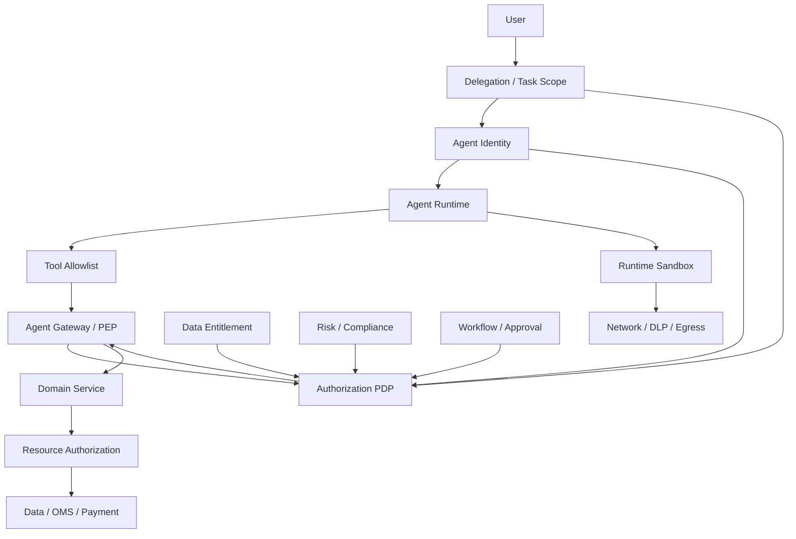
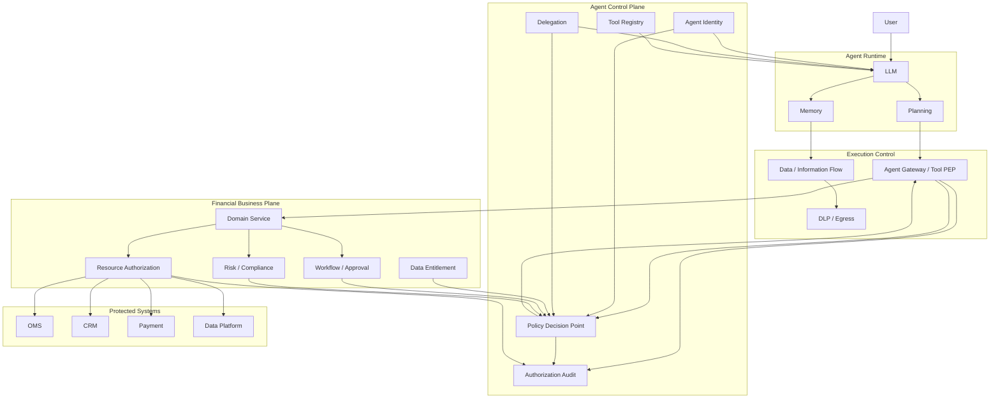

# 金融 Agent 中的 Least Privilege 应该落在哪里

**——从 Agent Identity、Tool Gateway 到业务资源边界的完整授权架构**

**截至 2026 年 9 月 20 日**

## 摘要

在传统企业系统里，“Least Privilege（最小权限）”通常可以被理解为：

> 一个主体只获得完成任务所必需的最小访问权限。

NIST 对 Least Privilege 的定义也是如此：系统应将用户或代表用户执行任务的进程限制在完成任务所必需的最小授权范围内，并要求对权限进行持续审查和必要的撤销。

但 Agent 让这个问题发生了变化。

传统应用的执行路径大多由代码决定：

```text
User
  ↓
Application
  ↓
API
  ↓
Database
```

而 Agent 变成：

```text
User
  ↓
Agent Runtime
  ↓
LLM
  ↓
动态选择 Tool
  ↓
动态生成参数
  ↓
动态组合多个系统
  ↓
Business Action
```

因此，金融 Agent 的 Least Privilege 不应该被理解成“给 Agent 一个最小 IAM Role”这么简单。

它至少涉及：

```text
Agent Identity
+
Delegation
+
Tool / Action Scope
+
Resource Scope
+
Data Entitlement
+
Parameter Constraints
+
Business State
+
Risk / Approval
+
Time / Revocation
+
Runtime / Network Boundary
```

这意味着一个非常重要的架构结论：

> **Least Privilege 不是一个应该“放在某一个组件里”的功能，而是一个必须贯穿整个 Agent→Tool→Resource→Business Execution 链条的系统属性。**

如果必须回答“最应该落在哪里”，答案是：

> **最关键、最权威的 Least Privilege Enforcement Point，应落在实际产生业务副作用的 Action + Resource 边界，也就是 PEP / Domain API / Resource Service 一侧，而不是单纯落在 Agent Runtime、Prompt、MCP Tool Catalog 或 Agent Identity 上。**

原因是：

```text
Agent Identity
```

只能回答：

> “这是哪个 Agent？”

```text
Tool Gateway / PEP
```

可以回答：

> “这个 Agent 想执行什么？”

```text
PDP
```

可以回答：

> “这个主体在当前上下文中是否被允许执行？”

而只有真正保护资源的：

```text
Domain Service
OMS
Payment Service
CRM
Data Access Layer
Database / Storage
```

才能最终保证：

> **“即使上面的 Agent、Gateway 或 Policy 出现错误，这个具体资源仍然不会被越权操作。”**

NIST 2026 年针对 Software and AI Agent Identity and Authorization 的项目，明确把 Agent Identity、Authorization、Auditing、Delegation、Non-repudiation 以及 Prompt Injection Mitigation 放在一起研究；这本身反映了 Agent 已经不能只作为“一个 LLM 应用”处理，而需要进入标准 Identity & Access Control 模型。

IMF 2026 年关于 Agentic AI 与支付的研究则进一步提出一个非常有价值的三层模型：**Intent / Orchestration、Authorization / Control、Settlement**。其核心设计思想是把概率性的 Agent 推理放在上游，而在授权和结算阶段恢复确定性的控制。

因此，对于金融 Agent，最合理的架构不是：

```text
Agent
  ↓
一个很小的 Role
```

而是：

```text
Agent Identity
  ↓
Task / Delegation Scope
  ↓
Tool / Action Scope
  ↓
Resource / Data Scope
  ↓
Business / Risk / Approval Conditions
  ↓
PEP
  ↓
Protected Resource
```

---

# 1. 先重新理解 Least Privilege

NIST 的定义非常适合 Agent：

> 权限应该被限制在完成指定任务所必需的最小范围。

这里有两个关键词：

```text
necessary
+
assigned tasks
```

这意味着 Least Privilege 从来不是：

> “这个主体能不能做？”

而是：

> **“为了完成这个具体任务，它究竟需要能做什么？”**

传统系统中，任务通常由代码定义。

例如：

```text
Job:
Generate monthly report

Required:
database.read
report.write
```

因此：

```text
Service Account
  + database.read
  + report.write
```

可能已经足够。

但 Agent 中：

```text
Task:
分析客户组合并提出再平衡建议
```

可能动态经过：

```text
portfolio.read
market-data.read
research.read
risk.read
calculate.exposure
generate.proposal
```

但并不需要：

```text
trade.submit
payment.execute
customer.delete
```

如果 Agent 的 Role 因为“以后可能用得到”而同时拥有这些能力，那么它已经违反 Least Privilege。

Microsoft 2026 年针对 Agent Least Privilege 的正式指导明确建议：

* 每个 Agent 使用独立、生命周期可管理的身份；
* 使用 task-based role；
* 对 Resource、Data、Operation 多维度做 Scope；
* 对 Tool 使用显式 allowlist；
* 对更高权限使用 JIT / 短期 Entitlement；
* 每个下游系统重新验证授权。

---

# 2. 为什么金融 Agent 的 Least Privilege 不能只落在 Agent Identity

最常见的设计：

```text
InvestmentAgent
   |
   v
IAM Role
   |
   +--> portfolio.read
   +--> research.read
   +--> risk.read
   +--> trade.submit
```

看起来已经有 Least Privilege。

实际上仍然存在巨大问题。

假设：

```text
trade.submit
```

是允许的。

那么这个 Role 仍然不能表达：

```text
只能操作 Portfolio A
只能交易日本股票
单笔不超过 ¥500,000
只能做已经批准的 Rebalance
只能在交易时间内
不能交易受限制证券
不能绕过 SoD
```

因此：

```text
Identity-level Permission
```

最多解决：

> **“Agent 可以碰到哪些类型的能力。”**

而不能完整解决：

> **“Agent 此刻可以对哪一个具体业务对象做什么。”**

这就是为什么把 Least Privilege 全部压缩成 IAM Role，会导致 Agent Security 过度粗粒度。

---

# 3. Agent Least Privilege 实际上有六个维度

金融 Agent 最好将 Least Privilege 拆成：

```text
Who
What
Which Resource
Under Which Conditions
For How Long
With Which Data
```

对应：

| 维度             | 典型控制                     |
| -------------- | ------------------------ |
| Who            | Agent Identity           |
| What           | Action / Tool            |
| Which Resource | Resource Entitlement     |
| Conditions     | Policy / Risk / Workflow |
| Duration       | JIT / Expiry             |
| Data           | Data Entitlement / IFC   |

例如：

```json
{
  "principal": "investment-agent-17",
  "actingFor": "user-382",
  "action": "trade.submit",
  "resource": "portfolio-842",
  "constraints": {
    "market": ["JP"],
    "maxNotional": 500000,
    "assetClass": ["equity"],
    "purpose": "approved_rebalance"
  },
  "expiresAt": "2026-09-20T12:30:00+09:00"
}
```

这才接近真正的：

> **Least-Privilege Capability**

而不是：

```text
trade.submit = true
```

---

# 4. 第一层：Agent Identity——控制“谁”

Least Privilege 的第一层当然应该落在 Agent Identity。

每个生产 Agent 应有独立身份，而不是：

```text
所有 Agent
   ↓
shared-agent-service-account
```

Microsoft 明确建议将 Agent 视为一等 Principal，并给每个 Agent 建立独立身份、生命周期、所有者和权限范围。

NIST 2026 年 Agent Identity 项目也把这一问题作为基础研究方向：Agent 需要能够被识别、认证、授权、审计，并能够与代表谁行动的 Delegation 关系关联。

因此应该至少形成：

```text
User
  |
  | Delegates limited authority
  ↓
Agent Identity
```

而不是：

```text
User
  ↓
Agent
  ↓
inherits entire user session
```

---

# 5. 但 Agent Identity 不能成为全部 Least Privilege

这是最关键的一点。

如果：

```text
Agent Identity
```

被授予：

```text
portfolio.read
trade.submit
payment.execute
```

那么 Prompt Injection、Model Misbehavior、错误 Workflow 或 Tool 参数问题仍然可能触发这些动作。

所以：

> **Agent Identity 应该定义一个“最大可能权限边界”，而不是最终的每一次授权结果。**

可以理解为：

```text
Identity Permission
=
Upper Bound
```

而不是：

```text
Identity Permission
=
Every Current Action is Allowed
```

---

# 6. 第二层：Task / Delegation——控制“这次任务允许什么”

Agent 最大的问题之一是：

> 同一个 Agent 在不同任务中所需要的权限不同。

例如同一个：

```text
Portfolio Agent
```

执行两个任务：

### Task A

```text
“帮我分析 Portfolio A。”
```

需要：

```text
portfolio.read
research.read
risk.read
```

### Task B

```text
“执行已经批准的再平衡。”
```

可能需要：

```text
portfolio.read
risk.read
trade.submit
```

所以更合理的是：

```text
Agent Identity
    +
Task Context
    +
Delegation
```

形成当前有效的权限。

Microsoft 的最新建议也不是为每个任务创建新的 Agent Identity，而是在稳定 Agent Identity 上，通过 JIT Entitlement、临时角色激活、短期 Token 或审批来缩小权限暴露窗口。

这比：

```text
一个 Agent
一个永久 Admin Role
```

安全得多。

---

# 7. 第三层：Tool / Action——控制“能做什么”

这是 Agent Runtime 最容易接触的 Least Privilege 层。

例如：

```text
Research Agent
```

只暴露：

```text
search_research
read_portfolio
calculate_exposure
```

而不是：

```text
search_research
read_portfolio
calculate_exposure
submit_trade
cancel_trade
approve_trade
delete_client
execute_payment
```

这就是：

> **Tool Allowlist / Capability Surface Reduction**

Microsoft 明确建议使用预配置的 Tool Manifest 和高影响操作 allowlist 来减少 Agent 可以使用的工具范围。

这是非常重要的，但它仍然不是最终授权。

因为：

```text
Tool = trade.submit
```

仍然无法回答：

```text
可以替谁交易？
哪个 Portfolio？
哪支证券？
多少金额？
是否已审批？
现在是否允许？
```

---

# 8. Agent Runtime 应该拥有“最小能力集合”，但不能拥有最终授权权

Agent Runtime 最适合负责：

```text
Capability Discovery
Tool Selection
Context Management
Planning
```

但不应该成为：

```text
Final Authorization Authority
```

例如：

```text
LLM:
I want to call trade.submit
```

Runtime 可以判断：

```text
trade.submit
```

是不是当前 Agent 的允许 Tool。

但最终必须：

```text
PEP
  ↓
PDP
```

再决定：

```text
ALLOW / DENY / REQUIRE APPROVAL
```

Microsoft 对 Agent Security 的明确建议就是：

> Agent 可以推理下一步，但不应该自己决定自己是否有权执行。

---

# 9. 第四层：PEP / Agent Gateway——控制“请求能否进入受保护系统”

这是整个架构中非常关键的一层。

推荐：

```text
Agent Runtime
      |
      v
Tool Call Proposal
      |
      v
PEP / Agent Gateway
      |
      v
PDP
      |
      v
Tool / Domain API
```

PEP 的意义是：

> **任何 Agent Action 都必须经过一个不可绕过的执行边界。**

这比：

```text
Agent Runtime
  ↓
直接调用 MCP Server
```

安全得多。

Google 当前 Agent Gateway 的定位就是这一层：它被明确称为 Agent Platform 的关键 Enforcement Component，作为 Agentic Traffic 的入口和出口，对 Agent-to-Agent、Agent-to-Tool 等通信实施身份认证与授权。

Google 的 Agent Gateway 默认采用 Deny-by-Default 的出口控制，Agent 必须满足身份、IAM Policy、注册资源以及 Gateway Authorization Policy 等条件才能访问目标。

---

# 10. AWS AgentCore 给出了非常直接的生产实现

AWS 2026 年正式 GA 的 AgentCore Policy 采用：

```text
Agent
  ↓
Gateway
  ↓
Policy Engine
  ↓
Tool
```

模式。

AWS 明确规定 Gateway 在处理请求时调用 Policy Engine，并支持：

```text
AuthorizeAction
PartiallyAuthorizeActions
```

来执行实时授权以及只返回当前调用者可以使用的 Tool。

AgentCore 甚至让：

```text
tools/list
```

只返回 Policy 允许当前 Principal 看到的 Tool。

但 AWS 同时又明确说明：Tool Listing 本身属于 Meta Action，不包含具体 Tool Invocation 的完整参数上下文，因此真正的调用仍需要再次执行 Policy Evaluation。

这是一个极其重要的架构模式：

```text
Tool Discovery
    ≠
Tool Authorization
```

也就是说：

> **即使一个 Tool 出现在 Agent 的 Tool List 中，仍然不意味着当前这一次调用一定允许执行。**

---

# 11. 第五层：PDP——控制“当前条件下是否允许”

这是 Least Privilege 最核心的 Policy 层。

PDP 应该处理：

```text
Principal
Action
Resource
Context
```

以及：

```text
Delegation
Data Entitlement
Risk State
Workflow State
Approval State
Time
Purpose
```

例如：

```text
Principal:
investment-agent-17

Action:
trade.submit

Resource:
portfolio-842

Context:
symbol = 7203.T
notional = 420000
market = JP
approval = APPROVED
risk = PASS
purpose = rebalance
```

Policy：

```text
ALLOW
```

如果：

```text
notional = 4,200,000
```

那么：

```text
DENY
```

如果：

```text
approval = WAITING
```

可能：

```text
REQUIRE_APPROVAL
```

AWS AgentCore 当前 Policy Model 使用的正是这一类：

```text
Principal
+
Action
+
Resource
+
Conditions
```

并支持把 Tool 参数作为 Policy Context。

---

# 12. 第六层：Resource / Domain——Least Privilege 最终必须落到资源拥有者

这是最重要的答案。

很多 Agent 平台会认为：

```text
Agent Gateway
    ↓
PDP
    ↓
ALLOW
```

之后就可以放心了。

实际上，不应该。

假设：

```text
PDP:
ALLOW trade.submit
```

但 Agent Gateway 错误地把：

```text
portfolioId = P-999
```

传给 Domain API。

真正保护：

```text
P-999
```

的系统仍然应该重新判断：

```text
这个 Principal 能不能操作 P-999？
```

因此：

```text
Agent Gateway
      ↓
Domain API
      ↓
Resource Authorization
```

仍然需要最后一道检查。

Microsoft 的 Agent Least Privilege Guidance 明确要求 downstream tools and services 在每次调用时再次验证 claim、role 和 scope，而不能完全信任 orchestrator 的上游检查。

这也是传统 Zero Trust 在 Agent 时代的延伸：

> **每个真正拥有数据或业务资源的系统，都必须保护自己的权限边界。**

---

# 13. 为什么“最后一道授权”比“Agent Role”更重要

假设：

```text
Agent Role:
trade.submit
```

但是：

```text
OMS:
Portfolio P-123
```

只允许：

```text
Trader-Desk-01
```

执行。

那么：

```text
Agent Role
```

不能覆盖：

```text
OMS Resource Authorization
```

最终应该：

```text
Agent
  ↓
Gateway
  ↓
PDP
  ↓
OMS
  ↓
Resource Authorization
```

如果 Gateway 错误：

```text
ALLOW
```

OMS 仍然可以：

```text
DENY
```

因此：

> **Least Privilege 的最终权威点应该尽可能接近被保护的资源。**

不是因为中心 PDP 不重要，而是因为真正的资源拥有者最知道：

```text
这个 Resource 到底属于谁
当前状态是什么
业务限制是什么
```

---

# 14. 这也是为什么 Data Entitlement 必须落在 Data Plane

金融 Agent 经常有：

```text
portfolio.read
```

但真正的问题是：

```text
which portfolio?
which client?
which legal entity?
which data fields?
```

因此最好形成：

```text
Agent
  ↓
Data Access API
  ↓
Data Entitlement
  ↓
Row / Column / Object Level Access
```

例如：

```text
Agent A
```

只能看到：

```text
Client Set A
```

而：

```text
Agent B
```

只能看到：

```text
Client Set B
```

即使 Agent Gateway 因配置错误允许：

```text
portfolio.read
```

数据库层仍然应该阻止跨 Client 数据访问。

NIST 的 Least Privilege 控制本身就把 Access Enforcement 与 Least Privilege 作为相互关联的控制，并明确要求限制系统资源和执行任务所需的授权。

---

# 15. 第七层：Runtime / Sandbox——控制“即使出错还能造成多大损害”

这层经常被误认为就是 Least Privilege。

严格来说，它更准确地属于：

> **Execution Least Privilege / Blast-Radius Reduction**

例如：

```text
Agent Runtime
```

只需要：

```text
read /tmp
execute Python
call internal API
```

不应该拥有：

```text
~/.ssh
production credentials
unrestricted network
host filesystem
```

这与：

```text
Business Authorization
```

不同。

但它非常重要，因为：

> 即使上层 Policy 错了，Runtime Sandbox 仍然应该限制最终损害。

AWS AgentCore 的 Runtime Security Guidance 就明确要求对 Runtime 关联 IAM Policy 实施 Least Privilege，并警告 Runtime 中的代码或 Actor 可能访问 Execution Role Credentials，因此必须严格限制 Execution Role 的权限。

所以：

```text
Business Least Privilege
+
Execution Least Privilege
```

应该同时存在。

---

# 16. 一个金融 Agent 中真正完整的 Least Privilege 链

推荐：



这里每层解决的问题不同：

```text
Identity
谁？

Delegation
代表谁？

Tool Allowlist
能提出什么？

PEP
必须经过哪里？

PDP
当前是否允许？

Entitlement
能看到哪些数据？

Risk / Workflow
业务条件是否满足？

Resource Authorization
这个具体对象能否真正操作？

Sandbox
出了问题最多能造成多大损害？
```

---

# 17. 因此 Least Privilege 不应该落在一个“Agent Security Service”里

非常常见的设计：

```text
Agent Security Service
```

试图包办：

```text
Identity
Authorization
Risk
Data Access
Tool Security
Workflow
DLP
```

最后形成一个：

> **AI Security God Object**

这并不是好的架构。

更合理的职责分层是：

| 层                | 主要职责                  | 权威程度 |
| ---------------- | --------------------- | ---- |
| Agent Identity   | 定义 Principal          | 高    |
| Delegation       | 定义代表谁、授权范围            | 高    |
| Agent Runtime    | 控制运行时能力面              | 中    |
| Tool Registry    | Tool 治理与发现            | 低    |
| PEP / Gateway    | 强制所有 Tool Action 经过检查 | 高    |
| PDP              | 做上下文授权决策              | 高    |
| Data Entitlement | 控制数据访问                | 极高   |
| Domain Service   | 业务授权与业务状态             | 极高   |
| Workflow         | 审批和业务状态               | 极高   |
| Sandbox          | 限制技术 Blast Radius     | 高    |
| DLP / Egress     | 限制数据外流                | 高    |

---

# 18. 一个非常重要的区别：Permission 与 Capability Budget

Agent Runtime 最适合维护一个：

```text
Capability Budget
```

例如：

```json
{
  "task": "portfolio_analysis",
  "tools": [
    "portfolio.read",
    "research.search",
    "risk.read",
    "exposure.calculate"
  ]
}
```

这非常有用。

它可以让：

```text
Agent Runtime
```

根本看不到：

```text
trade.submit
payment.execute
iam.modify
```

从而降低：

```text
Prompt Injection
Tool Misuse
Reasoning Drift
```

的风险。

但：

```text
Capability Budget
```

不是：

```text
Authorization Truth
```

真正的 Policy 仍然需要：

```text
PEP
+
PDP
+
Resource Owner
```

重新判断。

所以可以把它理解为：

> **Runtime Capability Budget 是攻击面缩减；PDP/Resource Enforcement 才是权限裁决。**

---

# 19. 金融 Agent 最关键的不是“最小 Tool 数量”，而是“最小有效权限”

例如：

```text
Agent A:
只有 5 个 Tool
```

不一定安全。

如果其中一个是：

```text
database.query
```

且拥有：

```text
SELECT *
FROM every_customer
```

那么：

```text
5 Tools
```

也可能意味着：

```text
massive privilege
```

反过来：

```text
Agent B:
20 个 Tool
```

可能每个都只允许：

```text
read specific resource
```

那么总权限反而更小。

因此：

> **Least Privilege 衡量的是 Effective Authority，而不是 Tool Count。**

这是 Agent 架构里非常重要的区别。

---

# 20. 跨系统组合权限必须一起评估

Microsoft 的 2026 年 Agent Least Privilege 实践特别强调一个问题：

> 单独看每个权限可能都合理，但多个系统权限组合起来，可能产生没人明确授权过的更大能力。

例如：

```text
email.read
+
crm.read
+
file.read
+
email.send
```

分别看起来都不算高危。

但是 Agent 可以：

```text
CRM
  ↓
customer data

Files
  ↓
confidential report

Email
  ↓
external recipient
```

组合后就是：

```text
Data Exfiltration Capability
```

因此：

> **Least Privilege 必须评估“组合后的有效权限”，而不只是逐 Tool 权限。**

这在金融 Agent 中尤其重要。

---

# 21. 例如交易 Agent 的权限组合

假设：

```text
portfolio.read
+
market.read
+
risk.read
+
trade.submit
+
trade.cancel
```

每一项都可能合理。

但如果再增加：

```text
client.read
+
payment.execute
```

Agent 的有效权限已经跨越：

```text
Research
Portfolio
Trading
Client Data
Payments
```

即使每一个 Role 单独审核都“合理”，组合起来仍可能形成：

```text
Unacceptable Capability Chain
```

因此企业应该建立：

```text
Entitlement Graph
```

而不是只管理：

```text
Role List
```

---

# 22. “权限组合”是 Agent 与传统服务最大的差异之一

传统 Service：

```text
Service A
  ↓
API B
```

Agent：

```text
Agent
  ↓
Tool A
  ↓
Tool B
  ↓
Tool C
  ↓
Tool D
```

Agent 可以动态组合这些能力。

因此最小权限不能只问：

```text
Can Agent call A?
Can Agent call B?
Can Agent call C?
```

而必须问：

> **Can the Agent chain A → B → C → D into an action that no individual permission was intended to enable?**

这就是：

> **Composed Privilege**

一个成熟 Agent Platform 应该对它进行显式治理。

---

# 23. 风险分级应该影响 Least Privilege 的粒度

金融 Agent 不需要所有操作都使用同样严格的控制。

可以分成：

```text
Low
Medium
High
Critical
```

例如：

| 操作       | 建议                                  |
| -------- | ----------------------------------- |
| 查询公开市场数据 | 基础权限                                |
| 读取已授权研究  | Resource-scoped                     |
| 读取客户数据   | Data Entitlement                    |
| 创建内部草稿   | Action + Resource                   |
| 修改客户记录   | Action + Parameter Policy           |
| 发送外部客户邮件 | Egress + Approval                   |
| 提交交易     | Risk + Policy + Workflow            |
| 支付 / 转账  | Strong Authorization + Approval     |
| 修改 IAM   | Multi-party Approval                |
| 大额资金操作   | JIT + Step-up + Transaction Binding |

因此：

> **Least Privilege 不是简单地“所有权限都尽量少”，而是让权限范围、验证强度和风险等级匹配。**

---

# 24. 这也是为什么“Human Approval”不是 Least Privilege 本身

例如：

```text
trade.submit
```

要求：

```text
Human Approval
```

并不意味着：

```text
Agent 可以操作所有 Portfolio。
```

仍然需要：

```text
Agent Identity
+
Resource Scope
+
Amount Limit
+
Trading Permission
+
Risk Policy
+
Human Approval
```

人只是其中一个控制条件。

所以：

```text
Human Approval
≠
Least Privilege
```

它更准确地属于：

> **Step-up Authorization / High-risk Control**

---

# 25. 对支付类 Agent，Least Privilege 已经逐渐进入“授权意图”层

这是金融领域尤其重要的变化。

Mastercard 2026 年推出 Verifiable Intent，核心是让 Agent 代表用户进行交易时，能够形成抗篡改的授权记录，并以密码学方式证明用户授权了什么。

这解决的不是：

```text
Agent 有没有 purchase Tool
```

而是：

```text
这个具体交易
是否在用户授权的意图范围内？
```

这说明 Agentic Payment 的 Least Privilege 正在从：

```text
Role
```

进一步走向：

```text
Mandate
+
Scope
+
Limit
+
Intent
+
Identity
```

IMF 的 2026 年研究也提出同样的方向：支付系统需要把 Agent 的 Intent / Orchestration 与确定性的 Authorization / Control 分离，再进入 Settlement。

---

# 26. 一个支付 Agent 的 Least Privilege 示例

用户：

```text
“帮我买一张东京到纽约的商务舱机票，
总价不超过 ¥300,000。”
```

Agent 可以：

```text
search_flights
compare_flights
create_booking
```

但它的最终 Authority 不应该是：

```text
payment.execute
```

而应该接近：

```text
Purpose:
flight_booking

MaxAmount:
¥300,000

Currency:
JPY

Destination:
approved merchant ecosystem

PaymentMethod:
Card X

Expiry:
2026-09-20 18:00

Principal:
User A

Agent:
TravelAgent B
```

如果模型被网页中的 Prompt Injection 诱导：

```text
购买 ¥1,800,000 的酒店套餐
```

那么：

```text
Agent can think it
```

并不意味着：

```text
Agent can pay it
```

这就是 Least Privilege 真正应该达到的效果。

---

# 27. 真实案例：BNY 的“Digital Employees”

BNY 是非常有价值的金融业案例。

BNY 公开披露，其企业 AI 平台 Eliza 正在支持其 Agentic AI 和 “digital employees”；2025 年年报称，BNY 已有 134 个 Digital Employees 在运行，并将其描述为能够自主工作的多 Agent AI 解决方案。

更直接的是，BNY 公开介绍过其 Digital Employees 具有：

```text
distinct personas
+
credentials
+
supervisors
```

并强调企业级 AI 治理、数据使用控制、技术护栏和持续监督。

这个案例值得注意的不是“BNY 给每个 Agent 一个 Role”这么简单，而是：

> **Agent 被当成独立的企业主体来治理。**

需要注意的是，BNY 公开资料并没有披露其全部生产权限模型，因此不能据此断言其具体系统完全采用本文提出的 PDP/PEP 分层架构。

但它至少说明，金融机构正在实际采用：

```text
Agent-specific Identity
+
Credentials
+
Supervisor
+
Governance
```

而不是：

```text
一个共享 AI Service Account
```

这与 Microsoft、NIST 当前对 Agent Identity 的架构方向高度一致。

---

# 28. 真实案例：BNY 的 Payment Validation

BNY 还公开介绍过 AI Digital Employees 用于 Payment Validation，帮助处理无法 Straight-Through Process 的支付。

这类场景特别适合说明 Least Privilege 应该落在哪里。

Agent 不需要：

```text
payment.admin
```

它可能只需要：

```text
payment.case.read
payment.validation.read
payment.exception.create
```

而最终：

```text
release payment
```

仍由受保护的 Payment System 根据：

```text
account
mandate
approval
risk
limit
SoD
```

判断。

也就是说：

> **Agent 可以拥有“处理支付异常”的能力，不需要自动拥有“最终释放资金”的能力。**

这就是业务能力与执行权分离。

---

# 29. 真实案例：Mastercard Verifiable Intent

Mastercard 的 Verifiable Intent 更进一步。

它不是只解决：

```text
Agent Identity
```

而是在交易层记录：

```text
User Authorized What?
```

并提供可验证的授权证明。Mastercard 称其目标是建立 Agent 执行用户意图时的共享事实来源和密码学授权证明。

这说明金融行业正在出现一个重要趋势：

```text
Identity
   ↓
Delegation
   ↓
Intent
   ↓
Constraints
   ↓
Transaction Authorization
```

而不是：

```text
Identity
   ↓
Huge Role
   ↓
Agent
```

---

# 30. IMF 的支付研究提供了一个很好的行业架构验证

IMF 2026 年的 Agentic Payment 研究明确提出：

```text
Layer 1:
Intent / Orchestration

Layer 2:
Authorization / Control

Layer 3:
Settlement
```

并强调：

> Agent 的概率性、适应性决策应集中在上游，而授权和结算需要保留确定性的控制。

这与本文的架构划分非常接近：

```text
Agent Runtime
      ↓
PEP / PDP
      ↓
Business / Resource Boundary
      ↓
Settlement / Execution
```

因此，在金融 Agent 中：

> **Least Privilege 的“最核心落点”应该是中间的 Authorization / Control Layer，并最终由最接近真实金融资源的 Execution / Settlement Layer再次验证。**

---

# 31. 监管视角也在推动这种分层

FINRA 2026 年监管报告明确强调，使用 AI 工具的证券公司仍需满足现有监督、记录和公平交易等义务；对于 AI-based tools and systems，应建立合理的 supervisory procedures 和 control systems，并在 Trading、Liquidity、Portfolio Management 等场景中持续测试这些控制。

FCA 2026 年对零售金融 AI 的审查则明确指出，Agentic AI 的使用可能放大 Fraud 与 Cyber Risk，需要从风险、韧性和监管能力角度持续评估。

FSB 2026 年的 AI 治理咨询报告则提出了面向金融机构整个 AI 生命周期的 12 项 sound practices，并特别涵盖：

```text
Organisation-wide Governance
Use-case Risk
Data Governance
Cyber / ICT Risk
Third-party Risk
```

同时强调应根据 Use Case 的 Materiality 与 Risk 采用比例适当的控制。

截至 2026 年 9 月 20 日，FSB 的最终报告尚未发布；FSB 在 2026 年 6 月的咨询公告中表示目标是在 2026 年 10 月发布 Final Report。

因此，不能把当前 FSB 咨询报告表述成已经生效的国际监管标准。

---

# 32. BIS 也在强调“Agentic AI 不应该削弱原有安全基本功”

BIS 2026 年 9 月关于 AI 与银行监管的讲话指出，金融机构正在使用 AI 做欺诈检测、信用评估、合规和风险管理；同时，Frontier AI 正快速提高网络攻击的速度、规模和自主性，因此金融机构需要继续强化治理与 operational resilience，而不是因为采用 AI 就放弃传统安全控制。

这对 Least Privilege 的启示很直接：

> **Agent Security 不应该创造一套完全独立于企业 IAM、API Security、Data Entitlement、Network Security 和 Operational Resilience 的新体系。**

它更应该把这些既有控制扩展到 Agent。

---

# 33. Microsoft 的 Agent Security 实践可以总结成“四个边界”

微软最新文档给出的方向非常清晰：

```text
Identity
+
Scope
+
Tool Binding
+
Auditability
```

同时明确：

* Agent 不应自己决定 Authorization；
* 应使用确定性的 Application / Identity / Policy 检查；
* Tool Call 应绑定 initiating principal；
* 应使用短期 Token；
* 高影响 Action 需要额外确认；
* 下游系统应再次检查 Scope。

这实际上形成：

```text
Agent Identity
      ↓
Task Scope
      ↓
Tool Scope
      ↓
Downstream Enforcement
```

与本文的分层模型高度一致。

---

# 34. Google 的实践进一步强调“Gateway 是 Enforcement Point”

Google Agent Gateway 的当前设计明确包括：

```text
Agent Identity
Agent Registry
IAM Policies
Semantic Policies
Custom Authorization
Network Egress Controls
```

Gateway 负责 Agentic Traffic 的集中 Enforcement。

这说明：

> **Least Privilege 可以集中管理，但不应该只在 Agent Runtime 内实现。**

更准确地说：

```text
Centralized Policy
+
Distributed Enforcement
```

通常比：

```text
Centralized Policy
+
Trust Everything Downstream
```

更加稳健。

---

# 35. “中心化 Policy + 下游再次检查”是最合理的模型

推荐：

```text
           Central Policy
                 │
                 ▼
Agent → Gateway → Domain API → Resource
          │          │           │
          └── PDP ───┘           │
                                 ▼
                           Final Authorization
```

中心 PDP 的优势：

```text
Policy Consistency
Policy Governance
Audit
Change Management
```

下游检查的优势：

```text
Resource Ownership
Local Business State
Defense in Depth
Bypass Resistance
```

两者并不冲突。

---

# 36. 不要让 Agent Runtime 成为权限边界

一个常见错误：

```text
FastAPI
  ↓
DeepAgents
  ↓
Tool
```

然后：

```text
DeepAgents middleware
```

里判断：

```text
if agent.can("trade.submit"):
    call_tool()
```

这可以作为**第一层控制**。

但如果：

```text
Domain API
```

也接受其他调用路径：

```text
Human UI
Batch
Workflow
MCP
Agent
Legacy API
```

那么：

```text
Agent Runtime Authorization
```

不能成为最终安全边界。

正确：

```text
Agent Runtime
    ↓
Gateway
    ↓
Domain API
    ↓
Resource Authorization
```

这样未来即使：

```text
Agent Runtime
```

更换成：

```text
DeepAgents
LangGraph
Microsoft Agent Framework
Custom Runtime
```

企业的业务权限体系仍然成立。

---

# 37. MCP Tool Allowlist 也是“外围控制”，不是最终 Least Privilege

如果平台采用 MCP：

```text
MCP Tool Registry
```

应该做：

```text
Tool Inventory
Risk Classification
Owner
Version
Security Review
Approved Agents
```

然后 Agent Runtime 只看到：

```text
Relevant Tools
```

这可以明显缩小攻击面。

但：

```text
MCP tool is listed
```

不能意味着：

```text
Agent is authorized
```

MCP 本身主要解决 Tool / Resource / Prompt 的互操作协议；真正的业务授权仍然需要 Identity、Policy 和 Resource-level Enforcement。

因此：

> **MCP Tool List 是 Capability Surface Reduction，而不是最终 Authorization Source。**

---

# 38. 金融 Agent 应特别增加 Data Least Privilege

很多 Agent Security 架构强调：

```text
Tool Permission
```

却忽略：

```text
Data Permission
```

但金融业务恰恰经常是：

```text
Tool
  ↓
Data
```

比：

```text
Tool
  ↓
Action
```

更敏感。

例如：

```text
customer.read
```

可能需要限制：

```text
Customer Segment
Region
Legal Entity
Relationship
Purpose
Sensitivity
Fields
```

因此：

```text
Data Entitlement
```

应该与：

```text
Agent Identity
```

和：

```text
Tool Permission
```

独立治理。

---

# 39. Least Privilege 还要控制“数据能去哪”

例如：

```text
Agent
```

可以：

```text
read client portfolio
```

但不应该自动拥有：

```text
send external email
upload public storage
call arbitrary HTTP endpoint
```

于是需要：

```text
Read Entitlement
+
Egress Entitlement
```

例如：

```text
CLIENT_CONFIDENTIAL
      ↓
read = ALLOW
summarize internally = ALLOW
write internal report = ALLOW
send external = DENY
publish public = DENY
```

这就是：

> **Information-Flow Least Privilege**

在金融机构中，这往往比单纯的 API Authorization 更关键。

---

# 40. Least Privilege 应该与 Segregation of Duties 组合

金融环境中：

```text
Least Privilege
```

不应该只回答：

> “能做什么？”

还应该回答：

> **“能不能同时做这几件事？”**

例如：

```text
Agent A:
trade.create
```

可以。

但：

```text
Agent A:
trade.create
+
trade.approve
```

可能违反职责分离。

因此：

```text
Least Privilege
+
Separation of Duties
```

应该一起设计。

典型：

```text
Research Agent
      ↓
Proposal

Risk Agent
      ↓
Risk Check

Operations Agent
      ↓
Execution
```

而不是：

```text
One Super Agent
      ↓
Research
Risk
Approve
Execute
```

FINRA 对证券公司的 AI 监督要求同样强调应持续检查 AI 在 Trading、Liquidity、Portfolio Management 等场景中的 supervisory controls。

---

# 41. Agent Memory 不应该拥有权限

Agent Memory 最好只记录：

```text
Preferences
Conversation Context
Past Outcomes
Task Context
```

不能成为：

```text
Authorization Store
```

例如：

```text
Memory:
"User has approved all trades."
```

不能等价于：

```text
Workflow:
Approval = APPROVED
```

真正的 Authorization State 应来自：

```text
IAM
Entitlement
Workflow
Domain
Risk
```

而不是：

```text
LLM Memory
```

否则：

```text
Memory Poisoning
```

就可能变成：

```text
Privilege Escalation
```

---

# 42. Authorization Context 也不能由 Agent 自己定义

例如：

```json
{
  "role": "portfolio_manager",
  "approval": "approved",
  "riskStatus": "pass"
}
```

不能因为 Agent 把这些信息发给 PDP，就直接成为可信属性。

应该区分：

### Agent-generated Context

```text
requestedAmount
symbol
recipient
requestedAction
```

与：

### Trusted Context

```text
agentIdentity
userIdentity
delegation
entitlement
approvalState
riskState
accountStatus
resourceOwner
```

后者应该来自：

```text
Identity
Entitlement
Workflow
Risk
Domain
```

NIST 的 Agent Identity / Authorization 工作之所以同时涉及 Identification、Authorization、Audit 和 Delegation，正是因为这些关系不能由 Agent 自己声明。

---

# 43. 一个好的 Least Privilege 模型应该支持 Re-Authorization

Agent 长时间运行时：

```text
09:00
approval = valid
```

到了：

```text
09:30
approval revoked
```

如果 Agent 仍然持有：

```text
old token
```

那么：

```text
Least Privilege
```

实际上已经失效。

因此高风险操作应该支持：

```text
Token Expiry
+
Policy Recheck
+
Workflow Recheck
+
Revocation
```

Microsoft 明确推荐 JIT、短期 Token、临时 Entitlement 和快速撤销。

AWS AgentCore Temporal Policy 甚至支持利用 Session History 和时间状态做授权判断。

---

# 44. 最小权限与“最短时间”同样重要

传统 Least Privilege 经常强调：

```text
minimum scope
```

Agent 还应该增加：

```text
minimum duration
```

例如：

```text
trade.submit
```

不是：

```text
永久
```

而是：

```text
有效 10 分钟
```

或者：

```text
直到当前 Approval Case 完成
```

这样即使：

```text
Agent session
```

被攻击，攻击窗口也有限。

因此：

> **Agent Least Privilege = Minimum Authority × Minimum Duration × Minimum Reach**

---

# 45. 可以用一个简单公式理解 Agent 的有效权限

可以定义：

```text
Effective Agent Authority
=
Identity Scope
∩
Delegation Scope
∩
Task Scope
∩
Tool Scope
∩
Resource Scope
∩
Data Entitlement
∩
Business Constraints
∩
Risk Constraints
∩
Time Window
```

最终只有：

```text
Intersection
```

中的权限真正有效。

例如：

```text
Identity:
trade.submit

Delegation:
portfolio A

Task:
rebalance

Tool:
trade.submit

Resource:
portfolio A

Risk:
max 500k

Time:
09:00–15:00

Approval:
approved
```

最终：

```text
Effective Capability:
trade.submit
on portfolio A
<= 500k
during trading window
for approved rebalance
```

这才是真正的 Least Privilege。

---

# 46. 一个金融 Agent 的完整交易例子

用户：

```text
“请把我的日本股票组合调整回目标权重。”
```

Agent Runtime：

```text
1. read portfolio
2. read prices
3. calculate drift
4. generate trade proposal
```

这时 Agent 只需要：

```text
portfolio.read
market.read
risk.read
```

产生：

```json
{
  "action": "trade.submit",
  "portfolio": "P-123",
  "orders": [
    {
      "symbol": "7203.T",
      "side": "SELL",
      "quantity": 1000
    }
  ]
}
```

然后：

```text
Domain Validation
```

检查：

```text
security tradable
portfolio open
position exists
market open
order valid
```

然后：

```text
Risk
```

检查：

```text
concentration
limit
liquidity
risk budget
```

然后：

```text
PDP
```

检查：

```text
Agent Identity
Delegation
Entitlement
SoD
Approval
Purpose
```

最后：

```text
OMS
```

再次检查：

```text
current account permissions
current portfolio state
order constraints
```

最后才：

```text
EXECUTE
```

这时候即使：

```text
Agent
```

产生了一个：

```text
错误交易
```

也不一定能进入：

```text
真实市场
```

---

# 47. 这也是金融 Agent 与普通 Copilot 的真正分界线

普通 Copilot：

```text
LLM
  ↓
Answer
```

Least Privilege 主要表现为：

```text
Data Access
```

Agent：

```text
LLM
  ↓
Tool
  ↓
Action
```

Least Privilege 变成：

```text
Data Access
+
Action Authorization
+
Resource Scope
+
Transaction Constraints
+
Delegation
+
Approval
+
Execution Boundary
```

因此：

> **一旦 Agent 可以改变外部世界，Least Privilege 就必须从“数据访问控制”升级为“行动权控制”。**

---

# 48. 最容易出现的五种错误架构

## 错误一：一个 Agent 一个永久大 Role

```text
Agent
  ↓
Admin Role
```

问题：

```text
过度授权
Privilege Creep
Blast Radius
```

---

## 错误二：只在 Agent Runtime 判断

```text
Runtime:
if allowed:
    tool()
```

问题：

```text
可以绕过
Domain API 仍可能被其他路径调用
```

---

## 错误三：把 Tool List 当 Permission List

```text
Tool appears
   ↓
Agent can use
```

问题：

```text
Tool Discovery
≠
Authorization
```

AWS AgentCore 当前设计已经明确把两者分开。

---

## 错误四：把 User Credential 直接给 Agent

```text
User
  ↓
full user token
  ↓
Agent
```

问题：

```text
Agent = User
```

一旦被操纵，整个用户权限被暴露。

---

## 错误五：Gateway Allow 之后 Domain 不再检查

```text
Gateway
  ↓
ALLOW
  ↓
Domain
  ↓
execute
```

问题：

```text
Gateway Bug
Policy Bug
Parameter Manipulation
Resource Confusion
```

需要：

```text
Gateway Authorization
+
Domain Authorization
```

---

# 49. 推荐架构：中央策略，分布执行

一个成熟金融 Agent Platform 可以采用：



这个架构最重要的原则是：

> **Policy 可以集中，Enforcement 不能全部集中。**

因为：

```text
Agent Gateway
```

知道：

```text
Agent
Tool
Request
```

但：

```text
OMS
```

知道：

```text
Portfolio
Position
Order
Market
Business State
```

而：

```text
Payment System
```

知道：

```text
Account
Mandate
Balance
Beneficiary
Payment State
```

每一个真正拥有资源的系统都应该保留最终的资源授权权。

---

# 50. “Least Privilege 应该落在哪里”的最终答案

可以直接回答这个问题：

## 第一落点：Agent Identity

解决：

```text
Who?
```

必须独立身份、最小基础权限、生命周期管理。

但这里只是：

```text
Baseline
```

不是最终授权。

---

## 第二落点：Task / Delegation

解决：

```text
Why is this agent acting?
For whom?
For which task?
For how long?
```

这是 Agent 特有的重要层。

---

## 第三落点：Tool Gateway / PEP

解决：

```text
Which Actions can the Agent request?
```

用 Tool Allowlist、Risk Tier、Parameter Schema、Action Policy 缩小攻击面。

但也不是最终资源安全边界。

---

## 第四落点：PDP

解决：

```text
Is this exact Action
authorized
for this Principal
on this Resource
under this Context?
```

这是最重要的中央 Authorization Decision Layer。

---

## 第五落点：Domain / Resource

这是：

> **真正不可绕过的最终边界。**

解决：

```text
Can this exact business resource
actually be modified / accessed?
```

金融业务里通常应该落在：

```text
OMS
Payment Service
Customer Domain
Portfolio Service
Data Access Layer
```

等真正拥有资源的系统。

---

## 第六落点：Runtime / Sandbox / Network

解决：

```text
If everything above goes wrong,
how much can the Agent still damage?
```

这是：

```text
Blast Radius Control
```

不是 Business Authorization，但同样属于 Least-Privilege Architecture。

---

# 51. 可以把整个模型概括为“三层最小权限”

为了让架构治理更加容易，可以将它简化成三层：

## Layer 1：Authority Least Privilege

```text
Agent Identity
+
Delegation
+
JIT
+
Scope
```

解决：

> Agent 最大能拥有多大的权力？

---

## Layer 2：Action Least Privilege

```text
Tool Allowlist
+
PEP
+
PDP
+
Parameter Policy
```

解决：

> Agent 当前这一跳能做什么？

---

## Layer 3：Resource Least Privilege

```text
Domain Authorization
+
Data Entitlement
+
Workflow
+
Risk
+
Network / DLP
```

解决：

> 这个动作最终到底能触碰什么资源？

三层共同决定：

```text
Effective Authority
```

---

# 52. 最终原则：Least Privilege 是“权限交集”，不是“某个 Role”

可以把企业 Agent 的最终有效权限写成：

```text
Effective Permission

=
Agent Identity
∩
Delegation
∩
Task Scope
∩
Tool Scope
∩
Resource Scope
∩
Data Entitlement
∩
Business Rules
∩
Risk Rules
∩
Workflow State
∩
Time Window
```

任何一层：

```text
DENY
```

都应该能够阻止真实业务副作用。

这比：

```text
Agent Role = smallest possible role
```

严格得多，也更符合金融业务。

---

# 53. 对企业 Agent Architecture Review，建议固定这十个问题

每一个金融 Agent 上线前，都至少回答：

| #  | 问题                                                   |
| -- | ---------------------------------------------------- |
| 1  | Agent 有没有独立、可撤销的 Identity？                           |
| 2  | Agent 代表谁？Delegation 如何表达？                           |
| 3  | 当前 Task 真正需要哪些权限？                                    |
| 4  | Agent 看到哪些 Tool？是否有显式 allowlist？                     |
| 5  | 每个 Tool Call 是否经过不可绕过的 PEP？                          |
| 6  | PDP 是否根据 Principal + Action + Resource + Context 决策？ |
| 7  | Data Entitlement 是否在 Data Plane 再次 enforced？         |
| 8  | Domain / Resource Service 是否独立验证权限？                  |
| 9  | 高风险 Action 是否受到 Risk / Approval / SoD / JIT 约束？      |
| 10 | 即使 Agent 被 Prompt Injection，最终 Blast Radius 是多少？     |

如果第 8 个问题的答案是：

> “Gateway 已经检查过，所以不需要。”

那么通常意味着：

> **Least Privilege 还没有真正落到资源边界。**

---

# 54. 结论

金融 Agent 中的 Least Privilege，最不应该被理解成：

```text
给 Agent 一个小一点的 IAM Role
```

也不应该理解成：

```text
给 Agent 少几个 MCP Tools
```

更不应该是：

```text
Prompt 里告诉 Agent 不要越权
```

真正成熟的模型应该是：

```text
                 Least Privilege
                       │
       ┌───────────────┼────────────────┐
       │               │                │
   Authority        Action          Resource
       │               │                │
   Identity         PEP/PDP       Domain/Data
   Delegation       Tool Scope     Entitlement
   JIT              Parameters     Business Rules
       │               │                │
       └───────────────┼────────────────┘
                       │
                       ▼
                Effective Authority
                       │
                       ▼
                Real Side Effect
```

因此，针对“Least Privilege 应该落在哪里”的问题，最准确的答案是：

> **它应该落在整条 Agent-to-Resource 链上；其中最关键的最终 Enforcement Point 应该尽可能接近实际业务资源和副作用，而不是停留在 Agent Runtime。**

换句话说：

```text
Agent Identity
    决定“是谁”

Delegation / Task Scope
    决定“代表谁、为什么做”

Tool Allowlist
    决定“能提出哪些动作”

PDP
    决定“当前是否被允许”

PEP
    决定“能否越过执行边界”

Domain / Resource Authorization
    决定“这个具体资源是否真正允许”

Data Entitlement
    决定“能看到哪些数据”

Workflow / Risk / Approval
    决定“业务条件是否满足”

Sandbox / Network / DLP
    决定“即使出错，最多能造成多少损害”
```

真正值得成为企业 Agent 平台设计原则的是：

> **Least Privilege 不是 Agent 的属性，而是整个 Agent → Tool → Data → Business Resource 执行链的系统属性。**

对于金融 Agent，更应该进一步坚持：

> **LLM 可以获得推理能力，但不能获得定义企业权限边界的权力。**

> **Agent 可以拥有工具，但工具不应自动赋予业务权力。**

> **Gateway 可以做集中控制，但资源拥有者必须保留最终授权权。**

> **高风险操作应使用短期、任务级、参数化、可撤销的权限，而不是长期宽泛 Role。**

> **最终衡量标准不是“Agent 有多少权限”，而是“在一个错误、被攻击或被操纵的 Agent 情况下，它仍然能够对哪些真实金融资源产生什么副作用”。**

这也是为什么当前 NIST、Microsoft、AWS、Google，以及金融业的 Mastercard、BNY、FSB、FINRA 等不同类型的实践逐渐收敛到相似方向：**Agent 应被视为一个真正的企业主体，但它的权限必须被拆分、约束、实时验证，并由下游资源边界最终执行。**

因此，最终可以把整个原则浓缩为一句话：

> **让 Agent 拥有完成任务所需的最小“有效权力”，而不是最小的“Role”；让这份权力在身份、任务、动作、资源和执行边界上逐层收缩，并让真正拥有金融资源的系统保留最后的否决权。**

---

# 参考资料

## NIST 与基础安全模型

1. **NIST — Least Privilege Glossary**
   NIST 对 Least Privilege 的正式定义。
   [NIST Least Privilege](https://csrc.nist.gov/glossary/term/least_privilege?utm_source=chatgpt.com)

2. **NIST SP 800-171 Rev. 3 — Least Privilege / Access Enforcement**
   明确要求只允许完成任务所需的授权，并要求持续审查、调整和撤销权限。
   [NIST SP 800-171 Rev. 3](https://csrc.nist.gov/pubs/sp/800/171/r3/final?utm_source=chatgpt.com)

3. **NIST — Software and AI Agent Identity and Authorization**
   2026 年 NIST NCCoE 关于 AI Agent Identity、Authorization、Delegation、Audit 和 Non-repudiation 的专项项目。
   [NIST AI Agent Identity and Authorization](https://csrc.nist.gov/pubs/other/2026/02/05/accelerating-the-adoption-of-software-and-ai-agent/ipd?utm_source=chatgpt.com)

## Microsoft

4. **Microsoft Security — Least Privilege for AI Agents: Identity, Access, and Tool Binding**
   2026 年最新实践：独立 Agent Identity、task-based role、Tool allowlist、JIT、下游重新授权和审计。
   [Microsoft Security — Least Privilege for AI Agents](https://www.microsoft.com/en-us/security/blog/2026/07/16/least-privilege-for-ai-agents-identity-access-and-tool-binding/?utm_source=chatgpt.com)

5. **Microsoft Learn — Identity, Access, and Least Privilege**
   明确提出每个 Agent、Plugin、Tool 都应有验证身份、显式授权和最小权限，并强调 per-tool authorization 和 high-impact action approval。
   [Microsoft Learn — Identity, Access, and Least Privilege](https://learn.microsoft.com/en-us/security/zero-trust/catalog-ai-defense-capabilities/identity-access-least-privilege?utm_source=chatgpt.com)

6. **Microsoft Learn — Least Privilege for AI Agents with Microsoft Entra Agent ID**
   关于稳定 Agent Identity、JIT Entitlement 和短期权限的实践。
   [Microsoft Learn — Least Privilege for AI Agents](https://learn.microsoft.com/en-us/security/zero-trust/sfi/least-privilege-for-ai-agents?utm_source=chatgpt.com)

7. **Microsoft Learn — Identity for AI Agents**
   明确指出不应把模型作为 Security Boundary，也不应让 Agent 自己决定 Authorization；需要确定性的 Application、Identity 和 Policy 检查。
   [Microsoft Learn — Identity for AI Agents](https://learn.microsoft.com/en-us/startups/build/identity-management/identity-fundamentals-ai-agents?utm_source=chatgpt.com)

## AWS

8. **Amazon Bedrock AgentCore — Policy Core Concepts**
   Principal、Action、Resource、Context 以及每个 Tool Invocation 的授权模型。
   [AWS AgentCore Policy Core Concepts](https://docs.aws.amazon.com/bedrock-agentcore/latest/devguide/policy-core-concepts.html?utm_source=chatgpt.com)

9. **Amazon Bedrock AgentCore — Gateway and Policy IAM Permissions**
   Gateway Execution Role 与 Policy Engine 的明确分工，以及生产环境使用具体 Resource ID 实施 Least Privilege 的要求。
   [AWS AgentCore Policy IAM Permissions](https://docs.aws.amazon.com/bedrock-agentcore/latest/devguide/policy-permissions.html?utm_source=chatgpt.com)

10. **Amazon Bedrock AgentCore — Use Gateway with Policy**
    `tools/list` 只返回当前 Policy 允许的 Tool，但具体 Tool Call 仍必须独立执行 Policy Evaluation。
    [AWS AgentCore Gateway + Policy](https://docs.aws.amazon.com/bedrock-agentcore/latest/devguide/use-gateway-with-policy.html?utm_source=chatgpt.com)

11. **Amazon Bedrock AgentCore — Runtime Security Best Practices**
    Runtime IAM、Execution Role、Credential Exposure、Network 和 Shell 权限的 Least Privilege。
    [AWS AgentCore Runtime Security Best Practices](https://docs.aws.amazon.com/bedrock-agentcore/latest/devguide/runtime-security-best-practices.html?utm_source=chatgpt.com)

## Google Cloud

12. **Google Cloud — Agent Gateway Overview**
    Agent Gateway 作为 Agentic Interaction 的 Enforcement Component，负责身份、Agent Registry、访问策略等。
    [Google Cloud Agent Gateway](https://docs.cloud.google.com/gemini-enterprise-agent-platform/govern/gateways/agent-gateway-overview?utm_source=chatgpt.com)

13. **Google Cloud — IAM Policies for Agent Gateway**
    Agent Identity、IAM Allow/Deny Policy、Principal Access Boundary 和端到端认证授权。
    [Google Cloud Agent Gateway IAM Policies](https://docs.cloud.google.com/gemini-enterprise-agent-platform/govern/policies/iam-overview?utm_source=chatgpt.com)

14. **Google Cloud — Agent Gateway Egress / Default Deny**
    Google 对 Agent 访问外部资源采用默认拒绝，并通过 Agent Identity、IAM、Registry 和 Gateway Policy 共同控制 Egress。
    [Google Cloud Agent Gateway Egress Security](https://docs.cloud.google.com/gemini-enterprise-agent-platform/troubleshooting/troubleshoot-agent-gateway?utm_source=chatgpt.com)

## 金融监管与行业框架

15. **IMF Notes — How Agentic AI Will Reshape Payments**
    2026 年 IMF 对 Agentic Payment 的系统研究，提出 Intent / Authorization / Settlement 三层模型，并强调概率型 Agent 决策与确定性授权、结算的架构分离。
    [IMF — How Agentic AI Will Reshape Payments](https://www.imf.org/en/publications/imf-notes/issues/2026/04/22/how-agentic-ai-will-reshape-payments-575560?utm_source=chatgpt.com)

16. **Financial Stability Board — Sound Practices for Responsible AI Adoption**
    2026 年金融机构 AI 治理咨询报告，涵盖组织治理、Use-case Risk、Data Governance、Cyber/ICT 和 Third-party Risk；截至 2026-09-20 Final Report 尚未发布。
    [FSB — Sound Practices for Responsible AI Adoption](https://www.fsb.org/2026/06/sound-practices-for-responsible-adoption-of-artificial-intelligence-ai-consultation-report/?utm_source=chatgpt.com)

17. **FINRA — GenAI: Continuing and Emerging Trends, 2026**
    FINRA 对证券公司 GenAI 使用、监督、记录和技术中性监管义务的 2026 年正式总结。
    [FINRA 2026 Regulatory Oversight Report — GenAI](https://www.finra.org/rules-guidance/guidance/reports/2026-finra-annual-regulatory-oversight-report/gen-ai?utm_source=chatgpt.com)

18. **FINRA — Key Challenges and Regulatory Considerations for AI in the Securities Industry**
    AI Supervisory Controls、Trading、Liquidity、Portfolio Management 等场景的监督要求。
    [FINRA — AI in the Securities Industry](https://www.finra.org/rules-guidance/key-topics/fintech/report/artificial-intelligence-in-the-securities-industry/key-challenges?utm_source=chatgpt.com)

19. **FCA — Review into the Impact of AI on Retail Financial Services**
    2026 年 FCA 对 Agentic AI、金融服务变革以及 Fraud / Cyber Risk 的研究。
    [FCA — The Mills Review](https://www.fca.org.uk/news/press-releases/fca-publishes-landmark-review-impact-ai-retail-financial-services?utm_source=chatgpt.com)

20. **Bank of England / FCA / HM Treasury — Frontier AI and Cyber Resilience**
    2026 年金融监管机构关于 Frontier AI、Cyber Risk 和 Operational Resilience 的联合声明。
    [UK regulators — Frontier AI and Cyber Resilience](https://www.bankofengland.co.uk/news/2026/may/boe-fca-and-hm-treasury-joint-statement-on-frontier-ai-models-and-cyber-resilience?utm_source=chatgpt.com)

21. **BIS — Supervising Banks in an AI-shaped Economy**
    2026 年 9 月 BIS Financial Stability Institute 关于银行 AI、网络风险、韧性与监管的最新讲话。
    [BIS — Supervising Banks in an AI-shaped Economy](https://www.bis.org/speeches/20260918-supervising-banks-ai-shaped-economy?utm_source=chatgpt.com)

## 金融机构与真实案例

22. **BNY — Annual Report 2025**
    BNY 公开披露 Eliza、Digital Employees、Agentic AI 与自主工作流的发展情况。
    [BNY Annual Report 2025](https://www.bny.com/corporate/global/en/investor-relations/annual-report-2025.html?utm_source=chatgpt.com)

23. **BNY — Unlocking Value with BNY’s Enterprise AI Platform**
    BNY 关于 Digital Employees、Distinct Personas、Credentials、Supervisors 和 Responsible AI Governance 的公开实践。
    [BNY Enterprise AI Platform](https://www.bny.com/corporate/global/en/insights/unlocking-potential-enterprise-ai-platform-bny.html?utm_source=chatgpt.com)

24. **BNY — Financial System Modernization Trends and Insights 2026**
    BNY 关于 AI Payment Validation、Operational Automation 和治理的实际案例。
    [BNY — Financial System Modernization Trends 2026](https://www.bny.com/corporate/global/en/institute/trusted-evolution-financial-system-modernization-2026.html?utm_source=chatgpt.com)

25. **Mastercard — Verifiable Intent**
    2026 年面向 Agentic Commerce 的可验证授权意图、授权证明和责任追踪。
    [Mastercard — Verifiable Intent](https://www.mastercard.com/us/en/news-and-trends/stories/2026/verifiable-intent.html?utm_source=chatgpt.com)

26. **J.P. Morgan — Proof of Movement: AI, Autonomy and the New Architecture of Corporate Cash**
    J.P. Morgan 对 Agentic Treasury、交易自动化、治理与责任边界的 2026 年行业讨论。该材料主要属于机构观点和架构讨论，不应视为已经全面生产部署的证明。
    [J.P. Morgan — Agentic AI in Corporate Treasury](https://www.jpmorgan.com/payments/newsroom/agentic-ai-corporate-cash-treasury-management?utm_source=chatgpt.com)

27. **Deloitte — Managing the New Wave of Risks from AI Agents in Banking**
    金融服务行业对 Agent Identity、Least Privilege、Traceability、Supervision 和 Risk Governance 的行业分析。
    [Deloitte — Agentic AI Risks in Banking](https://www.deloitte.com/us/en/insights/industry/financial-services/agentic-ai-risks-banking.html?utm_source=chatgpt.com)

28. **IBM Think 2026 — Identity in the Age of Agentic AI**
    关于 Task-scoped、Short-lived Dynamic Access、Runtime Authorization 和 regulated banking 场景的行业实践展示。
    [IBM — Identity in the Age of Agentic AI](https://www.ibm.com/think/news/think-2026-identity-recap?utm_source=chatgpt.com)

