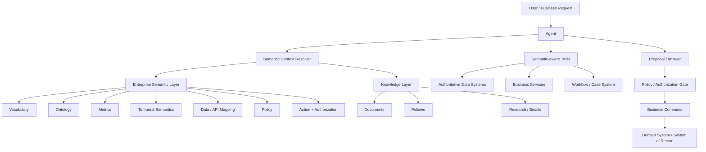
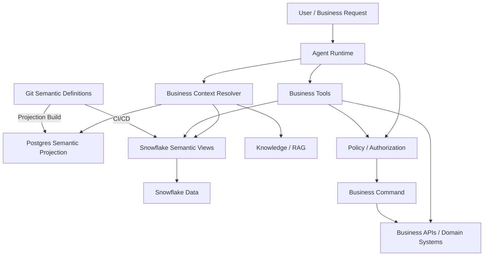
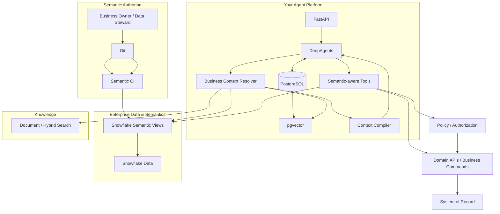
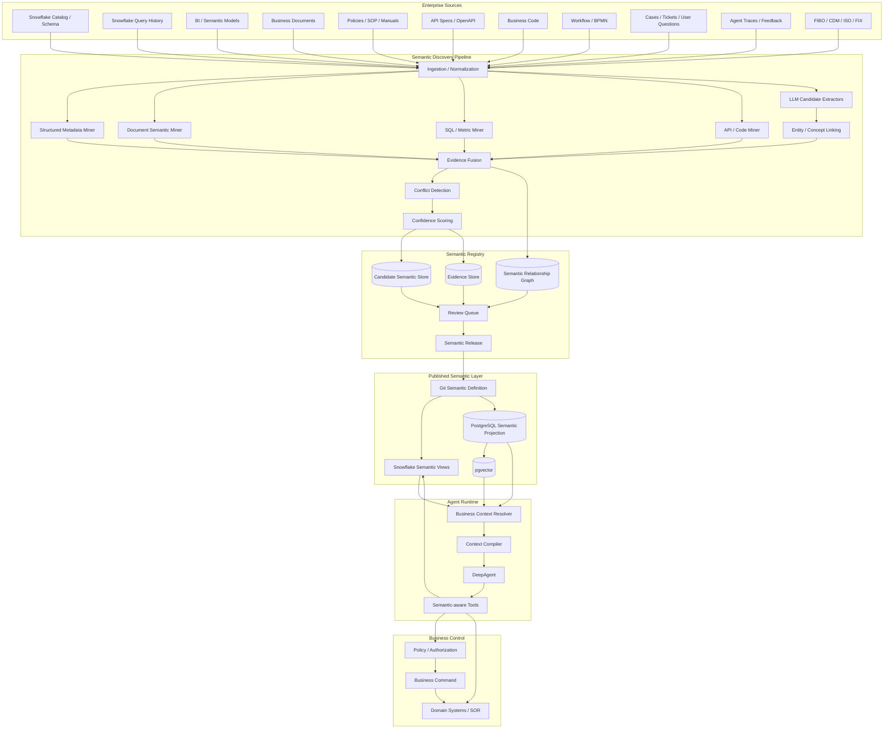
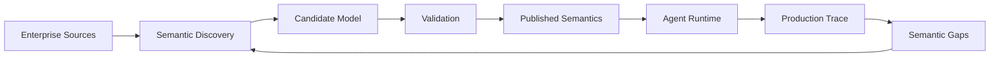
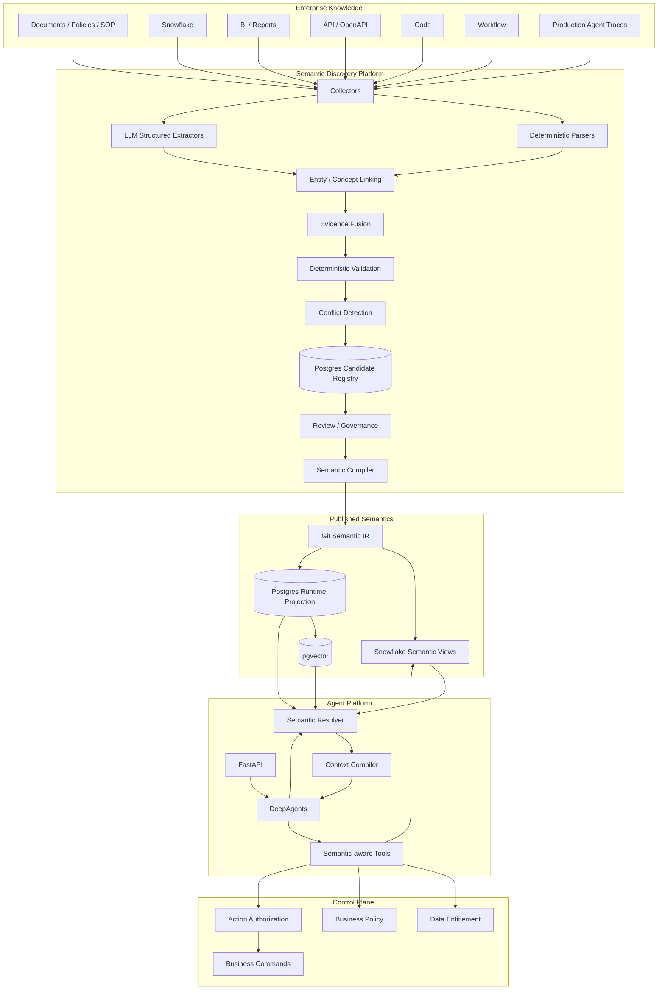

# 金融 Agent 的 Enterprise Semantic Layer：如何建立统一业务语义，让 Agent 正确理解业务上下文

## 1. 问题不是“Agent 缺少知识”，而是“Agent 不知道企业到底是什么意思”

企业开始把 Agent 接入真实业务以后，一个非常容易被低估的问题出现了：

> Agent 能看见很多数据，但它真的理解这些数据在企业里的业务含义吗？

例如用户问：

> “过去一个季度这个客户的 exposure 增长了多少？”

表面上只是一个数据查询问题，但企业内部至少可能存在这些歧义：

```text
customer
    是 Retail Customer？
    Corporate Client？
    Legal Entity？
    Counterparty？

exposure
    是 Gross Exposure？
    Net Exposure？
    Credit Exposure？
    Current Exposure？
    Potential Future Exposure？

quarter
    Calendar Quarter？
    Fiscal Quarter？
    Trading Quarter？

growth
    QoQ？
    YoY？

client
    是客户？
    账户？
    Legal Entity？
    Relationship Group？

as of
    是当前状态？
    季末状态？
    某个 valuation date？
```

如果这些概念没有明确的企业语义，Agent 即使：

```text
RAG 做得很好
SQL 能执行
Tool 都正常
模型本身很强
```

也完全可能得到一个**语言上正确、业务上错误**的答案。

因此：

> **企业 Agent 真正需要的不是更多 Prompt，而是一套机器可读、可执行、可治理的业务语义。**

这就是 Semantic Layer / Business Semantic Layer / Enterprise Ontology 在 Agent 时代重新变得重要的原因。

Snowflake 当前对 Semantic Views 的定义已经非常直接：Semantic View 用业务实体、dimensions、facts、metrics、relationships 等定义把业务用户语言与物理数据库结构连接起来，并通过 synonyms、描述、数据类型、业务逻辑和 verified queries 提升 AI 生成 SQL 的准确性。

Databricks 也已经把 Metric Views 作为 Unity Catalog Semantics 的核心实现，并专门增加了用于 LLM / Genie Agent 的 semantic metadata，包括 display name、synonyms 和 format。

因此，今天再谈 Semantic Layer，不能只把它理解成传统 BI 里的“指标层”。

对于金融 Agent，更完整的目标应该是：

```text
Business Meaning
+
Entity
+
Relationship
+
Metric
+
State
+
Time
+
Source
+
Policy
+
Authorization
+
Action
```

最终形成：

```text
Enterprise Business Semantic Layer
```

---

# 2. Semantic Layer、Glossary、Ontology 不是一回事

企业最容易犯的第一个错误，就是把：

```text
统一业务术语
```

理解成：

```text
做一个 Glossary
```

例如：

```text
Revenue = 收入
Customer = 客户
Trade = 交易
Portfolio = 投资组合
```

这只是第一层。

真正能帮助 Agent 正确运行的 Semantic Layer 至少包含五层。

```text
                  Enterprise Semantic Layer
                           │
        ┌──────────────────┼──────────────────┐
        ▼                  ▼                  ▼
   Vocabulary           Ontology           Metrics
        │                  │                  │
   “这个词是什么意思”   “它和什么相关”    “这个数字怎么算”
        │                  │                  │
        └──────────────────┼──────────────────┘
                           ▼
                  Data / Source Mapping
                           │
                           ▼
                 Policy / Action Semantics
```

## 2.1 Vocabulary：术语是什么意思

例如：

```text
Client
Customer
Counterparty
Account
Household
Legal Entity
```

它们不能简单都翻译成：

```text
客户
```

应该明确：

```text
Client
= 与本机构存在特定业务关系的主体

Counterparty
= 在某一金融交易中承担相对方角色的主体

Legal Entity
= 具有法律身份的实体
```

还需要定义：

```text
Synonym
Abbreviation
中文名称
历史名称
Domain-specific alias
```

OMG 的 SBVR（Semantics of Business Vocabulary and Business Rules）长期以来就是为解决类似问题而设计：它允许企业定义精确、无歧义的业务术语和业务规则，并处理 synonym、abbreviation、cross-reference 和多 vocabulary。

---

# 3. Ontology：不只是“这个词是什么意思”，而是“这个业务世界如何连接”

假设我们有：

```text
Client
Account
Portfolio
Order
Trade
Position
Security
Counterparty
```

Semantic Layer 还需要定义它们之间的关系：

```text
Client
 ├── owns → Account
 ├── manages → Portfolio
 └── executes → Trade

Portfolio
 ├── contains → Position
 └── has → InvestmentStrategy

Trade
 ├── references → Security
 ├── has → Counterparty
 └── creates → Position
```

这已经不是 Glossary，而是：

```text
Ontology / Concept Model
```

Palantir 对 Ontology 的定义非常典型：Ontology 是组织世界的数字化模型，核心包含 `object types`、`properties`、`link types` 和 `action types`，并将底层 datasets / models 映射成企业真实世界对象和关系。

更值得注意的是，Palantir 又进一步把：

```text
Data
+
Logic
+
Action
+
Security
```

放入同一个决策模型，并让 Agent 在这个模型上读取、推理和执行。

这给金融 Agent 一个非常重要的启示：

> **只告诉 Agent “名词是什么意思”是不够的，还要告诉它这些实体如何关联、哪些动作可以针对哪些实体发生。**

---

# 4. 金融行业其实早就有 Semantic Model，只是过去不叫 Agent Context

金融服务并不是今天才开始解决“统一业务语义”。

最重要的几个行业级基础已经存在很多年。

## 4.1 FIBO：Financial Industry Business Ontology

FIBO 是非常重要的参考。

它不是简单的数据字典，而是正式 ontology，用来定义金融业务中感兴趣的事物以及它们之间的关系。FIBO 使用 OWL / Description Logic，提供机器可读和人可读的正式定义，并覆盖 business entities、financial products、securities、derivatives、indices 等领域。

更重要的是，它不是一个公司自己定义的 private glossary。

FIBO 的概念经过 EDM Council 成员机构长期评审，EDMC 列出的贡献者包括 Bloomberg、Citigroup、Credit Suisse、Deutsche Bank、Goldman Sachs、State Street、Wells Fargo 等。这里证明的是这些机构参与或贡献过标准，不等同于它们在所有内部系统全面采用 FIBO。

FIBO 的目标之一就是：

```text
unambiguous financial terminology
+
cross-system federation
+
data aggregation
+
regulatory reporting
+
advanced analytics
```

这与今天 Agent 需要的：

```text
“企业到底是什么意思？”
```

本质上高度相关。

---

# 5. CDM：金融行业把“业务语义”进一步推进到了可执行模型

如果说 FIBO 偏向：

```text
金融世界里的概念和关系
```

那么 FINOS Common Domain Model（CDM）更接近：

```text
金融产品
+
Trade
+
Lifecycle Event
+
Business Rule
+
Executable Representation
```

FINOS 把 CDM 定义为金融产品、交易及其生命周期事件的标准化、机器可读、机器可执行 blueprint，并明确强调它用于统一数据、系统和流程。

它特别强调：

```text
Normalization
Composability
Mapping to Existing Industry Standards
Embedded Logic
Modular Layers
```

这实际上已经很接近今天 Agent 的需求：

```text
Agent
   ↓
理解 Trade
   ↓
理解 Trade Event
   ↓
理解生命周期
   ↓
调用正确的业务操作
```

---

# 6. JPMorgan 和 Goldman Sachs 已经说明了“统一业务语义”不是理论

JPMorganChase 在 2024 年公开宣布，其 derivatives business 已经把 FINOS CDM / ISDA DRR 作为 regulatory reporting 的主要机制之一，并称自己是第一家实施该方案作为主要 reporting mechanism 的大型美国银行。JPMorgan 同时指出 CDM 是一种用于 derivatives 的机器可执行 domain-specific type system。

这很值得关注。

因为它说明：

> **金融机构可以把业务语义从“文档里的定义”推进到“系统实际使用的机器可执行模型”。**

Goldman Sachs 的 Legend / CDM 实践也非常典型。Goldman Sachs 公开描述 Legend 如何支持业务团队和工程团队共同定义模型、自动生成查询和 API，并通过 CDM / model-to-model mapping 改善跨系统的数据质量、lineage 和 interoperability。

因此，真正成熟的金融 Semantic Layer 应该借鉴这类经验：

```text
Business Definition
        ↓
Machine-readable Model
        ↓
Physical System Mapping
        ↓
Executable Logic
```

而不是：

```text
Confluence Glossary
```

就结束了。

---

# 7. Semantic Layer 对 Agent 到底有什么用

可以把传统 Agent 理解为：

```text
User
 ↓
LLM
 ↓
RAG / SQL / Tool
 ↓
Answer
```

问题是：

```text
LLM
```

自己推断：

```text
customer 是什么？
revenue 怎么算？
哪个字段代表 exposure？
哪个表是 authoritative？
```

这非常危险。

加入 Semantic Layer 后：

```text
User
 ↓
Agent
 ↓
Semantic Resolution
 ├── Term
 ├── Entity
 ├── Relationship
 ├── Metric
 ├── Time
 └── Source
 ↓
Allowed Query / Tool
 ↓
Authoritative Data
 ↓
Answer
```

也就是说：

> **Semantic Layer 不替代 Agent Reasoning，而是限制 Agent Reasoning 所依赖的业务世界。**

---

# 8. 一个很重要的区别：RAG 提供 Evidence，Semantic Layer 提供 Meaning

这两个经常被混在一起。

例如：

```text
RAG：
“找到这份 2026 Q3 Credit Policy。”
```

它解决：

```text
Where is the evidence?
```

Semantic Layer 解决：

```text
What does “Credit Exposure” mean here?
Which entity does “client” refer to?
Which policy governs this action?
Which source is authoritative?
```

所以：

```text
RAG
= Evidence Retrieval

Semantic Layer
= Business Meaning

Agent
= Reasoning

Policy
= Allowed Decision

Tool / Command
= Execution
```

这五者应当组合，而不是互相替代。

微软研究的 AgenticRAG 也体现了类似方向：它让 Agent 通过 search / find / open / summarize 工具动态导航企业知识库，而不是把 grounding 完全依赖在一次 retrieval 上；其公开实验在 FinanceBench 上取得 92% answer correctness，并强调 agentic retrieval 可以更接近真实企业环境中的检索方式。

这里需要注意：AgenticRAG 解决的是**证据检索与导航**，不是完整 Enterprise Semantic Layer。

---

# 9. Semantic Layer 最关键的不是“定义”，而是“映射”

一个真正可用的 Semantic Layer 最终必须回答：

> 业务概念到底对应系统里的什么？

例如：

```text
Business Concept:
Customer

Enterprise ID:
customer.party

Physical mappings:

CRM:
crm_customer.customer_id

Core Banking:
party.party_id

Risk:
risk_counterparty.party_id

KYC:
kyc_subject.subject_id
```

又例如：

```text
Business Concept:
Trade

Canonical ID:
trade.trade_id

Mappings:

OMS:
order.trade_ref

Middle Office:
trade.trade_id

Settlement:
settlement.instruction.trade_id
```

如果没有 mapping：

```text
Semantic Layer
= Glossary
```

如果有 mapping：

```text
Semantic Layer
= Business meaning → Data / Service
```

这才真正能帮助 Agent。

---

# 10. 再进一步：还需要 Source of Truth

一个业务概念可能有多个系统：

```text
Customer
    ├── CRM
    ├── Core Banking
    ├── KYC
    ├── Risk
    └── Data Warehouse
```

Agent 不能简单：

```text
哪个搜出来就用哪个
```

应该定义：

```text
Authoritative Source
```

例如：

```text
Customer Legal Name
    → Master Data Service

Current KYC Status
    → KYC System

Current Credit Limit
    → Credit System

Historical Revenue
    → Finance Data Mart

Trade Lifecycle Status
    → Trade Processing System
```

所以一个完整的 Semantic Mapping 应该包含：

```text
Concept
+
Physical Field
+
Source System
+
Authority
+
Freshness
+
Effective Time
+
Owner
```

---

# 11. 金融 Agent 特别需要“时间语义”

传统 Semantic Layer 很容易漏掉这一点。

金融数据最危险的问题之一就是：

> “这个数到底是哪一个时间点的？”

例如：

```text
Position
```

可能是：

```text
Trade Date
Settlement Date
Valuation Date
Business Date
Reporting Date
As-of Date
```

“客户资产”可能是：

```text
Current AUM
Month-end AUM
Quarter-end AUM
Average AUM
```

因此 Semantic Layer 必须包含：

```text
Temporal Semantics
```

例如：

```yaml
metric:
  id: portfolio.market_value
  definition: ...
  valuation_basis: end_of_day
  as_of_required: true
  timezone: local_market
  calendar: business_calendar
```

否则 Agent 即使选择了正确 metric，也可能因为：

```text
wrong date semantics
```

得到错误结果。

---

# 12. 金融 Agent 还需要“状态语义”

例如：

```text
Trade
```

不是简单：

```text
status = string
```

而应该知道：

```text
Trade
 ├── NEW
 ├── CONFIRMED
 ├── ALLOCATED
 ├── AFFIRMED
 ├── SETTLED
 ├── FAILED
 └── CANCELLED
```

并且明确：

```text
哪些状态可以从哪个状态进入？
哪些状态互斥？
哪些状态由哪个系统负责？
哪个状态是 authoritative？
```

否则 Agent 很容易出现：

```text
“Trade 已完成。”
```

但实际上：

```text
Trade Confirmed
≠
Settlement Completed
```

这不是语言问题，而是业务状态模型问题。

---

# 13. Semantic Layer 还必须包含 Action Semantics

这是传统 BI Semantic Layer 和 Agent Semantic Layer 最大的区别之一。

传统 Semantic Layer 主要回答：

```text
What is this?
What does this metric mean?
```

Agent 还需要回答：

```text
What can I do with it?
```

例如：

```text
Customer
    → Update Address
    → Freeze Account
    → Reset Card

Trade
    → Amend Trade
    → Cancel Trade
    → Allocate Trade

Payment
    → Review
    → Approve
    → Reject
    → Submit
```

每个 Action 还应该有：

```text
Input Schema
Preconditions
Authorization
Allowed Roles
Risk Level
Side Effects
Idempotency
Audit Requirements
```

Palantir Ontology 在这一点上非常值得参考：它把 `Action Type` 作为 Ontology 一等对象，并把 action permissions、submission criteria、side effects 等信息与对象和关系放在一起。

这不意味着企业必须采用 Palantir 的 Ontology 模型，而是说明：

> **一旦 Agent 从“回答”走向“执行”，业务语义必须扩展到动作语义。**

---

# 14. Semantic Layer 也不能与 Security Semantic 分离

例如：

```text
Client
```

对于：

```text
Relationship Manager
```

和：

```text
Operations Analyst
```

可能可见的数据完全不同。

所以 Semantic Layer 最终还需要：

```text
Data Entitlement
Purpose
Role
Jurisdiction
Client Scope
Legal Entity Scope
Action Permission
```

例如：

```text
Concept:
client_assets

Visibility:
relationship_manager
    → assigned clients

operations:
    → operational accounts

research:
    → aggregated / anonymized only
```

这样 Agent 查询 semantic concept 时，实际得到的是：

```text
Semantic Meaning
+
Permitted View
```

而不是先让 Agent 查询整个数据，再事后过滤。

Palantir 明确把 data、logic、action、security 一起放入 Ontology，并强调 agent action 要依赖对底层 objects / properties / links 的授权。

Snowflake 也强调 Semantic Views 可以结合 RBAC、masking、row access policies 等机制进行治理。

---

# 15. 这也是为什么“把业务术语全部塞进 Prompt”不是 Semantic Layer

很多团队的第一反应是：

```text
SYSTEM PROMPT:

Customer means ...
Revenue means ...
Trade means ...
Exposure means ...
```

这只能算：

```text
Prompt-based Context
```

不是 Enterprise Semantic Layer。

因为 Prompt：

```text
不是真正的 source of truth
不能自动完成数据 mapping
不能强制 join path
不能强制 metric formula
不能强制 authorization
不能很好做 versioning
不能很好支持多个 Agent
不能保证 BI / API / Agent 使用同一套定义
```

真正 Semantic Layer 应该是：

```text
Machine-readable
Versioned
Owned
Queryable
Referenced
Executable
Governed
```

Snowflake 的 Semantic Views 正是沿这个方向设计：business entities、dimensions、facts、metrics、relationships、synonyms、verified queries、custom instructions，并将其作为 schema-level objects 管理。

---

# 16. Databricks 给出了另一个非常有参考价值的例子

Databricks 的 Metric Views 专门提供：

```text
Sources
Joins
Filters
Fields
Measures
```

并允许定义：

```text
Display Name
Synonyms
Format
Comments
```

这些 semantic metadata 会被 Genie Agents 使用。

例如：

```yaml
measure:
  name: total_revenue
  expr: SUM(revenue)
  display_name: Revenue
  synonyms:
    - sales
    - total sales
```

这看似只是“帮助 Agent 理解”，实际上代表一个非常重要的原则：

> **Business language 应该成为 machine-readable metadata，而不是只留在业务人员脑中。**

---

# 17. 但金融企业不能只做“Metric Semantic Layer”

Snowflake / Databricks 这类 Semantic Layer 对：

```text
Analytics
BI
Natural Language to SQL
```

非常有效。

但金融 Agent 往往还需要：

```text
Customer
Account
Trade
Position
Order
Counterparty
Portfolio
Policy
Case
Document
Approval
Workflow
Action
```

这些不是简单的 metric。

因此企业 Agent Semantic Layer 更合理的模型是：

```text
              Enterprise Business Semantics
                         │
     ┌───────────────────┼───────────────────┐
     ▼                   ▼                   ▼
Vocabulary           Ontology            Metrics
     │                   │                   │
     ▼                   ▼                   ▼
Terms / Synonyms    Entities / Links     KPIs / Formula
     │                   │                   │
     └───────────────────┼───────────────────┘
                         ▼
                  Data / Service Mapping
                         │
                         ▼
                  Policy / State
                         │
                         ▼
                    Actions
                         │
                         ▼
                  Authorization
```

这比传统 BI Semantic Layer 更宽。

---

# 18. 可以把它称为“Agent Business Context Layer”

为了避免把术语争论变成产品争论，可以把企业内部概念定义成：

> **Agent Business Context Layer**

Semantic Layer 是其中的核心组成部分，但不是全部。

一个比较实用的划分是：

```text
Business Vocabulary
    ↓
Ontology / Concept Model
    ↓
Semantic Data Model
    ↓
Business Rules / Metrics
    ↓
Context Compiler
    ↓
Agent Context
```

这样：

```text
Semantic Layer
```

是：

```text
Enterprise Source of Business Meaning
```

而：

```text
Context Layer
```

负责：

```text
根据当前 Agent Task
动态选择需要哪些业务语义
```

这也是 Microsoft 对 enterprise agent context 的研究方向：Agent 不只是需要 documents，还需要 people、teams、processes、permissions、organizational norms，并且需要维持 freshness 和 provenance。

---

# 19. 不应该每次把整个 Semantic Layer 发给 Agent

这是另一个很重要的设计原则。

假设企业有：

```text
100,000 concepts
20,000 metrics
50,000 relationships
```

显然不能：

```text
全部塞进 Context
```

更合理的是：

```text
User Question
      ↓
Semantic Resolution
      ↓
Candidate Concepts
      ↓
Relevant Subgraph
      ↓
Context Package
      ↓
Agent
```

例如用户问：

> “比较去年和今年欧洲信用业务的 revenue growth。”

Semantic Resolver 可以得到：

```text
Business Domain:
Credit Business

Entity:
Business Unit

Region:
Europe

Metric:
Revenue

Time:
Fiscal Year

Comparison:
YoY
```

Agent 实际获得：

```text
Revenue Definition
+
Credit Business Definition
+
Europe Dimension
+
Fiscal Calendar
+
Metric Formula
+
Authoritative Source
```

而不是整个企业 Ontology。

---

# 20. 这个 Semantic Resolver 本身应该是一个独立能力

推荐：

```text
User
 ↓
Intent / Term Resolver
 ↓
Business Concept IDs
 ↓
Context Compiler
 ↓
Agent
```

例如：

```json
{
  "term": "client",
  "resolved_concept": "party.client",
  "confidence": 0.97
}
```

或者：

```json
{
  "term": "exposure",
  "candidates": [
    "risk.credit_exposure",
    "risk.market_exposure"
  ],
  "needs_clarification": true
}
```

注意：

> **Semantic Layer 的一个重要职责不是替 Agent 猜，而是帮助 Agent 知道什么时候自己不能确定。**

---

# 21. Ambiguity 是 Semantic Layer 的一等问题

例如：

```text
“客户的余额”
```

可能对应：

```text
Current Account Balance
Available Balance
Ledger Balance
Investment Balance
Credit Balance
```

如果 Semantic Layer 只有：

```text
balance = balance
```

没有意义。

更合理：

```text
balance
 ├── ledger_balance
 ├── available_balance
 ├── investment_value
 └── credit_balance
```

Agent 如果无法根据上下文确定：

```text
clarification_required = true
```

而不是：

```text
LLM 猜一个
```

这会显著减少“语言上很自信”的业务错误。

---

# 22. Semantic Layer 的数据模型建议

企业内部可以从一个相对简单的模型开始：

```text
Concept
Term
Synonym
Entity
Relationship
Metric
Dimension
State
Rule
Source
Mapping
Policy
Action
Permission
Owner
Version
EffectiveTime
```

例如一个 `Metric`：

```yaml
id: risk.net_credit_exposure
name: Net Credit Exposure

definition: >
  Exposure after applicable netting and collateral adjustments.

domain: credit_risk

formula:
  type: sql
  expression: ...

dimensions:
  - legal_entity
  - counterparty
  - currency
  - valuation_date

time_semantics:
  as_of_required: true

authoritative_source:
  system: risk_platform
  dataset: credit_exposure_daily

owner:
  business: Credit Risk
  data: Risk Data Office

version: 3.2

effective_from: 2026-09-01
```

这才是 Agent 可以真正消费的业务上下文。

---

# 23. Mapping 应该独立成一层

不要直接把：

```text
Metric
```

绑定到：

```text
某个 SQL
```

最好有：

```text
Business Concept
       ↓
Canonical Model
       ↓
Physical Mapping
       ↓
System
```

例如：

```text
Net Credit Exposure
       ↓
risk.net_credit_exposure
       ↓
Risk Mart
       ↓
credit_exposure_daily.net_exposure
```

如果以后：

```text
Risk Mart
→
Snowflake
```

业务语义不应该跟着改变。

---

# 24. Semantic Layer 应该 versioned

金融业务定义会变。

例如：

```text
Net Exposure
```

在：

```text
2026-01
```

和：

```text
2026-09
```

可能有不同 policy。

所以：

```text
semantic_version
+
policy_version
+
data_version
```

应该可以关联。

一个 Agent Answer 最好能够回答：

```text
这个结果基于哪个业务定义？
哪个 metric version？
哪个 policy？
哪个 data snapshot？
```

这样才能支持：

```text
Audit
Replay
Regression
Model Change
Policy Change
```

---

# 25. Semantic Layer 应该像代码一样进入 CI/CD

不要：

```text
业务人员修改一个 Excel
```

然后：

```text
Agent 明天开始用新定义
```

推荐：

```text
semantic-model/
   concepts/
   entities/
   metrics/
   mappings/
   policies/
   actions/
   tests/
```

通过：

```text
Pull Request
↓
Semantic Validation
↓
Impact Analysis
↓
Business Review
↓
Deploy
```

甚至可以做：

```text
Metric Test
Mapping Test
Term Resolution Test
Relationship Test
Policy Test
Agent Regression Test
```

Snowflake 当前已经明确建议把 Semantic Views 纳入 data engineering pipeline / data product lifecycle，并支持 CI/CD、RBAC、masking、row access policies 等治理方式。

---

# 26. Semantic Regression 是必须的

Semantic Layer 改动以后，Agent 可能突然行为变化。

例如：

```text
Revenue
```

公式从：

```text
SUM(net_revenue)
```

改成：

```text
SUM(gross_revenue)
```

那么：

```text
Agent
```

可能完全正常运行，却产生不同答案。

因此 Semantic Layer 也需要自己的 Evaluation：

```text
Semantic Test
      ↓
Known Business Questions
      ↓
Expected Concept
      ↓
Expected Metric
      ↓
Expected Source
      ↓
Expected Answer
```

例如：

```text
Question:
“去年欧洲信用业务收入增长多少？”

Expected:
metric = credit.revenue
dimension = region
region = EU
time = fiscal_year
comparison = YoY

Forbidden:
gross_revenue
global_revenue
calendar_year
```

这实际上是：

```text
Semantic Regression Suite
```

---

# 27. Semantic Evaluation 甚至比 Agent Evaluation 更基础

Agent Evaluation：

```text
Agent
→ Answer
```

Semantic Evaluation：

```text
Question
→ Concept
→ Entity
→ Metric
→ Source
```

如果 Semantic Resolution 已经错：

```text
Agent
```

后面再聪明也没有意义。

因此可以定义：

```text
Context Correctness
=
Term Correctness
+
Entity Correctness
+
Relationship Correctness
+
Metric Correctness
+
Temporal Correctness
+
Source Correctness
+
Permission Correctness
```

这是企业 Agent Platform 很值得新增的一类 Evaluation。

---

# 28. Semantic Layer 也可以直接改善 Tool Use

例如传统 Agent Tool：

```json
{
  "name": "query_database",
  "parameters": {
    "sql": "string"
  }
}
```

这种 Tool 对 LLM 非常自由。

更合理的是：

```text
get_customer
get_position
get_trade
get_exposure
calculate_metric
get_policy
submit_trade_amendment
```

工具参数又使用：

```text
semantic_id
```

例如：

```json
{
  "customer_id": "party:12345",
  "as_of": "2026-09-20",
  "metric": "risk.net_credit_exposure"
}
```

而不是：

```text
SELECT ...
FROM ...
JOIN ...
```

这样 Agent 的能力边界从：

```text
SQL generation
```

变成：

```text
Business Concept Selection
```

后者更容易治理。

Snowflake 当前 Semantic View + Cortex Analyst 的方向就是让 Agent 使用经过定义的 business concepts、metrics 和 relationships，而不是直接面对底层物理 schema。

---

# 29. 最终可以把 Tool 分成三层

```text
Semantic Read
    ↓
Business Operation
    ↓
External Action
```

例如：

### Semantic Read

```text
get_customer
get_trade
get_position
get_exposure
get_metric
```

### Business Operation

```text
calculate_margin
run_risk_check
create_case
generate_review
```

### External Action

```text
approve_trade
submit_payment
freeze_account
amend_order
```

这和你前面研究的：

```text
Read vs Write
Proposal vs Business Decision
Command Pattern
Workflow State
Authorization
```

是可以直接连接起来的。

---

# 30. Enterprise Semantic Layer 最不应该做成“中央巨型 Ontology”

这是另一个现实问题。

如果企业试图：

```text
全公司
+
所有业务线
+
所有数据
+
所有术语
=
一个巨大 ontology
```

很容易失败。

因为：

```text
Retail Banking
Capital Markets
Asset Management
Insurance
Risk
Finance
Operations
Compliance
```

对同一个词可能存在不同 bounded context。

例如：

```text
Trade
```

在：

```text
Equities Trading
Derivatives
Repo
Securities Lending
```

语义细节不同。

因此更合理：

```text
Core Enterprise Concepts
       │
 ┌─────┼─────┬─────┐
 ▼     ▼     ▼     ▼
Retail  Risk  Markets  Finance
Context Context Context Context
```

采用：

```text
Canonical Core
+
Domain Extensions
+
Context-specific Semantics
```

而不是：

```text
One giant ontology
```

---

# 31. 外部标准应该“复用 + 映射”，而不是“照抄”

金融领域已有：

```text
FIBO
CDM
ISO 20022
FIX
FpML
FDC3
```

不应该重新发明一遍。

例如：

```text
External Standard
      ↓
Enterprise Canonical Concept
      ↓
Internal Systems
```

FIBO 更适合：

```text
Financial Concept Vocabulary / Ontology
```

CDM 更适合：

```text
Products
Trades
Lifecycle Events
Executable Model
```

FDC3 则标准化了金融桌面应用之间的 context data、intents 和 app interaction，但其 scope 明确不负责重新定义 financial objects，因为已有其他行业标准。

这是一个很重要的架构原则：

> **不要因为 Agent 出现，就重新造一套金融业务名词。**

---

# 32. FIBO / CDM 仍然不能直接等于企业 Semantic Layer

原因很简单：

```text
FIBO:
金融行业共同语义

CDM:
金融产品 / Trade / Lifecycle 的标准模型

企业 Semantic Layer:
企业自己的业务定义
+
系统映射
+
权限
+
Policy
+
数据质量
+
组织上下文
```

所以：

```text
Industry Standard
≠
Enterprise Semantic Layer
```

更好的结构是：

```text
            Industry Standards
           /        |        \
        FIBO      CDM      ISO/FIX
           \        |        /
            Enterprise Model
                    │
             Internal Mappings
                    │
              Agent Context
```

---

# 33. Open Semantic Interchange 是一个值得观察的方向

2025 年 Snowflake、Salesforce、dbt Labs、BlackRock、Cube、RelationalAI 等共同发起 Open Semantic Interchange（OSI），目标之一就是让不同数据、BI、AI 平台可以交换同一套 semantic definitions，解决同一个 KPI 在多个工具里被重复和不一致定义的问题。

到 2026 年，该项目已经进入 Apache Incubator，并更名为 **Apache Ossie**。项目目标仍然是提供 vendor-neutral 的 JSON/YAML semantic model，让 AI agents、BI tools 和其他系统共享相同的数据语义。

它目前仍应视为：

```text
Emerging Standard
```

而不是已经完全成熟的行业标准。

但它说明了一个很重要的趋势：

> **Semantic Layer 正在从“某个 BI 产品里的内部模型”变成跨平台、可交换的 machine-readable semantic asset。**

这对企业 Agent Platform 非常重要。

---

# 34. Microsoft Fabric 正在把 Ontology 直接接到 Agent

Microsoft Fabric IQ 当前已经支持 Ontology（preview），并可以让 Foundry Agent 或 Copilot Studio Agent 直接以 Ontology 作为数据源；官方描述明确把 Ontology 视为企业业务结构和 context，并强调它可以作为业务问题的 single source of truth。

这与本文提出的模型高度一致：

```text
Agent
 ↓
Business Ontology
 ↓
Enterprise Data
```

但由于当前仍是 preview，应把它视为 Microsoft 正在发展的产品方向，而不是成熟行业标准。

---

# 35. Wells Fargo 的案例说明了为什么企业必须解决 Context

Wells Fargo 已经在企业内部部署 Agentic AI，用于：

```text
FX post-trade inquiries
Policies and procedures
Contract management
Internal enterprise information
```

公开案例特别提到：

* FX post-trade agent 需要跨内部数据源和系统回答复杂问题；
* 合同管理 Agent 需要处理约 25 万份 vendor agreements；
* 企业员工可以通过 conversational search 访问 employee handbooks、corporate policies、operational tools。

这个案例并没有公开证明 Wells Fargo 已经建立一套统一 Ontology，因此不能把它直接说成“Wells Fargo 使用 Semantic Layer”。

但它很好地证明了一个事实：

> **当 Agent 从简单 FAQ 走向企业业务工作时，它需要理解的不再只是文档，而是政策、实体、系统、业务过程和组织上下文。**

---

# 36. 因此，真正的 Agent Context 不应该只有 Documents

传统 RAG：

```text
Context
=
Documents
```

企业 Agent：

```text
Context
=
Documents
+
Business Semantics
+
Data
+
Entities
+
Relationships
+
Policies
+
Process
+
Permissions
+
Current State
```

可以把它画成：

```text
                         Agent Context
                              │
      ┌───────────────────────┼────────────────────────┐
      ▼                       ▼                        ▼
 Documents              Business Semantics          State
      │                       │                        │
 Policies                Entities / Relations      Workflow
 Procedures              Metrics                  Current Status
 Contracts               Definitions              As-of Time
      │                       │                        │
      └───────────────────────┼────────────────────────┘
                              ▼
                         Agent Runtime
```

这实际上就是企业 Agent 的“Context Plane”。

---

# 37. Semantic Layer 和 Memory 也不能混

Agent Memory：

```text
“我上次和这个用户讨论过 X。”
```

Semantic Layer：

```text
“X 在这个企业里是什么意思。”
```

例如：

```text
Memory:
用户上次关心 Trade A。

Semantic:
Trade A 是：
trade.derivative_swap
counterparty = Entity123
status = CONFIRMED
valuation_date = 2026-09-20
```

所以：

```text
Memory
≠
Business Semantics
```

Memory 是：

```text
experience / history
```

Semantic Layer 是：

```text
enterprise meaning
```

这两个生命周期也应该分开。

---

# 38. Semantic Layer 和 RAG Knowledge Base 也不能混

一个：

```text
Policy PDF
```

属于：

```text
Knowledge Source
```

而：

```text
Early Redemption
```

这个业务概念：

```text
Definition
+
Synonyms
+
Applicable Products
+
Effective Date
+
Policy References
```

属于：

```text
Semantic Model
```

它们之间应该有关系：

```text
Concept
 ↓
Authoritative Documents
```

而不是：

```text
Documents
= Semantic Layer
```

---

# 39. 如何真正开始建设：第一步不是买产品，而是选一个业务域

不建议：

```text
Enterprise-wide Semantic Layer
```

一开始就做。

应该选一个具体领域，例如：

```text
Trade Operations
```

或者：

```text
Client / Account
```

然后挑一个 Agent Use Case：

```text
“调查某个 Trade 为什么没有完成 Settlement。”
```

从这个真实问题反推出需要什么语义。

---

# 40. 第一步：建立 Business Question Catalog

不要先建立 10,000 个术语。

先收集：

```text
真实用户问什么？
```

例如：

```text
为什么 Trade A 没有 Settlement？

这个客户当前有多少 exposure？

哪个 counterparty 的风险最高？

过去一年这个 client 的 revenue 是多少？

这个 Payment 为什么被 Hold？
```

然后对每个问题分析：

```text
Entities
Metrics
Relationships
Time
Policies
Authoritative Sources
Actions
```

这比从数据库 schema 反向猜 business semantics 更可靠。

---

# 41. 第二步：从问题建立 Concept Inventory

例如：

```text
Trade
Settlement
Client
Counterparty
Exposure
Payment
Hold
Risk
Position
```

每个 Concept 至少有：

```text
ID
Name
Definition
Synonyms
Domain
Owner
Status
Version
```

---

# 42. 第三步：建立 Entity Relationship

例如：

```text
Client
   │
   ├── owns → Account
   │
   └── trades → Trade

Trade
   │
   ├── references → Instrument
   ├── has → Counterparty
   ├── creates → Position
   └── settles through → Settlement
```

此时 Agent 已经可以开始做：

```text
entity-aware retrieval
```

而不是纯文本搜索。

---

# 43. 第四步：建立 Metric Contract

每个重要指标都应该有：

```text
Metric ID
Business Definition
Formula
Dimensions
Filter
Time Semantics
Currency
Aggregation
Authoritative Source
Owner
Version
```

例如：

```yaml
metric:
  id: finance.net_revenue
  name: Net Revenue
  definition: Revenue after rebates and directly attributable adjustments
  formula: ...
  dimensions:
    - legal_entity
    - business_line
    - currency
  time_basis: accounting_period
  source: finance_mart
  owner: Finance
```

---

# 44. 第五步：建立 Mapping

然后：

```text
Concept
 ↓
Canonical Field
 ↓
Physical System
 ↓
Physical Field
```

例如：

```text
counterparty.id
    ↓
risk_counterparty_id
    ↓
Risk Warehouse
    ↓
risk.counterparty_master.counterparty_id
```

这个过程本质上是：

```text
Semantic Integration
```

而不是简单文档工作。

---

# 45. 第六步：把 Semantic Layer 暴露成 Agent Tools

不要只生成一份：

```text
semantic.yaml
```

还应该有 runtime API：

```text
resolve_term()
resolve_entity()
get_concept()
get_relationships()
get_metric()
get_authoritative_source()
get_policy()
get_current_state()
check_action_allowed()
```

例如：

```text
resolve_term("client")
        ↓
party.client

get_metric("exposure")
        ↓
risk.net_credit_exposure

get_relationships("trade:123")
        ↓
counterparty
instrument
portfolio
settlement
```

这样 Agent 不需要一次理解所有语义。

---

# 46. 第七步：做 Context Compiler

Context Compiler 的职责：

```text
User Question
+
User Identity
+
Current Case
+
Task
+
Relevant Concepts
+
Permissions
```

生成：

```text
Agent Context Package
```

例如：

```json
{
  "business_domain": "trade_operations",
  "entities": [
    "trade",
    "settlement",
    "counterparty"
  ],
  "definitions": [
    "trade_status",
    "settlement_status"
  ],
  "allowed_tools": [
    "get_trade",
    "get_settlement",
    "create_exception_case"
  ],
  "forbidden_tools": [
    "cancel_trade"
  ],
  "authoritative_sources": {
    "trade_status": "trade_platform",
    "settlement_status": "settlement_platform"
  }
}
```

这比：

```text
把整套 Enterprise Ontology 塞进 Prompt
```

好得多。

---

# 47. 第八步：让 Agent 的 Tool Schema 本身带语义

例如：

```json
{
  "name": "get_trade",
  "description": "Retrieve a trade using the enterprise canonical trade identifier.",
  "input": {
    "trade_id": {
      "semantic_type": "finance.trade.identifier"
    },
    "as_of": {
      "semantic_type": "finance.valuation_date"
    }
  }
}
```

甚至：

```json
{
  "action": "amend_trade",
  "entity_type": "finance.trade",
  "risk_level": "high",
  "authorization": "trade_amendment",
  "preconditions": [
    "status = CONFIRMED"
  ]
}
```

这样 Agent 不只是看到：

```text
Tool description
```

而是看到：

```text
Business semantics
```

---

# 48. 第九步：建立 Semantic Evaluation

至少测试以下项目。

### Term Resolution

```text
“客户”
→ client
```

### Ambiguity

```text
“余额”
→ 必须澄清是哪种 balance
```

### Entity Resolution

```text
“JP Morgan”
→ canonical legal entity
```

### Relationship

```text
Trade
→ Counterparty
```

### Metric

```text
“exposure”
→ 正确 exposure metric
```

### Time

```text
“去年”
→ fiscal/calendar semantics 正确
```

### Source

```text
KYC status
→ KYC system
```

### Permission

```text
Agent
→ 不应获得无权限 client data
```

### Action

```text
“cancel”
→ 只能针对允许的 Trade 状态
```

---

# 49. 建立一个专门的 Semantic Regression Dataset

例如：

```text
1000 Business Questions
```

每个 Question 不是只存：

```text
Expected Answer
```

而是：

```json
{
  "question": "欧洲信用业务去年收入增长多少？",
  "expected_concepts": [
    "business_line.credit",
    "region.europe",
    "finance.net_revenue"
  ],
  "expected_time": "fiscal_year",
  "expected_comparison": "YoY",
  "authoritative_source": "finance_mart",
  "forbidden_concepts": [
    "gross_revenue"
  ]
}
```

这样即使最终答案只是：

```text
+8.4%
```

你也能知道：

```text
Agent
到底选没选对业务语义。
```

---

# 50. Semantic Layer Evaluation 最值得关注的指标

可以建立：

| 指标                         | 含义                        |
| -------------------------- | ------------------------- |
| Term Resolution Accuracy   | 用户说法是否映射到正确概念             |
| Entity Resolution Accuracy | 是否找到正确实体                  |
| Relationship Accuracy      | 是否选择正确关系                  |
| Metric Selection Accuracy  | 是否使用正确指标                  |
| Metric Formula Accuracy    | 指标计算是否正确                  |
| Source Selection Accuracy  | 是否访问 authoritative source |
| Temporal Accuracy          | 时间/As-of 是否正确             |
| Ambiguity Detection        | 是否能发现需要澄清                 |
| Policy Alignment           | 是否使用正确业务规则                |
| Permission Alignment       | 是否在允许范围内获取数据              |
| Action Alignment           | 是否只使用合法动作                 |

这套指标实际上是：

```text
Agent Evaluation
```

前面的一个基础层。

---

# 51. Semantic Layer 的“正确性”不能只由 AI Team 决定

这是整个项目最重要的组织问题之一。

建议采用：

```text
                     Semantic Governance
                            │
        ┌───────────────────┼───────────────────┐
        ▼                   ▼                   ▼
   Business Owner       Data Owner          Platform
        │                   │                   │
        ▼                   ▼                   ▼
   Definition           Mapping              Runtime
        │                   │                   │
        └───────────────────┼───────────────────┘
                            ▼
                    Semantic Release
```

例如：

```text
Finance
```

定义：

```text
Revenue
```

不能让：

```text
AI Platform Team
```

自己决定。

AI team 可以提供：

```text
Model
Runtime
Context Compiler
Evaluation
```

但：

```text
Business Meaning
```

必须由：

```text
Business Owner / Data Steward
```

负责。

---

# 52. 推荐采用 Federated Semantic Governance

不要一个中央团队定义所有概念。

更合理：

```text
Enterprise Semantic Council
          │
          ├── Core Concepts
          │
          ├── Naming Standards
          │
          ├── Metadata Standards
          │
          └── Versioning Rules
                 │
    ┌────────────┼──────────────┐
    ▼            ▼              ▼
Retail       Capital Markets   Finance
Semantics      Semantics      Semantics
```

例如：

```text
Trade
```

可以拥有：

```text
Enterprise Core Concept
```

然后：

```text
Derivatives Trade
Equity Trade
Securities Lending Trade
```

扩展。

这也符合 FIBO / CDM 这类行业标准的发展逻辑：基础概念可以共享，具体 domain 可以不断扩展。

---

# 53. 不能指望 Agent 自动创建最终 Semantic Layer

2026 年已经出现用 LLM 自动从企业资料构建 ontology 的研究，例如 OntoEKG 尝试从企业非结构化数据中抽取 classes / properties 并生成 RDF ontology，但论文同时明确指出 ontology 构建仍然面临 scope 和 hierarchical reasoning 等问题。

更近的一些研究也尝试让 Agent 动态构建和修正 task-oriented ontology，用来改善 multi-step reasoning 和 evidence grounding。

这些研究说明：

```text
LLM
→ 可以辅助 Semantic Modeling
```

但不能推导出：

```text
LLM
→ 应该成为 Enterprise Semantic Authority
```

企业最终的业务定义仍需要：

```text
Business Owner
+
Data Steward
+
Governance
```

确认。

---

# 54. Agent 不应该直接“自由发现”所有业务语义

Agent 可以：

```text
discover
```

但最好通过：

```text
Semantic Registry
```

来发现。

例如：

```text
Agent:
“exposure”

Semantic Registry:
Available concepts:
1. credit.net_exposure
2. market.gross_exposure
3. counterparty.potential_future_exposure
```

Agent 再结合：

```text
business domain
current task
user role
```

选择。

这比：

```text
LLM 自己猜 exposure 是什么
```

可靠得多。

---

# 55. 最成熟的模式不是“一个 Semantic Layer”，而是“语义控制平面”

企业最终可能拥有：

```text
                  Semantic Control Plane

      ┌──────────────┬──────────────┬──────────────┐
      ▼              ▼              ▼              ▼
   Vocabulary     Ontology       Metrics        Policies
      │              │              │              │
      ▼              ▼              ▼              ▼
   Entities       Relations      Formulas       Rules
      │              │              │              │
      └──────────────┼──────────────┼──────────────┘
                     ▼
                Mapping Layer
                     │
       ┌─────────────┼─────────────┐
       ▼             ▼             ▼
    Data       Business APIs    Documents
       │             │             │
       └─────────────┼─────────────┘
                     ▼
              Context Compiler
                     │
                     ▼
                 Agent Runtime
```

它的核心职能不是：

```text
“存术语”
```

而是：

> **决定 Agent 在当前任务中应该以什么业务含义理解数据、应该从哪里获取事实，以及哪些操作在语义上和权限上是允许的。**

---

# 56. 一个很现实的 MVP：不要一开始做 Knowledge Graph

企业经常一看到 Ontology 就想：

```text
RDF
OWL
Graph Database
Knowledge Graph
```

然后项目马上变成一个两年工程。

不需要这样开始。

第一版完全可以：

```text
PostgreSQL
+
YAML / JSON
+
Data Catalog
+
API
```

例如：

```text
semantic_concept
semantic_term
semantic_relation
semantic_metric
semantic_mapping
semantic_policy
semantic_action
```

先把：

```text
Business Semantics
```

管理起来。

如果以后确实出现：

```text
复杂关系查询
推理
跨域知识图谱
实体网络
```

再引入：

```text
Knowledge Graph
```

---

# 57. 一个 practical MVP

例如先做：

```text
Domain:
Trade Operations

Entities:
Trade
Order
Security
Counterparty
Settlement

Terms:
20–50

Metrics:
10–20

Relationships:
20–30

Mappings:
50–100

Policies:
10

Actions:
5–10

Evaluation Questions:
100–200
```

然后只支持：

```text
resolve_term
get_trade
get_settlement
get_counterparty
get_metric
get_policy
```

先让一个 Agent：

```text
“为什么这笔交易还没有 Settlement？”
```

能够稳定回答。

这比：

```text
先构建 Enterprise-wide ontology
```

现实得多。

---

# 58. 企业应该同时保留两个世界

最终真正成熟的 Agent Platform 会同时拥有：

```text
Structured Semantic World
+
Unstructured Knowledge World
```

即：

```text
                Agent
                 │
       ┌─────────┴─────────┐
       ▼                   ▼
Semantic Layer          Knowledge Layer
       │                   │
Entities                Documents
Metrics                 Policies
Relations               Emails
States                  Research
Actions                 Contracts
Permissions             Procedures
       │                   │
       └─────────┬─────────┘
                 ▼
              Context
```

这两者不能互相替代。

Semantic Layer 负责：

```text
precision
structure
consistency
```

Knowledge Layer 负责：

```text
rich context
exceptions
narrative evidence
```

Agent 才真正负责：

```text
reasoning
planning
synthesis
```

---

# 59. 最终架构原则

可以把这套设计浓缩成十条。

### 原则一：不要把 Glossary 当 Semantic Layer

```text
Glossary
= Terms

Semantic Layer
= Terms
+ Concepts
+ Relationships
+ Metrics
+ Mapping
+ State
+ Time
+ Source
+ Policy
+ Action
```

### 原则二：不要把 Semantic Layer 当 RAG

```text
RAG
= 找证据

Semantic Layer
= 定义业务含义
```

### 原则三：不要让 LLM 自己定义企业语义

```text
LLM
= Consumer of Semantics

Business Owner
= Authority of Semantics
```

### 原则四：业务概念必须有 Stable ID

不要：

```text
“客户”
```

而应该：

```text
party.client
```

不要：

```text
“收入”
```

而应该：

```text
finance.net_revenue
```

这样 Agent、API、Data、Workflow 才能共享同一个概念。

### 原则五：每一个重要概念必须有 authoritative source

```text
Concept
→ Source
→ Field / API
```

### 原则六：金融语义必须包含 Time

```text
As-of
Effective Date
Valuation Date
Business Date
Fiscal Period
```

### 原则七：进入 Agent 的应该是 Context Package，而不是整个 Ontology

```text
Task
→ Relevant Semantic Subgraph
```

### 原则八：Action 也必须进入 Semantic Layer

```text
What is it?
+
What can I do with it?
```

### 原则九：Semantic Layer 自己也需要 Evaluation

```text
Term
Entity
Relation
Metric
Time
Source
Permission
Action
```

### 原则十：Semantic Layer 应该成为企业 AI 的共享基础，而不是某一个 Agent 的 Prompt

最终应该做到：

```text
BI
API
Workflow
Agent
Human Application
```

都使用：

```text
同一套 Business Semantics
```

---

# 60. 最终架构

如果把本文全部压缩成一张图，我会采用：



这个架构里：

```text
Semantic Layer
= 企业到底是什么意思

Knowledge Layer
= 企业有哪些证据

Agent
= 怎么理解和推理

Workflow
= 当前业务过程怎么推进

Policy
= 什么情况下允许

Authorization
= 谁可以做

Command
= 最终执行什么

Domain System
= 最终业务事实是什么
```

---

# 61. 结论

金融企业建设 Agent Platform，如果只做：

```text
LLM Gateway
+
RAG
+
Tool
+
Agent Runtime
```

很容易得到一个“能回答问题”的系统。

但如果目标是：

```text
Agent
真正进入业务流程
```

就必须进一步解决：

```text
它知道“客户”是谁吗？

它知道“交易”究竟是哪一种业务对象吗？

它知道“曝光”是哪一个风险指标吗？

它知道这个数字是哪一个时间点的吗？

它知道哪个系统才是 authoritative source 吗？

它知道这个业务状态意味着什么吗？

它知道这个动作在业务上是否允许吗？

它知道当前用户是否有权限吗？
```

这些问题，本质上都不是：

```text
Prompt Engineering
```

而是：

```text
Enterprise Business Semantics
```

金融行业其实已经提供了非常好的历史基础：

```text
FIBO
→ Financial Business Ontology

CDM
→ Financial Products / Trades / Lifecycle

ISO / FIX / FDC3
→ Industry Interoperability Standards

Enterprise Semantic Layer
→ Internal Business Definitions + Mappings

Agent Context Layer
→ Task-specific semantic projection
```

真正值得采用的路线不是重新发明所有金融语义，而是：

```text
Industry Standards
        ↓
Enterprise Canonical Model
        ↓
Business-owned Semantics
        ↓
Data / Service / Policy Mapping
        ↓
Context Compiler
        ↓
Agent
```

JPMorgan 使用 CDM 做监管报告、Goldman Sachs 通过 Legend / CDM 建立跨系统业务模型、FIBO 由大量金融机构共同参与维护，都说明“统一业务语义”并不是 AI 时代刚刚出现的新问题；AI Agent 只是让这个问题从“数据治理和系统集成问题”变成了“运行时正确性问题”。

而 Snowflake、Databricks、Microsoft、Palantir 等产品正在采取的方向，则进一步说明：

> **机器可读的业务语义正在成为 AI 和企业数据之间新的基础层。**

对于金融 Agent，最合理的目标因此不是：

```text
让 LLM “更懂业务”
```

而是：

> **把企业真正认可的业务含义、实体关系、指标定义、时间语义、数据来源、业务状态、政策和可执行动作显式建模，让 Agent 在这个受治理的语义空间里进行推理。**

进一步可以浓缩为：

```text
LLM provides reasoning.

Semantic Layer provides meaning.

Knowledge Layer provides evidence.

Policy provides constraints.

Authorization provides permission.

Workflow provides process state.

Domain System provides business truth.
```

最终：

> **不要试图让 Agent 记住整个企业，而应该让 Agent 能够在运行时可靠地访问企业定义好的业务世界。**

---

# 参考资料

## 一、金融行业业务语义与标准

1. **EDM Council — FIBO**

   Financial Industry Business Ontology，金融行业正式 ontology，定义金融业务概念及其关系，并提供机器可读表示。
   [EDM Council — FIBO](https://edmcouncil.org/financial-industry-business-ontology/?utm_source=chatgpt.com)
   [FIBO GitHub](https://github.com/edmcouncil/fibo?utm_source=chatgpt.com)

2. **OMG — FIBO Specifications**

   FIBO 的正式 OMG specification。
   [OMG Specifications Catalog](https://www.omg.org/spec/About/?utm_source=chatgpt.com)

3. **OMG — SBVR**

   用于正式定义 business vocabulary 与 business rules，支持 definitions、synonyms、abbreviations、cross-references 和 machine-checkable semantics。
   [OMG — SBVR](https://www.omg.org/bpm/?utm_source=chatgpt.com)

4. **FINOS — Common Domain Model**

   金融产品、交易和 lifecycle events 的标准化、机器可读、机器可执行 domain model。
   [FINOS Common Domain Model](https://github.com/finos/common-domain-model?utm_source=chatgpt.com)

5. **JPMorganChase — CDM / DRR implementation**

   JPMorgan 公开介绍 derivatives business 使用 CDM / DRR 作为监管报告主要机制。
   [JPMorganChase — Open Source Regulatory Reporting](https://www.jpmorganchase.com/about/technology/blog/jpmc-launches-finos-open-source-solution?utm_source=chatgpt.com)

6. **Goldman Sachs — Legend / CDM**

   讨论 Legend、Common Domain Model、模型映射、数据质量和跨系统 interoperability。
   [Goldman Sachs Developer — Legend / CDM](https://developer.gs.com/blog/posts/how-legend-has-empowered-global-markets-engineering?utm_source=chatgpt.com)

7. **FINOS — FDC3**

   金融桌面应用之间的 context data、intents、application interaction 标准。
   [FINOS FDC3](https://github.com/finos/FDC3?utm_source=chatgpt.com)

---

## 二、Semantic Layer / AI

8. **Snowflake — Cortex Analyst / Semantic Views**

   Semantic Views 定义 business entities、dimensions、facts、metrics、relationships，并可供 Cortex Analyst / Cortex Agents 使用。
   [Snowflake Cortex Analyst](https://docs.snowflake.com/en/user-guide/snowflake-cortex/cortex-analyst?utm_source=chatgpt.com)

9. **Snowflake — Semantic Views**

   说明 semantic views 如何作为统一 business semantics，并结合 access control、verified queries 等提升 AI accuracy。
   [Snowflake — Semantic Views](https://docs.snowflake.com/en/user-guide/views-semantic/overview?utm_source=chatgpt.com)

10. **Snowflake — Semantic Views Best Practices**

    建模、owner、RBAC、masking、CI/CD、verified queries、accuracy tuning。
    [Snowflake — Semantic View Best Practices](https://docs.snowflake.com/en/user-guide/views-semantic/best-practices?utm_source=chatgpt.com)

11. **Databricks — Unity Catalog Metric Views**

    标准化 enterprise metrics，并支持 AI/BI、Genie Agents。
    [Databricks — Unity Catalog Metric Views](https://docs.databricks.com/aws/en/uc-semantics/metric-views?utm_source=chatgpt.com)

12. **Databricks — Agent Metadata in Metric Views**

    display names、synonyms、format 等 semantic metadata 直接帮助 Genie Agents 理解业务指标。
    [Databricks — Agent Metadata in Metric Views](https://docs.databricks.com/aws/en/uc-semantics/agent-metadata?utm_source=chatgpt.com)

13. **dbt — Semantic Layer**

    在既有 data models 之上统一 metrics 和 joins。
    [dbt Developer Hub](https://docs.getdbt.com/?utm_source=chatgpt.com)

14. **Apache Ossie / Open Semantic Interchange**

    当前 Apache Incubator 中的开放 semantic model interchange 项目，目标是跨 AI / BI / analytics 工具共享统一 semantic model。
    [Apache Ossie](https://github.com/apache/ossie?utm_source=chatgpt.com)

15. **Snowflake — Open Semantic Interchange**

    由 Snowflake、Salesforce、dbt Labs、BlackRock、Cube 等共同推动的开放 semantic metadata interoperability 倡议。
    [Snowflake — Open Semantic Interchange Initiative](https://www.snowflake.com/en/news/press-releases/snowflake-salesforce-dbt-labs-and-more-revolutionize-data-readiness-for-ai-with-open-semantic-interchange-initiative/?utm_source=chatgpt.com)

---

## 三、Enterprise Ontology / Agent Context

16. **Palantir — Ontology Core Concepts**

    Object、Property、Link、Action、Role、Function 等企业 Ontology 基础模型。
    [Palantir — Ontology Core Concepts](https://www.palantir.com/docs/foundry/ontology/core-concepts?utm_source=chatgpt.com)

17. **Palantir — Why Create an Ontology**

    讨论 data、logic、action、security 与 human/agent decision-making 的统一模型。
    [Palantir — Why Create an Ontology?](https://www.palantir.com/docs/foundry/ontology/why-ontology?utm_source=chatgpt.com)

18. **Palantir — Ontology MCP**

    说明如何让外部 Agent 通过 MCP 直接消费 Ontology。
    [Palantir — Ontology MCP](https://www.palantir.com/docs/foundry/ontology-mcp/sample-architecture?utm_source=chatgpt.com)

19. **Microsoft Fabric — Ontology Agent**

    当前 preview，支持 Copilot Studio / Foundry Agent 以 Ontology 作为 business context / trusted source。
    [Microsoft — Create an Ontology Agent](https://learn.microsoft.com/en-us/fabric/iq/ontology/how-to-create-agent-copilot-studio?utm_source=chatgpt.com)

20. **Microsoft Research — M365 Research**

    讨论企业 Agent 需要理解 people、documents、processes、permissions、organizational context，以及如何保持 freshness 和 provenance。
    [Microsoft Research — M365 Research](https://www.microsoft.com/en-us/research/group/m365-research/?utm_source=chatgpt.com)

21. **Microsoft Research — Enterprise Deep Intelligence**

    很早期的企业 Agent + Knowledge Graph 实践，EDI Agent 背后使用知识图谱表示 people、departments、locations、documents、expertise、activities 等关系。
    [Microsoft Research — Enterprise Deep Intelligence](https://www.microsoft.com/en-us/research/project/enterprise-deep-intelligence/?utm_source=chatgpt.com)

---

## 四、Agent / Knowledge Grounding 研究

22. **Microsoft Research — AgenticRAG**

    企业知识库的 Agentic Retrieval，展示 iterative search / open / summarize 对 grounding 和 FinanceBench 的影响。
    [Microsoft Research — AgenticRAG](https://www.microsoft.com/en-us/research/publication/agenticrag-agentic-retrieval-for-enterprise-knowledge-bases/?utm_source=chatgpt.com)

23. **Microsoft Research — Think-on-Graph**

    LLM + Knowledge Graph 的 reasoning 模式，强调 traceability 和 externalized knowledge。
    [Microsoft Research — Think-on-Graph](https://www.microsoft.com/en-us/research/publication/think-on-graph-deep-and-responsible-reasoning-of-large-language-model-on-knowledge-graph/?utm_source=chatgpt.com)

24. **Microsoft Research — DualGraph / Deep Research**

    使用 Knowledge Graph + Outline Graph 帮助 Agent 进行开放式深度研究，并提高 grounding。
    [Microsoft Research — A Tale of Two Graphs](https://www.microsoft.com/en-us/research/publication/a-tale-of-two-graphs-separating-knowledge-exploration-from-outline-structure-for-open-ended-deep-research/?utm_source=chatgpt.com)

25. **LLM-Driven Ontology Construction for Enterprise Knowledge Graphs**

    研究用 LLM 从企业资料中生成 ontology，同时讨论 scope 和 reasoning 的局限。
    [arXiv — OntoEKG](https://arxiv.org/abs/2602.01276?utm_source=chatgpt.com)

26. **Toward Effective and Reliable LLM Agents via Dynamic Ontology**

    2026 年关于动态 ontology 与 Agent reasoning 的研究，探索把 ontology 作为 Agent 的 semantic kernel。
    [arXiv — Dynamic Ontology for LLM Agents](https://arxiv.org/abs/2608.22974?utm_source=chatgpt.com)

---

## 五、金融企业真实 Agent 场景

27. **Wells Fargo — Enterprise Agentic AI**

    FX post-trade、政策查询、合同管理和内部企业信息搜索等场景，展示了金融机构 Agent 对企业上下文的实际需求。
    [Google Cloud — Wells Fargo Agentic AI](https://cloud.google.com/blog/topics/financial-services/wells-fargo-agentic-ai-agentspace-empowering-workers?utm_source=chatgpt.com)

28. **Microsoft — Frontier Firm in Banking**

    包含 Wells Fargo、UBS、ABN AMRO、Virgin Money 等金融机构 Agent / Copilot 案例。
    [Microsoft — Frontier Firm in Banking](https://www.microsoft.com/en-us/microsoft-cloud/blog/financial-services/2025/10/21/the-frontier-firm-in-financial-services-a-blueprint-for-advanced-ai-innovation/?utm_source=chatgpt.com)

29. **Wells Fargo / Google Cloud**

    Enterprise agent platform、internal enterprise information、policies、operational tools 等。
    [Wells Fargo + Google Cloud](https://cloud.google.com/blog/topics/financial-services/wells-fargo-agentic-ai-agentspace-empowering-workers?utm_source=chatgpt.com)

---

## 六、本文最重要的外部参考组合

如果要进一步把这个主题发展成企业 Agent Platform 的正式架构规范，最值得组合阅读的是：

```text
FIBO
  → 金融行业共同业务语义

FINOS CDM
  → 金融产品 / Trade / Lifecycle 的机器可执行模型

SBVR
  → Business Vocabulary / Business Rules 的形式化方法

Snowflake Semantic Views
  → Enterprise Metrics / Dimensions / Relationships 如何直接服务 AI

Databricks Metric Views
  → Semantic Metadata 如何帮助 Agent 理解数据

Palantir Ontology
  → Entity / Relationship / Action / Security 如何成为 Agent 的运行基础

Apache Ossie
  → Semantic Model 如何跨平台交换

Microsoft AgenticRAG / M365 Research
  → 企业 Agent 如何组合 Semantics + Evidence + Tools + Context

JPMorgan CDM
  → 金融机构如何真正把统一业务语义落到生产系统

Goldman Legend
  → 业务模型如何成为企业软件和数据系统的一部分
```

最终可以把整个问题理解成：

```text
                     Enterprise Business World
                              │
              ┌───────────────┼───────────────┐
              ▼               ▼               ▼
           Meaning          Evidence        Action
              │               │               │
          Semantic          Knowledge       Policy /
           Layer              Layer        Authorization
              │               │               │
              └───────────────┼───────────────┘
                              ▼
                           Agent
                              │
                              ▼
                         Business Outcome
```

**真正成熟的金融 Agent，不应该只是“有很多数据可以检索的 LLM”，而应该是“能够在企业正式定义的业务语义空间中理解、检索、推理和执行的 Agent”。**


----------


# 基于 PostgreSQL + Snowflake 的企业 Agent Semantic Layer 实现架构

## 1. 推荐的最终架构

对于当前：

```text
AI Agent
    ↓
PostgreSQL
```

同时已有：

```text
Snowflake
```

我建议不要再引入一个独立的 Knowledge Graph / Semantic Platform 作为第一步。

先做：



核心思想只有一句：

> **Git 管定义，Snowflake 管企业数据语义，Postgres 管 Agent 运行时所需的低延迟语义投影，Agent 通过 Semantic Tool 使用它们。**

不要让：

```text
Agent
→ Postgres
→ 随便查表
```

成为长期架构。

---

# 2. 三个系统分别负责什么

## Git：业务语义 Source of Truth

Git 中保存：

```text
Concept
Entity
Relationship
Metric
Time Semantics
Business Rule Reference
Data Mapping
Action
Version
Owner
```

例如：

```yaml
concept:
  id: risk.net_credit_exposure
  name: Net Credit Exposure
  synonyms:
    - credit exposure
    - net exposure
  definition: >
    Exposure after approved netting and collateral adjustments.
  owner: Credit Risk
  domain: Credit Risk
  version: 3
```

Git 的价值是：

```text
Review
Version Control
Pull Request
Audit
CI/CD
Rollback
```

不要把业务语义直接存成一堆不可追踪的 Prompt。

---

# 3. Snowflake：企业语义和事实的权威运行层

Snowflake Semantic View 很适合承担：

```text
Logical Table
Dimension
Fact
Metric
Relationship
Filter
Verified Query
Custom Instruction
```

Snowflake 官方明确建议新实现优先使用 Semantic Views，而不是旧式 semantic model YAML；Semantic Views 是 schema-level objects，可以直接接入 Snowflake 的 privilege、sharing 和 catalog。

因此：

```text
Git YAML
    ↓
CI/CD
    ↓
CREATE / ALTER SEMANTIC VIEW
    ↓
Snowflake
```

而不是：

```text
Git YAML
    ↓
运行时直接读 YAML
```

运行时应该消费已经发布的 Semantic View。

---

# 4. Postgres：不要成为 Semantic Source of Truth

你们现在 Agent 使用 Postgres，这没有问题。

但是 Postgres 最好承担：

```text
Agent Session
Conversation
Case
Workflow Runtime State
Agent Run
Trace Reference
Feedback
Evaluation Dataset
Semantic Runtime Projection
pgvector
```

而不要承担：

```text
Enterprise Revenue Definition
Enterprise Exposure Definition
Authoritative Trade Semantics
Authoritative Customer Definition
```

否则很快会变成：

```text
Snowflake says:
revenue = A

Postgres says:
revenue = B

Agent sees:
???
```

这才是最危险的情况。

因此：

> **Postgres 中允许存在 Semantic Projection，但不能成为 Business Semantic Authority。**

---

# 5. Postgres 具体存什么

建议增加一组非常轻的表。

## semantic_concept

```sql
create table semantic_concept (
    concept_id          text primary key,
    concept_type        text not null,
    domain              text not null,
    canonical_name      text not null,
    definition          text not null,
    synonyms            jsonb,
    semantic_version    text not null,
    source_ref          text not null,
    owner               text,
    status              text not null,
    embedding           vector(1536),
    updated_at          timestamptz not null
);
```

例如：

```text
concept_id:
risk.net_credit_exposure

concept_type:
metric

canonical_name:
Net Credit Exposure

synonyms:
[
  "credit exposure",
  "net exposure"
]
```

---

## semantic_relationship

```sql
create table semantic_relationship (
    subject_id       text not null,
    relationship     text not null,
    object_id        text not null,
    source_ref       text not null,
    semantic_version text not null,
    primary key (subject_id, relationship, object_id)
);
```

例如：

```text
trade:123
    --has_counterparty-->
party:456
```

---

## semantic_mapping

```sql
create table semantic_mapping (
    concept_id       text not null,
    system_id        text not null,
    object_name      text not null,
    field_name       text,
    mapping_type     text not null,
    authoritative    boolean not null default false,
    updated_at       timestamptz not null
);
```

例如：

```text
risk.net_credit_exposure
    →
snowflake.risk.credit_exposure_daily.net_exposure
```

这里的 Postgres 数据只是：

> **从 Semantic Source of Truth 编译出来的 Runtime Projection。**

---

# 6. 为什么 Postgres Projection 值得做

因为 Agent 不应该每次：

```text
User
 ↓
Snowflake
 ↓
查整个 Semantic Model
```

可以先：

```text
User
 ↓
Postgres Semantic Resolver
```

例如用户：

> “这个客户最近 exposure 增长了吗？”

Postgres 可以快速识别：

```json
{
  "terms": {
    "customer": "party.client",
    "exposure": [
      "risk.net_credit_exposure",
      "risk.market_exposure"
    ]
  }
}
```

然后发现：

```text
exposure
```

有歧义。

于是 Agent 不应该猜，而应该：

```text
需要确认：
你指的是 Credit Exposure 还是 Market Exposure？
```

这就是 Semantic Resolver 的第一个价值。

---

# 7. 不要让 Agent 自己生成 SQL 作为第一原则

推荐：

```text
Agent
 ↓
Semantic Tool
 ↓
Semantic Query Service
 ↓
Snowflake
```

而不是：

```text
Agent
 ↓
generate SQL
 ↓
Snowflake
```

例如给 Agent 一个：

```text
resolve_business_concept()
```

然后：

```text
get_metric()
get_entity()
get_relationship()
get_authoritative_source()
query_metric()
```

---

# 8. 一个很重要的 Tool Design

不要：

```json
{
  "name": "run_sql",
  "arguments": {
    "sql": "..."
  }
}
```

作为主要 Business Tool。

而应该：

```json
{
  "name": "query_business_metric",
  "arguments": {
    "metric_id": "risk.net_credit_exposure",
    "entity_type": "party.client",
    "entity_id": "CLIENT-123",
    "as_of": "2026-09-20"
  }
}
```

服务端再：

```text
metric_id
    ↓
Semantic Registry
    ↓
Approved Metric Definition
    ↓
Snowflake SQL
```

最终执行。

这样：

```text
Agent
```

选择的是：

```text
“我要查询 Net Credit Exposure”
```

而不是：

```text
“我要访问 Snowflake 的哪个表、哪个字段、怎么 JOIN。”
```

这会大幅减少 Agent 对物理 schema 的依赖。

---

# 9. Snowflake Semantic View 正好解决这一层

例如：

```text
semantic view:
CREDIT_RISK_SEMANTICS
```

里面定义：

```text
logical tables:
    customers
    exposures
    counterparties

dimensions:
    customer
    region
    valuation_date

metrics:
    net_credit_exposure
    gross_credit_exposure

relationships:
    customer -> exposure
    exposure -> counterparty
```

Snowflake 官方明确把 Semantic View 定位为：

> 把 business concepts、metrics、relationships 映射到物理数据之上，帮助 AI 使用业务术语查询数据。

---

# 10. Verified Query 一定要用，但不要滥用

Snowflake Semantic Views 支持：

```text
verified_queries
```

即：

```text
Natural Language Question
+
Verified SQL
```

例如：

```yaml
verified_queries:
  - name: client_exposure_by_month
    question: >
      What is the client's net credit exposure by month?
    sql: >
      ...
```

Snowflake 明确把 Verified Query Repository 定位为提高 Cortex Analyst 准确性和可信度的机制，并会根据相似用户问题复用已验证查询。

因此建议：

```text
Top business questions
       ↓
Verified Query
       ↓
Semantic Regression
```

而不是把 Verified Query 当成：

```text
所有问题都手写 SQL
```

Semantic View 本身应该先建模正确；Snowflake 官方也特别强调，Verified Queries 不应该用来弥补一个不完整或错误的 semantic model。

---

# 11. 你们可以把 Semantic Layer 分成两个层次

这个非常适合你们现有架构。

## Layer 1：Data Semantic Layer

放 Snowflake：

```text
Entity
Dimension
Fact
Metric
Relationship
Filter
Verified Query
```

解决：

```text
“业务数据是什么意思？”
```

---

## Layer 2：Agent Business Context

放你们平台：

```text
Concept
Business State
Policy Reference
Action
Tool
Authorization
Workflow Context
User Role
```

解决：

```text
“这个 Agent 在当前任务中应该怎么理解和使用这些业务概念？”
```

架构：

```text
Snowflake Semantic Layer
          │
          ▼
Agent Semantic Context Layer
          │
          ▼
Agent Runtime
```

不要试图把所有东西全部塞进 Snowflake Semantic View。

---

# 12. 一个实际例子：Trade Investigation Agent

假设用户：

> “为什么 Trade 123 还没有 settle？”

Agent 首先：

```text
resolve_concept("trade")
resolve_concept("settle")
```

得到：

```text
trade = finance.trade
settlement = finance.settlement
```

然后：

```text
get_relationships(trade:123)
```

得到：

```text
Trade 123
 ├── Instrument → Bond ABC
 ├── Counterparty → Bank XYZ
 └── Settlement → Settlement 789
```

再查询：

```text
get_current_state(settlement:789)
```

返回：

```text
status = FAILED
failure_reason = SSI_MISSING
```

再查询：

```text
get_policy("settlement_failure")
```

获得：

```text
SSI missing
→ Operations review required
```

Agent 最终回答：

> Trade 123 尚未完成 settlement，因为关联 Settlement 789 当前状态为 FAILED，原因是 SSI_MISSING。根据 Settlement Failure Policy，该情况需要 Operations Review。

这和：

```text
Agent
→ RAG 搜几个文档
→ SQL 查几个表
→ 自己猜
```

完全不是一个系统。

---

# 13. 最重要的是“Current State”也要进入 Context

Semantic Layer 只告诉：

```text
Trade 是什么。
```

但 Agent 还必须知道：

```text
这个 Trade 现在是什么状态。
```

所以 Context Resolver 应该组合：

```text
Static Semantics
+
Current Business State
```

例如：

```json
{
  "entity": "finance.trade",
  "id": "TRADE-123",
  "state": {
    "trade_status": "CONFIRMED",
    "settlement_status": "FAILED"
  },
  "as_of": "2026-09-20T18:00:00Z"
}
```

这样 Agent 就不会把：

```text
Trade Definition
```

误当成：

```text
Trade Runtime State
```

---

# 14. Postgres 和 Snowflake 最合理的分工

我会明确划成下面这样：

| 能力                          | PostgreSQL | Snowflake |
| --------------------------- | ---------- | --------- |
| Agent Session               | ✅          |           |
| Agent Run State             | ✅          |           |
| Conversation                | ✅          |           |
| Case / Task Runtime         | ✅          |           |
| pgvector                    | ✅          |           |
| Semantic Runtime Projection | ✅          |           |
| Entity / Concept Cache      | ✅          |           |
| Business Data Warehouse     |            | ✅         |
| Historical Analytics        |            | ✅         |
| Enterprise Metrics          |            | ✅         |
| Semantic Views              |            | ✅         |
| Verified Queries            |            | ✅         |
| Large-scale Aggregation     |            | ✅         |
| Data Governance             |            | ✅         |
| Analytical Source of Truth  |            | ✅         |

特别注意：

> **不要为了方便 Agent 查询，就把 Snowflake 的大批业务数据复制进 Postgres。**

Postgres 只应该有：

```text
Agent operational data
+
semantic metadata projection
+
必要的 retrieval data
```

---

# 15. 你们现有 pgvector 怎么利用

你们已经有：

```text
Postgres + pgvector
```

不要把它当成 Semantic Layer。

更适合：

```text
pgvector
=
Semantic Discovery
```

例如：

```text
User:
“客户风险敞口”

Embedding Search
 ↓
candidate concepts:
    credit_exposure
    market_exposure
    liquidity_exposure
```

然后：

```text
Semantic Resolver
```

再做确定性 resolution：

```text
User Context
+
Business Domain
+
User Role
+
Current Task
```

最后确定：

```text
risk.net_credit_exposure
```

所以：

```text
Vector Search
= candidate retrieval

Semantic Registry
= authoritative meaning
```

这是非常重要的区别。

---

# 16. 不要让向量相似度决定业务含义

例如：

```text
“收益”
```

向量检索可能得到：

```text
Revenue
Return
Yield
Profit
```

它们语义很近，但金融意义完全不同。

所以：

```text
pgvector
→ 找候选

Rule / Semantic Resolver
→ 消歧

Business Owner Definition
→ 最终 authority
```

---

# 17. 一个很实用的 Semantic Resolver API

你们平台可以直接增加：

```text
POST /semantic/resolve
```

请求：

```json
{
  "text": "exposure",
  "domain": "credit_risk",
  "user_role": "risk_analyst",
  "locale": "en-US"
}
```

返回：

```json
{
  "matches": [
    {
      "concept_id": "risk.net_credit_exposure",
      "confidence": 0.97
    }
  ],
  "needs_clarification": false,
  "semantic_version": "2026.09.20"
}
```

---

然后：

```text
GET /semantic/concepts/risk.net_credit_exposure
```

返回：

```json
{
  "definition": "...",
  "synonyms": [
    "credit exposure",
    "net exposure"
  ],
  "metrics": [...],
  "relationships": [...],
  "authoritative_source": "snowflake.risk.credit_exposure_daily"
}
```

---

# 18. 再增加一个 Context Compiler

最终 Agent 不直接访问十几个 Semantic API。

让它有一个：

```text
build_business_context()
```

例如：

```json
{
  "task": "investigate_trade",
  "business_domain": "trade_operations",
  "entities": [
    "finance.trade",
    "finance.settlement",
    "finance.counterparty"
  ],
  "semantic_definitions": [...],
  "current_state": [...],
  "policies": [...],
  "allowed_tools": [...],
  "forbidden_tools": [...],
  "authoritative_sources": [...]
}
```

然后把这个 Context Package 给 Agent。

---

# 19. 这其实就是你们 Agent Platform 缺的一个核心组件

你们现在大致是：

```text
User
 ↓
FastAPI
 ↓
DeepAgent
 ↓
Tools
 ↓
Postgres / Search / External Systems
```

我会改成：

```text
User
 ↓
FastAPI
 ↓
Business Context Resolver
 ├── Postgres Semantic Projection
 ├── Snowflake Semantic Views
 ├── Knowledge Search
 ├── Business State
 └── User Entitlement
       ↓
   Context Compiler
       ↓
    DeepAgent
       ↓
  Semantic-aware Tools
       ↓
 ┌─────┴────────┐
 ▼              ▼
Snowflake      Domain APIs
```

---

# 20. Policy 不要放进 Semantic View

Semantic View 可以描述：

```text
net_credit_exposure
```

但：

```text
谁可以查看？
谁可以修改？
什么情况下可以批准？
```

最好还是由：

```text
Authorization
Policy Engine
Domain API
```

控制。

Snowflake 当前 Semantic View 可以配合底层表上的 row access policies / masking policies 做数据访问控制，而且这些策略会作用于 semantic view。

但是这解决的是：

```text
Data Access
```

不是：

```text
Business Action Authorization
```

例如：

```text
“这个人能看到 Trade 123”
```

和：

```text
“这个 Agent 能取消 Trade 123”
```

是两个不同问题。

---

# 21. Semantic View 可以做 Data Entitlement，但不要让它承担全部 Authorization

推荐：

```text
                 User / Agent Identity
                         │
                 ┌───────┴───────┐
                 ▼               ▼
          Data Entitlement   Action Authorization
                 │               │
                 ▼               ▼
        Snowflake Policies    Domain / Policy
                 │               │
                 ▼               ▼
          Semantic View       Command API
```

这样与你们已经讨论过的：

```text
Identity
Data Entitlement
Action Authorization
```

可以直接接起来。

---

# 22. Semantic Definition 的 Git 目录建议

可以直接做成：

```text
semantic/
├── domains/
│   ├── trade/
│   │   ├── entities.yaml
│   │   ├── relationships.yaml
│   │   ├── metrics.yaml
│   │   ├── states.yaml
│   │   ├── mappings.yaml
│   │   └── actions.yaml
│   │
│   ├── client/
│   ├── risk/
│   └── portfolio/
│
├── shared/
│   ├── party.yaml
│   ├── currency.yaml
│   ├── calendar.yaml
│   └── identifier.yaml
│
└── tests/
    ├── trade.questions.yaml
    ├── risk.questions.yaml
    └── semantic-regression.yaml
```

然后：

```text
CI
 ↓
Validate
 ↓
Build Snowflake Semantic Views
 ↓
Build Postgres Projection
 ↓
Run Semantic Regression
 ↓
Deploy
```

---

# 23. Semantic CI 要检查什么

至少做：

```text
1. Duplicate Concept ID
2. Missing Definition
3. Missing Owner
4. Broken Relationship
5. Broken Mapping
6. Multiple Authoritative Sources
7. Invalid Metric Formula
8. Invalid Time Semantics
9. Missing Permission Metadata
10. Semantic Regression
```

例如：

```text
risk.net_credit_exposure
```

不能同时：

```text
authority = Risk Mart
authority = Finance Mart
```

除非明确：

```text
不同用途
```

---

# 24. Semantic Regression 怎么做

准备：

```text
100–500
```

真实业务问题。

例如：

```text
“过去三个月客户 A 的 exposure 变化？”

“Trade 123 为什么没有 settle？”

“这个客户当前 KYC status 是什么？”

“Top 10 counterparties by net credit exposure？”
```

期待的不是只有答案：

```text
+12.4%
```

而是：

```json
{
  "expected_concepts": [
    "party.client",
    "risk.net_credit_exposure"
  ],
  "expected_source": "risk_mart",
  "expected_time_semantics": "as_of",
  "expected_operation": "aggregate"
}
```

这样你才能知道：

```text
Agent
→ 选错 metric
```

还是：

```text
Agent
→ 选对 metric 但 SQL 错
```

还是：

```text
Agent
→ 数据正确但回答错误
```

---

# 25. Snowflake 的 Verified Query 可以直接成为这套 Regression 的一部分

你们可以：

```text
Business Question
+
Verified SQL
+
Expected Semantic Concepts
```

形成一个 Case。

例如：

```yaml
question: "What is the net credit exposure by client?"
metric: risk.net_credit_exposure
dimensions:
  - party.client
verified_sql: |
  SELECT ...
```

然后同时用于：

```text
Snowflake Semantic Evaluation
+
你们 Agent Evaluation
```

Snowflake 已经提供 Cortex Analyst Evaluation YAML，并支持针对 Semantic View、Verified Query 等执行 `sql_correctness` 等指标。

所以这里可以直接复用 Snowflake 已有的能力，而不是你们重新开发一套 SQL correctness evaluator。

---

# 26. Agent 调 Snowflake，建议先做两条路径

## 路径 A：结构化 Business Query

适合：

```text
Metric
Dimension
Aggregation
Time
Filter
```

例如：

> “过去一年欧洲 Credit Exposure 增长多少？”

走：

```text
Agent
 ↓
Semantic Query
 ↓
Snowflake Semantic View
 ↓
Result
```

Snowflake 当前 Cortex Analyst/Agents 正在推荐使用 Semantic Views，并支持指定一个或多个 semantic view / model，让系统根据问题选择适合的数据语义。

---

## 路径 B：复杂业务查询

如果：

```text
需要复杂 workflow
需要多个 system
需要业务 API
需要当前状态
需要 action
```

就不要强行进入 Cortex Analyst。

应该：

```text
Agent
 ↓
Business Tools
 ↓
Domain API / Workflow / Snowflake
```

也就是说：

```text
Cortex Analyst
≠
整个 Agent
```

它只是：

```text
Semantic Analytical Query Engine
```

---

# 27. 因此你们甚至不需要马上使用 Cortex Agent

这个很重要。

你们现在：

```text
DeepAgents
```

继续保留。

Snowflake 提供：

```text
Semantic Views
```

作为：

```text
Semantic Data Layer
```

然后你们自己：

```text
Context Resolver
+
Business Tools
```

调用 Snowflake。

形成：

```text
DeepAgent
     ↓
Semantic Context
     ↓
Snowflake Semantic View
     ↓
Snowflake Data
```

而不是：

```text
DeepAgent
     vs
Snowflake Cortex Agent
```

这样避免平台重复建设。

---

# 28. 最值得避免的架构

### 不要这样：

```text
             Agent
              │
       ┌──────┼──────┐
       ▼      ▼      ▼
   Postgres Snowflake RAG
       │      │
       └──┬───┘
          ▼
        LLM
```

因为：

```text
Agent
```

同时理解：

```text
Postgres schema
Snowflake schema
RAG documents
```

很容易产生语义漂移。

---

# 29. 应该变成：

```text
                 Agent
                   │
                   ▼
          Business Context Layer
                   │
       ┌───────────┼────────────┐
       ▼           ▼            ▼
   Semantics     Knowledge    Current State
       │           │            │
       ▼           ▼            ▼
   Snowflake      RAG        Domain / PG
       │
       ▼
 Business Data
```

这里 Agent 不需要知道：

```text
Snowflake table A
Postgres table B
```

它看到的是：

```text
Customer
Trade
Exposure
Settlement
KYC
```

---

# 30. 最终推荐的职责划分

| 层                         | 推荐技术                                 | 职责                                               |
| ------------------------- | ------------------------------------ | ------------------------------------------------ |
| Agent Runtime             | DeepAgents / LangChain               | Reasoning / Planning                             |
| Agent Operational DB      | PostgreSQL                           | Session / Run / Case / Feedback                  |
| Semantic Runtime Cache    | PostgreSQL + pgvector                | Concept Resolution / Candidate Search            |
| Enterprise Semantic Layer | Snowflake Semantic Views             | Entity / Metric / Relationship / Query Semantics |
| Enterprise Data           | Snowflake                            | Analytical facts / history                       |
| Knowledge                 | Postgres pgvector / existing search  | Documents / policies / evidence                  |
| Business State            | Domain System / PG where appropriate | Current business state                           |
| Policy                    | Policy Service / Domain API          | Business decision / constraints                  |
| Authorization             | IAM / Entitlement / Domain API       | Who can do what                                  |
| Actions                   | Domain Command API                   | Business side effects                            |

---

# 31. 最小可落地版本

我不会一开始做：

```text
Knowledge Graph
+
RDF
+
OWL
+
Ontology Server
+
Graph Database
```

先做下面 6 个组件：

```text
1. semantic/*.yaml
2. Snowflake Semantic Views
3. Postgres semantic_projection
4. Semantic Resolver API
5. Semantic-aware Agent Tools
6. Semantic Regression Dataset
```

第一期只选：

```text
一个业务域
+
一个 Agent
+
10–30 个核心 concepts
+
10 个 metrics
+
10–20 个 relationships
+
50–100 个真实问题
```

把：

```text
“Agent 能否正确理解业务术语并访问正确数据”
```

这个问题先解决。

---

# 32. 最终推荐架构

如果是你们当前平台，我会明确采用：



核心关系是：

```text
Git
  = Semantic Definition

Snowflake
  = Semantic + Analytical Truth

Postgres
  = Agent Runtime + Semantic Projection

pgvector
  = Semantic Discovery

Context Resolver
  = 把业务语义组装成 Agent Context

Agent
  = Reasoning

Tools
  = Controlled Access

Policy / Authorization
  = Business Control

Domain System
  = Business Truth
```

最关键的一条是：

> **不要让 Postgres 和 Snowflake 都维护一套业务语义。Snowflake/语义定义作为 authoritative source，Postgres 只是运行时投影；Agent 永远通过 semantic-aware tools 访问业务数据，而不是直接把数据库 schema 当成业务语义。**

这条架构一旦建立起来，后面你们无论继续用 DeepAgents、换 Agent Framework，还是未来部分接入 Snowflake Cortex Agents，都不会破坏业务语义层。Snowflake 本身也已经提供 Semantic Views、Verified Queries、Semantic Evaluation 以及治理能力，可以直接作为这层的基础设施，而不必自己重新造一个完整的 Semantic Engine。


----------------


# 从业务文档和企业数据自动发掘 Semantic Layer：基于 PostgreSQL + Snowflake 的金融 Agent 语义架构与实现

## 1. 真正的问题不是“怎么维护 Semantic Layer”，而是“怎么自动发现 Semantic Layer”

前面的架构已经明确：

```text
PostgreSQL
    → Agent Runtime / Session / Semantic Projection

Snowflake
    → Enterprise Data / Semantic Views

Agent
    → Reasoning

Policy / Authorization
    → Control

Domain System
    → Business Truth
```

但还有一个更难的问题：

> **Semantic Layer 一开始从哪里来？**

如果靠人工一个个维护：

```text
Customer
Trade
Exposure
Position
Revenue
Settlement
Counterparty
...
```

很快就会遇到两个问题：

1. 建设成本高；
2. 维护速度跟不上企业业务变化。

更重要的是，很多真正的业务语义本来就散落在：

```text
数据表
SQL
BI Dashboard
Excel
业务需求文档
Policy
SOP
产品说明
合同
操作手册
代码
API Schema
Workflow
历史邮件
用户问题
Agent Trace
```

里面。

因此，正确的目标不是：

> 让业务人员手工维护一套巨大 Ontology。

而应该是：

> **让机器从现有企业资产中自动发现 Semantic Candidates，再通过证据融合、冲突检测、置信度和少量人工审核，把 Candidates 逐步变成 Enterprise Semantic Model。**

可以把整个过程定义成：

```text
Source
  ↓
Discovery
  ↓
Candidate Semantics
  ↓
Evidence Fusion
  ↓
Validation
  ↓
Human Review（必要时）
  ↓
Canonical Semantic Model
  ↓
Snowflake Semantic Views
  ↓
Postgres Runtime Projection
  ↓
Agent Context
```

这里最重要的一条原则是：

> **自动发掘 ≠ 自动定稿。**

LLM 可以大量减少“发现和整理”的人工工作，但金融企业不应该让 LLM 自己成为最终业务语义的 Authority。

---

# 2. 业界已经出现了这个方向，只是实现方式不同

这不是纯理论。

Snowflake 当前的 Semantic View Autopilot 已经能够从多个来源自动生成和补充 semantic view。官方文档显示，它会利用：

```text
Table / Column Metadata
Example SQL
Query History
Primary / Unique Keys
Relationship Evidence
```

来生成 logical tables、relationships、metrics 和 verified-query suggestions。([Snowflake Semantic View Autopilot](https://docs.snowflake.com/en/user-guide/views-semantic/autopilot?utm_source=chatgpt.com))

Snowflake 自己也公开介绍过一个更进一步的 agentic semantic-model improvement 系统：多个专门 Agent 分别负责 model creation、relationship discovery、semantic model editing、custom instruction editing 和 evaluation；其公开测试中，通过自动改善 semantic model，使 Text-to-SQL accuracy 相比没有 semantic model 的 vanilla LLM 平均提高约 20%。这属于 Snowflake 自己的工程实验，不应直接当成普遍收益，但它非常能说明一种可复用的 pipeline：**先自动生成，再用 SQL、schema、query evidence 和 evaluator 反复改进 semantic model。**

Microsoft Fabric IQ 也已经支持从已有 semantic model 自动生成 ontology：实体类型来自表、属性来自列、关系来自已有关系、数据绑定从源模型生成，然后再要求人工检查和补充。这同样是“自动生成候选 → 验证 → 完善”，而不是人工从零建 ontology。([Microsoft Fabric IQ — Generate Ontology](https://learn.microsoft.com/en-us/fabric/iq/ontology/concepts-generate?utm_source=chatgpt.com))

金融领域本身也存在机器可读业务语义的成熟基础。FIBO 是金融行业正式 ontology；FINOS Common Domain Model（CDM）则进一步把金融产品、交易和生命周期事件表示为机器可读、机器可执行模型。([FIBO](https://github.com/edmcouncil/fibo?utm_source=chatgpt.com)；[FINOS CDM](https://github.com/finos/common-domain-model?utm_source=chatgpt.com))

所以真正应该设计的是一个：

> **Semantic Discovery & Governance Pipeline**

而不是一个简单的 Semantic Dictionary。

---

# 3. 推荐整体架构

结合当前：

```text
FastAPI
+
DeepAgents
+
PostgreSQL
+
pgvector
+
Snowflake
+
Hybrid Search
```

推荐完整架构：



整个系统可以分成五部分：

```text
1. Source Discovery
2. Semantic Discovery
3. Semantic Registry
4. Semantic Publishing
5. Agent Runtime
```

---

# 4. 第一条原则：先发现 Candidate，不直接修改正式 Semantic Layer

这是整个系统最重要的设计。

不要：

```text
Document
 ↓
LLM
 ↓
CREATE SEMANTIC VIEW
```

应该：

```text
Document
 ↓
LLM
 ↓
Candidate Semantic Object
 ↓
Evidence
 ↓
Validation
 ↓
Confidence
 ↓
Review
 ↓
Published Semantic Object
```

例如文档里出现：

> “Net Credit Exposure excludes exposures covered by qualifying netting agreements.”

系统首先生成 Candidate：

```json
{
  "candidate_id": "cand-98231",
  "type": "metric",
  "canonical_name": "Net Credit Exposure",
  "definition": "Exposure after qualifying netting adjustments.",
  "domain": "credit_risk",
  "evidence": [
    {
      "source": "credit_policy_2026.pdf",
      "page": 17,
      "text_span": "..."
    }
  ],
  "confidence": 0.91
}
```

但是它还不能直接成为：

```text
risk.net_credit_exposure
```

因为还不知道：

```text
公式是什么？
哪个系统是真实来源？
谁是 owner？
哪个数据字段？
effective date？
是否与已有 exposure 冲突？
```

---

# 5. 第二条原则：不同 Source 负责发现不同类型的语义

这是实现自动发现的关键。

不要让一个 LLM Agent 对整个企业“自由探索”。

应该做成多个确定职责的 Extractor。

| Source                 | 最擅长发现                               |
| ---------------------- | ----------------------------------- |
| Snowflake Schema       | Entity、Field、Key、Relationship       |
| SQL History            | Metric、Join、Filter、常见业务问题           |
| BI Semantic Model      | Metric、Dimension、Business Label     |
| Business Documents     | Term、Definition、Rule、Process        |
| Policy / SOP           | Rule、State、Condition、Action         |
| API / OpenAPI          | Entity、Command、Field、Validation     |
| Code                   | State、Business Rule、Calculation     |
| Workflow               | State、Transition、Human Role、SLA     |
| User Questions         | Synonym、Business Language、Ambiguity |
| Agent Trace            | 实际使用的术语、失败语义、Missing Context        |
| FIBO / CDM / ISO / FIX | Industry Standard Mapping           |

这样可以形成：

```text
Document
    → Meaning

Schema
    → Structure

SQL
    → Computation

Workflow
    → Process

API
    → Action

User Question
    → Real Business Vocabulary
```

然后再把它们融合。

---

# 6. Structured Discovery：从 Snowflake 自动发现

你们已经使用 Snowflake，所以这是第一阶段最容易自动化的一部分。

Snowflake Semantic View Autopilot 已经采用类似思路：从 table/column metadata、example SQL、primary/unique keys、query history 中提取 relationships、verified queries、column types 等 semantic signals。

你们可以自己建设一个更适合企业 Agent 的版本。

## 6.1 Metadata Collector

定期读取：

```text
INFORMATION_SCHEMA
+
ACCOUNT_USAGE
+
Catalog metadata
+
Tags
+
Comments
+
Primary Keys
+
Unique Keys
+
Foreign Keys
```

得到：

```json
{
  "table": "risk.credit_exposure_daily",
  "columns": [
    {
      "name": "client_id",
      "type": "VARCHAR",
      "comment": "Internal client identifier"
    },
    {
      "name": "net_exposure",
      "type": "NUMBER",
      "comment": "Net credit exposure"
    }
  ]
}
```

---

# 7. SQL History 是非常重要的“隐性业务知识”

很多企业没有完整 Business Glossary，但是 SQL 已经把业务逻辑写出来了。

例如生产环境里频繁出现：

```sql
SELECT
    client_id,
    SUM(net_exposure)
FROM risk.credit_exposure_daily
GROUP BY client_id;
```

另一个 SQL：

```sql
SELECT
    region,
    AVG(net_exposure)
FROM risk.credit_exposure_daily
WHERE valuation_date = ...
GROUP BY region;
```

系统可以推断：

```text
Candidate Metric:
net_credit_exposure

Candidate Dimensions:
client
region
valuation_date
```

进一步：

```text
SUM(net_exposure)
```

很可能对应：

```text
Net Credit Exposure
```

这比单纯读取字段名更可靠。

Snowflake 自己的 Autopilot 也会利用 query history 识别常见查询类型，并从查询中提取 relationships 和 verified-query suggestions。

---

# 8. Query Mining 不应该只是 SQL Parsing

建议分三级：

```text
Level 1
SQL Parser

Level 2
SQL Semantic Analysis

Level 3
LLM Business Interpretation
```

例如：

```text
SUM(order_amount)
GROUP BY client_segment
WHERE trade_date >= ...
```

Level 1 得到：

```text
SUM
order_amount
client_segment
trade_date
```

Level 2 得到：

```text
metric_candidate
dimension_candidate
time_filter
```

Level 3 才推断：

```text
Candidate:
Monthly Trading Volume
```

这样可以减少大量 LLM Token 消耗。

---

# 9. 从 BI Dashboard 自动发现业务指标

如果企业已经存在：

```text
Power BI
Tableau
Looker
dbt
```

这些都是非常有价值的 semantic evidence。

例如：

```text
Dashboard:
"Executive Credit Risk"

Measures:
Net Exposure
Gross Exposure
Exposure Growth
Limit Utilization

Dimensions:
Client
Region
Desk
Month
```

这些本来就是人工已经整理过的业务语义。

因此：

```text
BI Semantic Model
       ↓
Semantic Candidate
```

往往比：

```text
LLM 阅读 1000 个 PDF
```

更可靠。

Snowflake 当前 Semantic View Autopilot 甚至可以从 Tableau 和 Power BI 文件自动生成 semantic view。

---

# 10. Document Discovery：从业务文档自动提取语义

文档是你们最重要的新来源。

推荐处理：

```text
PDF
DOCX
PPTX
Excel
Markdown
HTML
Email
Policy
SOP
Contract
Research
```

第一层不要使用 LLM。

先做：

```text
Document Parser
 ↓
Layout
 ↓
Heading
 ↓
Table
 ↓
Paragraph
 ↓
Metadata
 ↓
Section
 ↓
Page
```

因为后续必须保留：

```text
source_document_id
page
section
paragraph
char_range
```

这样任何自动发现出来的 Semantic Candidate 都可以回溯：

> 你为什么认为这个词定义成这样？

---

# 11. Document Semantic Miner

然后进行结构化抽取。

输入：

```text
Section:
"Credit Risk Exposure"

Paragraph:
"Net Credit Exposure means the exposure remaining after eligible netting..."
```

输出：

```json
{
  "terms": [
    {
      "term": "Net Credit Exposure",
      "type": "metric",
      "definition": "...",
      "evidence": {
        "document": "credit-policy.pdf",
        "page": 17
      }
    }
  ]
}
```

推荐一次抽取：

```text
Terms
Entities
Relationships
Metrics
Rules
Actions
States
Temporal Concepts
Aliases
```

但不要要求 LLM 一次完成全部 reasoning。

最好分成：

```text
Term Extractor
Entity Extractor
Relation Extractor
Metric Extractor
Rule Extractor
Action Extractor
```

---

# 12. 为什么不应该“一个超级 Agent”完成 Semantic Discovery

例如：

```text
Agent:
“帮我发现这个企业的 ontology。”
```

然后 Agent 自己：

```text
搜索
阅读
判断
创建
合并
修改
发布
```

这种设计很难治理。

更合理：

```text
Document Miner
Schema Miner
SQL Miner
Metric Miner
Entity Linker
Conflict Detector
Semantic Critic
```

它们都是：

```text
Pipeline Component
```

而不是无限自主 Agent。

需要 LLM 的地方使用 LLM；需要 deterministic parser 的地方使用 deterministic parser。

---

# 13. Entity Discovery：找到“业务对象”

例如大量文档中出现：

```text
Client
Customer
Counterparty
Account
Portfolio
Legal Entity
```

系统首先得到：

```text
Candidate Entities
```

然后做 Entity Resolution：

```text
Customer
Client
Customer Number
Client ID
Party
```

可能最后归并：

```text
party.client
```

但系统需要证据。

例如：

```text
Evidence 1:
CRM says "Client"

Evidence 2:
Risk API says "Counterparty"

Evidence 3:
FIBO mapping says "Party"

Evidence 4:
KYC document uses "Customer"
```

于是 Semantic Candidate 可以建立：

```text
party.client
synonyms:
    Client
    Customer
```

但：

```text
Counterparty
```

不能简单合并，因为它具有交易上下文中的不同角色。

这就是为什么需要 Entity Resolution，而不是简单向量相似度。

---

# 14. Entity Resolution 建议使用“三阶段”

```text
Lexical
 ↓
Vector
 ↓
LLM / Rule
```

### 第一步：Lexical

```text
lowercase
stemming
abbreviation
alias
acronym
```

例如：

```text
Net Credit Exposure
NCE
Credit Exposure
```

### 第二步：Vector

pgvector 搜：

```text
候选概念
```

### 第三步：LLM / Rule

最终判断：

```text
是否同义？
是否上下位关系？
是否 context-specific？
```

---

# 15. 不要让 LLM 自己决定“合并”

例如：

```text
Customer
Client
```

可能是 synonym。

但：

```text
Client
Counterparty
```

可能不是。

所以输出应该先是：

```json
{
  "relation_candidate": {
    "source": "client",
    "type": "possible_synonym",
    "target": "customer"
  },
  "confidence": 0.87
}
```

而不是：

```json
{
  "merge": true
}
```

最终 merge 由：

```text
Semantic Fusion
+
Evidence
+
Rules
```

决定。

---

# 16. Relation Discovery：从数据和文档同时找关系

关系通常有四种来源。

## 16.1 Database Key

```text
trade.counterparty_id
→ counterparty.id
```

高可信度。

## 16.2 SQL Join

大量 SQL：

```sql
JOIN trade t
ON t.counterparty_id = c.id
```

说明存在关系。

## 16.3 Document

例如：

> “Each trade is associated with one counterparty.”

这是业务证据。

## 16.4 API / Code

```text
Trade.counterparty
```

也是证据。

最终：

```text
Trade
 ──has_counterparty──>
 Counterparty
```

的 confidence 很高。

---

# 17. Relationship Confidence 应该计算，而不是让 LLM 给感觉

例如：

```text
database FK             +0.40
repeated SQL join       +0.25
API relationship        +0.15
document statement      +0.10
LLM semantic match      +0.05
vector similarity       +0.05
```

得到：

```text
0.95
```

这些权重只是实现建议，不是行业标准；真正权重应该通过你们自己的历史数据校准。

重点是：

> **不同证据的可信度应该不同。**

---

# 18. Metric Discovery 是最有价值、也是最危险的一部分

很多业务指标并不存在一个叫：

```text
revenue
```

的字段。

可能是：

```sql
SUM(
    net_price
    * quantity
)
- rebates
- fees
```

因此 metric discovery 应该从：

```text
SQL
+
BI
+
Document
+
Existing Semantic Models
+
User Questions
```

联合发现。

例如：

```text
Business Document:
"Net Revenue excludes rebates."

SQL:
SUM(gross_revenue - rebates)

Dashboard:
Net Revenue

User:
"What was net revenue last quarter?"
```

四个证据融合：

```text
Candidate Metric:
finance.net_revenue
```

---

# 19. Metric Discovery 必须保存 Formula Evidence

不能只生成：

```json
{
  "metric": "net_revenue"
}
```

应该：

```json
{
  "metric_id": "finance.net_revenue",
  "definition": "...",
  "formula": "SUM(gross_revenue - rebates)",
  "evidence": [
    {
      "type": "sql",
      "source": "query_history",
      "query_id": "..."
    },
    {
      "type": "document",
      "source": "finance_policy.pdf",
      "page": 12
    },
    {
      "type": "bi",
      "source": "finance_dashboard",
      "measure": "Net Revenue"
    }
  ]
}
```

这样以后有人质疑：

> 为什么 Net Revenue 定义成这样？

系统可以回答。

---

# 20. Rule Discovery：从 Policy / SOP 中抽取业务规则

例如文档：

> Transactions over USD 1 million require Director approval.

抽取：

```yaml
rule:
  id: trade.approval.director_threshold
  condition:
    amount:
      gt: 1000000
  action:
    require_approval:
      role: director
  source:
    document: trading_policy.pdf
    page: 23
```

但是不能让 LLM 直接把这个变成 Production Policy。

流程应该是：

```text
Document
 ↓
Candidate Rule
 ↓
Evidence
 ↓
Conflict Check
 ↓
Business Owner Review
 ↓
Policy Service
```

---

# 21. State Discovery：从 Workflow 和文档中发现业务状态

例如：

```text
Trade:
New
Confirmed
Allocated
Settled
Cancelled
```

来源：

```text
Workflow BPMN
+
API enum
+
Code enum
+
DB values
+
SOP
```

系统自动发现：

```text
Candidate State Machine
```

例如：

```text
NEW
 ↓
CONFIRMED
 ↓
ALLOCATED
 ↓
SETTLED
```

又发现：

```text
CONFIRMED
 ↓
CANCELLED
```

然后做状态冲突检查。

如果不同系统说法不同：

```text
System A:
CONFIRMED

System B:
TRADE_CONF

System C:
C
```

可以建立：

```text
canonical:
trade.confirmed

aliases:
CONFIRMED
TRADE_CONF
C
```

这对 Agent 非常有价值。

---

# 22. Action Discovery：从 API 和 Workflow 中发现“可以做什么”

例如 OpenAPI：

```yaml
POST /trades/{tradeId}/cancel
```

系统可以生成：

```yaml
action:
  id: trade.cancel
  target: finance.trade
  input:
    trade_id: finance.trade.id
  side_effect: true
```

然后从：

```text
OpenAPI
+
Workflow
+
Policy
+
Code
```

发现：

```text
precondition:
trade.status in [NEW, CONFIRMED]

risk:
high

requires:
trade_cancel_authorization
```

这就开始形成：

```text
Action Semantics
```

而不是只有 Data Semantics。

---

# 23. 一个完整 Candidate Semantic Model

最终一个 Candidate 可以长这样：

```yaml
id: risk.net_credit_exposure

type: metric

name: Net Credit Exposure

synonyms:
  - credit exposure
  - net exposure
  - NCE

definition:
  text: >
    Exposure after qualifying netting and collateral adjustments.

domain:
  - credit_risk

entity:
  subject: finance.counterparty

formula:
  expression: >
    SUM(gross_exposure)
    - SUM(eligible_netting)
    - SUM(eligible_collateral)

dimensions:
  - party.client
  - party.counterparty
  - region
  - currency
  - valuation_date

time:
  basis: valuation_date
  as_of_required: true

authoritative_source:
  system: risk_platform
  object: credit_exposure_daily

evidence:
  - source: credit_policy.pdf
    locator: page:17

  - source: snowflake_query_history
    locator: query:abc123

  - source: risk_dashboard
    locator: measure:net_credit_exposure

confidence:
  overall: 0.94

status: candidate
```

这个对象以后才变成：

```text
Published Semantic Definition
```

---

# 24. Candidate Registry 应该放 PostgreSQL

这里非常适合使用你们现有 PostgreSQL。

建议：

```text
semantic_candidate
semantic_evidence
semantic_relation_candidate
semantic_mapping_candidate
semantic_metric_candidate
semantic_rule_candidate
semantic_action_candidate
semantic_conflict
semantic_review
semantic_release
```

而不是一开始引入另外一个 Graph DB。

Postgres 足够处理：

```text
Candidate
Evidence
Version
Status
Relationship
Review
```

如果以后关系推理真的复杂，再考虑 Graph Database。

---

# 25. PostgreSQL 表结构建议

## semantic_candidate

```sql
CREATE TABLE semantic_candidate (
    candidate_id          uuid PRIMARY KEY,
    canonical_id          text,
    candidate_type        text NOT NULL,
    proposed_name         text NOT NULL,
    definition            text,
    domain                text,
    properties             jsonb NOT NULL DEFAULT '{}',
    confidence             numeric(5,4),
    status                 text NOT NULL,
    semantic_version       text,
    created_at             timestamptz NOT NULL DEFAULT now(),
    updated_at             timestamptz NOT NULL DEFAULT now()
);
```

---

## semantic_evidence

```sql
CREATE TABLE semantic_evidence (
    evidence_id       uuid PRIMARY KEY,
    candidate_id      uuid NOT NULL,
    source_type       text NOT NULL,
    source_id         text NOT NULL,
    locator           jsonb,
    excerpt           text,
    evidence_type     text,
    confidence        numeric(5,4),
    created_at        timestamptz NOT NULL DEFAULT now()
);
```

这样每个 Semantic Concept 都能回答：

```text
为什么它存在？
```

---

# 26. Semantic Registry 最重要的不是“值”，而是 Provenance

例如：

```text
risk.net_credit_exposure
```

必须可以追溯：

```text
Created from:
 ├── Credit Policy
 ├── Risk Dashboard
 ├── SQL Query History
 ├── Snowflake Column Metadata
 ├── Business User Questions
 └── FIBO / Internal Mapping
```

因此：

```text
Semantic Object
+
Evidence
=
Trustworthy Semantic Object
```

而不是：

```text
LLM Generated Definition
```

---

# 27. Confidence 不应该只有一个总分

建议拆：

```text
term_confidence
entity_confidence
definition_confidence
mapping_confidence
relation_confidence
metric_confidence
source_confidence
policy_confidence
```

例如：

```text
Net Credit Exposure

term              0.99
entity            0.94
definition        0.87
formula           0.79
source            0.99
mapping           0.91
```

最终：

```text
overall = 0.89
```

这样可以知道：

```text
到底哪里不确定。
```

---

# 28. Confidence 应该采用 Evidence Fusion

例如：

```text
Evidence A
Snowflake PK/FK
confidence = 0.95

Evidence B
SQL repeated join
confidence = 0.90

Evidence C
Document
confidence = 0.85

Evidence D
LLM extraction
confidence = 0.65
```

最终不是：

```text
平均分
```

而应该采用：

```text
source reliability
+
independent evidence
+
contradiction
+
recency
+
domain relevance
```

计算。

可以简单采用：

```text
confidence =
    weighted evidence score
    - contradiction penalty
```

第一版甚至不需要复杂机器学习。

---

# 29. Conflict Detection 是整个系统的关键

例如：

```text
Document A:
Revenue excludes rebates.

Document B:
Revenue includes rebates.
```

LLM 不应该自行选择。

建立：

```text
Semantic Conflict
```

例如：

```json
{
  "type": "definition_conflict",
  "concept": "finance.revenue",
  "evidence_a": "...",
  "evidence_b": "...",
  "severity": "high"
}
```

然后：

```text
high-risk conflict
→ human review
```

这样：

> **自动发掘的核心不是“自动生成”，而是“自动发现冲突”。**

这对金融企业尤其重要。

---

# 30. 业务上下文的时间冲突也必须检测

例如：

```text
Policy v1:
Exposure = A

Policy v2:
Exposure = B
effective_from = 2026-07-01
```

Agent 如果回答：

> “2026 年 Q2 Exposure 是多少？”

必须知道：

```text
Q2
→ Policy v1
```

而：

```text
Q3
→ Policy v2
```

所以 Semantic Object 必须支持：

```text
effective_from
effective_to
version
supersedes
```

---

# 31. 最终不要只生成“一套语义”，而是生成 Semantic Graph

可以把：

```text
Entity
Metric
Relationship
Rule
Action
Source
Policy
```

都视为 Node：

```text
        Client
          │
        owns
          │
        Account
          │
       contains
          │
      Position
          │
       creates
          │
        Trade
```

再：

```text
Trade
  ├── has Counterparty
  ├── references Security
  └── has Settlement
```

最终：

```text
Semantic Graph
```

但是：

> **第一版不需要把它存进 Graph Database。**

可以：

```text
Postgres
+
relationship table
```

先做。

---

# 32. pgvector 在这里的正确位置

你们现在已经有：

```text
Postgres + pgvector
```

非常适合：

```text
Candidate Discovery
Semantic Search
Term Resolution
Evidence Search
Similar Concept Retrieval
```

例如：

```text
用户：
“credit risk exposure”

pgvector:
candidate 1:
risk.net_credit_exposure

candidate 2:
risk.gross_credit_exposure

candidate 3:
market.exposure
```

再由：

```text
Semantic Resolver
```

结合：

```text
domain
user role
current task
historical usage
```

确定。

所以：

```text
pgvector
≠ Semantic Authority
```

而是：

```text
pgvector
= Semantic Discovery Index
```

---

# 33. 用 Hybrid Retrieval，不要只做向量搜索

推荐：

```text
Lexical
+
Vector
+
Metadata
+
Graph
```

例如：

```text
term = exposure
domain = credit
entity = counterparty
```

检索：

```text
BM25
+
Embedding
+
domain filter
+
entity relation
```

得到 candidate。

这样会比：

```text
embedding similarity
```

稳定很多。

2025 年的 SCHEMORA 研究就是一个很相关的例子：它把 LLM、lexical retrieval 和 vector retrieval 结合起来做 schema matching，并发现 retrieval enrichment 对 schema matching 的效果非常重要。([arXiv — SCHEMORA](https://arxiv.org/abs/2507.14376?utm_source=chatgpt.com))

另一项 2025 年研究则指出，LLM 做大规模 schema mapping 存在输出不一致、复杂 mapping 表达能力和成本问题，因此需要 sampling/aggregation、结构化 pre-filtering 等机制。([arXiv — Towards Scalable Schema Mapping using LLMs](https://arxiv.org/abs/2505.24716?utm_source=chatgpt.com))

---

# 34. 这也意味着“自动 Semantic Discovery”不能全靠 LLM

推荐：

```text
                 Semantic Discovery

          ┌────────────┬──────────────┐
          ▼            ▼              ▼
      Deterministic    LLM         Retrieval
        Parsers       Extractor      / ML
          │            │              │
          └────────────┼──────────────┘
                       ▼
                  Evidence Fusion
```

### Deterministic

负责：

```text
Schema
PK/FK
SQL AST
OpenAPI
Enums
Workflow
```

### LLM

负责：

```text
Definition
Meaning
Rule Interpretation
Business Concept
Synonym
Relationship Candidate
```

### Retrieval / ML

负责：

```text
Candidate Matching
Clustering
Similarity
Entity Resolution
```

这比“一个 Agent 读一切”可靠得多。

---

# 35. 文档中的 Table 是特别重要的 Source

金融业务文档里很多真正的语义在：

```text
Table
```

里面。

例如：

| Status   | Meaning                | Next Step  |
| -------- | ---------------------- | ---------- |
| Pending  | Waiting for approval   | Operations |
| Approved | Approved for execution | Execute    |
| Rejected | Rejected               | Close      |

普通 RAG 很可能只把它作为文本。

Semantic Discovery 应该抽成：

```text
State
State Definition
Transition
Role
```

例如：

```yaml
state:
  entity: payment
  name: approved
  definition: Approved for execution

transition:
  from: pending
  to: approved
  actor: approver
```

---

# 36. Excel 也不能忽略

金融企业大量业务规则仍然存在于 Excel。

例如：

```text
Approval Matrix.xlsx
Fee Schedule.xlsx
Risk Threshold.xlsx
Product Mapping.xlsx
```

应该自动读取：

```text
Sheet
Header
Rows
Formula
Named Range
Comments
```

并判断：

```text
这是数据？
还是业务规则？
还是 mapping？
还是 reference data？
```

例如：

```text
Amount > 1M
Role = Director
```

明显可能是：

```text
Decision Rule
```

而不是普通数据。

---

# 37. User Questions 是非常宝贵的语义来源

你们自己的 Agent 运行以后，会不断产生：

```text
“exposure”
“client”
“account”
“book”
“desk”
“position”
```

这些真实问题本身就是 business vocabulary。

例如：

```text
1000 user questions
```

发现：

```text
“客户”
“client”
“customer”
“entity”
“counterparty”
```

高频出现。

然后：

```text
Term Mining
+
Clustering
```

可以发现：

```text
possible synonym group
```

进一步由：

```text
business domain
```

判断是否真的相同。

---

# 38. Agent Trace 也是 Semantic Discovery Source

这是一个很有价值的闭环。

例如：

```text
Agent:
“I don't know what exposure means.”
```

这个失败 Case 本身就是：

```text
Missing Semantic Candidate
```

或者：

```text
Agent selects:
gross_exposure

User:
“No, I meant net exposure.”
```

这就是：

```text
Semantic Resolution Failure
```

自动进入：

```text
semantic_gap
```

最终：

```text
Production Trace
 ↓
Semantic Gap
 ↓
Candidate Discovery
 ↓
Semantic Review
 ↓
Published Definition
 ↓
Regression Case
```

这会使 Semantic Layer 越用越强。

---

# 39. 因此 Semantic Discovery 应该是一个持续闭环



这意味着：

> Semantic Layer 不是一次项目，而是一个持续学习的企业资产。

---

# 40. 最关键的 Discovery Loop：从失败中自动发现缺失语义

例如：

```text
用户：
“过去三个季度这个 desk 的 VaR 是多少？”

Agent：
“VaR 是什么？”
```

系统记录：

```json
{
  "type": "missing_semantic",
  "term": "VaR",
  "context": "desk risk"
}
```

然后 Discovery Pipeline：

```text
Search Documents
+
Search Snowflake
+
Search Query History
+
Search BI
```

找到：

```text
Value at Risk
```

并得到：

```text
Metric Candidate
risk.value_at_risk
```

然后建立：

```text
semantic_regression_case
```

以后再次出现：

```text
VaR
```

系统就不需要重新探索。

---

# 41. Context Resolver 如何使用自动发现的语义

运行时：

```text
User
 ↓
Intent
 ↓
Term Extraction
 ↓
Semantic Search
 ↓
Candidate Concepts
 ↓
Entity / Domain Resolution
 ↓
Permission Check
 ↓
Context Package
 ↓
Agent
```

例如：

```text
“过去一个季度这个客户的 exposure 增长多少？”
```

解析成：

```json
{
  "entities": [
    "party.client"
  ],
  "metrics": [
    "risk.net_credit_exposure"
  ],
  "time": {
    "type": "quarter",
    "basis": "fiscal"
  },
  "comparison": "QoQ"
}
```

然后 Agent 获得：

```text
Metric Definition
+
Formula
+
Time Semantics
+
Authoritative Source
+
Allowed Tool
```

---

# 42. Context Package 不应该直接包含所有 Source Document

只返回：

```text
semantic definition
+
evidence references
```

例如：

```json
{
  "concept": "risk.net_credit_exposure",
  "definition": "...",
  "formula": "...",
  "source": "risk_platform",
  "evidence_refs": [
    "credit_policy.pdf#page=17"
  ]
}
```

Agent 如果需要：

```text
查看原始政策
```

再通过 RAG Tool 获取。

这样：

```text
Semantic Layer
→ Meaning

RAG
→ Evidence
```

两个职责清晰。

---

# 43. Snowflake 最终承担什么

推荐：

```text
Snowflake
│
├── Enterprise Data
│
├── Canonical Analytical Models
│
└── Semantic Views
      ├── entities
      ├── dimensions
      ├── facts
      ├── metrics
      ├── relationships
      ├── filters
      └── verified queries
```

Snowflake 官方当前建议使用 Semantic Views 作为新的 semantic implementation，并提供 RBAC、catalog、sharing 等原生能力。

Snowflake 的 Autopilot 又可以从 metadata、SQL、query history 等自动生成大量基础语义，因此非常适合作为：

> **结构化 Semantic Discovery 的执行平台。**

---

# 44. PostgreSQL 最终承担什么

你们现有 Postgres：

```text
PostgreSQL
│
├── agent_session
├── agent_run
├── case
├── user_feedback
│
├── semantic_candidate
├── semantic_evidence
├── semantic_review
├── semantic_projection
│
├── evaluation_dataset
└── pgvector index
```

这里最重要的是：

```text
semantic_candidate
```

而不是：

```text
enterprise_semantic_truth
```

即：

```text
Postgres
= Discovery / Runtime

Snowflake
= Published Data Semantics
```

---

# 45. Git 在自动化系统中的位置

前面建议：

```text
Git = Semantic Definition Source of Truth
```

自动发现以后仍然可以保留。

流程：

```text
Candidate Approved
      ↓
Semantic Compiler
      ↓
Generate YAML / JSON
      ↓
Bot Creates Git PR
      ↓
Semantic CI
      ↓
Business Owner Approval
      ↓
Merge
      ↓
Deploy Snowflake
      ↓
Build Postgres Projection
```

所以业务人员不再：

```text
手工写 YAML
```

而是：

```text
只审核机器生成的 Diff
```

这就是自动发现最实际的价值。

---

# 46. Human 在这里到底干什么

不是：

```text
Human:
从零创建 10,000 个 Concept
```

而是：

```text
Machine:
创建 10,000 candidates

Human:
审核 300 个高风险 / 低置信度 / 有冲突的 candidates
```

例如：

```text
95%+ confidence
+
low risk
+
multiple independent evidence
→ Auto-publish

80–95%
→ Review

<80%
→ Candidate only

Contradiction
→ Mandatory Review
```

这些阈值只是推荐起点，应通过实际数据校准。

---

# 47. 哪些语义可以自动发布

建议分风险。

## 可以自动发布

```text
Table synonym
Column description
Known abbreviation
Non-sensitive descriptive metadata
High-confidence entity mapping
```

前提：

```text
multiple independent evidence
```

## 需要 Review

```text
Business Metric
Business Definition
Relationship semantics
State semantics
Policy-related concept
```

## 禁止自动发布

```text
Authorization
High-risk Action
Regulatory Definition
Financial Decision Rule
Critical Calculation
```

这与金融系统的基本控制原则一致：

> **机器可以发现，业务系统决定。**

---

# 48. Semantic Discovery 本身也必须 Evaluation

这是一个非常关键的闭环。

不要：

```text
Semantic Discovery
→ 生成
→ 完
```

应该：

```text
Discovery
→ Evaluation
```

建立：

```text
Term Accuracy
Entity Accuracy
Relation Accuracy
Metric Accuracy
Mapping Accuracy
Rule Accuracy
Action Accuracy
```

---

# 49. Discovery Evaluation Dataset 怎么来

最开始：

```text
Business Glossary
+
Existing BI Model
+
Known SQL
+
FIBO / CDM Mapping
```

作为 Ground Truth。

然后：

```text
100 terms
100 entities
100 relationships
100 metrics
```

测试自动 Discovery。

例如：

```text
Expected:
Net Credit Exposure

Discovered:
Net Exposure

→ PASS
```

但：

```text
Expected:
Net Credit Exposure

Discovered:
Gross Exposure

→ FAIL
```

---

# 50. 最有价值的指标不是“抽取多少”，而是“正确多少”

不要追求：

```text
10,000 candidates
```

应该追求：

```text
Precision
Recall
Coverage
Conflict Rate
Human Review Rate
```

例如：

| Category      | Precision | Recall |
| ------------- | --------: | -----: |
| Terms         |       96% |    88% |
| Entities      |       94% |    91% |
| Relationships |       89% |    78% |
| Metrics       |       86% |    73% |
| Actions       |       92% |    81% |

这里：

```text
Metric Recall = 73%
```

说明：

> 还有大量业务指标没有被发现。

这个信息比：

```text
Generated 5000 Concepts
```

有价值。

---

# 51. Mapping Discovery 尤其值得单独做一个 Agent

你们最终最大的工作量之一很可能不是：

```text
定义概念
```

而是：

```text
Business Concept
→
哪个系统
→
哪个 table
→
哪个 field
→
哪个 API
```

建议单独建立：

```text
Semantic Mapping Agent
```

输入：

```text
Concept
+
Schema Metadata
+
Column Comments
+
SQL Usage
+
Documents
+
API Schema
```

输出：

```text
candidate mappings
```

例如：

```json
{
  "concept": "party.client_id",
  "candidate_mappings": [
    {
      "system": "crm",
      "object": "customer",
      "field": "customer_id",
      "confidence": 0.94
    },
    {
      "system": "risk",
      "object": "counterparty",
      "field": "party_id",
      "confidence": 0.88
    }
  ]
}
```

再用 deterministic test 验证：

```text
Cardinality
Join Coverage
Null Rate
Value Overlap
Referential Integrity
```

---

# 52. Mapping Validation 不要只相信 LLM

例如：

```text
CRM.customer_id
```

和：

```text
Risk.party_id
```

LLM 判断很像。

但可以进一步实际验证：

```sql
SELECT
  COUNT(*) AS total,
  COUNT(r.party_id) AS matched
FROM crm.customer c
LEFT JOIN risk.party r
ON c.customer_id = r.party_id;
```

如果：

```text
match_rate = 99.8%
```

这是非常强的 evidence。

如果：

```text
match_rate = 3%
```

那么 LLM 的判断基本可以被否决。

这就是：

> **Semantic Discovery 必须把 LLM 推断与数据统计验证结合。**

---

# 53. Relationship Discovery 也可以这样验证

候选：

```text
Trade → Counterparty
```

测试：

```text
Trade.counterparty_id
=
Counterparty.id
```

检查：

```text
coverage
uniqueness
orphan rows
cardinality
```

如果：

```text
98% trade have one counterparty
```

而：

```text
Trade → Counterparty
```

是业务上合理的关系，confidence 就很高。

---

# 54. Metric Discovery 甚至可以反向验证

Candidate：

```text
net_revenue
```

来自：

```text
document
+
SQL
+
dashboard
```

那么可以：

```text
Candidate Formula
 ↓
Generate Test SQL
 ↓
Compare with Existing Dashboard
```

例如：

```text
Agent-generated metric result
vs
Existing certified report
```

如果：

```text
difference = 0
```

那么 metric confidence 大幅提高。

---

# 55. 这实际上形成了一个“Semantic Compiler”

到这个阶段，整个系统可以理解成：

```text
Enterprise Raw Knowledge
        │
        ▼
Semantic Discovery
        │
        ▼
Candidate IR
        │
        ▼
Validation
        │
        ▼
Canonical Semantic Model
        │
      Compiler
        │
 ┌──────┼──────────┐
 ▼      ▼          ▼
Snowflake  Postgres  Agent Context
Semantic    Runtime    APIs
Views       Projection
```

这里最值得借鉴 FINOS CDM 的思想。

FINOS CDM 不只是描述概念，而是把 domain model 系统地转换为可执行代码，并强调 machine-readable / machine-executable representation。

对于企业 Agent：

```text
Semantic Model
```

也应该成为一种：

> **Intermediate Representation（IR）**

而不是一堆散落 metadata。

---

# 56. Canonical Semantic Model 建议成为你们自己的 IR

例如：

```text
semantic-ir/
├── entity
├── relation
├── metric
├── dimension
├── state
├── rule
├── action
├── mapping
├── policy_ref
└── evidence
```

然后 Compiler：

```text
IR
 ├──→ Snowflake Semantic Views
 ├──→ Postgres Projection
 ├──→ Agent Tool Schema
 ├──→ Context Package
 ├──→ Documentation
 └──→ Evaluation Cases
```

这一点非常重要。

因为以后：

```text
Snowflake
换掉
```

也不用重新做：

```text
Business Semantic Discovery
```

---

# 57. 为什么不要直接把 Snowflake Semantic View 当成唯一 Canonical Model

因为 Semantic View 主要解决：

```text
Data / Analytics Semantics
```

而你的 Agent 还需要：

```text
Workflow State
Action
Authorization
Policy
Evidence
Agent Context
```

例如：

```text
trade.cancel
```

不是一个 metric，也不是一个 semantic view concept。

所以：

```text
Canonical Semantic IR
        ↓
Snowflake Semantic Views
```

更合理。

---

# 58. 一个实际的 Canonical IR

例如：

```yaml
entity:
  id: finance.trade
  name: Trade
  synonyms:
    - transaction
    - deal
  owner: Markets Operations

relation:
  id: finance.trade.counterparty
  source: finance.trade
  target: finance.counterparty
  predicate: has_counterparty

metric:
  id: risk.net_credit_exposure
  name: Net Credit Exposure
  entity: finance.counterparty
  formula:
    sql: "SUM(gross_exposure - eligible_netting - eligible_collateral)"
  time:
    field: valuation_date

action:
  id: finance.trade.cancel
  target: finance.trade
  preconditions:
    - status in ["NEW", "CONFIRMED"]
  risk: high
  authorization:
    permission: trade.cancel

mapping:
  concept: finance.trade
  source:
    system: snowflake
    object: mart.trade
```

这个 IR 才是真正的：

```text
Enterprise Business Semantic Model
```

---

# 59. Context Compiler 怎么工作

运行时：

```text
User:
“为什么 Trade 123 没有 settle？”

        ↓

Intent:
trade_investigation

        ↓

Semantic Search:
trade
settlement
settlement_status

        ↓

Graph Expansion:
trade
 ├── settlement
 ├── counterparty
 └── lifecycle_state

        ↓

Current State:
settlement.status = FAILED

        ↓

Policy:
settlement_failure handling

        ↓

Permission:
user.can_read_trade = true
user.can_read_settlement = true

        ↓

Context Package

        ↓

DeepAgent
```

Agent 不需要自己：

```text
发现所有 schema
```

---

# 60. 最好把 Context Resolver 做成独立服务

你们当前 FastAPI：

```text
/api/agent
```

可以增加：

```text
/api/semantic/resolve
/api/semantic/concepts
/api/semantic/entities
/api/semantic/metrics
/api/semantic/context
/api/semantic/search
```

例如：

```http
POST /api/semantic/context
```

输入：

```json
{
  "user_id": "...",
  "task": "investigate_trade",
  "input": "Why hasn't Trade 123 settled?"
}
```

输出：

```json
{
  "semantic_version": "2026.09.21",
  "entities": [...],
  "metrics": [...],
  "relationships": [...],
  "current_state": [...],
  "evidence_refs": [...],
  "allowed_tools": [...],
  "policy_refs": [...]
}
```

---

# 61. DeepAgent 看到的应该不是整个 Semantic Layer，而是 Context Package

例如：

```text
# Business Context

Domain:
Trade Operations

Entities:
- Trade: TRADE-123
- Settlement: SETTLE-987
- Counterparty: BANK-ABC

Definitions:
- Settlement = ...

Current State:
- Trade.status = CONFIRMED
- Settlement.status = FAILED
- FailureReason = SSI_MISSING

Authoritative Sources:
- Trade status → Trade Platform
- Settlement status → Settlement Platform

Applicable Policy:
- Settlement Failure Policy v4.1

Available Tools:
- get_trade
- get_settlement
- get_counterparty
- create_operations_case

Forbidden:
- cancel_trade
- amend_trade
```

这才是 Agent 真正需要的上下文。

---

# 62. Discovery Pipeline 可以完全异步

不需要：

```text
User Query
 ↓
实时读取 100 个文档
 ↓
实时构建 ontology
```

应该：

```text
                 Offline Discovery

Documents ───────┐
Snowflake ───────┤
SQL ─────────────┤
BI ──────────────┤
API ─────────────┤
Workflow ────────┤
Feedback ────────┘
        ↓
Semantic Discovery
        ↓
Candidate Store
        ↓
Validation
        ↓
Publish
```

而：

```text
User Query
```

只做：

```text
runtime resolution
```

即：

```text
已有 Semantic Layer
→ 找相关部分
```

---

# 63. 更新机制

建议事件：

```text
Snowflake Schema Changed
       ↓
Schema Discovery

New Document
       ↓
Document Discovery

New Dashboard
       ↓
Metric Discovery

New API
       ↓
Action Discovery

New Production Failure
       ↓
Gap Discovery
```

最终统一进入：

```text
Candidate Queue
```

---

# 64. 推荐用事件驱动，而不是每天全量跑

例如：

```text
DocumentUploaded
SchemaChanged
QueryPatternChanged
APISpecChanged
WorkflowChanged
AgentFailureDetected
```

发送：

```text
semantic.discovery.requested
```

然后：

```text
Discovery Worker
```

异步处理。

如果你们已有 Kafka：

```text
Kafka
→ Semantic Discovery Events
```

如果没有：

```text
SQS / EventBridge
```

甚至 PostgreSQL job queue 第一版也足够。

不要为 Semantic Discovery 先引入一个巨大的分布式平台。

---

# 65. 第一个版本甚至不需要 Agentic Discovery

推荐先：

```text
Python Workers
+
LLM Structured Extraction
+
Postgres
```

例如：

```text
DocumentMiner
SchemaMiner
SQLMiner
MetricMiner
EntityLinker
ConflictDetector
```

只有当 pipeline 复杂以后，再引入 Agent Orchestrator。

因为这个系统本身：

```text
Source
→ Extract
→ Validate
→ Merge
→ Publish
```

其实高度适合 deterministic workflow。

---

# 66. 哪些环节可以使用 LLM

推荐：

```text
Term Extraction          LLM
Definition Extraction    LLM
Business Meaning         LLM
Synonym Candidate        LLM
Relation Candidate       LLM
Metric Interpretation    LLM
Rule Interpretation      LLM
Conflict Explanation     LLM
```

不要主要依赖 LLM：

```text
Primary Key Discovery
Schema Inspection
SQL Parsing
API Parsing
Version Comparison
Cardinality
Join Coverage
Permission Check
```

这些应该：

```text
Deterministic
```

---

# 67. LLM 输出必须使用严格 Structured Output

例如：

```json
{
  "terms": [],
  "entities": [],
  "relations": [],
  "metrics": [],
  "rules": [],
  "actions": []
}
```

每一个 object 都要：

```text
type
canonical_name
definition
evidence
confidence
```

而不是：

```text
“我认为这个文档主要讲的是……”
```

---

# 68. 每个 Candidate 必须有 Evidence Pointer

最小要求：

```json
{
  "source_id": "credit_policy.pdf",
  "source_version": "2026-09",
  "locator": {
    "page": 17,
    "section": "Credit Exposure",
    "char_start": 12982,
    "char_end": 13412
  }
}
```

这样以后：

```text
Candidate
→ Human Review
→ 原文
```

可以一键跳转。

这是比“AI 生成一个 Definition”重要得多的工程要求。

---

# 69. Evidence 需要分级

例如：

```text
Tier 1
Authoritative Policy / Certified Data / Business Owner

Tier 2
Production SQL / Certified BI / API Schema

Tier 3
Multiple Documents

Tier 4
LLM Inference

Tier 5
Vector Similarity Only
```

Candidate 如果：

```text
只有 Tier 4 / Tier 5
```

不能直接变成：

```text
authoritative
```

---

# 70. 自动发布策略

推荐：

```text
                    Candidate
                       │
              ┌────────┴────────┐
              ▼                 ▼
         Risk / Confidence   Conflict
              │                 │
          ┌───┴───┐             │
          ▼       ▼             ▼
       High     Low          Mandatory
          │       │            Review
          ▼       ▼
      Auto Draft  Queue
          │
          ▼
      Semantic CI
          │
          ▼
        Release
```

特别是：

```text
Metric
Policy
Action
Authorization
```

永远更保守。

---

# 71. 自动发掘系统最重要的一个指标：Human Review Rate

最终目标不是：

```text
Human Review = 0%
```

因为那意味着系统可能在偷偷发布错误语义。

更好的目标是：

```text
Review Rate ↓
+
Precision ↑
+
Critical Errors ↓
```

例如第一版：

```text
20% candidate needs review
```

成熟后：

```text
5%
```

但：

```text
high-risk semantic
```

仍然：

```text
100% review
```

---

# 72. Semantic Discovery 和 Agent Evaluation 应该联动

最终形成：

```text
               Agent Evaluation
                      │
                      ▼
                 Failure Case
                      │
        ┌─────────────┼─────────────┐
        ▼             ▼             ▼
   Agent Logic   Retrieval      Semantic Gap
        │             │             │
        │             │             ▼
        │             │       Discovery Pipeline
        │             │             │
        └─────────────┼─────────────┘
                      ▼
                Regression Case
```

例如：

```text
Agent:
Wrong metric selected
```

自动分类：

```text
semantic.metric_resolution_failure
```

然后：

```text
新 Semantic Candidate
+
新 Regression Case
```

这比不断修改 Prompt 有价值。

---

# 73. 这正是 Snowflake 自己的 agentic semantic-model improvement 给出的一个重要启示

Snowflake 的公开系统不是简单：

```text
LLM → semantic model
```

而是：

```text
Initial Model
 ↓
Relationships Agent
 ↓
Semantic Model Editor
 ↓
Custom Instruction Editor
 ↓
Evaluator
 ↓
Refined Model
```

并且 Evaluator 会比较 query structure 和结果数据，而不是只看文本。

这个模式非常值得直接借鉴成你们自己的：

```text
Semantic Discovery Loop
```

只是你们的范围会比 Snowflake 更大：

```text
SQL
+
Documents
+
API
+
Workflow
+
Business Rules
+
Agent Feedback
```

---

# 74. 最终建议不要做一个“Ontology Agent”

不要定义一个：

```text
Semantic Agent
```

让它：

```text
读所有数据
→ 创建所有语义
```

更建议做一个：

```text
Semantic Discovery Platform
```

里面：

```text
Workers
+
LLM Extractors
+
Resolvers
+
Validators
+
Evidence Store
+
Candidate Registry
+
Review
+
Compiler
```

这样更符合企业平台。

---

# 75. 具体服务拆分

对于你们当前 FastAPI + Python 平台，可以这样：

```text
semantic-discovery/
├── ingestion/
│   ├── snowflake.py
│   ├── sql_history.py
│   ├── document.py
│   ├── openapi.py
│   └── workflow.py
│
├── extractors/
│   ├── term.py
│   ├── entity.py
│   ├── relation.py
│   ├── metric.py
│   ├── rule.py
│   └── action.py
│
├── linking/
│   ├── lexical.py
│   ├── vector.py
│   └── llm.py
│
├── validation/
│   ├── schema.py
│   ├── mapping.py
│   ├── cardinality.py
│   ├── metric.py
│   └── conflict.py
│
├── registry/
│   ├── candidate.py
│   ├── evidence.py
│   └── release.py
│
├── compiler/
│   ├── snowflake.py
│   ├── postgres.py
│   └── tools.py
│
└── evaluation/
    ├── discovery_eval.py
    └── semantic_regression.py
```

---

# 76. Semantic Discovery Pipeline 的 API

建议：

```text
POST /semantic/discovery/documents
POST /semantic/discovery/snowflake
POST /semantic/discovery/sql
POST /semantic/discovery/openapi
POST /semantic/discovery/workflow

GET  /semantic/candidates
GET  /semantic/candidates/{id}

POST /semantic/candidates/{id}/review
POST /semantic/releases
POST /semantic/compile
```

Agent Runtime：

```text
POST /semantic/resolve
POST /semantic/context
GET  /semantic/concepts/{id}
GET  /semantic/entities/{id}
GET  /semantic/metrics/{id}
```

---

# 77. 一个完整的运行时 Example

用户：

> “为什么欧洲客户的 credit exposure 在上季度增长了？”

系统：

```text
1. Term extraction

European
customer
credit exposure
last quarter
growth
```

↓

```text
2. Semantic Resolver

customer
→ party.client

credit exposure
→ risk.net_credit_exposure

last quarter
→ fiscal quarter

growth
→ QoQ
```

↓

```text
3. Context Resolver

metric formula
+
time semantics
+
source
+
permissions
```

↓

```text
4. Semantic Query

metric:
risk.net_credit_exposure

dimension:
region

filter:
region = Europe

period:
Q2 2026

comparison:
Q1 2026
```

↓

```text
5. Snowflake Semantic View

query
```

↓

```text
6. Result

+14.2%
```

↓

```text
7. RAG / Evidence

找到 Credit Risk Policy / methodology
```

↓

```text
8. Agent

解释为什么
```

这时 Agent 负责：

```text
Reasoning
```

Snowflake 负责：

```text
Business Data Semantics
```

RAG 负责：

```text
Evidence
```

Postgres 负责：

```text
Runtime State
```

这就是整个架构真正应该达到的效果。

---

# 78. 如果没有自动发现，Agent 最终会退化成“数据库聊天机器人”

典型：

```text
User
 ↓
LLM
 ↓
Schema
 ↓
SQL
 ↓
Answer
```

它只能解决：

```text
“这个数据库里有什么？”
```

不能可靠解决：

```text
“企业真正是什么意思？”
```

而加入 Semantic Discovery 后：

```text
Enterprise Sources
 ↓
Canonical Semantic Model
 ↓
Business Context
 ↓
Agent
```

Agent 才真正进入：

```text
Business-aware AI
```

---

# 79. 与你们当前架构的最终结合

你们现在：

```text
FastAPI
+
DeepAgents
+
Postgres
+
pgvector
+
Hybrid Search
+
Snowflake
```

建议最终变成：



---

# 80. 最终的职责边界

整个系统可以压缩成：

```text
Enterprise Sources
    ↓
Semantic Discovery
    ↓
“企业实际上在说什么？”
```

然后：

```text
Semantic Registry
    ↓
“我们正式认可这些概念是什么意思。”
```

然后：

```text
Snowflake
    ↓
“这些概念对应什么业务数据。”
```

然后：

```text
Postgres
    ↓
“Agent 当前运行需要哪些语义。”
```

然后：

```text
Agent
    ↓
“基于这些语义，下一步应该怎么推理。”
```

然后：

```text
Policy / Authorization
    ↓
“这个推理结果允许做什么。”
```

最后：

```text
Domain System
    ↓
“真正发生了什么业务事实。”
```

---

# 81. 最终原则：Semantic Layer 的建设方式应该从“手工建模”变成“机器发现 + 人工治理”

传统方式：

```text
Business Analyst
      ↓
手工整理 Glossary
      ↓
Data Architect
      ↓
建 Semantic Model
      ↓
Developer
      ↓
实现 Mapping
```

企业 Agent 时代更适合：

```text
               Enterprise Sources
                      │
          ┌───────────┼───────────┐
          ▼           ▼           ▼
       Documents    Data         Systems
          │           │           │
          └───────────┼───────────┘
                      ▼
               Semantic Discovery
                      │
                      ▼
             Candidate Semantic Model
                      │
              ┌───────┴────────┐
              ▼                ▼
        Deterministic      LLM Review
          Validation        / Linking
              │                │
              └───────┬────────┘
                      ▼
                Evidence Fusion
                      │
              ┌───────┴────────┐
              ▼                ▼
        Auto Publish       Human Review
              │                │
              └───────┬────────┘
                      ▼
             Canonical Semantic IR
                      │
             ┌────────┼─────────┐
             ▼        ▼         ▼
        Snowflake   Postgres   Agent Tools
```

核心变化是：

> **人从“建 Semantic Layer 的生产者”变成“治理 Semantic Layer 的审核者”。**

这才是自动发掘真正能带来的生产力。

---

# 82. 第一阶段不要做“大而全”

结合你们现在的平台，我建议实际落地顺序是：

### Phase 1：先从 Snowflake 自动发现

```text
Snowflake Metadata
+
Query History
+
BI Semantic Metadata
```

自动生成：

```text
Entities
Metrics
Dimensions
Relationships
```

Snowflake Autopilot 已经验证了这种思路的可行性。

### Phase 2：加入业务文档

```text
Policy
SOP
Product Docs
Research
```

自动生成：

```text
Definitions
Rules
Aliases
States
Evidence
```

### Phase 3：做 Semantic Linking

```text
Business Concept
↔
Snowflake Field
↔
API Field
↔
Document Term
```

### Phase 4：做 Semantic Evaluation

```text
100–500 real business questions
```

验证：

```text
Term
Entity
Metric
Relationship
Source
Time
```

### Phase 5：加入 Agent Runtime

```text
Context Resolver
+
Context Compiler
```

让 DeepAgents 使用 semantic context。

### Phase 6：从 Production Failure 反哺 Discovery

```text
Agent Failure
 ↓
Semantic Gap
 ↓
New Candidate
 ↓
Regression
```

这一步完成后，系统才真正形成：

```text
Self-improving Semantic Platform
```

但这里的“self-improving”应该理解成：

> **自动发现和建议持续改善，正式业务语义仍然受到企业治理控制。**

---

# 83. 最终架构结论

对于你们：

```text
Snowflake
+
PostgreSQL
+
DeepAgents
+
Hybrid Search
```

不建议：

```text
重新买一个 Ontology Platform
```

也不建议：

```text
人工建立一份巨大的 Business Glossary
```

更加不建议：

```text
让 LLM 直接从文档生成最终 Semantic Layer
```

最实际的路线是：

```text
                    ┌──────────────────────┐
                    │ Enterprise Sources   │
                    │                      │
                    │ Snowflake            │
                    │ Documents            │
                    │ SQL                  │
                    │ BI                   │
                    │ API                  │
                    │ Workflow             │
                    │ Agent Trace          │
                    └──────────┬───────────┘
                               │
                               ▼
                    ┌──────────────────────┐
                    │ Semantic Discovery   │
                    │                      │
                    │ Parse               │
                    │ Extract             │
                    │ Link                │
                    │ Infer               │
                    │ Validate             │
                    │ Reconcile            │
                    └──────────┬───────────┘
                               │
                               ▼
                    ┌──────────────────────┐
                    │ Candidate Registry   │
                    │ PostgreSQL           │
                    │ + Evidence           │
                    └──────────┬───────────┘
                               │
                       ┌───────┴────────┐
                       ▼                ▼
                   Auto-pass        Human Review
                       │                │
                       └───────┬────────┘
                               ▼
                    ┌──────────────────────┐
                    │ Canonical Semantic   │
                    │ IR / Git             │
                    └──────────┬───────────┘
                               │
                 ┌─────────────┼─────────────┐
                 ▼             ▼             ▼
             Snowflake      Postgres      Tools
          Semantic Views   Projection      Schema
                 │             │             │
                 └─────────────┼─────────────┘
                               ▼
                    ┌──────────────────────┐
                    │ Business Context     │
                    │ Resolver / Compiler  │
                    └──────────┬───────────┘
                               ▼
                         DeepAgents
                               │
                     ┌─────────┼─────────┐
                     ▼         ▼         ▼
                   Data      Knowledge  Action
                     │         │         │
                     └─────────┼─────────┘
                               ▼
                       Policy / Authorization
                               │
                               ▼
                        Domain Systems
```

一句话：

> **不要手工“写 Semantic Layer”，而要建设一个 Semantic Discovery Compiler：从 Snowflake schema/SQL/BI、业务文档、API、Workflow 和生产 Agent Trace 自动发现候选业务语义；用数据验证和证据融合提高置信度；只把低风险高置信内容自动发布，高风险或冲突内容进入少量人工审核；最终编译成 Snowflake Semantic Views、PostgreSQL Runtime Projection 和 Agent Tool Schema。**

这样你们现有的 PostgreSQL、pgvector、Snowflake、Hybrid Search 和 DeepAgents 都可以保留，而且 Semantic Layer 会随着企业实际使用不断增长，而不是靠一个架构师人工维护一份越来越庞大的 YAML。

---

# 参考资料

## Snowflake

1. **Snowflake — Semantic View Autopilot**
   自动利用 table/column metadata、example SQL、primary/unique keys、query history 生成 semantic view 的基础元素。
   https://docs.snowflake.com/en/user-guide/views-semantic/autopilot

2. **Snowflake — Semantic View YAML Specification**
   Semantic Views、logical tables、metrics、relationships、verified queries、custom instructions。
   https://docs.snowflake.com/en/user-guide/views-semantic/semantic-view-yaml-spec

3. **Snowflake — Cortex Analyst**
   Semantic Views 如何作为 business terms 与物理 database schema 之间的桥梁。
   https://docs.snowflake.com/en/user-guide/snowflake-cortex/cortex-analyst

4. **Snowflake — Agentic Semantic Model Improvement**
   Snowflake 自己公开的 agentic semantic-model refinement pipeline，包括 Model Creation、Relationship Agent、Semantic Model Editor、Instruction Editor、Evaluator。
   https://www.snowflake.com/en/blog/engineering/agentic-semantic-model-text-to-sql/

5. **Snowflake — Semantic View Best Practices**
   Semantic View 建模、metrics、filters、verified queries、CI/CD、RBAC 和治理。
   https://docs.snowflake.com/en/user-guide/views-semantic/best-practices

6. **Snowflake — Cortex Analyst Evaluations**
   利用 evaluation dataset 对 semantic model / text-to-SQL 进行评估。
   https://docs.snowflake.com/en/user-guide/snowflake-cortex/cortex-analyst-evaluations

---

## Microsoft / Ontology

7. **Microsoft Fabric IQ — Generate Ontology from Semantic Model**
   自动从 semantic model 生成 entity types、properties、relationships 和 bindings，并明确要求后续 review。
   https://learn.microsoft.com/en-us/fabric/iq/ontology/concepts-generate

8. **Microsoft Fabric IQ — Ontology consumed by Agents**
   Ontology 为 Agent 提供 entity、relationship、definition、rules、metrics 和 source mappings。
   https://learn.microsoft.com/en-us/fabric/iq/ontology/tutorial-4-create-data-agent

9. **Microsoft Foundry — Connect Agents to Fabric IQ**
   Agent 通过 tool 调用 Fabric IQ，由 NL2Ontology 把自然语言转换成 ontology-grounded query。
   https://learn.microsoft.com/en-us/azure/foundry/agents/how-to/tools/fabric-iq

10. **Microsoft Fabric IQ — Ontology / Semantic Model / Graph**
    讨论 ontology、semantic model、graph、agent 的分工。当前 Ontology 仍为 preview。
    https://learn.microsoft.com/en-us/fabric/iq/overview

---

## 金融行业标准

11. **EDM Council / FIBO**
    金融行业正式 ontology 和共同金融业务词汇。
    https://github.com/edmcouncil/fibo

12. **FINOS Common Domain Model**
    金融产品、交易和生命周期事件的标准化、machine-readable、machine-executable domain model。
    https://github.com/finos/common-domain-model

13. **FINOS CDM Process Model**
    数据和流程模型通过 code generation 转换成可执行代码，并覆盖 execution、confirmation、allocation、settlement、regulatory reporting 等金融流程。
    https://cdm.finos.org/docs/5.20.0/process-model/

14. **FIBO 2026 Q1 Release**
    当前仍在持续演进，并增加 business glossary、mapping 和 metadata 能力，说明金融语义本身也是持续维护的工程资产。
    https://github.com/edmcouncil/fibo/releases

---

## Semantic Discovery / Schema Matching Research

15. **LLM-empowered Knowledge Graph Construction: A Survey**
    系统综述 LLM 驱动的 ontology engineering、knowledge extraction、knowledge fusion，以及 schema-based 与 schema-free 方法。
    https://arxiv.org/abs/2510.20345

16. **SCHEMORA — Schema Matching via Multi-stage Recommendation and Metadata Enrichment**
    结合 lexical/vector retrieval 与 LLM 进行 schema matching，对自动发现 enterprise semantic mappings 很有参考价值。
    https://arxiv.org/abs/2507.14376

17. **Towards Scalable Schema Mapping using Large Language Models**
    讨论 LLM 自动 schema mapping 的一致性、复杂 mapping 和成本问题，并提出 sampling/aggregation 与 pre-filtering 等方向。
    https://arxiv.org/abs/2505.24716

18. **Efficient Knowledge Graph Construction and Retrieval from Unstructured Text**
    研究从非结构化企业文本构建知识图谱时，如何减少对 LLM 的依赖、降低成本并提高可扩展性。
    https://arxiv.org/abs/2507.03226

---

## 最重要的架构参考组合

如果只研究这套方案，建议重点看：

```text
Snowflake Semantic View Autopilot
        ↓
“如何从 Schema / SQL / Query History 自动发现”

Snowflake Agentic Semantic Model Improvement
        ↓
“如何自动生成 → Evaluate → Refinement”

Microsoft Fabric IQ Ontology Generation
        ↓
“如何从现有 Semantic Model 自动生成 Ontology”

FIBO
        ↓
“金融行业共同语义如何沉淀”

FINOS CDM
        ↓
“业务语义如何进一步进入机器可执行模型”

SCHEMORA / Schema Mapping Research
        ↓
“如何自动发现 Business Concept ↔ Physical Schema Mapping”
```

对于你们当前平台，最值得落地的不是直接买一个 Ontology Product，而是先实现：

```text
Snowflake Discovery
+
Document Discovery
+
Semantic Candidate Registry
+
Evidence / Provenance
+
Schema / Entity Linking
+
Conflict Detection
+
Semantic Evaluation
+
Semantic Compiler
```

然后再把结果编译到：

```text
Snowflake Semantic Views
+
Postgres Semantic Projection
+
Semantic-aware Agent Tools
+
DeepAgents Context Compiler
```

这套架构可以在不改变现有 Agent Runtime 的情况下逐步建设，而且真正解决的是你们现在最关键的问题：

> **不是让 LLM“自己懂业务”，而是让系统自动从企业已有业务资产中发现业务语义，再把经过证据和治理确认的语义提供给 Agent。**
